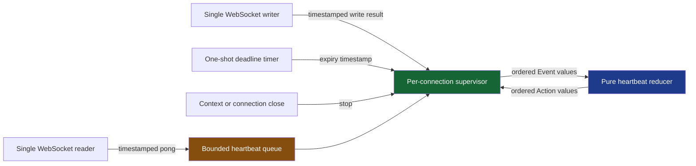
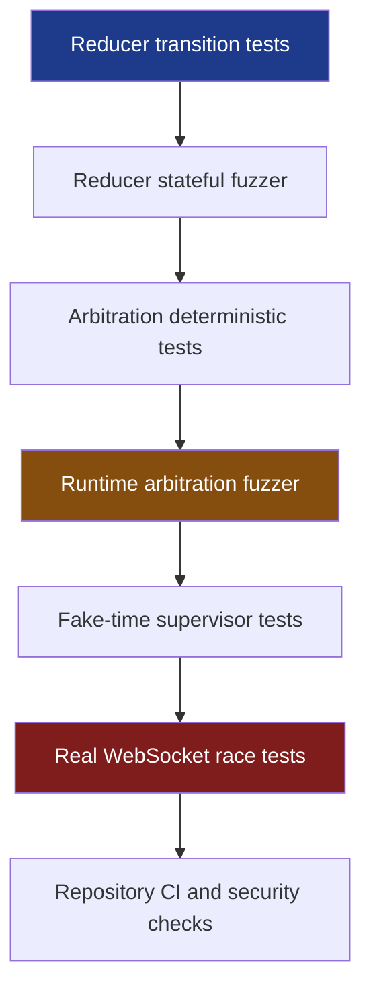

# Proving WebSocket Heartbeat Arbitration: From Review Counterexample to Seeded Runtime Fuzzing

A pure state machine can be correct for every event sequence it accepts while the complete concurrent system remains wrong. The missing obligation lies in the adapter that converts independent reader, writer, timer, and shutdown occurrences into the ordered sequence seen by the machine. Sessionstream's WebSocket heartbeat exposed this distinction through a precise code-review counterexample: a timely pong was already admitted to the server, but an overdue write acknowledgement caused the supervisor to apply the deadline first and close the connection.

This report examines how the counterexample was converted into a production correction and a focused native Go fuzz harness. It explains why the existing reducer fuzzer could not detect the defect, how a shared deadline-arbitration operation closes the semantic gap, how the new seed proved sensitivity against the pre-fix behavior, and what 9.7 million post-fix campaign executions establish. The work is part of Sessionstream PR #11 and extends the architecture described in [[PROJECT REPORT - Sessionstream Heartbeats - From Ping Pong Loops to a Timed Failure Detector]].

> [!summary]
> - The reducer was not defective. The supervisor supplied a legal but incorrectly serialized event trace.
> - Both normal timer expiry and overdue-on-arm expiry now drain bounded, already-admitted heartbeat events through one production helper before applying a deadline.
> - The focused fuzzer contains the review execution as a checked-in seed. That seed failed immediately before the drain was implemented and passed afterward.
> - Post-fix validation completed a 60-second campaign with 877,473 executions and an uninterrupted ten-minute campaign with 8,837,183 executions, with no failure corpus.

## 1. The distinction that matters

Sessionstream's heartbeat has two layers. The pure detector defines legal state transitions. The supervisor owns concurrent runtime resources and chooses the order in which external occurrences reach the detector.



The reducer implements a deterministic function:

```text
Step : State × Event -> State × Action* + Error
```

It owns phases, generations, nonces, deadline arithmetic, stale-event handling, suspicion, and terminal behavior. It has no channels, timers, goroutines, sockets, contexts, observers, or protobuf values.

The supervisor implements a serialization function over a concurrent history:

```text
serialize : ConcurrentHistory -> Event*
```

This function is not written as one Go function. It is the combined behavior of buffered channels, a `select` loop, recursive action interpretation, timestamps, timer creation, and bounded queue draining. Its correctness condition is a refinement obligation: the concrete event trace must be permitted by the abstract heartbeat protocol.

The original reducer fuzz target validates `Step`. The review finding concerned `serialize`.

## 2. The counterexample

The heartbeat deadline begins when the writer reports local completion of `WriteMessage`, not when the ping is enqueued. Let:

```text
tw = writer-owned completion timestamp
tp = reader-owned pong timestamp
T  = configured PongTimeout
d  = tw + T
tr = time at which the supervisor resumes
```

The reported execution satisfies:

```text
tw < tp < d < tr
```

The writer completes the ping and sends a buffered `frameWriteResult`. The client receives the ping and answers. The reader decodes that pong, captures `tp`, and admits `PongReceived(tp)` to the bounded heartbeat queue. The supervisor remains descheduled long enough that the derived deadline passes.

At resume time, two sources are ready:

```text
writeAck channel:
    PingWritten(At=tw, Generation=g, Nonce=n)

heartbeat event queue:
    PongReceived(At=tp, Nonce=n)
```

Go may select the write acknowledgement first. The reducer then moves from `Writing` to `Awaiting` and emits:

```go
Action{
    Kind:       ActionArmDeadline,
    Generation: g,
    Nonce:      n,
    Deadline:   tw.Add(PongTimeout),
}
```

Before the fix, the supervisor interpreted an overdue action directly:

```go
delay := action.Deadline.Sub(s.heartbeatNow())
if delay <= 0 {
    apply(heartbeat.Event{
        Kind:       heartbeat.EventDeadlineElapsed,
        At:         s.heartbeatNow(),
        Generation: action.Generation,
    })
    continue
}
```

The reducer saw:

```text
PingWritten(tw, g, n)
DeadlineElapsed(tr, g)
PongReceived(tp, n)  // never processed before close
```

Given this ordered trace, entering `Suspected` was correct. The deadline matched the current generation, and its event timestamp was after the stored deadline. The reducer could not infer that another goroutine had already admitted a timely pong.

The correct runtime trace is:

```text
PingWritten(tw, g, n)
PongReceived(tp, n)
DeadlineElapsed(tr, g)
```

Because `tp < d`, the pong returns the detector to `Idle`. The later deadline is harmless in `Idle`.

## 3. Why existing protections were insufficient

### 3.1 Pending pong state covered another order

The detector already carried `PendingPongAt`. This field handles a client response that arrives before the supervisor applies writer completion:

```text
PongReceived -> PingWritten
```

While the machine is in `Writing`, a matching pong stores its earliest timestamp. When `PingWritten` arrives, the reducer derives the deadline and accepts that pending pong if it is timely.

The counterexample bypassed this mechanism because the supervisor selected:

```text
PingWritten -> immediate DeadlineElapsed
```

before reading the admitted pong. The reducer never received `PongReceived` while it was in `Writing`.

### 3.2 The timer branch already drained—but was not used

Normal timer-channel expiry already drained the bounded heartbeat event queue before applying its deadline. That code covered this order:

```text
deadline timer ready
pong queue ready
select chooses timer
```

The overdue-on-arm branch creates no timer. It expires recursively while interpreting `ActionArmDeadline`. Control never returns to the outer `select`, so timer-branch draining cannot run.

The implementation therefore had two paths for one semantic decision:

| Deadline origin | Previous policy |
|---|---|
| Timer channel becomes ready | Drain admitted pongs, then expire |
| Derived deadline already overdue when armed | Expire immediately |

The defect was semantic duplication, not merely a missing channel receive.

## 4. The production correction

Commit `5a1d9ebfe00e00b9712777d8a1db617753e6f00a` introduced one package-private operation:

```go
func applyHeartbeatDeadlineAfterAdmittedEvents(
    events <-chan heartbeat.Event,
    deadline heartbeat.Event,
    apply func(heartbeat.Event),
) {
    for range heartbeatEventQueueSize {
        select {
        case event := <-events:
            apply(event)
        default:
            apply(deadline)
            return
        }
    }
    apply(deadline)
}
```

The helper has a narrow contract:

1. It performs at most eight nonblocking receives, matching the queue capacity.
2. It applies every event it receives through the reducer's existing authority.
3. It applies exactly one deadline event after the drain reaches an empty observation or the work bound.
4. It does not inspect phase, nonce, generation, or timestamp itself.
5. It allocates no goroutine and creates no timer.

Both deadline origins now call this operation.

### 4.1 Overdue-on-arm

```go
case heartbeat.ActionArmDeadline:
    stopTimer(deadlineTimer)
    now := s.heartbeatNow()
    delay := action.Deadline.Sub(now)
    if delay <= 0 {
        applyHeartbeatDeadlineAfterAdmittedEvents(
            c.heartbeat.events,
            heartbeat.Event{
                Kind:       heartbeat.EventDeadlineElapsed,
                At:         now,
                Generation: action.Generation,
            },
            apply,
        )
        continue
    }
```

The code captures `now` once. This avoids constructing the delay and event from two different clock observations near the boundary.

### 4.2 Timer-channel expiry

```go
case at := <-deadlineC:
    deadlineC = nil
    applyHeartbeatDeadlineAfterAdmittedEvents(
        c.heartbeat.events,
        heartbeat.Event{
            Kind:       heartbeat.EventDeadlineElapsed,
            At:         at,
            Generation: deadlineGeneration,
        },
        apply,
    )
```

The duplicated drain loop is gone. Future changes to the arbitration rule have one implementation.

### 4.3 Why the helper does not filter pongs

The helper could search for one matching nonce and compare timestamps directly. It deliberately does not. Those checks already belong to the reducer:

```go
if event.Nonce != m.state.Nonce ||
   !event.At.Before(m.state.Deadline) {
    return stalePongAction(event), nil
}
```

Passing every admitted event through `Step` preserves one authority for:

- current versus stale nonce;
- strict before-deadline acceptance;
- phase legality;
- successful-pong actions;
- stale observation;
- generation-safe deadline handling.

After a successful pong, the helper still applies the selected deadline. The machine is now `Idle`, so the deadline event is a no-op. Suppressing it in the helper would duplicate phase knowledge outside the reducer.

## 5. The concurrency contract

### 5.1 Partial order and serialization

The reader and writer operate concurrently. Their channel sends have no total order unless one communication causally depends on the other. A timestamp records domain time, but a timestamp does not control Go channel selection.

The supervisor's job is not to sort every occurrence globally. Its narrower obligation is:

> Before applying a deadline decision, process heartbeat evidence already admitted to the bounded queue at that decision boundary.

The nonblocking receive/default selection supplies a practical linearization point. If an event is available for receive, it is applied first. When `default` is selected, the deadline decision is linearized before a later admission.

This does not establish that every remotely timely pong will be accepted. A reader may be descheduled before admission, the queue may overflow, or the network may delay the response. Heartbeat timeout remains suspicion under timing assumptions.

### 5.2 Safety properties

The correction establishes or preserves these safety properties:

```text
S1. Both deadline origins use one arbitration policy.
S2. A matching admitted pong with At < Deadline prevents suspicion.
S3. A matching pong with At >= Deadline does not prevent suspicion.
S4. A stale or empty nonce does not acknowledge the challenge.
S5. Duplicate pongs cannot erase earlier timely evidence.
S6. Draining terminates after at most queue capacity receives.
S7. Exactly one deadline event follows each arbitration operation.
S8. Stopped remains absorbing.
S9. Suspicion and close actions remain paired.
```

### 5.3 Bounded progress

The helper's work has a fixed upper bound:

```text
maximum drained events = 8
maximum reducer calls  = 9
blocking receives       = 0
additional goroutines   = 0
```

A producer may continue admitting events while draining occurs. The capacity bound prevents starvation. Events admitted after the deadline decision's empty observation are ordered after that decision.

## 6. Why the reducer fuzzer could not detect this defect

The existing `FuzzMachinePreservesInvariants` generates an ordered event trace. It mutates operations, identities, and times, then calls `Machine.Step` sequentially. It validates properties such as generation monotonicity, state shape, error atomicity, absorbing stop, and action pairing.

If it generates:

```text
PingWritten
DeadlineElapsed
PongReceived
```

then suspicion is the correct result. The fuzzer has no representation of:

- a pong waiting in a channel;
- a write acknowledgement waiting in another channel;
- both sources being ready simultaneously;
- the supervisor selecting one source first;
- recursive action interpretation bypassing the outer `select`.

Adding channels and scheduler dependence to that target would weaken its abstraction. The reducer fuzzer remains valuable precisely because it tests the deterministic transition kernel independently.

The new target tests a different function:

```text
arbitrate : AdmittedMailbox × DeadlineEvent -> ReducerOutcome
```

## 7. Designing the focused runtime fuzzer

The new target lives in:

```text
pkg/sessionstream/transport/ws/heartbeat_arbitration_test.go
```

Its name is:

```go
func FuzzHeartbeatDeadlineArbitration(f *testing.F)
```

It starts every execution from a valid reachable detector state:

```text
Ready(t0)
Tick(t1, nonce=current-nonce)
PingWritten(tw, generation=1, nonce=current-nonce)
```

This creates:

```text
Phase      = Awaiting
Generation = 1
Nonce      = current-nonce
Deadline   = tw + 5s
```

The harness then decodes at most eight bytes into pong events, fills a bounded channel, invokes the production arbitration helper, and checks the final reducer outcome.

### 7.1 Input encoding

Each event byte independently selects identity, time class, and a nanosecond delta:

```text
bits 0..1: identity
bits 2..3: time class
bits 4..7: boundary delta
```

Identity classes are:

```text
00 = current nonce
01 = stale nonce
10 = empty nonce
11 = future nonce
```

Time classes are:

```text
00 = before deadline
01 = exactly at deadline
10 = after deadline
11 = before write completion
```

The high four bits vary the distance from the boundary while keeping minimized inputs compact.

### 7.2 Independent oracle

The oracle does not duplicate the queue drain or reducer switch. It evaluates one predicate:

```text
exists event in admitted queue such that
    event has current nonce
    and event time is strictly before deadline
```

Pseudocode:

```go
wantPhase := PhaseSuspected
for _, raw := range input {
    if identity(raw) == current &&
       timeClass(raw) != atDeadline &&
       timeClass(raw) != afterDeadline {
        wantPhase = PhaseIdle
        break
    }
}
```

After arbitration, the harness checks:

- final phase equals the oracle;
- the channel is empty;
- successful traces contain one `ActionRecordPong`;
- successful traces contain no suspicion or close;
- unsuccessful traces contain exactly one suspicion/close pair.

The oracle is smaller than the implementation and has a different control structure. This limits correlated defects.

### 7.3 Checked-in seeds

Ten readable seeds cover:

1. empty queue;
2. timely current pong;
3. current pong exactly at deadline;
4. late current pong;
5. timely stale pong;
6. stale pong followed by timely current pong;
7. timely current pong followed by a late duplicate;
8. late current pong followed by a timely duplicate;
9. eight stale pongs;
10. seven stale pongs followed by a timely current pong in the final queue slot.

The final-slot seed proves that the fixed bound does not stop at seven receives.

## 8. Proving that the harness catches the bug

A fuzzer written only after the production fix may pass without demonstrating sensitivity to the original defect. The implementation sequence therefore included a controlled pre-fix experiment.

The package-private production seam was first routed into the overdue-on-arm branch with an intentionally incomplete body:

```go
func applyHeartbeatDeadlineAfterAdmittedEvents(
    _ <-chan heartbeat.Event,
    deadline heartbeat.Event,
    apply func(heartbeat.Event),
) {
    apply(deadline)
}
```

The baseline seed run failed immediately:

```text
--- FAIL: FuzzHeartbeatDeadlineArbitration/seed#1
Error: Not equal:
    expected: PhaseIdle
    actual:   PhaseSuspected
```

Other seeds failed because their queue entries remained undrained. This established three facts:

- the target called the production arbitration seam;
- the timely-pong seed represented the review counterexample;
- the oracle distinguished the defective outcome.

The incomplete helper was never committed. The bounded drain replaced it before the green code commit.

This test-first evidence is stronger than asserting that the final code passes. It records a counterexample for the old behavior and preserves it as a permanent baseline seed.

## 9. Campaign evidence

### 9.1 Seed and repetition validation

After the fix:

```text
Focused ordinary repetitions:      100 PASS
Focused race-enabled repetitions:  100 PASS
Full repository tests:             PASS
Full repository race:              PASS
Go vet:                             PASS
make ci-check:                      PASS
Pre-push test/lint/release:         PASS
```

### 9.2 Initial campaign

The first 60-second mutation campaign produced:

```text
Checked-in seeds:       10
Executions:             877,473
New interesting:        16
Total interesting:      26
Result:                 PASS
Failure corpus:         none
```

### 9.3 Ten-minute campaign

A later uninterrupted campaign reused the cached 26-input corpus:

```text
Baseline corpus:        26/26
Workers:                8
Executions:             8,837,183
New interesting:        0
Total interesting:      26
Elapsed:                600.122s
Result:                 PASS
Failure corpus:         none
```

Zero newly interesting inputs is expected for this target. Go reports an input as interesting when it expands coverage or another engine search signal. The helper and its reducer path have a small finite control-flow surface. The first campaign had already expanded the corpus from ten seeds to 26 cached inputs. The longer campaign continued mutating values and queue arrangements without finding new control-flow coverage or an invariant violation.

The campaigns do not prove correctness. They provide evidence that millions of generated identity, time, delta, order, duplicate, and queue-length combinations satisfy the stated oracle after the deterministic counterexample was corrected.

## 10. What was difficult

### 10.1 Testing scheduling without depending on scheduling

The concrete defect involved Go selecting one of two ready channels. A test based on repeated `select`, sleeps, or `GOMAXPROCS` would be probabilistic. It could pass because the scheduler chose the safe order.

The extracted arbitration function converts scheduler state into explicit test data. The channel contents represent events already admitted before the deadline decision. The fuzzer controls that mailbox directly. Real WebSocket race tests remain responsible for socket and goroutine integration.

This creates a layered validation structure:



### 10.2 Keeping the oracle independent

A second drain loop used as the expected-value implementation would reproduce the production control structure. The oracle instead classifies the finite admitted set mathematically. Its only domain rule is current identity plus strict timestamp precedence.

### 10.3 Preserving one authority for transition semantics

The arbitration layer orders events but does not decide whether they are valid. Nonce matching, deadline equality, phase behavior, and generation safety stay in the reducer. This prevents a runtime helper and state machine from developing different definitions of timely acknowledgement.

### 10.4 Maintaining a green commit history

The known-defective helper was executed locally to capture failure and then replaced before staging. The code and tests entered history together in a passing commit. Detailed diary records preserve the pre-fix failure without placing a red commit on the review branch.

## 11. Failure and correction log

The work exposed one implementation-level lint failure after the successful 60-second campaign:

```text
pkg/sessionstream/transport/ws/heartbeat_arbitration_test.go:204:2:
ineffectual assignment to at (ineffassign)
```

The decoder initialized `at` before a switch in which every branch replaced it. Changing the declaration to:

```go
var at time.Time
```

removed the ineffectual assignment. Lint and full CI then passed.

An initial ten-minute campaign attempt was interrupted at approximately 6m21s by a user question. It had completed roughly 5.59 million executions without failure. That partial run was not reported as the final campaign. A fresh uninterrupted ten-minute campaign produced the 8,837,183-execution result above.

## 12. Commit and documentation structure

The work was separated into reviewable commits:

| Commit | Purpose |
|---|---|
| `174f829` | Design supervisor arbitration and runtime fuzzing |
| `5a1d9eb` | Implement shared deadline arbitration and focused fuzzer |
| `68aa6c5` | Record pre-fix reproduction and initial campaign |
| `86f7616` | Record complete ten-minute campaign |

The implementation guide is:

```text
ttmp/2026/08/10/
  SESSIONSTREAM-005--timed-failure-detector-and-websocket-heartbeat-state-machine/
    design-doc/
      03-intern-guide-to-heartbeat-supervisor-event-arbitration-and-runtime-fuzzing.md
```

The chronological evidence is in:

```text
reference/01-investigation-diary.md
```

The P1 PR review thread was answered with the pre-fix seed result, implementation commit, campaign evidence, and validation commands, then resolved.

## 13. Reusable engineering rules

This work produces several rules for systems that combine pure models with concurrent adapters.

- A correct state machine does not establish that its runtime adapter constructs valid traces.
- Test the serialization boundary separately when concurrent sources feed one reducer.
- Represent a known scheduler counterexample as deterministic mailbox or schedule data.
- Put the known defect in the checked-in seed corpus so baseline execution remains a regression test.
- Demonstrate pre-fix sensitivity before trusting a new fuzz target.
- Keep the oracle smaller than the production operation and structurally independent from it.
- Centralize one semantic decision when multiple runtime paths produce the same abstract event.
- Let the reducer retain authority over phase, identity, generation, and time validity; let the adapter own ordering and effects.
- Bound queue draining so deadline processing cannot be starved by continuing producers.
- Combine deterministic tests, mutation campaigns, fake time, race-enabled integration, and full CI because each covers a different fault class.
- Treat coverage-interesting counts as a search-engine signal, not a semantic coverage metric.

## 14. Current status and next integration step

The implementation is pushed on:

```text
task/sessionstream-005-heartbeat-machine
```

The stacked pull request is:

```text
https://github.com/go-go-golems/sessionstream/pull/11
```

At the time of this report:

- the shared arbitration correction is committed;
- deterministic and fuzz coverage is committed;
- the ten-minute campaign passed;
- full local race and CI validation passed;
- all current PR #11 review threads are resolved;
- GitHub `check` and `lint` jobs passed after the latest documentation push;
- PR #11 remains stacked on Sessionstream PR #10.

The intended integration order remains:

1. Merge PR #10 into `main`.
2. Retarget PR #11 from `task/rag-ttc-ws-hardening` to `main`.
3. Confirm the retargeted diff contains only SESSIONSTREAM-005.
4. Merge PR #11 after checks and review are clean.
5. Publish one Sessionstream release containing both lifecycle APIs and final heartbeat behavior.

## 15. Source map

Repository:

```text
/home/manuel/workspaces/2026-06-30/benchmark-cpu-inference/sessionstream-p111
```

Primary implementation files:

| File | Responsibility |
|---|---|
| `pkg/sessionstream/transport/ws/heartbeat.go` | Supervisor, shared deadline arbitration, timers, event admission, and action interpretation |
| `pkg/sessionstream/transport/ws/heartbeat_arbitration_test.go` | Deterministic arbitration boundaries and focused native Go fuzzer |
| `pkg/sessionstream/transport/ws/internal/heartbeat/machine.go` | Pure detector phases, events, actions, identity, and time semantics |
| `pkg/sessionstream/transport/ws/internal/heartbeat/machine_test.go` | Reducer transition tests and state-aware reducer fuzzer |
| `pkg/sessionstream/transport/ws/server.go` | Socket reader/writer ownership and timestamped write completion |
| `pkg/sessionstream/transport/ws/server_test.go` | Fake-time and real WebSocket integration coverage |

## 16. Closing analysis

The review counterexample was valuable because it identified an untested specification boundary. Sessionstream had explicit reducer semantics and substantial state-aware fuzzing, yet the complete system could still violate those semantics by supplying events in the wrong order. The correct response was not to add another reducer condition. It was to name the adapter obligation, centralize it in production, and test it at its own abstraction level.

The final design remains small. One bounded helper processes admitted events before a deadline. Two runtime paths call it. One focused fuzzer generates the mailbox state that matters. The surrounding analysis is larger because concurrency correctness depends on precise distinctions among occurrence time, admission, selection, transition, and effect. Those distinctions now exist in code, tests, design documentation, diary evidence, and PR review history.

## Related notes

- [[PROJECT REPORT - Sessionstream Heartbeats - From Ping Pong Loops to a Timed Failure Detector]]
- [[sessionstream|Sessionstream — Event Protocols, Timelines, and Chat State]]
- [[Research/Software Architecture Garden/sessionstream/README|Architecture Garden — sessionstream]]
- [[PROJ - Sessionstream - Replay Store Remediation and Systemlab UI Refinement]]
- [[ARTICLE - Observer Instrumentation - Geppetto Pinocchio Sessionstream Deep Dive]]
- [[PROJECT REPORT - From Pattern Zoos to an Architecture Garden - A Shared Mathematical Vocabulary for Composable Systems]]
