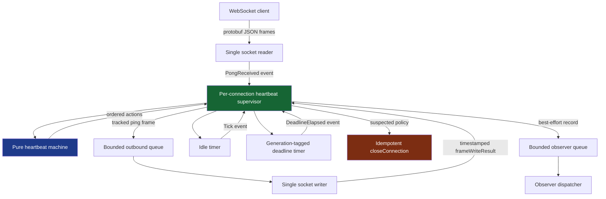
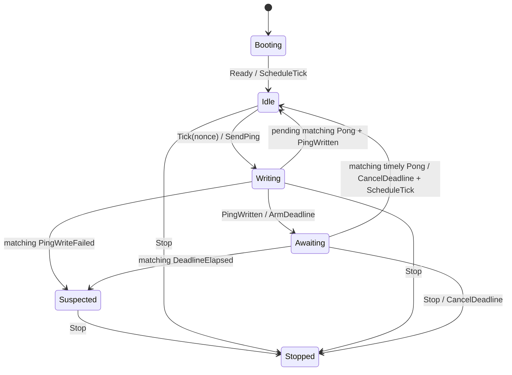

# Sessionstream Heartbeats: From Ping/Pong Loops to a Timed Failure Detector

A WebSocket heartbeat appears to require three operations: send a ping, receive a pong, and close the connection when the pong does not arrive soon enough. That description omits the timing and concurrency boundaries that determine whether the implementation is correct. A production server must distinguish a scheduled ping from a ping actually written to the socket. It must continue reading control traffic while authorization or snapshot hydration blocks. It must reject stale responses without discarding a valid current response. It must define what happens when a pong and its deadline become ready concurrently. It must shut down every worker without letting diagnostic callbacks control transport liveness.

The work recorded in `SESSIONSTREAM-005` replaced Sessionstream's ad hoc heartbeat loop with a pure timed failure-detector state machine and one per-connection supervisor. The implementation preserves the existing protobuf-JSON ping/pong contract while making phase, challenge identity, write completion, deadline identity, stale input, suspicion, observation, and shutdown explicit. It also strengthened the test system with deterministic virtual time, exhaustive transition coverage, repeated race runs, and a state-aware native Go fuzzer.

This report explains the system from first principles, follows the implementation as it evolved, and examines the concurrency failures that forced the final design. It is a companion to the broader [[sessionstream|Sessionstream project map]], the [[Research/Software Architecture Garden/sessionstream/README|Sessionstream Architecture Garden study]], and [[PROJ - Sessionstream - Replay Store Remediation and Systemlab UI Refinement|the earlier replay and Systemlab remediation report]].

> [!summary]
> - A heartbeat timeout does not prove that a client failed. It changes the connection to **suspected** under a configured timing assumption; Sessionstream's policy then closes the connection.
> - The mathematical core is a pure reducer: `(state, event) -> (next state, ordered actions)`. It owns no sockets, timers, channels, contexts, observers, protobuf messages, or goroutines.
> - The runtime core is one per-connection supervisor. It serializes reader events, writer completion, idle timers, deadline timers, state transitions, and effects while preserving one socket reader and one socket writer.
> - Correctness required distinguishing network visibility from local `WriteMessage` return, preserving a pending pong while write completion was unselected, and draining admitted pongs before applying a simultaneously ready deadline.
> - Verification combines exhaustive transition tests, deterministic fake-time tests, repeated race-enabled integration tests, and state-aware fuzzing. A 60-second fuzz campaign completed 111,066 executions without finding a violation.

## 1. Why the project existed

The immediate trigger was a sequence of valid code-review findings on Sessionstream's WebSocket lifecycle hardening. Each correction exposed another interaction among heartbeat timing, connection registration, hello ordering, request hydration, observers, queues, and shutdown. Browser clients initially did not answer application-level heartbeats. Snapshot hydration could block pong decoding. A pong timeout could begin before the ping reached the wire. Blocking observers could delay control processing. A stale one-slot pong buffer could discard a newer valid response. These were not independent defects. They were consequences of an implicit lifecycle model distributed across goroutines and channels.

The server already had several sound boundaries:

- one goroutine called `ReadMessage`;
- one goroutine called `SetWriteDeadline` and `WriteMessage`;
- ordinary subscribe and unsubscribe requests were processed in order by a dedicated worker;
- hello was written before heartbeat and request producers became ready;
- outbound and request queues were bounded;
- connection close was idempotent;
- `Server.Close(ctx)` could honor a deadline while connection work was still unwinding.

The heartbeat logic did not have an equally explicit owner. Its state was encoded indirectly in a ticker, a one-slot `pongs` channel, a per-cycle timer, an outbound write acknowledgement, `ready`, `done`, the connection close flag, and the current control flow of the heartbeat goroutine. A reviewer could determine the current phase only by reading which goroutine was blocked on which channel.

The design question therefore changed. The project stopped asking how to patch the next ping/pong edge case and asked:

> What is the smallest explicit machine that describes heartbeat semantics, and how should the WebSocket runtime interpret that machine without reintroducing scheduler-dependent behavior?

That question produced ticket `SESSIONSTREAM-005 — Timed Failure Detector and WebSocket Heartbeat State Machine` under:

```text
/home/manuel/workspaces/2026-06-30/benchmark-cpu-inference/sessionstream-p111/
  ttmp/2026/08/10/
    SESSIONSTREAM-005--timed-failure-detector-and-websocket-heartbeat-state-machine/
```

The ticket contains the intern implementation guide, the investigation diary, the fuzzing design, tasks, decisions, and validation evidence. All thirteen ticket tasks are complete.

## 2. Heartbeat as failure detection

### 2.1 Silence is ambiguous

A server that has not received a pong cannot directly determine why. The observable condition is compatible with several executions:

1. the client process terminated;
2. the browser event loop is blocked;
3. the outbound ping was delayed locally;
4. the network delayed or dropped the ping;
5. the network delayed or dropped the pong;
6. the server received the pong but delayed its own read loop;
7. the server decoded the pong but delayed the heartbeat coordinator;
8. the host scheduler paused one or both processes.

These executions produce the same immediate evidence: no accepted matching pong before a local deadline. The detector therefore cannot establish a proof of remote failure. It establishes **suspicion** relative to assumptions about local scheduling, network delay, client processing, and configured timeout.

For one challenge written at time `ts`, let the relevant response delay be:

```text
Dtotal = Dnetwork-out
       + Dclient-dispatch
       + Dclient-response
       + Dnetwork-in
       + Dserver-read
       + Dsupervisor-admission
```

A fixed-threshold detector expects healthy executions to satisfy:

```text
Dtotal < PongTimeout
```

Sessionstream's policy is intentionally direct: when the detector becomes suspected, close the connection. The client may then reconnect and hydrate from an authoritative snapshot. The policy is operationally useful even though the detector is epistemically imperfect.

### 2.2 Why the timeout begins after write completion

The server maintains a bounded outbound queue. If a heartbeat timeout begins when a ping is scheduled or enqueued, local queue delay consumes the client's response budget. That produces a false accusation for work controlled by the server.

The implementation therefore uses two distinct states:

```text
Writing  = the challenge has been admitted to the writer path
Awaiting = the writer reported completion and the response deadline exists
```

The deadline is defined by:

```text
Deadline = WriteCompletionTime + PongTimeout
```

This rule does not claim that bytes first become visible to the peer at local function return. A peer may receive and answer data before the local `WriteMessage` call returns. Local completion is a conservative and observable origin for the timeout, not a lower bound on peer response time. That distinction became central during stress testing.

### 2.3 Application-level heartbeat

RFC 6455 defines WebSocket Ping and Pong control frames, but browser JavaScript does not expose an API for originating arbitrary control frames. Sessionstream therefore retains application-level protobuf messages:

```protobuf
message PingFrame {
  string nonce = 1;
}

message PongFrame {
  string nonce = 1;
}
```

The wire representation remains ordinary protobuf JSON:

```json
{"ping":{"nonce":"n-1"}}
{"pong":{"nonce":"n-1"}}
```

The shared browser helper in `cmd/sessionstream-systemlab/static/js/websocket.js` responds by echoing the opaque nonce. This makes heartbeat behavior visible to browser code, Go clients, Goja applications, observers, and tests without changing the public transport schema.

## 3. The architecture after the refactor

The completed implementation has two layers with different responsibilities.



The layer boundary is strict:

| Pure machine owns | Supervisor owns |
|---|---|
| legal phases | goroutine and select loop |
| generation and nonce matching | nonce generation |
| deadline arithmetic | timer creation and cancellation |
| stale-event rules | bounded event admission |
| suspicion transition | protobuf frame construction |
| ordered action requests | writer queue and acknowledgement |
| absorbing stop semantics | observation and connection close effects |

The machine does not know Sessionstream connection IDs, protobuf message types, Gorilla WebSocket APIs, queue capacities, observer callbacks, or cancellation channels. The supervisor does not decide state transitions independently; it converts external occurrences into typed events and interprets returned actions.

## 4. The pure state machine

### 4.1 State, events, and actions

The implementation lives in:

```text
pkg/sessionstream/transport/ws/internal/heartbeat/machine.go
```

Its state is small enough to inspect as one value:

```go
type State struct {
    Phase         Phase
    Generation    uint64
    Nonce         string
    WrittenAt     time.Time
    Deadline      time.Time
    PendingPongAt time.Time
}
```

`Generation` is local challenge identity. `Nonce` is wire challenge identity. They solve related but different problems. The nonce associates a client response with a ping. The generation associates local write results and timer events with the current challenge even if old timer or writer events arrive late.

The phase set is:

```go
const (
    PhaseBooting Phase = iota
    PhaseIdle
    PhaseWriting
    PhaseAwaiting
    PhaseSuspected
    PhaseStopped
)
```

Inputs are explicit events:

```go
type Event struct {
    Kind       EventKind
    At         time.Time
    Generation uint64
    Nonce      string
    Err        error
}
```

Outputs are requested effects:

```go
type Action struct {
    Kind       ActionKind
    At         time.Time
    Generation uint64
    Nonce      string
    Deadline   time.Time
    Reason     error
}
```

The reducer has the form:

```text
Step : State × Event -> State × Action* + Error
```

The action result is a finite ordered sequence. It may request a tick schedule, ping write, deadline arm, deadline cancellation, observation, close, or stop. Errors represent invalid input conditions such as a missing nonce or a matching deadline event timestamped before the stored deadline.

### 4.2 Transition structure

The normal cycle is:



A healthy cycle waits `HeartbeatInterval` after readiness or a successful pong. It does not use a free-running ticker. A slow response therefore does not accumulate a tick that triggers an immediate catch-up ping.

### 4.3 Exact nonce and generation rules

A write completion affects `Writing` only when both identifiers match:

```go
func (m *Machine) matches(event Event) bool {
    return event.Generation == m.state.Generation &&
        event.Nonce == m.state.Nonce
}
```

A deadline affects `Awaiting` only when its generation matches. A pong affects `Awaiting` only when its nonce matches and its timestamp is strictly before the stored deadline:

```go
if event.Nonce != m.state.Nonce ||
   !event.At.Before(m.state.Deadline) {
    return stalePongAction(event), nil
}
```

The deadline boundary is explicit:

```text
pong time < deadline   => accepted
pong time = deadline   => stale
pong time > deadline   => stale
```

This rule prevents Go channel selection order from defining the protocol boundary.

### 4.4 Stop is absorbing

`Stopped` accepts no further transitions or actions. Stopping from `Awaiting` requests deadline cancellation before stop. Repeated stop, pong, timer, tick, and writer events after `Stopped` are harmless.

This property is simple but important. Connection shutdown produces late events naturally: a timer may already be ready, a writer acknowledgement may already be buffered, or a decoded pong may already be admitted. An absorbing terminal state removes the need for every producer to coordinate exact channel closure order.

## 5. The per-connection supervisor

The runtime adapter lives in:

```text
pkg/sessionstream/transport/ws/heartbeat.go
```

Each connection owns:

```text
one pure Machine
one heartbeat event queue, capacity 8
at most one idle timer
at most one deadline timer
at most one tracked write acknowledgement
one supervisor goroutine
```

The supervisor waits for the existing `ready` barrier before submitting `EventReady`. That barrier opens only after the hello frame has been written successfully. This enforces:

```text
heartbeat activity implies hello was written
```

The main loop selects among six sources:

```go
select {
case <-ctxDone:
    apply(EventStop)
case <-c.done:
    apply(EventStop)
case event := <-c.heartbeat.events:
    apply(event)
case at := <-tickC:
    apply(EventTick)
case result := <-writeAck:
    apply(PingWritten or PingWriteFailed)
case at := <-deadlineC:
    drain admitted pongs, then apply DeadlineElapsed
}
```

Only the supervisor calls `Machine.Step`. The reader and writer never mutate machine state. This single-owner rule removes data races from the state itself and makes every transition observable at one boundary.

### 5.1 Bounded pong admission

The reader constructs a `PongReceived` event and submits it to the per-connection queue:

```go
select {
case c.heartbeat.events <- event:
    return nil
case <-c.done:
    return fmt.Errorf("connection %s is closed", c.id)
default:
    return fmt.Errorf("connection %s heartbeat event queue full", c.id)
}
```

The queue is bounded. Overflow closes the connection through the normal read-loop failure path rather than silently losing a potentially current acknowledgement. This policy favors explicit failure over unbounded memory or false liveness.

### 5.2 Tracked writer completion

The outbound frame carries a buffered completion channel. The writer reports both the error and the timestamp captured immediately when write setup or `WriteMessage` returns:

```go
type frameWriteResult struct {
    at  time.Time
    err error
}
```

The supervisor converts that result into `PingWritten` or `PingWriteFailed`. The timestamp belongs to the writer, not to the later moment when the supervisor happens to select the channel. This preserves the deadline equation under scheduler delay.

## 6. The two event-ordering failures that shaped the final system

The most important implementation work occurred after the first architecture was already in place. Repeated race-enabled tests showed that a pure reducer is not enough if the runtime adapter serializes external events incorrectly.

### 6.1 A pong can precede local write return

The first implementation assumed this order:

```text
WriteMessage returns
supervisor receives PingWritten
client receives ping
client sends pong
reader receives PongReceived
```

The real order can be:

```text
writer enters WriteMessage
kernel makes bytes visible
client receives ping
client sends pong
reader admits PongReceived
WriteMessage returns
supervisor later receives frameWriteResult
```

The socket API's return is a local completion observation. It is not a global event fence between remote receipt and remote response.

If the reducer treated every pong in `Writing` as stale, a valid response could be discarded solely because the supervisor had not selected the write acknowledgement. The correction was `PendingPongAt`.

During `Writing`, a matching pong records the earliest timestamp:

```go
if event.Nonce == m.state.Nonce {
    if m.state.PendingPongAt.IsZero() ||
       event.At.Before(m.state.PendingPongAt) {
        m.state.PendingPongAt = event.At
    }
    return nil, nil
}
```

When the matching `PingWritten` arrives, the reducer computes the deadline from writer completion. If the pending pong is before that deadline, the cycle succeeds immediately without arming a timer.

Keeping the **earliest** pending matching response matters. A later duplicate must not overwrite timely evidence while the acknowledgement waits to be selected.

### 6.2 A ready timer must not outrank an admitted timely pong

Go's `select` chooses among ready cases without encoding protocol priority. At the deadline boundary, both of these channels may be ready:

```text
heartbeat event queue contains a timely matching pong
deadline timer channel contains its timestamp
```

If the timer case is chosen first and immediately transitions to `Suspected`, scheduler choice overrides event time. The reducer cannot correct that mistake because it never sees the queued pong first.

The supervisor therefore drains at most the bounded queue capacity before applying a selected deadline:

```go
for range heartbeatEventQueueSize {
    select {
    case event := <-c.heartbeat.events:
        apply(event)
    default:
        apply(deadlineEvent)
        deadlineApplied = true
    }
    if deadlineApplied {
        break
    }
}
```

This does not extend the deadline. Every pong still carries a timestamp, and the reducer rejects timestamps at or after the deadline. The drain only ensures that an event admitted before the timer is not ignored because `select` chose another ready case.

These two corrections establish a practical event-ordering rule:

> External concurrency must be serialized according to protocol identity and event time, not according to the order in which a coordinator happens to select ready Go channels.

## 7. Observer isolation

The old `TransportObserver` callback ran synchronously. Panic recovery protected the server from a callback panic, but it did not protect control processing from a callback that blocked. A blocked observer could delay read progress, writer acknowledgement, timeout setup, connection close, or shutdown.

The completed implementation uses one bounded server-level dispatcher:

```text
transport workers
  -> clone immutable TransportRecord
  -> nonblocking enqueue, capacity 1024
  -> single ordered observer worker
  -> callback with panic recovery
```

The public contract now says that observations are ordered and best-effort. They do not run on socket, heartbeat, request, or lifecycle critical paths. When the queue is full, the record is dropped and the counter exposed by `ObserverDroppedRecords` increases.

The queue admission and stop boundary are protected by `observerMu`. `Server.Close(ctx)` waits for connection workers, stops observer admission, drains accepted records, and waits for the dispatcher. A callback that never returns can still outlive the close deadline because Go cannot terminate an arbitrary goroutine safely. The close context bounds the caller's wait, and a later `Close` call can continue waiting for the same idempotent shutdown.

This is a deliberately bounded contract:

- transport correctness does not depend on observation;
- observation memory is bounded;
- callback execution remains ordered;
- accepted records are drained during graceful shutdown;
- callback bugs are isolated from control-path state mutation;
- dropped diagnostics are measurable.

## 8. Verification strategy

The project used several test layers because each layer protects a different boundary.

### 8.1 Exhaustive phase/event coverage

The machine has six phases and seven event kinds. The test suite evaluates every phase/event-kind combination, including combinations that are valid no-ops. This ensures that adding a new enum value triggers exhaustive-linter and test updates rather than silently falling through.

Focused tests cover:

- readiness and first tick scheduling;
- matching pong before deadline;
- pong exactly at and after deadline;
- stale pong and stale timer generations;
- matching deadline suspicion;
- early deadline atomic error;
- matching and stale write failures;
- pending pong before write acknowledgement;
- earliest duplicate pending pong;
- stop from an active deadline;
- monotone challenge generations.

### 8.2 Deterministic fake time

The supervisor test injects a fake clock, fake timers, and deterministic nonce source. It advances time explicitly to prove:

```text
idle interval fires
ping is queued
large time advance before write acknowledgement does not close
write acknowledgement creates the deadline
advancing exactly through the timeout closes
```

This test avoids millisecond sleeps for the central deadline-origin rule.

### 8.3 Interference tests

Real WebSocket integration tests block neighboring components deliberately:

- snapshot hydration blocks while pings and pongs continue;
- a transport observer blocks while the connection remains alive;
- the outbound writer remains backpressured before acknowledging a ping;
- server close races with upgrade and observer callbacks;
- hello ordering competes with immediate heartbeat scheduling.

The tests establish noninterference rather than only happy-path response.

### 8.4 Stateful native Go fuzzing

The first fuzzer mapped arbitrary bytes directly to event kinds but generated mismatched nonces so frequently that many traces entered `Writing` and stopped progressing. The improved target encodes three dimensions in each byte:

```text
bits 0..2: operation
bits 3..4: identity mode
bits 5..7: time mode
```

Operations include direct events plus a phase-sensitive `Advance` command:

```text
Booting  -> Ready
Idle     -> fresh Tick
Writing  -> matching PingWritten
Awaiting -> matching Pong immediately before deadline
Suspected or Stopped -> Stop
```

Identity modes generate current, previous, future/stale, and empty identities. Time modes generate next logical time, one nanosecond before deadline, exact deadline, one nanosecond after deadline, write time, duplicate time, timeout offset, and one-second offset.

The fuzzer checks:

- state shape;
- generation monotonicity;
- absorbing stop;
- atomicity of expected `ErrMissingNonce` and `ErrEarlyDeadline` errors;
- send, deadline-arm, successful-pong, suspicion/close pairing, and stop action contracts;
- a 4,096-operation bound per input.

Seven readable seeds cover two healthy cycles, pending pong, stale pong, early/exact deadline, write failure, stop while awaiting, and post-stop events.

The bounded campaign result was:

```text
baseline seeds:       7/7
workers:              8
executions:           111066
new interesting:      153
total interesting:    160
elapsed:              61.075 seconds
result:               PASS
```

No failure corpus was produced.

## 9. What repeated validation found outside heartbeat code

Full validation exposed two historical test-fixture problems. They were repaired because they prevented repository-wide race and repetition evidence from becoming trustworthy.

### 9.1 Unsynchronized hydration fixture

`testHydrationStore.Apply` mutated snapshot maps and cloned protobuf values while `Cursor` or `Snapshot` read them from another goroutine. Repository-wide `-race` identified both map and protobuf-message races. A shared `sync.RWMutex` now protects fixture snapshots, events, cursors, and errors.

This was not a production store defect. It was still important because a test fixture that races cannot validate a concurrent runtime reliably.

### 9.2 Cross-session GoChannel ordering

A repeated bus test asserted callback order across events from sessions `s-a` and `s-b`. The GoChannel consumer may interleave independent sessions. The meaningful law is per-session order. The corrected test filters records to `s-a` and asserts increasing ordinals only within that session.

This correction aligns with the product decomposition described in the [[Research/Software Architecture Garden/sessionstream/README#3. Product decomposition and noninterference|Sessionstream Garden study]]: independent session components may interleave, while one session requires a declared order.

## 10. Validation evidence

The final branch passed:

- `make ci-check`;
- format and golangci-lint;
- boundary and schema-vet checks;
- logcopter generation check;
- glazed-lint;
- full tests;
- generation and full build;
- 100 ordinary reducer seed runs;
- 100 race-enabled reducer seed runs;
- 300 focused race-enabled heartbeat integration repetitions;
- 100 full WebSocket transport race repetitions;
- repository-wide `go test -race ./...`;
- 100 ordinary and 20 race-enabled core Sessionstream package repetitions;
- `govulncheck ./...` with no reachable vulnerabilities;
- syntax checks for all shipped browser heartbeat clients;
- temporary `go.work` full tests and build;
- pre-push test, lint, and GoReleaser snapshot;
- 60-second native fuzzing.

The local `make gosec` invocation reported zero findings but exited nonzero because the locally installed scanner identified itself as `dev` and failed to load internal-package imports, including an existing Goja internal package. This is a scanner loader limitation, not a clean gosec pass. The branch still requires normal GitHub security checks after publication.

## 11. Commit structure and current status

The work was committed in implementation-sized intervals:

| Commit | Purpose |
|---|---|
| `1d1b0e9` | Initial timed failure-detector design |
| `d0693bf` | Pure reducer and compatibility fixtures |
| `dbfbf02` | Supervisor integration and observer isolation |
| `afe9496` | Writer timestamp and deadline event-order corrections |
| `1881225` | Concurrent test-fixture stabilization |
| `217ab0b` | Generated logging metadata for the new package |
| `0360020` | Pragmatic fuzzing design |
| `a7a49e4` | State-aware fuzzer implementation |
| `caadaf5` | Ticket closure after all tasks completed |

The completed work is on local branch:

```text
task/sessionstream-005-heartbeat-machine
```

It is based on Sessionstream PR #10 head `21724ab`, because that PR introduced the lifecycle APIs and hardened WebSocket behavior that this refactor replaces and consolidates. At the time of this report, the branch has not been pushed or merged. The implementation and ticket are complete; publication and PR integration remain repository operations rather than unfinished design work.

## 12. The resulting engineering rules

The project produced a compact set of rules that apply directly to timed connection-liveness protocols.

- A timeout establishes suspicion under timing assumptions; it does not prove remote failure.
- Start a response deadline from an observable I/O completion boundary, not from scheduling or queue admission.
- Do not infer protocol phase from goroutine blockage. Represent phase as state.
- Give local timers and write completions a generation identity independent of the wire nonce.
- Permit at most one outstanding challenge unless overlapping challenges are a deliberate protocol feature.
- Preserve a response that arrives before the coordinator selects write completion; remote receipt may precede local API return.
- Define the tie between a ready deadline and admitted response explicitly. Do not let `select` choose protocol semantics.
- Keep socket-reader and socket-writer ownership compatible with the WebSocket library contract.
- Keep authorization, hydration, and diagnostics outside the control path for heartbeat responses.
- Bound every queue and define overflow behavior.
- Make terminal state absorbing so late producers cannot restart lifecycle work.
- Test exact time boundaries with virtual time and concurrency integration with race-enabled real sockets.
- Use state-aware fuzz generation so random traces can traverse successful cycles as well as malformed input.

## 13. Where to read the implementation

Repository root:

```text
/home/manuel/workspaces/2026-06-30/benchmark-cpu-inference/sessionstream-p111
```

Primary files:

| File | Role |
|---|---|
| `pkg/sessionstream/transport/ws/internal/heartbeat/machine.go` | Pure phases, events, actions, reducer, and errors |
| `pkg/sessionstream/transport/ws/internal/heartbeat/machine_test.go` | Transition, boundary, state-aware fuzz, and property coverage |
| `pkg/sessionstream/transport/ws/heartbeat.go` | Supervisor, event queue, timers, nonce source, and action interpretation |
| `pkg/sessionstream/transport/ws/server.go` | Reader/writer lifecycle, tracked writes, connection registration, and close |
| `pkg/sessionstream/transport/ws/observer.go` | Bounded ordered observer dispatcher and dropped-record accounting |
| `pkg/sessionstream/transport/ws/server_test.go` | Real WebSocket, fake-time, hydration, observer, shutdown, and race regressions |
| `proto/sessionstream/v1/transport.proto` | Stable application-level ping/pong schema |
| `cmd/sessionstream-systemlab/static/js/websocket.js` | Shared browser nonce echo |

Ticket documents:

| Document | Role |
|---|---|
| `design-doc/01-intern-guide-to-the-timed-failure-detector-and-websocket-heartbeat-state-machine.md` | Complete theory, architecture, APIs, phases, and implementation plan |
| `design-doc/02-pragmatic-stateful-fuzzing-plan-for-the-heartbeat-reducer.md` | Scoped fuzzing design and campaign result |
| `reference/01-investigation-diary.md` | Chronological failures, corrections, commands, commits, and review guidance |

## 14. Closing perspective

The final system is not correct because it uses a state-machine vocabulary. It is stronger because the implementation separates three forms of reasoning that were previously mixed:

1. **Protocol semantics** determine legal phases, identity matching, deadline boundaries, suspicion, and stop.
2. **Runtime serialization** determines how concurrent socket, writer, timer, and shutdown occurrences become an ordered event stream for the protocol.
3. **Verification** tests the reducer exhaustively, tests time deterministically, tests integration under real concurrency, and mutates stateful traces through native fuzzing.

Each layer exposed defects that another layer could not. Transition tests could not detect a supervisor selecting a timer before an admitted pong. Real-time tests could detect the disconnect but could not explain the legal state relation as precisely as the reducer. Fuzzing could combine stale identities and boundary times, but it could not replace the real socket and blocked-hydration tests. Repository-wide race execution found fixture defects outside the heartbeat package that focused tests could not reveal.

The practical result is a bounded and reviewable connection-liveness subsystem. Its wire contract remains small. Its state space is explicit. Its effects are interpreted at one runtime seam. Its observers cannot control transport progress. Its queue and timer resources are bounded. Its failure semantics are named accurately. Its test system records both mathematical boundaries and runtime interference.

## Related notes

- [[sessionstream|Sessionstream — Event Protocols, Timelines, and Chat State]]
- [[Research/Software Architecture Garden/sessionstream/README|Architecture Garden — sessionstream]]
- [[PROJ - Sessionstream - Replay Store Remediation and Systemlab UI Refinement]]
- [[ARTICLE - Instrumenting Sessionstream and Browser Streaming Debug Pipelines]]
- [[ARTICLE - Observer Instrumentation - Geppetto Pinocchio Sessionstream Deep Dive]]
- [[ARTICLE - Goja HTTP Composition - Mountable Handlers and Sessionstream WebSockets]]
- [[PROJECT REPORT - From Pattern Zoos to an Architecture Garden - A Shared Mathematical Vocabulary for Composable Systems]]
