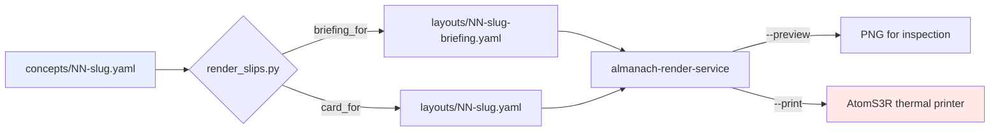

# Concept Study Slips

This note preserves two things that were built together on 2026-08-11: a system that turns the mathematical foundations of an Architecture Garden study into printed thermal slips, and a method for finding out whether the skill that documents that system actually works when someone else follows it. The second turned out to be the more valuable artifact. A skill author cannot evaluate their own instructions, because they read every sentence with the knowledge that produced it; three cold-start agents reading the same sentences found defects in twenty minutes that rereading would never have surfaced.

> [!summary]
> - A concept slip is worth printing only when it carries a law, a real code specimen from a pinned commit, and an explicit limit. Any two of the three produce a slogan.
> - One YAML file per concept renders two printed forms — a ~45cm briefing and a ~15cm card — so the wall copy and the study copy cannot drift apart.
> - Cold-start subagents are a practical instrument for skill evaluation: they reproduce what the instructions pin and diverge everywhere the instructions rely on prose. The divergence is the defect list.
> - The most expensive defect found was not a missing fact but a missing failure mode: nothing in the skill said that a hanging print means the printer is out of paper, so agents retried and produced roughly ten physical copies of one card.

## Why this note exists

The triggering work was [[Research/Software Architecture Garden/pbui/README|the PBUI Architecture Garden study]], which derives five mathematical foundations from a real repository and pins each to `file:line` evidence. Foundations stated that way are precise but inert. Pinned to a chalkboard, one per slip, they become something a person reviews daily.

The general lessons are independent of PBUI: how to convert an evidence-backed study into printable teaching material without inventing evidence, and how to test the resulting skill against readers who have none of the author's context.

## What a concept slip contains

A slip carries three things, and the discipline of the format is that all three are mandatory.

The **law** is a formula or a one-line rule, not a topic heading. `Offered = I ∩ S ∩ Q` is a law. "Scope handling" is not.

The **specimen** is three to five lines of code that exist at the pinned commit, verified by opening the file. This is the constraint that does the most work, because a study README names APIs and cites line numbers but contains no code. The specimen cannot be composed from prose; someone must open the repository at the commit the study names.

The **limit** is the substitution the law does not license. For scope intersection: the law is presentation policy, not authorization, and it does not stop a named application from mounting. A slip without a limit teaches false confidence, which is worse than teaching nothing.

Two supporting fields make the slips useful across projects rather than only within one. The `discipline` block states three things the concept **is** and three things it **is not**, rendered as a two-column table. The `vocabulary` block names the concept three ways:

```yaml
vocabulary:
  local: "ApplyMutations, Clone, Validate"      # what this repo calls it
  proposed: "graph batch transition"            # exactly one neutral name
  elsewhere: "transaction, fold, batch apply"   # what the wild calls it
```

The middle field is the join key. A reader who meets the same shape in a different codebase matches on the neutral name, not on the local identifier. It must hold exactly one name; two names defeat the matching, which is a rule that only became explicit after an agent wrote two.

## The harvest procedure

The division of labour between the study and the repository is fixed, and stating it explicitly is what makes the work mechanical rather than creative.

| From the study | From the repository |
|---|---|
| the law and its symbols | the function that implements it |
| the operational consequence | the code specimen |
| the limit | the observed behaviour: a test assertion or doc comment |
| the vocabulary table | who actually calls it |

Three details of that procedure repay attention.

**Read the doc comment before the code.** In a well-maintained repository the comment above a symbol carries the worked example, the rejected alternative, and the reason. The specimen for scope intersection came with its own case attached:

```
 * An empty result is possible — a stage offering `["signin"]` inside an instance
 * offering `["chart"]` — and it must not produce an unusable switcher. Replace
 * keeps the current application legal and Launcher shows its empty state.
 */
export function intersectScopes(...scopes: Scope[]): Scope {
```

That comment supplies a better concrete example than anything composable from the study's prose, and it was reused verbatim by five of the six agents that later worked the same concept.

**Grep for callers, excluding tests.** This step changes what the slip says more often than any other:

```bash
grep -rn "<Symbol>" --include="*.go" <repo> | grep -v _test.go
```

Applied to PBUI's `ApplyMutations`, it returns nothing outside the test files. The function is a library entry point for a host server that lives in a different repository, which `pkg/workbench/model.go:1-5` states directly: the package "deliberately contains no storage, HTTP, authentication, or UI code." A reader who does not know that will search for the call site for an hour. Absence is a finding and belongs on the slip.

**Never source a specimen from a hypothesis document.** The PBUI corpus includes a generated Pattern Zoo handbook with per-pattern pseudocode and worked examples. The study grades two of that handbook's patterns Negative. Lifting its pseudocode onto a slip would reprint, on paper, the exact confusion the study exists to correct.

## Two forms from one file

A concept file renders two layouts. The briefing runs about 45cm and answers why the thing exists, how it works, who calls it, and what will cost an afternoon. The card runs about 15cm and states the law, the discipline table, the vocabulary, and the specimen.

The briefing is the primary form. That ordering was learned rather than designed: the first version of the skill defaulted to the card, described the briefing as something to hand to other people, and marked it optional in the template. The result was that every agent that used the skill produced the compact form, including two that had already written a full briefing and then printed only the card.

The seven briefing sections, of which five are required:

| # | Label | Status |
|---|---|---|
| 1 | `WHY IT EXISTS` | required |
| 2 | `THE WHOLE FUNCTION` | required |
| 3 | `A DESIGN DECISION` | optional |
| 4 | *(a two-sided section, renamed for the content)* | optional |
| 5 | `WHO CALLS IT` | required |
| 6 | `TRAP` | required |
| 7 | `IF YOU ADD ONE` | required |

Both forms come from one YAML file. Written separately they would disagree within a month, and a wall that teaches a disagreement is worse than a wall with one slip on it.

## Implementation

The renderer is a single Python script that reads concept YAML and emits almanach layout YAML, which a rendering service converts to a 384-pixel-wide bitmap for the thermal printer.



Six printer constraints shape the emitted layout. Each was discovered by looking at a preview PNG, and none was visible in the YAML.

| Symptom in the preview | Cause | Fix |
|---|---|---|
| the code specimen reflows into a paragraph | `\n` does not break a line inside a `text` block | emit one block per code line |
| `IF (!INSTAGE \|\| INSTAGE.HAS(APP.ID))` | the `brutalist` theme uppercases everything | `style: { textCase: none }` on code and formulas |
| a phonetic spelling and an example sentence nobody wrote | the `word` block invents them when the fields are absent | set them to `""` or avoid the block |
| checkbox labels broken across the column gutter | `checks` defaults to two columns | `columns: 1` |
| empty boxes where `∩ ⊆ ⇀` belong | Archivo lacks the glyphs | `font: "'DejaVu Sans', sans-serif"` |
| a column of shouting paragraphs | brutalist body case applied to prose | labels uppercase, prose mixed case |

The last one is a legibility judgment rather than a rendering bug. Long passages of capital letters are slower to read, so the briefing renderer keeps section labels uppercase and drops paragraph text to mixed case:

```python
if section.get("text"):
    # Labels stay brutalist; paragraphs drop to mixed case, because a
    # screen of all-caps prose is slower to read, not louder.
    blocks.append({"id": f"{p}-b{n}-text", "type": "text",
                   "data": {"text": section["text"].strip(), "preset": "body"},
                   "style": {"textCase": "none"}})
```

Paper length is predictable at roughly ten pixels of strip per word, plus block overhead. At 384 pixels wide and 203 dots per inch, 1150 pixels is 14.5cm. A 1000-word explanation printed unedited is two metres of paper, which is why condensing a briefing to about 400 words is a design constraint and not a stylistic preference.

## Validating the skill with cold-start agents

The evaluation method is simple to state. Launch several small-model agents, give each only the path to the skill and a one-line task, isolate each in its own scratch directory, and require a blunt critique naming the specific instruction that failed. Then compare the outputs against each other and against the author's own version of the same artifact.

The comparison is the instrument. Where agents converge, the instructions pin the outcome. Where they diverge, the instructions rely on prose that reads as sufficient to its author and is not.

Two design details matter, and the first run got one of them wrong.

**Isolate the answer, not just the output.** The first run told agents not to *write* to the existing `concepts/` directory. It did not tell them not to read it. One agent read the author's finished concept file for the same topic and reproduced its `discipline` rows word for word. That agent's apparent agreement measured nothing. The second run forbade reading the directory at all.

**Do not name the thing you are testing.** The first run asked for "the card form," which is why no agent printed a briefing, which made the run unable to answer the question that mattered. The second run named no form and let the default decide.

## What the first run found

Three agents, cold start, same task. All three read `SKILL.md`, then `PLAYBOOK.md`, then `CONCEPT-TEMPLATE.yaml` within their first seven turns, so the intended reading order held. After discarding the contaminated agent, the two clean runs split along a sharp line.

They agreed on everything the evidence pinned: both found `useAvailableApps()` at `AppScope.tsx:125-142`, both quoted real code rather than paraphrase, both stated the law correctly, both placed authorization in the "is not" column, both used the `["signin"]`/`["chart"]` case from the doc comment.

They agreed on nothing the skill left to judgment. The discipline rows shared no phrasing. One wrote the symbol column as `I`, the other as `I ⊆ U`. Titles came out as `Scope intersection` and `Monotone Intersection`, neither matching the study's term. One specimen was four lines of the filter; the other was eight lines including the `new Set(...)` setup, several over the width limit. One wrote a briefing; the other wrote none.

The most expensive defect was not in the content at all. The printer ran out of paper mid-run. The render service reports healthy regardless, because it cannot see the paper, so the print calls hung until timeout. Nothing in the skill described that failure mode, so agents retried — and queued jobs land once paper returns. Roughly ten copies of one card came out of the printer.

## Reading the transcripts

Agent self-reports are useful and unreliable. One agent reported that the renderer prints a success line even when the print fails; the script raises before reaching that line, and the transcript's non-zero exit codes confirm it. The underlying complaint was still valid — the script swallowed stdout, so the `status_code: 200` the playbook told readers to look for never appeared — but the specific claim was wrong.

The transcripts settle such questions. Claude Code subagent transcripts are ordinary JSONL and convert directly:

```bash
go-minitrace convert claude-code --source-list sources.txt --output-dir ./archives
QR=~/.claude/skills/transcript-doc-friction-analysis/query-commands
go-minitrace query commands --query-repository $QR docmetrics doc-consumption \
  --archive-glob './archives/active/*/*.minitrace.json' --output json
```

The `doc-consumption` verb reported which skill files each agent read and at which turn. Two findings came only from there. One agent read `render_slips.py` itself at turns 42 and 44, which means the script's command-line interface was undocumented and had to be recovered from source. The same agent loaded the separate `almanach-printing` skill at turn 58, after its prints failed, and used the direct printer-IP fallback at turn 62 to succeed — a recovery path the concept-slip skill never mentioned.

The contamination was found the same way, by scanning tool-call inputs for reads of the `concepts/` directory rather than by trusting anyone's account of what they had consulted.

## The fixes

Ten changes across the four files, ranked by the evidence supporting them.

The briefing became the primary form: listed first, its seven sections named in `SKILL.md` itself rather than only in the playbook, five marked required, and `--form both` made the default. The template line reading `# --- the briefing (optional; omit and the card still renders) ---` became `REQUIRED`, and a concept file without one now produces a loud error and a non-zero exit rather than a silent skip.

A printing troubleshooting section was added, leading with the paper failure and forbidding blind retries:

```python
PAPER_HINT = ("a print that hangs or times out almost always means the printer is OUT OF PAPER "
              "or off the network — check the paper, then the /health endpoint. "
              "Do NOT blind-retry: queued jobs land later, so each retry is another physical copy.")
```

The script now captures print output, echoes the `status_code`, and reports the real error with that hint instead of a traceback. A contradiction in the specimen rule — "verbatim" against "≤ 40 characters" — was resolved as **tokens verbatim, layout yours**: identifiers and operators exactly as in the source, re-wrapping allowed, elisions marked, renaming never. Test-finding recipes gained TypeScript and Python forms alongside Go. The title rule became "the study's own term, uppercased," and the join-key field became "exactly one name."

## What the second run proved

Three fresh agents, forbidden from reading the existing concepts, given no form to print.

| Measure | First run (A, B, C) | Second run (D, E, F) |
|---|---|---|
| title matches the study's term | 1 of 3 (the copied one) | 3 of 3 |
| briefing written | 2 of 3 | 3 of 3 |
| briefing printed | 0 of 3 | 3 of 3 |
| five required sections present | not applicable | 3 of 3 |
| both forms printed, `status_code: 200` | 0 of 3 | 3 of 3 |

Each agent renamed the optional two-sided section for its content — `OBSERVATION LEVELS`, `THREE CONSTRAINTS, INTERSECTED`, `THREE LEVELS, INTERSECTED` — which is what the instruction asked for, and kept the five required labels verbatim.

One defect survived, and it is a real one. The agents split on which implementation to cite. Two chose `useAvailableApps()` at `AppScope.tsx:125-142`, following the study's own citation. The third chose `intersectScopes(...scopes: Scope[])` at `AppScope.tsx:79-86`:

```ts
export function intersectScopes(...scopes: Scope[]): Scope {
  const present = scopes.filter((s): s is readonly string[] => s !== null);
  if (present.length === 0) return null;
  return present.reduce((a, b) => {
    const keep = new Set(b);
    return a.filter((id) => keep.has(id));
  });
}
```

That third choice is arguably the better one. `intersectScopes` is the n-ary intersection itself, `null` encodes "unconstrained," and unlike the hook it has direct unit tests, including the exact case the author's own slip quotes from a doc comment:

```ts
expect(intersectScopes(["chart"], ["signin"])).toEqual([]);   // stages.test.ts:510
```

The skill says to cite "the function that implements it" and says nothing about what to do when a law is implemented in layers — a pure function, a hook that calls it, and UI that calls the hook. Two agents independently reported the same gap, and one reported a related one: the specimen rule assumes procedural code, and gives no guidance when the invariant lives inside a `useMemo` closure where the isolated filter line reads as dead code.

## Working rules

- A slip needs a law, a specimen from the pinned commit, and a limit. Ship none of them alone.
- Open the repository at the commit the study names. A study gives pointers, never code.
- Read the doc comment before the code; it usually contains the worked example already.
- Grep for callers with tests excluded, and print the answer even when it is "nobody here."
- Generate every printed form from one source file.
- Look at the preview PNG before spending paper.
- A hanging print means paper or network. Diagnose before retrying; each retry is a physical copy.
- Test a skill by giving it to readers who have none of your context, isolate them from your answer, and do not name the behaviour you are measuring.

## Open questions

- Which layer to cite when a law is implemented in layers, and whether the answer is "the purest expression of the law" or "the entry point callers use." The same question decides which callers `WHO CALLS IT` should list.
- Whether the default should print both forms or only the briefing. Both is right when stocking a wall and reading the same concept; briefing alone halves the paper for routine use.
- How to state the specimen rule for functional and hook-based code, where the invariant is a composed filter inside a closure rather than a statement in a procedure.

## Artifacts

- Skill: `.pi/skills/concept-study-slips/` — `SKILL.md`, `references/PLAYBOOK.md`, `references/CONCEPT-TEMPLATE.yaml`, `scripts/render_slips.py`
- Concepts: `Research/Software Architecture Garden/pbui/concepts/` — seven concept files, three with briefings, generated layouts under `layouts/`
- Source repository studied: `/home/manuel/code/wesen/hyperslop-systems/pbui` at commit `c865ea5`

## Related notes

- [[Research/Software Architecture Garden/pbui/README|Architecture Garden — PBUI]] — the study these slips were derived from
- [[Research/Software Architecture Garden/README|Software Architecture Garden]]
