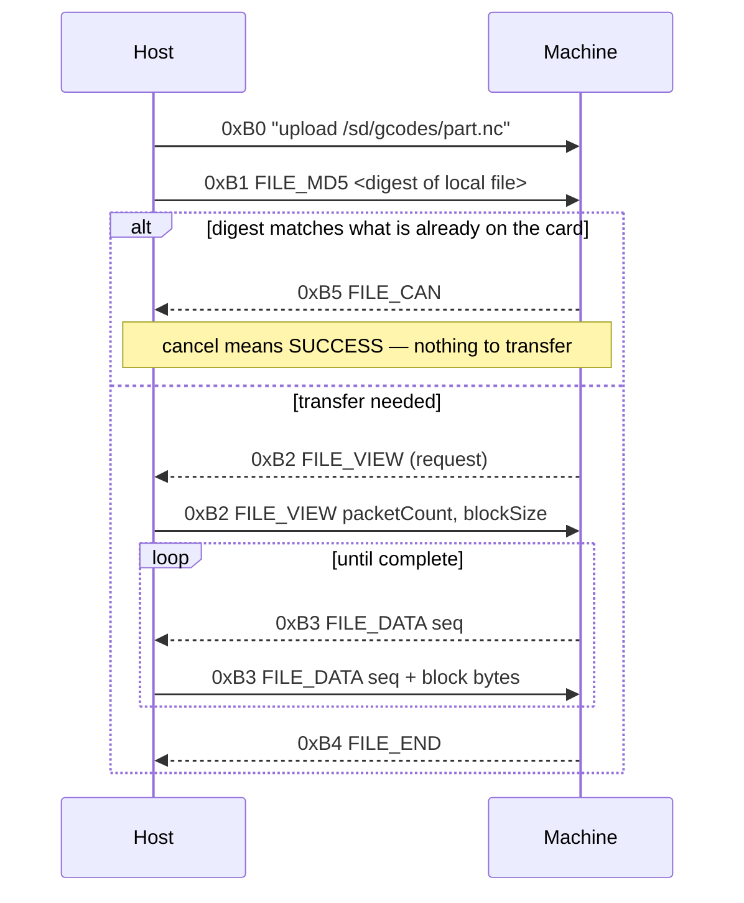

# Makera Z1 Control — Building and Validating the Client

The companion note [[PROJ - Makera Z1 Control - Reverse-Specifying a CNC Wire Protocol]] covers how the protocol was established: reading four open-source clients, writing a specification with a citation for every claim, and proving it offline before touching hardware. That note ends where the specification was validated and the implementation had not yet been written.

This note covers what happened next: a Go client, a web interface, and — the part worth reading — what a specification-derived implementation gets wrong when it finally meets the machine it describes.

> [!summary]
> Three results are worth carrying forward:
> 1. The **wire layer** was correct on first contact and stayed correct: zero frame-decoder failures across every session, including a 41-block file transfer. The **payload layer** was wrong in about a dozen places.
> 2. A single failure mode appeared three separate times in three unrelated features: **machine state changes are not immediately observable**. Each time it presented as a working operation reporting failure.
> 3. Safety is better modelled as **three risk classes** than as one. Motion, state-enabling and data-destroying commands deserve different treatment, and collapsing them produces either a dangerous tool or an unusable one.

## Why this project exists

The machine is a Makera Z1, a small enclosed three-axis mill whose only official client is a Kivy desktop application with no headless entry point and no scripting surface. The surrounding work is a CAM toolchain that can generate a `.nc` file but has no way to put it on the machine and run it. The missing half is a programmable control path.

The deliverable is `z1ctl`: a Go library and command-line tool that speaks the machine's native network protocol, structured so that both a terminal and a future interface consume the same machine state.

## Current project status

The repository is `/home/manuel/workspaces/2026-08-11/cnc-control-dropcut`, containing `glazed` (the CLI framework), `dropcut-studio` (the TypeScript CAM monorepo, which also hosts ticket documentation under `ttmp/`), and `makera-z1-cli` (the new Go module).

Working and verified against `Makera_Z1_012146`, firmware `1.0.15.0.1.11`:

- frame codec, both protocol dialects, autodetection
- UDP discovery, TCP transport, session with deterministic command completion
- status and diagnostic parsing, directory listings, checksums, coordinate-system queries
- the endstop and cover-interlock mapping, established by measurement
- alarm clearing, the first authorised command
- the framed file transfer in both directions, and the four filesystem operations
- a read-only hardware control page served from the binary

Not implemented: motion, job control, and the USB serial transport.

## The architecture that survived contact

### One reader, one mode

The machine accepts exactly one TCP connection. A status poller and a file transfer both need to read it, which is the central concurrency problem.

The reference implementation solves this by setting a paused flag and busy-waiting up to one second for its reader thread to acknowledge:

```python
self.pausing = True
self.paused  = True          # set immediately — do not sleep first
deadline = time.time() + 1.0
while not self._stream_io_parked and time.time() < deadline:
    time.sleep(0.01)
```

The comment above it explains the ordering constraint: setting `paused` after any sleep allows framed transfer packets to be consumed by the wrong reader.

The Go design removes the problem rather than mitigating it. The connection has exactly one reader goroutine, and ownership of the decoded frames is transferred by an atomic mode flag:

```go
func (c *Client) readLoop(ctx context.Context) {
    buf := make([]byte, 4096)
    for {
        n, err := c.tr.Read(buf)
        if err != nil { /* timeout is "nothing yet"; anything else ends the loop */ }

        if Mode(c.mode.Load()) == ModeTransfer {
            fp, ok := c.proto.(FramedProtocol)
            if !ok { continue }
            for _, f := range fp.FeedFrames(buf[:n]) {
                select {
                case c.frames <- f:
                case <-ctx.Done():
                    return
                }
            }
            continue
        }

        for _, m := range c.proto.Feed(buf[:n]) {
            c.dispatchControl(m)
        }
    }
}
```

There is never a second consumer, so there is nothing to lose a race to. The busy-wait disappears, and the ordering constraint that motivated it becomes unrepresentable.

The one hazard this introduces is the transfer driver failing to drain `c.frames`, which a buffered channel plus context cancellation handles.

### Knowing when a command has finished

The protocol has no request identifiers and no universal terminator. Three mechanisms exist, in order of preference.

Commands accepting the `-e` flag terminate their output with an end-of-transmission marker, which in the framed protocol is a `LOAD_FINISH` packet. This is deterministic and always preferred.

For commands with no `-e` form, the client sends the command and immediately follows it with `echo \x04`. When the sentinel returns, everything before it belongs to the earlier command, because the firmware processes its line queue in order. On hardware the sentinel arrives as a `NORMAL_INFO` frame carrying `echo: \x04\r\n`.

G-code commands additionally answer `ok`, which can be asserted after the sentinel arrives.

## Safety is three problems, not one

The initial design treated safety as a single question: can this command move the machine? That produced a guard which refused every verb capable of changing machine state. It was correct about motion and wrong about everything else, and running it against hardware made the failure obvious: `z1ctl info` reported `clock_epoch: 0` because the guard refused `time`, the command that reads the clock.

The distinction that resolves it is that `time` reports the clock and `time <epoch>` sets it. The verb alone does not determine the risk; the arguments do. The same is true of `wlan`, which lists networks bare and joins one with arguments.

Three classes emerged, each warranting different treatment:

| Class | Examples | Risk | Treatment |
|---|---|---|---|
| **Motion** | `$H`, `$J`, `G0`, `M3`, `M6`, `play` | Injury, broken tooling | Refused entirely. Not implemented |
| **State-enabling** | `$X` (unlock) | Commands no movement, but permits it | Distinctly named entry point, `--confirm`, full preflight |
| **Data-destroying** | `rm`, `mv`, `put`, `mkdir` | Data loss, no injury | No confirmation gate — typing `rm` is the intent — but each verifies its own effect |

The middle class is the interesting one. `$X` clears a latched alarm and issues no movement whatsoever, so refusing it outright is wrong. But it re-enables motion, so treating it as ordinary is also wrong. It gets its own method whose name carries the authorisation:

```go
// Unlock clears a latched alarm by sending the GRBL unlock command.
//
// Why this is safe to authorise while motion is not: `$X` clears the alarm lock
// and nothing else. It commands no movement.
//
// What it DOES do is re-enable motion, so callers must preflight first. This
// function does not preflight for you — that belongs at the call site, where
// the operator's intent is known.
//
// It never retries. If the alarm does not clear, that is information, and
// sending the command twice hides it.
func (c *Client) Unlock(ctx context.Context) ([]Message, error) {
    c.logger.Warn().Msg("sending $X to clear a latched alarm — this re-enables motion")
    return c.commandUnchecked(ctx, "$X")
}
```

The command layer supplies the preflight: the machine must actually be in `Alarm`, the emergency stop must be clear, the cover must be closed, and the halt reason must fall in the band an unlock can clear.

That last condition comes from the reference implementation's halt table, which encodes three recovery bands:

| Range | Recovery |
|---|---|
| < 20 | unlock clears it |
| 21–40 | reset required — hard limit, motor error, spindle stall, SD failure |
| > 40 | power cycle required — spindle alarm |

Unknown codes still route to the correct band, because the band is a property of the numeric range rather than of any individual code. A future firmware adding code 27 will correctly demand a reset rather than being offered an unlock that cannot work.

## The file transfer

### Control is inverted

The transfer reuses XMODEM vocabulary — sequence numbers, cancel, retry — but the machine drives it. After the host sends the initiation command, the machine decides what happens next and the host answers requests.



Three consequences follow, and each is a way an implementation can be quietly wrong:

- **Blocks may be requested out of order.** If the machine asks for a sequence number that is not the next one, the host must seek to `(seq - 1) * blockSize`. A forward-only stream produces a corrupt file on the first retransmission.
- **Cancel can mean success.** Treating `FILE_CAN` as an unconditional error turns the fastest path — the machine already has an identical file — into a reported failure.
- **The transfer and the status poller share one socket**, which is what the mode flag above exists for.

### Why a fake machine was necessary

Every one of those behaviours can only be *initiated by the machine*. A real Z1 will not request blocks out of order on demand, will not send a spurious `FILE_RETRY`, and will not return the malformed checksum that some firmware does. They are therefore untestable by driving real hardware, which is precisely backwards from the usual situation.

The test double implements the `Transport` interface and plays the machine side, with switches for each behaviour:

```go
type fakeMachine struct {
    file      []byte
    digest    string
    blockSize int

    cancelOnMD5       bool // pretend the digest matched: cache hit
    scrambleBlock     int  // serve this block once under the wrong sequence
    requestOutOfOrder bool // on upload, ask for the last block first
    retryOnce         bool
}
```

Eleven tests cover the happy paths in both directions, out-of-order blocks, retry, cancel-as-success, the 32-character-but-not-hexadecimal checksum placeholder, and compressed-payload detection.

The out-of-order test is the one that earns its place. It asserts not merely that the transfer completes, but that the block the machine asked for *first* contains the correct bytes — which is only true if the host seeked:

```go
firstAsked := m.askedOrder[0]
start := int(firstAsked-1) * m.blockSize
end := min(start+m.blockSize, len(file))
assert.Equal(t, file[start:end], m.received[firstAsked])
```

### Integrity

The checksum policy has three cases, in order:

1. The advertised digest is not 32 lowercase hexadecimal characters: skip the check. This is not excessive caution — some Z1 firmware answers with the literal string `default_md5_hash_value_32_bytes_`, which is exactly 32 characters long, so a length check accepts it as a digest.
2. The payload begins with two zero bytes: it is compressed, and the advertised digest describes the decompressed content. Verification is deferred and reported as skipped rather than failed.
3. Otherwise: require an exact match.

On this firmware the placeholder never appeared. Both a single-block and a 41-block download advertised genuine digests that matched, and an upload's digest read back correctly. The quirk documented upstream either does not apply to `1.0.15.0.1.11` or was fixed in it.

## The recurring finding: observability lag

The most useful result of the session is a failure mode that appeared three times, in three unrelated features, each time presenting as a working operation reporting failure.

**First, the alarm unlock.** After sending `$X`, the command queried status once and reported `cleared: false`. A manual check moments later showed the machine `Idle`. The unlock had worked; the query was simply faster than the state transition.

**Second, directory creation.** `mkdir` returned no error, and the immediately following directory listing did not contain the new directory, so the command reported failure. Listing the directory by hand showed it present. A second `mkdir` then returned `LOAD_ERROR`, because by that point it genuinely did exist.

**Third, nearly, the download.** The same single-shot verification pattern was written into the transfer's completion check and only avoided by accident, because that particular check reads a value carried in the frame rather than re-queried from the machine.

The general statement is that **a command's effect and a command's observability are separate events on this machine, and the gap between them is on the order of hundreds of milliseconds.** Any verification written as

```go
doThing()
if !observeThing() { return errors.New("failed") }
```

is a race that will report false failures.

The correction is to poll with a bounded deadline, and — critically — to re-read rather than re-send:

```go
// This re-reads status; it does NOT re-send the unlock. Motion commands are
// never retried, because re-sending a G0 after a timeout can execute the move
// twice.
after := before
deadline := time.Now().Add(unlockSettleTimeout)
for {
    st, err := c.QueryStatus(ctx)
    if err != nil { return err }
    after = st
    if st.State != "Alarm" || time.Now().After(deadline) { break }
    select {
    case <-ctx.Done():  return ctx.Err()
    case <-time.After(unlockPollInterval):
    }
}
```

The distinction between re-reading and re-sending is what keeps this compatible with the no-retry rule for anything that can move.

## What "absent" means

A second correction is worth recording because it is a reasoning error rather than a coding error.

An early session concluded that the halt-reason key `H:` was specific to community firmware, on the evidence that stock firmware did not send it. After the emergency stop was pressed during endstop mapping, the same machine, on the same firmware, began sending `H:13`.

The key was absent because nothing was halted. The conclusion confused evidence about **machine state** with evidence about **firmware capability**.

Any statement of the form "this firmware does not report X" requires the machine to have been in a state where X *would* have been reported. The same caution now attaches to two other keys: `P:` (playback progress) was absent only because no job was running, and `R:` (coordinate-system rotation) remains genuinely unobserved rather than ruled out.

## Measuring rather than assuming

The endstop vector illustrates the opposite discipline. The diagnostic report contains a field `E:` which published clients map to six values, the last being the cover interlock. Real firmware sends eight.

Two readings were possible. If the vector was *appended*, the published indices still hold. If it was *shifted*, an implementation reading index five as the cover would report a closed cover while it was open — the exact failure a safety interlock exists to prevent.

The question was settled by measurement rather than argument. A differential script polls the diagnostic report and prints only fields that change; an operator then triggers one physical input at a time:

```
     1.18s  V[1]  34 -> 33      (during "touch nothing" — self-drift, not an input)
     7.22s  E[5]   1 -> 0       cover OPENED
    15.31s  E[5]   0 -> 1       cover closed
    18.79s  E[5]   1 -> 0       cover opened again
    21.29s  P[1]   0 -> 1       tool setter touched
    35.28s  I[0]   0 -> 1       emergency stop pressed
    48.49s  E[5]   0 -> 1       cover closed
```

The vector is appended. The cover sits at index five exactly where published clients put it, and indices six and seven are additions that stayed constant. The concern was unfounded — but it was only *knowably* unfounded after measuring.

Two details from that same capture are worth noting. `V[1]` changed during the deliberate do-nothing baseline window, which identifies it as an analog value rather than a switch; it is now filtered as noise. And the four verbatim report lines became regression fixtures, so the mapping cannot be silently changed by a future edit:

```go
// These four lines are the empirical basis for reading E[5] as the cover bit;
// if this test is ever changed, the mapping must be re-measured on hardware,
// not reasoned about.
```

## Reporting what is not known

The preflight command renders three severities rather than two: `ok`, `warn` and `unknown`.

The third exists because of the endstop question. While the field order was unconfirmed, the cover check could not be performed at all, and the available options were to report success, report failure, or report that the check did not happen. Both of the first two are lies.

The accessor encodes this in its signature:

```go
// CoverClosed reports the cover interlock.
//
// The second return value is false when the machine did not send enough
// endstop fields to locate the bit. Callers gating motion on this MUST treat
// unknown as "do not proceed" rather than as "closed" — a preflight that
// cannot verify the cover has not verified the cover.
func (d Diagnose) CoverClosed() (closed, known bool)
```

A preflight that shows green for a check it did not run manufactures confidence, which is worse than showing nothing.

## The hardware control page

The client also serves a read-only telemetry page from the binary, styled from the CAM application's design tokens so the two surfaces read as one instrument.

Three decisions in it follow from the protocol rather than from web convention.

**One shared session.** The machine accepts a single TCP client, so the server holds one connection behind a mutex and serialises every request onto it. Several browser tabs share that connection rather than competing for it.

**Polling rather than a push channel.** The cost that matters is round trips to the *machine*, not to the server. Since the server already holds and serialises the single connection, a websocket would not reduce machine traffic; it would move the polling from the browser into the server and add a connection lifecycle to maintain.

**Motion controls rendered and disabled**, with the reason stated in the page. Omitting them makes the page look finished and leaves a user wondering where the jog controls are; including them live is not an option. Showing them greyed out with an explanation makes the project's actual state legible to whoever opens it.

## Verification summary

Everything below was run against `Makera_Z1_012146`, firmware `1.0.15.0.1.11`.

| Area | Result |
|---|---|
| Frame codec | **Zero decoder failures** across every session, including a 41-block transfer |
| Protocol detection | Three unframed probes drew silence, correctly yielding the framed dialect |
| Identity, status, diagnostics | Parsed, including two keys absent from every published client |
| Directory listing | Parsed, including directory marking and an inconsistent field separator |
| Download | 54 B single block; 328 kB across 41 blocks in 6.9 s; cache-hit path — all digest-verified |
| Upload | 173 B, digest read back and matched |
| Round trip | Downloaded copy byte-identical to the original |
| `mv`, `rm`, `mkdir` | All verified, inside a scratch directory removed afterwards |
| Alarm clearing | `H:13` cleared, machine returned to `Idle` |

The machine was left byte-for-byte as it was found: the scratch directory removed, all fourteen pre-existing entries untouched, and no axis ever commanded to move.

## Open questions

- What are the remaining halt-reason codes in practice? Only `13` has been observed.
- What do the two appended endstop fields at indices six and seven mean? Both were constant throughout the mapping session.
- What is the five-element `E:` vector in the *status* report? It is unrelated to the diagnostic vector of the same name and its values (`0,0,0,57,7610`) do not suggest an obvious reading.
- Does `play` accept `-O`, which the reference controller sends, or `-v`, which the firmware's own help documents?
- Why does `cat` return "File not found" for every file, including ones `ls` has just listed?

## Near-term next steps

1. A safety review of the motion rules by someone who operates the machine, before any motion code is written.
2. Motion and job control, behind the authorised-path pattern established by the unlock command.
3. Configuration read and write.
4. The USB serial transport, mainly as a recovery path.
5. The Z1 camera, which is served by the auxiliary wireless module independently of the control connection and so does not compete for the machine's single slot.

## Project working rule

The machine is treated as untrusted for reading and dangerous for writing. Parsers assume fields are optional, vectors grow, and unknown keys will appear. Commands that can produce motion are gated behind an explicit decision by a human standing next to the machine. Every mutation verifies its own effect rather than trusting a silent reply, and every verification allows for the fact that the effect and its observability are separate events.
