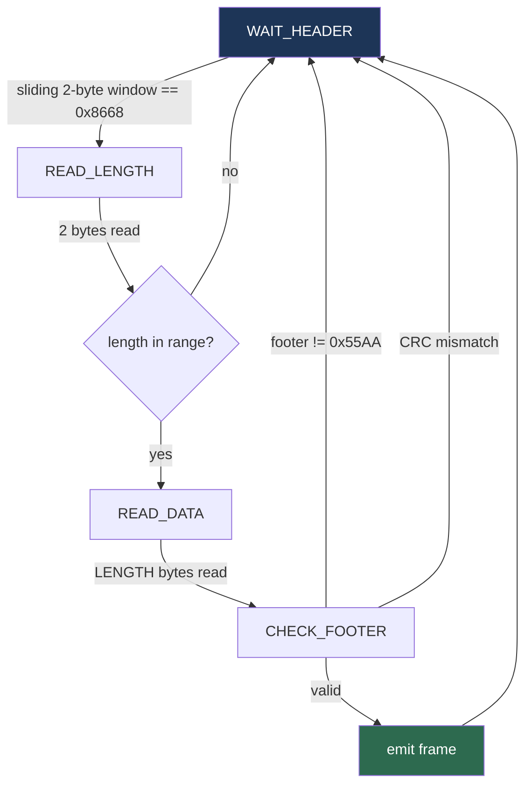
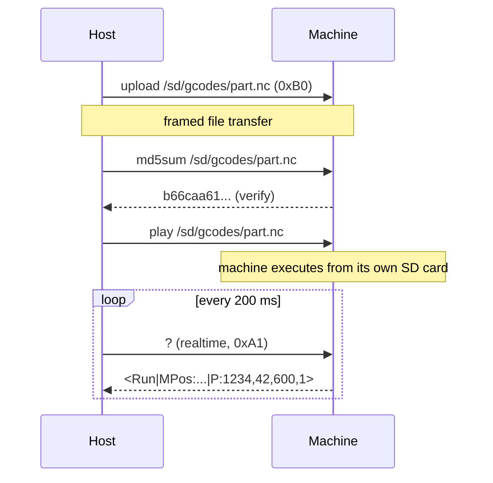
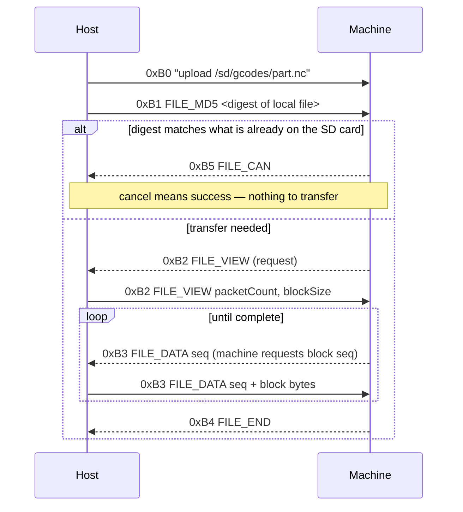
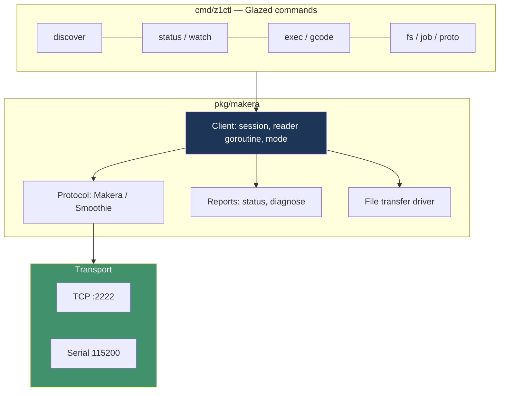

# Makera Z1 Control — Reverse-Specifying a CNC Wire Protocol

This project builds `z1ctl`, a Go command-line tool that speaks the Makera Z1's native network protocol directly, without going through Makera's Kivy desktop application. The work so far has produced three things: a complete written specification of the wire protocol, an implementation of that specification in Go that has been validated against a physical machine, and a design for the CLI that will eventually back a hardware-control web interface.

The interesting part of this project is not the CLI. It is the method by which the protocol was established, and the gap that opened between what the protocol looks like when you read someone else's client and what it looks like when you connect to the machine.

> [!summary]
> Three findings shaped everything else:
> 1. The Z1 does not stream G-code. Files are uploaded to its SD card and executed locally by the `play` command, so the host is a supervisor rather than a real-time feeder.
> 2. Two incompatible wire protocols exist on the same TCP port, and only two of the four public client implementations speak the one the Z1 uses.
> 3. A specification derived entirely from reading upstream source was correct about the framing and wrong about roughly a dozen payload formats. The framing survived contact with hardware; the payloads did not.

## Why this project exists

The machine is a Makera Z1: a small enclosed three-axis mill with an optional rotary axis, running firmware derived from Smoothieware on an ARM motion board, with an ESP32 acting as a Wi-Fi bridge. Makera ships a controller application written in Python and Kivy. That application is a graphical program, not a library. It has no headless entry point, no scripting surface, and no way to be driven from another process.

That matters because the surrounding work is a CAM toolchain (`dropcut-studio`, a TypeScript monorepo that generates toolpaths). A CAM system that can generate a `.nc` file but cannot send it to the machine, start it, and watch it run is only half a system. The missing half is a programmable control path.

The project therefore has two goals in sequence. First, establish what the protocol actually is, in enough detail that anyone can implement a client. Second, implement that client in Go as a Glazed CLI whose commands emit structured rows, so that both a human at a terminal and a future web interface can consume the same machine state.

## The problem: two protocols on one socket

The Z1 listens on TCP port 2222 and accepts exactly one client at a time. Older Carvera firmware speaks newline-delimited Smoothieware text on that port. Newer firmware, including everything on the Z1, wraps each command in a binary frame with a CRC. There is no version handshake. A client must determine which protocol it is talking to before it can say anything useful.

This is the first place where reading the available implementations pays off, and also the first place where it misleads. Four open-source clients exist:

| Project | Language | Licence | Speaks the framed protocol? |
|---|---|---|---|
| `Carvera-Community/Carvera_Controller` | Python / Kivy | GPL-2.0 | Yes |
| `MakeraInc/CarveraController` | Python / Kivy | GPL-3.0 | Yes |
| `hagmonk/carvera-cli` | Python | none stated in the repository | No |
| `GridSpace/carve-control` | Node | MIT | No |

The two that look most like the thing being built — a small CLI and a Node proxy — are legacy-text-only. Confirming this took one command:

```bash
grep -rn "8668" vendor/hagmonk-carvera-cli/src        # no output
grep -rn "8668" vendor/gridspace-carve-control/lib    # no output
grep -rn "8668" vendor/community-carvera-controller/  # protocols/framing.py:8
```

`0x8668` is the frame header magic. Its absence is conclusive. Neither of the permissively licensed clients can talk to a Z1 without substantial new code, which removes the option of porting one of them and makes writing the protocol down from scratch the only path.

## Current project status

The repository is `/home/manuel/workspaces/2026-08-11/cnc-control-dropcut`, containing:

- `glazed/` — the CLI framework
- `dropcut-studio/` — the TypeScript CAM monorepo, which also hosts the ticket documentation under `ttmp/`
- `makera-z1-cli/` — the new Go module, in progress

What exists today:

- A complete protocol specification with a file-and-line citation for every claim, in the MZ1-001 ticket under `dropcut-studio/ttmp/2026/08/11/`
- Four offline experiments that make the specification executable, all passing
- A live read-only probe that has been run against the physical machine
- A record of every place the machine disagrees with the specification
- The Go frame codec, with tests, passing
- A design for the CLI surface, with decision records

What does not exist yet:

- The framed file-transfer implementation, which is the highest-risk remaining component
- The web interface for hardware control
- Any code that has been permitted to move an axis

## The frame

Every command in the newer protocol is wrapped in the same structure. All fields are big-endian.

```
 ┌────────┬────────┬──────┬───────────────┬────────┬────────┐
 │ HEADER │ LENGTH │ TYPE │    PAYLOAD    │ CRC16  │ FOOTER │
 │ 0x8668 │  N+3   │  TT  │    N bytes    │  CCCC  │ 0x55AA │
 └────────┴────────┴──────┴───────────────┴────────┴────────┘
           └──────── CRC covers this ────────┘
```

Two details in this layout account for most implementation failures.

The first is the `LENGTH` field. It is natural to read it as the payload length, and it is not. It is `1 + len(payload) + 2` — the type byte, the payload, and the CRC. A client that writes the payload length there produces frames the machine silently discards, with no error and no reply. The upstream source states this plainly once, in an arithmetic expression:

```python
data_length = 1 + len(payload) + 2
```

The second is the CRC variant. It is CRC-16/CCITT with polynomial `0x1021`, but the initial value is `0x0000`, not `0xFFFF`. The `0xFFFF` variant is far more common and is what most libraries mean by "CCITT". The two produce entirely different output. The distinguishing check value is:

```
crc16("123456789") == 0x31C3     # init 0x0000, this protocol
crc16("123456789") == 0x29B1     # init 0xFFFF, CRC-16/CCITT-FALSE
```

A test asserting the check value is worth more than a comment, because it fails loudly when someone later "corrects" the initialisation to the more familiar constant.

The CRC covers `LENGTH + TYPE + PAYLOAD`. It does not cover the header or the footer, which is why those two constants can be used as synchronisation markers.

### Receiving frames

The receiver is a four-state machine consuming one byte at a time. It has to be, because the transport is TCP: a frame can be split at any byte boundary, and several frames can arrive in one read.



This design has a failure mode worth stating explicitly, because it is inherent to the protocol rather than to any particular implementation. There is no byte-stuffing and no escaping. If a payload or a run of garbage happens to contain the bytes `86 68` followed by a plausible length, the receiver locks onto that false header and consumes however many bytes the false length claims, discarding the real frames behind it. It recovers when the footer check fails, but the data in between is gone.

Nothing can be done about this at the protocol level. What can be done is to count it. The Go implementation increments a `Drops` counter on every rejected length, footer, or CRC, so that a desynchronisation appears in the logs as a number rather than as inexplicably missing output.

### The newline asymmetry

Three encoders exist, and they disagree about newlines in a way that is not arbitrary:

| Encoder | Packet type | Newline rule |
|---|---|---|
| Text command | `0xA2` | **Strips** trailing `\r\n` |
| File-transfer initiation | `0xB0` | **Appends** `\n` if absent |
| Legacy Smoothie text | n/a | **Appends** `\n` if absent |

The reason appears in a comment in the community controller: a trailing newline breaks the firmware's numeric parsers, because they use `strtol`, which requires the terminating character to be `\0`. The command `baud 115200\n` inside a length-delimited frame parses as a failure, because the newline is trailing garbage rather than a delimiter.

The general principle is that the framing already supplies the message boundary. Where the frame delimits, the newline is redundant and harmful. Where the newline delimits — the legacy protocol, and the file-transfer command that the firmware reads as a line — it is required.

## Protocol detection by silence

The detection procedure is the most elegant part of the protocol, and it is inverted from what a reader would guess. The client sends the bytes `echo echo\n` as raw ASCII, deliberately unframed, up to three times, waiting 100 milliseconds each time.

An older machine replies, because raw text is its native language. A newer machine sees no `0x8668` header, concludes the bytes are not a frame, and discards them silently. Silence is therefore the positive signal for the newer protocol, and the default on any failure is the newer protocol, which is the correct bias for new hardware.

Detection is not a one-time event. Two passive triggers also switch the active protocol mid-session: raw bytes containing `86 68` while the client believes it is speaking legacy text, and firmware announcements of the form `current communication protocol: makera`. Both are suppressed during file transfers, because binary transfer payloads can contain `86 68` by chance.

## The machine is not streamed G-code

This is the single most consequential behavioural fact about the Z1, and it inverts the architecture that a GRBL background would suggest.



In a GRBL system the host meters G-code lines into a small serial buffer, and a host stall starves the motion planner. Here the host uploads a file, issues `play`, and then only observes. The machine reads from its own filesystem. A host crash mid-job does not stop the job and does not corrupt the toolpath.

This makes the client dramatically simpler and safer than a streaming controller. There is no line-buffer accounting, no flow control, no real-time deadline on the host side. The client's responsibilities reduce to discovery, file transport, supervision, and manual data input.

## File transfer is driven by the machine

The transfer protocol reuses XMODEM vocabulary — sequence numbers, cancel, retry — but inverts control. After the host sends the initiation frame, the machine decides what happens next, and the host answers requests.



Three consequences follow from the machine holding control.

Blocks may be requested out of order. If the machine asks for a sequence number that is not the next one, the host must seek to `(seq - 1) * blockSize` and send from there. A forward-only stream implementation will fail on the first retransmission.

Cancel can mean success. If the digest the host advertises matches what is already on the SD card, the machine cancels the transfer. That is a cache hit, and treating `FILE_CAN` as an unconditional error turns the fastest path into a reported failure.

The receive loop and the transfer cannot share the socket naively. The status poller is reading the same TCP connection. Upstream solves this by setting a paused flag and busy-waiting up to one second for its reader thread to acknowledge. The Go design instead gives the connection exactly one reader goroutine and an explicit mode flag, so the transfer driver takes ownership of the frame stream without a second consumer ever existing.

## Machine state: one grammar, two reports

Both the status report and the diagnostic report use the same shape:

```
<STATE|KEY:v,v,v|KEY:v|...>        reply to the realtime '?'
{KEY:v,v|KEY:v|...}                reply to the "diagnose" command
```

The parsing rules that matter are all defensive, and each corresponds to a specific way that a naive parser breaks:

- Locate the outermost delimiters, not the first pair. A stray byte after the closing bracket must not be absorbed into the last field.
- Split each chunk on the **first** colon only. Keys such as `RSSI:-57` and `OTA:0,0` exist; a split-on-all-colons implementation mangles them.
- Treat every key as optional and every vector as variable-length. Firmware adds fields over time, and the upstream source is full of length guards for exactly this reason.

The correct design follows from the third rule: decode generically into a `map[string][]float64` first, and interpret named fields second. This is not a stylistic preference. On first contact with the physical machine, the status report contained two keys that appear nowhere in any upstream client. Under a generic decoder they arrived as data. Under a fixed regular expression they would have been a parse failure on the first real status query.

## Method: specification, then offline proof, then hardware

The work was sequenced deliberately, because the target is a machine that can break tools and injure people, and because hardware time is expensive.

**Stage one** was to write the protocol down, with a citation for every claim, from the community controller's `protocols/` package — about 700 lines of well-factored Python that is by a wide margin the clearest existing description of this protocol.

**Stage two** was to make the specification executable without any machine present. Four experiments:

| Experiment | Assumption tested | Outcome |
|---|---|---|
| Frame golden vectors | Frame layout, `LENGTH = N + 3`, CRC init `0x0000` | A from-scratch encoder matched the vendored implementation on all ten vectors |
| Go codec | The codec ports to dependency-free Go; the receiver survives real TCP behaviour | Byte-exact encoding; survived every two-way split, multi-frame reads, CRC corruption, oversized lengths |
| Discovery parser | The UDP announcement grammar | Confirmed, including its tolerance of extra fields |
| Report grammar | One decoder handles both report types; optional keys degrade safely | Confirmed against the documented sample lines |

The second experiment produced the most useful failure of the project. A test asserting that the decoder resynchronises after leading garbage failed, and the failure was correct: the garbage contained `86 68 01 55`, which the decoder read as a real header claiming a 341-byte body, and it swallowed the genuine frame behind it. The upstream Python decoder behaves identically. The test was rewritten into two — one asserting resynchronisation after benign garbage, and one asserting and documenting the loss after a false header. A test that encodes a known limitation is more valuable than one that quietly avoids it.

**Stage three** was hardware. A read-only probe with the constraint enforced in code rather than by discipline: every outbound command is checked against an allowlist and a motion-marker denylist before it reaches the socket, and the only realtime byte permitted is `?`. The probe implements framing from the project's own specification rather than importing upstream, so a clean run validates the specification end to end rather than validating somebody else's code.

## What the hardware said

The machine is `Makera_Z1_012146` at `192.168.0.55`, running firmware `1.0.15.0.1.11` — stock Makera firmware, not the community build.

The framing was entirely correct. Across five sessions covering identity queries, realtime status, diagnostics, directory listings, checksums and several state queries, the decoder reported **zero drops**. Every frame the client built was accepted; every frame the machine sent was parsed. The frame layout, the length arithmetic, the CRC initialisation, the newline rules, the realtime encoding, the detection procedure and the command-completion technique all held.

The payload formats were another matter. Roughly a dozen divergences appeared, several of which would have produced wrong results in production:

| Derived from source | Observed on the machine |
|---|---|
| Discovery record has four fields | Five — the fifth is the machine's run state |
| `model = <name>, <id>, <func>, <extra>` | Five fields; the fifth is the run state again |
| `version = X.Y.Z` | Six components (`1.0.15.0.1.11`); the upstream regular expression silently truncates to `1.0.15` |
| `ftype` may report `lz`, enabling compressed uploads | `nc` — this firmware accepts no compressed uploads at all |
| `MPos`/`WPos` carry three or four axes | Five: X, Y, Z, A, B |
| Status includes `G:`, the active coordinate system | Absent on stock firmware; it must be read with `get wcs` |
| Documented status keys | Plus undocumented `E:` and `OTA:` |
| Diagnostic `E:` vector has six values | Eight |
| `md5sum` returns a placeholder on Z1 firmware | Returns a genuine digest, concatenated with the path with no separator |

Two of these are worth dwelling on.

The `ftype = nc` result converts an engineering judgement into a fact. The design had already deferred QuickLZ compression on the grounds that no maintained Go implementation exists and the benefit is small. The machine reports that it does not accept compressed uploads at all, so the question is closed.

The `E:` vector is the one that stopped work. The planned preflight command gates job start on the cover-closed bit inside that vector. Upstream maps six values — X minimum, X maximum, Y minimum, Y maximum, Z maximum, cover. The machine sends eight. The mapping may be shifted rather than merely truncated, which means an implementation that reads index five as "cover" may report a closed cover while it is open. That is precisely the failure mode a safety interlock exists to prevent, so the interlock is blocked pending an empirical mapping.

The method for establishing that mapping is differential and requires no motion: poll `diagnose` continuously, print only the fields that change, and have the operator trigger one physical input at a time. A script for this exists in the ticket and is waiting for an operator.

There was also a discovery that only comes from a live machine. The `cat` command returns `File not found` for every file, including ones that `ls` has just listed. Reading a remote file therefore requires the framed download path, which explains why the community controller downloads `config.txt` rather than reading it with `cat`.

### Values carry whitespace

One small observation illustrates the general lesson. A real status line contains:

```
L:0, 0, 0, 0.0,100.0
```

The values have leading spaces. The Go decoder trims each token before parsing, which was written defensively rather than because anything in the source suggested it. A stricter implementation calling `strconv.ParseFloat` on the raw token would have failed on the first live status query. No amount of reading the upstream Python would have revealed this, because Python's `float()` accepts leading whitespace silently.

## Architecture

The client is layered so that each boundary is testable without the layer beneath it.



The central concurrency decision is that the connection has exactly one reader goroutine, and ownership of the frame stream is transferred by an explicit mode flag rather than by pausing and waiting:

```go
func (c *Client) readLoop(ctx context.Context) error {
    buf := make([]byte, 4096)
    for {
        n, err := c.tr.Read(buf)
        if err != nil { return err }
        for _, f := range c.proto.Feed(buf[:n]) {
            if Mode(c.mode.Load()) == ModeTransfer {
                c.frames <- f          // transfer driver owns the stream
                continue
            }
            c.dispatchControl(f)       // status, lines, load chunks
        }
    }
}
```

Every read-oriented command is a Glazed `GlazeCommand` emitting rows, which means each one gets `--format table|json|jsonl|csv|tsv|yaml` and field projection without any per-command work. That choice is what makes the eventual web interface cheap: it can shell out to `z1ctl status --format json` and parse the result, rather than linking the library.

### Knowing when a command has finished

The protocol has no request identifiers and no universal terminator, so command completion needs a mechanism. Three exist, in order of preference.

Commands that accept the `-e` flag terminate their output with an end-of-transmission marker, which in the framed protocol is a `LOAD_FINISH` packet. This is deterministic and should always be preferred.

For commands with no `-e` form, the client sends the command and immediately follows it with `echo \x04` in the same write. When the sentinel returns, everything before it belongs to the earlier command, because the firmware processes its line queue in order. On the live machine the sentinel comes back as a `NORMAL_INFO` frame with the payload `echo: \x04\r\n`. This technique is the single best idea in `hagmonk/carvera-cli`.

G-code commands additionally answer `ok`, which can be asserted after the sentinel arrives.

## Safety

The rules below are not boilerplate. A spindle at ten thousand revolutions per minute with a carbide cutter is capable of destroying the workpiece, the tool, and the operator's hand.

- No motion command is ever issued as a side effect. Not by a status query, not by a retry, not by a reconnect.
- Motion commands are never retried automatically. Retrying `G0` after a timeout can execute the move twice.
- Halted jobs are never resumed automatically. The halt reason is reported and the program stops.
- Z is retracted before any XY move, using the machine-coordinate idiom `G53 G0 Z-2`.
- The soft `reset` command is refused over USB, because it leaves the board powered but unresponsive.
- Exit codes are meaningful, so that scripts can gate on them: zero for success, one for usage or connection errors, two for a refused preflight, three for a job that ended in an alarm state.

The read-only enforcement in the probe script is the pattern to carry into the CLI. An allowlist checked before the socket write is a mechanism; remembering not to type the wrong command is not.

## Licensing

`z1ctl` is GPL-2.0, matching the Carvera Community Controller. The decision has one non-obvious consequence and one open sub-decision.

The consequence is that copyleft reaches anything that links the library, including the planned hardware-control interface. The mitigation is already built into the design: the interface talks to the CLI as a subprocess and reads structured JSON, which keeps the boundary at the process rather than at the link step.

The sub-decision is whether to use GPL-2.0-only or GPL-2.0-or-later. The community controller carries no "or any later version" grant, so it is effectively version-2-only, and a version-2-only work can never absorb code from the GPL-3.0 OEM controller. Choosing "or later" costs nothing today and preserves that option. It belongs in every file header, so it should be settled before there are file headers.

Verifying the licences also corrected two assumptions carried in from the initial research. The OEM controller is GPL-3.0, not GPL-2.0, and those two versions are mutually incompatible. And `hagmonk/carvera-cli`, widely described as MIT, contains no licence file, no licence field in its packaging metadata, and no statement in its README. Its ideas are free to use; its code is not.

## Open questions

- What is the field order of the eight-element `E:` vector in the diagnostic report? This blocks the cover interlock and is the highest-priority hardware question.
- What does the five-element `E:` vector in the *status* report mean? It appears only in the realtime `?` reply, not in `get status`.
- Does the framed download path return the placeholder checksum that upstream documents, or was that fixed in firmware 1.0.15?
- Does `play` accept `-O` as the community controller sends, or `-v` as the firmware's own help documents?
- Why does `cat` fail on every file the machine will happily list?

## Near-term next steps

1. Complete the Go library: protocol strategies, transport, discovery, session, and the report and listing parsers, with the live captures used as test fixtures.
2. Build the read-only command set — discovery, status, watch, exec, filesystem listing — which needs no motion and can be exercised safely.
3. Establish the `E:` mapping with the differential script, then implement the preflight command.
4. Implement the framed file transfer, which is where the remaining risk is concentrated.
5. Build the hardware-control page and serve it from the Go binary, matching the studio interface.

## Project working rule

The machine is treated as untrusted for reading and dangerous for writing. Every parser assumes fields are optional, vectors grow, and unknown keys will appear; every command that can produce motion is gated behind an explicit decision by a human who is standing next to the machine. Specification is written before implementation, implementation is proved offline before it is pointed at hardware, and the results of hardware contact are recorded as ground truth that outranks anything derived from reading someone else's client.
