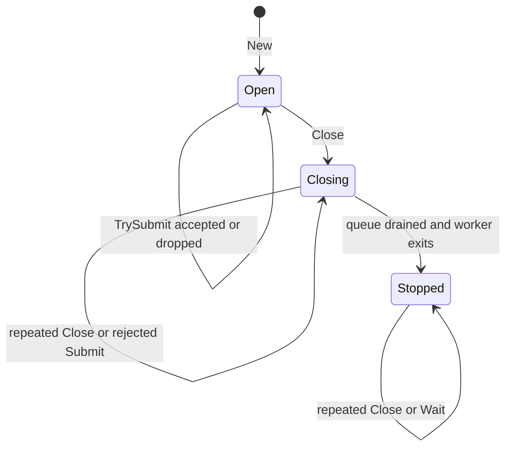

# Bounded Asynchronous Observer Dispatch: Contracts, Lifecycle, and Generic Go Design

An observer callback is a direct function call until the observed system requires stronger isolation. Once producers must not block, callback order must remain stable, memory must remain bounded, shutdown must drain accepted work, callback panic must not escape, and dropped work must be measurable, the observer mechanism becomes a concurrent subsystem with its own lifecycle and correctness contract.

Sessionstream's WebSocket `TransportObserver` reached that point during heartbeat hardening. The interface itself remained small, but safe delivery required a bounded queue, a single delivery worker, admission closure, draining, completion waiting, context detachment, record cloning, drop accounting, and panic containment. The resulting code is currently embedded in `ws.Server`, even though most of its behavior is independent of WebSockets and transport records.

This report develops the observer and dispatcher patterns from their contracts, examines the current Sessionstream implementation, and specifies a generic Go dispatcher that can support diagnostic observers without imposing transport-specific semantics. It also identifies the boundary beyond which generalization would be incorrect: heartbeat, request, persistence, and protocol queues have different failure policies and must not reuse a best-effort diagnostics dispatcher merely because they also use channels.

> [!summary]
> - `TransportObserver` is an optional WebSocket diagnostics API. Within the repository, Systemlab is its only non-test consumer.
> - The delivery mechanism implements eight general behaviors: bounded admission, ordered asynchronous callback, nonblocking producers, drop accounting, panic isolation, admission closure, accepted-work draining, and completion waiting.
> - A generic dispatcher can implement those mechanics with one buffered channel, one mutex, one closing flag, one drop counter, one delivery function, and one `sync.WaitGroup`.
> - Generic reuse is valid only for consumers that accept the same best-effort, bounded, ordered, drain-on-close policy. Protocol and correctness-critical queues require separate abstractions.

## 1. What an observer is

An observer receives information about behavior owned by another component. The observed component defines when records are emitted and what each record means. The observer decides what to do with them: append a trace, update metrics, write telemetry, retain test evidence, or ignore selected records.

The minimal interface is synchronous:

```go
type Observer[T any] interface {
    Observe(context.Context, T)
}
```

A direct invocation has clear semantics:

```go
observer.Observe(ctx, record)
```

The callback begins before the producer continues. The producer experiences callback latency. A panic propagates unless recovered. The callback receives the producer's context lifetime. No queue, worker, or shutdown protocol exists.

This model is correct when the callback is trusted, fast, and part of the producer's operation. It is not correct when observation is explicitly diagnostic and must not alter runtime progress.

### 1.1 Observer versus event subscriber

An observer is not automatically an event bus subscriber. The distinction is contractual.

| Property | Diagnostic observer | Durable or protocol subscriber |
|---|---|---|
| Primary purpose | Evidence about another operation | Domain processing |
| Delivery guarantee | Often best-effort | Usually explicit at-most-once, at-least-once, or durable |
| Backpressure | May drop | Often blocks, persists, retries, or fails |
| Failure effect | Must not break observed operation | May fail the operation or trigger retry |
| Ordering | Usually local callback order | Defined by stream or partition contract |
| Shutdown | Drain accepted diagnostics if practical | Complete protocol-specific acknowledgement |

A generic diagnostics dispatcher must not be presented as a general event-processing system. Its drop policy alone makes that substitution invalid.

### 1.2 Observer versus logger

A structured observer differs from direct logging in three ways:

1. It delivers typed records rather than formatted text.
2. The application controls retention, rendering, export, and filtering.
3. Tests can assert typed stage semantics without parsing log lines.

Sessionstream uses observer records to expose connection, projection, bus, and error evidence at library boundaries while leaving application-specific storage and presentation outside the library.

## 2. What `TransportObserver` is

Sessionstream defines the WebSocket transport interface in:

```text
pkg/sessionstream/transport/ws/observer.go
```

The public API is:

```go
type TransportObserver interface {
    OnTransport(ctx context.Context, rec TransportRecord)
}

type TransportObserverFunc func(
    ctx context.Context,
    rec TransportRecord,
)

func WithTransportObserver(observer TransportObserver) Option
```

`TransportRecord` describes a point in WebSocket processing. It can identify:

- transport stage;
- frame direction;
- connection and session identity;
- frame type and raw size;
- event ordinal, name, and payload type;
- snapshot ordinal and entity summaries;
- queue length and capacity;
- fanout targets and event count;
- cloned UI event payload;
- error evidence.

The stage set covers:

```text
upgrade
connection and disconnection
client frame read and decode
protocol errors
subscribe authorization
heartbeat ping, pong, and timeout
snapshot loading and delivery
subscription registration and live transition
UI-event buffering and fanout
outbound marshal, queue, write, and queue-full outcomes
```

### 2.1 Current in-repository use

The only non-test consumer is the browser teaching application under:

```text
cmd/sessionstream-systemlab/
```

`cmd/sessionstream-systemlab/ws_observer.go` installs a `TransportObserverFunc` and converts selected records into curated trace entries. Phases 3, 4, and 5 configure it through `WithTransportObserver`.

The callback intentionally ignores most low-level stages:

```go
switch rec.Stage {
case TransportStageConnected:
    appendTrace("transport", "phase websocket connected", details)
case TransportStageSubscribed:
    appendTrace("transport", "phase subscribed", details)
case TransportStageSnapshotSent:
    appendTrace("transport", "phase snapshot sent", details)
case TransportStageUIEventSent:
    appendTrace("transport", "phase ui event sent", details)
case TransportStageClientFrameDecoded:
    // Optional teaching trace.
default:
    // Curated view; ignore other records.
}
```

Tests use observers heavily as deterministic probes. No chat demo, Goja module, Redis example, Hub runtime, or other in-repository application installs one. External module consumers may use the exported API, but this repository cannot establish that.

### 2.2 Why transport delivery became asynchronous

The original observer invocation was synchronous. Panic recovery prevented one class of failure, but a callback that blocked could still delay:

- socket reads;
- heartbeat pong processing;
- writer acknowledgement;
- deadline arming;
- snapshot hydration;
- request execution;
- connection close;
- server shutdown.

That violated the intended ownership boundary. Diagnostic extension code could control transport liveness.

The fix introduced one server-level delivery worker and a bounded queue. Producers clone and enqueue records without waiting. The worker invokes callbacks in queue order. Shutdown closes admission, drains accepted records, and waits for callback completion subject to the caller's `Server.Close` context.

## 3. The eight-behavior contract

The mechanism implements a coherent policy:

```text
bounded admission
ordered asynchronous callback
nonblocking producers
explicit drop accounting
panic isolation
close admission
drain accepted work
wait for completion
```

These behaviors interact. Implementing any one in isolation is straightforward. Implementing all eight requires explicit lifecycle and synchronization rules.

### 3.1 Contract summary

Let `Submit(x)` attempt to admit item `x`, and let `Close()` end admission.

The dispatcher contract is:

```text
D1. At most Capacity items wait in memory.
D2. Submit never waits for queue capacity.
D3. Accepted items are delivered in admission order.
D4. Rejected capacity-overflow items increment Dropped.
D5. Delivery panic does not terminate the worker.
D6. Once Close linearizes, later Submit calls are rejected safely.
D7. Items accepted before Close are delivered before worker exit.
D8. Wait returns only after the worker exits.
D9. Close is idempotent.
D10. There is exactly one delivery worker per dispatcher.
```

The dispatcher does not promise:

- durable storage;
- retry;
- delivery after process termination;
- callback deadline enforcement;
- cancellation of a callback that never returns;
- global order across multiple dispatcher instances;
- admission when capacity is exhausted.

## 4. Bounded admission

An asynchronous producer can outpace its consumer. Without a bound, queued diagnostics can grow until memory pressure affects the system being observed. A diagnostic mechanism that destabilizes the observed runtime violates its purpose.

A buffered channel provides an explicit maximum:

```go
queue := make(chan Item, capacity)
```

At any instant:

```text
0 <= len(queue) <= cap(queue)
```

The total retained work also includes the item currently executing in the callback. For one worker, the upper bound is approximately:

```text
queued items + active callback <= capacity + 1
```

The record itself may own cloned slices, protobuf payloads, errors, and strings. Capacity should therefore be chosen from the retained-size distribution, not only an item count.

### 4.1 Admission is a policy decision

When full, the dispatcher can:

- block the producer;
- reject the new item;
- evict the oldest item;
- replace an item by key;
- spill to durable storage;
- fail the producer.

Best-effort diagnostics use reject-new admission because producer latency and runtime correctness take precedence over complete observation. Other domains require other choices.

### 4.2 Why a channel remains appropriate

Replacing the queue channel with `container/list`, a ring buffer, or a third-party queue does not reduce the contract. It adds explicit condition variables, wakeup logic, storage indices, or dependency behavior.

The channel already supplies:

- fixed capacity;
- FIFO receive order;
- nonblocking send with `select/default`;
- blocking worker receive without polling;
- close notification;
- range-based draining.

A custom queue is justified only when policy requires eviction, coalescing, priority, dynamic resizing, batch reads, or independent persistence.

## 5. Ordered asynchronous callback

Asynchronous delivery requires at least one worker. Ordering requires exactly one delivery sequence for one dispatcher.

```go
func (d *Dispatcher[T]) run() {
    defer d.wg.Done()
    for item := range d.queue {
        d.deliver(item)
    }
}
```

A single worker establishes:

```text
if Submit(a) is admitted before Submit(b),
then deliver(a) begins before deliver(b)
```

Because callbacks do not overlap, `deliver(a)` also returns before `deliver(b)` begins.

### 5.1 What order means under concurrent producers

Two producers may call `TrySubmit` concurrently. The mutex serializes their admission attempts. The order in which they acquire that mutex defines dispatcher order.

This is not necessarily:

- timestamp order;
- causal order across unrelated operations;
- session ordinal order;
- network order;
- order of goroutine creation.

If the record includes a domain ordinal or timestamp, observers may use it for analysis. The dispatcher's guarantee remains local admission order.

### 5.2 Why not multiple workers

Multiple workers increase throughput but permit callback overlap and completion reordering. If records describe a lifecycle, completion order can matter to trace renderers and stateful exporters.

Parallel delivery can be added only with an explicit partitioning key or order relaxation:

```text
one worker per session
one worker per connection
unordered callback pool
```

That is a different abstraction.

## 6. Nonblocking producers

A producer must not wait for callback execution or queue space.

```go
select {
case d.queue <- item:
    return true
default:
    d.dropped++
    return false
}
```

This operation may still wait briefly for the admission mutex. The mutex protects only lifecycle and queue admission, not callback execution. Its critical section contains a closing check, one nonblocking send attempt, and possibly one counter increment.

The intended bound is synchronization latency, not callback or queue-drain latency.

### 6.1 Why `select/default` matters

A plain send blocks when capacity is exhausted:

```go
d.queue <- item // Not best-effort.
```

A nonblocking send makes overflow part of the API contract. The caller can ignore the boolean, record a local metric, or react according to domain policy.

### 6.2 Producer-owned preparation

For transport observations, data must be safe to retain before admission:

```go
item := observedTransportRecord{
    ctx: context.WithoutCancel(normalizeContext(ctx)),
    rec: cloneTransportRecord(rec),
}
```

Preparation happens before queue ownership transfers. This prevents the producer from mutating slices or protobuf values after submission.

There is a cost: cloning occurs even if the queue is full. A two-phase API could check likely capacity before cloning, but capacity can change concurrently and would complicate semantics. If cloning becomes expensive, the dispatcher can accept a preparation function executed under a reservation protocol, but that is not currently justified.

## 7. Explicit drop accounting

Best-effort does not mean invisible loss. Every overflow rejection increments a monotonic counter.

```go
func (d *Dispatcher[T]) Dropped() uint64 {
    d.mu.Lock()
    defer d.mu.Unlock()
    return d.dropped
}
```

The counter answers:

```text
How many submissions were rejected because capacity was exhausted?
```

It does not identify which records were lost. Richer accounting could include:

- drops by record kind;
- current queue depth;
- high-water mark;
- last drop timestamp;
- accepted count;
- delivered count;
- callback panic count.

Those metrics should be added only when operational use requires them. A single drop counter is the minimum evidence needed to distinguish complete-looking output from known loss.

### 7.1 Counter synchronization

The existing admission mutex can protect `dropped`. An `atomic.Uint64` would reduce lock use for reads, but does not remove the mutex needed to serialize `Submit` against `Close`. Keeping one synchronization regime is simpler unless metrics reads are proven hot.

## 8. Panic isolation

Observer code is extension code. A panic must not terminate the dispatcher worker or propagate into transport execution.

```go
func safeDeliver[T any](deliver func(T), item T) {
    defer func() {
        _ = recover()
    }()
    deliver(item)
}
```

Recovery must be scoped around each callback, not around the entire worker loop. If recovery occurs only at worker exit, one panic terminates future delivery.

### 8.1 What panic isolation does not provide

Recovery does not:

- undo observer side effects;
- identify whether a partial write occurred;
- make observer data structures race-safe;
- prevent infinite blocking;
- record the panic unless a separate hook does so.

A generic dispatcher may accept an optional panic callback:

```go
type Options struct {
    OnPanic func(any)
}
```

That callback must itself be isolated and must not recursively submit into a saturated dispatcher unless recursion behavior is explicitly defined.

### 8.2 Panic versus error return

A delivery function could return an error, but the dispatcher must then define error policy. For best-effort diagnostics, errors cannot fail the observed operation. Useful policies are count, log, or invoke a separate error hook. Retry can violate ordering and shutdown bounds and should not be implicit.

## 9. Closing admission

Shutdown has two separate operations:

```text
close admission
finish accepted work
```

The dispatcher must prevent a send on a closed channel. Closing the queue without synchronization races with concurrent submission and can panic.

A mutex establishes the required exclusion:

```go
func (d *Dispatcher[T]) Close() {
    d.mu.Lock()
    defer d.mu.Unlock()

    if d.closing {
        return
    }
    d.closing = true
    close(d.queue)
}
```

Submission uses the same mutex:

```go
func (d *Dispatcher[T]) TrySubmit(item T) bool {
    d.mu.Lock()
    defer d.mu.Unlock()

    if d.closing {
        return false
    }
    select {
    case d.queue <- item:
        return true
    default:
        d.dropped++
        return false
    }
}
```

The linearization point for close is setting `closing` and closing the queue while holding the mutex. A submit operation either:

- acquires the mutex first and completes admission before close; or
- acquires it after close and returns false.

There is no send-after-close execution.

### 9.1 Idempotence without `sync.Once`

The mutex-protected `closing` flag makes `Close` idempotent. A separate `sync.Once` is unnecessary.

`sync.Once` remains useful when initialization or closure has no state already protected by a mutex. Here, the mutex and state are required for admission regardless.

## 10. Draining accepted work

Closing a channel does not discard its buffered values. A receiver ranging over it processes every buffered item and exits after the buffer is empty.

```go
for item := range d.queue {
    safeDeliver(d.deliver, item)
}
```

This directly implements:

```text
Every item admitted before Close is offered to deliver before worker exit.
```

The contract says “offered” because a panic may interrupt one callback body, and the dispatcher cannot verify observer side effects. Panic isolation ensures the worker proceeds to later accepted items.

### 10.1 Why a separate stop channel is unnecessary

The current Sessionstream implementation has:

```text
observerQueue
observerStop
observerStopped
```

The worker selects between queue and stop. On stop, it enters a second loop to drain the queue.

Closing the queue itself encodes both facts:

```text
no more admission
drain buffered items, then exit
```

A separate stop channel is needed only if stopping and closing admission are distinct operations—for example, immediate abort without drain versus graceful close. Sessionstream exposes only graceful drain.

### 10.2 Bounded queue does not imply bounded close time

The number of accepted callbacks is bounded by capacity plus the active callback. Callback duration is not bounded. A callback can block forever.

Go cannot safely terminate an arbitrary goroutine. The caller can bound how long it waits, but the dispatcher worker may remain blocked.

This distinction should remain explicit:

```text
bounded retained work != bounded callback latency
```

## 11. Waiting for completion

A `sync.WaitGroup` is sufficient for one worker:

```go
func NewDispatcher[T any](...) *Dispatcher[T] {
    d := &Dispatcher[T]{...}
    d.wg.Add(1)
    go d.run()
    return d
}

func (d *Dispatcher[T]) Wait() {
    d.wg.Wait()
}
```

This replaces a dedicated `stopped chan struct{}`.

### 11.1 Why `Close` and `Wait` should remain separate

Separate methods support:

- initiating close without blocking;
- integrating completion into an outer server shutdown;
- repeated waits;
- context-bounded waiting at the owner level;
- tests that assert admission closes before callbacks finish.

A convenience method can combine them:

```go
func (d *Dispatcher[T]) CloseAndWait(ctx context.Context) error
```

Implementing context-bounded `Wait` usually requires a completion channel or a helper goroutine because `sync.WaitGroup` has no context API. Sessionstream's `Server.Close` already owns context-bounded shutdown, so the internal dispatcher does not need to duplicate it.

### 11.2 Completion channel versus WaitGroup

Both are valid:

```go
stopped chan struct{}
```

or:

```go
wg sync.WaitGroup
```

A channel integrates naturally into `select`. A WaitGroup directly states worker-join semantics and avoids another lifecycle channel. The correct choice depends on the owner's shutdown API.

For a generic dispatcher with `Close` and `Wait`, a WaitGroup is sufficient. If the dispatcher itself exposes `WaitContext`, a `done` channel may be simpler.

## 12. Context lifetime

Queued delivery outlives the producer operation. Passing the original context unchanged allows request cancellation to invalidate accepted diagnostics before delivery.

Sessionstream now uses:

```go
context.WithoutCancel(ctx)
```

This preserves values while removing:

- cancellation;
- deadline;
- `Done` signaling;
- inherited `Err`.

The observer can still read correlation IDs, trace values, tenant metadata, and request annotations after the original handler returns.

### 12.1 Why detachment is part of ownership transfer

After admission, the dispatcher owns delivery. Producer cancellation no longer describes whether delivery should proceed. Retaining that cancellation would let queue delay change whether accepted work is usable.

The observer should create its own timeout for database or telemetry export:

```go
func (o *Exporter) OnTransport(ctx context.Context, rec TransportRecord) {
    exportCtx, cancel := context.WithTimeout(ctx, o.timeout)
    defer cancel()
    _ = o.export(exportCtx, rec)
}
```

Because the supplied context has no inherited deadline, exporter policy remains explicit.

### 12.2 Should a generic dispatcher know about contexts?

No. Context detachment is item-preparation policy. The generic unit should receive a prepared value:

```go
type transportObservation struct {
    ctx context.Context
    rec TransportRecord
}
```

Other uses may have no context or may intentionally preserve cancellation.

## 13. Record immutability

Asynchronous delivery requires safe retention. A shallow struct copy is insufficient when fields contain slices, maps, pointers, or mutable protobuf messages.

Sessionstream clones:

- `UIEvent` and its protobuf payload;
- snapshot entity slices;
- fanout target ID slices.

```go
func cloneTransportRecord(in TransportRecord) TransportRecord {
    out := in
    out.UIEvent = cloneUIEvent(in.UIEvent)
    out.SnapshotEntities = append(
        []TimelineEntitySummary(nil),
        in.SnapshotEntities...,
    )
    out.FanoutTargetIds = append(
        []ConnectionId(nil),
        in.FanoutTargetIds...,
    )
    return out
}
```

The ownership rule is:

```text
Before Submit returns true, item preparation must produce data that
can be retained and read after the producer resumes mutation.
```

The dispatcher cannot enforce deep immutability generically. Its API documentation must require ownership-safe values or accept a clone function.

## 14. Current Sessionstream implementation

The current WebSocket `Server` embeds these fields:

```go
observerMu       sync.Mutex
observerQueue    chan observedTransportRecord
observerStop     chan struct{}
observerStopped  chan struct{}
observerClosing  bool
observerDropped  uint64
observerStopOnce sync.Once
```

Its worker has two loops:

```go
for {
    select {
    case item := <-observerQueue:
        deliver(item)
    case <-observerStop:
        for {
            select {
            case item := <-observerQueue:
                deliver(item)
            default:
                return
            }
        }
    }
}
```

This implementation is defensible. It makes stop signaling explicit and supports bounded draining. Its weakness is structural: the lifecycle state is spread through `Server`, even though the server only needs three operations:

```text
observe(record)
read dropped count
close and wait
```

The embedded fields increase the apparent complexity of `Server` and couple transport shutdown to queue mechanics.

## 15. Concrete extraction

The smallest refactor is a WebSocket-specific unit:

```go
type observerDispatcher struct {
    observer TransportObserver
    queue    chan observedTransportRecord

    mu      sync.Mutex
    closing bool
    dropped uint64

    wg sync.WaitGroup
}
```

`Server` retains:

```go
observerDispatcher *observerDispatcher
```

The server adapter becomes:

```go
func (s *Server) observe(ctx context.Context, rec TransportRecord) {
    if s == nil || s.observerDispatcher == nil {
        return
    }
    s.observerDispatcher.TryObserve(ctx, rec)
}
```

Shutdown becomes:

```go
s.observerDispatcher.Close()
s.observerDispatcher.Wait()
```

This removes queue, stop, stopped, closing, dropped, and `sync.Once` fields from `Server` while keeping the public API unchanged.

### 15.1 Advantages

- Unit tests can exercise lifecycle without constructing a WebSocket server.
- `Server` no longer owns dispatcher internals.
- Queue closure becomes the stop signal.
- One WaitGroup replaces the stopped channel.
- The unit can document observer-specific context and cloning behavior.

### 15.2 Limitation

The implementation remains tied to `TransportObserver` and `TransportRecord`. Reuse by pipeline, bus, or error observers would require another extraction.

## 16. Generic dispatcher design

The mechanics can be represented by an internal generic type:

```go
package asyncdispatch

type Dispatcher[T any] struct {
    deliver func(T)
    queue   chan T

    mu      sync.Mutex
    closing bool
    dropped uint64

    wg sync.WaitGroup
}
```

Constructor:

```go
func New[T any](capacity int, deliver func(T)) (*Dispatcher[T], error) {
    if capacity <= 0 {
        return nil, fmt.Errorf("dispatcher capacity must be positive")
    }
    if deliver == nil {
        return nil, fmt.Errorf("dispatcher delivery function is nil")
    }

    d := &Dispatcher[T]{
        deliver: deliver,
        queue:   make(chan T, capacity),
    }
    d.wg.Add(1)
    go d.run()
    return d, nil
}
```

Admission:

```go
func (d *Dispatcher[T]) TrySubmit(item T) bool {
    if d == nil {
        return false
    }

    d.mu.Lock()
    defer d.mu.Unlock()

    if d.closing {
        return false
    }

    select {
    case d.queue <- item:
        return true
    default:
        d.dropped++
        return false
    }
}
```

Delivery:

```go
func (d *Dispatcher[T]) run() {
    defer d.wg.Done()
    for item := range d.queue {
        func() {
            defer func() { _ = recover() }()
            d.deliver(item)
        }()
    }
}
```

Close and wait:

```go
func (d *Dispatcher[T]) Close() {
    if d == nil {
        return
    }

    d.mu.Lock()
    defer d.mu.Unlock()

    if d.closing {
        return
    }
    d.closing = true
    close(d.queue)
}

func (d *Dispatcher[T]) Wait() {
    if d != nil {
        d.wg.Wait()
    }
}
```

Metrics:

```go
func (d *Dispatcher[T]) Dropped() uint64 {
    if d == nil {
        return 0
    }
    d.mu.Lock()
    defer d.mu.Unlock()
    return d.dropped
}
```

### 16.1 Proposed package location

If generalized, the type should remain internal until two stable consumers establish its API:

```text
internal/asyncdispatch/
```

or, if repository conventions prefer package-local internals:

```text
pkg/sessionstream/internal/asyncdispatch/
```

It should not become a public Sessionstream API solely because it uses generics.

### 16.2 Thin transport adapter

```go
type transportObservation struct {
    ctx context.Context
    rec TransportRecord
}

func newTransportObservationDispatcher(
    observer TransportObserver,
) *asyncdispatch.Dispatcher[transportObservation] {
    if observer == nil {
        return nil
    }

    dispatcher, err := asyncdispatch.New(
        defaultObserverQueueSize,
        func(item transportObservation) {
            observer.OnTransport(item.ctx, item.rec)
        },
    )
    if err != nil {
        panic(err) // Capacity and callback are static internal values.
    }
    return dispatcher
}
```

Preparation remains WebSocket-specific:

```go
func (s *Server) observe(ctx context.Context, rec TransportRecord) {
    if s.observations == nil {
        return
    }
    if ctx == nil {
        ctx = context.Background()
    }
    s.observations.TrySubmit(transportObservation{
        ctx: context.WithoutCancel(ctx),
        rec: cloneTransportRecord(rec),
    })
}
```

## 17. Generic state machine

The dispatcher lifecycle can be modeled with three states:

```text
Open     = submissions may be accepted
Closing  = admission is closed; accepted items are draining
Stopped  = delivery worker exited
```



The public implementation may store only `closing bool` plus worker completion. `Stopped` is represented by `wg.Wait` completion rather than a separately readable flag.

### 17.1 Transition invariants

```text
I1. Open implies queue is not closed.
I2. Closing implies no future TrySubmit can send.
I3. Stopped implies Closing.
I4. queue close occurs exactly once.
I5. every successful send occurs before queue close.
I6. every received item was previously accepted.
I7. worker exit occurs only after closed queue is drained.
I8. dropped is monotonic.
```

The admission mutex establishes I4 and I5. Channel semantics establish I6 and I7. Monotonic counter updates under the mutex establish I8.

## 18. Testing the generic unit

A dispatcher deserves direct unit tests because its bugs are concurrency and lifecycle bugs rather than WebSocket protocol bugs.

### 18.1 Ordered delivery

Submit a known sequence and close:

```go
for i := range 100 {
    require.True(t, d.TrySubmit(i))
}
d.Close()
d.Wait()
require.Equal(t, expected, delivered)
```

Use capacity large enough to avoid incidental drops, or block submission until delivery progress is known.

### 18.2 Capacity and drop accounting

Block the first callback, fill the queue, then attempt one additional submission:

```text
active callback: 1
queued records: capacity
next submission: false
dropped: 1
```

Release, close, and verify accepted records drain.

### 18.3 Concurrent submit and close

Start many producers and one closer. Assertions:

- no panic;
- no race report;
- every accepted count equals delivered count after wait;
- close is idempotent;
- post-close submissions return false.

Run under `-race` repeatedly.

### 18.4 Panic recovery

Make one delivery panic between two valid records. Verify later records are delivered and `Wait` returns.

### 18.5 Blocked callback and wait

Block delivery, call `Close`, and verify `Wait` does not return. Release callback and verify it returns. This defines graceful drain precisely.

### 18.6 Context detachment belongs to adapter tests

The generic dispatcher should not test contexts. The transport adapter should prove:

```text
producer context has value and deadline
record is accepted
producer context is canceled
callback sees value
callback Err is nil
callback has no deadline
```

### 18.7 Fuzzing value

A generic dispatcher fuzzer is less immediately useful than deterministic concurrency tests because native fuzzing mutates data rather than scheduler choices. A model-based harness can encode operations:

```text
Submit(value)
Close
WaitCheckpoint
PanicOn(value)
ReleaseBlockedDelivery
```

It can validate state-machine invariants in a deterministic simulation. Real implementation concurrency still requires race-enabled stress tests.

## 19. Reuse boundaries

The dispatcher should be reused only when all policy answers match.

| Question | Required answer for reuse |
|---|---|
| Can submissions be dropped? | Yes |
| Must producers remain nonblocking? | Yes |
| Is FIFO callback order required? | Yes |
| Is one callback worker sufficient? | Yes |
| Should accepted items drain on close? | Yes |
| Can callback panic be isolated? | Yes |
| Is persistence unnecessary? | Yes |
| Is retry unnecessary? | Yes |

### 19.1 Potential observer consumers

Sessionstream also defines:

- `PipelineObserver`;
- `BusObserver`;
- `ErrorObserver`.

They should reuse the generic dispatcher only after their current synchronous semantics and downstream expectations are audited. Converting them to asynchronous delivery is a behavior change involving context lifetime, callback ordering, error visibility, and shutdown ownership.

### 19.2 Queues that must not reuse it

Do not use the best-effort dispatcher for:

- heartbeat control events;
- WebSocket outbound frames;
- ordered client requests;
- event-store writes;
- projection updates;
- authorization decisions;
- shutdown commands.

Those operations cannot silently drop on capacity overflow. Some close the connection, block, return errors, persist, or retry. Sharing an implementation with the wrong policy would hide essential behavior behind a generic name.

## 20. Does the system need this complexity?

The answer depends on whether `TransportObserver` remains.

If the API remains asynchronous and best-effort, most complexity is required:

- a bound prevents diagnostic memory growth;
- one worker preserves order and isolates producers;
- drop accounting makes loss visible;
- panic recovery protects worker continuity;
- close synchronization prevents send-after-close;
- draining preserves accepted records;
- waiting gives shutdown a completion condition;
- context detachment preserves accepted work after producer cancellation.

The current code can be structurally simplified, but its semantics cannot be represented by a single unprotected callback or channel without losing guarantees.

If the only non-test consumer—Systemlab—is removed, the architectural question changes. There may be no demonstrated in-repository need for `TransportObserver`, its 30-plus stages, cloned record payloads, bounded dispatcher, shutdown integration, and extensive observer tests. Removing the feature can simplify more than extracting it.

This yields two valid directions:

```text
Keep observer API:
    extract and test a dispatcher unit

Remove observer API with Systemlab:
    delete instrumentation, cloning, queue lifecycle, options, and tests
```

A generic dispatcher should not be introduced merely to preserve infrastructure whose only consumer is being deleted.

## 21. Decision framework

### Decision A: Keep `TransportObserver`

Choose this if:

- external consumers are known or API compatibility is required;
- transport telemetry is a deliberate library capability;
- future non-Systemlab tracing is planned;
- observer records provide operational evidence not available elsewhere.

Then extract a concrete unit first. Promote it to generic only when another observer adopts identical semantics.

### Decision B: Remove `TransportObserver`

Choose this if:

- Systemlab is the only intended consumer;
- no compatibility promise requires retention;
- logs and targeted tests provide sufficient transport evidence;
- reducing public and runtime surface is more valuable than optional instrumentation.

Then delete the observer API and delivery subsystem rather than generalizing it.

### Decision C: Preserve records but remove asynchronous delivery

This is usually the weakest option. Returning to synchronous callbacks reintroduces liveness coupling. Keeping an observer API while weakening isolation should require a clear documented use case.

## 22. Systemlab as a complexity source

`cmd/sessionstream-systemlab` currently contains approximately 384 KiB across:

- a Cobra binary;
- an HTTP server;
- six textbook chapters;
- phase-specific runtimes, actions, projections, checks, and DTO cloning;
- WebSocket endpoints and browser clients;
- SQLite restart scenarios;
- static HTML, CSS, and JavaScript;
- trace rendering;
- bus, pipeline, and transport observer use;
- Makefile targets;
- CI smoke tests;
- documentation export integration;
- README and reference documentation.

Its downstream support includes public diagnostics APIs that were introduced partly to render teaching traces. Removing Systemlab requires an evidence-led audit, not only deleting its directory. The audit must classify each dependency as:

```text
Systemlab-only complexity
independently valuable public API
shared example behavior
CI or release wiring
published documentation dependency
```

`TransportObserver` currently falls into the first two categories simultaneously: it is publicly generic in intent, but only Systemlab demonstrates non-test use inside the repository.

## 23. Recommended sequence

1. Inventory every Systemlab source, build, CI, documentation, and observer dependency.
2. Search public API use inside the repository and, where possible, known downstream modules.
3. Define the retained minimal Sessionstream product boundary.
4. Delete Systemlab wiring in one phase while keeping the library compiling.
5. Remove observer APIs only after their independent value and compatibility obligations are decided.
6. Remove dead record types, clone helpers, dispatcher fields, stages, and tests.
7. Replace any browser heartbeat client reference currently pointing to Systemlab with a minimal protocol fixture or example.
8. Run workspace and `GOWORK=off` tests, race tests, lint, security checks, build, and release snapshot.
9. Compare public API and dependency graphs before and after.

Do not create a generic dispatcher before this audit decides whether a dispatcher remains necessary.

## 24. Working rules

- Name delivery guarantees explicitly.
- Keep diagnostic failure policy separate from protocol failure policy.
- Never hide drop semantics inside a generic queue abstraction.
- Transfer data and context ownership before asynchronous admission.
- Serialize close against submission before closing a queue channel.
- Use channel closure for graceful drain when stop and admission close are the same operation.
- Use one worker when callback order is part of the contract.
- Record drops whenever admission is best-effort.
- Recover panic per callback, not only at worker exit.
- Do not claim bounded shutdown when callback duration is unbounded.
- Generalize after two stable consumers demonstrate the same policy.
- Delete unused complexity instead of abstracting it.

## 25. Source references

Repository:

```text
/home/manuel/workspaces/2026-06-30/benchmark-cpu-inference/sessionstream-p111
```

Primary files:

| File | Role |
|---|---|
| `pkg/sessionstream/transport/ws/observer.go` | Transport observer types, records, current dispatcher, cloning, and helpers |
| `pkg/sessionstream/transport/ws/server.go` | Embedded observer lifecycle state and server shutdown integration |
| `pkg/sessionstream/transport/ws/server_test.go` | Queue, drop, panic, context, close, and transport observation tests |
| `cmd/sessionstream-systemlab/ws_observer.go` | Only non-test in-repository `TransportObserver` consumer |
| `pkg/sessionstream/pipeline_observer.go` | Pipeline observer API |
| `pkg/sessionstream/bus.go` | Bus observer API |
| `pkg/sessionstream/hub.go` | Error observer API |
| `ttmp/2026/05/06/SS-OBSERVERS--add-hub-and-websocket-observers-for-sessionstream-diagnostics/design-doc/01-observer-implementation-guide.md` | Original observer design and intended ownership boundary |

## Related notes

- [[PROJECT REPORT - Sessionstream Heartbeats - From Ping Pong Loops to a Timed Failure Detector]]
- [[PROJECT REPORT - Proving WebSocket Heartbeat Arbitration - From Review Counterexample to Seeded Runtime Fuzzing]]
- [[sessionstream|Sessionstream — Event Protocols, Timelines, and Chat State]]
- [[Research/Software Architecture Garden/sessionstream/README|Architecture Garden — sessionstream]]
- [[Research/Software Architecture Garden/sessionstream/designs/01 - Bounded Asynchronous Observer Dispatcher|Bounded Asynchronous Observer Dispatcher design]]
- [[ARTICLE - Observer Instrumentation - Geppetto Pinocchio Sessionstream Deep Dive]]
- [[PROJ - Sessionstream - Replay Store Remediation and Systemlab UI Refinement]]
