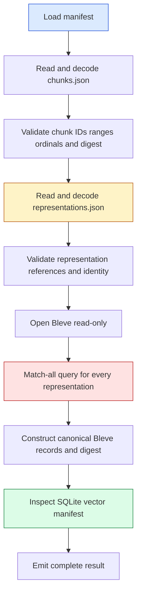

# CoinVault Verifier Memory Scaling — Why RSS Grows and How to Operate It

This report analyzes the memory behavior of CoinVault's immutable knowledge-bundle verifier. The verifier runs before a bundle is trusted for deployment; it reads the manifest, chunks, representations, Bleve index, and SQLite vector index, then checks their identities against the manifest. The investigation measured five deterministic bundle sizes locally and added the same memory telemetry contract used by the indexer build command.

The central result is precise: memory increases with representation count, but the measured points do not form a constant-slope linear function. The exact 114,106-representation bundle reached 1,872,289,792 bytes of external process RSS and 1,915,330,560 bytes in the in-process telemetry sample. A two-gibibyte ECS task is too close to the observed peak to be a safe capacity choice.

> [!summary]
> - The five-point external RSS series was 242 MiB, 621 MiB, 828 MiB, 1.03 GiB, and 1.74 GiB for 10,000, 25,000, 50,000, 75,000, and 114,106 representations.
> - The dominant allocations are the decoded chunks and representations retained simultaneously, temporary canonical-digest material, and the Bleve content inspection query that requests every hit and constructs a second record slice.
> - Production must run verification as a bounded one-shot operation with cgroup telemetry, no overlapping retries, and explicit memory headroom. The container baseline remains the next validation step because the host cgroup includes unrelated page cache.

## 1. The question and the boundary

The operational question was whether the large CoinVault knowledge bundle could be verified locally and whether its memory use was proportional to bundle size. This question must distinguish three operations:

1. **Index construction** embeds documents and publishes a new bundle. It has already been redesigned around staged writes and bounded consumers.
2. **Bundle verification** checks that an immutable bundle is internally consistent and that its persisted backends match the manifest. It does not call OpenAI or open the application database.
3. **Bundle serving** opens already-verified indexes for retrieval. It is a long-lived service operation and should not repeat full verification on every request.

This report concerns operation 2. The public entry point is:

```text
rag/indexbundle.Verify(ctx, VerifyOptions) (Manifest, error)
```

CoinVault exposes it through:

```text
coinvault knowledge verify \
  --bundle /path/to/bundle \
  --expected-bundle-id ... \
  --expected-corpus-path ...
```

The command is read-only. It validates artifacts before activation; it does not publish or mutate a bundle.

## 2. Verification sequence

The verifier has stable stage callbacks. Each callback occurs after the stage has completed successfully.



The implementation is in `/home/manuel/code/wesen/go-go-golems/ragkit/rag/indexbundle/verify.go` and `/home/manuel/code/wesen/go-go-golems/ragkit/rag/indexbundle/open.go`. The sequence is currently eager: chunks and representations are decoded into Go slices and remain reachable while later stages execute.

The essential control flow is:

```go
state := loadVerifiedManifest(ctx, path)
observe(VerifyStageManifest)

chunks := loadVerifiedChunks(ctx, state)
observe(VerifyStageChunks)

data := loadVerifiedStoredData(ctx, chunks)
observe(VerifyStageRepresentations)

validateLexicalBackendIdentity(ctx, data)
observe(VerifyStageLexical)

validateVectorBackendIdentity(ctx, data)
observe(VerifyStageVector)
observe(VerifyStageComplete)
```

`loadVerifiedChunks` reads the complete `chunks.json` file with `os.ReadFile`, decodes it, validates every chunk, constructs identity maps, and computes a canonical JSON digest. It returns the slice rather than releasing it. `loadVerifiedStoredData` then reads the complete `representations.json` file, validates references to the retained chunk slice, computes the representation digest, and returns both slices in `verifiedData`.

The operation-specific telemetry added in CoinVault wraps this sequence with `knowledgebuild.Sampler`. Verification stages update a content-free `BuildState`; the sampler records Go heap statistics, process RSS, cgroup values when available, garbage-collection count, stage, and progress. The normal command remains unchanged because `--memory-metrics` defaults to `off`.

## 3. Is the relationship linear?

The answer is “monotone and approximately increasing, but not strictly linear.” The experiment generated deterministic bundles with the same shape at every size: three chunks per document, two representations per chunk, 1,536-dimensional synthetic vectors, and 1,400 bytes of representation text. Only the representation count changed.

| Representations | Duration | External peak RSS | External anonymous | In-process peak RSS |
|---:|---:|---:|---:|---:|
| 10,000 | 5.34 s | 242 MiB | 175 MiB | 231 MiB |
| 25,000 | 10.92 s | 621 MiB | 567 MiB | 585 MiB |
| 50,000 | 20.60 s | 828 MiB | 794 MiB | 849 MiB |
| 75,000 | 31.61 s | 1.03 GiB | 977 MiB | 1.05 GiB |
| 114,106 | 47.35 s | 1.74 GiB | 1.69 GiB | 1.78 GiB |

The measured relationship is shown below. The external RSS and anonymous-memory series come from the process sampler; the in-process RSS series comes from the verifier's EMF events. The SVG is committed beside this report so the figure remains available when the temporary `/tmp` experiment directory is removed.

![[CoinVault verifier memory sweep.svg]]

_Figure 1. Peak memory increases with representation count; the final point is the exact full bundle shape._

The external RSS values are the maxima from `/proc/<pid>/status` and `smaps_rollup`. The in-process values are maxima from EMF events emitted by `knowledge verify --memory-metrics cloudwatch`. The measurements are close, but they are sampled independently and can observe different instants during a short-lived allocation peak.

An ordinary least-squares fit over the five external RSS points is:

```text
RSS(bytes) ≈ 161,671,942 + 14,430.75 × representations
```

The fitted slope is about 137.6 MiB per 10,000 representations, with an intercept of about 154 MiB. This is useful for an initial estimate, not a guarantee. The residuals are material because the verifier has thresholds and temporary simultaneous allocations rather than one uniform per-record cost.

| Interval | RSS increase | Added representations | Increase per representation |
|---|---:|---:|---:|
| 10k → 25k | 409 MiB | 15k | 27.9 KiB |
| 25k → 50k | 239 MiB | 25k | 9.8 KiB |
| 50k → 75k | 216 MiB | 25k | 8.6 KiB |
| 75k → 114,106 | 765 MiB | 39,106 | 20.0 KiB |

Go allocation classes, garbage-collection timing, JSON capacity growth, and the Bleve search-result shape affect the maxima. The correct production statement is:

> Memory is strongly size-dependent and reaches approximately 1.9 GB at the current full bundle. It is not safe to extrapolate with a single exact bytes-per-representation constant without a margin and a container measurement.

## 4. What consumes memory

### 4.1 Raw JSON and decoded slices coexist

`readJSON` first reads an entire JSON file into a `[]byte` and then decodes that byte slice into a Go slice. During decoding, the raw bytes and decoded object graph coexist. After `readJSON` returns, the raw byte slice becomes collectible, but the decoded data remains reachable through `verifiedData`.

For the large bundle, this happens twice:

```text
chunks.json bytes        + decoded []rag.Chunk
representations.json     + decoded []rag.Representation
```

The chunk slice remains live while representations are decoded and validated. The representation slice remains live while Bleve is inspected. This is the main structural reason the peak is not bounded by one small record buffer.

### 4.2 Validation creates auxiliary maps and digest material

Chunk validation creates maps for chunk IDs, document IDs, and per-document ordinals. Representation validation creates identity and reference checks over the retained slices. Canonical identity checks call JSON digest functions, which serialize data into temporary buffers while the source slices remain live.

The memory is not just the text size. Each Go string has header metadata, each struct has fields and alignment, each map has bucket overhead, and each digest pass creates transient encoded data. A bundle with short on-disk records can still consume substantially more RSS after decoding.

### 4.3 Bleve verification requests every record

`bleve.InspectContentDigest` performs a match-all query with `manifest.RepresentationCount` as the result limit and requests all canonical fields:

```go
request := blevelib.NewSearchRequestOptions(
    blevelib.NewMatchAllQuery(), manifest.RepresentationCount, 0, false,
)
request.SortBy([]string{"_id"})
request.Fields = []string{
    "representation_id", "chunk_id", "document_id",
    "kind", "title", "body",
}
result, _ := index.Search(request)

records := make([]Record, 0, len(result.Hits))
for _, hit := range result.Hits {
    records = append(records, canonicalRecord(hit))
}
return digest.JSON(records)
```

At the point `records` is built, the following can coexist:

- decoded chunks;
- decoded representations;
- Bleve's `result.Hits` and hit field values;
- the canonical `records` slice;
- JSON bytes produced for the digest.

The stage-grouped sweep supports this attribution. The largest sample was in the lexical stage for four of the five sizes. At 114,106 representations, the external peak was 1.74 GiB and the in-process peak was 1.78 GiB; the stage sequence showed substantial growth during chunks and representations, followed by the maximum during lexical inspection. The `complete` sample was small because temporary allocations had become unreachable and the runtime had performed garbage collection.

### 4.4 SQLite vector inspection is not the primary observed allocation

The verifier does not decode every 1,536-dimensional vector into a Go slice. `validateVectorBackendIdentity` calls SQLite inspection and compares model, dimensions, representation count, and content digest. Vector dimensions affect persisted index size and I/O, but the current memory peak is explained primarily by decoded JSON and Bleve inspection.

This distinction matters for capacity. Increasing vector dimensions can increase disk and verification time without increasing RSS in the same proportion. Increasing representation text, chunk count, or the number of Bleve fields can increase Go heap and search-result allocations directly.

## 5. Why the final sample is misleading

The verifier reports a `complete` stage after all checks return. That row is a terminal observation, not a peak-memory report. In the sweep, the complete-stage RSS was approximately 80–100 MiB for several cases even when the lexical-stage peak exceeded 1 GiB.

The Go runtime can return objects to its allocator while retaining virtual address space and some resident pages. A final `runtime.MemStats.HeapAlloc` value therefore does not reconstruct the maximum RSS reached earlier. Dashboards must record max-over-run values, not only the last event.

```text
stage samples:  manifest -> chunks -> representations -> lexical -> vector -> complete
metric meaning: point-in-time values plus monotone peak fields
capacity value: max RSS / max cgroup usage during the entire run
```

The EMF sink includes `PeakRSSBytes` and the external collector records a JSONL time series. Both are required for an accurate capacity decision.

## 6. Production consequences

### 6.1 The two-gibibyte task is not safe for the full bundle

The exact full bundle reached 1.87 GB of external RSS locally and previously failed during the development indexer at a two-gibibyte ECS memory limit. A two-gibibyte verifier task would have little room for allocator fragmentation, runtime variation, file-backed pages, logging, process startup, or a slightly larger corpus.

The current evidence supports these statements:

- The full verifier must not share a two-gibibyte limit with unrelated application work.
- The verifier should run as a one-shot task with an explicit memory allocation separate from the serving task.
- A provisional 4 GiB task is a reasonable starting point if the container baseline confirms the host result. This is a margin recommendation, not a completed capacity test.
- The final allocation should be chosen from the isolated cgroup peak plus a documented margin, then rechecked after bundle growth.

### 6.2 Never overlap verifier retries

The verifier is a single process and should be invoked by one ECS task at a time. An orchestration policy that launches a second verification while the first is reading the bundle can multiply memory use and EFS I/O. The deployment workflow must use a task lock or generation-specific job key.

The retry policy must distinguish a transient infrastructure failure from a deterministic bundle validation failure. A malformed bundle should stop without rapid retries. A stopped task caused by resource exhaustion should produce an alarm and require a capacity decision before retrying.

### 6.3 Observe cgroup memory, not only application heap

CloudWatch EMF events are emitted to stdout and captured by the ECS `awslogs` driver. The verify identity is deliberately separate from build telemetry:

```json
{
  "event_type": "knowledge_verify_memory_metric",
  "Component": "knowledge-verifier",
  "Stage": "lexical",
  "RSSBytes": 1915330560,
  "PeakRSSBytes": 1915330560,
  "Namespace": "CoinVault/KnowledgeVerify"
}
```

The ECS operation should alarm on cgroup utilization and task exit status. RSS and Go heap explain the process; cgroup current and limit determine whether the task is about to be killed. The local host cgroup cannot answer that question because it includes unrelated workspace cache. The isolated container run is mandatory before declaring an AWS alarm threshold.

### 6.4 Separate file-backed memory from anonymous memory

The external sampler records `anonymous_bytes`, `pss_bytes`, `private_dirty_bytes`, and cgroup file bytes. A high cgroup total with low anonymous memory can represent EFS-backed or page-cache residency rather than Go heap:

- high anonymous/private-dirty memory indicates decoded records, maps, search results, or runtime allocations;
- high file-backed memory indicates index pages and EFS read caching;
- high PSS with lower RSS indicates shared mappings or shared index pages.

The current host series is dominated by anonymous memory at the largest sizes, but the shared host cgroup prevents clean cgroup attribution. The container report is the production-relevant evidence.

## 7. Streaming remediation for larger bundles

The verifier does not need to retain every logical record to prove a digest if the bundle format supplies a deterministic order and the digest can be updated incrementally. The current implementation retains full slices because it reuses eager validation helpers and because Bleve's search API returns all hits at once.

A bounded implementation would change the memory contract in three places:

1. Decode chunks and representations incrementally from an ordered JSON stream or newline-delimited representation format.
2. Validate each record against compact ID state and digest state, releasing record text after processing.
3. Iterate Bleve records in bounded pages, update the canonical digest in `_id` order, and never construct a full `result.Hits` or `records` slice.

The digest algorithm must be specified before changing the format. Incremental hashing is equivalent to the current `digest.JSON(records)` only when serialization order, separators, escaping, and record boundaries are exactly defined. A streaming implementation that changes the byte sequence would change bundle identity and invalidate existing manifests.

The safe sequence is:

```text
measure isolated current verifier
  -> define canonical streaming digest contract
  -> add paged backend inspection
  -> add bounded JSON decoder
  -> prove identity parity against existing bundles
  -> repeat the five-size sweep
  -> lower ECS allocation only after the new peak is measured
```

Streaming is not required to serve a verified bundle. It becomes necessary when the full bundle or future daily updates exceed the approved verifier memory envelope.

## 8. Reproduction and artifacts

The implementation and evidence are split across three repositories.

### CoinVault

- `/home/manuel/code/gec/coinvault/cmd/coinvault/cmds/knowledge.go` — verify flags and sampler lifecycle.
- `/home/manuel/code/gec/coinvault/internal/knowledgebuild/telemetry_emf.go` — Zerolog and CloudWatch EMF sinks.
- Commit `bf1e3c7` — adds verifier telemetry and distinct operation identities.

### RagKit

- `/home/manuel/code/wesen/go-go-golems/ragkit/rag/indexbundle/verify.go` — verification stages.
- `/home/manuel/code/wesen/go-go-golems/ragkit/rag/indexbundle/open.go` — eager JSON loading and identity validation.
- `/home/manuel/code/wesen/go-go-golems/ragkit/rag/lexical/bleve/index.go` — read-only Bleve inspection.
- Commit `cb7e939` — opens Bleve verifier indexes read-only.

### Investigation ticket

- `/home/manuel/code/gec/2026-03-16--gec-rag/ttmp/2026/08/10/COINVAULT-INDEX-OOM-001--bounded-memory-full-knowledge-bundle-build/reference/01-investigation-diary.md` — chronological evidence and decisions.
- `scripts/02-sample-linux-memory.sh` — process, smaps, and cgroup sampler.
- `scripts/03-run-verifier-host.sh` — host verifier runner with optional sink mode.
- `scripts/07-generate-verifier-scaling-bundles.go` — deterministic production-shaped fixtures.
- `scripts/08-run-verifier-scaling-hosts.sh` — sequential sweep runner.
- `scripts/09-summarize-verifier-sweep.sh` — CSV/SVG summary generator.
- `/tmp/coinvault-verifier-sweep-results-20260811/summary.csv` — measured values.
- `CoinVault verifier memory sweep.svg` — embedded graph of peak memory.

The ticket tasks mark telemetry integration and local export verification complete. The task for the isolated host/container baseline remains open until the corrected container run produces valid cgroup data.

## 9. Operational checklist

Before running a full production-style verification task:

- Confirm the bundle ID, corpus digest, and archive SHA-256 from the release receipt.
- Confirm the task is the only verifier for that bundle generation.
- Confirm the task memory limit is above the measured isolated peak plus the approved margin.
- Confirm the task mounts the bundle read-only and uses the RagKit read-only Bleve path.
- Enable `--memory-metrics cloudwatch` and record the metric namespace and component.
- Capture task exit reason, peak cgroup bytes, peak RSS, peak anonymous bytes, duration, and stage maxima.
- Stop automatic retries after a deterministic validation error or a memory-limit failure.
- Preserve the failed bundle and logs until the cause has been classified.

The serving service should consume only a bundle that passed this procedure. Verification is a release gate, not a request-time fallback.

## 10. Current status and next step

The telemetry path and local scaling experiment are complete. The measurements explain why the full bundle approaches the two-gibibyte boundary and identify the eager Bleve inspection stage as the largest transient allocation in the current implementation. The result does not yet justify a final ECS memory size because the host cgroup is shared.

The next concrete action is to run the exact 114,106-representation bundle in the corrected container harness with the updated read-only Bleve code. That run must report cgroup current, cgroup limit, anonymous memory, file memory, and process RSS. After it passes, the team can choose between a conservative larger verifier task and the bounded streaming verifier work described above.
