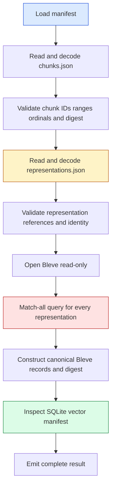
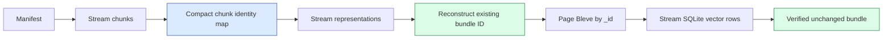

# CoinVault Verifier Memory Scaling — Why RSS Grows and How to Operate It

This report analyzes the memory behavior of CoinVault's immutable knowledge-bundle verifier. The verifier runs before a bundle is trusted for deployment; it reads the manifest, chunks, representations, Bleve index, and SQLite vector index, then checks their identities against the manifest. The investigation measured five deterministic bundle sizes locally and added the same memory telemetry contract used by the indexer build command.

The investigation first established that the eager verifier reached 2,205,364,224 bytes of external process RSS and 2,146,291,712 bytes of cgroup memory on the exact 114,106-representation bundle. The bounded implementation now verifies that same immutable bundle with unchanged identity at 280,842,240 bytes peak external RSS and 92,467,200 bytes peak cgroup usage. A second exact run completed under a 512 MiB hard limit.

> [!summary]
> - The eager container baseline peaked at 2.054 GiB RSS and 1.999 GiB cgroup usage; retained decoded text and all-hit Bleve inspection caused the peak.
> - Streaming JSON validation and paged Bleve inspection reduced peak RSS by 87.27% and cgroup usage by 95.69% without changing schema version, digests, or bundle ID.
> - The exact bundle passed both the comparable 8 GiB run and a 512 MiB hard-limit run. Runtime increased from 37.07 seconds to 49.71 seconds.

## 1. The question and the boundary

The operational question was whether the large CoinVault knowledge bundle could be verified locally and whether its memory use was proportional to bundle size. This question must distinguish three operations:

1. **Index construction** embeds documents and publishes a new bundle. It has already been redesigned around staged writes and bounded consumers.
2. **Bundle verification** checks that an immutable bundle is internally consistent and that its persisted backends match the manifest. It does not call OpenAI or open the application database.
3. **Bundle serving** opens already-verified indexes for retrieval. It is a long-lived service operation and should not repeat full verification on every request.

This report concerns operation 2. The public entry point is:

```text
rag/indexbundle.Verify(ctx, VerifyOptions) (Manifest, error)
```

CoinVault exposes it through:

```text
coinvault knowledge verify \
  --bundle /path/to/bundle \
  --expected-bundle-id ... \
  --expected-corpus-path ...
```

The command is read-only. It validates artifacts before activation; it does not publish or mutate a bundle.

## 2. Verification sequence

The verifier has stable stage callbacks. Each callback occurs after the stage has completed successfully.



The implementation is in `/home/manuel/code/wesen/go-go-golems/ragkit/rag/indexbundle/verify.go` and `/home/manuel/code/wesen/go-go-golems/ragkit/rag/indexbundle/open.go`. The sequence is currently eager: chunks and representations are decoded into Go slices and remain reachable while later stages execute.

The essential control flow is:

```go
state := loadVerifiedManifest(ctx, path)
observe(VerifyStageManifest)

chunks := loadVerifiedChunks(ctx, state)
observe(VerifyStageChunks)

data := loadVerifiedStoredData(ctx, chunks)
observe(VerifyStageRepresentations)

validateLexicalBackendIdentity(ctx, data)
observe(VerifyStageLexical)

validateVectorBackendIdentity(ctx, data)
observe(VerifyStageVector)
observe(VerifyStageComplete)
```

`loadVerifiedChunks` reads the complete `chunks.json` file with `os.ReadFile`, decodes it, validates every chunk, constructs identity maps, and computes a canonical JSON digest. It returns the slice rather than releasing it. `loadVerifiedStoredData` then reads the complete `representations.json` file, validates references to the retained chunk slice, computes the representation digest, and returns both slices in `verifiedData`.

The operation-specific telemetry added in CoinVault wraps this sequence with `knowledgebuild.Sampler`. Verification stages update a content-free `BuildState`; the sampler records Go heap statistics, process RSS, cgroup values when available, garbage-collection count, stage, and progress. The normal command remains unchanged because `--memory-metrics` defaults to `off`.

## 3. Is the relationship linear?

The answer is “monotone and approximately increasing, but not strictly linear.” The experiment generated deterministic bundles with the same shape at every size: three chunks per document, two representations per chunk, 1,536-dimensional synthetic vectors, and 1,400 bytes of representation text. Only the representation count changed.

| Representations | Duration | External peak RSS | External anonymous | In-process peak RSS |
|---:|---:|---:|---:|---:|
| 10,000 | 5.34 s | 242 MiB | 175 MiB | 231 MiB |
| 25,000 | 10.92 s | 621 MiB | 567 MiB | 585 MiB |
| 50,000 | 20.60 s | 828 MiB | 794 MiB | 849 MiB |
| 75,000 | 31.61 s | 1.03 GiB | 977 MiB | 1.05 GiB |
| 114,106 | 47.35 s | 1.74 GiB | 1.69 GiB | 1.78 GiB |

The measured relationship is shown below. The external RSS and anonymous-memory series come from the process sampler; the in-process RSS series comes from the verifier's EMF events. The SVG is committed beside this report so the figure remains available when the temporary `/tmp` experiment directory is removed.

![[CoinVault verifier memory sweep.svg]]

_Figure 1. Peak memory increases with representation count; the final point is the exact full bundle shape._

The external RSS values are the maxima from `/proc/<pid>/status` and `smaps_rollup`. The in-process values are maxima from EMF events emitted by `knowledge verify --memory-metrics cloudwatch`. The measurements are close, but they are sampled independently and can observe different instants during a short-lived allocation peak.

An ordinary least-squares fit over the five external RSS points is:

```text
RSS(bytes) ≈ 161,671,942 + 14,430.75 × representations
```

The fitted slope is about 137.6 MiB per 10,000 representations, with an intercept of about 154 MiB. This is useful for an initial estimate, not a guarantee. The residuals are material because the verifier has thresholds and temporary simultaneous allocations rather than one uniform per-record cost.

| Interval | RSS increase | Added representations | Increase per representation |
|---|---:|---:|---:|
| 10k → 25k | 409 MiB | 15k | 27.9 KiB |
| 25k → 50k | 239 MiB | 25k | 9.8 KiB |
| 50k → 75k | 216 MiB | 25k | 8.6 KiB |
| 75k → 114,106 | 765 MiB | 39,106 | 20.0 KiB |

Go allocation classes, garbage-collection timing, JSON capacity growth, and the Bleve search-result shape affect the maxima. The correct production statement is:

> Memory is strongly size-dependent and reaches approximately 1.9 GB at the current full bundle. It is not safe to extrapolate with a single exact bytes-per-representation constant without a margin and a container measurement.

## 4. What consumes memory

### 4.1 Raw JSON and decoded slices coexist

`readJSON` first reads an entire JSON file into a `[]byte` and then decodes that byte slice into a Go slice. During decoding, the raw bytes and decoded object graph coexist. After `readJSON` returns, the raw byte slice becomes collectible, but the decoded data remains reachable through `verifiedData`.

For the large bundle, this happens twice:

```text
chunks.json bytes        + decoded []rag.Chunk
representations.json     + decoded []rag.Representation
```

The chunk slice remains live while representations are decoded and validated. The representation slice remains live while Bleve is inspected. This is the main structural reason the peak is not bounded by one small record buffer.

### 4.2 Validation creates auxiliary maps and digest material

Chunk validation creates maps for chunk IDs, document IDs, and per-document ordinals. Representation validation creates identity and reference checks over the retained slices. Canonical identity checks call JSON digest functions, which serialize data into temporary buffers while the source slices remain live.

The memory is not just the text size. Each Go string has header metadata, each struct has fields and alignment, each map has bucket overhead, and each digest pass creates transient encoded data. A bundle with short on-disk records can still consume substantially more RSS after decoding.

### 4.3 Bleve verification requests every record

`bleve.InspectContentDigest` performs a match-all query with `manifest.RepresentationCount` as the result limit and requests all canonical fields:

```go
request := blevelib.NewSearchRequestOptions(
    blevelib.NewMatchAllQuery(), manifest.RepresentationCount, 0, false,
)
request.SortBy([]string{"_id"})
request.Fields = []string{
    "representation_id", "chunk_id", "document_id",
    "kind", "title", "body",
}
result, _ := index.Search(request)

records := make([]Record, 0, len(result.Hits))
for _, hit := range result.Hits {
    records = append(records, canonicalRecord(hit))
}
return digest.JSON(records)
```

At the point `records` is built, the following can coexist:

- decoded chunks;
- decoded representations;
- Bleve's `result.Hits` and hit field values;
- the canonical `records` slice;
- JSON bytes produced for the digest.

The stage-grouped sweep supports this attribution. The largest sample was in the lexical stage for four of the five sizes. At 114,106 representations, the external peak was 1.74 GiB and the in-process peak was 1.78 GiB; the stage sequence showed substantial growth during chunks and representations, followed by the maximum during lexical inspection. The `complete` sample was small because temporary allocations had become unreachable and the runtime had performed garbage collection.

### 4.4 SQLite vector inspection is not the primary observed allocation

The verifier does not decode every 1,536-dimensional vector into a Go slice. `validateVectorBackendIdentity` calls SQLite inspection and compares model, dimensions, representation count, and content digest. Vector dimensions affect persisted index size and I/O, but the current memory peak is explained primarily by decoded JSON and Bleve inspection.

This distinction matters for capacity. Increasing vector dimensions can increase disk and verification time without increasing RSS in the same proportion. Increasing representation text, chunk count, or the number of Bleve fields can increase Go heap and search-result allocations directly.

## 5. Why the final sample is misleading

The verifier reports a `complete` stage after all checks return. That row is a terminal observation, not a peak-memory report. In the sweep, the complete-stage RSS was approximately 80–100 MiB for several cases even when the lexical-stage peak exceeded 1 GiB.

The Go runtime can return objects to its allocator while retaining virtual address space and some resident pages. A final `runtime.MemStats.HeapAlloc` value therefore does not reconstruct the maximum RSS reached earlier. Dashboards must record max-over-run values, not only the last event.

```text
stage samples:  manifest -> chunks -> representations -> lexical -> vector -> complete
metric meaning: point-in-time values plus monotone peak fields
capacity value: max RSS / max cgroup usage during the entire run
```

The EMF sink includes `PeakRSSBytes` and the external collector records a JSONL time series. Both are required for an accurate capacity decision.

## 6. Production consequences

### 6.1 The two-gibibyte task is not safe for the full bundle

The exact full bundle reached 1.87 GB of external RSS locally and previously failed during the development indexer at a two-gibibyte ECS memory limit. A two-gibibyte verifier task would have little room for allocator fragmentation, runtime variation, file-backed pages, logging, process startup, or a slightly larger corpus.

The current evidence supports these statements:

- The full verifier must not share a two-gibibyte limit with unrelated application work.
- The verifier should run as a one-shot task with an explicit memory allocation separate from the serving task.
- A provisional 4 GiB task is a reasonable starting point if the container baseline confirms the host result. This is a margin recommendation, not a completed capacity test.
- The final allocation should be chosen from the isolated cgroup peak plus a documented margin, then rechecked after bundle growth.

### 6.2 Never overlap verifier retries

The verifier is a single process and should be invoked by one ECS task at a time. An orchestration policy that launches a second verification while the first is reading the bundle can multiply memory use and EFS I/O. The deployment workflow must use a task lock or generation-specific job key.

The retry policy must distinguish a transient infrastructure failure from a deterministic bundle validation failure. A malformed bundle should stop without rapid retries. A stopped task caused by resource exhaustion should produce an alarm and require a capacity decision before retrying.

### 6.3 Observe cgroup memory, not only application heap

CloudWatch EMF events are emitted to stdout and captured by the ECS `awslogs` driver. The verify identity is deliberately separate from build telemetry:

```json
{
  "event_type": "knowledge_verify_memory_metric",
  "Component": "knowledge-verifier",
  "Stage": "lexical",
  "RSSBytes": 1915330560,
  "PeakRSSBytes": 1915330560,
  "Namespace": "CoinVault/KnowledgeVerify"
}
```

The ECS operation should alarm on cgroup utilization and task exit status. RSS and Go heap explain the process; cgroup current and limit determine whether the task is about to be killed. The local host cgroup cannot answer that question because it includes unrelated workspace cache. The isolated container run is mandatory before declaring an AWS alarm threshold.

The EMF contract now also publishes the bounded application position needed to
interpret those resource graphs: elapsed milliseconds; documents, chunks,
representations, vectors, processed and total counts; embedding batch size and
worker count; embedding-cache hits, misses, writes, and provider work calls;
heap/system-memory peaks; and cumulative garbage-collection pause time. The
verify terminal sample includes the validated manifest counts and terminal
state. The dimensions remain `Environment`, `Component`, and `Stage` only;
bundle IDs, paths, provider names, and other high-cardinality values are event
metadata or deliberately omitted rather than becoming separate CloudWatch
series. This makes the telemetry suitable for dashboards without unbounded
metric proliferation.

### 6.3.1 Isolated Docker result

The exact exported development bundle was subsequently verified in a local
Docker container with an 8 GiB cgroup limit, one CPU, a read-only bundle mount,
and synchronized 250 ms application and external sampling. The run used bundle
`rk-ed6c4e01a46f5cde946d87bf43cea47f`: 19,977 documents, 57,053 chunks, and
114,106 representations. It completed in 37.07 seconds with exit status zero
and `OOMKilled=false`.

| Measurement | Peak |
|---|---:|
| External RSS/HWM | 2,205,364,224 bytes (2.054 GiB) |
| Anonymous/private-dirty | 2,141,069,312 bytes (1.994 GiB) |
| Cgroup current | 2,146,291,712 bytes (1.999 GiB) |
| Cgroup anonymous | 2,141,069,312 bytes (1.994 GiB) |
| Cgroup file | 0 bytes at sampled instants |
| In-process RSS | 2,205,356,032 bytes (2.054 GiB) |
| Go heap allocation | 1,975,095,080 bytes (1.840 GiB) |
| Go runtime system memory | 2,148,167,416 bytes (2.001 GiB) |

The graph below joins each external proc/smaps/cgroup sample to the nearest EMF
event within 375 ms. The upper panel attributes memory; the lower panel shows
the verifier application stage and cumulative GC count. Verification currently
reports corpus counts only in its successful terminal event, so stage is the
meaningful application coordinate during the run. Embedding counters remain
zero because verification does not invoke an embedding provider.

![[CoinVault full container correlated telemetry.svg]]

_Figure 2. Synchronized Docker memory attribution aligned with verifier stage and GC activity._

The result resolves the principal attribution question. The full verifier is
dominated by anonymous/private-dirty memory rather than file-backed cgroup
cache. A 2 GiB task is unsafe: sampled cgroup usage alone reached approximately
1.999 GiB, before allowing for runtime variance or corpus growth. A 4 GiB
one-shot verifier task is the pragmatic provisional allocation for this bundle.
That recommendation still requires one Fargate/EFS confirmation and does not
automatically size the separate indexing build.

### 6.3.2 Bounded verifier result

RagKit commit `7e4072a` separates one-shot verification from the eager serving
loader. A strict `json.Decoder` walks `chunks.json` and
`representations.json` one value at a time. Each value is validated and fed to
`digest.JSONSequence`, which emits the same canonical separators and encoded
values as `encoding/json` would emit for the complete non-nil slice. The
verifier retains chunk and representation identities, not their complete text
payloads. Bleve inspection requests 512 `_id`-sorted records at a time and
folds them into the existing lexical content digest. SQLite vector inspection
was already an ordered streaming fold and did not change.



The 8 GiB before/after run used the exact same bundle, one CPU, read-only
mount, 250 ms EMF sampling, and 250 ms external sampling.

| Measurement | Eager verifier | Streaming verifier | Reduction |
|---|---:|---:|---:|
| External RSS | 2,205,364,224 B | 280,842,240 B | 87.27% |
| Anonymous memory | 2,141,069,312 B | 90,038,272 B | 95.79% |
| Cgroup usage | 2,146,291,712 B | 92,467,200 B | 95.69% |
| Cgroup anonymous | 2,141,069,312 B | 90,537,984 B | 95.77% |
| Runtime | 37.07 s | 49.71 s | 34.1% slower |

![[CoinVault verifier eager versus streaming memory.svg]]

_Figure 3. Exact-bundle eager and streaming verifier peaks under the same 8 GiB container limit._

The 512 MiB proof run also completed with exit status zero and
`OOMKilled=false`. Its peak external RSS was 282,648,576 bytes, peak anonymous
memory was 91,594,752 bytes, and peak sampled cgroup usage was 86,523,904
bytes. External RSS includes mappings that are not equivalent to private
charged anonymous pages, so ECS sizing and alarms should continue to use
cgroup usage as the kill boundary and retain RSS as diagnostic context.

This is a bounded-payload design rather than a strict constant-space design.
Identity and uniqueness maps still grow with record count. They are compact
strings and set entries instead of the corpus text and vector coordinates that
dominated the eager verifier. A temporary disk relation is unnecessary at the
current scale; it remains a later option if identity-map memory becomes
material.

#### The code boundary that changed

The refactor intentionally does not change the serving bundle API. Serving
still calls `loadVerifiedBundle`, obtains complete `[]rag.Chunk` and
`[]rag.Representation` slices, and exposes them on `indexbundle.Bundle`.
Changing that API would affect query-time callers and would mix a release-gate
memory problem with a serving architecture project.

Only `indexbundle.Verify` moves onto the bounded path:

| File and API | Responsibility after the change |
|---|---|
| `rag/indexbundle/verify.go` | Orchestrates manifest, chunks, representations, lexical, vector, and complete stages. |
| `rag/indexbundle/verify_stream.go:streamJSONArray` | Strictly decodes one JSON-array value, calls its validator, and contributes it to the existing canonical digest. |
| `rag/indexbundle/verify_stream.go:streamVerifiedChunks` | Validates chunk identities, ranges, content digests, duplicate IDs, document counts, and ordinals. |
| `rag/indexbundle/verify_stream.go:streamVerifiedStoredIdentity` | Validates representation identities and lineage, collects kinds, and reconstructs the existing bundle ID. |
| `rag/lexical/bleve/index.go:InspectContentDigest` | Opens Bleve read-only and digests 512 `_id`-sorted logical records per request. |
| `rag/vector/sqliteexact/index.go:Inspect` | Continues to scan ordered SQLite rows through `digest.JSONSequence`; no vector change was required. |

The central streaming primitive has this logical form:

```text
streamJSONArray(path, consume):
    open path
    require first token == '['

    digest = JSONSequence(yield):
        while decoder has another element:
            check context cancellation
            decode exactly one typed value
            reject unknown fields
            consume(index, value)       // validate and update compact state
            yield(value)                // canonical encoding/json contribution

        require closing token == ']'
        require next decode == EOF      // reject trailing values

    return count, digest
```

`JSONSequence` writes the opening bracket, canonical JSON encoding for each
typed value separated by commas, and the closing bracket. Consequently, it
produces the same SHA-256 input bytes as `digest.JSON(nonNilSlice)` even when
the source file contains insignificant whitespace. Hashing the source file
directly would not provide this compatibility.

#### Validation state and complexity

The chunk pass retains `chunk ID -> content digest`. Per-document ordinal sets
exist only during the chunk pass and can be released before backend
inspection. The representation pass retains a representation-ID set for
duplicate detection and a small set of representation kinds. The current
value's text is discarded after validation and digest contribution.

Let (C) be chunk count, (R) representation count, (P) Bleve page size,
and (L_{max}) the largest encoded value. The relevant payload-memory shape
is:

```text
O(C identity entries + R identity entries + P records + L_max)
```

It is not:

```text
O(total chunk text + total representation text + all Bleve hits + all vectors)
```

This distinction explains why record-count metadata remains visible in heap
measurements while the approximately two-gibibyte anonymous peak disappears.
The implementation uses in-memory maps because 57,053 chunk identities and
114,106 representation identities are inexpensive at this scale. A disk-backed
identity relation would add lifecycle and I/O complexity without solving a
measured current problem.

#### Stage-level result data

The bounded run's stage maxima show that representation identity validation is
now the largest observed RSS stage, while charged anonymous memory remains
below 91 MiB. The lexical stage is longer but no longer owns an all-hit result
set.

| Completed stage | Samples | End elapsed | Peak external RSS | Peak anonymous | Peak cgroup | Peak Go heap |
|---|---:|---:|---:|---:|---:|---:|
| manifest | 6 | 1.86 s | 87.3 MiB | 41.7 MiB | 43.4 MiB | 25.2 MiB |
| chunks | 12 | 5.39 s | 93.3 MiB | 47.5 MiB | 49.0 MiB | 37.9 MiB |
| representations | 65 | 24.20 s | 267.8 MiB | 85.9 MiB | 88.2 MiB | 69.7 MiB |
| lexical | 87 | 48.60 s | 81.4 MiB | 32.2 MiB | 33.3 MiB | 10.9 MiB |
| complete | 1 | 48.88 s | 73.0 MiB | 23.7 MiB | 24.7 MiB | 8.2 MiB |

The apparent difference between external RSS and cgroup anonymous memory is
not an arithmetic inconsistency: RSS includes resident mappings with different
charging and sharing behavior, while `memory.current` and `memory.stat` report
the container cgroup's charged pages. The hard 512 MiB run is the important
operational check because the kernel enforced that limit directly.

#### Compatibility and failure tests

The implementation was accepted only after the following gates:

- canonical digest parity between streamed values and `digest.JSON`;
- rejection of non-array input, unknown fields, trailing JSON, and canceled
  contexts;
- Bleve content-digest parity at page sizes 1, 2, and 512;
- existing end-to-end bundle build and verification with the same bundle ID;
- focused race tests for `rag/indexbundle` and `rag/lexical/bleve`;
- complete RagKit unit tests, lint, Logcopter generation checks, `go generate`,
  generation cleanliness, and `go build ./...`;
- complete CoinVault unit tests and build against the pinned RagKit commit;
- two exact-bundle container executions with terminal identity and counts.

The raw-representation invariant deserves explicit treatment. The eager
validator compared chunk and raw-representation strings directly. The bounded
validator recomputes SHA-256 for each current string and then compares their
required content identities. This avoids retaining every chunk string and is
consistent with the content-addressed integrity model used throughout the
bundle. A reviewer who does not accept SHA-256 equality as the identity
contract should require a disk-backed exact-text relation; retaining all text
again would defeat the purpose of this change.

#### Cost and rejected extensions

The measured cost is a 12.64-second runtime increase. Offset-based Bleve
pagination performs repeated ordered searches and is less efficient than one
all-hit request. A search-after cursor could reduce this cost, but it would add
backend-specific cursor semantics and new ordering edge cases. Verification
runs infrequently, and 49.71 seconds is operationally acceptable, so the
current implementation favors the smaller API and stronger reviewability.

The vector digest was not replaced. SQLite verification already reads rows in
stable order and streams them through the canonical digester. Changing that
hash would have changed vector content identity and the containing bundle ID
without reducing the measured peak. Merkle trees, schema version 2, raw file
hashes, resume checkpoints, and disk-backed identity maps were rejected for
the same proportionality reason: they are potential future capabilities, not
requirements for the observed verifier failure.

### 6.4 Separate file-backed memory from anonymous memory

The external sampler records `anonymous_bytes`, `pss_bytes`, `private_dirty_bytes`, and cgroup file bytes. A high cgroup total with low anonymous memory can represent EFS-backed or page-cache residency rather than Go heap:

- high anonymous/private-dirty memory indicates decoded records, maps, search results, or runtime allocations;
- high file-backed memory indicates index pages and EFS read caching;
- high PSS with lower RSS indicates shared mappings or shared index pages.

The current host series is dominated by anonymous memory at the largest sizes, but the shared host cgroup prevents clean cgroup attribution. The container report is the production-relevant evidence.

## 7. Streaming remediation for larger bundles

The verifier no longer retains every logical record to prove a digest. The
bundle format supplies a deterministic order, and the existing canonical
digest is updated incrementally. Serving remains eager because the public
`Bundle` exposes complete slices; verification uses its own compact state.

The implementation changes the memory contract in three places:

1. Decode chunks and representations incrementally from an ordered JSON stream or newline-delimited representation format.
2. Validate each record against compact ID state and digest state, releasing record text after processing.
3. Iterate Bleve records in bounded pages, update the canonical digest in `_id` order, and never construct a full `result.Hits` or `records` slice.

The digest algorithm must be specified before changing the format. Incremental hashing is equivalent to the current `digest.JSON(records)` only when serialization order, separators, escaping, and record boundaries are exactly defined. A streaming implementation that changes the byte sequence would change bundle identity and invalidate existing manifests.

The safe sequence is:

```text
measure isolated current verifier
  -> define canonical streaming digest contract
  -> add paged backend inspection
  -> add bounded JSON decoder
  -> prove identity parity against existing bundles
  -> repeat the five-size sweep
  -> lower ECS allocation only after the new peak is measured
```

Streaming is not required to serve a verified bundle. It is now the default
for the one-shot verification gate, where the full bundle exceeded the former
memory envelope.

## 8. Reproduction and artifacts

The implementation and evidence are split across three repositories.

### CoinVault

- `/home/manuel/code/gec/coinvault/cmd/coinvault/cmds/knowledge.go` — verify flags and sampler lifecycle.
- `/home/manuel/code/gec/coinvault/internal/knowledgebuild/telemetry_emf.go` — Zerolog and CloudWatch EMF sinks.
- Commit `bf1e3c7` — adds verifier telemetry and distinct operation identities.
- Commit `7ce24f0` — publishes application progress, cache counters, runtime peaks, and GC timing through EMF.

### RagKit

- `/home/manuel/code/wesen/go-go-golems/ragkit/rag/indexbundle/verify.go` — verification stages.
- `/home/manuel/code/wesen/go-go-golems/ragkit/rag/indexbundle/verify_stream.go` — strict streaming JSON validation and compact identity state.
- `/home/manuel/code/wesen/go-go-golems/ragkit/rag/indexbundle/open.go` — eager JSON loading and identity validation.
- `/home/manuel/code/wesen/go-go-golems/ragkit/rag/lexical/bleve/index.go` — read-only Bleve inspection.
- Commit `cb7e939` — opens Bleve verifier indexes read-only.
- Commit `7e4072a` — streams bundle verification and pages Bleve inspection.

### Investigation ticket

- `/home/manuel/code/gec/2026-03-16--gec-rag/ttmp/2026/08/10/COINVAULT-INDEX-OOM-001--bounded-memory-full-knowledge-bundle-build/reference/01-investigation-diary.md` — chronological evidence and decisions.
- `scripts/02-sample-linux-memory.sh` — process, smaps, and cgroup sampler.
- `scripts/03-run-verifier-host.sh` — host verifier runner with optional sink mode.
- `scripts/07-generate-verifier-scaling-bundles.go` — deterministic production-shaped fixtures.
- `scripts/08-run-verifier-scaling-hosts.sh` — sequential sweep runner.
- `scripts/09-summarize-verifier-sweep.sh` — CSV/SVG summary generator.
- `/tmp/coinvault-verifier-sweep-results-20260811/summary.csv` — measured values.
- `CoinVault verifier memory sweep.svg` — embedded graph of peak memory.
- `sources/04-streaming-verifier-8g-*` — comparable streaming telemetry.
- `sources/05-streaming-verifier-512m-*` — hard-limit proof telemetry.
- `sources/06-verifier-before-after.{csv,svg}` — reproducible comparison.

The ticket tasks now mark telemetry integration, local export verification,
and the isolated host/container baseline complete. The remaining operational
validation is one development Fargate/EFS verifier run using the same EMF
contract, followed by CloudWatch dashboards and alarms.

## 9. Operational checklist

Before running a full production-style verification task:

- Confirm the bundle ID, corpus digest, and archive SHA-256 from the release receipt.
- Confirm the task is the only verifier for that bundle generation.
- Confirm the task memory limit is above the measured isolated peak plus the approved margin.
- Confirm the task mounts the bundle read-only and uses the RagKit read-only Bleve path.
- Enable `--memory-metrics cloudwatch` and record the metric namespace and component.
- Capture task exit reason, peak cgroup bytes, peak RSS, peak anonymous bytes, duration, and stage maxima.
- Stop automatic retries after a deterministic validation error or a memory-limit failure.
- Preserve the failed bundle and logs until the cause has been classified.

The serving service should consume only a bundle that passed this procedure. Verification is a release gate, not a request-time fallback.

## 10. Current status and next step

The bounded verifier, compatibility gates, exact 8 GiB comparison, and 512 MiB
proof are complete. The original 4 GiB provisional recommendation is no longer
appropriate for this verifier. For the current exact bundle, 512 MiB is a
demonstrated local ceiling; a 1 GiB one-shot ECS verifier is the pragmatic
initial development allocation because it provides substantial environment
and growth margin without returning to multi-gibibyte sizing.

The next operational action is one development ECS/Fargate verification
against EFS using the same image and EMF contract. If its peak remains well
below 512 MiB, adopt 1 GiB for scheduled verification and alarm on sustained
cgroup utilization above 75%, terminal failure, or `OOMKilled`. Index building
is a separate workload and must retain its independently measured allocation.
