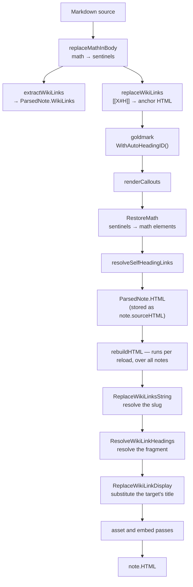

# Wiki-Link Resolution in publish-vault: Three Slug Algorithms and the Links Between Them

`publish-vault` renders this vault — 1833 Markdown notes — into the site at `parc.yolo.scapegoat.dev`. A note written in Obsidian refers to another note as `[[Some Note]]`, and the renderer has to turn that into a URL. This report is about four defects in that translation, all of which produced links that looked correct in the rendered HTML and went nowhere when clicked.

The defects are not independent. Three separate functions in the renderer convert human-readable text into URL-safe identifiers, they disagree about what that conversion is, and each defect is a place where a value produced by one of them was consumed by another under the assumption that they agreed. Naming that structure is the useful part of this note; the individual fixes follow from it.

> [!summary]
> - A URL-safe identifier is not a canonical form. Three functions in the same renderer produce three different identifiers for the same heading text, and any code that generates a value for one of them to consume must be checked against that consumer, not assumed compatible.
> - When the identifier a link must point at is generated by a library you do not control, read it back out of the output rather than reimplementing the generator. Reimplementation cannot reproduce state — goldmark's duplicate-heading counter — and drifts silently when the library changes.
> - A lossy transformation destroys the information needed to repair its own output. `slugify("9.2 Kernel K0")` yields `9-2-kernel-k0`, from which the original heading cannot be recovered; repairing the fragment later required carrying the heading text forward in an attribute.
> - Two of the four defects rendered as *invisible* markup — an anchor with empty element content, and a fragment naming an identifier that does not exist. Neither produces an error, a log line, or a visual difference. They were found by rendering real notes and asserting on the output, not by reading code.

## Why this note exists

The work was prompted by one note in this vault, `Transcripts/Research/09 - RAG-MATHS Pattern Zoo.md`, whose central contribution is a cross-reference table linking terminology to the exact place each term was introduced:

```markdown
| Name or alias | Exact source sighting |
|---|---|
| Canonical identity | [[Transcripts/2026/08/09/Designing RAG Abstractions/Compositional_Retrieval_Systems_Thesis.md#9.2 Kernel K0: canonical identity]] |
| Semantic invocation key | [[Transcripts/2026/08/08/Job System Design Thesis/Compositional_RAG_Job_System_Thesis_MathJax.md#7.2 Semantic invocation key]] |
```

Every row of that table was dead in the published site. The table is the note; without working links it is a list of strings.

Measuring the vault afterwards showed the scope was not confined to one note:

| Link form | Occurrences | Notes containing them |
|---|---|---|
| `[[Target.md]]` — target carrying a file extension | 294 | 6 |
| `[[#Heading]]` — link to a heading in the same note | 60 | 6 |
| `[[Target#Heading]]` — link into another note's heading | 535 | 26 |

The work is ticket `PV-WIKILINK-021` and pull request #19 against `go-go-golems/publish-vault`: 10 commits, 882 inserted lines across six source files, of which 565 are tests.

## The system

A wiki link becomes a URL in two stages, separated by the Markdown renderer.

The first stage runs per note, in `internal/parser`. Before goldmark sees the source, LaTeX math is lifted out and replaced with sentinels, then `[[…]]` spans are replaced with anchor HTML. goldmark then renders the document, generating an `id` attribute for every heading. A series of post-passes runs over the rendered HTML, and the math is restored last.

The second stage runs across the whole vault, in `pkg/vault`. Once every note is loaded, the vault knows which slugs exist, and `rebuildHTML` re-runs the resolution passes over each note's parser output. It re-runs from the parser output rather than from the previously rendered HTML on every reload, because each resolution depends on vault state that changes between reloads.



The split matters for every defect below. Anything a link needs that depends only on its own note can be settled in stage one. Anything that depends on another note cannot be settled until stage two.

## Three slug algorithms

The renderer contains three independent implementations of "convert text to a URL-safe identifier".

**`parser.slugify`** produces note slugs and, until this work, wiki-link fragments:

```go
func slugify(s string) string {
	s = strings.ToLower(strings.TrimSpace(s))
	s = regexp.MustCompile(`[^a-z0-9\-_/]`).ReplaceAllString(s, "-")
	s = regexp.MustCompile(`-+`).ReplaceAllString(s, "-")
	return strings.Trim(s, "-")
}
```

Every character outside `[a-z0-9\-_/]` becomes `-`, and runs of `-` collapse. The `/` is preserved because a slug is a path.

**goldmark's auto heading ID** produces the `id` attribute on every heading. From `goldmark@v1.7.17/parser/parser.go`:

```go
for i := 0; i < len(value); {
	v := value[i]
	l := util.UTF8Len(v)
	i += int(l)
	if l != 1 {
		continue                       // multi-byte: dropped entirely
	}
	if util.IsAlphaNumeric(v) {
		if 'A' <= v && v <= 'Z' { v += 'a' - 'A' }
		result = append(result, v)
	} else if util.IsSpace(v) || v == '-' || v == '_' {
		result = append(result, '-')
	}
	// every other ASCII byte: dropped
}
```

ASCII alphanumerics are kept and lowercased, ASCII space, `-` and `_` become `-`, and **everything else is discarded** — including every non-ASCII character, since the `l != 1` branch skips multi-byte runes without emitting anything. Runs are not collapsed. If nothing survives, the result is the literal string `heading`, and duplicates are disambiguated with a `-1`, `-2` suffix drawn from a set of identifiers already issued for that document.

**`titleToSlug`** in `web/src/vault/staticVault.ts` serves the static demo build: `[^a-z0-9-/]` is deleted rather than replaced.

The three disagree on any text that is not purely ASCII letters, digits and spaces:

| Heading text | `slugify` | goldmark id | `titleToSlug` |
|---|---|---|---|
| `Identity is an API decision` | `identity-is-an-api-decision` | `identity-is-an-api-decision` | same |
| `9.2 Kernel K0: canonical identity` | `9-2-kernel-k0-canonical-identity` | `92-kernel-k0-canonical-identity` | — |
| `Pattern 1 — Semantic Identity` | `pattern-1-semantic-identity` | `pattern-1--semantic-identity` | — |
| `Entity–Derivation–Observation Separation` | `entity-derivation-observation-separation` | `entityderivationobservation-separation` | — |
| `Привет мир` | `` (empty) | `-` | — |
| `日本語の見出し` | `` (empty) | `heading` | — |
| `foo.md` | `foo-md` | — | `foomd` |

The last three rows are the ones that settle the design question in a later section. The two identifiers do not merely differ in punctuation handling; for a heading with no ASCII alphanumerics at all, one produces the empty string and the other produces a fixed fallback that will collide with every other such heading in the document.

## Defect one: the extension that became part of the slug

Obsidian writes `[[Note]]` and `[[Note.md]]` interchangeably; the second form is what it emits under the "absolute path in vault" link setting, and what a language model writing a note produces, because it is copying a file path.

A note's slug is built from its path with the extension removed:

```go
func pathToSlug(relPath string) string {
	s := filepath.ToSlash(relPath)
	s = strings.TrimSuffix(s, ".md")     // before this work
	return parser.Slugify(s)
}
```

`buildWikiLinkIndex` registers every progressive path suffix the same way, also extension-free. But `wikiLinkHTML` slugified the link target verbatim, and `slugify` replaces the dot rather than dropping it. The target did not fail to convert; it converted to a *different, well-formed identifier*:

```
"…/rag-ttc-p01-p03-doctoral-thesis.md" → "…/rag-ttc-p01-p03-doctoral-thesis-md"
```

Nothing in the index answers to that key. Two distinct outcomes follow.

**The link dies.** `ReplaceWikiLinksString` rewrites the href of an unresolved link to a same-page anchor so it is not crawlable:

```html
<a href="#unresolved-transcripts/…/rag-ttc-p01-p03-doctoral-thesis-md" class="wiki-link"
   …>Transcripts/2026/08/06/RAG DSL for Retrieval/rag-ttc-p01-p03-doctoral-thesis.md</a>
```

Three things are lost together. The destination, obviously. The `#Identity is an API decision` fragment, because the entire href is replaced. And the display text: `ReplaceWikiLinkDisplay` substitutes the target note's title only for a slug that resolved, so the reader sees a raw file path where a title belongs. That is why these tables looked wrong in the site rather than merely being unclickable.

**The link reaches the wrong note.** `foo.md` and `foo md` both slugify to `foo-md`. A vault holding `…/doctoral-thesis.md` alongside `…/doctoral-thesis md.md` resolves the extension-bearing link to the second, with no broken-link styling and nothing in the page to indicate it. The same collision can come from a note *title*, because `buildWikiLinkIndex` also registers `Slugify(note.Title)` — a note titled "Doctoral Thesis MD" captures links meant for "Doctoral Thesis".

The second outcome is rare and is what makes this a correctness defect rather than a cosmetic one. It was not observed in this vault; it was demonstrated by constructing the colliding note deliberately, which is also what the regression test does.

The fix strips one trailing `.md` in `parseWikiLinkInner`, the single function every consumer of a link target passes through:

```go
func parseWikiLinkInner(inner string) (string, string, string) {
	alias, heading := "", ""
	if idx := strings.Index(inner, "|"); idx >= 0 { alias = strings.TrimSpace(inner[idx+1:]); inner = inner[:idx] }
	if idx := strings.Index(inner, "#"); idx >= 0 { heading = strings.TrimSpace(inner[idx+1:]); inner = inner[:idx] }
	target := StripNoteExtension(strings.TrimSpace(inner))
	return target, alias, heading
}
```

Placing it there rather than in `slugify` matters in both directions. `slugify` is generic — it also converts headings and titles, so stripping there would truncate a heading such as `Notes on reading foo.md`. And putting it at the single choke point means the slug, the href, the `data-target` attribute, the fallback display text, the backlink graph and the plain-text search excerpt cannot disagree about what the target is.

The alternative considered and rejected was to register the `…-md` key in `buildWikiLinkIndex` as well. That converts a miss into a *guaranteed* collision with any note whose name ends in " md" — it makes the second failure mode systematic instead of removing it.

Rendering the Pattern Zoo note through a vault staged with its 39 link targets:

| | before | after |
|---|---|---|
| unresolved link occurrences | 92 | 0 |
| distinct wiki links recorded | 46 | 40 |

The second row was not anticipated. `extractWikiLinks` deduplicates on `target + "|" + alias`, so `[[X.md]]` and `[[X]]` were two separate edges to one note: the outgoing-link graph double-counted, and a note reachable both ways received two backlink entries from a single source. Normalising the target repairs the graph as a side effect.

## Defect two: the link with no target

A wiki link can have no target at all. `[[#Pattern 1 — Semantic Identity]]` names a heading in the note it sits in, and this note's table of contents is written that way — 60 such links across the vault.

`wikiLinkHTML` sent it down the ordinary path with an empty slug:

```html
<a href="/note/#pattern-1-semantic-identity" class="wiki-link"
   data-target="" data-raw="" data-alias=""></a>
```

Two defects in one tag. The element content is empty, so the link is invisible on the page: there is nothing to read and nothing to click. And `/note/` with no slug is the vault root, so the rare reader who found it was navigated out of the note entirely.

This is worth dwelling on as a class. The markup is well-formed, the renderer logs nothing, and the page has no visible gap where the link should be. There is no observation short of comparing the rendered output against the source that reveals it. The same is true of defect three below, and of the malformed-attribute finding in the review section.

## Why the fragment cannot be computed

The obvious repair is `href="#" + slugify(heading)`. It does not work, and understanding why determined the shape of both remaining fixes.

Heading anchors are not produced by `slugify`. They are produced by goldmark, and the table above shows the two agree only when a heading contains nothing but ASCII letters, digits and spaces. Five of seven headings taken from this vault disagree.

The failure has a property worth naming: a fragment computed with the wrong algorithm is *indistinguishable from a correct one* in the rendered HTML. A test asserting `href="#9-2-kernel-k0-canonical-identity"` passes. Review sees a plausible anchor. The only thing that catches it is rendering the heading and reading the identifier back.

Three approaches were available.

**Reimplement goldmark's algorithm.** Preserves existing anchor URLs, but leaves two implementations that must be kept in step forever, and cannot reproduce the duplicate-heading counter without also reproducing its state — the set of identifiers already issued for the document.

**Replace goldmark's generator with `slugify`,** via a custom `parser.IDs`. One algorithm everywhere, which is the tidiest end state. Rejected because heading identifiers are a published URL surface: `enhanceHeadingAnchors` injects a copyable `#` permalink into every heading, so regenerating them invalidates links that have already been shared.

**Read the identifiers back out of the rendered HTML.** Exact by construction, cannot drift when goldmark changes, and handles duplicates for free.

The third is what shipped. The non-Latin rows in the table are the strongest argument for it: for `## 日本語の見出し` the correct fragment is `heading`, and for a second such heading in the same document it is `heading-1`. No derivation from the heading text can produce those values, because they do not depend on the heading text — they depend on how many identifiers the document has already consumed.

The implementation is a single index built from the rendered output:

```go
func BuildHeadingIndex(htmlIn string) *HeadingIndex {
	idx := &HeadingIndex{byText: map[string]string{}, ids: map[string]bool{}}
	for _, m := range renderedHeadingRe.FindAllStringSubmatch(htmlIn, -1) {
		id, inner := m[1], m[2]
		idx.ids[id] = true
		key := normalizeHeadingKey(stdhtml.UnescapeString(htmlTagRe.ReplaceAllString(inner, "")))
		if key == "" { continue }
		if _, exists := idx.byText[key]; !exists {
			idx.byText[key] = id      // first heading with this text wins
		}
	}
	return idx
}

func (h *HeadingIndex) Lookup(heading string) (string, bool) {
	if h == nil { return "", false }
	if id, ok := h.byText[normalizeHeadingKey(heading)]; ok { return id, true }
	if h.ids[heading] { return heading, true }   // already-slugified form
	return "", false
}
```

Matching follows Obsidian: heading text, case-insensitive, runs of whitespace collapsed, first heading wins on duplicates. The `ids` fallback is not Obsidian behaviour; it accepts a link written in already-slugified form, which the language-model-authored notes in this vault produce, and it can only fire after the text match has failed.

For same-note links this is all that is required, and `resolveSelfHeadingLinks` rewrites the placeholder anchors in place. A target matching no heading renders `href="#unresolved-<slug>"` with a `broken` class — dotted red, styled already — and keeps its display text. A visibly broken link is a strictly better outcome than an invisible one.

## Defect three: fragments that named nothing

Cross-note links — `[[Other Note#Heading]]`, 535 occurrences across 26 notes — have the identical mismatch one level up. The parser wrote the fragment with `slugify`; the target's identifiers came from goldmark. In the Pattern Zoo note, **84 of 186** rendered cross-note fragments named an identifier absent from the target, so those links opened the correct note at the top of the page.

None of the 84 were typographical errors. Every heading named exists in its target. The renderer was naming them by the wrong scheme.

Two properties made this harder to fix than the same-note case.

**The information needed for the repair had already been destroyed.** `slugify` is lossy: `#9-2-kernel-k0-canonical-identity` does not say the heading was `9.2 Kernel K0: canonical identity`, and no inverse exists. The anchor therefore carries the heading text forward:

```html
<a href="/note/target#9-2-kernel-k0-canonical-identity" class="wiki-link"
   data-target="target" data-raw="Target"
   data-heading="9.2 Kernel K0: canonical identity" data-alias="">Target</a>
```

The fragment in the parser output is provisional. `data-heading` is what makes it repairable.

**The answer lives in a different note.** `Parse` sees one document, so resolution moved to `rebuildHTML`, which runs after every note is loaded — and, necessarily, after the slug has been resolved, since which note's headings to consult is not known until then:

```go
headingIndexes := map[string]*parser.HeadingIndex{}
headingIndexFor := func(slug string) *parser.HeadingIndex {
	if idx, seen := headingIndexes[slug]; seen { return idx }
	var idx *parser.HeadingIndex
	if target, ok := v.notes[slug]; ok {
		idx = parser.BuildHeadingIndex(target.sourceOrRenderedHTML())
	}
	headingIndexes[slug] = idx      // nil caches "not a published note"
	return idx
}

note.HTML = parser.ReplaceWikiLinksString(note.sourceOrRenderedHTML(), …)
note.HTML = parser.ResolveWikiLinkHeadings(note.HTML, func(slug, heading string) (string, bool) {
	return headingIndexFor(slug).Lookup(heading)
})
```

Living in `rebuildHTML` produces a property that was not the goal but is worth having: renaming a heading re-resolves every link pointing at it on the next reload, in both directions. The fragment is dropped when the heading disappears and restored when it returns. The regression test asserts both transitions.

A heading the target genuinely lacks drops the fragment rather than leaving one that is known to dangle. The three options were to keep the slugified fragment, drop it, or mark the link broken. Marking it broken is wrong — the link does reach a useful destination, just not the right position within it — and emitting an identifier the renderer knows does not exist is dishonest output. Dropping it leaves `href="/note/target"`, which is exactly what the link can honestly promise.

Cost was a consideration, because `rebuildHTML` walks every note on every reload and this vault has previously exhausted its container's memory limit during reload. Two guards: `ResolveWikiLinkHeadings` returns immediately on a `strings.Contains` scan when a note holds no heading link at all, which is most of them, and heading indexes are built only for slugs actually linked to with a heading, then cached across the whole pass so a popular target is indexed once rather than once per inbound link.

## Two findings from review

Automated review of the pull request produced two findings, both valid, both introduced by this work, and both instances of the same structure as the defects above.

### An uppercase extension that was already load-bearing

The vault walk accepts a file named `Note.MD`:

```go
if !strings.HasSuffix(strings.ToLower(info.Name()), ".md") { return nil }
```

But `pathToSlug` and `buildWikiLinkIndex` trimmed a lowercase `".md"` only, so such a note was published at the slug `note-md`. Before this work, `[[Note.MD]]` slugified to `note-md` and therefore resolved — correctly, by accident, because both ends were wrong in the same direction. Making the link-side strip case-insensitive broke it:

```
before this work:  [[Upper.MD]] → /note/upper-md    resolved
                   [[Upper]]    → unresolved
with the strip:    all forms    → unresolved            ← the regression
after the fix:     all forms    → /note/upper        resolved
```

The repair is to make `parser.StripNoteExtension` the single definition of the operation and route `pathToSlug`, both suffix loops in `buildWikiLinkIndex`, the title fallback in `loadNote` and the file-tree label through it. That also fixes `[[Upper]]`, the natural Obsidian form, which never reached a `.MD` file at all in either version. The cost is that such a note's slug changes from `note-md` to `note`, which is the correct URL rather than one with the file extension embedded in it.

### Math sentinels inside attribute values

LaTeX math is lifted out of the source before wiki links are replaced, so a heading such as `$\sigma$ bound` reaches `wikiLinkHTML` as a sentinel — a Private Use Area code point wrapping an index. `RestoreMath` then rewrites every sentinel it finds anywhere in the document, including inside an attribute value:

```html
data-heading="The <span class="math math-inline">\sigma</span> bound"
```

The quote before `math math-inline` closes `data-heading`; everything after it is parsed as further attributes on the anchor. The markup is malformed, the cross-note anchor no longer matches the pattern that repairs its fragment, and the provisional fragment survives.

The repair distinguishes two contexts for the same sentinel. Element content receives the math element, because that is where it renders. Attribute values and JSON fields receive the bare TeX:

| context | substitution | after tag-strip and unescape |
|---|---|---|
| element content — `RestoreMath` | `<span class="math math-inline">\sigma</span>` | `\sigma` |
| attribute, JSON — `RestoreMathText` | `\sigma` | `\sigma` |

`BuildHeadingIndex` strips tags and unescapes, so a heading rendered the first way and a `data-heading` written the second way reduce to the same key. The two substitutions are not merely both correct in isolation; the pair is what makes matching work.

This finding also corrected a claim made earlier in the implementation. The same-note heading pass had been placed *before* `RestoreMath`, on the stated reasoning that both sides would then carry the same placeholders. That reasoning was wrong: a heading and the link naming it are **separate math spans**, so they carry different sentinel indices for the same formula and never matched. The pass now runs after restoration, where both sides are the same TeX. The incorrect justification had been written into a code comment and a design document; both were corrected, which is the point of recording justifications where the code is.

## Measurement

Every figure in this note comes from a script that renders a real note and inspects the output, with the "before" column produced by checking out the pre-fix source. Three of the four defects are invisible in the rendered page, so assertions are made against the HTML, not against a screenshot or a reading of the code.

On `Transcripts/Research/09 - RAG-MATHS Pattern Zoo.md`:

| Measurement | before | after |
|---|---|---|
| unresolved link occurrences | 92 | 0 |
| distinct wiki links recorded | 46 | 40 |
| same-note links resolving to a real heading id | 0 | 24 |
| same-note anchors rendering with no visible text | 24 | 0 |
| same-note anchors pointing at `/note/#…` | 24 | 0 |
| cross-note fragments naming an absent identifier | 84 | 0 |
| cross-note fragments dropped as unresolvable | 0 | 0 |

The last row is the one that establishes the diagnosis. If those 84 links had named headings that did not exist, the fix would have produced 84 dropped fragments rather than 84 repaired ones. Zero dropped means every heading named was really there, and the renderer was addressing it incorrectly.

Each behavioural test was verified to fail against the pre-fix source before being committed. This is not a formality for defects of this shape: a test written against `slugify` for a fragment that must match goldmark passes both before and after, and asserts nothing.

## Derivation and resolution

The general statement is about two ways to obtain an identifier that another component owns.

**Derivation** computes the identifier from the same inputs the owner used. It is cheap, it works offline, and it is correct exactly as long as the reimplementation matches. It fails in three ways: the algorithms drift when the owner changes; state cannot be reproduced, so anything involving counters, collisions or ordering is out of reach; and — the property that matters most here — the failure is silent, because a wrong identifier is structurally identical to a right one.

**Resolution** reads the identifier out of the owner's output. It requires the output to be available, which imposes an ordering constraint and sometimes an index. It is exact by construction and stays exact across upgrades.

Derivation is the right choice when the identifier space is genuinely yours, as it is for `pathToSlug`: `publish-vault` decides what a note's URL is, and no other component gets a vote. Resolution is the right choice when the identifier is issued by something else, as heading anchors are issued by goldmark.

The diagnostic question is whether the generator has state. `slugify` is a pure function of its input, so a second implementation of it can be correct. goldmark's `Generate` consults a set of identifiers already issued for the document, so no pure function can reproduce it. The moment an identifier depends on anything other than the text it is derived from, derivation is not an option, whatever it looks like on the common cases.

The last three rows of the algorithm table make this concrete. For a heading with no ASCII alphanumerics, goldmark emits `heading`, and for the second such heading in the document, `heading-1`. Both values are determined by document position, not by heading text.

## Failure modes to check in similar systems

- **Two functions that convert text to identifiers, in the same program, with different character rules.** Test them against each other on punctuation, non-ASCII text, and repeated inputs, rather than on the ASCII cases where they will agree. The disagreements are what a link crosses.
- **A lossy transformation whose output another stage must repair.** If the transformation cannot be inverted, the input must be carried forward. Deciding this after the fact means adding an attribute or a field to a format already in use.
- **Generated markup that reaches an HTML attribute.** Any post-pass that rewrites text globally will also rewrite it inside attribute values, where inserted markup terminates the attribute at its first quote. A substitution needs a context-appropriate variant, or the pass needs to know where it is.
- **A code path that fails by rendering nothing.** An anchor with empty element content, an embed that resolves to an empty `div`, a fragment naming an identifier that does not exist: none of these log, error, or leave a visible gap. Assert on the output.
- **Pattern matching against markup you generate with a fixed attribute order.** It is safe while one function owns the generation, and it fails silently when someone adds an attribute. Note the coupling where the pattern is defined; the tests will catch it but a reader will not.
- **A behaviour that works because two components are wrong in the same direction.** `[[Note.MD]]` resolved only because the link side and the slug side both mishandled the uppercase extension. Correcting one side alone breaks it. Look for the pair before changing either.

## Working rules

- When code produces a value for another component to consume, verify it against that consumer's actual output rather than against a specification of it. Rendering one heading and reading the `id` back would have caught the fragment defect before any of it was written.
- Prefer resolution to derivation whenever the identifier is issued elsewhere, and check for generator state as the deciding test. A generator that consults what it has already issued cannot be reimplemented as a pure function.
- Normalise at the single point every consumer passes through. `parseWikiLinkInner` is where a link target is decomposed, so it is where the extension is stripped; the alternative was six call sites that could each drift.
- When a value cannot be repaired downstream, carry forward what the repair needs. `data-heading` exists solely because `slugify` is not invertible.
- Make a failed resolution visible. An unmatched heading renders a broken-styled link with its text intact, and an unresolvable fragment is dropped rather than emitted. Neither produces markup the renderer knows to be wrong.
- Record the reasoning for an ordering constraint next to the code, and correct it when it turns out to be wrong. The comment asserting that the heading pass had to precede math restoration was a plausible argument for the wrong placement, and would have invited someone to restore it.
- Verify that a regression test fails without its fix. For defects whose wrong output is structurally identical to the right output, a test written against the wrong model passes in both directions and asserts nothing.

## Source material

- Application repository: `/home/manuel/code/wesen/go-go-golems/publish-vault`, pull request #19
  - `internal/parser/parser.go` — `slugify`, `StripNoteExtension`, `parseWikiLinkInner`, `wikiLinkHTML`, `HeadingIndex`, `resolveSelfHeadingLinks`, `ResolveWikiLinkHeadings`
  - `internal/parser/math.go` — sentinel scheme, `RestoreMath`, `RestoreMathText`
  - `pkg/vault/vault.go` — `pathToSlug`, `buildWikiLinkIndex`, `rebuildHTML`
  - `web/src/vault/staticVault.ts` — the third slug implementation, used by the static build
- `goldmark@v1.7.17/parser/parser.go` — `(*ids).Generate`, the heading identifier algorithm
- Ticket `PV-WIKILINK-021` in the application repository's `ttmp/` tree carries the design documents, the implementation diary, and six measurement scripts, including the before/after harnesses used for every figure in this note.
- The note that prompted the work: [[Transcripts/Research/09 - RAG-MATHS Pattern Zoo]]
- Prior work on the same service: [[ARTICLE - Reload Amplification - How a Webhook Timeout Became an OOM Crash Loop]]
