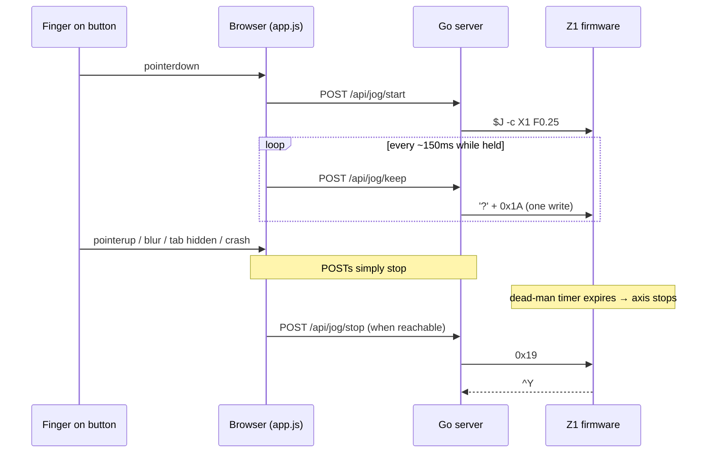

# Makera Z1 Control — Crossing into Motion

This is the third report on `z1ctl`, the Go CLI and web controller for the
Makera Z1 CNC mill. [[PROJ - Makera Z1 Control - Reverse-Specifying a CNC Wire Protocol]]
covered deriving the wire protocol from four open-source controllers;
[[PROJ - Makera Z1 Control - Building and Validating the Client]] covered the
client library, file transfer and the read-only tooling. This report covers
the phase where the tool acquired the ability to move the machine — jogging,
homing, positioning, spindle and job control, and a browser pendant — and
what it took to do that without ever trusting the software more than it
deserves. The first real motion command was executed against the physical
machine during this phase, and the very first bring-up session falsified an
assumption that four independent controller codebases share.

> [!summary]
> - Every prior phase had the property that the worst possible bug was a wrong
>   answer. Motion removes that property, so the phase began with a written
>   pre-implementation review that amended its own design in three places
>   before any code existed.
> - The strongest guarantee in the system is the firmware's continuous-jog
>   dead-man: motion continues only while keepalives arrive. The operator
>   overruled the original server-owned keepalive design with a failure-mode
>   argument worth memorising: a mechanism that keeps motion alive fails
>   toward continuing; a mechanism that merely forwards fails toward stopping.
> - Hardware bring-up falsified the meaning of the `$J` F word: on stock
>   firmware it is a scale of max rate, not a feedrate. Four controllers'
>   worth of source code implied otherwise. The fix is a two-unit speed type
>   whose encoding is chosen per firmware dialect, with refusal where a
>   dialect cannot express the requested unit.

## Why this phase exists

The project's tickets divide cleanly at the safety boundary. MZ1-001 and
MZ1-002 built everything that reads: protocol codec, status and diagnose
parsing, file transfer, a read-only web page. MZ1-003 is everything that
writes motion: jog, home, absolute positioning, spindle, accessories, work
offsets, and the `play`/`suspend`/`resume`/`abort` job lifecycle, plus a
manual-control page intended as the safer test harness — a stop should be one
gesture, not a typed command, when a machine is moving next to you.

The phase deliberately started with a review rather than code. The design
document existed (written in the previous session); the first act of this one
was to read the ~4,000 lines the motion code would stand on and the design
itself, and to write down what was wrong with both. That review found one
latent concurrency defect that motion would have converted into a live bug,
and three design decisions worth amending before they hardened. The rest of
the phase implemented the amended design in four commits, then spent the
bring-up session discovering that the firmware disagreed with every published
client about what a jog speed means.

## Current project status

- The full motion surface is implemented and offline-tested: 45 tests across
  the protocol library and the web server's security guards, all run under
  the race detector.
- First real motion has been executed: homing and step jogs on the physical
  Z1, through the full authorised path (fresh preflight, single send, status
  re-read). Continuous jog, feed hold under motion, parking and the job
  lifecycle remain on the bring-up checklist, gated on an operator at the
  machine.
- Jog speed semantics were corrected after hardware observation; the encoding
  is now dialect-aware (stock vs community firmware) with per-dialect
  refusal.
- The control page is a working pendant behind a loopback-default server with
  token, same-origin and Host-header (DNS rebinding) guards.

## The risk model: five classes and one absolute rule

The previous phase guarded with a single predicate — can this command move
the machine? — and it was already known to be too coarse: it once classified
`time` (a clock *query*) as motion. The motion phase replaced it with an
ordered classification, because different risks deserve different treatment
and collapsing any two produces either a dangerous tool or an unusable one.

| Class | Contents | Treatment |
|---|---|---|
| read | queries | allowed everywhere |
| **stop** | `suspend`, `abort`, feed hold, jog stop, `M5`, `M9` | **never gated, in any state** |
| accessory | light, vacuum, fan, air | dedicated paths, no confirmation |
| data | `rm`, `mv`, upload, config | typed paths that verify their own effect |
| state-enabling | `$X` unlock, `resume`, cycle start | confirmation + preflight of *why* the machine stopped |
| motion | `$H`, `$J`, G-codes, `M3`, `play` | authorised path, fresh preflight, never retried |

The one absolute rule is the stop class: a stop that can be refused is not a
stop. This is implemented, not aspirational — `suspend` and `abort` pass the
generic text path that refuses everything else, the realtime guard admits
feed hold (`!`) and jog stop (`0x19`) unconditionally, and the preflight
function itself returns an error if a caller ever asks it to evaluate a
stop-class command, because gating one is a caller bug by definition. The
classification runs before a byte reaches the socket:

```go
// pkg/makera/safety.go
func Classify(cmd string) RiskClass       // the single authority
func AssertNotMotion(cmd string) error    // generic path: refuse >= accessory
func AssertRealtimeAllowed(ch byte) error // '?', 0x1A, '!', 0x19 pass; '~', 0x18 do not
```

Ordering is load-bearing: a request spanning several operations is gated by
the *maximum* class across them, and callers cannot lower it.

## Typed operations: making the design's claim true

The design document proposed `MotionRequest{Commands []string}` and claimed
it "cannot be built from a bare string". The review's most consequential
finding was that the claim is false for that type — any handler in a hurry
can write `MotionRequest{Commands: []string{userInput}}` and the structural
guarantee evaporates. The type system can enforce what the prose wanted:

```go
// pkg/makera/motion.go
type MotionOp interface {
    render() []string        // unexported: unimplementable outside the package
    class() RiskClass        // the op knows its own risk; callers cannot lie
    requiresHomed() bool
    Describe() string
}

func StepJog(axis Axis, distanceMM float64, speed JogSpeed) (MotionOp, error)
func Home() MotionOp
func RapidTo(machineCoords bool, target PartialAxes, safeZFirst bool) (MotionOp, error)
func PlayFile(path string) (MotionOp, error)
// ... constructors validate; G-code text is rendered inside the package, never accepted
```

Because `render` and `class` are unexported, no code outside `pkg/makera` can
inject command text into the motion path, and no caller can understate an
operation's risk class — the second amendment: the component being guarded
must not choose its own guard. `--dry-run` falls out of the same structure
for free: render the ops, print the exact commands and wire frames, open no
connection.

The execution rules are enumerated where the code lives so a reviewer can
check for each: motion is never retried (a `G0` re-sent after a timeout can
execute twice); never issued from a reconnect or retry path; never a side
effect of a query; a composite stops at its first failed step.

## The dead-man chain, and who is allowed to hold it

Continuous jog is the mechanism that makes a browser pendant safe to build.
The firmware moves the axis only while keepalives (`?` + `0x1A`, one write)
arrive roughly every 200 ms; stopping is a handshake (`0x19`, suppress
keepalives immediately, await the firmware's `^Y`). If keepalives simply
cease — crashed process, severed network, closed laptop — the firmware stops
the axis on its own. That property is stronger than anything the software
stack can offer, because it depends on the software *stopping* rather than on
it behaving correctly.

The original design had the server emit keepalives from its own timer while
a browser "lease" stayed fresh. The operator rejected this mid-implementation
with an argument that deleted a subsystem:

> a server timer that keeps motion alive is a mechanism whose bugs fail
> toward **continuing**; a server that only forwards keepalives has no such
> mechanism — every bug fails toward **stopping**.

For a dead-man, only the second failure direction is acceptable. The
implemented chain forwards 1:1, so every protocol keepalive is *caused* by a
browser keepalive from a physically held button:



Any link breaking stops the machine. Background-tab throttling stalls the
POSTs — annoying, safe, honest. The server keeps only enough state to refuse
a second concurrent jog and to run the polite `0x19`/`^Y` handshake; there is
no jog-holding loop, no lease, no watchdog, because nothing on the server
needs to notice a vanished browser for the machine to be safe. The CLI's
continuous jog keeps an internal 200 ms ticker instead, because there the
process holding the terminal *is* the held button, and its hold is bounded
(`--for`, maximum 5 s).

The dead-man is also the one behaviour testable only in the fake machine: a
real machine cannot demonstrate that it stops when keepalives cease without
actually moving. The test double tracks keepalive timestamps, expires jogs
past a window, and requires the stop handshake; `TestJogDeadman` abandons a
session the way a crash would and asserts the fake stopped itself.

## The concurrency defect that motion would have armed

The review's highest-severity code finding was invisible in the read-only
tool: `Client` never serialised concurrent command exchanges. Every exchange
is drain → write → collect-until-sentinel against one shared reply channel,
so two concurrent exchanges steal each other's replies. The CLI is sequential
and the old web server wrapped everything in one mutex, so it never fired.
But the pendant's workload is exactly three actors on one connection — jog
keepalives, a browser status poll, and command POSTs — which would have
turned the race into intermittent, unreproducible status corruption at the
worst possible time.

The fix is a command mutex inside the client covering the whole exchange,
with one deliberate exemption: realtime bytes bypass it, because feed hold
and jog stop must never wait behind a slow directory listing. Two adjacent
repairs landed with it: the reply-channel overflow policy now never discards
a message carrying the completion sentinel (losing one turned a completed
command into a 15-second timeout), and the status-reply matcher now parses
candidate lines instead of accepting the first message containing a `<`.

## The bring-up discovery: what `$J F` actually means

The first supervised jog session produced a puzzle. Four step jogs of 10 mm
at `F10`, `F1`, `F1000` and `F300` all visibly ran at the same speed. The
logs contained the corroborating detail: at F300 a 10 mm move should take two
seconds, yet a status query ~200 ms after send already reported `Idle`; only
the F1000 run was ever caught in `Run`. Every move had run at maximum speed,
and which one showed `Run` was timing jitter, not feed.

Reading the stock firmware settled it in one function
(`SimpleShell::jog`):

```cpp
// usage: $J X0.01 [F0.5] - axis can be XYZABC, optional speed is scale of max_rate
THEROBOT->delta_move(delta, rate_mm_s*scale, n_motors);
```

On stock firmware, `F` is a **scale of the axis maximum**. `F0.5` is half
speed; every value ≥ 1 means "at least maximum" and the planner clamps it.
The community firmware fork later redefined `F` as a true feedrate in mm/min
(divided by 60 internally) and moved the scale to an `S` word. The reference
controller — whose UI offers jog speeds of 100–2000 mm/min and sends them as
`F` values — is therefore correct against community firmware and silently
"always maximum" against stock. Four controller codebases were read during
the protocol phase and none of this was visible, because controllers encode
their *beliefs* about firmware, not the firmware. This is the third time in
the project that observation on hardware falsified the published source, and
the ground-truth document records it as another instance of the project's
standing rule: observation outranks citation.

The fix models the divergence instead of papering over it:

```go
type JogSpeed struct {
    Scale     float64 // fraction of axis maximum, (0,1); both dialects
    FeedMMMin float64 // absolute mm/min; community firmware ONLY
}
```

| unit | stock (Z1 today) | community |
|---|---|---|
| scale of max | `F<scale>` | `S<scale>` |
| feedrate mm/min | impossible — **refuse** | `F<mm/min>` |
| maximum (zero value) | omitted | omitted |

The dialect is detected before any speed-carrying jog is sent — a `c` in the
firmware version string marks community, the same heuristic the community
controller uses on itself — resolved from the cached identity or one
`version` query. A feed request against stock is refused with the reason and
the alternative, because a refusal that explains itself is strictly better
than the official controller's behaviour, which silently jogs at maximum.
Full-speed jogs render no speed word and skip the dialect probe entirely; the
two dialects agree about nothing except silence.

Reading the firmware paid three more answers for free, closing questions the
design had listed as requiring hardware experiments: stock `play` accepts
only `-v` (verbose; `-O` is a community extension); `play` while a job runs
is refused by the firmware with a message; and — the operationally important
one — `play` on an unhomed machine **silently returns**, printing nothing.
The client-side preflight that requires homing before `play` is therefore not
merely a gate; it is the only error message that situation will ever produce.
Single-axis homing (`$H X`) is supported by the source but has not yet been
exercised on the machine, so the tool still exposes all-axes homing only.

## The HTTP surface: the project's first security boundary

The machine accepts one unauthenticated TCP connection; anyone on the LAN
who can reach port 2222 can drive it. That is outside this project's control.
What is in its control is not widening the surface: the moment the web page
gained POST routes, an unauthenticated request *became* a motion command.

The server therefore binds loopback by default; a non-loopback bind requires
an explicit `--allow-remote`, prints a warning, and enforces a startup token
on every mutating route. Three checks stack in `guardMutation`: Host-header
validation (a page on an attacker's domain that re-resolves to `127.0.0.1`
sends its own name in `Host` — the classic DNS-rebinding hole that
same-origin checks alone do not close), `Origin`/`Sec-Fetch-Site` same-origin
enforcement, and the token when remote. All of it is unit-tested without
hardware, because refusals must happen before any connection is attempted.
Machine-state gating and HTTP authentication are kept deliberately distinct:
stop routes skip the former (a stop that can be refused is not a stop) and
still pass the latter (authentication is not gating).

Every motion route preflights on the machine, fresh, regardless of what the
page claims to have checked — the browser may be a stale tab or a replayed
request. One motion request may be in flight at a time; overlap answers 409,
because a queue of moves the operator can no longer cancel is the opposite of
manual control.

## Implementation details

The authorised path, end to end:

```mermaid
flowchart TD
    CLI["z1ctl jog / home / goto / spindle / job\n(one shared runner: dry-run → confirm → Motion)"]
    WEB["control page POST routes\n(guardMutation → server-side preflight)"]
    subgraph LIB["pkg/makera"]
        OPS["typed MotionOps\nrender/class unexported"]
        DIAL["jog dialect resolution\n(version string, cached)"]
        PF["Preflight — read FRESH\nalarm · e-stop · cover(known!) · job · homed"]
        MOT["Client.Motion\nmax class · never retried · stops at first failure"]
        JS["JogSession\nauto ticker (CLI) / manual 1:1 (web)"]
        MU["cmdMu — serialises exchanges\nrealtime bytes bypass"]
    end
    CLI --> OPS
    WEB --> OPS
    OPS --> MOT
    DIAL --> MOT
    PF --> MOT
    MOT --> MU
    JS --> MU
    MU -->|"TCP :2222"| Z1[("Makera Z1\nstock 1.0.15")]
    style Z1 fill:#2a2a1a,stroke:#b58900
```



Details that would trip a newcomer:

- **The preflight's `known` contract.** The cover interlock reads from an
  endstop vector whose length varies by firmware. `CoverClosed()` returns
  `(closed, known bool)`, and the preflight treats unknown as not-closed —
  a preflight that cannot verify the cover has not verified the cover.
  Writing `closed, _ :=` there is a defect by convention.
- **Preflight freshness.** State is read immediately before acting, never
  from a cached poll; the gap between "cover was closed 800 ms ago" and
  "cover is closed" is exactly the interval in which someone opens it.
- **The stop handshake ordering.** Keepalives must be provably gone before
  `0x19` is sent (cancel the emitter, wait on its done channel; manual-mode
  keepalives refuse once stopping begins), and the `^Y` acknowledgement
  channel must be registered before the stop byte or the reply can land in
  the gap. Acknowledgement detection lives in the client's read loop, so the
  waiter never competes with a command exchange for messages.
- **Negative numbers versus flag parsing.** `jog X -0.1` dies in the CLI
  framework because `-0.1` parses as bundled short flags, and no parser
  setting fixes it. The accepted forms are the combined `$J`-style token
  (`jog X-0.1`) and the standard `--` escape.
- **Exit codes as API.** `job run` (upload → digest verify → preflight →
  play → monitor) exits 0 on completion, 1 on usage or connection failure,
  2 on any refusal, 3 when the job ended in alarm — mapped from typed
  errors, so scripts can gate on them.

## Working rules

- A stop that can be refused is not a stop. Class 0 is never gated by
  machine state, confirmation, or preflight — only by authentication.
- No mechanism may exist whose failure keeps motion alive. Forward liveness;
  never synthesise it.
- Motion is never retried, never queued, never a side effect, and never
  survives the first failed step of a composite.
- When a firmware dialect cannot express the requested unit, refuse with the
  reason and the alternative. Silent reinterpretation is how the official
  controller jogs at maximum when asked for 100 mm/min.
- Observation outranks citation. Controllers encode beliefs about firmware;
  only the firmware — or the machine — is ground truth. Three falsifications
  and counting.
- The physical emergency stop is the safety system. The software says so in
  its own UI, once, where it will be read.

## Important project docs

- Ticket MZ1-003 (in `dropcut-studio/ttmp/2026/08/11/`): design guide,
  pre-implementation review (`analysis/01-…`, whose §7 amendments supersede
  the design where they conflict), an eight-step implementation diary, and
  `vendor/` holding the cited firmware source excerpts with provenance.
- MZ1-001 `reference/03-live-z1-observations-firmware-1-0-15.md` — hardware
  ground truth; §11 is the `$J` F-word finding.
- Key commits on `task/cnc-control-dropcut`: `3507195` (motion core),
  `9d50f54` (keepalive reversal), `48255aa` (CLI), `9c6db2b` (pendant and
  guarded server), `e488ce0` (F-scale correction), `59442b8` (two-unit
  dialect-aware speed).

## Open questions

- Which mechanism sets a work zero reliably on this firmware — `G10 L20`, or
  the configuration path the reference controller uses? The op ships marked
  unverified.
- Do the axis-limit indices `E[0..4]` match the published mapping? Verifying
  requires deliberate slow motion into a limit with an operator present; they
  remain advisory (warn-only) until then.
- The community-dialect encodings (`S<scale>`, `F<mm/min>`) are verified
  against the community firmware source and the test double, not against a
  community machine — none is available here.
- Does `$H X` behave on the metal as the source promises?

## Near-term next steps

- Finish the bring-up checklist with the operator present: continuous jog
  with a deliberate dead-man test (close the tab mid-jog and watch the axis
  stop), feed hold under motion, park, then an air-cut `play` with suspend,
  resume and abort exercised — spindle disabled throughout.
- The operator safety review of the risk classification and the preflight
  table, including the two deliberate deviations from the signed design
  (`M5`/`M9` as stop-class; jogging permitted unhomed).
- Deferred by design: probing, automatic tool change, resume-at-line,
  single-axis homing exposure.

## Project working rule

Before any command class is widened, re-read the classification table with
the machine's operator, and before any speed or motion word is trusted, find
it in the firmware source that is actually running. The reference controllers
are testimony; the firmware is the fact.
