# Makera Z1 Control — What the Machine Does Not Say

This is the fourth report on `z1ctl`, the Go CLI and browser controller for
the Makera Z1 CNC mill, and it covers a single evening of supervised hardware
bring-up. [[PROJ - Makera Z1 Control - Crossing into Motion]] ended with the
motion surface implemented and the first jogs executed; this report covers
what happened when an operator actually used it: a feed hold with no exit, a
homing command that appeared to do nothing twice for two different illusory
reasons, the retraction of a "fact" that had stood in the project's
ground-truth document for a day, and — as a palate cleanser — camera support
that worked on hardware within minutes because its protocol was honest.

The connecting theme is epistemic rather than mechanical. This firmware
acknowledges nearly everything and reports almost nothing: `ok` does not mean
a command did anything, silence does not mean nothing happened, and the most
operationally important bit of state on the machine — whether it has a
position reference — is not present in any status field at all. The
engineering consequence is a working rule that hardened over the evening:
**the tool must never claim to know more than the machine tells it**, and the
corollary, surfacing every word the machine does say.

> [!summary]
> - A feed hold (`!`) is released only by the realtime cycle start (`~`);
>   the `resume` command pairs with `suspend` and reports ok while doing
>   nothing for a hold. Commands sent during a hold queue silently and all
>   execute on release — so releasing a hold is confirmed like motion, while
>   engaging one is never gated.
> - `MPos -1,-1,-1` is not an unhomed sentinel. It is also the post-homing
>   rest position, and stock firmware never serialises its homed flag, so
>   homing is unknowable from the wire. Three layers of code and one
>   ground-truth section were built on the wrong reading and were all
>   corrected in one pass.
> - The observability-lag pattern claimed its fourth and fifth victims: a
>   real homing cycle was twice declared a no-op by a status read taken
>   before the `Home` state became visible.
> - The camera is a separate WebSocket service on the WiFi module — one JPEG
>   per binary message — and the only genuinely green thing about its first
>   frame is the sensor's unconverged auto white balance, proven by saving
>   frames 1/10/30/60 of one session.

## Why this report exists

The previous report closed with motion implemented and offline-proven. The
gap between offline-proven and operationally true is exactly what a
supervised bring-up measures, and this session measured it repeatedly: every
incident below was found by an operator doing something reasonable and the
tool responding with something misleading. Each fix landed in the same
pattern — reproduce, read the stock firmware source, correct the model, then
correct every layer that had inherited the wrong model, including prose.

## The hold with no exit

The operator pressed FEED HOLD, then pressed RESUME. The server answered
`{"ok":true}`; the machine stayed in `Hold` with its light blinking. A second
observation arrived during diagnosis: spindle STOP returned
`{"ok":true,"sent":["M5"],"state_after":"Hold"}` — accepted, nothing changed.

Both observations have one explanation, visible in the firmware's Player
module. `suspend` and `resume` are a pair: they pause and continue a running
*job*, with a whole ceremony around them. A feed hold is a different
mechanism entirely — a realtime byte (`!`) that freezes the motion queue —
and its only exit is the realtime cycle start (`~`). Sending `resume` while
held is accepted and does nothing. Meanwhile every queued command sent during
the hold, the operator's `M5` included, sits in the buffer and executes the
moment the hold is released.

The library had implemented `CycleStart()` in its first motion commit, but
nothing exposed it: a hold was structurally a one-way door. The fix exposed
it on all three surfaces with the risk-class logic pointing in both
directions:

- Engaging a hold is a stop: never gated, no confirmation, any machine state.
- Releasing one is NOT a stop — the frozen motion resumes and the queued
  commands run — so `z1ctl hold --release --confirm`, `POST
  /api/cycle-start` and the page's RESUME all demand confirmation, and the
  page's hold banner says "stand clear" because of the queue.
- The page's RESUME button routes by state: `Hold` → cycle start, suspended
  job → `resume`, because a button that sends the wrong mechanism's
  counterpart reports success while lying.

## Case study: three wrong theories about `$H`

The homing investigation is worth recording step by step, because each wrong
theory was locally well-evidenced and the truth only emerged by falsifying
them in order.

**Theory 1 — the silent no-op.** `$H` returned `ok` instantly with the state
still `Idle` and nothing moving; an identical `$H` four seconds later homed
normally. The stock dispatch source shows `$H` clearing a latched halt flag
before issuing the homing cycle, so "the first `$H` after a hold episode is
consumed clearing residual state" fit the evidence. A no-op detector was
added: if the state was not `Home` immediately after sending, report failure
and say "run it again".

**Theory 2 — falsified by the detector's own false positives.** The next
session, the operator watched the machine home correctly while the detector
declared "did not start" twice. The `Home` state appears in status only after
a lag (the conveyor has to pick the cycle up), so a single status read
~200 ms after `$H` misses a real cycle — and retrospectively, the "successful
second `$H`" of Theory 1 was almost certainly showing the *first* command's
cycle already running. This was the observability-lag pattern's fourth
strike. The fix polls for `Home` for up to six seconds, watches an observed
cycle until the state leaves `Home`, and reports `cycle_observed` with an
honest note instead of a verdict it cannot support.

**Theory 3 — the deep one.** After the watched, successful homing cycle, the
status read `MPos -1,-1,-1` — the exact value the project had recorded as
the *unhomed sentinel* on day one. The machine parks about a millimetre off
its max switches after homing; the rest position and the boot position are
the same numbers. And the report builder in the stock firmware's
`Kernel.cpp` serialises no homed flag whatsoever — `Robot::is_homed` is
internal state that never crosses the wire. Homing is unknowable from a
status report. Every layer built on the sentinel was wrong: the `Homed`
field, the preflight's refusal of absolute moves when "unhomed", the page's
"not homed" banner, and Theory 2's completion check.

The corrected model, applied in one pass:

- `Status.AtRestPosition` carries the only fact the wire supports, with the
  ambiguity documented on the field. `Status.Homed` was **deleted**, not
  deprecated — a field named `Homed` that actually means "not at the rest
  position" would re-teach the next reader the exact falsehood just
  unlearned.
- The preflight's homing condition became advisory in all cases. This is a
  deliberate *weakening*: nothing refuses an absolute move from the rest
  position any more, because the refusal would block a freshly homed machine
  parked at rest. The firmware is the real gate — an absolute move on a
  truly unhomed machine answers "`axis is not homed`", and `play` silently
  no-ops — and the tool now surfaces those words (next section).
- The UI says what is known: `at -1,-1,-1 — parked at home OR never homed
  (firmware doesn't say)` versus `position live — moved since boot/homing`.

The ground-truth document required the same discipline as the code. Its §12
had recorded Theory 1 as fact for a few hours; the section now replaces its
own first draft explicitly, and the original day-one "unhomed sentinel"
claims carry in-place corrections pointing at it. A ground-truth file that
silently rewrites itself is as untrustworthy as one that preserves errors;
the correction has to be visible.

## Surfacing the machine's words

The homing investigation exposed a tooling defect that had made every
diagnosis harder: `Motion` collected the text lines a command produced and
threw them away. This firmware explains its refusals in prose *while still
printing ok* — the information existed, arrived, and was dropped before
anyone could read it. `MotionResult.Replies` now carries every reply line;
the CLI prints a `reply` column and the web routes return `replies[]`.

The catalogue of "acknowledged but not done" behaviours this firmware has
produced so far, all verified against source or hardware:

| Command | Acknowledgement | Actual behaviour |
|---|---|---|
| `$H` | `ok`, unconditionally | may be consumed clearing residual halt state; cycle visible only later |
| `play` (unhomed) | nothing at all | silently returns; no error line |
| `play` (already playing) | prose refusal | "Currently printing, abort print first" |
| `resume` (in Hold) | `ok` | does nothing; wrong mechanism |
| any queued G-code (in Hold) | accepted | executes later, on release |
| camera resolution (bad value) | HTTP 200 | silently ignored |
| `$J F1000` (stock) | `ok`, moves | F is a scale of max rate; ≥1 means maximum |

The pattern ledger that generated the working rules — every one of these
cost real diagnosis time before being named:

| # | Incident | Lesson |
|---|---|---|
| 1–3 | unlock / mkdir / rm verification (MZ1-001) | effect and observability are separate events; verify with a bounded re-read, never a re-send |
| 4 | `$H` "no-op" detector false positives | a state transition is not visible at send-time; poll for it |
| 5 | "second `$H` worked" | the observation window can attribute one command's effect to another |

## The camera: an honest protocol for contrast

The camera made a useful control group, because everything about it went the
way the protocol work never does. It is served by the Z1's ESP32 WiFi module
rather than the motion firmware: a WebSocket on port 82 at `/ws_video` that
pushes one complete JPEG per binary message once the client sends the text
`start_stream`. Being a separate service on a separate port, it never
touches the machine's single control connection, and nothing about it can
interact with motion.

The implementation is deliberately dependency-free: a ~150-line RFC 6455
client (the reference controller hand-rolls its own for the same reason),
covering the handshake, masked client frames, fragmentation, ping/pong and
orderly close, all pinned by a fake-server test. On top of it:

- `z1ctl camera probe | snap | resolution` — resolution being the module's
  only setting (Espressif framesize values over HTTP on port 80; six sizes
  measured as working, everything else answered 200 and ignored, so only the
  six are accepted).
- A Camera tab in the control page. The server bridges the WebSocket to
  MJPEG (`multipart/x-mixed-replace`), which a plain `` renders with
  zero client code; the stream is opened when the tab becomes visible and
  closed when it is left.

```mermaid
flowchart LR
    ESP["ESP32 module\nws://machine:82/ws_video\n1 JPEG per binary frame"]
    GO["z1ctl serve\nWebSocket → MJPEG bridge"]
    IMG["&lt;img src=/api/camera/stream&gt;\nopen only while the tab is visible"]
    ESP -->|"start_stream"| GO --> IMG
    style ESP fill:#1a2a1a,stroke:#3ddc97
```

It worked against the machine within minutes — probe true, first frame
captured — and immediately produced one last lesson in the evening's theme.
The first frame was saturated green, which read as a colour-channel bug. The
client passes JPEG bytes through untouched, so the suspect list was short;
saving frames 1, 10, 30 and 60 from a single session settled it: frame 1
green, frame 60 neutral. The sensor's auto white balance runs on-camera and
converges only while streaming, so frame #1 of a cold stream is always
wrong. `camera snap` now discards 30 warm-up frames (~1.5 s) by default; the
live view needs nothing, because it converges within its first second. The
reference controller never noticed — its viewer only streams live, and its
host-side "grading" is brightness/contrast/gamma with no colour axis, so it
inherits the same green first-second silently.

## Implementation details

Facts a maintainer needs that the narrative above implies but does not
state:

- **The hold queue is invisible.** Nothing in the status report distinguishes
  "command executed" from "command queued behind a hold". The only defence
  is procedural: the page's hold banner and the release confirmations state
  that queued commands will run. When auditing an incident, assume anything
  sent during `Hold` executed at release time.
- **`C:` decoded.** The status report's undocumented `C:` key is
  `MachineModel, FuncSetting, inch_mode, absolute_mode` (from the report
  builder's source) — `C:3,1,0,1` on this machine. Useful, but not
  homing-related, which was the hope that led to decoding it.
- **The homing watch is re-read-only.** `home --confirm` polls status — up
  to 6 s for `Home` to appear, then until it leaves — and never re-sends
  `$H`. The report is `cycle_observed: true/false` with the two possible
  explanations attached when false, because an instant verdict cannot
  distinguish a fast cycle from a consumed command.
- **Session-side homed tracking was considered and rejected.** The web
  server could set a flag after watching a Home cycle complete, giving the
  page real certainty until disconnect. The CLI could never share it, and a
  flag that is true on one surface and unknowable on another is precisely
  the half-truth the correction removed. Recorded as a deliberate
  non-feature.
- **Camera concurrency is untested.** One WebSocket bridge per viewing tab;
  whether the ESP32 accepts several simultaneous stream clients is unknown,
  so one tab at a time is the supported shape.

## Working rules (as amended this session)

- The tool must never claim to know more than the machine tells it. If the
  wire does not carry a fact, no field may pretend to.
- `ok` is an acknowledgement, not a result. Surface every reply line;
  verify effects by re-reading state, bounded, never by re-sending.
- A state transition is not visible at send time. Poll for the transition,
  and only its observation proves the command acted.
- Ground-truth documents get the same correction discipline as code:
  corrections in place, visibly, with the wrong claim retracted rather than
  silently rewritten.
- Releasing a hold is not a stop. Stops are never gated; releases are
  confirmed, because they resume motion and flush an invisible queue.
- Delete falsified abstractions; do not deprecate them. A wrong name
  re-teaches the wrong model.

## Important project docs

- Ticket MZ1-003 (`dropcut-studio/ttmp/2026/08/11/`): diary steps 10–15
  cover this session — the hold exit, the two homing corrections, the
  camera. `vendor/` holds the cited firmware excerpts with provenance.
- MZ1-001 `reference/03-live-z1-observations-firmware-1-0-15.md` §12 — the
  double correction on homing and the `-1,-1,-1` position.
- Key commits on `task/cnc-control-dropcut`: `b23a625` (hold release),
  `3d03711` (reply surfacing), `ae212f0` (homing unknowable; the honest
  model), `46b9319` (delete `Status.Homed`), `b0eaf54` (camera),
  `46502d4` (AWB warm-up).

## Open questions

- What consumed the first `$H` in the original incident — a residual halt
  flag from the hold episode is the best-fitting theory, but no instant
  observation can confirm it, and it may never recur.
- Whether `job abort` reliably flushes a held queue (offered as the cautious
  alternative to release; exercised only informally).
- Whether the ESP32 serves multiple camera clients concurrently.

## Near-term next steps

- Remaining bring-up with the operator present: continuous jog with the
  deliberate dead-man test (close the tab mid-jog), feed hold *during*
  motion — now that its exit exists — park, and the air-cut job lifecycle.
- The operator safety review, which now includes two deliberate weakenings
  to sign off: homing advisory-only, and `M5`/`M9` as stop-class.

## Project working rule

When the machine's behaviour and the tool's report disagree, the tool is
wrong somewhere between the wire and the words — and the fix is complete
only when the code, the UI copy, and the ground-truth document all say the
corrected thing, visibly.
