# GitHub Projects: Provenance-Aware Task Tracking and an Architecture Pattern Catalog

This report documents the design and implementation of two organization-level GitHub Projects for go-go-golems. Project 1 tracks implementation work. Project 3 records reusable abstractions, data structures, algorithms, invariants, and operational patterns discovered across repositories. Both projects preserve the local and documentary context in which an issue was created.

The work began with a practical deficiency: GitHub issues described proposed changes, but did not identify the docmgr workspace, Pi agent transcript, or local checkout that produced the analysis. It ended with a two-project information architecture, a repeatable command-line workflow, and a durable playbook in the Obsidian vault.

> [!summary]
> - [Project 1](https://github.com/orgs/go-go-golems/projects/1) is the task board. Its items represent work with a completion lifecycle.
> - [Project 3](https://github.com/orgs/go-go-golems/projects/3) is the architecture and pattern catalog. Its items represent technical knowledge with an evidence-maturity lifecycle.
> - Both projects carry `Docmgr ticket`, `Agent Pi session`, and `Working directory` fields.
> - The pattern catalog adds multi-select classification by pattern type and technical domain.
> - Repository issues, project items, and project-only draft issues remain distinct objects with distinct lifecycle operations.

## 1. Why provenance belongs on the project item

A GitHub issue records a title, body, discussion, repository, and state. That is enough to define work, but not enough to reconstruct the investigation that produced it. Agent-assisted engineering introduces several additional sources of evidence:

- a docmgr ticket may contain a design document, diary, task list, changelog, and file relations;
- a Pi session contains the sequence of questions, repository inspections, decisions, tool calls, and corrections;
- a local working directory identifies the exact workspace or worktree from which source evidence was read.

These values are properties of the issue's operational context. They fit naturally on the issue's project item because GitHub Projects is the layer where repository content is combined with planning and classification metadata.

The resulting provenance path is:

```mermaid
flowchart TD
    PROJECT[GitHub Project item]
    ISSUE[Repository issue]
    DOC[Docmgr ticket]
    SESSION[Pi session]
    WORKDIR[Local working directory]
    CODE[Source files and Git history]

    PROJECT --> ISSUE
    PROJECT --> DOC
    PROJECT --> SESSION
    PROJECT --> WORKDIR
    DOC --> CODE
    SESSION --> CODE
    WORKDIR --> CODE

    style PROJECT fill:#263f2f,stroke:#61a273
    style ISSUE fill:#243447,stroke:#5c88b0
    style DOC fill:#4a3822,stroke:#b48a50
    style SESSION fill:#4a3822,stroke:#b48a50
    style WORKDIR fill:#4a3822,stroke:#b48a50
```



The fields do not replace issue bodies or documentation. They provide stable entry points into those records.

## 2. Resetting the task board

Project 1 contained 24 historical items:

- 10 repository issues;
- 14 draft issues stored only inside the project.

The requested reset was a true clean slate, not merely a view change. The operation therefore had two parts:

1. close the underlying repository issues;
2. remove every project item.

One repository issue was already closed. The remaining nine were closed with a completed reason. All 24 project items were removed. The final project query returned:

```json
{"items":[],"totalCount":0}
```

### 2.1 The object distinction

The reset exposed an important GitHub Projects rule:

| Object | Exists where | Can be closed? | Can be removed from project? |
|---|---|---:|---:|
| Repository issue | Repository | Yes | Yes |
| Pull request | Repository | Yes, through PR lifecycle | Yes |
| Draft issue | Project only | No independent close state | Yes |
| Project item | Project | No issue lifecycle of its own | Yes |

Closing an issue does not imply removal from a project. Removing a project item does not close the issue. A draft issue has no underlying repository object, so deleting its project item is its complete retirement operation.

This distinction is why the workflow first exports the item inventory as JSON and inspects `content.type`, `content.repository`, and `content.number` before mutation.

## 3. The task board schema

Project 1 retained GitHub's normal task-oriented status model and received three text fields:

| Field | Type | Meaning |
|---|---|---|
| `Docmgr ticket` | Text | Associated ticket workspace, or `N/A` when none exists |
| `Agent Pi session` | Text | Session that created or investigated the issue |
| `Working directory` | Text | Machine-local checkout used to gather evidence |

Three ragkit architecture issues were then added:

- [ragkit #7 — extract chunk diagnostics into indexstats](https://github.com/go-go-golems/ragkit/issues/7)
- [ragkit #8 — move enrichment techniques into a techniques subpackage](https://github.com/go-go-golems/ragkit/issues/8)
- [ragkit #9 — study and simplify overlapping RAG data structures and mechanisms](https://github.com/go-go-golems/ragkit/issues/9)

Each item was populated with:

```text
Docmgr ticket:     N/A
Agent Pi session:  019ff829-68a3-7fea-8a3d-43c5209b3ddf
Working directory: /home/manuel/workspaces/2026-08-12/deploy-dev-indexer
```

`N/A` is intentional. A blank value could mean that no ticket exists, that population failed, or that the field was forgotten. An explicit value removes that ambiguity.

## 4. Why task tracking and pattern cataloging must be separate

A task and a reusable pattern have different persistence rules.

A task describes a state change that should eventually be completed:

```text
Extract chunk diagnostics into indexstats
```

A pattern describes a technical claim that remains useful after related implementation work is complete:

```text
Canonical logical records decouple artifact identity from physical storage
```

If both are stored on one task board, the pattern is treated as unfinished work until it is closed. Closing it then removes it from the board's normal active views, even though its knowledge remains valid. Status labels also become ambiguous: “Done” is appropriate for a refactoring task but not for a technical abstraction.

The two-project design gives each object the correct lifecycle:

```mermaid
flowchart LR
    DISCOVERY[Codebase study]
    TASK[Implementation issue]
    PATTERN[Pattern issue]
    BOARD1[Project 1: Task tracking]
    BOARD3[Project 3: Pattern catalog]
    CHANGE[Code or documentation change]
    REUSE[Later reuse and validation]

    DISCOVERY --> TASK
    DISCOVERY --> PATTERN
    TASK --> BOARD1
    PATTERN --> BOARD3
    TASK --> CHANGE
    CHANGE --> PATTERN
    PATTERN --> REUSE

    style BOARD1 fill:#243447,stroke:#5c88b0
    style BOARD3 fill:#263f2f,stroke:#61a273
    style PATTERN fill:#4a3822,stroke:#b48a50
```



An implementation issue can link to a pattern entry. The pattern entry can accumulate examples, counterexamples, and validation evidence from multiple repositories.

## 5. The architecture and pattern catalog

The new organization project is:

[Go-Go-Golems Architecture & Pattern Catalog](https://github.com/orgs/go-go-golems/projects/3)

Its description is:

> Cross-repository catalog of reusable abstractions, data structures, algorithms, invariants, and operational patterns.

The project README states that entries are durable technical findings rather than implementation tasks. The catalog currently starts empty so its first entries can be added deliberately under the new schema.

### 5.1 Status as evidence maturity

The default GitHub Project status options—Todo, In Progress, Done—were replaced with:

| Status | Required meaning |
|---|---|
| `Discovered` | The pattern has a name and initial source evidence. |
| `Documented` | The issue explains structure, constraints, evidence, and limits. |
| `Validated` | Tests, multiple implementations, or focused analysis support the claim. |
| `Adopted` | The organization intentionally reuses or standardizes the pattern. |
| `Rejected` | The pattern was evaluated and should not be adopted. |

These states do not describe completion percentage. They describe confidence and organizational intent. A rejected pattern remains valuable because it records a decision and the evidence behind it.

### 5.2 Pattern type

`Pattern type` is a multi-select field with:

- `Abstraction`
- `Data Structure`
- `Algorithm`
- `Invariant`
- `Operational Pattern`

Multi-select is necessary because a finding may span categories. Content-addressed bundle identity is both an abstraction and an invariant. A bounded-memory verifier may combine an algorithm with an operational pattern.

### 5.3 Domain

`Domain` is a multi-select field with:

- `RAG`
- `Execution`
- `Storage`
- `CLI`
- `UI`
- `Agents`
- `Infrastructure`

A reusable finding may cross domains. For example, an immutable publication protocol can apply to RAG indexes, storage systems, and deployment infrastructure.

### 5.4 Provenance

Project 3 uses the same provenance fields as Project 1:

- `Docmgr ticket`
- `Agent Pi session`
- `Working directory`

The pattern body carries detailed evidence. The project fields make origin and classification queryable across repositories.

## 6. Implementing multi-select fields through GraphQL

The installed `gh project field-create` command advertises only:

```text
TEXT
SINGLE_SELECT
DATE
NUMBER
```

GitHub's GraphQL schema exposes a broader `ProjectV2CustomFieldType` enum that includes `MULTI_SELECT`. The project therefore uses GraphQL directly for `Pattern type` and `Domain`.

The creation operation has this form:

```graphql
mutation($project: ID!) {
  createProjectV2Field(input: {
    projectId: $project
    dataType: MULTI_SELECT
    name: "Pattern type"
    multiSelectOptions: [
      {name: "Abstraction", color: BLUE, description: "Reusable conceptual or API boundary"}
      {name: "Data Structure", color: GREEN, description: "Reusable representation or state structure"}
      {name: "Algorithm", color: YELLOW, description: "Reusable computational procedure"}
      {name: "Invariant", color: RED, description: "Correctness property that must hold"}
      {name: "Operational Pattern", color: PURPLE, description: "Reusable deployment or operating procedure"}
    ]
  }) {
    projectV2Field {
      ... on ProjectV2MultiSelectField {
        id
        name
        multiSelectOptions { id name }
      }
    }
  }
}
```

Setting a value also requires GraphQL:

```graphql
mutation(
  $project: ID!
  $item: ID!
  $field: ID!
  $options: [String!]!
) {
  updateProjectV2ItemFieldValue(input: {
    projectId: $project
    itemId: $item
    fieldId: $field
    value: {multiSelectOptionIds: $options}
  }) {
    projectV2Item { id }
  }
}
```

The value is the complete selected option-ID set. Scripts should resolve option IDs by option name at runtime. IDs are implementation identifiers and can change if an option is deleted and recreated.

## 7. Tooling edge cases discovered during implementation

### 7.1 Protected default fields

GitHub would not delete the default Status field:

```text
GraphQL: Only custom fields can be deleted. (deleteProjectV2Field)
```

The correct operation was `updateProjectV2Field`, replacing the single-select options while retaining the protected field.

### 7.2 GraphQL mutation shape

The initial status update included `projectId` in `UpdateProjectV2FieldInput`. The schema rejected it:

```text
InputObject 'UpdateProjectV2FieldInput' doesn't accept argument 'projectId'
```

Schema introspection showed that the mutation requires only `fieldId` plus the updated properties. This is an important operational rule: inspect the live GraphQL input type rather than inferring mutation arguments from related operations.

### 7.3 Multi-select response field name

The first multi-select creation requested `options`, mirroring single-select fields. GitHub returned:

```text
Field 'options' doesn't exist on type 'ProjectV2MultiSelectField'
```

The correct response field is `multiSelectOptions`.

### 7.4 CLI rendering defect or limitation

`gh project field-list` returned blank names and IDs for the multi-select fields even though the fields existed and GraphQL returned them correctly. Reliable discovery therefore uses a direct query over `ProjectV2.fields.nodes` with fragments for:

- `ProjectV2Field`
- `ProjectV2SingleSelectField`
- `ProjectV2MultiSelectField`

This is why the playbook uses GraphQL for catalog schema inspection and verification.

## 8. Writing a useful pattern entry

A catalog entry should be an evidence-backed technical article in issue form. Its body should answer:

1. What is the pattern?
2. Which problem does it solve?
3. Where is it implemented?
4. Which invariants define correct behavior?
5. Which failure modes motivated it?
6. Where else does it occur?
7. Under which conditions should it not be reused?
8. Which tasks, documents, and tests are related?

A useful title states the reusable claim:

```text
Canonical logical records decouple artifact identity from physical storage
```

A weak title states only an activity:

```text
Study index identity code
```

The issue body holds source paths, symbols, test evidence, tradeoffs, and limits. The project fields support filtering and provenance; they should not duplicate the body.

## 9. Recommended workflow

The intended workflow for future codebase studies is:

```text
Inspect code
  → identify a reusable technical claim
  → create or identify a docmgr ticket
  → write a pattern issue in the evidence-owning repository
  → add it to Project 3
  → classify type and domain
  → populate Pi and working-directory provenance
  → validate with tests or additional occurrences
  → link implementation tasks in Project 1
```

A pattern may begin as `Discovered`. It moves to `Documented` when another engineer can evaluate the claim from the issue body. It moves to `Validated` when supporting evidence extends beyond the initial observation. `Adopted` requires an intentional reuse or standardization decision.

Catalog issues normally remain open. Their status is carried by the project field, not by closing the repository issue. New occurrences can be added as comments or body updates.

## 10. Current state

At the end of the session:

### Project 1

- The previous 24 items were retired.
- All 10 underlying repository issues are closed.
- The board contains ragkit issues #7, #8, and #9.
- All three have Pi session and working-directory provenance.
- `Docmgr ticket` is explicitly `N/A` because this analysis did not create a ticket workspace.

### Project 3

- The project exists and is private to the organization.
- Status uses the five evidence-maturity states.
- `Pattern type` and `Domain` are true multi-select fields.
- All three provenance fields exist.
- The project description and README define its role.
- The catalog has no seed items yet.

### Durable documentation

The operational procedure is documented in:

[[github-project-provenance-tracking|Playbook: GitHub Project Provenance Tracking for Agent Work]]

The playbook includes commands for reset, field creation, issue enrollment, multi-select GraphQL updates, provenance population, and verification.

## 11. Next steps

The next useful action is to seed Project 3 with a small set of high-quality patterns discovered during the ragkit study. Candidate entries include:

- canonical logical records decouple artifact identity from physical storage;
- representations are retrieval material while source chunks are evidence;
- immutable bundle IDs bind content, algorithms, and backend configuration;
- streamed staging provides deterministic ordering and bounded-memory artifact construction;
- component-owned identities permit composable bundle verification.

Each seed should be a separate issue with concrete source paths and a deliberately chosen maturity status. The initial catalog should favor strong evidence over breadth.

## Working rules

- Keep tasks on Project 1 and reusable technical claims on Project 3.
- Populate provenance immediately while the authoritative session context is available.
- Use `N/A` only for confirmed absence, never as a default substitute for checking.
- Resolve field and option IDs dynamically.
- Verify project state with structured GraphQL or JSON output.
- Preserve rejected patterns with their rationale.
- Do not close catalog issues merely because the first documentation pass is complete.

## References

- [Go-Go-Golems task project](https://github.com/orgs/go-go-golems/projects/1)
- [Go-Go-Golems Architecture & Pattern Catalog](https://github.com/orgs/go-go-golems/projects/3)
- [ragkit issue #7](https://github.com/go-go-golems/ragkit/issues/7)
- [ragkit issue #8](https://github.com/go-go-golems/ragkit/issues/8)
- [ragkit issue #9](https://github.com/go-go-golems/ragkit/issues/9)
- [[github-project-provenance-tracking]]
