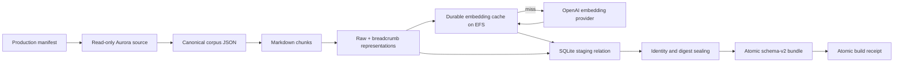

# CoinVault Production Deployment: Deep Dive Technical Analysis

This report documents the production deployment of CoinVault from the first architecture review through the current private indexing rollout. It is a living technical analysis, not a final postmortem. The production service remains disabled while the knowledge bundle is built, inspected, and evaluated. Future deployment steps should amend this note with the final bundle identity, acceptance evidence, service activation, rollback evidence, and operational results.

> [!summary]
> - CoinVault production is implemented as an AWS ECS/Fargate deployment with a deliberately separated batch indexer and employee-facing service.
> - Phase 1 provisioned the production substrate while keeping the ECS service, ALB route, and EventBridge schedule disabled.
> - The first indexer processed 15,482 documents and 81,866 embeddings but failed during SQLite bundle sealing because the read-only container root had no writable temporary filesystem.
> - The minimal fix mounts an ephemeral `/tmp` volume and sets `SQLITE_TMPDIR=/tmp`. Retry task `22ff8fa23267461bbf5aa9f2dd328f53` is currently reusing the durable embedding cache; it has reached at least 28,000 cache hits and remains in progress.

## Why this deployment required a staged design

CoinVault combines three different operational responsibilities:

1. serving authenticated employee requests;
2. reading live operational data through a constrained production database identity; and
3. building an immutable knowledge bundle from approved production sources.

These responsibilities have different lifecycles and different failure consequences. The employee service should not be enabled merely because ECS, EFS, and IAM exist. The indexer should be able to run privately without an ALB route or employee authentication. A failed bundle build must not alter the bundle already used by a serving task. A service deployment must be independently reversible by changing an explicit image or bundle reference.

The deployment therefore uses a sequence of gates:

```text
review source and contracts
        |
        v
publish digest-qualified image
        |
        v
provision phase-1 AWS substrate
(service=false, schedule=false)
        |
        v
run one manual indexer task
        |
        v
verify receipt, bundle identity, source/provider identity,
counts, cache accounting, memory, and retrieval evaluation
        |
        v
separate service plan and ALB activation review
        |
        v
enable one service task only after acceptance
```

The important property is causal isolation. A production service route cannot hide an indexing failure, and an indexing experiment cannot silently enable employee traffic.

## System boundaries and repository ownership

The deployment spans three repositories and one generic dependency repository. Each owns a different part of the contract.

| Repository or boundary | Responsibility | Evidence |
|---|---|---|
| `/home/manuel/workspaces/2026-08-12/deploy-dev-indexer/coinvault` | Go application, embedded React frontend, CLI commands, profiles, production manifest, receipt generation | `cmd/coinvault/cmds/knowledge.go`, `internal/knowledgebuild/build.go`, `Dockerfile` |
| `/home/manuel/workspaces/2026-08-12/deploy-dev-indexer/ragkit` | Generic immutable bundles, streaming staging, Bleve, SQLite vector/content indexes, verification | `rag/indexbundle/build_stream.go`, `rag/indexbundle/staging_kernel.go`, `rag/indexbundle/open.go` |
| `/home/manuel/workspaces/2026-08-12/deploy-dev-indexer/goldeneaglecoin.com` | AWS Terraform, shared ALB and Aurora integration, PHP principal endpoint, ECR/IAM integration | `infra/terraform/coinvault/runtime.tf`, `infra/terraform/modules/coinvault-runtime/main.tf` |
| AWS account shared services | ECR, ECS/Fargate, EFS, SSM, CloudWatch, ALB, Aurora, GitHub OIDC | Production Terraform state and read-only AWS inspection |

The CoinVault runtime must not assume ownership of the shared ALB, Aurora cluster, PHP application, or account-level OIDC provider. Conversely, RagKit must not encode Golden Eagle Coin employee identity or production AWS policy. These boundaries are necessary for independent review and rollback.

## Runtime architecture

The intended production data plane contains a long-running service task and a one-shot indexer task. Both initially use the same digest-qualified application image, but Terraform now accepts independent service and indexer image and capacity inputs.

```mermaid
flowchart TD
    Employee[Employee browser]
    ALB[Existing HTTPS ALB]
    PHP[PHP session and principal endpoint]
    Service[CoinVault ECS service]
    DB[(Aurora MySQL production database)]
    EFS[(Encrypted EFS state)
immutable knowledge + SQLite state]
    Indexer[CoinVault ECS one-shot indexer]
    OpenAI[OpenAI embeddings API]
    CW[CloudWatch logs, EMF, alarms]
    SSM[SSM SecureString parameters]

    Employee --> ALB
    ALB --> Service
    Service --> PHP
    Service --> DB
    Service --> EFS
    Indexer --> DB
    Indexer --> OpenAI
    Indexer --> EFS
    Service --> CW
    Indexer --> CW
    Service -. secret references .-> SSM
    Indexer -. secret references .-> SSM
```

The current phase intentionally omits the `Service` and ALB forwarding edge. Terraform creates a dormant target group but no employee-facing ECS service or listener rule. The EventBridge indexer schedule is also disabled. This allows the indexer to be evaluated without changing PHP routing or employee authentication.

## Application startup and serving contract

The `coinvault serve` command composes the runtime from environment-backed settings. Startup validates database configuration, application and inference profiles, persistence paths, optional knowledge configuration, and the SessionStream server before listening.

The serving path is fail-closed. A missing or invalid bundle, provider identity mismatch, invalid profile, persistence failure, or required database failure prevents the application from presenting itself as ready. The design guide records three distinct endpoint contracts:

- `/livez` is a cheap process liveness endpoint.
- `/readyz` reports whether the startup snapshot is ready and returns `503` when it is not.
- `/healthz` exposes a redacted diagnostic identity for operators.

The health identity may include source SHA, profile slugs, tool names, database driver/status, authentication mode, bundle ID, schema version, and document count. It must not include DSNs, passwords, secret values, cookies, prompt bodies, SQL rows, document text, or employee data.

The production service uses one desired task because SQLite conversation persistence has a single-writer constraint. Terraform's deployment percentages avoid overlapping old and new writers. This trades zero-downtime replacement for persistence correctness until the storage model changes.

## Knowledge build pipeline

The indexer is a batch command that loads the reviewed production manifest and writes a bundle under `/var/lib/coinvault/knowledge`. The production manifest is:

```text
data/knowledge-manifest-production-v1.yaml
```

The earlier filename `knowledge-manifest-product.yaml` was not present. The production manifest defines the approved database and SQL-document sources, the `gec_prod` database identity, OpenAI `text-embedding-3-small`, 1,536 dimensions, raw-v1 task-prefix semantics, batch size 16, 16 workers, and disabled boilerplate removal.

The build pipeline is structured as follows:



The application implementation in `internal/knowledgebuild/build.go` first loads source documents, sorts them by stable ID, writes the corpus, chunks the indexed documents, composes representations, and passes bounded batches into RagKit `BuildStream`. When embeddings are enabled, `embedding.NewCachedEmbedder` wraps the provider with a durable file cache under `embed-cache`.

The critical loop has this shape:

```go
for start := 0; start < len(reps); start += stagingBatchSize {
    end := min(start+stagingBatchSize, len(reps))
    vectors, _, err := embedding.Representations(
        ctx, cachedEmbedder, manifest.Embedding.Model,
        reps[start:end], embeddingBatchSize,
    )
    if err != nil {
        return fmt.Errorf("embed representations %d-%d: %w", start, end, err)
    }
    if err := stager.AddVectors(ctx, vectors); err != nil {
        return fmt.Errorf("stage vectors %d-%d: %w", start, end, err)
    }
}
```

The cache is part of the operational recovery design. An interrupted run can retain completed per-item vectors, allowing a subsequent run to avoid repeating provider work. This behavior was observed directly during the retry: the first progress events reported cache hits and zero misses.

## Source consistency and provenance

A production corpus must represent a defined source state. The implementation uses a narrow `SourceQuerier` interface so product, product-facet, and category connectors can execute through one repeatable-read transaction. Curated SQL documentation is database-independent but remains inside the same build contract.

The build receipt is content-free and records provenance rather than source data. Its intended fields include:

- receipt version and terminal status;
- source database and driver identity;
- source start and finish times;
- manifest digest;
- application source SHA and RagKit revision;
- bundle ID, schema version, corpus digest, and content identity;
- document, chunk, representation, and vector counts;
- cache hits, misses, writes, and provider work calls;
- stage durations and memory peaks.

The receipt is written atomically through temporary-file creation, synchronization, close, and rename. A temporary receipt must not be mistaken for a successful build.

## Artifact publication and image identity

The production image is pinned by an ECR digest rather than a mutable tag:

```text
sha256:cabd7734a4872aa4855d5fd90d584a0f424ff76a98d6eab61a2821fe823ebaf3
```

The image contains the application binary, embedded frontend, application profiles, profile registry, and `/app/knowledge-manifest-production-v1.yaml`. ECR scanning completed with zero findings at the recorded checkpoint.

The build required one source compatibility correction. The released `chatapp` module did not expose `chatapp.WithTextPatching`, so the application was changed to build against the released module contract. That fix was committed as `8979c5f`. The infrastructure startup grace-period adjustment was committed as `cdb1e8d7`.

The release tuple is broader than the image digest:

```json
{
  "source_sha": "<application source SHA>",
  "image_digest": "sha256:<OCI digest>",
  "task_definition": "coinvault-indexer:<revision>",
  "manifest_digest": "<manifest digest>",
  "bundle_id": "rk-<identity>",
  "corpus_digest": "<corpus digest>",
  "content_identity": "<content identity>",
  "evaluation": "pending|passed|failed",
  "service_activation": "disabled|enabled"
}
```

No production activation is complete until this tuple is recorded and independently reviewed.

## Terraform phase 1

The production Terraform root is:

```text
/home/manuel/workspaces/2026-08-12/deploy-dev-indexer/goldeneaglecoin.com/infra/terraform/coinvault
```

Phase 1 applied a saved plan with:

```text
19 to add, 0 to change, 0 to destroy
```

The created resources included the ECS cluster, encrypted EFS filesystem, EFS access point and mount targets, task and execution roles, CloudWatch log group, dashboard, alarms, security groups, target group, and service/indexer task definitions. A post-apply plan reported no changes.

The following remained intentionally absent:

- ECS service;
- ALB listener rule;
- enabled EventBridge indexer schedule;
- employee traffic activation;
- PHP deployment or Apache route change.

This is a deployment safety property, not an incomplete Terraform apply. It preserves a private batch-validation phase.

## Database, secrets, and network boundaries

The production database is accessed by ECS through the production network path. The local read-only smoke test used a temporary tunnel at `127.0.0.1:50901`; that tunnel is not part of the ECS task path. The production reader identity is `gec-coinvault-prod-reader`, and the application database user is `gec_prod_ro`.

The approved development embedding key was copied into the production SSM namespace without exposing its value:

```text
/dev/coinvault/openai/embeddings-api-key
/prod/coinvault/openai/embeddings-api-key
```

Only SSM metadata and exact parameter references belong in deployment evidence. Secret values must not enter Terraform variables, logs, diaries, receipts, or commits.

The indexer uses exact secret references for the production database password and embedding key. The service and indexer remain separate operational concerns even when they temporarily share an underlying provider credential by explicit policy approval.

## The first production indexer run

The first manual task was:

```text
arn:aws:ecs:us-east-1:605947888452:task/coinvault/d66bbaabe9594755a65aee91d3f05051
```

It loaded:

```text
Documents:       15,482
Chunks:          40,933
Representations: 81,866
```

Embedding completed all 81,866 vectors. The run recorded approximately 81,571 cache misses, 295 cache hits, and 81,529 provider work calls. Peak cgroup usage was approximately 2.8 GiB, below the 8 GiB task allocation.

The task then failed while sealing the staged bundle:

```text
build bundle: seal streamed bundle input: iterate staged representation kinds: disk I/O error: permission denied
```

This error appeared after the expensive work had completed. It was initially tempting to classify the run as an embedding failure because the operational telemetry was coarse. The final log sequence established a different boundary: embeddings were complete, staging was complete, and failure occurred during the sealing query that enumerated distinct representation kinds.

## Permission investigation and minimal fix

The EFS access point was inspected directly:

| Property | Observed value |
|---|---:|
| Access point | `fsap-04b24386bd519a97c` |
| POSIX UID/GID | `10001:10001` |
| Root path | `/coinvault` |
| Root owner | `10001:10001` |
| Root permissions | `0750` |
| Container user | `10001:10001` |
| EFS mount | read/write |

The EFS identity was therefore consistent with the ECS container identity. The image was tested under a read-only root filesystem and user `10001:10001`; `/tmp` existed but was not writable. SQLite's `SELECT DISTINCT kind FROM representation ORDER BY kind` can require temporary disk space for sorting. The error was consistent with SQLite attempting to create a temporary file on the read-only root.

The minimal fix was committed in infrastructure commit `e94cec1b`:

```hcl
indexer_environment = [
  { name = "SQLITE_TMPDIR", value = "/tmp" },
  # ...
]

mountPoints = [
  {
    sourceVolume  = "state"
    containerPath = "/var/lib/coinvault"
    readOnly      = false
  },
  {
    sourceVolume  = "tmp"
    containerPath = "/tmp"
    readOnly      = false
  }
]

volume {
  name = "tmp"
}
```

The container root remains read-only. EFS remains the durable state mount. Only task-local temporary storage is writable. No filesystem watcher was added.

Terraform registered `coinvault-indexer:2`, and one retry task was launched:

```text
arn:aws:ecs:us-east-1:605947888452:task/coinvault/22ff8fa23267461bbf5aa9f2dd328f53
```

At the current report checkpoint, the retry is still `RUNNING`. It has demonstrated durable cache reuse with zero cache misses and at least 28,000 cache hits. The final sealing result remains pending.

## Observability findings

The first run exposed a mismatch between operational logs and memory telemetry. The periodic CloudWatch EMF sampler reported `Processed=0` and `Vectors=0` for a long interval because its observer state was updated only at coarse checkpoints. Regular embedding logs had already shown progress. Later checkpoints corrected the values at 10,000-vector boundaries.

The practical operator questions are:

- Which phase is active?
- How many representations have actually been processed?
- Is the provider responding or is the task blocked?
- How many requests were cache hits versus misses?
- Did failure occur during source acquisition, embedding, staging, sealing, or publication?

GitHub issue [#6](https://github.com/goldeneagle/coinvault/issues/6) records the required telemetry expansion. It calls for stable run and phase identifiers, monotonic counters, provider request and retry metrics, latency, heartbeat events, cache accounting, terminal summaries, phase durations, and secret-safe redaction. The issue should be implemented after the immediate deployment unblock and before the indexer becomes scheduled production infrastructure.

## Failure analysis

### Released dependency mismatch

The application referenced an option unavailable in the released `chatapp` module. The build failed with an undefined symbol. The correction removed the unsupported option rather than adding a compatibility shim or pinning an unreviewed module version. The result was a reproducible `GOWORK=off` build against released dependencies.

### Manifest filename ambiguity

The requested `knowledge-manifest-product.yaml` did not exist. The reviewed production contract was `data/knowledge-manifest-production-v1.yaml`. Absolute manifest paths in ECS commands make filename correctness a deployment invariant.

### Stale progress telemetry

The memory sampler's progress counters were not updated at the same granularity as the embedding loop. This created a false appearance of zero work. The fix is not to infer work from memory samples alone; the indexer needs one coherent monotonic progress state shared by logs, EMF, and the final receipt.

### SQLite temporary storage

The final failure was not caused by EFS ownership. The task could write the corpus, cache, and staging database. SQLite required temporary storage during sealing, but the root filesystem was read-only and no writable `/tmp` mount existed. The minimal fix preserved the root restriction and added a task-local temporary volume.

### Shared infrastructure ownership

The ALB is shared with existing PHP and development routes. A production CoinVault listener rule must be coordinated with existing priorities and the generic admin catch-all. The production Terraform state must not silently seize a listener rule owned by another state. This is a separate activation gate and remains outside the current indexer phase.

## Current status

At the time this note was written:

| Area | Status | Evidence |
|---|---|---|
| Production image | Complete | ECR digest `sha256:cabd7734...`, scan complete with zero findings |
| Production manifest packaging | Complete | `/app/knowledge-manifest-production-v1.yaml` |
| Production embedding secret reference | Complete | `/prod/coinvault/openai/embeddings-api-key` |
| Terraform phase 1 | Complete | 19 resources applied, service and schedule disabled |
| Indexer task definition | Revision 2 | Writable `/tmp`, `SQLITE_TMPDIR=/tmp` |
| First indexing run | Embeddings complete, bundle seal failed | EFS/SQLite temporary-file permission error |
| Cached retry | Running | At least 28,000 cache hits, zero misses at checkpoint |
| Final receipt | Pending | Retry not terminal |
| Bundle inspection/evaluation | Pending | No accepted final bundle yet |
| ECS service | Not created/enabled | Deliberate phase boundary |
| ALB production route | Not created | Deliberate phase boundary |
| PHP deployment | Not performed | Separate concern |
| EventBridge schedule | Disabled | Deliberate phase boundary |
| Enhanced telemetry | Issue #6 open | Implementation deferred until unblock |

## Acceptance sequence still required

The deployment is not complete when the retry reaches 81,866 cache hits. The following evidence is still required:

1. ECS task reaches `STOPPED` with exit code zero.
2. The immutable receipt is present and terminally successful.
3. Receipt counts match the bundle manifest and SQLite/Bleve inspection.
4. Source database identity is `gec_prod` with the expected read-only driver/user contract.
5. Provider identity is OpenAI `text-embedding-3-small`, 1,536 dimensions, with the expected task-prefix/channel contract.
6. Bundle schema-v2 verification succeeds without modifying bundle bytes.
7. Corpus, content, representation, lexical, and vector identities are internally consistent.
8. Read-only retrieval smoke tests pass against the exact bundle.
9. The approved evaluation fixture produces the expected retrieval results and provenance.
10. Memory, cgroup, EFS, and task duration evidence are recorded.
11. A separate Terraform plan reviews service creation, readiness path, bundle path, and ALB routing.
12. Employee-facing activation is performed only after an independent review.

A future amendment should replace the pending fields in this section with exact task ARN, task definition, receipt path, bundle ID, corpus/content digests, evaluation output, service revision, ALB priority, and rollback result.

## Technical decisions and their consequences

### Separate service activation from indexing

**Decision:** Keep the service and schedule disabled while running the first manual indexer.

**Rationale:** Indexing has external provider cost, database load, and storage effects. It must be evaluated independently from employee traffic and PHP authentication.

**Consequence:** Production remains unavailable until a second reviewed change, but failures cannot affect the employee route.

### Use immutable, content-addressed bundles

**Decision:** Publish a new bundle directory identified by content and configuration identity; never rewrite the active bundle in place.

**Rationale:** A serving task can open a known identity, and rollback becomes a reference change.

**Consequence:** EFS retains build artifacts and cache state. Cleanup and retention policy must be defined later.

### Keep the root filesystem read-only

**Decision:** Add writable ephemeral `/tmp` rather than making the container root writable.

**Rationale:** SQLite needs temporary storage, but application binaries and configuration should remain immutable at runtime.

**Consequence:** Every task definition using SQLite must explicitly provide a writable temporary path. This is now an infrastructure invariant.

### Use a durable embedding cache

**Decision:** Store per-item embedding cache entries on the durable knowledge filesystem.

**Rationale:** Provider work is expensive and a failed finalization step should not force a full re-embedding run.

**Consequence:** Cache identity, ownership, cleanup, and compatibility must be included in future run receipts and operational tooling.

## Amendments planned for this report

This note should be amended, not replaced, as deployment proceeds. Each amendment should include a date, the exact evidence source, the relevant commit or AWS task identifier, and any changed interpretation.

Recommended amendment sections:

- **Final cached retry result:** terminal task result, receipt, bundle ID, counts, cache/provider accounting, and memory.
- **Bundle evaluation:** schema-v2 inspection, retrieval fixture, source identity, provider identity, and acceptance decision.
- **Service activation:** task definition, readiness response, ALB rule, PHP principal verification, authenticated browser/API/WebSocket smoke.
- **Rollback drill:** previous image/bundle references, trigger, execution time, and restored health evidence.
- **Telemetry implementation:** issue #6 commits, event schema, dashboards, and examples of diagnosing slow provider batches.
- **Steady-state operations:** schedule/freshness policy, retention, EFS backup restore test, cost limits, alerts, and on-call procedures.

## Source material

The report was derived from the following implementation evidence:

- `/home/manuel/workspaces/2026-08-12/deploy-dev-indexer/coinvault/ttmp/2026/08/12/COINVAULT-INDEX-PROD-001--production-coinvault-indexer-bootstrap-and-service-terraform/design-doc/01-production-coinvault-indexer-bootstrap-and-service-terraform-intern-guide.md`
- `/home/manuel/workspaces/2026-08-12/deploy-dev-indexer/coinvault/ttmp/2026/08/12/COINVAULT-INDEX-PROD-001--production-coinvault-indexer-bootstrap-and-service-terraform/reference/01-investigation-diary.md`
- `/home/manuel/workspaces/2026-08-12/deploy-dev-indexer/coinvault/ttmp/2026/08/12/COINVAULT-PROD-002--production-coinvault-aws-deployment-and-operations/design-doc/01-coinvault-production-architecture-deployment-and-intern-implementation-guide.md`
- `/home/manuel/workspaces/2026-08-12/deploy-dev-indexer/coinvault/ttmp/2026/08/12/COINVAULT-PROD-002--production-coinvault-aws-deployment-and-operations/reference/01-investigation-diary.md`
- `/home/manuel/workspaces/2026-08-12/deploy-dev-indexer/coinvault/internal/knowledgebuild/build.go`
- `/home/manuel/workspaces/2026-08-12/deploy-dev-indexer/coinvault/cmd/coinvault/cmds/knowledge.go`
- `/home/manuel/workspaces/2026-08-12/deploy-dev-indexer/coinvault/data/knowledge-manifest-production-v1.yaml`
- `/home/manuel/workspaces/2026-08-12/deploy-dev-indexer/goldeneaglecoin.com/infra/terraform/coinvault/runtime.tf`
- `/home/manuel/workspaces/2026-08-12/deploy-dev-indexer/goldeneaglecoin.com/infra/terraform/modules/coinvault-runtime/main.tf`
- `/home/manuel/workspaces/2026-08-12/deploy-dev-indexer/ragkit/rag/indexbundle/build_stream.go`
- `/home/manuel/workspaces/2026-08-12/deploy-dev-indexer/ragkit/rag/indexbundle/staging_kernel.go`
- GitHub issue `goldeneagle/coinvault#6`: indexing and embedding telemetry

## Closing assessment

The deployment has crossed the infrastructure bootstrap boundary but has not crossed the production activation boundary. The first run demonstrated that the source, embedding, staging, and memory capacity contracts are broadly functional. It also exposed a missing runtime prerequisite: SQLite temporary storage must be writable even when durable EFS storage is correctly configured.

The retry is currently validating the minimal fix while reusing the completed embedding cache. The next reliable conclusion requires terminal bundle evidence. Until that evidence is inspected and accepted, the correct production state is a provisioned but inactive runtime with a private batch task in progress.
