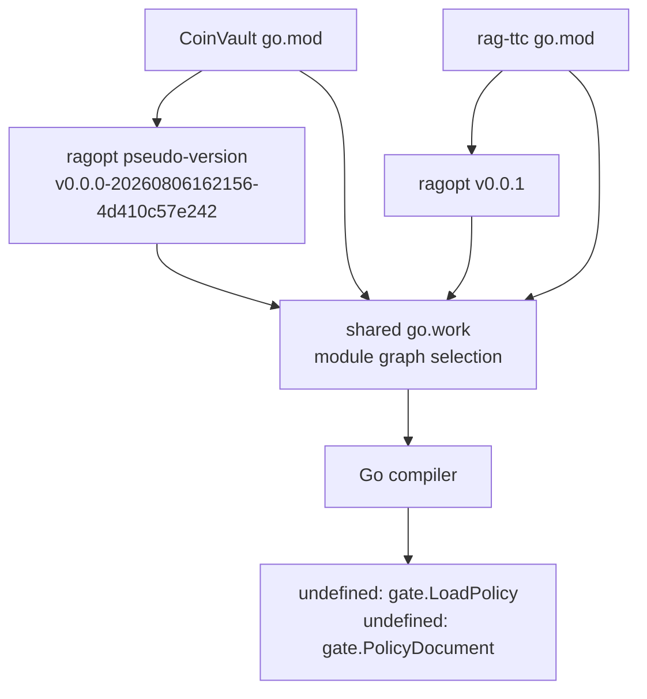

# RAGOPT Gate Policy API Change: Git, Grep, and Minitrace Investigation

This report explains how a CoinVault development build failure was traced to a dependency API change in RAGOPT. The investigation combined compiler output, Go module resolution, workspace chronology, Git history, raw transcript search, go-minitrace conversion, normalized SQLite queries, and direct inspection of the session that implemented the RAGOPT change. The result was a precise migration map rather than a guess based on the first undefined symbol.

The central finding is simple: RAGOPT moved policy loading and policy-document ownership from `pkg/gate` to a new dependency-leaf package, `pkg/policy`. The change was committed as `bbe5c79a54f58e9c98fe85b40c2daf539f15fa11`, released in `v0.0.1`, and became visible to CoinVault when the shared Go workspace selected `v0.0.1` through minimal-version selection. CoinVault still compiled against the older pseudo-version and therefore retained calls to symbols that no longer exist in the selected module.

> [!summary]
> - The first reliable symptom was a backend compile failure: `gate.LoadPolicy` and `gate.PolicyDocument` were undefined.
> - Git established that `pkg/gate/policy.go` was renamed to `pkg/policy/policy.go` in RAGOPT commit `bbe5c79` and that the API moved without changing the policy representation's purpose.
> - go-minitrace identified the historical Codex implementation session, while raw grep supplied candidate paths and normalized SQLite queries separated session activity from implementation evidence.
> - The required CoinVault migration is `gate.LoadPolicy` → `policy.Load` and `*gate.PolicyDocument` → `*policy.Document`, with `gate.Evaluate` and `report.Build` updated to receive the new document type.

## Why this investigation started with a compiler error

The immediate operational problem appeared while restarting CoinVault's local development environment after making compact chat delivery unconditional. Vite started, but the backend health check failed because the Go command could not compile. The first error was:

```text
cmd/coinvault/cmds/knowledge_ragopt_gate.go:27:22: undefined: gate.LoadPolicy
cmd/coinvault/cmds/knowledge_ragopt_gate.go:38:96: undefined: gate.PolicyDocument
```

The errors were valuable because they named both a function and a type. They also showed that the failure was at the package API boundary, not in policy-file contents, evaluation semantics, or runtime configuration. However, the errors did not explain why the selected dependency had changed. Several explanations remained possible:

- CoinVault's source could have been edited incorrectly.
- A local `replace` directive could have selected an unexpected checkout.
- The shared `go.work` file could have changed module selection.
- RAGOPT could have released a breaking API change between CoinVault's pinned pseudo-version and the resolved version.
- The running binary could have been built before the workspace state changed.

The investigation treated each explanation as a hypothesis requiring independent evidence.

## The dependency boundary under investigation

CoinVault's failing command imported RAGOPT's gate package:

```go
import "github.com/go-go-golems/ragopt/pkg/gate"

policy, err := gate.LoadPolicy(ctx, run.PolicyPath)

func buildGECRagoptGateEvidence(
    ctx context.Context,
    run *ragopteval.ArtifactRun,
    policy *gate.PolicyDocument,
) (gate.Decision, *ragoptreport.Document, error)
```

The source still expressed the older contract in three places:

- `cmd/coinvault/cmds/knowledge_ragopt_gate.go` imported `pkg/gate` for both loading and evaluation.
- `cmd/coinvault/cmds/knowledge_ragopt_gate_test.go` constructed `gate.PolicyDocument` values.
- `cmd/coinvault/cmds/knowledge_ragopt_test.go` called `gate.LoadPolicy` while testing the durable proof path.

The first task was therefore not to rewrite the command. It was to determine which RAGOPT version the compiler was using and compare that version's exported API with the source's expectations.

## Module resolution: why the old code suddenly failed

CoinVault's own `go.mod` still referenced the older pseudo-version:

```text
github.com/go-go-golems/ragopt v0.0.0-20260806162156-4d410c57e242
```

That requirement was introduced by CoinVault commit `da9a982`, whose subject was `Add resumable GEC ragopt proof adapter`. The shared workspace also included `rag-ttc`. Its `go.mod` required:

```text
github.com/go-go-golems/ragopt v0.0.1
```

The workspace therefore selected `v0.0.1` under Go's minimal-version selection rules. The relevant distinction is that minimal-version selection chooses the highest required version in the module graph, even when one module directly names an older pseudo-version. The compiler was not reading the older pseudo-version merely because CoinVault's `go.mod` still named it.

The workspace timeline supplied a second piece of evidence. The previously running CoinVault binary had been built at approximately `2026-08-12 21:16 EDT`. The shared `go.work` file was modified at approximately `22:07 EDT`. The build that exposed the failure therefore occurred after the workspace had begun resolving the newer graph. The frontend was able to start because Vite did not depend on Go compilation; the backend health check failed because the newly resolved API did.

The dependency graph can be represented directly:



This distinction matters in multi-module development. A package can compile in isolation with `GOWORK=off` and fail in the workspace because the workspace changes the selected dependency version. Both modes are useful diagnostics, but they answer different questions:

- `GOWORK=off` tests the module's declared dependency contract.
- Workspace mode tests the repository's integrated module graph.

The failure occurred in the second contract. The correct repair must make CoinVault compatible with the version that the workspace intentionally selects, not restore an accidental older resolution.

## Git chronology identifies the breaking boundary

Git supplied the strongest external evidence. In the RAGOPT checkout at `/home/manuel/code/wesen/go-go-golems/ragopt`, the relevant history was:

```text
bbe5c79a54f58e9c98fe85b40c2daf539f15fa11
2026-08-09T01:10:02-04:00
refactor: make gate policy a durable input boundary
```

The commit was included in tag `v0.0.1`. Its file summary showed a package move:

```text
pkg/{gate => policy}/policy.go
```

The rename was recorded with 85% similarity. The old file was not replaced by an unrelated implementation; most of the policy representation and validation logic moved to a new package with an intentionally narrower responsibility.

The relevant diff was:

```diff
- package gate
+ package policy

-type PolicyDocument struct {
+type Document struct {
     Policy     Policy `json:"policy"`
     Digest     string `json:"digest"`
     ByteDigest string `json:"byte_digest"`
     Path       string `json:"path"`
 }

-func LoadPolicy(ctx context.Context, path string) (*PolicyDocument, error)
+func Load(ctx context.Context, path string) (*Document, error)
```

The same commit exported semantic operations that had previously been private helpers:

```diff
-func policyDigest(policy Policy) (string, error)
+func Digest(policy Policy) (string, error)

-func validatePolicy(policy Policy) error
+func Validate(policy Policy) error
```

At the evaluation boundary, the gate package continued to own decision evaluation but stopped owning policy loading:

```diff
-func Evaluate(ctx context.Context, policy *PolicyDocument, report *compare.Report) (Decision, error)
+func Evaluate(ctx context.Context, policyDocument *policy.Document, report *compare.Report) (Decision, error)
```

The report package received the same ownership correction. Policy is durable input: it is loaded, copied, identified, and verified independently of the decision procedure. The `gate` package consumes that validated document when it evaluates a comparison report.

## Reading the semantic change instead of treating it as a rename

A package move can be source-compatible in meaning while being source-incompatible in names. The correct migration requires understanding both dimensions.

| Older API | Current API | Responsibility | Migration meaning |
|---|---|---|---|
| `gate.LoadPolicy(ctx, path)` | `policy.Load(ctx, path)` | Strict policy-file loading | Change import and call site. |
| `gate.PolicyDocument` | `policy.Document` | Loaded policy plus identity fields | Change parameter and test construction types. |
| private `policyDigest` | exported `policy.Digest` | Semantic policy identity | Used internally by `gate.Evaluate`; callers generally do not need to call it. |
| private `validatePolicy` | exported `policy.Validate` | Policy semantic validation | Available to independent policy consumers. |
| `gate.Evaluate` | `gate.Evaluate` | Lexicographic decision evaluation | Keep the gate import for evaluation. Change its document argument. |
| `report.Build` | `report.Build` | Promotion report construction | Keep report ownership; pass the policy document from `pkg/policy`. |

The migration is therefore not “replace every `gate` import with `policy`.” The command needs both packages:

```go
import (
    "github.com/go-go-golems/ragopt/pkg/gate"
    "github.com/go-go-golems/ragopt/pkg/policy"
    ragoptreport "github.com/go-go-golems/ragopt/pkg/report"
)

policyDocument, err := policy.Load(ctx, run.PolicyPath)
if err != nil {
    return errors.Wrap(err, "load copied gate policy")
}

decision, err := gate.Evaluate(ctx, policyDocument, comparison)
if err != nil {
    return errors.Wrap(err, "evaluate gate policy")
}

document, err := ragoptreport.Build(ctx, run, comparison, policyDocument, decision)
```

A type name such as `PolicyDocument` often appears to be a local implementation detail. Here it was part of the integration contract because CoinVault passed the value across package boundaries and tests instantiated it directly. The compiler errors correctly exposed both the loader and the document type as required migration points.

## Transcript evidence: why go-minitrace was necessary

Git proved what changed in the repository. It did not, by itself, show how the change was developed, which session studied the boundary, or whether a transcript match represented an implementation, a review, or a quoted path. That required transcript analysis.

The session evidence was gathered from the environment and native stores rather than inferred from the current conversation. The active Pi session exposed:

```text
PI_AGENT_SESSION_ID=019ff67b-f9f5-7e68-84db-73b3ca83269f
PI_AGENT_SESSION_NAME=CoinVault Compact Streaming and API Forensics
PI_AGENT_CWD=/home/manuel/workspaces/2026-08-12/deploy-dev-indexer
PI_AGENT_SESSION_FILE=/home/manuel/.pi/agent/sessions/--home-manuel-workspaces-2026-08-12-deploy-dev-indexer--/2026-08-12T14-59-07-893Z_019ff67b-f9f5-7e68-84db-73b3ca83269f.jsonl
```

This active Pi session is the investigation session. The historical Codex session that implemented the RAGOPT policy refactor was:

```text
session: 019fd459-16fd-7bd3-a080-9386a707de28
cwd:     /home/manuel/workspaces/2026-06-30/benchmark-cpu-inference
native:  /home/manuel/.codex/sessions/2026/08/05/rollout-2026-08-05T19-53-56-019fd459-16fd-7bd3-a080-9386a707de28.jsonl
```

The temporary RAGOPT review worktree used by that session was `/tmp/ragopt-full-review`, on branch `review/all-ragopt`. That session read and modified the policy implementation while developing the durable-input boundary. The current Pi session did not implement that historical RAGOPT commit; it used the historical session as evidence while diagnosing CoinVault's dependency mismatch.

### Preflight before querying

The installed tool was `/home/manuel/go/bin/go-minitrace`, version `dev`. The investigation checked the actual command help before using it:

```text
go-minitrace discover pi --help
go-minitrace discover codex --help
go-minitrace convert pi --help
go-minitrace convert codex --help
go-minitrace query run --help
go-minitrace help minitrace-schema
```

This step matters because transcript tooling evolves. The installed binary confirmed the normalized SQLite query path and the available `--source-list`, `--run-record`, and `--active-since` flags. The analysis did not use the removed DuckDB query path.

### Candidate discovery and conversion

The investigation preserved a narrow source list under `/tmp/gate-policy-investigation/`:

```text
sources/codex.txt  — 18 Codex native JSONL sources
sources/pi.txt     — 4 Pi native JSONL sources
```

The lists were created through exact signatures such as:

- `pkg/gate/policy.go`;
- `bbe5c79a54f58e9c98fe85b40c2daf539f15fa11`;
- `durable input boundary`;
- `gate.LoadPolicy` and `PolicyDocument`.

The selected sources were converted without changing native transcript files:

```bash
go-minitrace convert codex \
  --source-list /tmp/gate-policy-investigation/sources/codex.txt \
  --output-dir /tmp/gate-policy-investigation/archives/codex

go-minitrace convert pi \
  --source-list /tmp/gate-policy-investigation/sources/pi.txt \
  --output-dir /tmp/gate-policy-investigation/archives/pi
```

The resulting archive set contained 18 Codex sessions and 4 Pi sessions. Conversion generated manifests under `archives/codex/manifest.json` and `archives/pi/manifest.json` and produced normalized session archives under each `active/` directory.

### The normalized query

The saved query at `/tmp/gate-policy-investigation/queries/relevant.sql` searched normalized tool calls rather than grepping only the rendered transcript text:

```sql
WITH calls AS (
  SELECT
    s.session_id,
    s.working_directory,
    s.started_at,
    tc.emitting_turn_index AS turn_index,
    tc.tool_name,
    tc.operation_type,
    tc.file_path,
    coalesce(
      nullif(tc.command, ''),
      json_extract(tc.arguments_json, '$.command'),
      json_extract(tc.arguments_json, '$.input'),
      tc.arguments_json
    ) AS command_text,
    tc.result,
    tc.error
  FROM tool_calls tc
  JOIN sessions s USING (session_id)
)
SELECT
  session_id,
  working_directory,
  started_at,
  turn_index,
  tool_name,
  operation_type,
  file_path,
  substr(command_text, 1, 1200) AS command_text,
  substr(result, 1, 1200) AS result
FROM calls
WHERE coalesce(command_text, '') LIKE '%pkg/gate/policy.go%'
   OR coalesce(command_text, '') LIKE '%bbe5c79%'
   OR coalesce(command_text, '') LIKE '%durable input boundary%'
ORDER BY started_at, session_id, turn_index;
```

The query produced 50 matching rows. That number was not treated as an answer. It was a candidate set containing implementation work, historical source reads, documentation patches, review sessions, and commands whose arguments mentioned a path without necessarily reading or writing it.

The decisive row family belonged to Codex session `019fd459-16fd-7bd3-a080-9386a707de28`. Its normalized tool calls included direct reads of `pkg/gate/policy.go`, `pkg/gate/evaluate.go`, `pkg/eval`, and `pkg/report`, followed by implementation and test commands in `/tmp/ragopt-full-review`. The session also contained a failed patch attempt whose verification error exposed a stale assumption about `containsGroup`; that failure was part of the development history, not evidence of a successful change.

The current Pi session's own transcript then reopened the relevant context and connected it to the external Git commit. That second pass was necessary because normalized adapters may classify Codex `exec` calls as `OTHER`, place command details in `arguments_json`, and report outer tool transport success even when the nested command failed.

## Raw grep was useful, but only as candidate selection

Raw grep supplied the unusual signatures that made conversion tractable. For example, searching native stores for the exact commit hash located the current investigation's references and the historical implementation context. Searching for `gate.LoadPolicy` located CoinVault's source and related transcripts.

Raw grep did not establish authorship. A transcript may contain a path because an agent:

- read that file;
- wrote that file;
- reviewed another session's patch;
- quoted a command or diff;
- searched for the file without opening it; or
- copied the path into a design document.

The investigation therefore used a three-stage rule:

1. **Grep for exact signatures.** Use hashes, full paths, symbols, and unusual commit subjects to create source candidates.
2. **Query normalized operations.** Inspect tool-call arguments, results, operation types, session IDs, and working directories.
3. **Verify against Git and the native transcript.** Confirm the commit, file contents, timestamp, and surrounding user/assistant context.

This rule prevents a common attribution error: treating keyword frequency as proof that a session implemented a change.

## Reconstructing the API change from source study

The RAGOPT source study focused on ownership boundaries rather than only exported names. Before the refactor, `pkg/gate/policy.go` combined two responsibilities:

- strict loading and validation of product-authored policy input;
- evaluation of that policy against a comparison report.

The refactor moved the first responsibility to `pkg/policy/policy.go`. The new package contains the `Policy` representation, `Document` wrapper, loading, byte digest computation, semantic digest computation, and validation. The gate package retains the decision algorithm and accepts the policy document as input.

That decomposition is visible in the package comments:

```go
// Package policy strictly loads product-authored gate policies independently
// of evaluation and decision packages.
package policy
```

The change also clarified two identity layers that appear in the durable evaluation system:

- `ByteDigest` identifies the exact policy file bytes copied into a run.
- `Digest` identifies the canonical semantic policy representation after decoding and validation.

These values should not be collapsed merely because both are represented as digest strings. Durable artifact custody needs exact bytes; decision evaluation needs semantic identity. The source study and transcript review found this distinction in the RAGOPT work and used it to avoid proposing an incorrect compatibility patch.

## What the failed build actually proves

The compiler failure proves that CoinVault's source refers to symbols absent from the resolved RAGOPT package set. It does not prove that policy semantics changed, that the policy file is invalid, or that RAGOPT's evaluator is incompatible with CoinVault's report.

Git shows that the move retained most of the policy implementation. The commit's changed files also updated evaluator and report call sites and tests. The migration is therefore expected to be mechanical at the CoinVault boundary, followed by the existing command and integration tests.

The investigation's current status is:

```text
RAGOPT source change: identified and verified
resolved module version: v0.0.1
CoinVault migration: required, not yet completed at investigation checkpoint
backend devctl health: blocked by compile failure
production: untouched
```

## Recommended migration sequence

The safest repair follows the dependency's ownership model:

1. Update `coinvault/cmd/coinvault/cmds/knowledge_ragopt_gate.go` to import both `pkg/gate` and `pkg/policy`.
2. Replace `gate.LoadPolicy` with `policy.Load`.
3. Replace `*gate.PolicyDocument` with `*policy.Document`.
4. Preserve `gate.Evaluate` and the RAGOPT report package import.
5. Update `knowledge_ragopt_gate_test.go` to construct `policy.Document` values.
6. Update `knowledge_ragopt_test.go` to call `policy.Load`.
7. Pin CoinVault's `go.mod` to `github.com/go-go-golems/ragopt v0.0.1` explicitly rather than relying on workspace MVS to reveal the incompatibility.
8. Refresh `go.sum` and run formatting and focused command tests.
9. Run CoinVault's broader backend tests and then relaunch devctl.
10. Record any remaining failures separately from the original API mismatch.

The import arrangement should remain explicit:

```go
import (
    "github.com/go-go-golems/ragopt/pkg/gate"
    "github.com/go-go-golems/ragopt/pkg/policy"
    ragopteval "github.com/go-go-golems/ragopt/pkg/eval"
    ragoptreport "github.com/go-go-golems/ragopt/pkg/report"
)
```

This is preferable to aliasing the policy package as `gate` or moving evaluation calls into `pkg/policy`. Aliasing would hide the ownership change and make future source study harder. Moving evaluation would contradict the refactor's stated boundary.

## Evidence quality and limitations

The investigation reached high confidence because independent evidence agreed:

- compiler output named the missing symbols;
- CoinVault's `go.mod` and `rag-ttc/go.mod` established the competing requirements;
- workspace metadata established the integration context;
- Git history recorded the exact package rename and API changes;
- tag `v0.0.1` connected the change to the resolved release;
- go-minitrace found the historical implementation session;
- native transcript reopening supplied command context and implementation details.

Several limitations remain important:

- The normalized Codex adapter can store command data in `arguments_json` and classify shell calls as `OTHER`.
- A successful outer tool result does not guarantee that a nested shell command exited successfully.
- The 50 matching normalized rows include false positives and review activity; they are not all implementation evidence.
- The current Pi session investigated the RAGOPT change but did not author the historical `bbe5c79` commit.
- The report describes the migration required at the checkpoint; it does not claim that the CoinVault API migration or devctl restart has already passed.

These limitations do not weaken the API conclusion because the package move and version boundary are independently verified in Git and module metadata.

## Reusable investigation procedure

The procedure generalizes to any dependency API failure in a multi-repository Go workspace:

```text
compiler symptom
    -> identify missing symbol and importing source
    -> inspect each module's declared version
    -> inspect go.work and resolved graph
    -> compare isolated and workspace builds
    -> locate version-introducing commit with Git
    -> inspect rename and exported API diff
    -> grep native transcripts for exact signatures
    -> convert only shortlisted sessions
    -> query normalized tool calls
    -> reopen decisive transcript context
    -> verify repository state and classify evidence
    -> write the smallest ownership-preserving migration
```

The procedure is intentionally evidence-first. It prevents three common mistakes:

- repairing the wrong checkout because the workspace selected another version;
- replacing a package import wholesale when the API change split responsibilities across packages; and
- attributing a code change to a transcript based only on a path mention or keyword match.

## Working rules

- Treat Go workspace resolution as part of the build contract when `go.work` is present.
- Pin a dependency version explicitly when a breaking API is being adopted intentionally.
- Read the breaking commit and its tests before changing downstream call sites.
- Preserve package ownership boundaries revealed by the refactor.
- Use raw grep to shortlist transcripts, not to prove implementation.
- Query normalized minitrace operations and inspect `arguments_json` for Codex calls.
- Verify commit hashes and file state against Git rather than trusting transcript claims.
- Distinguish byte identity from semantic identity when a durable input is decoded and validated.
- Report observations, inferences, and caveats separately.

## Related notes and source material

### Vault notes

- [[ARTICLE - CoinVault Production Deployment - Deep Dive Technical Analysis]]
- [[ARTICLE - Diagnosing Narrow Grounded Answers in TTC RAG]]
- [[ARTICLE - CoinVault Container Supply Chain - GitHub OIDC, Immutable ECR Images, and Fail-Closed Scanning]]

### Repository and ticket sources

- `/home/manuel/workspaces/2026-08-12/deploy-dev-indexer/coinvault/cmd/coinvault/cmds/knowledge_ragopt_gate.go`
- `/home/manuel/workspaces/2026-08-12/deploy-dev-indexer/coinvault/cmd/coinvault/cmds/knowledge_ragopt_gate_test.go`
- `/home/manuel/workspaces/2026-08-12/deploy-dev-indexer/coinvault/cmd/coinvault/cmds/knowledge_ragopt_test.go`
- `/home/manuel/workspaces/2026-08-12/deploy-dev-indexer/coinvault/go.mod`
- `/home/manuel/workspaces/2026-08-12/deploy-dev-indexer/rag-ttc/go.mod`
- `/home/manuel/workspaces/2026-08-12/deploy-dev-indexer/go.work`
- `/home/manuel/code/wesen/go-go-golems/ragopt/pkg/policy/policy.go`
- `/home/manuel/code/wesen/go-go-golems/ragopt/pkg/gate/evaluate.go`
- `/home/manuel/code/wesen/go-go-golems/ragopt/pkg/report/render.go`
- `/home/manuel/.codex/sessions/2026/08/05/rollout-2026-08-05T19-53-56-019fd459-16fd-7bd3-a080-9386a707de28.jsonl`
- `/home/manuel/.pi/agent/sessions/--home-manuel-workspaces-2026-08-12-deploy-dev-indexer--/2026-08-12T14-59-07-893Z_019ff67b-f9f5-7e68-84db-73b3ca83269f.jsonl`
- `/tmp/gate-policy-investigation/sources/codex.txt`
- `/tmp/gate-policy-investigation/sources/pi.txt`
- `/tmp/gate-policy-investigation/queries/relevant.sql`
- `/tmp/gate-policy-investigation/results/relevant.json`

## Closing assessment

The build failure was caused by a real, released RAGOPT API change exposed by shared workspace resolution. The change was not an unexplained dependency drift and not a semantic policy failure. Git established the package move; module metadata established why CoinVault saw it; and minitrace established how the historical implementation was investigated and authored.

The practical repair is small but should be explicit: load durable policy input through `pkg/policy`, keep evaluation in `pkg/gate`, pass `*policy.Document` through the command and report path, and pin the selected RAGOPT release in CoinVault. Once that migration is complete, devctl can be restarted and the compact chat-event work can be tested independently of this dependency boundary.
