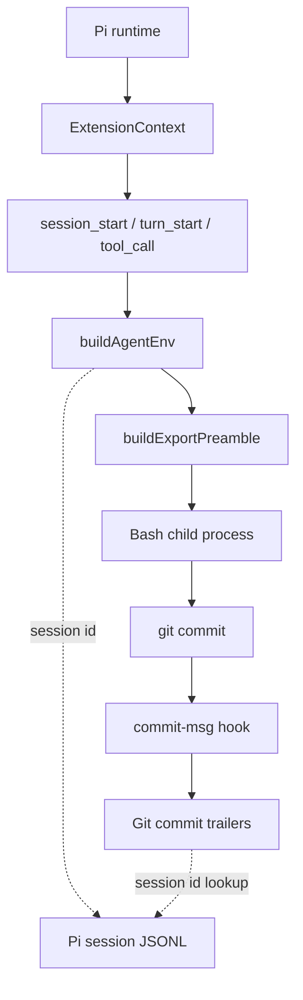

# Pi Extensions: Session Metadata and Commit Provenance

This project is a source-controlled collection of local Pi coding-agent extensions. It provides reusable runtime behavior for session metadata, prompt context, shell integration, compaction, UI actions, prompt templates, session search, and related workflows. The latest addition extends that runtime metadata beyond the Pi process: a versioned Git `commit-msg` hook records the Pi session, turn, model, and recognized workspace in commit-message trailers.

The project therefore has two related responsibilities. The TypeScript extensions expose session state to commands and child processes while Pi is running. The Git hook preserves a selected subset of that state in repository history when a commit is created. The second responsibility is deliberately implemented as a shell hook rather than as another Pi event handler because the commit is finalized by Git, and Git is the system that owns the commit message and commit object.

> [!summary]
> - `extensions/agent-env` injects a versioned `PI_AGENT_*` environment schema into Pi Bash child processes.
> - `scripts/git-hooks/commit-msg` projects four fields into Git trailers: `Pi-Session`, `Pi-Turn`, `Pi-Model`, and `Workspace`.
> - The hook is idempotent, uses `git interpret-trailers`, and fails open for missing metadata so non-Pi commits remain possible.
> - The source hook is versioned, but installation into `.git/hooks/` remains a checkout-level operation.

## Why this project exists

Pi sessions contain useful execution context: a stable session identifier, a turn number, the selected model, the working directory, and the session JSONL path. That information is available while Pi is executing commands, but ordinary Git history does not retain it. A commit records author, committer, timestamps, parents, message, and tree content. It does not record which Pi session produced the working-tree changes unless that information is added explicitly.

The missing link is significant for work performed through multiple coding-agent sessions. A later investigation can identify a commit and inspect its diff, but without an attribution field it must search session archives by timestamp, repository path, or distinctive text. Those searches can produce candidates but do not provide a direct join key. A session identifier in the commit message makes the relationship explicit:

```text
Git commit
  -> Pi-Session: <session UUID>
  -> session JSONL archive
  -> turns and tool calls
  -> source changes and validation commands
```

The design does not attempt to store the complete session transcript in Git. It stores compact identifiers and one derived workspace label. The transcript remains in the Pi session store; the commit trailer supplies the index value needed to find it.

## Project shape

The repository has a shared extension framework and a set of independently loaded extensions:

```text
/home/manuel/code/wesen/2026-04-21--pi-extensions/
├── extensions/
│   ├── _shared/              shared registry and UI components
│   ├── agent-env/            PI_AGENT_* shell metadata injection
│   ├── session-context/      bounded prompt/session metadata
│   ├── launcher/             shared extension launcher
│   ├── prompto/              prompt templates and plugins
│   ├── session-search/       transcript search and forking
│   └── ...                   additional runtime extensions
├── scripts/
│   └── git-hooks/
│       └── commit-msg        Git commit attribution hook
├── docs/                     authoring, testing, and framework guides
├── ttmp/                     ticketed design and implementation documents
└── .pi/                     local Pi settings and prompt definitions
```

`README.md` defines the project as a source-controlled collection rather than a single binary extension. Every extension is expected to register through `extensions/_shared/registry.ts`. This gives the launcher and dashboard a common metadata model for actions, commands, settings, widgets, and documentation.

The commit hook is intentionally outside `extensions/`. It is not loaded by Pi's extension discovery mechanism and does not depend on the extension API. Its input is the commit message file supplied by Git, and its output is a modified commit message. Keeping it under `scripts/git-hooks/` allows the behavior to be reviewed and copied without coupling Git's lifecycle to Pi's TypeScript runtime.

## Runtime metadata source

The `agent-env` extension is the source of the environment contract used by the hook. Its implementation is split between `extensions/agent-env/index.ts` and `extensions/agent-env/env.ts`.

`buildAgentEnv()` constructs the metadata object from the current `ExtensionContext` and event details. The relevant fields are obtained from Pi's session manager and model state:

```ts
return {
  PI_AGENT: "1",
  PI_AGENT_EXTENSION_VERSION: EXTENSION_VERSION,
  PI_AGENT_SESSION_ID: envString(sessionManager.getSessionId()),
  PI_AGENT_SESSION_FILE: envString(sessionManager.getSessionFile()),
  PI_AGENT_SESSION_DIR: envString(sessionManager.getSessionDir()),
  PI_AGENT_SESSION_NAME: envString(sessionManager.getSessionName()),
  PI_AGENT_CWD: envString(ctx.cwd),
  PI_AGENT_TURN_INDEX: envString(turnIndex),
  PI_AGENT_TURN_NUMBER: envString(turnNumber),
  PI_AGENT_MODEL_PROVIDER: envString(model?.provider),
  PI_AGENT_MODEL_ID: envString(model?.id),
  PI_AGENT_MODEL_NAME: envString(model?.name),
  // ...
};
```

The turn number is derived from the zero-based Pi turn index. `PI_AGENT_TURN_INDEX` preserves the runtime index, while `PI_AGENT_TURN_NUMBER` is the human-facing one-based value. The Git hook prefers the latter and falls back to the former when necessary.

The model fields have two levels of detail. `PI_AGENT_MODEL_ID` is intended to be stable for programmatic use; `PI_AGENT_MODEL_NAME` is more readable in a commit message. The hook prefers `PI_AGENT_MODEL_NAME` and falls back to `PI_AGENT_MODEL_ID` when the display name is unavailable.

`PI_AGENT_CWD` is captured from Pi's extension context rather than recomputed by the shell hook. This matters when Git runs from a repository subdirectory. The Pi workspace root remains available as the attribution input even when the current shell directory differs.

## How metadata reaches child processes

The extension does not replace Pi's built-in Bash implementation. For LLM-issued Bash tool calls, it listens to `tool_call`, checks `isToolCallEventType("bash", event)`, constructs an export preamble, and updates `event.input.command`. For user `!` and `!!` commands, it wraps `createLocalBashOperations()` and injects the same preamble before execution.

The preamble is shell text with explicit markers:

```bash
# PI_AGENT_ENV_BEGIN v1
export PI_AGENT='1'
export PI_AGENT_CWD='/home/manuel/workspaces/2026-07-24/datadrop-mcp'
export PI_AGENT_MODEL_ID='gpt-5.6-sol'
export PI_AGENT_SESSION_ID='019fa024-699a-7df4-a30f-3b50470052ee'
export PI_AGENT_TURN_NUMBER='1'
# PI_AGENT_ENV_END v1
```

`buildExportPreamble()` sorts keys, filters names using `^PI_AGENT(?:_[A-Z0-9]+)*$`, truncates long values by Unicode code point, and quotes values using single-quoted shell syntax. `shellQuote()` replaces embedded single quotes with the standard shell sequence. This prevents values such as `$(printf injected)` from being executed during shell parsing.

`injectPreamble()` checks for `PI_AGENT_ENV_BEGIN v1` before prepending. This makes repeated event processing safe and prevents duplicate exports. The extension also emits an `agent-env:capability` event so `session-context` can describe the Bash-child-process capability without importing Agent Env's internal state.

The resulting data flow is:



The dotted relationship is an archival lookup, not a runtime call. The hook does not open or parse the session JSONL file. It copies identifiers already present in its environment.

## Commit hook design

The source-controlled hook is `/home/manuel/code/wesen/2026-04-21--pi-extensions/scripts/git-hooks/commit-msg`. Git invokes a `commit-msg` hook with the path to the temporary commit-message file as its first argument. This lifecycle point is appropriate because the hook can modify the final message before Git creates the commit object.

The hook uses a small helper for all fields:

```bash
add_trailer() {
  local key=$1
  local value=$2

  [[ -n "$value" ]] || return 0

  if ! grep -qF "$key:" "$message_file"; then
    git interpret-trailers --in-place \
      --trailer "$key: $value" "$message_file"
  fi
}
```

The empty-value check is intentional. A commit made outside Pi should not receive empty metadata trailers, and missing model or turn values should not prevent the commit. The hook therefore degrades to an ordinary commit when the environment is absent or partial.

The selected fields are:

```bash
add_trailer "Pi-Session" "${PI_AGENT_SESSION_ID:-}"
add_trailer "Pi-Turn" "${PI_AGENT_TURN_NUMBER:-${PI_AGENT_TURN_INDEX:-}}"
add_trailer "Pi-Model" "${PI_AGENT_MODEL_NAME:-${PI_AGENT_MODEL_ID:-}}"
```

Workspace extraction is restricted to the requested convention:

```bash
workspace_root="$HOME/workspaces/"
if [[ -n "$cwd" && "$cwd" == "$workspace_root"* ]]; then
  workspace=${cwd#"$workspace_root"}
  if [[ "$workspace" =~ ^([0-9]{4}-[0-9]{2}-[0-9]{2}/[^/]+) ]]; then
    add_trailer "Workspace" "${BASH_REMATCH[1]}"
  fi
fi
```

For `/home/manuel/workspaces/2026-07-24/datadrop-mcp`, the value is `2026-07-24/datadrop-mcp`. Paths outside `~/workspaces/YYYY-MM-DD/XXXX` do not receive a `Workspace` trailer. This avoids placing an absolute local path in every commit and keeps the value useful across machines that use the same workspace naming convention.

`git interpret-trailers` handles the placement and formatting of trailer lines. The hook does not manually append text with `printf`, which would have to reproduce Git's blank-line and trailer parsing rules. The duplicate check makes amend and retry operations idempotent for the normal case.

A commit produced through the hook has this shape:

```text
Add Pi metadata commit hook

Pi-Session: 019ffb4a-8203-7600-9490-4d71d6b9ecfa
Pi-Turn: 6
Pi-Model: GPT-5.6 Luna
Workspace: 2026-07-24/datadrop-mcp
```

## Why the hook stores these fields and not the complete environment

The environment contains more fields than are useful as commit identity. `PI_AGENT_SESSION_FILE` and `PI_AGENT_SESSION_DIR` expose local filesystem paths. `PI_AGENT_TOOL_CALL_ID` identifies a single Bash call, not necessarily the turn that produced the commit. `PI_AGENT_LEAF_ID` identifies conversation-tree position and is useful for transcript analysis, but it is not required for the requested commit lookup.

The hook projects only the values that support a durable first lookup:

| Trailer | Source | Purpose |
|---|---|---|
| `Pi-Session` | `PI_AGENT_SESSION_ID` | Join the commit to one Pi session archive. |
| `Pi-Turn` | `PI_AGENT_TURN_NUMBER` or `PI_AGENT_TURN_INDEX` | Narrow the search within the session. |
| `Pi-Model` | `PI_AGENT_MODEL_NAME` or `PI_AGENT_MODEL_ID` | Record the active model at the commit point. |
| `Workspace` | Derived from `PI_AGENT_CWD` | Group work by dated workspace without storing an absolute path. |

This is a lossy projection by design. The commit should remain readable and portable. The session archive remains the authoritative source for detailed chronology, tool-call IDs, prompt text, and exact shell commands.

## Validation performed

The source hook was syntax-checked with:

```bash
bash -n scripts/git-hooks/commit-msg
```

It was installed into the project checkout at `.git/hooks/commit-msg` and used to create the project commit:

```text
9c3c1f3c9eb210bd8a74eb0c2218845d49feee26
Add Pi metadata commit hook
```

That commit contains these trailers:

```text
Pi-Session: 019ffb4a-8203-7600-9490-4d71d6b9ecfa
Pi-Turn: 6
Pi-Model: GPT-5.6 Luna
```

The commit did not contain `Workspace` because the active project checkout is under `/home/manuel/code/wesen/2026-04-21--pi-extensions`, which is outside the recognized `~/workspaces/` prefix. A direct hook test supplied a workspace-shaped value and verified the complete output:

```text
Test commit

Pi-Session: test-session
Pi-Turn: 42
Pi-Model: Test Model
Workspace: 2026-07-24/datadrop-mcp
```

The same hook was run twice against the same message file. Each trailer count remained one, confirming idempotence for the test case.

## Failure modes and review concerns

### Commits created outside Pi

Git hooks run for all commits, but normal terminal sessions, graphical clients, CI jobs, and other automation may not define `PI_AGENT_*`. The hook skips missing values and allows the commit to proceed. This means the absence of a trailer is not evidence that no agent participated; it only means the required environment was not available to this hook invocation.

### Local installation is separate from source distribution

A file under `scripts/git-hooks/` is not automatically executed by Git. The current installation step is:

```bash
cp scripts/git-hooks/commit-msg .git/hooks/commit-msg
chmod +x .git/hooks/commit-msg
```

Each clone needs an installation step, or Git must be configured with a shared `core.hooksPath`. The source file is versioned so its behavior can be reviewed and copied, but `.git/hooks/` is not part of the repository history.

### Workspace recognition is intentionally narrow

The current regular expression captures one workspace name component after the date. It handles the declared convention `YYYY-MM-DD/XXXX`; it does not handle arbitrary nested names, symlink-resolved paths, or workspaces located outside `~/workspaces`. This is preferable to silently recording an incorrect label, but it should be documented if workspace conventions expand.

### Trailer duplicate detection is simple

The current guard searches for the literal prefix `Key:` anywhere in the message file. It prevents normal duplicate insertion, but it is not a complete parser for Git trailers. A commit body containing a line such as `Pi-Session: example` could suppress insertion even when that line is not intended as a trailer. If this becomes operationally important, the hook should use `git interpret-trailers --parse` or a stricter end-of-message check.

### Amend semantics

The hook is intentionally idempotent, so `git commit --amend --no-edit` retains the first captured metadata rather than replacing it with the later amend operation's session and turn. That behavior preserves the origin of the commit message but does not describe the session that performed the amend. A future policy must choose between immutable-origin metadata and append-only amendment metadata; the current hook chooses immutable-origin metadata.

### Model display names can change

`Pi-Model` prefers the model display name because it is readable. Display names may be less stable than provider/model IDs. The full environment still exposes `PI_AGENT_MODEL_PROVIDER` and `PI_AGENT_MODEL_ID`; the commit trailer intentionally favors readability. If analytics needs stable grouping, it should use session data or add a separate machine-oriented trailer.

## Retrieval workflow

The minimum retrieval workflow is:

```bash
git log --all --format='%H %s%n%b' | rg 'Pi-Session|Pi-Turn|Workspace'
```

For one session:

```bash
git log --all --grep='Pi-Session: 019ffb4a-8203-7600-9490-4d71d6b9ecfa' \
  --format='%H %s%n%b'
```

The session ID can then be mapped to the Pi archive under `~/.pi/agent/sessions/`. The archive contains the event sequence needed to distinguish planning, file edits, test commands, failed attempts, and final commits. The `Pi-Turn` trailer narrows the search to the turn that invoked the commit or staged the relevant change.

A future query tool could parse Git trailers into a local SQLite table with fields such as `commit_hash`, `session_id`, `turn_number`, `model`, `workspace`, `author_date`, and `repo`. It could then join commit records with normalized Pi session tables. That should remain a separate analysis layer; the hook's job is to produce stable, compact metadata at commit time.

## Relation to session-context

`extensions/session-context` serves a different consumer. It injects bounded session statistics and prompt numbers into model prompts and displays status in the Pi UI. It also consumes the `agent-env:capability` event to report that Bash-child-process metadata is available.

The separation is important:

- `agent-env` exposes metadata to child processes.
- `session-context` exposes bounded metadata to the model and UI.
- `commit-msg` preserves selected metadata in Git history.

No component needs to read another component's private state. The environment is the process-level contract, the capability event is the extension-level contract, and Git trailers are the repository-history contract.

## Current project status

The Pi Extensions repository is active and contains a growing shared framework plus specialized extensions. The commit attribution source was added in commit `9c3c1f3c9eb210bd8a74eb0c2218845d49feee26`.

Current behavior is sufficient for the primary workflow:

1. Pi injects `PI_AGENT_*` values into a Bash child process.
2. A commit created from that process invokes the installed `commit-msg` hook.
3. The hook adds session, turn, model, and optional workspace trailers.
4. Git stores the trailers with the commit message.
5. Later analysis uses the session ID as the join key to the Pi archive.

The source hook is not globally installed by this project. It is installed in the project checkout used for development. A broader rollout needs an explicit installation command or a managed global hooks directory.

## Near-term next steps

1. Add a documented installation command or setup script that copies the versioned hook into a target repository and preserves executable permissions.
2. Decide whether the project should provide a global `core.hooksPath` setup for all repositories or keep installation repository-specific.
3. Replace the broad duplicate check with trailer-aware parsing if commit bodies commonly contain metadata-like lines.
4. Add automated shell tests for missing values, values containing single quotes, nested repository paths, non-workspace paths, and existing trailers.
5. Define whether amend operations should retain the original trailers or add a second provenance record.
6. Add a small retrieval command that finds commits by `Pi-Session` and prints the associated session-file path when it exists.

## References

- `/home/manuel/code/wesen/2026-04-21--pi-extensions/README.md` — repository purpose, extension inventory, and shared framework conventions.
- `/home/manuel/code/wesen/2026-04-21--pi-extensions/extensions/agent-env/env.ts` — metadata schema, shell quoting, truncation, and preamble construction.
- `/home/manuel/code/wesen/2026-04-21--pi-extensions/extensions/agent-env/index.ts` — Pi event integration, Bash injection, commands, settings, and capability event.
- `/home/manuel/code/wesen/2026-04-21--pi-extensions/extensions/agent-env/README.md` — user-facing environment contract and validation procedure.
- `/home/manuel/code/wesen/2026-04-21--pi-extensions/extensions/session-context/index.ts` — prompt/UI consumer of session metadata and Agent Env capability.
- `/home/manuel/code/wesen/2026-04-21--pi-extensions/extensions/session-context/format.ts` — bounded metadata formatting and prompt safety markers.
- `/home/manuel/code/wesen/2026-04-21--pi-extensions/scripts/git-hooks/commit-msg` — versioned Git commit attribution implementation.
- `/home/manuel/code/wesen/2026-04-21--pi-extensions/ttmp/2026/04/26/PI-EXT-AGENT-ENV--pi-agent-metadata-environment-variables-extension/` — ticketed design and implementation history for Agent Env.
- `/home/manuel/code/wesen/2026-04-21--pi-extensions/ttmp/2026/07/23/PI-EXT-SESSION-CONTEXT--session-context-statistics-in-pi-prompts/` — ticketed design and implementation history for Session Context.
- Commit `9c3c1f3c9eb210bd8a74eb0c2218845d49feee26` — `Add Pi metadata commit hook`.

## Related notes

- [[PROJ - Pi Extensions - Agent Env and Response Capture]] — earlier project report covering the original `agent-env` extension and its relationship to other Pi runtime extensions.
