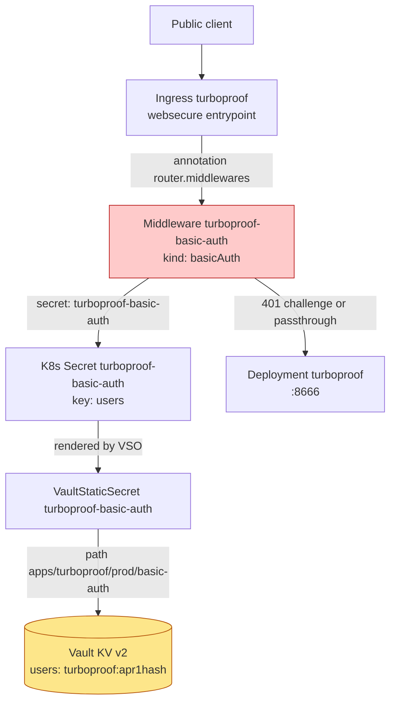
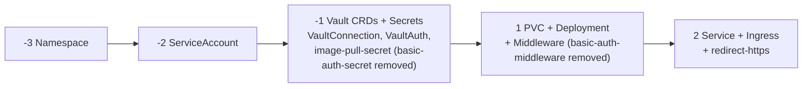
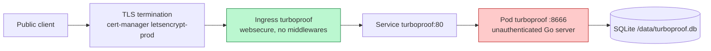

# Turboproof Basic-Auth Removal and Public Deployment: Deep Dive Technical Analysis

This report documents the removal of the Traefik `basicAuth` access-control layer from the Turboproof production deployment and the resulting publication of an unauthenticated, writable service on two public hostnames. It traces the access-control chain as it existed, the Vault-backed secret model that fed it, the GitOps change that dismantled it, the Vault deletion that destroyed the credential, and the Argo CD sync that propagated the removal to a live k3s cluster. The change is small in line count — six files, sixteen additions and one hundred five deletions — but its security consequence is large, and the report treats that consequence as the central technical fact rather than a footnote.

> [!summary]
> - Turboproof is a single-user Lean 4 proof workbench that authenticates nobody at the application layer; a Traefik `basicAuth` middleware was the only access control in front of two public hostnames.
> - The credential existed only as an `apr1` hash in Vault at `kv/apps/turboproof/prod/basic-auth`; the plaintext password was an input to the seeding script and was never stored, so it could not be recovered or rotated by reading it back.
> - Removal deleted the Middleware and VaultStaticSecret manifests, dropped the Ingress annotation, pruned both objects from the cluster, and destroyed the Vault KV metadata and data so the path is no longer readable.
> - The deployment propagated through Argo CD's automated sync to `main` commit `5ff00d73`; the cluster is now `Synced/Healthy` with the basic-auth middleware and secret absent and the Ingress serving the route with no `router.middlewares` annotation.
> - The service is now genuinely open and writable on `turboproof.hyperslop.systems` and `turboproof.yolo.scapegoat.dev`; the same design choice that made the middleware load-bearing is what makes its removal a deliberate exposure.

## Why removing access control is a deliberate act, not a default

Turboproof occupies an unusual position in this cluster: it is a public-facing service that was never designed to authenticate its users. The README states the design directly:

> "**It has no authentication.** Unlike datadrop and agentlogic, turboproof authenticates nobody: the workbench routes mutate its database and `/ws` speaks the Lean protocol, both unauthenticated because the product is a single-user local workbench. The Traefik `basicAuth` middleware named in the Ingress annotation is the only access control in front of the public hostname. Removing that annotation publishes an open, writable service — it is not a convenience toggle."

The paragraph does two things at once. It names the application's own trust model — the workbench is a local, single-user tool whose HTTP routes write to a SQLite database and whose `/ws` endpoint speaks the Lean protocol without any auth handshake — and it names the operational reality that this trust model is incompatible with a public hostname unless something in front of the application supplies the missing access control. The Traefik middleware was that something.

This means the access-control layer is not redundant defense in depth. It is the only gate. There is no application-level login, no API key check, no per-request authorization in the Go binary. The middleware is the boundary between "local tool bound to loopback" and "public service reachable from the internet." Removing it is therefore a decision to publish, not a cleanup. The report returns to this point repeatedly because every technical step in the removal is in service of that single decision.

## The two repositories and their contracts

The deployment spans two Git repositories plus a Vault instance and a live k3s cluster. Each owns a different part of the contract, and the removal had to touch all of them coherently.

| Boundary | Responsibility | Evidence |
|---|---|---|
| `hyperslop-systems/turboproof` (source repo) | Go application, embedded React frontend, the immutable `sha-` image pin handshake, the deploy target descriptor | `/home/manuel/code/wesen/hyperslop-systems/turboproof/deploy/gitops-targets.json` |
| `wesen/2026-03-27--hetzner-k3s` (gitops repo) | All Kubernetes manifests, the Argo `Application`, the Vault seeding scripts, the `turboproof` kustomize package | `gitops/kustomize/turboproof/`, `gitops/applications/turboproof.yaml`, `scripts/bootstrap-turboproof-secrets.sh` |
| Vault at `vault.yolo.scapegoat.dev` | The `apr1` htpasswd hash and the GHCR image-pull credentials | `kv/apps/turboproof/prod/basic-auth` (deleted), `kv/apps/turboproof/prod/image-pull` (retained) |
| k3s cluster `k3s-demo-1` | The running `turboproof` namespace: Deployment, Service, Ingress, PVC, the surviving `redirect-https` middleware, the pruned basic-auth objects | `kubectl -n turboproof` |

The deploy target descriptor in the source repository is small but authoritative. It records that the gitops repository is `wesen/2026-03-27--hetzner-k3s`, the gitops branch is `main`, and the kustomize root is `gitops/kustomize/turboproof`. The Argo `Application` confirms the same: `targetRevision: main`, `path: gitops/kustomize/turboproof`, `syncPolicy.automated: {prune: true, selfHeal: true}`. The combination is what makes a merge to `main` a deployment. There is no manual `kubectl apply` step to remember and no separate deploy button to press; the merge is the deploy, and `prune: true` is what makes a deleted manifest delete a live object.

## The application is unauthenticated by design

The Turboproof binary is a Go HTTP server with the built frontend embedded into a single image. Its production shape is recorded in the Deployment manifest, and three of its flags are load-bearing in ways that are not obvious from a casual read.

```yaml
args:
  - serve
  # --addr MUST be explicit. The binary defaults to 127.0.0.1:8666
  # (it has no authentication, so loopback is the safe local default),
  # and a container that binds loopback answers no Service traffic —
  # the readiness probe would fail with connection refused.
  - --addr=:8666
  - --db=/data/turboproof.db
  # mock is the deterministic rule-based analyzer. --lean-mode proc
  # spawns a real `lean --server` per connection and executes the
  # documents it is sent with NO sandbox; that must not run behind a
  # public hostname.
  - --lean-mode=mock
```

The first non-obvious detail is `--addr=:8666`. The binary's safe default is `127.0.0.1:8666`, and that default exists precisely because the application is unauthenticated. A developer running the binary locally binds loopback, and only processes on that machine can reach it. A container that inherits the loopback default binds loopback inside its own network namespace, answers nothing through the Service, and fails its readiness probe with a connection refused that reads like a crash. The `--addr=:8666` flag is therefore not a configuration preference; it is the flag that opts the unauthenticated application into being reachable at all. Once the basic-auth middleware is gone, this same flag is what makes the unauthenticated application reachable from the public internet.

The second detail is `--db=/data/turboproof.db`. State is a single SQLite file on a `local-path` PVC named `turboproof-data`. The Deployment uses `strategy: Recreate` because SQLite has a single-writer constraint, so zero-downtime rolling updates are not the right tradeoff; correctness of the single writer is. The workbench routes that the README calls out mutate this database directly.

The third detail is `--lean-mode=mock`. The comment in the manifest is explicit that `proc` mode "spawns a real `lean --server` per connection and executes the documents it is sent with NO sandbox; that must not run behind a public hostname." The production deployment runs `mock`, the deterministic rule-based analyzer. This is the only place in the entire access-control discussion where the application itself constrains what is safe to expose: `proc` is unsafe behind any public hostname regardless of authentication, because it executes attacker-supplied Lean code. `mock` is the mode that is safe to serve, and it is the mode that is now public.

The container is otherwise locked down in the standard way: `runAsNonRoot: true`, `runAsUser: 65532`, `readOnlyRootFilesystem: true`, `capabilities: {drop: ["ALL"]}`, `seccompProfile: {type: RuntimeDefault}`, `allowPrivilegeEscalation: false`. These reduce the blast radius of any exploit, but they do not supply access control. They are what the container cannot do, not who the container admits.

## The access-control chain before removal

The access control that the application lacked was supplied by Traefik. The chain had four links, each of which had to resolve for a request to reach a 401 challenge or the application.



The Ingress annotation was the load-bearing link. It read:

```yaml
traefik.ingress.kubernetes.io/router.middlewares: turboproof-turboproof-basic-auth@kubernetescrd
```

The `<namespace>-<middleware>@kubernetescrd` form is required. A bare middleware name resolves to nothing, and the README records the precise consequence of getting this wrong:

> "a bare name resolves to nothing and Traefik serves the route WITHOUT the middleware, which for this service means publishing it unauthenticated."

The annotation is therefore not a label that Traefik tries to honor on a best-effort basis. It is the instruction that attaches the middleware to the router, and its absence is a positive instruction to serve the route with no middleware. This is the single line in the entire system whose removal is the removal of access control. Everything else — the Middleware object, the Secret, the VaultStaticSecret, the Vault KV entry — is downstream of that one annotation and becomes inert without it.

The middleware itself was minimal:

```yaml
apiVersion: traefik.io/v1alpha1
kind: Middleware
metadata:
  name: turboproof-basic-auth
spec:
  basicAuth:
    secret: turboproof-basic-auth
```

It named a Secret and expected that Secret to hold exactly one key, `users`, containing one or more htpasswd lines. Traefik's `basicAuth` is strict about this: the Secret must hold exactly one element, or Traefik refuses to build the middleware. That strictness, and the two-fix sequence it took to satisfy, is the subject of the next section.

The credential was not committed to the gitops repository. It was rendered into a Kubernetes Secret by the Vault Secrets Operator from a Vault KV v2 path. The plaintext password never lived in Vault either. The seeding script hashed it before writing:

```bash
basic_auth_hash="$(openssl passwd -apr1 "$TURBOPROOF_BASIC_AUTH_PASSWORD")"
vault kv put kv/apps/turboproof/prod/basic-auth \
  users="${basic_auth_user}:${basic_auth_hash}" >/dev/null
```

The script comment states the consequence plainly:

> "`TURBOPROOF_BASIC_AUTH_PASSWORD` is required rather than generated: Vault stores only the HASH, so a generated password could never be recovered and would have to be printed."

This is the property that made the user's original question — "what is the login/password" — unanswerable from the repositories. The username defaulted to `turboproof`, but the password was an input to the seeding script, hashed with `openssl passwd -apr1`, and only the hash was persisted. At the time of investigation the stored value was:

```text
users    turboproof:$apr1$7bE2hA6m$hdZhakjBdJTVthy7zgyLR0
```

An `apr1` hash is a salted MD5 crypt format. It is one-way: the plaintext cannot be recovered from the hash, only verified against a candidate. The password could be reset by re-running the seeder with a new value, but it could not be read back. This property shaped the removal decision: since the credential was already unrecoverable and the goal was to remove access control entirely, there was nothing to preserve and nothing to back up.

## The excludeRaw failure mode

The basic-auth Secret went through two fixes before it worked, and the sequence is worth recording because it is the failure mode most likely to recur in any VSO-rendered Secret consumed by a strict client.

The first version of the `VaultStaticSecret` used the default VSO output, which is the Vault fields plus a `_raw` copy of the entire API response. That produced a Secret with two keys: `users` and `_raw`. Traefik refused the middleware:

```text
Error while reading basic auth middleware
failed to load basic auth credentials: found 2 elements for secret
'turboproof/turboproof-basic-auth', must be single element exactly
```

The failure mode is subtle. The comment in the manifest describes it precisely:

> "A refused middleware means Traefik never builds the router, so the hostname answers 404 with no 401 challenge — it reads as a missing route rather than a malformed Secret, and every status above it stays green: Argo Synced/Healthy, VaultStaticSecret Synced/Healthy/Ready, the Middleware object present, and the Secret holding the correct htpasswd."

Every status check an operator would consult reported success. The Argo Application was Synced and Healthy. The VaultStaticSecret was Synced, Healthy, and Ready. The Middleware object existed. The Secret held the correct htpasswd line. Only the hostname returned 404, which reads as a routing problem, not a Secret-rendering problem. The misdirection cost a full investigation cycle.

The first attempted fix, committed in `6016372` ("turboproof: render the basic-auth Secret with exactly one key"), used `excludes: [".*"]`. This was wrong. The commit message of the second fix records why:

> "The previous fix used `excludes: [".*"]`, which filters the SOURCE fields and never touches `_raw`. VSO kept emitting it, so the Secret still had two keys and Traefik still refused the middleware. `excludeRaw` is the field that removes it."

The distinction is between two VSO transformation fields that sound similar but operate on different things. `excludes` filters the source Vault fields by regex. `excludeRaw` removes the `_raw` copy of the whole response. Filtering every source field still leaves the raw copy, so the Secret still has two keys. The correct fix, committed in `50e1b25`, added `excludeRaw: true` alongside the excludes and templates:

```yaml
transformation:
  excludeRaw: true
  excludes: [".*"]
  templates:
    users:
      text: "{{ .Secrets.users }}"
```

The message also records a related trap: VSO does not re-render on a spec change alone, so applying the fix required deleting the Secret once to force a re-render. And it explains why the same two-key shape was harmless for a sibling app: "datadrop's image-pull Secret carries `_raw` and works fine, which is what made the first attempt look sufficient: the kubelet reads only `.dockerconfigjson` and tolerates extra keys. Traefik's `basicAuth` is the strict consumer."

The general lesson is that the strictness of the consumer determines whether a rendering imperfection is silent. The kubelet tolerates extra keys; Traefik's `basicAuth` does not. When the consumer is strict, the operator must verify the rendered Secret's key set directly, not rely on the VSO object's Ready status. This entire mechanism is removed by the deletion, but it is recorded here because the same VSO-to-strict-consumer pattern remains in use for other applications in the cluster.

## The removal change

The change was developed on a branch cut directly from `origin/main` so that the deploy would contain only the removal and not the unrelated commits on the working branch. It modified six files and deleted two of them.

| File | Change | Purpose |
|---|---|---|
| `gitops/kustomize/turboproof/ingress.yaml` | Removed the `router.middlewares` annotation and its comment | Detach the middleware from the router |
| `gitops/kustomize/turboproof/kustomization.yaml` | Removed `basic-auth-secret.yaml` and `basic-auth-middleware.yaml` from `resources` | Stop building the two manifests |
| `gitops/kustomize/turboproof/basic-auth-middleware.yaml` | Deleted | Remove the `basicAuth` Middleware |
| `gitops/kustomize/turboproof/basic-auth-secret.yaml` | Deleted | Remove the VaultStaticSecret that rendered the htpasswd Secret |
| `gitops/kustomize/turboproof/README.md` | Rewrote the auth paragraph, removed the Vault row and password example | Document the new unauthenticated state |
| `scripts/bootstrap-turboproof-secrets.sh` | Dropped basic-auth seeding, kept only image-pull | Stop requiring the password input |

The Ingress after the change carries only the entrypoint and TLS annotations:

```yaml
metadata:
  name: turboproof
  annotations:
    argocd.argoproj.io/sync-wave: "2"
    cert-manager.io/cluster-issuer: letsencrypt-prod
    traefik.ingress.kubernetes.io/router.entrypoints: websecure
    traefik.ingress.kubernetes.io/router.tls: "true"
```

No `router.middlewares` line remains. The `redirect-https` Ingress is a separate object and keeps its own `router.middlewares: turboproof-redirect-https@kubernetescrd` annotation, which is correct: that middleware performs the HTTP-to-HTTPS redirect and is unrelated to authentication.

The `kustomization.yaml` after the change no longer references either deleted file:

```yaml
resources:
  - namespace.yaml
  - serviceaccount.yaml
  - vault-connection.yaml
  - vault-auth.yaml
  - image-pull-secret.yaml
  - pvc.yaml
  - deployment.yaml
  - service.yaml
  - ingress.yaml
  - redirect-https.yaml
```

The bootstrap script was reduced to seeding only the GHCR image-pull secret. It no longer requires `openssl`, no longer requires `TURBOPROOF_BASIC_AUTH_PASSWORD`, and no longer writes the `basic-auth` path. This matters because the script is the documented way to re-seed the application's secrets; leaving it referencing a removed path would make a future operator believe a credential still needed to be supplied.

The change was validated locally before push. `kubectl kustomize gitops/kustomize/turboproof` rendered eleven resources with zero `basicAuth` or `basic-auth` references in the output, confirming that the removal was complete at the manifest layer and that no stray reference would reach the cluster.

The commit was made as `1e6b5d6` on branch `deploy/turboproof-remove-basic-auth`, pushed, and merged as pull request [#299](https://github.com/wesen/2026-03-27--hetzner-k3s/pull/299) into `main`. The merge produced merge commit `5ff00d73bcbb711588b17d1205b701e4ad31d78f`. The PR was `+16 / -105` across six files, matching the diff exactly.

## Deleting the credential from Vault

Removing the manifests and pruning the live objects would leave the credential latent in Vault. A future re-addition of the middleware, or a restore from a Vault snapshot, would resurrect the same `apr1` hash. Because the goal was to remove the credential rather than rotate it, the Vault KV entry itself was destroyed.

```text
export VAULT_ADDR=https://vault.yolo.scapegoat.dev
vault kv metadata delete kv/apps/turboproof/prod/basic-auth
# Success! Data deleted (if it existed) at: kv/metadata/apps/turboproof/prod/basic-auth
```

`vault kv metadata delete` is the destructive form. Unlike `vault kv delete`, which marks the current version as deleted but preserves prior versions and metadata (so the secret can be undeleted), `metadata delete` removes all versions and the metadata itself. The path is no longer readable:

```text
vault kv get kv/apps/turboproof/prod/basic-auth
# (no output — the secret cannot be read)
```

Two related artifacts were deliberately left in place. The Vault policy and Kubernetes auth role that granted the `turboproof` service account read access to that path still exist, but they are inert without the path. The `kv/apps/turboproof/prod/image-pull` secret was retained because it is consumed by the surviving `image-pull-secret.yaml` VaultStaticSecret and the `turboproof-ghcr-pull` Secret that the ServiceAccount's `imagePullSecrets` references; deleting it would break image pulls on the next pod schedule.

## Deployment through Argo CD

The Argo `Application` for turboproof is configured for fully automated reconciliation:

```yaml
spec:
  project: demo-apps
  source:
    repoURL: https://github.com/wesen/2026-03-27--hetzner-k3s.git
    targetRevision: main
    path: gitops/kustomize/turboproof
  syncPolicy:
    automated: {prune: true, selfHeal: true}
    syncOptions: [CreateNamespace=true, ServerSideApply=true]
```

`prune: true` is the setting that turns a deleted manifest into a deleted live object. Without it, removing a manifest from `kustomization.yaml` would leave the corresponding object orphaned in the cluster. With it, the basic-auth Middleware and Secret were scheduled for deletion as soon as Argo detected the new revision. `selfHeal: true` means Argo will re-sync on drift without waiting for a human, which is what made the merge-to-deploy path automatic.

The kustomize package is ordered by Argo sync waves so that dependencies exist before dependents:



A non-obvious ordering invariant is recorded in the README: the PVC and the Deployment share wave `1` on purpose. `local-path` storage is `WaitForFirstConsumer`, so a PVC in an earlier wave would wait for a Pod that Argo has not created yet, and the sync would never advance. Co-locating them breaks the deadlock. This invariant is unrelated to the auth removal but it is the reason the Deployment survived the sync intact.

The deployment did not propagate instantly. After the merge, the Application continued to report the previous revision `b1e4bfe` for over a minute of polling. Argo's default repository refresh interval is longer than that, and no webhook from the merge had triggered an immediate refresh. The sync was forced by annotating the Application:

```text
kubectl -n argocd annotate application/turboproof argocd.argoproj.io/refresh=hard --overwrite
```

A hard refresh tells Argo to re-fetch the repository state immediately rather than waiting for the next polling cycle. Within one poll the Application moved to the new revision:

```text
poll 1: revision=5ff00d73bcbb711588b17d1205b701e4ad31d78f sync=OutOfSync health=Healthy operation=Running
```

The sync went through the expected progression. `OutOfSync` with `operation=Running` is the transient state where Argo has detected the new revision and is applying the diff. The prune of the Middleware and Secret happened during this window. A few seconds later the operation completed:

```text
revision=5ff00d73bcbb711588b17d1205b701e4ad31d78f sync=Synced health=Healthy operation=Succeeded
```

The Deployment itself was not re-created. Its image pin (`ghcr.io/hyperslop-systems/turboproof:sha-98ee0c7`), the PVC, and the running Pod were unchanged by this sync, because the removal touched none of their manifests. The pod remained `1/1 Running` throughout, which is the desired behavior: access control was removed without a rolling restart of a stateful single-writer workload.

## Live verification

The final cluster state was verified directly. The basic-auth objects are gone:

```text
$ kubectl -n turboproof get middleware,secret
NAME                                   AGE
middleware.traefik.io/redirect-https   12d

NAME                              TYPE                             DATA   AGE
secret/turboproof-ghcr-pull       kubernetes.io/dockerconfigjson   2      12d
secret/turboproof-hyperslop-tls   kubernetes.io/tls                2      12d
secret/turboproof-tls             kubernetes.io/tls                2      12d
```

The `turboproof-basic-auth` Middleware and the `turboproof-basic-auth` Secret are absent. The `redirect-https` middleware is retained, as intended. The image-pull Secret and the two TLS Secrets (one per public hostname) are retained.

The Ingress now carries no `router.middlewares` annotation:

```yaml
annotations:
  argocd.argoproj.io/sync-wave: "2"
  cert-manager.io/cluster-issuer: letsencrypt-prod
  traefik.ingress.kubernetes.io/router.entrypoints: websecure
  traefik.ingress.kubernetes.io/router.tls: "true"
```

With no middleware attached, Traefik serves the `websecure` route directly to the Service, with no 401 challenge. The workload is healthy:

```text
deployment.apps/turboproof   1/1     1            1           12d
pod/turboproof-74c69467d6-jd62j   1/1     Running   0          12d
```

The request path after removal is therefore:



The green node marks the point where the access-control link was removed; the red node marks the application that is now reached directly. There is no gate between them.

## Technical decisions and their consequences

### Remove access control entirely rather than rotate the credential

**Decision:** Delete the basic-auth layer rather than set a new known password.

**Rationale:** The user's request, after learning the password was unrecoverable, was to remove the authentication rather than reset it. The application is unauthenticated by design, the credential was already a one-way hash with no recoverable plaintext, and there was nothing to preserve.

**Consequence:** The service is now open and writable on two public hostnames. Any client that can reach `turboproof.hyperslop.systems` or `turboproof.yolo.scapegoat.dev` can mutate the workbench database and speak the Lean protocol. This is the intended, accepted consequence of the request, not an accident.

### Destroy the Vault metadata rather than soft-delete the version

**Decision:** Use `vault kv metadata delete` rather than `vault kv delete`.

**Rationale:** `kv delete` marks a version deleted but preserves prior versions and metadata, allowing undelete. The goal was to destroy the credential, not stage it for possible revival. `metadata delete` removes all versions and the metadata path itself.

**Consequence:** The credential cannot be restored from Vault without re-seeding. A future re-addition of access control would require generating a new password and running the updated bootstrap script, which no longer seeds the basic-auth path — so the script itself would need to be amended first. This is acceptable and arguably desirable, because re-adding auth should be a deliberate, reviewed change rather than a one-command rollback.

### Keep the Vault policy, role, and image-pull secret

**Decision:** Leave the `turboproof` Vault policy and Kubernetes auth role in place, and retain `kv/apps/turboproof/prod/image-pull`.

**Rationale:** The policy and role are inert without the deleted path and carry no credential. The image-pull secret is load-bearing for the surviving `image-pull-secret.yaml` VaultStaticSecret and the ServiceAccount's `imagePullSecrets`. Deleting it would break Pod scheduling on the next reconcile.

**Consequence:** The policy and role are latent configuration that a future operator would need to find and reconcile if access control is re-added. This is a minor doc-debt, not a security risk: the role grants read on a path that no longer exists.

### Cut the deploy branch from origin/main rather than use the working branch

**Decision:** Stash the changes, branch from `origin/main`, apply, commit, and merge a clean branch.

**Rationale:** The working branch (`mill-05-cam-deployment`) was twenty-six commits ahead and seventeen behind `main` and contained unrelated work. Merging it would have deployed unrelated changes alongside the auth removal, violating the principle that a production change should be reviewable in isolation.

**Consequence:** The PR diff contained only the six auth-removal files, which made review tractable and made the deployed revision exactly correspond to the reviewed change.

### Force a hard refresh rather than wait for Argo polling

**Decision:** Annotate the Application with `argocd.argoproj.io/refresh=hard` after the merge.

**Rationale:** Argo did not detect the new revision within the first minute of polling, and the goal was to verify the deploy within the session. A hard refresh forces an immediate repository fetch.

**Consequence:** The sync propagated immediately, which is operationally convenient but bypasses the natural polling cadence. In a production setting where the merge is the deploy, this is an acceptable operator action; it does not change what is deployed, only when Argo notices.

## Current status

At the time this report was written, the removal is complete and live.

| Area | Status | Evidence |
|---|---|---|
| Ingress annotation | Removed | No `router.middlewares` on Ingress `turboproof` |
| basic-auth Middleware | Deleted and pruned | Absent from `kubectl -n turboproof get middleware` |
| basic-auth VaultStaticSecret | Deleted | Removed from `kustomization.yaml`; file deleted |
| basic-auth Kubernetes Secret | Pruned | Absent from `kubectl -n turboproof get secret` |
| Vault KV basic-auth path | Destroyed | `vault kv metadata delete` succeeded; path unreadable |
| Bootstrap script | Updated | Seeds only image-pull; no password input required |
| README | Updated | Documents the intentionally unauthenticated state |
| Argo Application | Synced/Healthy | revision `5ff00d73…`, operation Succeeded |
| Deployment | Unchanged, healthy | `1/1 Running`, image `sha-98ee0c7` |
| redirect-https middleware | Retained | HTTP-to-HTTPS redirect unaffected |
| TLS secrets | Retained | One per public hostname, letsencrypt-prod |
| Image-pull secret + path | Retained | `turboproof-ghcr-pull`, `kv/apps/turboproof/prod/image-pull` |
| Vault policy and role | Retained (inert) | Grant read on the now-deleted path |
| Public service | Open and writable | Both hostnames serve the unauthenticated application |

## The security tension and what remains

The core tension of this deployment is that the change is internally consistent and correctly executed while leaving the service exposed. Every step did exactly what it was supposed to do: the manifests were removed cleanly, the credential was destroyed, the prune propagated, the live state was verified, and the workload stayed healthy. None of those steps re-introduces access control, because the request was to remove it.

Three conditions make the exposure concrete rather than theoretical. First, the application is unauthenticated, so there is no secondary gate to fail closed. Second, `--addr=:8666` binds all interfaces, so the application is reachable through the Service, not just loopback. Third, the workbench routes mutate the SQLite database, so a public client can alter durable state, not merely read it.

The deployment does retain one safety property from the application side: `--lean-mode=mock`. The manifest comment is explicit that `proc` mode executes attacker-supplied Lean with no sandbox and must not run behind a public hostname. Production runs `mock`, the deterministic analyzer, so the public endpoint does not execute arbitrary code even though it accepts arbitrary input. This is a meaningful boundary, but it is a property of the deployed image, not of the access-control layer that was removed.

The genuinely open questions are operational rather than implementation questions:

- Is the exposure intended to be permanent, or is it a transient state during a redesign of how Turboproof is served? The README was rewritten to describe the unauthenticated state as deliberate, but the original warning that the middleware was the only access control is the more accurate statement of the risk.
- Should the public hostnames be restricted at a different layer — for example, by an external firewall, a network policy, or an upstream reverse proxy — now that the Traefik middleware is gone? The cluster's Traefik has no global auth policy, and no network policy was added with this change.
- Should the `proc` Lean mode ever be enabled for this deployment, the existing public exposure would become a code-execution endpoint. The current `mock` pin is the only thing preventing that, and it is enforced by a manifest flag, not by a constraint that prevents `proc` from being set.
- The Vault policy and Kubernetes auth role for the deleted path remain. They are inert, but a future operator re-adding auth would need to find them, confirm they still match the intended service account, and re-seed the path with a new password after amending the bootstrap script.

## Source material

The report was derived from the following implementation evidence:

- `/home/manuel/code/wesen/2026-03-27--hetzner-k3s/gitops/kustomize/turboproof/README.md` — the design warnings, Vault table, and seeding instructions
- `/home/manuel/code/wesen/2026-03-27--hetzner-k3s/gitops/kustomize/turboproof/ingress.yaml` — the Ingress with the removed middleware annotation
- `/home/manuel/code/wesen/2026-03-27--hetzner-k3s/gitops/kustomize/turboproof/deployment.yaml` — the `--addr`, `--lean-mode`, and `--db` flags and the container security context
- `/home/manuel/code/wesen/2026-03-27--hetzner-k3s/gitops/kustomize/turboproof/basic-auth-middleware.yaml` — the deleted Traefik `basicAuth` Middleware (git history)
- `/home/manuel/code/wesen/2026-03-27--hetzner-k3s/gitops/kustomize/turboproof/basic-auth-secret.yaml` — the deleted VaultStaticSecret, including the `excludeRaw` transformation (git history)
- `/home/manuel/code/wesen/2026-03-27--hetzner-k3s/gitops/kustomize/turboproof/vault-auth.yaml`, `vault-connection.yaml` — the VSO auth and connection CRDs
- `/home/manuel/code/wesen/2026-03-27--hetzner-k3s/gitops/kustomize/turboproof/redirect-https.yaml` — the retained HTTP-to-HTTPS redirect middleware and Ingress
- `/home/manuel/code/wesen/2026-03-27--hetzner-k3s/gitops/kustomize/turboproof/kustomization.yaml` — the resource list after removal
- `/home/manuel/code/wesen/2026-03-27--hetzner-k3s/gitops/applications/turboproof.yaml` — the Argo `Application` with automated prune and self-heal
- `/home/manuel/code/wesen/2026-03-27--hetzner-k3s/gitops/projects/demo-apps.yaml` — the `demo-apps` AppProject and its destination list
- `/home/manuel/code/wesen/2026-03-27--hetzner-k3s/scripts/bootstrap-turboproof-secrets.sh` — the seeding script before and after the change
- `/home/manuel/code/wesen/hyperslop-systems/turboproof/deploy/gitops-targets.json` — the deploy target descriptor naming `main` and the kustomize path
- Git history: commits `97b4410` (initial deploy), `6016372` (#281, first excludeRaw fix), `50e1b25` (#282, correct excludeRaw fix), `1e6b5d6` (removal), `5ff00d73` (merge to main)
- Pull request [#299](https://github.com/wesen/2026-03-27--hetzner-k3s/pull/299) — `gitops(turboproof): remove basic auth`, merged 2026-08-13
- Vault: `kv/apps/turboproof/prod/basic-auth` (destroyed), `kv/apps/turboproof/prod/image-pull` (retained)
- Live cluster state: `kubectl -n turboproof` and `kubectl -n argocd get application turboproof`

## Closing assessment

The removal is complete at every layer the change was supposed to touch. The Ingress no longer attaches a middleware. The middleware object and its backing Secret are pruned from the cluster. The VaultStaticSecret that rendered that Secret is deleted from the repository and the kustomization. The credential is destroyed in Vault. The bootstrap script no longer asks for a password. The README describes the new state. Argo has reconciled to the merge commit and reports the application Synced and Healthy, and the running pod was not disturbed.

The change is also complete in a direction the implementation did not have to consider: the application is now publicly reachable and publicly writable, with no credential gate, on two internet-facing hostnames. That is the consequence the original README warned about in the sentence it is no longer safe to keep, and the consequence the rewritten README describes as deliberate. Both are true. The deployment is correct, and the deployment is open. The only thing that prevents the public endpoint from executing arbitrary code is the `--lean-mode=mock` flag in the Deployment manifest, which is the boundary the application itself enforces. Everything else that used to stand between the public internet and the workbench database has been removed by request and verified gone.
