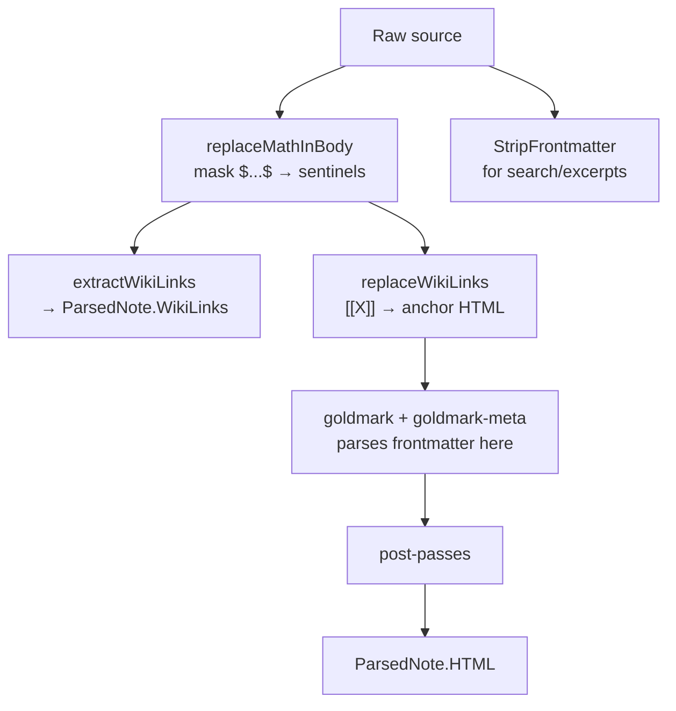

# Frontmatter Boundaries in publish-vault: One Split Where There Were Two

`publish-vault` parses a Markdown note by rewriting it before the renderer sees it. LaTeX math is lifted out and replaced with sentinels; Obsidian `[[wiki links]]` are replaced with anchor HTML. Both rewrites run before goldmark, because once the renderer parses the text it is too late to recover the author's intent. These pre-passes must know where the YAML frontmatter ends, because a `$` or a `[[` inside a YAML scalar is data, not syntax.

The package had two definitions of where frontmatter ends, and they disagreed. The metadata parser, goldmark-meta, accepted any non-empty line of dashes as a delimiter. The pre-passes accepted only an exact `---`. A note whose frontmatter opened with `----` was parsed as metadata by goldmark after being rewritten as Markdown by the pre-passes, so a frontmatter value of `related: '[[Meta Link]]` came back from the parser as generated anchor HTML, and `formula: '$x^2$'` came back as a math sentinel.

This report is about that disagreement and its removal. The interesting part is not the four-dash case in isolation; it is that the package had one correct delimiter predicate and one incorrect splitter that ignored it, and the fix was to stop having two.

> [!summary]
> - A document language extension that rewrites the source before the parser must share the parser's notion of document structure. Two independently maintained boundaries will disagree at the seams — and the disagreement is silent, because each boundary is plausible on its own.
> - The package already contained the correct rule: `isFrontmatterDelimiter` mirrors goldmark-meta's `isSeparator`. The defect was a second splitter, `splitFrontmatter`, that hard-coded an exact `---` and bypassed that rule. Removing the duplicate, not inventing a third rule, was the fix.
> - The boundary is a typed value with a named body offset, not a two-value return. The wiki-link extractor needs to convert whole-source regex offsets into body-relative ones, and naming that offset prevents a future caller from recomputing it as `len(frontmatter)` and being wrong about which slices alias the source.
> - Fixing the boundary preserved an unrelated policy: a `[[X]]` in frontmatter is still indexed in the outgoing-link graph, even though it is never rendered. A boundary fix must not silently change which frontmatter bytes produce graph edges.

## Why this note exists

The defect was found while writing the preceding report on wiki links inside code samples. That report's own source necessarily contains wiki-link and math syntax inside code blocks, and rendering it exposed a different boundary problem. Measuring it required asking a sharper question: what does the parser consider "frontmatter," and does every pass that touches the source agree?

The answer was no, and the disagreement was not confined to one note. A probe over the configured `Parse` pipeline confirmed that goldmark-meta accepts one, two, three, and four dashes, whitespace-wrapped delimiters, and CRLF as frontmatter — and that the pre-passes protected only the three-dash form. Any vault note that used a four-dash (or one- or two-dash) preamble had its metadata rewritten before parsing.

The work is ticket `PV-FRONTMATTER-024` on branch `task/wiki-links-in-code`: two code commits, one behavior-neutral and one behavior-changing, plus a documentation commit. It is the first of a set of Phase 0 correctness fixes that precede a larger typed-document refactor.

## The system before the fix

A note becomes HTML through a sequence of pre-passes, a goldmark render, and a set of post-passes. The pre-passes are where the defect lives.



Three functions split the source into frontmatter and body before goldmark runs:

- `replaceMathInBody` splits so math in YAML is not masked;
- `extractWikiLinks` and `replaceWikiLinks` split so wiki-link HTML is not injected into YAML;
- `StripFrontmatter` splits so plain-text search and excerpts omit metadata.

A fourth consumer, goldmark-meta, splits the source itself when it parses the frontmatter. The defect is that the first three used a different rule from the fourth.

## Two boundaries that disagreed

The package contained two frontmatter boundary implementations.

`splitFrontmatter` hard-coded an exact three-dash opener and closer:

```go
func splitFrontmatter(src []byte) ([]byte, []byte) {
    if !bytes.HasPrefix(src, []byte("---\n")) &&
       !bytes.HasPrefix(src, []byte("---\r\n")) {
        return nil, src
    }
    // ...
    if trimmed == "---" {   // exact three dashes only
        return src[:offset], src[offset:]
    }
    // ...
}
```

`isFrontmatterDelimiter`, used by `stripFrontmatter`, accepted any non-empty dash run after trimming whitespace:

```go
func isFrontmatterDelimiter(line string) bool {
    trimmed := strings.TrimSpace(line)
    if trimmed == "" {
        return false
    }
    return strings.Trim(trimmed, "-") == ""
}
```

Goldmark-meta v1.1.0 uses the same rule as `isFrontmatterDelimiter`. Its `isSeparator` trims surrounding whitespace and requires one or more `-` bytes, and its opening parser is restricted to the first line:

```go
func isSeparator(line []byte) bool {
    line = util.TrimRightSpace(util.TrimLeftSpace(line))
    for i := 0; i < len(line); i++ {
        if line[i] != '-' {
            return false
        }
    }
    return true
}
```

The two rules agree on three dashes and disagree everywhere else. A note with a four-dash preamble falls on the disagreement:

```text
splitFrontmatter:  "----" is not "---" → no frontmatter → pre-passes rewrite the preamble
goldmark-meta:     "----" is a separator → preamble is metadata → parsed after rewriting
```

The pre-passes run first. They see the four-dash preamble as body, mask its math, and substitute its wiki links. Goldmark then parses the rewritten preamble as frontmatter. The metadata the application reads is the pre-passes' output, not the author's input.

## The defect, concretely

Rendering this note before the fix:

```markdown
----
title: Four Dashes
related: '[[Meta Link]]'
formula: '$x^2$'
----
Body [[Body Link]] with $y$.
```

The `related` field comes back from `Parse` as generated anchor HTML, and `formula` as a math sentinel:

```text
related = "<a href=\"/note/meta-link\" class=\"wiki-link\" data-target=\"meta-link\"
          data-raw=\"Meta Link\" data-heading=\"\" data-alias=\"\">Meta Link</a>"
formula = "\ue0000\ue001"      # mathSentinelOpen + 0 + mathSentinelClose
```

The body renders correctly. The `[[Body Link]]` becomes an anchor and `$y$` becomes a math element. The defect is in the metadata, and the metadata is silent: a consumer that reads `frontmatter["related"]` to build a "related notes" list receives a string of HTML instead of the link text the author wrote.

A probe over the configured `Parse` pipeline confirms which delimiter forms the metadata parser actually accepts. All of these parse as frontmatter:

| Delimiter form | `marker` parsed as metadata? |
|---|---|
| one dash `-` | yes |
| two dashes `--` | yes |
| three dashes `---` | yes |
| four dashes `----` | yes |
| whitespace-wrapped `  ----  ` / ` \t----\t ` | yes |
| four dashes CRLF | yes |

The old `splitFrontmatter` protected only the third row. Every other row was a metadata-mutation path.

## Why the disagreement is silent

The failure mode is worth dwelling on, because it is the same shape as the wiki-link-in-code defect that preceded it. The pre-passes are individually plausible. Math masking produces correct body math. Wiki-link substitution produces correct body links. The metadata parser produces correct metadata — for the input it receives. No single pass is wrong about its own responsibility.

The wrongness is in the relationship between the passes. The pre-passes hand goldmark a source whose frontmatter has already been rewritten. Goldmark parses that rewritten source faithfully. A consumer that compares the rendered body against the parsed frontmatter sees consistency: the body has an anchor where the frontmatter has an anchor. The defect is only visible by comparing the parsed frontmatter against the author's original source, which is the one thing no pass does.

This is the class of defect that a unit test for any single pass cannot catch. The regression that pins it must run the whole pipeline — `Parse` — and assert on the metadata, because the bug is the disagreement between two passes that each see only their own output.

## The fix: one boundary, one predicate

The package already had the correct delimiter rule. `isFrontmatterDelimiter` mirrors goldmark-meta. The defect was that `splitFrontmatter` did not use it. The fix was to introduce one canonical split that does, and to make every consumer use that split.

```go
type sourceParts struct {
    frontmatter []byte
    body        []byte
    bodyOffset  int
}

func splitSource(src []byte) sourceParts {
    lines := bytes.SplitAfter(src, []byte("\n"))
    if len(lines) == 0 || !bytes.HasSuffix(lines[0], []byte("\n")) {
        return sourceParts{body: src}
    }
    if !isFrontmatterDelimiter(string(lines[0])) {
        return sourceParts{body: src}
    }
    offset := len(lines[0])
    for i := 1; i < len(lines); i++ {
        offset += len(lines[i])
        if isFrontmatterDelimiter(string(lines[i])) {
            return sourceParts{
                frontmatter: src[:offset],
                body:        src[offset:],
                bodyOffset:  offset,
            }
        }
    }
    return sourceParts{body: src}
}
```

Three properties of this split are load-bearing.

**One predicate.** The delimiter test is `isFrontmatterDelimiter`, the same predicate `stripFrontmatter` already used and the same rule goldmark-meta implements. There is no second rule to drift. A future change to the delimiter contract changes one function and every consumer follows.

**Byte-identical reconstruction.** `frontmatter` and `body` are aliasing slices of the original source: `frontmatter = src[:bodyOffset]`, `body = src[bodyOffset:]`. The two reconstruct the source byte-for-byte without a copy. A split that copied or normalized would break the math spans, which are indices into the body, and would make `StripFrontmatter`'s output differ from what the pre-passes protected.

**A named body offset.** The wiki-link extractor needs to convert whole-source regex offsets into body-relative ones to test them against the code cursor. The old code used a local `fmLen := len(frontmatter)`. The new code uses `parts.bodyOffset`. They are equal today, but the named field is the invariant the larger refactor will rely on: a caller that recomputes `len(parts.frontmatter)` could be wrong about which slices alias the source, and a named offset prevents that recomputation.

## How each consumer migrated

Four consumers used the old `splitFrontmatter`. Each migration was mechanical, but each has an invariant worth naming.

### Math protection

```go
func replaceMathInBody(src []byte) ([]byte, []MathSpan) {
    parts := splitSource(src)
    replaced, spans := ReplaceMath(parts.body)
    if !parts.hasFrontmatter() {
        return replaced, spans
    }
    out := make([]byte, 0, len(parts.frontmatter)+len(replaced))
    out = append(out, parts.frontmatter...)
    out = append(out, replaced...)
    return out, spans
}
```

The math spans remain body-relative. `RestoreMath` and `RestoreMathText` use sentinel indices, not source offsets, so `bodyOffset` is not added to `MathSpan.Start` or `End`. A future math refactor that gains source-span-aware restoration would need to add the offset then; today it must not.

### Wiki-link replacement

The replacement reassembles the frontmatter and the replaced body. The invariant is that no generated anchor or embed markup enters `parts.frontmatter`. After the migration, the only bytes that reach goldmark-meta are the author's original frontmatter bytes.

### Wiki-link extraction

The extraction preserves an intentional asymmetry. The regex runs over the whole source, so a `[[X]]` in a frontmatter value is still matched and still enters `WikiLinks`. Code-region detection runs over the body only:

```go
parts := splitSource(src)
matches := wikiLinkRegex.FindAllSubmatchIndex(src, -1)
code := newCodeCursor(parts.body)
for _, m := range matches {
    if m[0] >= parts.bodyOffset && code.contains(m[0]-parts.bodyOffset) {
        continue
    }
    // record the link
}
```

A match whose start offset falls in frontmatter (`m[0] < parts.bodyOffset`) is never code and is never queried against the cursor, so the cursor's ascending-query invariant holds. A match in the body is shifted by `bodyOffset` before the code test. This asymmetry is the mechanism by which the frontmatter-link policy is preserved.

### Plain-text stripping

`stripFrontmatter` became a one-liner that delegates to the canonical split:

```go
func stripFrontmatter(src []byte) []byte {
    return splitSource(src).body
}
```

The now-unused `splitLine` helper was deleted. It had no remaining callers.

## The policy that the fix preserved

Fixing the boundary changed which bytes the pre-passes protect. It did not change which frontmatter bytes produce graph edges. A `[[X]]` in a frontmatter value is still indexed in `ParsedNote.WikiLinks`, and can still produce a backlink, even though it is never rendered as an anchor.

This is a deliberate scope decision. Across the go-go-parc vault, 123 notes put `[[...]]` in frontmatter `related:` lists. A broader fix that extracted links from the body only would have removed those backlinks. The architecture review filed that question separately — whether frontmatter links should backlink at all is a policy decision, not a boundary decision — and the boundary fix does not decide it.

A regression test pins both halves of the decision:

```go
func TestFrontmatterWikiLinkStillIndexed(t *testing.T) {
    src := []byte("---\nrelated: \"[[Frontmatter Note]]\"\n---\nBody text with no link.\n")
    parsed, err := Parse(src)
    // ...
    if len(parsed.WikiLinks) != 1 || parsed.WikiLinks[0].Target != "Frontmatter Note" {
        t.Fatalf("WikiLinks = %#v, want the frontmatter link to still be indexed", parsed.WikiLinks)
    }
    if contains(parsed.HTML, `data-raw="Frontmatter Note"`) {
        t.Fatalf("frontmatter link must not render as document body, got: %s", parsed.HTML)
    }
}
```

The link is indexed. The link does not render. A maintainer who decides frontmatter links should not backlink flips the first assertion and closes the filed question; the boundary fix does not make that choice.

## The regression and its red state

The regression runs the whole `Parse` pipeline across six delimiter forms and asserts that the metadata holds the author's literal values:

```go
func TestParseProtectsGoldmarkCompatibleFrontmatter(t *testing.T) {
    tests := []struct{ name, open, close, newline string }{
        {"three dashes LF", "---", "---", "\n"},
        {"one dash LF", "-", "-", "\n"},
        {"two dashes LF", "--", "--", "\n"},
        {"four dashes LF", "----", "----", "\n"},
        {"whitespace wrapped", "  ----  ", " \t----\t ", "\n"},
        {"four dashes CRLF", "----", "----", "\r\n"},
    }
    for _, tt := range tests {
        t.Run(tt.name, func(t *testing.T) {
            src := tt.open + tt.newline +
                "title: Boundary" + tt.newline +
                "related: '[[Meta Link]]'" + tt.newline +
                "formula: '$x^2$'" + tt.newline +
                tt.close + tt.newline +
                "Body [[Body Link]] with $y$." + tt.newline
            note, err := Parse([]byte(src))
            // ...
            if got := note.Frontmatter["related"]; got != "[[Meta Link]]" {
                t.Errorf("related = %#v, want literal [[Meta Link]]", got)
            }
            if got := note.Frontmatter["formula"]; got != "$x^2$" {
                t.Errorf("formula = %#v, want literal $x^2$", got)
            }
        })
    }
}
```

The test was verified to fail against the pre-migration code before the fix landed. The red state is the strongest evidence the test pins the right behavior: only the three-dash form passed, and every other form mutated the metadata in exactly the way the defect predicts.

| Delimiter form | Before fix | After fix |
|---|---|---|
| three dashes | `related="[[Meta Link]]"` | `related="[[Meta Link]]"` |
| one dash | `related="<a href=...>Meta Link</a>` | `related="[[Meta Link]]"` |
| two dashes | `related="<a href=...>Meta Link</a>` | `related="[[Meta Link]]"` |
| four dashes | `related="<a href=...>Meta Link</a>` | `related="[[Meta Link]]"` |
| whitespace-wrapped | `related="<a href=...>Meta Link</a>` | `related="[[Meta Link]]"` |
| four dashes CRLF | `related="<a href=...>Meta Link</a>` | `related="[[Meta Link]]"` |

For every non-three-dash form, `formula` was `\ue0000\ue001` before and `$x^2$` after. The body link and body math rendered correctly in both columns — the defect was confined to the metadata.

## The unit matrix

A pipeline-level regression catches the disagreement. A unit matrix pins the boundary itself, so a future change to the splitter fails before any `Parse`-level test does. `TestSplitSourceMatrix` covers sixteen cases:

| Case | Expected |
|---|---|
| no frontmatter | body is the original source, offset 0 |
| one / two / three / four dashes | complete split |
| whitespace-wrapped delimiter | complete split |
| CRLF delimiters | complete split |
| dashes inside a quoted scalar | no premature close |
| indented dash line inside a block scalar | no premature close |
| closing delimiter at EOF | empty body |
| body at EOF without a trailing newline | exact body bytes |
| unterminated opener | whole source remains body |
| thematic break after a heading | no frontmatter (opener is not line zero) |
| opener with trailing non-dash content | no frontmatter |
| empty input | no frontmatter |
| single dash line with no newline | no frontmatter |

Each case asserts four properties: `hasFrontmatter`, exact body bytes, byte-for-byte reconstruction (`frontmatter + body == src`), and `bodyOffset == len(frontmatter)`. The reconstruction invariant is the one that catches a copy or a normalization: if a future `splitSource` ever returns slices that do not alias the source, the reconstruction check fails.

Two edge cases deserve naming.

**The opening line at EOF.** A source of `"----"` with no newline is not frontmatter. The `bytes.HasSuffix(lines[0], "\n")` guard rejects it, because there is no second line to close the block. This matches the previous behavior, where `splitLine` returned `ok=false` for a line with no newline. Matching that behavior exactly is what let the first commit be byte-neutral.

**The unterminated opener.** A source that opens with a delimiter but never closes is returned untouched as body. goldmark-meta's `Continue` parser only closes at a separator, so an unterminated block is never metadata; returning it as body agrees with the metadata parser's decision not to parse it.

## The commit sequence

The fix landed in two code commits, ordered so each is reviewable on its own.

**Commit 1: introduce the boundary, change no behavior.** `sourceParts` and `splitSource` were added, `StripFrontmatter` was migrated to delegate to `splitSource` (byte-identical, since the delimiter rule was already `isFrontmatterDelimiter`), `splitLine` was deleted, and the sixteen-case unit matrix was added. The math and wiki pre-passes still used the old `splitFrontmatter`. A reviewer can read the boundary and its contract in isolation before any behavior changes.

**Commit 2: migrate the pre-passes, change behavior.** `replaceMathInBody`, `extractWikiLinks`, and `replaceWikiLinks` were migrated to `splitSource`, the duplicate `splitFrontmatter` was deleted, and the pipeline regression was added. The regression was verified red against the pre-migration code, then green after.

This rhythm was adapted from strict test-first because the repository's pre-commit hook runs the full test suite on every commit. A commit containing a deliberately-red test would be rejected by the hook. The red state was verified locally instead, and the green result was committed.

## One boundary, not a public API

The fix introduced an unexported `sourceParts` and `splitSource`, not an exported `SourceDocument`. This is a deliberate scope decision. The larger architecture review proposes an exported, reusable parsed-document type for the package. Folding that public API into a boundary fix would couple a correctness defect to an API review and make the pull request harder to land and harder to revert.

The unexported type is the internal basis the larger refactor can promote. It fixes the disagreement now, and it gives the refactor a named body offset to build on, without committing the package to a public surface before the rest of the design is settled.

## What this does not fix

The boundary fix is narrow by design. It does not decide whether frontmatter links should backlink (the separately-filed `dmoh` question). It does not add TOML or JSON frontmatter. It does not validate YAML independently of goldmark-meta. It does not change the wiki-link grammar, the math scanner, note slugs, heading IDs, excerpts, or rendered HTML for ordinary `---` documents. It does not begin the typed AST/IR architecture.

Each of those is a separate Phase 0 issue or a part of the larger refactor. The boundary fix is the one that was both confirmed by a probe and independent of every other decision, which is why it was first.

## Working rules

- When a document language extension rewrites the source before the parser, it must consume the parser's notion of document structure. Two independently maintained boundaries disagree at the seams, and the disagreement is silent because each boundary is plausible on its own.
- Reuse the correct predicate rather than adding a second one. The package already had `isFrontmatterDelimiter`; the defect was a splitter that ignored it. The fix removed the duplicate, not the rule.
- A boundary is a typed value with a named body offset, not a two-value return. The offset is the invariant the consumers rely on; naming it prevents a future caller from recomputing it wrong.
- Verify that a regression fails without its fix. For a defect whose wrong output is structurally identical to the right output, a test that passes both before and after asserts nothing. The red state of this regression — three dashes pass, every other form mutates metadata — is what proves it pins the defect.
- Separate a boundary fix from a policy decision. The fix protects frontmatter bytes from being rewritten; it does not change which frontmatter bytes produce graph edges. Pin the policy with a test so the separation is explicit.
- Land a behavior-neutral boundary before a behavior-changing migration. A reviewer can read the contract in the first commit and the behavior change in the second, and the unit matrix fails before the pipeline regression does.

## Source material

- Application repository: `/home/manuel/code/wesen/go-go-golems/publish-vault`, branch `task/wiki-links-in-code`
  - `internal/parser/parser.go` — `sourceParts`, `splitSource`, `extractWikiLinks`, `replaceWikiLinks`, `stripFrontmatter`, `isFrontmatterDelimiter`
  - `internal/parser/math.go` — `replaceMathInBody`, the sentinel scheme
  - `internal/parser/parser_test.go` — `TestSplitSourceMatrix`, `TestParseProtectsGoldmarkCompatibleFrontmatter`, `TestFrontmatterWikiLinkStillIndexed`
- `goldmark-meta@v1.1.0/meta.go:95–132` — `isSeparator`, the delimiter contract this fix mirrors
- Ticket `PV-FRONTMATTER-024` in the application repository's `ttmp/` tree carries the implementation guide, the implementation diary, and the goldmark-contract probe `scripts/01-goldmark-frontmatter-contract`
- Preceding work on the same service: [[PROJECT REPORT - Wiki Links Inside Code Samples in publish-vault - Two Pre-Passes and the Code They Must Agree About]]
- The architecture review that filed the defect: ticket `PV-MARKDOWN-023`, and the Garden entry [[Research/Software Architecture Garden/publish-vault/05 - Parser-Owned Structure and Typed Reference Resolution|Parser-Owned Structure and Typed Reference Resolution]]
