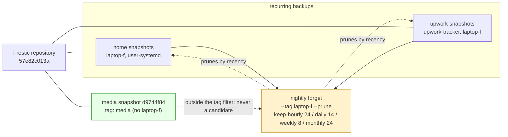

# Laptop Media Backup and Retention Isolation

Deleting source data after a backup is only safe when the backup's retention cannot remove the snapshot that justifies the deletion. A restic repository that serves a recurring backup already has a retention policy, and that policy keeps snapshots by recency. A one-shot backup placed in that same repository will be evaluated by the same policy on the next retention pass. If the source is then deleted, no further snapshots of that data are produced, and the lone snapshot ages out of every keep window until `forget --prune` drops it and reclaims its data. The deletion that the backup was meant to enable becomes the deletion that makes the backup unrecoverable.

This report documents the backup of two local media directories on laptop `f` into an existing restic repository that already runs a nightly home-directory backup, and the one-line retention change that makes the source safe to delete. The change does not add storage of consequence, does not alter the nightly backup's behavior for any existing snapshot, and is verified by a structural repository check and a byte-identical isolated restore. The work closes the Tier-3 "separate media backup" gap left open by the 2026-07-25 scope redesign, and frees 42 gigabytes on a filesystem that was 94 percent full.

> [!summary]
> - `~/Movies` (29G, 130 files) and `~/Downloads/video` (13G, 39 files) were backed up as restic snapshot `d9744f84`, tagged `media`, in the existing `f-restic` repository on the crib TrueNAS.
> - The nightly home backup's `forget --prune` was scoped with `--tag laptop-f` so it manages only the snapshots it already manages and can never prune a `media`-tagged snapshot.
> - All 37 pre-existing snapshots carry the `laptop-f` tag; a dry-run confirmed the new retention keeps every one of them and removes nothing.
> - The media transfer stored 1.238 KiB of new repository data, because the files were already present in the 2026-06-06 baseline before they were excluded on 2026-07-25; the new `media` snapshot now pins those blobs against any future prune.
> - `restic check` reported no errors across 38 snapshots, and an isolated restore of one file from each directory was byte-identical to its source.
> - Deleting both directories frees 42G on a 1.8T filesystem that had 116G free; the copy that remains is a single on-site restic copy, with no offsite replication configured.

## 1. The retention problem with deletable source data

A retention policy expressed as `keep-daily 14 --keep-weekly 8 --keep-monthly 12` does not preserve a snapshot because the snapshot is important. It preserves a snapshot because the snapshot is the most recent one within a time window. The policy is a function of time and count, not of value. Restic applies this function independently to each group of snapshots, where a group is defined by host, paths, and tags unless `--group-by` is overridden.

Consider a repository that runs a nightly backup and applies `forget --keep-daily 14 --keep-weekly 8 --keep-monthly 12 --prune` after each run. Every snapshot in that repository is a candidate for the policy. Now place a one-shot snapshot of a different source into the same repository, with no recurring backup to refresh it. On the first retention pass the one-shot snapshot is the most recent in its day, so it survives as a daily. After fourteen days it is no longer the most recent daily of any day it belongs to, but it may survive as a weekly. After eight weeks it survives only as a monthly. After twelve months it is the oldest monthly and is dropped. The moment `forget --prune` runs after that drop, the snapshot's uniquely referenced data is rewritten out of the repository. If the source was deleted in the meantime, the data is gone.

Two properties make this outcome silent. First, the policy reports success: it pruned exactly what its windows told it to prune. Second, the time between the one-shot backup and the final prune can be a year, long after the operator has stopped thinking of the snapshot as recent. A backup that is correct on the day it runs and wrong on the day it is needed is not a backup; it is a deferred deletion.

The remedy is to remove the one-shot snapshot from the policy's candidate set. Restic's `forget` accepts a `--tag` filter that restricts the snapshots it considers. If the recurring backup tags every one of its snapshots with a tag the one-shot snapshot does not share, and the retention invocation filters on that tag, the one-shot snapshot is never a candidate. It is not kept by the policy; it is simply outside the policy. A snapshot outside the policy is not pruned by the policy for any reason, including age. This is the property the change in this report establishes.

## 2. System context: where this backup lives

The repository is not new. It was created on 2026-06-06 as the operational restic baseline for laptop `f`, documented in `ARTICLE - Crib Backup - From Design to Operational Restic Baseline`. The repository holds two distinct snapshot classes today, and this report adds a third.

```text
Repository:  sftp:backup-f@truenas-scale:/mnt/media-pool/backups/laptops/f-restic
Repository ID: 57e82c013aded99f6c87b89a8dc95d9b880320f248c27cdc2ddc27b758d12a59
Account:     backup-f (uid 3001, gid 3001, SSH-only, password disabled, no SMB)
Transport:   SFTP over SSH, key ~/.ssh/id_restic_crib_f
Password:    ~/.config/restic/crib/password (escrowed in Vault at kv/infra/truenas/restic/laptop-f)
Restic:      0.16.4 compiled with go1.22.2 on linux/amd64
```

The host `truenas-scale` is the TrueNAS Tailscale name, which resolves on the home LAN and over Tailscale alike. The repository URL uses this name rather than the LAN address `192.168.0.25`, so the backup is reachable from any network. The existing nightly home backup's preflight still checks the LAN address; the media script introduced here checks `truenas-scale` to match the repository URL.

| Snapshot class | Tags | Source paths | Scheduler | Retention |
|---|---|---|---|---|
| Home backup | `laptop-f`, `user-systemd` | `/home/manuel` (`--one-file-system`, 104-line excludes) | systemd `--user` timer, daily 03:30 | `--tag laptop-f` keep-hourly 24 / daily 14 / weekly 8 / monthly 24, prune |
| Upwork Tracker | `upwork-tracker`, `laptop-f` | `~/.config/upwork-tracker`, `~/.local/share/upwork-tracker`, WAL-safe `upwork.db` | systemd `--user` timer, daily 04:30 | covered by the same `--tag laptop-f` retention |
| Media backup (this report) | `media` | `/home/manuel/Movies`, `/home/manuel/Downloads/video` | on-demand, no timer | outside the nightly retention; not pruned by it |

The Upwork Tracker snapshots share the `laptop-f` tag with the home snapshots. This is why scoping the nightly `forget` to `--tag laptop-f` continues to manage both existing classes without changing their behavior: every snapshot the nightly job should manage carries that tag.



The diagram states the invariant the change depends on: the `media` snapshot lives in the same repository as the recurring backups, but the retention invocation that prunes the recurring backups does not consider it. Co-location gives deduplication; the tag filter gives isolation.

## 3. The source set and why it was unprotected

The 2026-07-25 scope redesign measured the `f` home directory at 1.7 terabytes and reduced the backup scope to 247 gigabytes through a 104-line excludes file. That redesign classified the home directory into three tiers: back up, exclude as regenerable, and handle separately. The two directories in this report were placed in the second and third tiers.

```text
/home/manuel/Movies            29G   130 files   Tier 3: "separate media backup"
/home/manuel/Downloads/video   13G    39 files   Tier 2: "regenerable"
```

`~/Movies` held 29G of screen-capture `.mkv` recordings and an 11G `ProgramWithAI` subdirectory. `~/Downloads/video` held 13G of conference recordings, talks, and downloaded tutorials. The scope redesign excluded `~/Downloads` (excludes file line 82) as regenerable and `~/Movies` (line 66) as a Tier-3 directory intended for a separate media backup that was not yet built. This report builds that backup for `~/Movies` and, for operational simplicity, includes `~/Downloads/video` in the same snapshot class rather than treating it as regenerable-and-discarded.

The motivating pressure was local capacity. The `f` root filesystem is ext4 over LUKS/LVM on a 1.8-terabyte volume:

```text
Filesystem                         Size  Used Avail Use% Mounted on
/dev/mapper/ubuntu--vg-ubuntu--lv  1.8T  1.6T  116G  94% /
```

A filesystem at 94 percent with 116 gigabytes free is not in immediate danger, but it leaves no room for the coding-agent transcript growth, the `therapist-search` SQLite file, and the `~/workspaces` scratch trees that the home backup is meant to retain. Freeing 42 gigabytes moves the filesystem to roughly 88 percent and 158 gigabytes free, which is the operational headroom the scope redesign assumed.

## 4. The retention isolation change

The nightly home backup script applies retention after a successful backup. The change is a single added flag.

Before:

```bash
restic -o "sftp.args=${RESTIC_SFTP_ARGS}" forget \
  --keep-hourly 24 --keep-daily 14 --keep-weekly 8 --keep-monthly 24 --prune
```

After:

```bash
restic -o "sftp.args=${RESTIC_SFTP_ARGS}" forget \
  --tag laptop-f \
  --keep-hourly 24 --keep-daily 14 --keep-weekly 8 --keep-monthly 24 --prune
```

The `--tag laptop-f` argument restricts the set of snapshots `forget` considers to those carrying the `laptop-f` tag. The retention windows are unchanged. The `--prune` behavior is unchanged. The only effect is that snapshots without the `laptop-f` tag are no longer candidates for the nightly retention pass.

Two facts make this change safe for every existing snapshot. First, every snapshot in the repository already carries the `laptop-f` tag. A tag audit of all 37 snapshots present before the change confirmed this:

```text
total snapshots: 37
WITHOUT laptop-f tag: NONE (all have it)
```

Second, a dry-run of the new retention against those 37 snapshots kept all 37 and removed none. The retention's candidate set after the change is exactly the candidate set before the change, because the tag filter selects every snapshot the unfiltered retention would have selected, and no snapshot outside that set existed. The change is, for the existing repository, a no-op that becomes a guard against future snapshots that lack the tag.

The previous script was preserved before editing:

```text
~/.local/bin/restic-crib-backup.bak.20260816
```

The diff is the one expected line:

```text
<   restic ... forget --keep-hourly 24 --keep-daily 14 --keep-weekly 8 --keep-monthly 24 --prune
>   restic ... forget --tag laptop-f --keep-hourly 24 --keep-daily 14 --keep-weekly 8 --keep-monthly 24 --prune
```

A reader who needs to roll back can restore the backup copy; the retention behavior reverts to the unfiltered policy, which is the behavior the repository has had since its creation.

## 5. The media backup script

The media backup is an on-demand script with no timer. The source files do not change after they are written; a recurring schedule would produce snapshots identical to the first one and would add no recoverability. A one-shot invocation is the correct shape for immutable source data. The script is small enough to audit in a single reading.

```bash
#!/usr/bin/env bash
# On-demand restic backup of local media directories (~/Movies, ~/Downloads/video)
# into the existing f-restic repository on the crib TrueNAS, tagged `media`.
set -euo pipefail

ENV_FILE="${HOME}/.config/restic/crib/env"
STATE_DIR="${HOME}/.local/state/restic"
LOG_FILE="${STATE_DIR}/crib-media-backup.log"

mkdir -p "$STATE_DIR"
set -a
source "$ENV_FILE"
set +a
export RESTIC_REPOSITORY RESTIC_PASSWORD_FILE RESTIC_CACHE_DIR RESTIC_SFTP_ARGS

log() {
  printf '[%s] %s\n' "$(date --iso-8601=seconds)" "$*" | tee -a "$LOG_FILE"
}

SOURCES=(
  "${HOME}/Movies"
  "${HOME}/Downloads/video"
)

preflight() {
  command -v restic >/dev/null
  test -r "$RESTIC_PASSWORD_FILE"
  local missing=0
  for p in "${SOURCES[@]}"; do
    if [ ! -d "$p" ]; then
      log "ERROR: source directory missing: $p"
      missing=1
    fi
  done
  [ "$missing" -eq 0 ]
  # Fail-closed SFTP reachability check (same pattern as restic-crib-backup).
  ssh -i "${HOME}/.ssh/id_restic_crib_f" \
    -o BatchMode=yes -o ConnectTimeout=10 \
    backup-f@truenas-scale \
    'test -d /mnt/media-pool/backups/laptops/f-restic'
}

log "starting crib media restic backup of: ${SOURCES[*]}"
preflight

restic -o "sftp.args=${RESTIC_SFTP_ARGS}" backup "${SOURCES[@]}" \
  --one-file-system \
  --tag media

log "finished crib media restic backup"
```

Three decisions in the script are worth stating.

The script reuses `~/.config/restic/crib/env` rather than defining a second repository, password, and key path. The media backup is a new snapshot class in the existing repository, not a new repository. A second repository would require a second password, a second escrow, and a second TrueNAS dataset, and would forgo the deduplication that makes the transfer nearly free.

The preflight checks SFTP reachability and fails closed. It does not fall back to a local path or an NFS mount. The prior TrueNAS outage documented in the baseline article showed that a missing NFS mount can be silently replaced by an empty local directory, so a backup can write to the wrong location while reporting success. SFTP fails closed: the connection authenticates and opens the remote repository, or the command exits non-zero.

The preflight uses `backup-f@truenas-scale`, the Tailscale hostname, rather than `backup-f@192.168.0.25`, the LAN address used by the nightly home backup's preflight. The repository URL in the environment file uses `truenas-scale`, so the preflight checks the same host the backup will write to. This also means the media backup works from any network, not only the home LAN.

## 6. The backup execution

The script was invoked in the background with `nohup` so its output could be inspected without holding a terminal. The backup reached both source trees, scanned all files, and committed the snapshot.

```text
[2026-08-16T21:54:20-04:00] starting crib media restic backup of: /home/manuel/Movies /home/manuel/Downloads/video
no parent snapshot found, will read all files
Files:         169 new,     0 changed,     0 unmodified
Dirs:           16 new,     0 changed,     0 unmodified
Added to the repository: 1.836 KiB (1.238 KiB stored)
processed 169 files, 40.946 GiB in 1:24
snapshot d9744f84 saved
[2026-08-16T21:55:45-04:00] finished crib media restic backup
```

The line `no parent snapshot found, will read all files` is expected. There was no `media`-tagged parent snapshot, so restic could not reuse a previous media snapshot's file list and had to read every file. Reading is not transferring; restic still hashes every file and checks the repository for an existing blob with that hash before it uploads anything.

The result, `Added to the repository: 1.836 KiB (1.238 KiB stored)` for 40.946 GiB of source, is the consequence of the repository's history. The directories in this report were part of the 2026-06-06 baseline backup of `/home/manuel`, before the 2026-07-25 excludes removed them from the home scope. The file blobs from that baseline are still in the repository: the nightly `forget --prune` keeps hourly, daily, weekly, and monthly snapshots, and several snapshots from June and July still reference those blobs. When the media backup hashed the 169 files, every hash matched an existing blob. Restic added new snapshot and tree metadata (1.836 KiB) and stored 1.238 KiB after compression. No new file data was uploaded.

This is the second reason the tag-scoping change matters. The media snapshot does not own most of its data; the home snapshots from June and July do. If the nightly retention were allowed to forget all of those old home snapshots and prune, the data blobs would be rewritten out of the repository even though the `media` snapshot references them — unless `forget --prune` is taught that the `media` snapshot exists and references them. Restic's prune step is reference-counted across all snapshots, so once the `media` snapshot exists, the blobs it references are not unused and are not pruned. The tag filter on `forget` is what guarantees the `media` snapshot continues to exist; restic's reference counting is what then guarantees the blobs survive. The two mechanisms compose: the tag filter protects the snapshot, and the snapshot protects the data.

## 7. Recovery validation

A completed snapshot proves restic reached the source, hashed the files, and committed metadata. It does not prove a later restore retrieves usable content. Validation was performed in three layers, following the discipline established for the Mac photo backup.

### 7.1 Structural repository check

```bash
restic -o "sftp.args=$RESTIC_SFTP_ARGS" check
```

```text
using temporary cache in /tmp/restic-check-cache-1830500830
create exclusive lock for repository
load indexes
check all packs
check snapshots, trees and blobs
[2:45] 100.00%  38 / 38 snapshots
no errors were found
```

The check validates repository indexes, snapshots, trees, blobs, and pack structure across all 38 snapshots (the 37 pre-existing plus the new `media` snapshot). It does not read all stored file-data blobs.

### 7.2 Isolated restore

One file from each source directory was restored into a fresh temporary directory. The restore did not write into the live source trees.

```bash
restic -o "sftp.args=$RESTIC_SFTP_ARGS" restore d9744f84 \
  --target /tmp/restic-media-validate \
  --include '/home/manuel/Movies/2023-11-08 09-41-12.mkv' \
  --include '/home/manuel/Downloads/video/05_FaceBlur.mp4'
```

```text
restoring <Snapshot d9744f84 of [/home/manuel/Movies /home/manuel/Downloads/video]
  at 2026-08-16 21:54:20.403156489 -0400 EDT by manuel@f> to /tmp/restic-media-validate
Summary: Restored 7 / 2 files/dirs (824.092 MiB / 824.092 MiB) in 0:45
```

The restored files were the expected sizes:

```text
595780047  /tmp/restic-media-validate/home/manuel/Movies/2023-11-08 09-41-12.mkv
268342805  /tmp/restic-media-validate/home/manuel/Downloads/video/05_FaceBlur.mp4
```

### 7.3 Byte-for-byte comparison

Each restored file was compared to its live source with `cmp -s`, which reports success only when the two files are identical at every byte.

```text
Movies/2023-11-08 09-41-12.mkv   : BYTE-MATCH OK
Downloads/video/05_FaceBlur.mp4  : BYTE-MATCH OK
```

A byte-identical restore is stronger evidence than a filename or size check. It confirms that the blob restic selected for the file's hash is the blob that was hashed, and that the decryption and reassembly path is correct end to end.

### 7.4 Coverage reconciliation

The backup summary and the source filesystem were reconciled by file count.

```text
backup summary:  processed 169 files, 40.946 GiB
disk Movies:     130 files
disk Downloads/video:  39 files
disk total:      169 files
```

The 11-gigabyte `ProgramWithAI` subdirectory, which holds the bulk of `~/Movies`, appears as 35 entries in the snapshot's file listing, confirming that the largest single chunk of the source set was captured and not silently truncated.

The validation limits are explicit. The structural check does not read all stored data; a full `restic check --read-data` would. The two restored files are representative, not exhaustive. The restore confirmed file content, not, for example, the playability of a video container. These limits are the same class of limits documented for the Mac photo backup and are acceptable for the decision at hand: whether the source can be deleted.

## 8. Capacity and the deletion decision

The local capacity figures, before and after the planned deletion:

```text
Before: 1.6T used, 116G available, 94% full
After (planned): 1.6T - 42G = ~1.56T used, ~158G available, ~88% full
```

The repository-side cost of the media backup is negligible. The repository directory on TrueNAS measures 395G, and the media snapshot contributed 1.238 KiB of stored data. The 1.50-terabyte reference quota on the `f-restic` dataset, recorded in the scope redesign, leaves on the order of 1.07 terabytes of headroom under that quota. The media backup does not change the capacity planning that the scope redesign established.

The decision the backup was built to enable is the deletion of `~/Movies` and `~/Downloads/video` from the laptop. The validation above is the evidence that the deletion is safe at the restic layer. Two consequences of the deletion should be stated before it is carried out.

The deleted source becomes a single on-site copy. The restic repository lives on the crib TrueNAS, and the TrueNAS dataset has a daily ZFS snapshot at 10:00 with a 14-day lifetime. The ZFS snapshots protect against repository-level mistakes within the last two weeks. They do not protect against site loss. No TrueNAS replication, cloud sync, or offsite repository copy is configured for `f-restic`. This is the same 3-2-1 gap documented in the Mac photo backup and the scope redesign; the media backup inherits it. The data is protected against the loss of laptop `f`, not against the loss of the crib.

The source directories will not be re-created by any recurring job. If the operator later wants these files on the laptop again, the only way to obtain them is a `restic restore` from snapshot `d9744f84`. A restore is the inverse of the backup: it reads the repository, decrypts the blobs, and writes the files back to a target directory. It is not instantaneous for 42 gigabytes over SFTP, and it should be planned rather than assumed.

## 9. Stale lock handling during the change

Before the retention dry-run could execute, restic reported the repository was locked:

```text
unable to create lock in backend: repository is already locked by PID 2274012 on f by manuel
lock was created at 2026-08-16 21:52:17 (1m16.167065652s ago)
storage ID 6550903e
```

The locking process, PID 2274012, was no longer running. No restic process was alive on the host. The lock was stale: a prior restic invocation had terminated without releasing its lock. Stale locks recur on this setup because the weekly 5-percent `--read-data-subset` check is slow over the Tailscale DERP relay and can time out before it removes its lock. The nightly home backup script accounts for this with an explicit `restic unlock` at the start of each run.

The stale lock was removed with `restic unlock`, and `list locks` confirmed the repository held no locks before the dry-run and the backup proceeded:

```text
successfully removed 1 locks
```

This is a known operational property of the repository, not a defect introduced by this change. The media script does not run `unlock` itself because it is an on-demand, operator-invoked command; the operator can see a lock error and decide. Adding `unlock` to an on-demand script would silently remove a lock that a concurrent legitimate backup might hold, which is the failure mode the lock exists to prevent.

## 10. Decisions, constraints, and remaining work

| Decision | Result | Rationale |
|---|---|---|
| Back up media into the existing `f-restic` repository | Accepted | A separate repository would forgo deduplication against the June baseline and would require a second password, escrow, and dataset. The blobs already existed. |
| Tag the media snapshot `media`, not `laptop-f` | Accepted | The tag must differ from the nightly retention filter, or the nightly `forget` would manage the media snapshot by recency and eventually prune it. |
| Scope the nightly `forget` with `--tag laptop-f` | Accepted | Selects exactly the snapshots the nightly job already manages (all carry `laptop-f`), excludes the `media` snapshot, and is a no-op for the existing repository. |
| Run the media backup on demand, not on a timer | Accepted | The source files are immutable once written; a recurring schedule produces identical snapshots and adds no recoverability. |
| Include `~/Downloads/video` with `~/Movies` | Accepted | Both are media the operator wants to retain; separating them into two snapshot classes would add tags and scripts without changing the recovery story. |
| Delete the source after validation | Pending operator confirmation | The validation proves the restic layer is sound; the deletion is a separate, operator-confirmed step. |
| Configure offsite replication | Not yet implemented | No target or credentials selected. The media backup inherits the 3-2-1 gap of the wider system. |

The following work remains before the media backup should be described as resilient against site loss.

1. **Carry out the deletion and re-verify the snapshot.** After the operator confirms, delete `~/Movies` and `~/Downloads/video`, then list snapshot `d9744f84` again to confirm the snapshot is intact and independent of the source.
2. **Create an offsite copy of the repository.** Replicate the `f-restic` dataset or store an independent restic copy in a separate provider. The offsite design must include encryption, retention, capacity, and a restore test. Until this exists, the media backup is a single on-site copy.
3. **Schedule a periodic full data scan.** The structural check run here is fast and sufficient for the change; a full `restic check --read-data` reads all stored data and should run during a planned maintenance window, as the scope redesign recommends.
4. **Reconcile the nightly preflight host.** The nightly home backup's preflight checks `backup-f@192.168.0.25` while its repository URL uses `truenas-scale`. Aligning the preflight to `truenas-scale` would make the nightly backup, like the media backup, reachable from any network.
5. **Record the excludes-file change.** The `~/Movies` and `~/Downloads/video` lines remain in the home excludes file and should stay there; they document that the home backup does not cover these paths. A future reader of the excludes file should find a pointer to this report so the "separate media backup" intent is not mistaken for a gap.

## Key points to retain

- A one-shot backup in a repository with a recency-based retention policy is pruned on a schedule determined by the policy's windows, not by the importance of the data. Deleting the source turns a correct backup into a deferred deletion.
- Scoping `forget` with a tag the recurring snapshots share and the one-shot snapshot does not removes the one-shot snapshot from the policy's candidate set. The snapshot is not kept by the policy; it is outside the policy.
- The change is safe for existing snapshots only when every existing snapshot carries the tag the retention filters on. A tag audit and a dry-run are the evidence that the change is a no-op for the existing repository.
- A media snapshot that stores 1.238 KiB of new data still protects 40.946 GiB of source, because it references blobs the repository already holds. The tag filter protects the snapshot; restic's reference counting protects the blobs the snapshot references.
- The structural check, the isolated restore, and the byte-for-byte comparison are three separate required operations. A completed snapshot is necessary but not sufficient.
- The deletion the backup enables leaves a single on-site copy. The 3-2-1 gap is a property of the wider system, not introduced by this change, and not closed by it.

## Evidence and implementation references

- Source machine: laptop `f` (Framework, Ubuntu 24.04.2 LTS), `/home` on `/dev/mapper/ubuntu--vg-ubuntu--lv`
- Repository: `sftp:backup-f@truenas-scale:/mnt/media-pool/backups/laptops/f-restic` (ID `57e82c013a`)
- New media snapshot: `d9744f84`, tag `media`, 169 files, 40.946 GiB, 2026-08-16 21:54 -0400
- New script: `~/.local/bin/restic-crib-media-backup`
- Modified script: `~/.local/bin/restic-crib-backup` (retention scoped with `--tag laptop-f`)
- Backup of modified script: `~/.local/bin/restic-crib-backup.bak.20260816`
- Media backup log: `~/.local/state/restic/crib-media-backup.log`
- Environment file: `~/.config/restic/crib/env` (repository, password file, cache, SFTP args)
- Excludes file: `~/.config/restic/crib/excludes` (104 lines; `~/Movies` line 66, `~/Downloads` line 82)
- Prior baseline: `ARTICLE - Crib Backup - From Design to Operational Restic Baseline` (2026-06-06)
- Scope redesign: `PROJECT REPORT - Restic Backup Scope Design - From 1.7T Home to a 247G Recovery Unit` (2026-07-25)
- Playbook: `PLAYBOOK - Restic Backups to the Crib NAS`

## Related notes

- [[PROJECT REPORT - Restic Backup Scope Design - From 1.7T Home to a 247G Recovery Unit]] — the scope investigation that excluded these directories and classified `~/Movies` as Tier-3 "separate media backup".
- [[ARTICLE - Crib Backup - From Design to Operational Restic Baseline]] — the `f-restic` repository's creation and first full backup, whose June baseline holds the blobs the media snapshot references.
- [[ARTICLE - Recoverable Mac Photo Backups with Restic TrueNAS and launchd]] — the Mac `mimimi-2` backup, a separate repository and dataset, whose validation discipline this report follows.
- [[PROJECT REPORT - Tailscale on TrueNAS - Making Restic Backups Work From Any Network]] — the Tailscale configuration that makes `truenas-scale` reachable from any network and lets the media backup run off the home LAN.
- [[PLAYBOOK - Restic Backups to the Crib NAS]] — the generalized playbook with parameterized scripts for this backup pattern.
