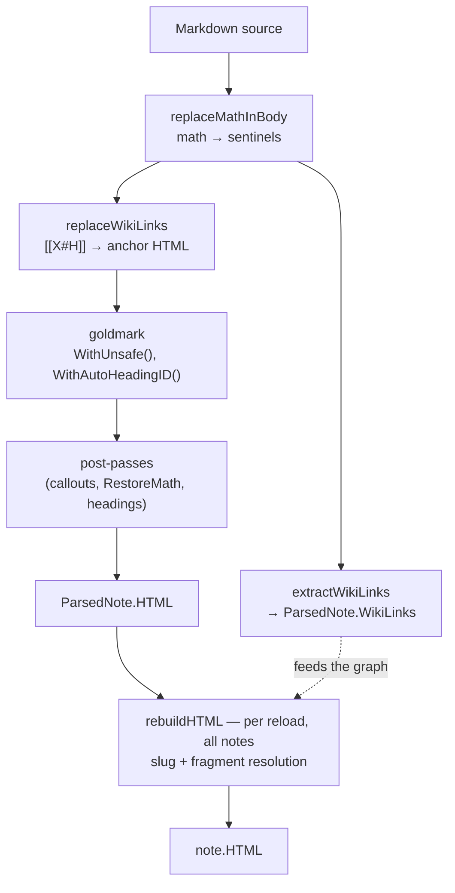

# Wiki Links Inside Code Samples in publish-vault: Two Pre-Passes and the Code They Must Agree About

`publish-vault` substitutes `[[Some Note]]` for anchor HTML before the Markdown renderer runs, because the renderer would otherwise parse the link text as Markdown. That ordering is correct for prose and destructive for code: the anchor HTML is injected into the source, the renderer escapes it into a code block, and a note documenting the syntax displays `<a href="/note/some-note" class="wiki-link" …>` as visible text where its author wrote `[[Some Note]]`. A second consequence is harder to see: the same substitution put `Target Note` into the outgoing-link graph, so a fenced code sample gave the note it named a backlink from a note that never linked to it.

This report is about that defect and the two review findings that followed it. The three are not independent. Two pre-passes rewrite the source before the renderer — one for LaTeX math, one for wiki links — and each must leave code regions untouched. The defects are the places where a pre-pass's notion of "code" differed from the renderer's, or where the two pre-passes disagreed with each other. Naming that structure is the useful part of this note; the individual fixes follow from it.

> [!summary]
> - A pre-pass that rewrites the source before the Markdown parser must know what code is. Without that knowledge it rewrites code samples into escaped markup, and any derived graph built from its output acquires edges that were never authored.
> - When two pre-passes both rewrite the same source before a shared parser, they must identify the regions they leave untouched with one shared mechanism. Per-pass identification lets the passes disagree at the seams — a metadata preamble, an escaped delimiter — and a disagreement is silent because each pass is individually plausible.
> - A backtick inside YAML frontmatter is not Markdown. Detecting code over the whole source pairs a frontmatter backtick with a body backtick and silently drops a body link from the outgoing-link graph while the replacement pass still renders it. The fix is to split the frontmatter off, the operation the replacement pass already performed.
> - An escaped backtick is not a code-span delimiter. The pre-pass must consume backslash escapes the way the math pre-pass already did, or a link written between two escaped backticks is wrapped in a code span and dropped from rendering and from the graph.

## Why this note exists

The defect was found while writing the preceding report on wiki-link resolution, [[PROJECT REPORT - Wiki-Link Resolution in publish-vault - Three Slug Algorithms and the Links Between Them]]. That report necessarily shows wiki-link syntax inside code blocks, and rendering it through `publish-vault` produced walls of escaped `<a href="…">` markup where the examples should have been. The defect is pre-existing and unrelated to that work; it has been in the renderer since the wiki-link pre-pass was written.

The first job was to establish whether this was one note's problem or the vault's. It is the vault's. Across the go-go-parc vault at the time of measurement, 69 of 1790 notes were affected:

| | before | after |
|---|---|---|
| injected markup occurrences | 341 | 0 |
| notes affected | 69 | 0 |

The work is ticket `PV-WIKICODE-022` and pull request #20 against `go-go-golems/publish-vault`: five commits, 999 inserted lines, of which 206 are tests. Two of the five commits address review findings on the pull request; the other three are the original fix and its documentation.

## The system before this work

A note becomes HTML through a sequence of pre-passes, the Markdown renderer, and a sequence of post-passes. The pre-passes are where the defect lives, and their order is load-bearing.



Two pre-passes rewrite the source before goldmark sees it. `replaceMathInBody` lifts LaTeX math out and replaces each region with a sentinel — a Private Use Area code point wrapping an index — so the renderer cannot destroy the TeX. `replaceWikiLinks` then substitutes each `[[…]]` span with anchor HTML. Both run before goldmark for the same structural reason: once the renderer parses the text, it is too late to recover the author's intent, because the renderer will have applied emphasis, escape, and line-wrap rules that a back-substitution cannot undo.

Math runs before wiki links, and the order is not arbitrary. `replaceWikiLinks` injects raw HTML — quoted attribute values, tag delimiters — into the body. Scanning that output for `$` afterwards could swallow the injected markup as a math region. Lifting math first, from the clean source, is what keeps the two concerns separated. The dependency is one-directional and worth recording next to the code, because reversing the order would not fail a test that does not contain both math and a wiki link in the same paragraph.

The wiki-link pre-pass has two callers, and the defect is in the relationship between them. `extractWikiLinks` records every `[[…]]` as a `WikiLink`, which feeds the outgoing-link list, the backlink graph, and the agent Markdown view. `replaceWikiLinks` substitutes each `[[…]]` with anchor HTML, which becomes the rendered page. A link that one pass converts and the other skips is a link that is rendered but absent from the graph, or present in the graph but not rendered. Both are silent: the page looks right, or the graph entry looks right, and only a comparison of the two reveals the disagreement. Every defect in this note is of that form.

## The defect

Rendering a note that documents wiki-link syntax, before the fix, produces this:

```html
<p>A note refers to another as <code>&lt;a href=&quot;/note/some-note&quot; class=&quot;wiki-link&quot;
   data-target=&quot;some-note&quot; data-raw=&quot;Some Note&quot; …&gt;Some Note&lt;/a&gt;</code>, or with a heading:</p>
<pre><code class="language-markdown">&lt;a href=&quot;/note/target-note#heading&quot; class=&quot;wiki-link&quot; …&gt;Target Note&lt;/a&gt;
&lt;img class=&quot;wiki-embed-image&quot; data-asset=&quot;Diagram.png&quot; …&gt;
</code></pre>
```

The author wrote `` `[[Some Note]]` `` and a fenced block containing `[[Target Note#Heading]]`. The pre-pass substituted both before goldmark ran, goldmark then escaped the injected markup into the code element, and the escaped markup is what the reader sees. The same note rendered after the fix:

```html
<p>A note refers to another as <code>[[Some Note]]</code>, or with a heading:</p>
<pre><code class="language-markdown">[[Target Note#Heading]]
![[Diagram.png]]
</code></pre>
<p>A real link: <a href="/note/some-note" class="wiki-link" …>Some Note</a>.</p>
```

The link outside code is unchanged. The links inside code are the author's text, which is what Obsidian displays.

The visible markup is the symptom that surfaced the defect. The second consequence is the one that was not measured until the fix was written. The `WikiLinks` list, before the fix, contained both `Some Note` and `Target Note`:

```
== WikiLinks (feeds the backlink graph) ==
  target="Some Note" heading="" embed=false
  target="Target Note" heading="Heading" embed=false
```

After the fix it contains only `Some Note`. `Target Note` appeared in the graph because `extractWikiLinks` recorded it from the fenced example, and `buildBacklinks` then gave `Target Note` a backlink from a note that never linked to it. A code sample had become a reference. The `Parse` function already guards against exactly this for `[[Foo]]` appearing inside a formula — a formula is literal TeX, not a link — and the guard's comment states the reason. Code samples had no such guard.

This is worth dwelling on as a class. The escaped markup is visible, so someone eventually notices it. The phantom backlink is not visible: the backlink appears in the target note's backlink list, it resolves to a note that exists, and nothing on either page indicates that the edge was authored in a code block. The defect was found by rendering the note and inspecting `WikiLinks`, not by reading the rendered page.

## The invariant: two pre-passes, one notion of code

The math pre-pass already skips code regions. A `$` inside a code span is a literal dollar sign, and `$100` in a code sample is a price, not the opening of inline math. The scanners that decide this — `skipCodeSpan`, `fenceOpensAt`, `skipFencedBlock`, `fenceClosesAt` — are CommonMark-careful in ways that are easy to get wrong on a second attempt:

| CommonMark rule | Where it bites |
|---|---|
| The closing fence must be at least as long as the opening one and carry nothing after its run | An info string inside a block (` ```example ` on a line inside a ` ``` `-opened block) is code, not a terminator. Accepting it ends the skipped region early. |
| A code span does not cross a blank line | A backtick run that never closes is literal text, and only the run itself is consumed, so a `$` after a stray backtick is still scanned. |
| Up to three leading spaces of indent still open a fence | A fence indented under a list item is a fence, not a continuation line. |
| An escaped backtick is a literal character, not a delimiter | `\`` does not open a code span; a link between two escaped backticks is not code. |

The wiki-link pre-pass needs the same regions skipped for the same reason: a `[[…]]` inside a code span or a fenced block is documentation of the syntax, not a reference. The decision that shaped the fix was to reuse the math pre-pass's scanners rather than write new ones. Reusing them makes "the two passes agree about what code is" a property of the system, which is stronger than either pass being individually correct. A disagreement between the two passes — the subject of both review findings — is a class of defect that shared scanners structurally prevent.

`codeRegions` is the wiki-link pass's view of the same regions, built with the shared scanners:

```go
func codeRegions(body []byte) [][2]int {
	var regions [][2]int
	i, n := 0, len(body)
	for i < n {
		if i == 0 || body[i-1] == '\n' {
			if fenceChar, fenceLen, ok := fenceOpensAt(body, i); ok {
				end := skipFencedBlock(body, i, fenceChar, fenceLen)
				regions = append(regions, [2]int{i, end})
				i = end
				continue
			}
		}
		if body[i] == '\\' && i+1 < n {
			i += 2 // consume the escaped byte, mirroring ScanMath
			continue
		}
		if body[i] == '`' {
			if end := skipCodeSpan(body, i); end > i {
				regions = append(regions, [2]int{i, end})
				i = end
				continue
			}
		}
		i++
	}
	return regions
}
```

The backslash branch is the second review finding; the rest is the original fix. Both passes call the same `skipCodeSpan` and the same fence scanners, so a change to one scanner's notion of a code span changes both passes at once. That is the point of sharing: the agreement is maintained by construction, not by a test that checks it after the fact.

One region is deliberately not on this list. Indented four-space blocks are not treated as code, inheriting a decision the math pre-pass documents. A four-space indent inside a list is a continuation line, not code, and treating it as code would silently drop links from nested list items — a worse and far more common failure in a notes vault than a link rendering inside an indented code block. The tradeoff is recorded because the alternative looks correct until a list item loses its links.

## Implementation: index-aware replacement

The substitution could not stay a single `regexp.ReplaceAllFunc`. `ReplaceAllFunc` rewrites every match and has no way to skip one, so a `[[…]]` inside a code region would be substituted regardless. Both passes became index-aware.

`replaceWikiLinksOutsideCode` walks `FindAllIndex` and copies the gaps between matches itself, substituting only the matches the code cursor admits:

```go
func replaceWikiLinksOutsideCode(body []byte, spans []MathSpan) []byte {
	locs := wikiLinkRegex.FindAllIndex(body, -1)
	if len(locs) == 0 {
		return body
	}
	code := newCodeCursor(body)
	out := make([]byte, 0, len(body))
	last := 0
	for _, loc := range locs {
		if code.contains(loc[0]) {
			continue
		}
		out = append(out, body[last:loc[0]]...)
		out = append(out, wikiLinkHTML(body[loc[0]:loc[1]], spans)...)
		last = loc[1]
	}
	return append(out, body[last:]...)
}
```

`extractWikiLinks` moved from `FindAllSubmatch` to `FindAllSubmatchIndex` for the same reason: it needs the match offsets to test them against the code cursor, and the submatch capture groups to separate the embed marker, the target, and the alias.

The code cursor answers "is this offset inside code?" for offsets queried in ascending order, which is how both callers walk their matches:

```go
type codeCursor struct {
	regions [][2]int
	i       int
}

func (c *codeCursor) contains(off int) bool {
	for c.i < len(c.regions) && c.regions[c.i][1] <= off {
		c.i++
	}
	return c.i < len(c.regions) && off >= c.regions[c.i][0]
}
```

The cursor advances past any region that ends at or before the query, then tests whether the query falls inside the next region. Because the queries arrive in ascending order, each region is considered at most once, and the cursor runs in time linear in the number of matches rather than the number of regions. The invariant is the ascending order: `regexp` guarantees it for both callers, but a third caller iterating in any other order would advance the cursor past a region it should still match and get a wrong answer. The constraint is recorded on the type; a cursor that did not assume ascending order would be safe for any caller and slower for the ones that have it, and both callers have it.

## Two findings from review

Automated review of the pull request produced two findings, both valid, both introduced by the shared-scanner design, and both instances of the same structure as the defect above: the two passes disagreeing about what counts as code. Each is silent in one direction and not the other.

### Finding one: a backtick in frontmatter is not Markdown

`replaceWikiLinks` always split the frontmatter off before substituting, because injecting anchor HTML into a YAML scalar such as `"[[Note]]"` produces invalid YAML and makes the frontmatter extension treat the entire preamble as visible document content. `extractWikiLinks` did not. It built its code cursor over the whole source, frontmatter included, so a backtick inside a frontmatter scalar paired with a backtick in the body and classified the body link between them as code.

The disagreement is asymmetric in exactly the way that makes it hard to find. `replaceWikiLinks` scanned the body only, so the body link rendered as an anchor — the page is correct. `extractWikiLinks` scanned the whole source, so the same link was skipped as code and never entered `WikiLinks` — the graph is wrong. Nothing on the page and nothing in the graph entry reveals the mismatch; only a comparison of the two does.

The fix splits the frontmatter off in `extractWikiLinks` as well, so both passes detect code on the same buffer:

```go
func extractWikiLinks(src []byte, spans []MathSpan) []WikiLink {
	frontmatter, body := splitFrontmatter(src)
	fmLen := len(frontmatter)
	matches := wikiLinkRegex.FindAllSubmatchIndex(src, -1)
	code := newCodeCursor(body)
	seen := map[string]bool{}
	var links []WikiLink
	for _, m := range matches {
		if m[0] >= fmLen && code.contains(m[0]-fmLen) {
			continue
		}
		// … record the link …
	}
	return links
}
```

The regex still runs over the whole source, so a `[[X]]` in a frontmatter value is still matched. Only the code-region test is body-relative: a match whose start offset falls in frontmatter (`m[0] < fmLen`) is never code and is not even queried, so the cursor's ascending-query invariant holds — frontmatter matches arrive first, are skipped without advancing the cursor, and the first body query sees the cursor at index zero.

The scope of the fix is narrower than it first appears, and the narrowing is a deliberate decision rather than an oversight. The review comment was titled "Exclude frontmatter when detecting code regions," and it is about detection, not matching. Removing frontmatter from code detection keeps a body link in the graph; removing frontmatter from matching would also remove every `[[X]]` that a note carries in a `related:` list. Across the go-go-parc vault, 123 notes put `[[…]]` in frontmatter, and those entries currently produce backlinks. Whether they should is a separate question — one the ticket records as a filed follow-up rather than a decision made by accident — and a regression test pins the current behaviour so the question stays explicit:

```go
func TestFrontmatterWikiLinkStillIndexed(t *testing.T) {
	src := []byte("---\nrelated: \"[[Frontmatter Note]]\"\n---\nBody text with no link.\n")
	parsed, err := Parse(src)
	if err != nil {
		t.Fatalf("Parse: %v", err)
	}
	if len(parsed.WikiLinks) != 1 || parsed.WikiLinks[0].Target != "Frontmatter Note" {
		t.Fatalf("WikiLinks = %#v, want the frontmatter link to still be indexed", parsed.WikiLinks)
	}
	if contains(parsed.HTML, `data-raw="Frontmatter Note"`) {
		t.Fatalf("frontmatter link must not render as document body, got: %s", parsed.HTML)
	}
}
```

The test asserts both halves of the decision: the frontmatter link is indexed, and it does not render. A maintainer who decides frontmatter links should not backlink flips the first assertion and closes the follow-up; the fix here does not decide that question either way.

### Finding two: an escaped backtick is not a delimiter

In CommonMark, a backslash immediately before a backtick makes that backtick a literal character. A wiki link written between two escaped backticks is therefore a literal backtick, the link, and a literal backtick — not a code span. `codeRegions` had no backslash branch, so it treated the first escaped backtick as an opener, found the second as the closer, and wrapped the link in a code span. Both passes then skipped it: the page showed plain `[[Target]]` and the backlink was absent.

The math pre-pass did not have this defect. `ScanMath` consumes a backslash and the byte that follows it before any other branch runs, so an escaped backtick is never seen as an opener:

```go
case c == '\\':
	// \[ and \( open math. Every other backslash escapes the byte that
	// follows it, and consuming both bytes here is exactly what makes
	// `\$` a literal dollar sign: the $ branch below never sees it.
	…
	i += 2
```

The fix copies the branch into `codeRegions`. The argument that the branch has no other effect is worth making precisely, because `codeRegions` walks the body byte by byte and acts on exactly one byte outside the fence check: the backtick. Consuming a backslash and the next byte changes exactly one observable thing — a backtick immediately after a backslash is no longer an opener — and a backslash before any other byte would have fallen through to `i++` anyway. The fence check at line start runs before the backslash branch, so fence detection is unaffected, including after a backslash-newline hard line break, where the preceding byte is the newline after the consume.

Two cases in the boundary test pin both halves of the argument. An escaped backtick does not open a span:

```
src:    "A \`[[A]]\` then [[B]].\n"
linked: ["A", "B"]          # both render; the escaped backticks are literal
```

An even number of backslashes before a backtick still opens a span, because each pair is an escaped backslash and the backtick is unescaped:

```
src:     "A \\`[[C]]` then [[D]].\n"
literal: ["[[C]]"]          # [[C]] stays inside a real code span
linked:  ["D"]
```

The second case is the one that proves the branch did not over-correct. A naive fix that consumed every backslash would also swallow the backslash that escapes a backslash, and a code span opened by an even-backslash backtick would be missed. The `i += 2` consume handles exactly one escape at a time, so pairs collapse and the backtick after them is seen as an opener.

Both findings reduce to the same property. The math pass handled frontmatter (by splitting it) and escapes (by consuming them); the wiki-link pass did neither. Copying the two behaviours into the wiki-link pass fixed both bugs and restored the agreement the shared-scanner design was meant to maintain. The scanners were shared; the surrounding loop was not, and the disagreement lived in the loop.

## Measurement

Every figure in this note comes from a script that renders real notes and inspects the output, with the "before" column produced by checking out the pre-fix source. The defect's visible symptom is escaped markup, but the audit does not match escaped markup directly. A note explaining the renderer may quote the same markup in an ` ```html ` block on purpose, and that output is correct. Matching the shape of the markup would count those notes as defects.

The audit separates the two by parsing each note twice. The first parse renders the note as written. The second parse renders it with every `[[` replaced by `⟦⟦`, a sequence that cannot open a wiki link. Markup present in both renderings was written by the author; markup present only in the first was injected by the pre-pass. The difference is an exact discriminator rather than a heuristic on the markup's shape:

```go
n := leakCount(body) - leakCount(bytes.ReplaceAll(body, []byte("[["), neutralised))
```

The two-pass baseline was not the first attempt. The audit's first version reported five residual occurrences after the fix, all of them false positives from two notes that quote the renderer's output in an ` ```html ` block on purpose. The temptation was to write those up as a known limitation. The two-pass baseline took the residual from five to zero without weakening the check, by measuring the author-written baseline directly rather than guessing which markup shapes an author would write.

On the go-go-parc vault:

| | before | after |
|---|---|---|
| notes parsed | 1790 | 1836 |
| injected markup occurrences | 341 | 0 |
| notes affected | 69 | 0 |

The vault has grown between the two measurements; the "after" column is the current state, and the fix holds at zero across the larger vault. The 123 frontmatter-link notes are a separate measurement, taken to size the scope of the first review finding: a broad fix that removed frontmatter from matching would have changed the backlink graph for 123 notes, and the narrow fix that removed it from code detection only changed none.

Each behavioural test was verified to fail against the pre-fix source before being committed. For the two review findings this is not a formality: the frontmatter finding produces a `WikiLinks` list that is wrong in content but right in length, and a test that asserts only the length would pass both before and after. The tests assert the target of the single expected link, so a swallowed body link that left the phantom code-sample link in its place fails the test, and the absence of the link fails it.

## Agreement before a shared parser

The general statement is about several passes that each rewrite a source before a single parser consumes it.

When one pass rewrites the source, the question is whether it knows what the parser will treat as literal. A pass that does not know what code is will rewrite code samples, and the rewrite is silent in the direction that matters: the markup it produces is well-formed, the parser escapes it, and the only signal that the author's text is gone is a comparison with the source.

When two passes rewrite the same source, a second question appears: whether they agree about the regions they leave untouched. Each pass can be individually correct and the pair still wrong, because correctness for a pass is defined against the parser, and the disagreement between the passes is not visible to either of them. The frontmatter finding is the cleanest instance: one pass rendered the link, the other dropped it, and each pass's output was consistent with its own notion of code.

The remedy is structural. The regions a pass leaves untouched must be identified by one mechanism that every pass shares, rather than identified independently by each. Reusing the scanners makes agreement a property of the system — a change to the notion of a code span changes every pass at once — where per-pass identification makes agreement a hope that holds until the passes diverge at a seam. The seams are exactly the places a second pass would be tempted to write its own scanner: a metadata preamble that is not document body, an escape sequence that is not a delimiter. The review found both seams, and both were the wiki-link pass doing something the math pass had already decided differently.

The diagnostic question is whether the passes share their region scanner. A second pass that imports the first's scanner cannot disagree with it about what a code span is. A second pass that reimplements the scanner can be correct against the parser and wrong against the first pass, and the wrongness is silent because both passes look right on their own.

## Failure modes to check in similar systems

- **A pre-pass that rewrites the source before the parser.** Test it against input that contains the rewritten syntax inside a code span and a fenced block, and assert on the rendered output rather than on the rewritten source. The rewrite is invisible in the source and visible only in what the parser does with it.
- **Two pre-passes over the same source.** If each identifies the regions it skips, run a case where the two notions of a region diverge — a delimiter in a metadata preamble, an escaped delimiter — and assert that the passes produce consistent output. The divergence is silent in the output of either pass alone.
- **A delimiter inside a metadata preamble.** Split the preamble off before detecting document structure. A backtick in YAML is a YAML scalar, not a Markdown code-span opener, and detecting code over the preamble pairs it with a body delimiter.
- **Escaped delimiters.** Consume the escape the way the parser does, so an escaped delimiter is content. A scanner that ignores backslashes treats `\`` as an opener and swallows the text between two escaped delimiters.
- **A pre-pass that feeds a derived graph.** Treat code samples as documentation, not references. A code mention of an entity becomes an edge in the graph, and the edge is indistinguishable from an authored one because it resolves to an entity that exists.
- **A region that is ambiguous between code and prose.** Indented four-space blocks are continuation lines inside lists and code elsewhere. The decision to treat them as prose is a tradeoff that favors the common case; record it, because the alternative looks correct until a list item loses its links.

## Working rules

- Reuse the existing region scanner rather than reimplementing it. Agreement between passes is a property of shared code, not a coincidence of two correct implementations, and a shared scanner cannot diverge from itself.
- Split metadata off before detecting document structure. The operation the replacement pass already performed is the one the extraction pass should perform, and the cost of not doing it is a delimiter in the preamble pairing with one in the body.
- Consume escapes the way the parser does, one byte at a time. An escaped delimiter is content, and a consume that handles one escape leaves the delimiter after an even escape run as an opener.
- When a pre-pass feeds a derived graph, treat code samples as documentation. The graph cannot distinguish an edge authored in prose from one authored in a code block, so the pre-pass must not produce the second.
- Make the scope of a fix explicit with a test that pins the behaviour you chose not to change. The frontmatter fix excludes frontmatter from code detection and not from matching; a test asserts both, so the filed question of whether frontmatter should backlink stays open and visible.
- Verify that a regression test fails without its fix. For defects whose wrong output is structurally identical to the right output, a test written against the wrong model passes in both directions and asserts nothing.
- File the second-system defect rather than expanding scope. The static TypeScript build has the same defect and no code-region scanner; it is recorded as a follow-up rather than folded into a fix whose review asked for two specific things.

## Source material

- Application repository: `/home/manuel/code/wesen/go-go-golems/publish-vault`, pull request #20, branch `task/wiki-links-in-code`
  - `internal/parser/parser.go` — `extractWikiLinks`, `replaceWikiLinks`/`replaceWikiLinksOutsideCode`, `codeRegions`, `codeCursor`, `splitFrontmatter`
  - `internal/parser/math.go` — `ScanMath` (the backslash branch and the shared scanners `skipCodeSpan`, `fenceOpensAt`, `skipFencedBlock`, `fenceClosesAt`), the sentinel scheme
  - `pkg/vault/vault.go` — `buildBacklinks`, the consumer of `ParsedNote.WikiLinks`
- Ticket `PV-WIKICODE-022` in the application repository's `ttmp/` tree carries the design index, the implementation diary (Steps 1 and 2), the tasks, and two scripts:
  - `scripts/01-code-region-repro` — renders the syntax-documentation note and prints its HTML and `WikiLinks`
  - `scripts/02-vault-code-leak-audit` — the two-pass baseline that produced every figure in the measurement section
- Preceding work on the same service: [[PROJECT REPORT - Wiki-Link Resolution in publish-vault - Three Slug Algorithms and the Links Between Them]]
- Related architecture: [[ARTICLE - Deep Dive - Retro Obsidian Publish - Vault-Driven Publishing Architecture]]
