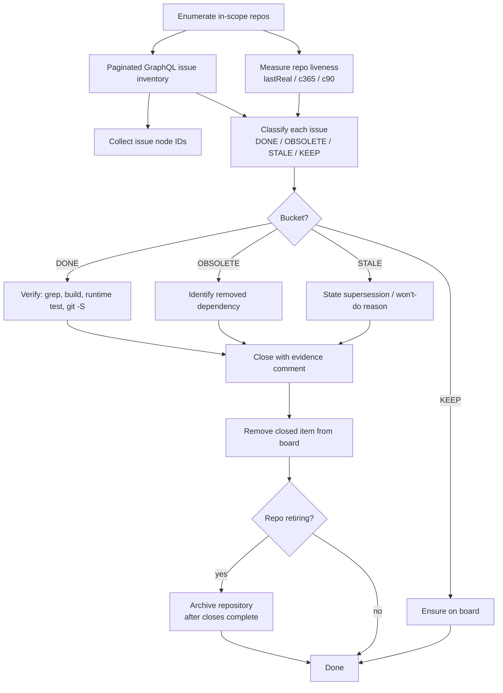

# Backlog Triage at Scale: Evidence-Based GitHub Issue Classification and Project Board Reconciliation

This article documents a method for triaging a large open-issue backlog across many repositories, and reports the result of applying that method to the `go-go-golems` GitHub organization. The method has two halves that must stay coupled: an evidence pipeline that decides what each issue *is* relative to the current code, and a board-reconciliation pipeline that keeps a GitHub Projects v2 board in sync with that decision. The goal is not to memorize a sequence of CLI commands. The goal is to understand why each step exists, where the failure modes are, and why closing an issue and removing it from a board are two different operations that GitHub treats differently.

> [!summary]
> - **Inventory before judgment.** A reliable triage starts with a complete, paginated GraphQL inventory of every open issue and every repository's liveness signal. Decisions made on a partial view are the most common source of wrong closes.
> - **Classify against code, not against time.** An issue's age is a weak signal. The strong signal is whether the feature it requests exists in the current codebase, verified by build, grep, and runtime test.
> - **Closing and board removal are separate.** `closeIssue` mutates the repository. `deleteProjectV2Item` mutates the project. Archiving a repository does neither to its board items. The three must be invoked in a deliberate order.
> - **Rate limits change the execution strategy.** GitHub's secondary rate limit punishes parallel comment-bearing mutations. A serial, paced, retry-aware executor is not an optimization; it is the only shape that completes.

The reference organization is `go-go-golems`. The reference project is [`go-go-golems/projects/1`](https://github.com/orgs/go-go-golems/projects/1), a Projects v2 board with the internal ID `PVT_kwDOB23p8s4ALtcX`. The working directory is `/home/manuel/code/wesen/go-go-golems`, which holds 116 checked-out repositories whose `origin` points at the `go-go-golems` organization.

## 1. The problem this method solves

A backlog with hundreds of open issues across dozens of repositories cannot be triaged by reading each issue and voting. Two failure modes dominate naive triage.

The first failure mode is closing issues that are already implemented. An issue titled "Add lua scripting" filed in 2023 may already be satisfied by a `pkg/lua/` package added a month later. Closing such an issue is correct, but only if the implementation is verified. Closing it on the basis of age alone is guessing, and guessing produces reopen churn and lost history.

The second failure mode is keeping issues that have no remaining referent. An issue that depends on a component which was later removed, renamed, or archived has no actionable target. Leaving it open pollutes the backlog and wastes every future reader's attention. The only way to detect this class reliably is to check whether the named component still exists in the code.

Both failure modes share a root cause: the triager is reasoning about the issue text in isolation instead of reasoning about the issue text against the current state of the code. The method in this article makes the code state the primary evidence and treats the issue text as a hypothesis to confirm or refute.

There is a third, mechanical problem that compounds the first two: the project board. A board is a separate object from the issues it references. Adding an issue to a board does not make the board the source of truth for the issue's state, and closing an issue does not remove it from any board it appears on. A triage that closes issues but never reconciles the board leaves the board pointing at closed issues, which defeats the board's purpose as a view of active work.

## 2. Scope and tooling

The triage operates on three GitHub objects and one local artifact.

| Object | Source | Used for |
|---|---|---|
| Issues | `repository.issues` via GraphQL | the inventory under judgment |
| Repositories | `gh repo view --json` and local `git` | liveness and feature evidence |
| Project v2 items | `projectV2.items` via GraphQL | the board to reconcile |
| Local working copies | `/home/manuel/code/wesen/go-go-golems/*` | build, grep, and runtime tests |

The tooling is deliberately narrow: the `gh` CLI for every GitHub mutation and most queries, raw GraphQL for paginated bulk reads, and ordinary `git`, `go build`, and `rg` for code evidence. No third-party triage tool is involved. The reason is that the GraphQL surface is small, well-documented, and scriptable, and every mutation it performs is auditable in the issue thread as a comment.

Authentication matters for two specific capabilities. Closing issues requires the `repo` scope. Mutating a Projects v2 board requires the `project` scope. A triage that can read everything but cannot write the board is only half a triage. Verify scopes up front:

```bash
gh auth status
# requires: 'repo', 'project', 'read:org'
```

The first concrete step is to enumerate the population under triage. The organization had 429 open issues distributed across 35 repositories. Of those, 398 issues across 32 repositories had working copies checked out locally. Three repositories with open issues (`vibes`, `go-go-labs`, `mastoid`) were not present in the working directory and were handled separately, because code-evidence verification requires a local checkout.

## 3. Step one: a complete issue inventory

A partial inventory is worse than none, because it produces confident decisions on incomplete data. The inventory must be complete in two senses: every open issue in every in-scope repository, and the full body of each issue, because the body frequently contains the implementation sketch that distinguishes a real feature request from a one-line wish.

GraphQL paginates issues with a cursor. The query that produced the inventory:

```graphql
query($owner:String!, $name:String!, $endCursor:String){
  repository(owner:$owner, name:$name){
    issues(first:100, states:[OPEN], after:$endCursor,
           orderBy:{field:CREATED_AT, direction:ASC}){
      pageInfo{ hasNextPage endCursor }
      nodes{
        number title
        author{ login }
        createdAt updatedAt
        comments{ totalCount }
        labels(first:20){ nodes{ name } }
        body
      }
    }
  }
}
```

Two details in this query are load-bearing. The `states:[OPEN]` filter restricts the result to the population under judgment, so the inventory size equals the triage size. The `orderBy:{field:CREATED_AT, direction:ASC}` makes the output deterministic, which matters when the triage is paused and resumed: a stable order lets the triager re-derive the same plan from the same input.

Pagination must loop until `hasNextPage` is false. A common bug is to run the query once, take the first 100 nodes, and stop. Repositories such as `glazed` (137 open issues) and `sqleton` (66) exceed a single page, so a non-paginating inventory silently drops their tail.

The `gh search issues` command is an acceptable alternative for a first-pass count, but it is not a substitute for the paginated query. Search results are ranked, not ordered by creation, and their JSON shape is coarser. Use search to confirm the scale, then use the paginated GraphQL query to build the working set:

```bash
gh search issues --owner go-go-golems --state open --limit 1000 \
  --json repository,number,title,url,labels,updatedAt,createdAt
```

The inventory is the foundation. Every later decision references an issue by repository and number, and every later mutation needs the issue's GraphQL node ID, which is why the inventory fetch should also record node IDs in a separate pass:

```graphql
query($owner:String!, $name:String!, $endCursor:String){
  repository(owner:$owner, name:$name){
    issues(first:100, states:[OPEN], after:$endCursor,
           orderBy:{field:CREATED_AT, direction:ASC}){
      pageInfo{ hasNextPage endCursor }
      nodes{ id number }
    }
  }
}
```

The node ID is the handle that `addProjectV2ItemById` consumes. Collecting it once, up front, into a `(repo, number) -> nodeID` map turns every later board operation into a lookup instead of a query.

## 4. Step two: measuring repository liveness

An issue's repository is not a passive container. A repo that has not received a real commit in two years is a different triage environment from a repo that received a commit this week. The same "add a flag" issue is a stale wishlist item in the first repo and an in-flight gap in the second. Liveness must be measured before issues are classified, and it must be measured in a way that ignores mechanical activity.

The `pushedAt` field from `gh repo view` is a poor liveness signal on its own. Several repositories in this organization share a `pushedAt` of `2026-05-29` that reflects a mechanical, org-wide bump rather than deliberate development. A liveness signal that counts that event as activity would classify dormant repos as active.

The signal that survives mechanical bumps is the date of the last real commit, where "real" excludes merge commits and known bots. The command:

```bash
git -C "$repo" log -1 --no-merges --format=%ci \
  --author="^(?!.*(\[bot\]|dependabot|github-actions|renovate)).*$" \
  --perl-regexp
```

returns the date of the most recent commit authored by a human. Pairing it with two count windows gives a three-part liveness vector for each repository:

```bash
lastreal   # date of last human-authored, non-merge commit
c365       # count of non-merge commits in the last 12 months
c90        # count of non-merge commits in the last 90 days
```

A repository with `lastreal` in 2024 and `c365=0` is dormant. A repository with `lastreal` this month and `c90` in the hundreds is active. The 90-day window catches repos that were active recently but have paused, which is a different decision from a repo that has been idle for years.

Liveness is not itself a close decision. A dormant repo's issues are not automatically closeable; they may describe real, still-missing features. Liveness is the context that changes the meaning of an old wishlist issue. The classification step uses liveness to weight the interpretation, not to replace it.

## 5. The triage taxonomy

Every open issue is assigned to exactly one of four buckets. The buckets are defined by the relationship between the issue's request and the current code, not by the issue's age or its author.

| Bucket | Definition | Action | Reversibility |
|---|---|---|---|
| **DONE** | The requested feature exists in the current codebase, verified | Close with evidence comment | Reopen if the evidence is wrong |
| **OBSOLETE** | The issue depends on a component that was removed, renamed, or archived | Close with reason | Reopen if the dependency is revived |
| **STALE** | Old wishlist with no remaining referent, low value, superseded, or not planned | Close with reason | Reopen or re-file if still wanted |
| **KEEP** | A real gap, a recent request, a bug, or an external contributor's open question | Leave open, ensure on board | n/a |

The buckets are mutually exclusive and exhaustive. Every issue lands in exactly one. The discipline of forcing every issue into one bucket is what makes the triage auditable later: a reviewer can ask "why was #N closed?" and the answer is one of four statements backed by a comment in the thread.

The most important distinction is between **DONE** and **STALE**. Both result in a close, but they require different evidence. DONE requires a positive proof: a file, a flag, a function, a passing test. STALE requires a negative argument: the feature was never built, was superseded by a different direction, or is not worth building. Confusing the two is the most expensive triage error, because a STALE close that should have been a DONE close leaves a real feature unclaimed, and a DONE close that should have been a STALE close asserts an implementation that does not exist.

The **KEEP** bucket is the rest. It contains three sub-cases that are worth distinguishing during classification: real feature gaps (the feature is genuinely missing and wanted), recent work (the issue was filed in the last few months and is in flight), and bugs (the issue reports incorrect behavior rather than requesting a feature). External contributors' issues default to KEEP unless they are clearly duplicates, because a close on a contributor's issue is a social signal as well as a technical one.

## 6. Step three: code-evidence verification

Classification is only as good as the evidence behind it. The evidence pipeline has four layers, each stronger than the last, and a DONE classification should be supported by at least two of them.

The first layer is a structural grep. For a feature request, search the codebase for the feature's name and its expected symbols:

```bash
rg -l "lua|gopherlua" pkg/ cmd/          # feature exists somewhere
rg -n "TypeSecret" pkg/cmds/fields/      # a specific type is defined
```

A grep hit is necessary but not sufficient. A feature mentioned in a doc file or a test fixture is not the same as a feature implemented in production code. Filter out test files and generated assets when reading grep output:

```bash
rg -l "pattern" pkg/ | grep -v _test.go | grep -v web/embed
```

The second layer is a build. A repository that does not compile cannot have a working feature, and a build also produces the binary that the third layer needs:

```bash
( cd glazed && go build -o /tmp/glaze ./cmd/glaze )
```

A successful build is evidence that the claimed feature's package is at least integrated. A failed build is evidence that the feature is not in a runnable state, which pushes a DONE claim toward STALE or KEEP.

The third layer is a runtime test. The strongest evidence that a feature works is invoking it. For a claimed flag, pass it and observe the result:

```bash
echo '[{"MyField":1}]' | /tmp/glaze json --input-is-array /dev/stdin
# header renders as MyField, not MYFIELD -> case-respecting bug is fixed
```

For a claimed output format, produce output in that format. For a claimed middleware, exercise it on representative input. A runtime test converts a grep hit from "the string appears in the code" to "the behavior appears in the program."

The fourth layer is timing, via `git log -S`:

```bash
git log -1 --format="%ci %h %s" -S "long-help" -- pkg/help/cmd/cobra.go
# 2025-07-10 6d8a43e :tractor: Clean up help UI system
```

The `-S` pickaxe finds the commit that introduced a specific string. It answers "when did this land," which distinguishes a feature added last week from a feature added three years ago. An issue filed in 2022 about a feature that landed in 2025 is almost certainly DONE; an issue filed in 2022 about a feature that has never landed is a STALE candidate.

The verification produces, for each DONE issue, a one-sentence evidence note: the file, the symbol, the test result, or the commit. That note becomes the body of the close comment. The comment is the audit trail. A future reader who disagrees with the close can read the note, re-run the verification, and either confirm or reopen with specifics.

## 7. Step four: closing with provenance comments

Every close carries a comment. The comment is not courtesy; it is the mechanism that makes the triage reversible and reviewable. A bare close with no explanation forces every future reader to re-derive the reasoning, and a close that turns out to be wrong cannot be distinguished from a close that was right at the time.

The comment carries three pieces of information: the bucket, the evidence, and an explicit invitation to reopen. A DONE comment names the feature and its location:

```text
Closing as part of backlog triage: this is already implemented in the
current codebase. Evidence: lua VM scripting present in pkg/lua/
(lua.go, cmds.go). If this regressed, please reopen with specifics.
```

An OBSOLETE comment names the dependency that disappeared:

```text
Closing as part of backlog triage: obsolete — depends on cliopatra,
which is now archived. Reopen if the dependency is revived.
```

A STALE comment names what superseded the wish or why it is not planned:

```text
Closing as part of backlog triage: stale wishlist item from 2022-2023,
low priority / superseded — sprig templating covers the requested
funcmap registration. Reopen or re-file a focused issue if still wanted.
```

The "reopen" clause is deliberate. It tells the reader that the close is a judgment, not a deletion, and it lowers the cost of disagreement. A triage that closes without that clause reads as final; a triage that closes with it reads as a decision open to review.

The mutation under `gh issue close --comment` is two GraphQL operations in one: `addComment` followed by `closeIssue`. Both run against the repository. This matters for the failure modes in section 11, because the two operations have independent failure conditions.

## 8. Step five: project board reconciliation

The board is a separate object. Its items reference issues, but the board's item set is not derived from the issues' states. Three operations are needed, and they are not interchangeable.

Adding an issue to the board uses `addProjectV2ItemById`, which takes the project's node ID and the issue's node ID:

```graphql
mutation {
  add: addProjectV2ItemById(input:{
    projectId:"PVT_kwDOB23p8s4ALtcX",
    contentId:"I_kwDO..."     # the issue's node ID
  }) { item { id } }
}
```

Removing an item from the board uses `deleteProjectV2Item`, which takes the project's node ID and the *item's* node ID — not the issue's:

```graphql
mutation {
  del: deleteProjectV2Item(input:{
    projectId:"PVT_kwDOB23p8s4ALtcX",
    itemId:"PVTI_..."          # the board item's ID, distinct from the issue ID
  }) { deletedItemId }
}
```

The distinction between the issue node ID and the item node ID is a frequent source of errors. The issue has one node ID across all of GitHub. Each board that references the issue gives it a *separate* item ID scoped to that board. To remove an issue from a board, you must first query the board's items, match the item to the issue by repository and number, and use that item's ID in the deletion. There is no "remove this issue from all boards" mutation.

Bulk operations batch many mutations into one GraphQL document with aliases. Adding 373 issues in chunks of 25 uses one mutation per chunk:

```graphql
mutation {
  i0: addProjectV2ItemById(input:{projectId:"PVT_...", contentId:"I_..."}) { item { id } }
  i1: addProjectV2ItemById(input:{projectId:"PVT_...", contentId:"I_..."}) { item { id } }
  ...
  i24: addProjectV2ItemById(input:{projectId:"PVT_...", contentId:"I_..."}) { item { id } }
}
```

Aliased mutations run as one request, which is how a 373-item add completes in fifteen requests instead of 373. The same pattern applies to `deleteProjectV2Item`. A batch that fails partially returns `null` for the failing aliases, so the executor must map failed aliases back to their issues and retry them individually.

The reconciliation order matters. The method adds KEEP and untriaged issues to the board, then removes closed issues from the board after the closes complete. Adding first and removing later is safe because an add is idempotent in effect (GitHub returns the existing item if the issue is already on the board) and a remove only succeeds for items that exist. The dangerous order is the reverse: removing before the close is recorded can leave the board and the issue in inconsistent states if the close later fails.

## 9. The archival-before-close ordering constraint

Archiving a repository is a third mutation, distinct from closing issues and from board operations, and it introduces a hard ordering constraint that the rest of the method must respect.

GitHub makes an archived repository read-only for issue mutations. Both `addComment` and `closeIssue` fail on an archived repository with:

```text
GraphQL: Repository was archived so is read-only (closeIssue)
GraphQL: Repository was archived so is read-only and unable to create
comment because issue is locked (addComment)
```

The consequence is that an issue in a repository about to be archived must be closed *before* the archive. Once the repository is archived, the issue is frozen in whatever state it was in. An issue left open in a repository that is then archived becomes a permanently locked-open issue that no amount of later triage can close without first un-archiving the repository.

The correct sequence for retiring a repository is therefore:

```text
1. close each open issue (with comment)        # while repo is writable
2. remove each issue's board item              # board is always writable
3. archive the repository                      # now safe; no writable state is lost
```

Archiving does not remove the repository's issues from any board. This was verified directly: after archiving `cliopatra`, its nine board items remained on the board, now showing `state: CLOSED`. The board reconciliation in step 2 is therefore not optional. Skipping it leaves the board pointing at issues from a retired repository, which is exactly the pollution the board is meant to avoid.

The constraint also implies a discovery step. Before archiving, the triager must enumerate repositories that are *already* archived, because their open issues are unreachable by the normal close path. In this organization, five repositories (`plunger`, `biberon`, `bucheron`, `ecrivain`, `mastoid`) had been archived before the triage began, and they held 20 open issues between them. Those 20 issues could not be closed by any command while their repositories remained archived. They are the one class of issue this method cannot fully resolve without the destructive action of un-archiving.

## 10. The pipeline as a whole

The steps compose into a single pipeline. Each stage's output is the next stage's input, and no stage can be skipped without degrading the result.



The diagram shows why the inventory and liveness stages feed the classification stage, why classification drives both the close and the board mutation, and why archival is a terminal step that must come last. A triage that runs the stages out of order — for example, archiving before closing, or removing board items before recording the close — produces states that are expensive to recover from.

## 11. Rate limiting: the failure and the fix

GitHub enforces two rate limits. The primary limit is a token budget consumed per request, which the `gh` CLI handles. The secondary limit is a behavioral limit that throttles mutations submitted too quickly, and it is the one that disrupts bulk triage.

The secondary limit surfaces as:

```text
GraphQL: was submitted too quickly (addComment)
```

It is not a token-budget error and it is not reported in the rate-limit headers. It appears when many comment-bearing mutations land in a short window. The first execution of the close stage ran 121 closes with eight concurrent workers. Eighty succeeded; forty-one failed with the secondary limit. The failures were not partial closes — `closeIssue` and `addComment` are separate operations, and when `addComment` is throttled the whole `gh issue close --comment` invocation fails, leaving the issue open.

The fix has three parts, and all three are necessary.

The first part is serialization. Parallel mutation is the trigger, so the executor must run closes one at a time. Concurrency is the wrong trade-off here: the wall-clock savings are small relative to the retry cost.

The second part is pacing. A fixed delay between mutations gives the secondary limit room to reset. A delay of 1.1 seconds was sufficient in practice; the exact value is not critical, but it must be above zero.

The third part is retry with exponential backoff. Even a paced serial executor will occasionally hit the secondary limit. The executor must detect the throttle, wait, and retry:

```python
def close_one(repo, num, body):
    for attempt in range(4):
        out = run(["gh","issue","close",str(num),"--repo",repo,"--comment",body])
        if out.ok: return True
        if "submitted too quickly" in out.err:
            time.sleep(5 * (attempt + 1))   # 5s, 10s, 15s, 20s
            continue
        return out.err                      # a real error, do not retry blindly
    return "rate-limited after retries"
```

The backoff is exponential in attempt count, not in elapsed time, which keeps the total wait bounded. With this executor, the second close run — 149 issues across three repositories — completed with zero failures. The pacing and retry are not optimizations. They are the difference between a triage that completes and one that stalls halfway.

A note on which mutation to pace: `deleteProjectV2Item` and `addProjectV2ItemById` are far more tolerant of batching than `addComment`. The board mutations ran in batches of 15–25 with no throttle. The throttle is specific to comment-bearing mutations, so the executor can keep batching board operations while serializing closes.

## 12. Worked results: the go-go-golems triage

Applying the method to the `go-go-golems` organization produced the following results, which serve as the project report for this triage.

The starting state was a Projects v2 board holding 4 items, against 429 open issues across the organization. The ending state was a board holding 97 items, all of them open, against 117 open issues remaining in the in-scope repositories.

| Repo | Open at start | Closed (DONE) | Closed (OBSOLETE) | Closed (STALE) | Closed (other) | Kept open |
|---|---|---|---|---|---|---|
| glazed | 137 | 41 | 7 | 73 | 2 (irrelevant) | 14 |
| sqleton | 66 | 19 | 3 | 41 | 0 | 3 |
| geppetto | 50 | 16 | 4 | 26 | 0 | 4 |
| parka | 40 | 10 | 4 | 26 | 0 | 0 |
| cliopatra | 9 | — | — | — | 9 (archived) | 0 |
| vibes | 29 | — | — | — | 29 (archived) | 0 |
| go-go-labs | 1 | — | — | — | 1 (archived) | 0 |
| corporate-headquarters | 1 | — | — | — | 1 (archived) | 0 |

The "Closed (other)" column holds issues closed outside the four-bucket taxonomy: two `glazed` issues closed as non-actionable junk at the start, and the issues closed as part of repository archival. The total across the session was 312 issues closed, each with an explanatory comment.

The board moved through four states:

```text
4  (start)
   +373 added          -> 377  (active/valid issues from non-archived repos)
   -9  cliopatra       -> 368  (archived; items removed)
   -1  corporate-hq    -> 367  (archived; item removed)
   -121 glazed         -> 246  (triaged closes)
   -149 sqleton+geppetto+parka -> 97  (triaged closes)
```

Four repositories were archived during the triage: `cliopatra`, `vibes`, `go-go-labs`, and `corporate-headquarters`. Each followed the close-before-archive sequence. `mastoid` was already archived at the start and could not be touched; its single open issue remains locked-open.

One repository, `corporate-headquarters`, carried a live security issue that the triage surfaced but did not fix. A Google Gemini API key was committed in a tracked `.envrc` on the default branch:

```bash
$ gh api repos/go-go-golems/corporate-headquarters/contents/.envrc --jq '.content' \
  | base64 -d | grep -o "AIzaSy[A-Za-z0-9_-]*"
AIzaSyCzfseD...
```

The triage closed the reporting issue with a comment that explicitly states the key is still exposed and must be rotated, because closing the issue does not revoke the key. The remediation — rotating the key and removing it from the repository — is outside the triage's scope, and the comment preserves the warning in the issue thread before the repository was archived and the thread became read-only.

The 97 items remaining on the board break down as follows. The four triaged repositories contribute 21 items (glazed 14, sqleton 3, geppetto 4, parka 0). The remaining 76 items are untriaged open issues from repositories that were not in this pass, dominated by `oak` (18), `go-go-goja` (11), `docmgr` (10), and `prompto` (9). These are the candidates for the next triage pass.

## 13. Common failure modes

### Failure mode: closing on age alone

An issue filed in 2022 is not automatically stale. Several `glazed` issues from 2022–2023 described features that were implemented months later and remained open simply because nobody closed them. Closing them as STALE without checking the code would have produced 41 wrong closes in this triage. The fix is the verification layer: a STALE close that cannot state a supersession or won't-do reason is not a STALE close, it is an unverified close.

### Failure mode: trusting `pushedAt` as liveness

The `pushedAt` timestamp reflects any push, including mechanical bumps. Several repositories shared a `pushedAt` of `2026-05-29` from an org-wide operation while their last human commit was in 2024. Classifying them as active on `pushedAt` alone would have left dormant backlogs untouched. The fix is the `lastReal` signal from `git log --no-merges --author=<non-bot regex>`.

### Failure mode: archiving before closing

Archiving a repository freezes its issues open. The 20 locked-open issues in the pre-archived repositories (`plunger`, `biberon`, `bucheron`, `ecrivain`, `mastoid`) are the result of someone archiving without closing first. They cannot be closed now without un-archiving. The fix is the close-before-archive sequence in section 9.

### Failure mode: skipping board reconciliation

Closing an issue does not remove it from any board. A triage that closes 312 issues and never reconciles the board leaves the board displaying 312 closed items, which is worse than no board because it implies the closed work is still active. The fix is the `deleteProjectV2Item` pass after every close batch.

### Failure mode: parallel closes with comments

Running `gh issue close --comment` with eight workers triggers the secondary rate limit on roughly one third of the batch. The failures leave issues open, so the batch is not partially complete — it is incomplete, and the incomplete set is not obvious without counting. The fix is the serial, paced, retry-aware executor in section 11.

### Failure mode: confusing issue node ID and item node ID

`addProjectV2ItemById` takes the issue's node ID. `deleteProjectV2Item` takes the board item's node ID. They are different strings from different queries. Passing the issue node ID to the deletion mutation fails with a type error. The fix is the two-pass pattern: one query to collect issue node IDs for adds, one query over board items to collect item node IDs for removes.

### Failure mode: closing an external contributor's issue as stale

An external user's issue is a social signal as well as a technical one. Closing `geppetto#132` (a user asking about local LLM support) as STALE would have been wrong twice: the feature was actually implemented (ollama settings exist in `pkg/steps/ai/settings/ollama/`), and the user deserved a response rather than a silent close. The fix is to default external-contributor issues to KEEP unless they are clear duplicates, and to verify them like any other issue before closing.

## 14. Working rules

The rules that survive the worked example:

- **Inventory completely before classifying.** A paginated GraphQL read of every open issue and its body is the foundation. Partial inventories produce confident wrong decisions.
- **Measure liveness with `lastReal`, not `pushedAt`.** Exclude merges and bots. A mechanical bump is not development.
- **Classify against code, not against time.** A DONE close requires a positive proof from the codebase. A STALE close requires a named supersession or won't-do reason. Age is context, not evidence.
- **Verify DONE with at least two layers.** Grep plus build, or grep plus runtime test, or grep plus `git log -S`. One layer is a hypothesis; two layers is a claim.
- **Close with a comment that names the bucket, the evidence, and the reopen invitation.** The comment is the audit trail and the reversal mechanism.
- **Reconcile the board after every close batch.** Use `deleteProjectV2Item` with the item node ID, not the issue node ID.
- **Close before archive, always.** Archiving freezes issues open. The close-before-archive sequence is not optional.
- **Serialize comment-bearing mutations.** Pace them and retry on the secondary rate limit. Batch the board mutations, which tolerate concurrency.
- **Default external-contributor issues to KEEP.** Verify them; do not silently close them.
- **Record the security exceptions.** A close does not remediate a leak. State that explicitly in the comment so the warning survives the close.

## 15. Why this approach is worth the discipline

The method is slower than reading issues and voting. It is also slower than closing everything old and calling it cleanup. The discipline buys three things that the fast approaches cannot provide.

First, it produces closes that are defensible. Every close has a comment that names the evidence. A reviewer who disagrees can re-run the verification in under a minute, because the comment points at the file, the symbol, or the commit. A triage without that property is a pile of assertions.

Second, it separates the three mutations that naive triage conflates: the issue close, the board removal, and the repository archive. Each has its own failure conditions and its own correct order. Treating them as one operation is what produces locked-open issues, boards full of closed items, and archived repos with frozen state.

Third, it makes the board a reliable view of active work. A board that contains only open, untriaged-or-kept issues is a board a maintainer can scan to decide what to do next. A board that contains closed issues, archived-repo issues, and unclassified junk is a board that no one scans, which is the failure mode the board was created to prevent.

The cost is the verification work. In this triage, verifying 312 closes required building four binaries, running a few hundred greps, and a handful of runtime tests. That work is not reusable across organizations, but the method is. The next backlog, in this organization or another, runs the same pipeline with different inputs.

## 16. Commands and queries reference

The executable core of the method, collected for reuse.

Inventory (paginated, per repository):

```bash
gh api graphql -f query=@issues.gql -f owner=ORG -f name=REPO [-f endCursor=CUR]
```

Liveness (per repository):

```bash
git -C "$repo" log -1 --no-merges --format=%ci \
  --author="^(?!.*(\[bot\]|dependabot|github-actions|renovate)).*$" --perl-regexp
git -C "$repo" log --since="12 months ago" --no-merges --oneline | wc -l
git -C "$repo" log --since="90 days ago" --no-merges --oneline | wc -l
```

Code evidence:

```bash
( cd "$repo" && go build -o /tmp/"$repo" ./cmd/"$repo" )
rg -l "FEATURE" pkg/ cmd/ | grep -v _test.go
git log -1 --format="%ci %h %s" -S "SYMBOL" -- path/to/file.go
```

Close with comment:

```bash
gh issue close NUMBER --repo ORG/REPO --comment "Closing: DONE — evidence..."
```

Add to board (single):

```graphql
mutation { add: addProjectV2ItemById(input:{
  projectId:"PVT_...", contentId:"I_..." }) { item { id } } }
```

Remove from board (single):

```graphql
mutation { del: deleteProjectV2Item(input:{
  projectId:"PVT_...", itemId:"PVTI_..." }) { deletedItemId } }
```

Archive repository:

```bash
gh api -X PATCH repos/ORG/REPO -f archived=true
```

The batched, aliased forms of the board mutations scale these to hundreds of items per request, and the serial paced executor scales the closes past the secondary rate limit. Everything else in the method is judgment applied to the output of these commands.

## 17. Open questions and next steps

The triage is not complete. Three classes of work remain.

The 20 locked-open issues in pre-archived repositories are the first. Closing them requires un-archiving each repository briefly, running the close, and re-archiving — a destructive sequence that should be authorized explicitly per repository rather than batched.

The 76 untriaged board items are the second. The next pass applies the same method to `oak`, `go-go-goja`, `docmgr`, `prompto`, and the single-issue repositories. The pipeline does not change; only the inputs do.

The `corporate-headquarters` security leak is the third. The key rotation and history cleanup are outside the triage scope, but the warning is now preserved in the closed issue's thread. The remediation should be tracked separately and should not wait for the next triage pass.

## Related notes

- [[KB-PLAYBOOK-TRIAL - Intern Reports for 6 Projects]] — pattern for extracting reusable knowledge from project work
- [[ARTICLE - Glazed Chain - From Cobra Flags to Typed Values]] — the parser architecture that several KEEP issues in `glazed` depend on
