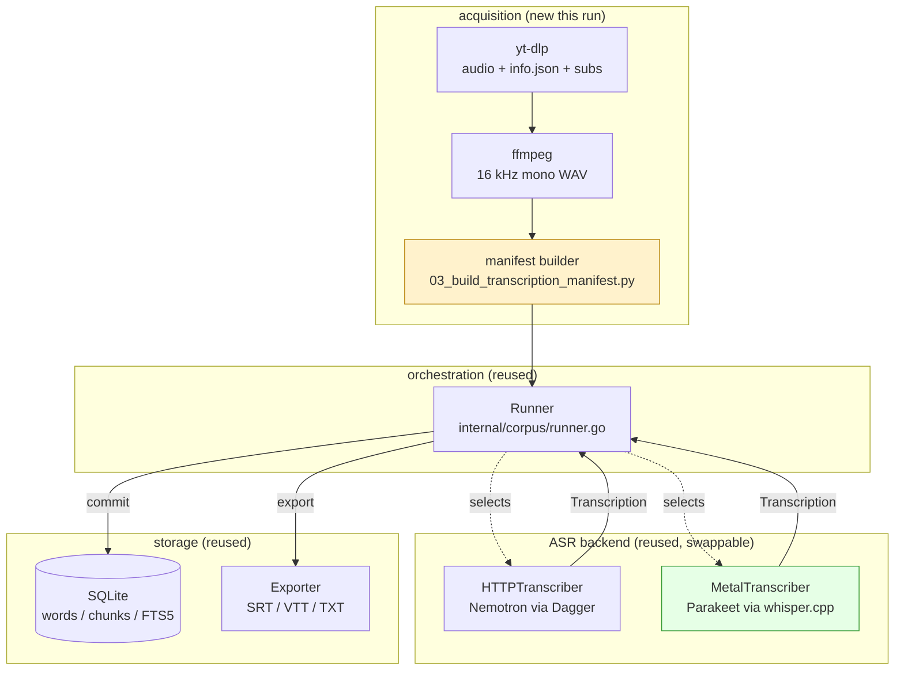

# McLarty CS410 Category Theory Corpus

A transcription pipeline's value is not in any single model but in the interface that separates speech recognition from storage. This report documents the construction of a 35-video, 220,168-word searchable corpus from three Colin McLarty and Conor McBride YouTube sources, using a pipeline whose storage, search, export, and resume code was written for a different corpus three weeks earlier and was not modified for this run. The only new code is a small acquisition layer in the `claw-stuff` repository: four shell scripts, a manifest builder, and a one-off position migration. The Go pipeline itself — the runner, the SQLite store, the FTS5 index, the Metal transcriber adapter — was inherited verbatim.

The run exercises one property of that pipeline at every stage: the manifest is the contract between acquisition and transcription, the `Transcriber` interface is the contract between transcription and storage, and the pipeline fingerprint is the contract between a revision and the model that produced it. When each of those contracts holds, a new corpus is a matter of producing a new manifest and pointing the existing binary at it. When one of them is violated — a manifest position that is not stable, a filename stem that is not parsed the way the extractor parses it, a second process that writes to a database the runner believes it owns — the failure is silent until a uniqueness constraint fires. Most of the engineering in this run was the discovery and repair of those contract violations.

> [!summary]
> - 35 videos across three sources — a 12-video McLarty category theory playlist, a 21-video CS410 2017 playlist, and two McLarty singles — were downloaded as audio, normalized to 16 kHz mono WAV, and transcribed into a single SQLite corpus database with FTS5 search and SRT/VTT/TXT exports.
> - The corpus totals 220,168 words across 17,811 chunks and roughly 31 hours of audio; `PRAGMA integrity_check` and `foreign_key_check` pass, and 35 of 35 videos are in `complete` state with no failures.
> - Transcription used NVIDIA Parakeet TDT 0.6B v3 on an M1 Max Metal GPU via the `transcribe-metal` binary, achieving on the order of 85–100x realtime; a 48-minute lecture transcribed in about 33 seconds.
> - The storage, search, export, and resume code in `internal/corpus` (2,241 lines) and `internal/metal` (342 lines) was reused unchanged from the Southwell corpus project. New code lives entirely in `scripts/2026/08/16/mclarty-cs410-corpus-download/` in the `claw-stuff` repo.
> - Four contract violations were found and repaired during the run: an unstable manifest position, a filename-stem mismatch between the extractor and the manifest builder, concurrent-write contention on the SQLite database, and a `set -e` policy that made the download chain hostile to its own resumability.

## 1. The corpus: three sources, one database

The three sources are thematically adjacent. Two are by Colin McLarty, a philosopher of mathematics who writes and lectures on category theory and on Alexander Grothendieck. The third is a 2017 undergraduate course by Conor McBride that develops category-theoretic ideas through dependently typed programming. Together they cover the same objects — functors, monads, natural transformations, adjunctions, topoi — from a mathematical lecture register and a programming lecture register.

| Source | YouTube ID | Videos | Words | Audio |
|---|---|---|---|---|
| McLarty, *An Introduction to Category Theory* | playlist `PLXfbw8dYLNY1Lz_IrhjtUt1W8_KNYd-MQ` | 12 | 78,875 | 11h 02m |
| McBride, *CS410 2017 (Programs and Proofs)* | playlist `PLXfbw8dYLNY2Bl2Fku29OxU1n7kTlmhuu` | 21 | 118,341 | 17h 47m |
| McLarty singles | `5AR55ZsHmKI`, `TAyjN_9flCI` | 2 | 22,952 | 2h 29m |
| **Total** | | **35** | **220,168** | **~31h 17m** |

A fourth URL in the original request — `watch?v=wqCC7tvmQjQ&list=…NYd-MQ` — is the first video of the McLarty playlist. It is not a separate source. Treating it as one would double-count position 101.

The two singles are *Grothendieck's 1973 topos lectures* (91 minutes) and *The rising sea: Grothendieck on simplicity and generality* (57 minutes). They are long enough to exercise the pipeline's long-audio path: the longer of the two exceeds the single-chunk Metal memory limit and is split into two chunks before transcription.

## 2. The pipeline that was reused

The corpus pipeline was built for the Southwell project and is documented in `[[PROJ - Southwell Category Theory Corpus - Video Playlist Transcription Pipeline]]`. It lives in the `transcription-go` repository on branch `feature/video-pipeline-corpus`, with a Linux worktree at `/home/manuel/worktrees/2026-07-28--transcription-go-video-pipeline` and a Mac clone at `~/code/wesen/2026-04-13--transcription-go`. The architecture has four layers, and the boundary between the middle two is the one this run depends on.



The adapter point is a Go interface:

```go
type Transcriber interface {
    Transcribe(ctx context.Context, audioPath string, opts TranscribeOptions) (Transcription, error)
}
```

Two implementations exist. `HTTPTranscriber` sends audio chunks to a Dagger-hosted Nemotron service. `MetalTranscriber` shells out to `parakeet-cli` as a subprocess, writes JSON word output to a temp file, and parses it into the same `Transcription` struct. The runner does not know which backend it is using. This is the property that lets a new corpus run on a single Mac node with no service and no container: the Metal backend is a local binary, and the storage layer is unchanged.

The reused code inventory:

| Component | Path | Role |
|---|---|---|
| Corpus package | `internal/corpus/` (2,241 lines) | Manifest loading, SQLite store, FTS5, resume, export |
| Metal transcriber | `internal/metal/transcriber.go` (342 lines) | Parakeet/whisper-cli subprocess adapter |
| Runner | `internal/corpus/runner.go` | Plans work, calls the interface, commits, exports |
| Store | `internal/corpus/store.go` | 12-table schema, revisions, attempts, FTS5 |
| Fingerprint | `internal/corpus/fingerprint.go` | SHA-256 of model + params; isolates revisions by backend |
| Binary | `transcribe-metal` | Prebuilt CLI with `--metal-*` flags |

One detail about the Mac clone deserves to be recorded because it shaped a decision later in the run. The Mac's checked-out `feature/video-pipeline-corpus` branch is behind `origin`. Its working tree has no `internal/metal/` directory and its `cmd/transcribe/corpus.go` has no metal flag code. A separate prebuilt binary, `transcribe-metal`, dated 2026-07-29, carries the metal flags and works. This run used `transcribe-metal` directly rather than rebuilding, because the proven binary was sufficient and rebuilding would have required syncing the Mac's branch to origin first. The interface boundary held despite the branch divergence: the binary and the database agree on the manifest schema, so the branch's source state does not affect the run.

## 3. The manifest contract and position stability

The manifest is the single input the runner consumes. Its schema is `transcription-video-corpus/v1`:

```json
{
  "schema": "transcription-video-corpus/v1",
  "corpus": { "id": "mclarty-cs410-category-theory", "title": "...", "source_url": "..." },
  "items": [
    {
      "source_id": "wqCC7tvmQjQ",
      "position": 101,
      "title": "An introduction to Category Theory – Lecture 1, Part 1 – Colin McLarty",
      "source_url": "https://www.youtube.com/watch?v=wqCC7tvmQjQ",
      "audio_path": "/Users/manuel/Movies/.../audio/...wav",
      "duration_seconds": 2904.3,
      "availability": "available"
    }
  ]
}
```

Validation enforces three invariants that matter for this run. Each `source_id` must be unique. Each `position` must be unique. An `available` item must have an `audio_path` that exists on disk. The first two are enforced by a `UNIQUE` constraint in the database as well: `videos.corpus_id, videos.playlist_position`. A manifest that satisfies validation but whose positions disagree with rows already in the database will fail at import with `UNIQUE constraint failed: videos.corpus_id, videos.playlist_position`.

This is where the first contract violation appeared. The initial manifest builder assigned positions with a per-directory counter over the sorted list of `*.info.json` files:

```python
for j, info_path in enumerate(sorted(sdir.glob("*.info.json")), 1):
    position = base + j
```

Sorted-file order is stable only while the set of files is stable. It is not stable across re-downloads that add previously-missing files. Two CS410 videos were rate-limited on the first download pass and absent from the directory. The builder assigned the remaining 19 videos contiguous positions 201 through 219. When the two missing videos were later downloaded and a new manifest was built, sort order placed them between the existing files, shifting every later file's index by one. The new positions collided with the 19 rows already in the database, and import failed.

The fix is to derive position from a property of the source that does not change when the set of files changes. yt-dlp bakes the playlist index into the filename through the `%(playlist_index)03d` output template, producing names like `006 - CS410 2017 Lecture 6 ….m4a`. That leading number is immutable for a given video. The builder now reads it from the filename:

```python
m = re.match(r"(\d+)\s*-", media_name)
position = base + int(m.group(1)) if m else base + counter
```

The fallback to a counter is retained for files with no leading number, such as the two singles, which yt-dlp named without a playlist index because they were downloaded individually with `--no-playlist`.

Because 19 rows were already committed at the old, contiguous positions, the database had to be migrated to the new, stable scheme without losing the committed revisions. A two-phase update avoids the uniqueness constraint: every row is first shifted to a temporary range far above the live range, then moved to its final stable position.

```python
# phase 1: shift to +10000 to vacate the live range
for vid, sid, pos in rows:
    cur.execute("UPDATE videos SET playlist_position=? WHERE id=?", (pos + 10000, vid))
con.commit()
# phase 2: move to final stable positions
for vid, sid, pos in rows:
    cur.execute("UPDATE videos SET playlist_position=? WHERE id=?", (200 + lead[sid], vid))
```

After the migration, the 19 existing videos occupied 201–221 with gaps at 206 and 208, the two newly downloaded videos slotted into those gaps, and import succeeded. The committed revisions were preserved because the migration touched only `playlist_position`, never `active_revision_id`.

The general rule, which the Southwell project stated but this run forced into practice: **a manifest position is a primary key. It must be derived from an immutable property of the source, never from filesystem sort order.**

## 4. The Mac as the sole node

The Southwell run split work across a Linux server with an RTX 3060 and a Mac M1 Max. This run used only the Mac. The Mac is the faster node for this model by a wide margin — the Southwell benchmarks measured 98x realtime on the Mac against 4.8x on the Linux CPU — and the Linux host had only 117 GB free on a filesystem that was 94 percent full. Downloading and transcribing on one machine also eliminated the rsync step and the manifest workaround the Southwell project used to keep the two nodes from re-transcribing each other's work.

The Mac (`mimimi`) is reached over Tailscale. It had the Parakeet model (`ggml-parakeet-tdt-0.6b-v3-f16.bin`, 1.2 GB), the `parakeet-cli` binary, the `transcription-go` clone, and 350 GB free. It did not have the acquisition toolchain. `yt-dlp`, `ffmpeg`, and `tmux` were installed through Homebrew at the start of the run. Homebrew lives at `/opt/homebrew/bin`, which a non-login shell does not put on `PATH`. The `config.sh` sourced by every script prepends it:

```bash
[[ -d /opt/homebrew/bin ]] && export PATH="/opt/homebrew/bin:/opt/homebrew/sbin:$PATH"
```

This matters because the pipeline runs inside `tmux`, and `tmux` does not start a login shell. A script that relies on `.zprofile` to export the Homebrew path will find `tmux: command not found` when `start_tmux.sh` itself tries to invoke `tmux`. Putting the path in `config.sh` makes the pipeline self-contained regardless of how the shell was started.

Two defenses against the Mac sleeping are required for unattended runs. `caffeinate -dimsu` prevents display sleep, idle sleep, disk sleep, and system sleep while the command runs. `tmux` keeps the work alive across SSH disconnections. The Southwell diary records that `nohup` does not survive macOS sleep: background processes die when the network stack suspends, leaving the database with a video stuck in `transcribing`. The combination used here — `tmux new-session -d` wrapping `caffeinate -dimsu` wrapping the runner — keeps the process attached to a session that the kernel does not consider disposable.

## 5. Acquisition: the download archive and rate-limiting

The download stage fetches audio only. Audio-only download keeps the on-disk footprint near 1.3 GB for the full corpus instead of the roughly 80 GB that progressive MP4 would require, and it is all the ASR pipeline needs. The script is a per-source loop over a `sources.txt` file of `dir|url` pairs:

```bash
while IFS='|' read -r dir url; do
  [[ -z "$dir" || "$dir" =~ ^[[:space:]]*# ]] && continue
  out="$CORPUS_ROOT/$dir"
  yt-dlp "${playlist_flags[@]}" \
    --download-archive "$out/download-archive.txt" \
    --retries 10 --fragment-retries 10 \
    --write-info-json --write-auto-subs --sub-langs "en,en.*" --sub-format vtt \
    --embed-metadata -f "bestaudio/best" \
    -o "$out/$template" "$url" || { echo "WARN: failures for $dir; resumable"; }
done < "$SOURCES_FILE"
```

The `--download-archive` file is the resumability mechanism. yt-dlp appends a video's ID to the archive when its download completes successfully. On re-run, any video already in the archive is skipped, so a partially completed download is recovered by running the same command again. This is what makes the rate-limiting discussed below recoverable rather than fatal.

YouTube applies transient request limits that manifest as `HTTP Error 403: Forbidden` on the media stream and `HTTP Error 429: Too Many Requests` on subtitles. Two facts about these limits shaped the run. First, they are not deterministic. A URL that returns 403 on one attempt succeeds minutes later; a video that fails inside a playlist succeeds when downloaded individually. The Linux host downloaded the same URL that the Mac had refused, and the Mac succeeded after a pause. Second, authenticated requests fail where unauthenticated requests succeed. Passing `--cookies-from-browser firefox` extracted 206 cookies and produced a 403 on the media stream; the same URL with no cookies downloaded cleanly. The pipeline therefore uses no cookies and relies on the archive and retry to absorb transient limits. A browser session that is logged in receives stricter bot detection than an anonymous one for this class of request.

The format selection `-f "bestaudio/best"` does not produce a single extension. YouTube serves the best audio as either `webm` (format 251, Opus) or `m4a` (format 140, AAC), and the choice varies per video. The CS410 playlist split roughly evenly: some videos arrived as `.webm`, others as `.m4a`. The extractor must accept both, which it does by looping over all candidate extensions. A file count that assumes one extension will undercount.

## 6. Normalization: the 16 kHz mono WAV contract

Both ASR backends consume 16 kHz mono PCM WAV. The extraction stage normalizes every downloaded audio file to that contract with ffmpeg, matching the Southwell `03_extract_audio.sh` behavior:

```bash
for f in "$out"/*.m4a "$out"/*.webm "$out"/*.mp4 "$out"/*.opus "$out"/*.mp3; do
  [[ -e "$f" ]] || continue
  stem="$(basename "$f")"; stem="${stem%.*}"
  [[ "$stem" =~ \.f[0-9]+$ ]] && continue   # skip yt-dlp adaptive intermediates
  wav="$audiodir/$stem.wav"
  if [[ -e "$wav" && "$wav" -nt "$f" ]]; then echo "skip exists: $wav"; continue; fi
  if ffmpeg -hide_banner -loglevel warning -y -i "$f" -vn -ar 16000 -ac 1 -c:a pcm_s16le "$wav"; then
    echo "ok: $wav"
  else
    echo "WARN: ffmpeg failed for $f" >&2
  fi
done
```

Two details in this loop are load-bearing. The skip guard `[[ "$stem" =~ \.f[0-9]+$ ]]` prevents yt-dlp's adaptive intermediate files (such as `.f251` fragments) from being treated as lectures. The per-file `if ffmpeg … else` guard, combined with `set -uo pipefail` instead of `set -euo pipefail`, means a single corrupt audio file aborts only itself, not the whole extraction pass. The original Southwell script used `set -e`; this run adopted the tolerant form after an early abort left an entire playlist's audio unextracted because one file failed.

The extractor and the manifest builder must agree on how a filename becomes a WAV stem. This is the second contract violation, described in the next section.

## 7. Failure modes and the fixes that shaped the pipeline

The run was a sequence of contract violations, each silent until a constraint or a missing file made it visible. They are worth recording in order because each one states a rule the pipeline now enforces.

### 7.1 The `set -e` policy that fought the archive

The first chain assembled all stages behind `set -euo pipefail`. yt-dlp returns a non-zero exit when any video in a playlist fails, even if others succeed. With `set -e`, the first rate-limited video aborted the download stage, which aborted `run_all.sh`, which meant extraction and transcription never started. The download archive had recorded the successful downloads, but nothing advanced to consume them.

The fix is two-fold. The download and extraction scripts drop `e` and use `set -uo pipefail`, and the yt-dlp invocation captures failure with `|| { echo "WARN …"; }` so a partial playlist does not abort the loop. The archive makes this safe: a re-run skips what succeeded and retries what failed. `set -e` is hostile to a resumable multi-item download because it treats a partial failure as a total one.

### 7.2 Playlist-level metadata masquerading as a video

yt-dlp writes a playlist-level `info.json` named `000 - CS410 2017 (McBride) [PLXfbw8…].info.json` alongside the per-video files. It is not a video; it has no playable media and no useful `id`. The manifest builder's glob `sdir.glob("*.info.json")` included it and produced a spurious item. The fix is to exclude any info.json whose name starts with `000 -`:

```python
infos = sorted(p for p in sdir.glob("*.info.json") if not p.name.startswith("000 -"))
```

### 7.3 The filename-stem mismatch

This is the subtlest failure. yt-dlp names the per-video metadata file `<basename>.info.json`, where `<basename>` already lacks the media extension. The metadata file for the topos single is `Grothendieck's 1973 topos lectures - C. McLarty [5AR55ZsHmKI].info.json`. The WAV the extractor produces is `Grothendieck's 1973 topos lectures - C. McLarty [5AR55ZsHmKI].wav`.

The manifest builder originally derived the WAV stem with `Path(media_name).stem`. `Path.stem` splits on the last dot. The title contains `C. McLarty`, so `Path("…C. McLarty [5AR55ZsHmKI]").stem` returns `Grothendieck's 1973 topos lectures - C`, stripping `. McLarty [5AR55ZsHmKI]` as if it were a file extension. The builder then looked for a WAV whose stem was `…C`, found nothing, and marked the video `missing`. The extractor, which uses the shell parameter expansion `${f%.*}`, removes only the real extension and produces the correct WAV. The two programs disagreed on what a stem is.

The fix is to treat the yt-dlp basename verbatim as the stem, because the basename has no media extension to remove:

```python
media_name = info_path.name[: -len(".info.json")]
media_stem = media_name   # do NOT use Path.stem
wav = sdir / "audio" / f"{media_stem}.wav"
```

The rule: **the extractor and the manifest builder must share one definition of "stem".** Shell `${f%.*}` and Python `Path.stem` are not the same operation when the filename contains periods that are not extensions.

### 7.4 Concurrent writes to the runner's database

The runner assumes it is the sole writer to the corpus database. A video's state transitions — `pending` to `transcribing` to `complete` — are not guarded by an application-level lock; they rely on the single-writer invariant. During the run, a transcription was started directly to validate the `transcribe-metal` binary while a `tmux` session was also running the same command against the same database. Two processes transcribed concurrently. The result was six rows in `failed` state, two rows stuck in `transcribing`, and revision data committed for videos the state machine did not consider complete.

The recovery was mechanical: kill both processes, reset every `failed` and `transcribing` row to `pending`, and relaunch a single runner. The pipeline's resume logic then re-transcribed the reset videos cleanly. The rule, which the Southwell failure-mode section also records: **run exactly one runner per database.** The fingerprint uniqueness constraint tolerates multiple backends across runs, but not concurrent writers within one.

### 7.5 The tmux session that died on launch

The first transcription script redirected its output through `exec > >(tee -a "$LOG") 2>&1` and then invoked the runner. Under `tmux new-session -d`, this process-substitution form caused the session to exit immediately: no log was created, no transcription ran. The fix was to drop the script wrapper inside tmux and invoke the binary directly, piping through `tee` instead:

```bash
tmux new-session -d -s mclarty-corpus \
  "caffeinate -dimsu sh -c 'cd $REPO && ./transcribe-metal corpus run … | tee -a $LOG'"
```

Process substitution and `exec` redirection behave differently inside a detached tmux pane than in an interactive shell. The direct-invocation form is robust because it gives tmux a single command string with a conventional pipe.

## 8. Transcription: Parakeet on Metal

The Metal backend shells out to `parakeet-cli`, the whisper.cpp CLI for NVIDIA Parakeet TDT 0.6B v3. The model is a transducer with token-and-duration prediction, which produces word-level timestamps natively without the alignment post-processing that the Nemotron backend requires. It is the same parameter count as Nemotron (0.6B) but its architecture maps to the Metal compute pipeline more directly, which is why the Mac outperforms the Linux CPU by roughly twentyfold on this model.

The invocation:

```bash
./transcribe-metal corpus run \
  --manifest "$MANIFEST" --database "$DB" --output-dir "$EXPORT_DIR" \
  --metal-gpu --metal-backend parakeet \
  --metal-binary "$PARAKEET_BIN" --metal-model "$PARAKEET_MODEL" \
  --format srt,vtt,txt --verbose
```

The runner plans from the database state: completed videos with a matching fingerprint are skipped, failed videos are skipped unless `--retry-failed` is set, and pending videos are transcribed. Each committed revision records a pipeline fingerprint — a SHA-256 of the model name, decoding parameters, chunk size, and audio contract — so the same video transcribed with a different backend or model produces a separate revision rather than overwriting the existing one.

Long audio is chunked before it reaches the GPU. The Metal encoder allocates memory proportional to audio length, and files longer than roughly 5000 seconds exhaust GPU command-buffer memory. The MetalTranscriber splits audio into 3600-second chunks with ffmpeg, transcribes each chunk independently, and merges word timestamps with a time offset:

```go
for _, w := range chunkWords {
    w.Start += chunk.offset
    w.End += chunk.offset
    w.SourceChunkIndex = chunkIndex
    allWords = append(allWords, w)
}
```

The 91-minute topos single (5469 seconds) exceeds the single-chunk limit and was split into two chunks — `[0.0, 3600.0]` and `[3600.0, 5468.9]` — transcribed in about 64 seconds total, and committed as one revision of 13,966 words.

Measured per-video results from this run:

| Video | Duration | Words | Chunks | Wall time | Realtime |
|---|---|---|---|---|---|
| Lecture 1, Part 1 (wqCC7tvmQjQ) | 48.4 min | 6,601 | 551 | ~33 s | ~88x |
| Lecture 1, Part 3 (zIXBcxzdyyk) | 52.1 min | 6,206 | 555 | ~32 s | ~98x |
| CS410 Lecture 6 (RW4aC_6n0yQ) | 51.2 min | 5,407 | 436 | ~30 s | ~102x |
| CS410 Lecture 8 (RCRddhYegzI) | 48.6 min | 4,954 | 390 | ~28 s | ~104x |
| Topos single (5AR55ZsHmKI) | 91.1 min | 13,966 | 1,119 | ~64 s | ~85x |
| Rising sea (TAyjN_9flCI) | 57.4 min | 8,986 | 651 | ~38 s | ~91x |

The full 31-hour corpus transcribed in roughly 18 minutes of GPU work, consistent with the Southwell project's 98x-realtime average for this model on this hardware. Transcription was not the long pole of the run; acquisition was.

## 9. Final corpus and validation

The final state of the corpus database:

```text
processing_state | count
complete        | 35
pending         | 0
failed          | 0
unavailable     | 0
```

Integrity checks pass:

```text
PRAGMA integrity_check;   → ok
PRAGMA foreign_key_check; → (no rows)
```

The full-text index holds 17,811 chunks over 220,168 words. Each video has SRT, VTT, and TXT exports written to `transcripts/<position> - <title> [<id>]/transcript.{srt,vtt,txt}` and recorded in the `exports` table with content SHA-256 hashes. On-disk footprint is 5.0 GB, of which the largest share is the 16 kHz WAV derivatives.

Search returns timestamped evidence with a YouTube deep link. A query for `functor` resolves to chunks with their source ID, position, title, start time, and a `https://www.youtube.com/watch?v=ID&t=SECONDS` link, which is the downstream use case the word-level timestamps exist to serve: jumping to the exact moment a concept is spoken.

## 10. Working rules

The rules this run confirmed or established, stated for a future corpus run:

- **A manifest position is a primary key.** Derive it from an immutable property of the source (yt-dlp's playlist index in the filename), never from filesystem sort order. A sort-based position shifts when files are added and collides with committed rows.
- **The extractor and the manifest builder must share one definition of "stem."** Shell `${f%.*}` and Python `Path.stem` disagree when a filename contains periods that are not extensions. Use the yt-dlp basename verbatim.
- **Run exactly one runner per database.** Concurrent writers corrupt the state machine. The fingerprint constraint tolerates multiple backends across runs, not within one.
- **Do not use `set -e` for a resumable multi-item download.** A partial failure must not abort the chain. The download archive is the resumability mechanism; let it work by tolerating per-item failure.
- **Do not authenticate YouTube downloads.** Logged-in cookies receive stricter bot detection than anonymous requests for this class of URL. Unauthenticated `bestaudio` with retry and the archive is more reliable.
- **Prepend the Homebrew path in any script that runs under tmux on macOS.** tmux does not start a login shell; `.zprofile` is not sourced.
- **Guard long audio with chunking.** Files above roughly 5000 seconds exhaust Metal GPU memory. The 3600-second chunk boundary with offset merging is the proven limit.

## 11. Open questions and next steps

- **The Mac's `transcribe-metal` binary diverges from its checked-out branch.** The branch lacks `internal/metal/`; the binary works. Either sync the Mac clone to `origin/feature/video-pipeline-corpus` and rebuild, or contribute the parakeet-cli JSON patch upstream so the metal path is part of the main build.
- **The 14 stale export directories** left by the early concurrent-write incident and the position migration are harmless — the database is authoritative — but should be pruned so the `transcripts/` directory matches the 35 committed videos.
- **Merge this corpus with the Southwell corpus.** Both use the same schema and the same fingerprint scheme. A unified database would give a single searchable corpus across category theory lectures from two lecturers and two registers, with separate revisions per backend where they overlap.
- **Add a `--skip-missing-audio` flag.** This run avoided the Southwell project's "mark unavailable" workaround only because all 35 videos eventually downloaded. A flag that lets the runner skip items whose audio is absent, without requiring the manifest to lie about availability, would remove the last manual workaround.
- **Quantify Parakeet accuracy against the YouTube captions.** Every video downloaded an auto-generated `en` caption track. The captions are coarsely timed but free ground truth. A WER comparison between Parakeet transcripts and the captions would estimate transcription quality without manual reference.

## 12. Script inventory

All new code lives in `scripts/2026/08/16/mclarty-cs410-corpus-download/` in the `claw-stuff` repository and was deployed to the Mac at `~/Movies/mclarty-cs410-category-theory/scripts/`.

| File | Purpose |
|---|---|
| `config.sh` | Corpus root, repo, parakeet binary/model, DB, manifest, logs; prepends Homebrew PATH |
| `sources.txt` | `dir\|url` list of the four sources (three download dirs) |
| `01_download_all.sh` | yt-dlp audio-only + metadata + subs, resumable per-dir archive, tolerant of partial failure |
| `02_extract_all_audio.sh` | ffmpeg normalize to 16 kHz mono PCM WAV, per-file failure guards |
| `03_build_transcription_manifest.py` | Emit `transcription-video-corpus/v1` manifest with stable filename-derived positions |
| `04_transcribe.sh` | Parakeet Metal GPU transcription via `transcribe-metal` |
| `run_all.sh` | Chain 01 → 02 → 03 → 04 |
| `start_tmux.sh` | Launch `run_all.sh` in a `tmux` session wrapped in `caffeinate -dimsu` |
| `migrate_dir02_positions.py` | One-off two-phase migration of existing rows to stable positions |
| `README.md` | Operator runbook for the Mac |

## 13. Related notes

- [[PROJ - Southwell Category Theory Corpus - Video Playlist Transcription Pipeline]] — the pipeline this run reused, including the `internal/corpus` and `internal/metal` packages, the parakeet-cli JSON patch, and the Metal chunking strategy.
- [[ARTICLE - Parakeet TDT Metal ASR on Apple Silicon]] — the Metal GPU ASR backend and the benchmarks that predicted the realtime factors this run measured.
- [[PROJ - Transcription Go - Dagger Nemotron ASR Pipeline]] — the original single-file Nemotron pipeline the corpus runner extended.
