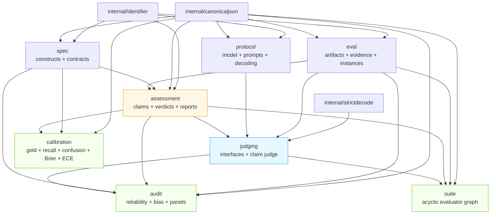

# judgekit: A Provider-Neutral Evaluation Library

An evaluator's value is not in the score it produces but in the chain of decisions that separates what is measured from how it is measured, what is observed from what is reported, and measurement evidence from deployment decisions. This report documents the implementation of judgekit, a Go library that makes that chain explicit and content-addressed. The repository began as an untouched Go template with a placeholder module path, a placeholder binary, and a logging dependency that transitively imported a command framework, a TUI framework, and a SQLite driver. It is now a provider-neutral evaluation library with eight core packages totaling 5,412 lines of non-test code, twelve forbidden-import guards enforced by a root-level test, 102 test functions, and no provider credentials required to run any of them.

The library's central design principle is structural, not algorithmic: a judge is a measurement instrument, and the relationship between the score it produces and the construct it intends to measure can break, especially under optimization. judgekit does not attempt to make judges correct. It makes the evaluation protocol explicit so that the relationship can be audited. Every report carries the protocol digest and the instance digest it was produced under, and the report itself is sealed with a content-addressed digest. A reader can follow the chain from an abstract construct to a reported number and see every assumption that produced it.

The first implementation pass built the five value-and-execution packages (`spec`, `eval`, `protocol`, `assessment`, `judging`) and the documentation. The second pass built the three packages that sit above the judging path and consume its reports rather than calling providers: `audit` (reliability and bias), `calibration` (agreement with human labels), and `suite` (combining evaluators). Those three were ordered after the value types because a reliability probe or a calibration metric is built on top of reports and gold records, and those had to exist first.

> [!summary]
> - judgekit is a provider-neutral Go library for evaluating language-model outputs. Core packages (`spec`, `eval`, `protocol`, `assessment`, `judging`, `audit`, `calibration`, `suite`) depend only on the standard library, the three internal helper packages, and `golang.org/x/sync/errgroup` for the suite; a root-level boundary test rejects imports of Glazed, Cobra, Bubble Tea, provider SDKs, and four sibling product modules in every core package.
> - The inference chain is made of separate, content-addressed documents: a measurement contract defines what is measured, a protocol defines how, an instance defines what is observed, and a sealed report defines what is produced. Each has a semantic digest (canonical JSON, order-independent) and, for loaded files, a byte digest that proves the exact reviewed source.
> - Support is three-way (`entailed` / `contradicted` / `insufficient`) from the first version. A boolean verdict cannot distinguish contradiction from absent evidence, and those two failures require different interventions. Entailed and contradicted verdicts must cite evidence; only `insufficient` may cite none.
> - The reference evaluator is a two-stage claim judge: claims are extracted with the evidence hidden, each claim is judged against the evidence, and the contract-defined aggregation produces the report. Structural failures are repaired once by prompt rewriting; semantic failures fail closed at seal time.
> - Three packages sit above the judging path and consume reports rather than calling providers: `audit` runs a judge over base/variant instances and reports per-construct reliability and bias; `calibration` matches reports to human gold labels and reports extraction recall, confusion, Brier, and ECE; `suite` combines evaluators in an acyclic dependency graph run concurrently. None of the three collapses reports into a single score.
> - 102 tests run with fake generators and local fixtures; no provider credentials are required. `golangci-lint` reports zero issues and `go test -count=1 ./...` is green across all packages, including the boundary test over all eight core packages.

## 1. The repository: template to library

The repository was initialized from the go-go-golems Go template. Its initial state carried three problems for a provider-neutral library. The module path was `github.com/go-go-golems/XXX`. A placeholder binary lived at `cmd/XXX/main.go` with an empty `main()`. And a generated logging package, `logcopter`, was wired through `pkg/logcopter.go` and a `go:generate` directive.

The logging dependency was the most consequential. `logcopter` transitively imports `github.com/go-go-golems/glazed`, which imports `github.com/spf13/cobra`, `github.com/charmbracelet/bubbletea`, and `modernc.org/sqlite`. A provider-neutral evaluation library whose core types are value objects — structs that are created, validated, and digested — has no use for a command framework, a TUI runtime, or a SQLite driver. Keeping the logging dependency would have made those packages part of the core build and the core dependency graph, and would have made the intended boundary unenforceable.

The normalization removed the placeholder binary, the placeholder package, and the logging generator, and renamed the module.

```text
module path:  github.com/go-go-golems/XXX      ->  github.com/go-go-golems/judgekit
binary:       cmd/XXX/main.go                  ->  removed
package:      pkg/doc.go, pkg/logcopter.go     ->  removed
generator:    logcopter_generate.go            ->  removed
logging:      logcopter (pulls glazed/cobra/    ->  removed from core
              bubbletea/sqlite)
```

After normalization, `go.mod` has three direct dependencies: `gopkg.in/yaml.v3` for strict YAML loading in `spec` and `protocol`, and `github.com/go-go-golems/glazed` plus `github.com/spf13/cobra` for the thin help-host CLI in `cmd/judgekit`. The CLI is the only place in the repository permitted to import Glazed or Cobra. Core never imports them.

A thin CLI was added deliberately, despite the design document's "no initial CLI" decision. The reason is that the help entries the project ships — a getting-started tutorial, a user guide, and a developer reference — are Glazed help sections, and the Glazed help system is only fully usable when a Cobra root command is initialized with `help_cmd.SetupCobraRootCommand`. A loose markdown file is not a help entry; the canonical path requires the root wiring. The CLI therefore exists to host the help system. It contains no domain logic.

## 2. The inference chain and the package boundaries

judgekit models the middle of an inference chain. The application owns the construct's substantive meaning and the final decision; judgekit makes the intermediate steps explicit.

```text
abstract construct
  -> measurement contract        (spec)
  -> evaluation protocol         (protocol)
  -> evaluation instance + evidence (eval)
  -> structured assessment        (assessment)
  -> statistical audit/calibration (audit, calibration)
  -> application decision         (outside judgekit)
```

The packages map onto that chain by responsibility. `spec` defines what an evaluator measures. `eval` defines what an evaluator observes. `protocol` defines how an evaluator measures. `assessment` defines what an evaluator produces. `judging` runs evaluators. `audit`, `calibration`, and `suite` sit above the judging path and consume reports rather than calling providers. Three internal helper packages — `identifier`, `canonicaljson`, `strictdecode` — provide the primitives the value types depend on.

The dependency direction is constrained so that the value packages do not depend on the execution package, and so that the three bottom-of-the-chain packages are parallel.



`spec`, `eval`, and `protocol` depend only on the standard library and the internal helpers. `assessment` depends on `spec` and `eval`. `judging` is the only value-and-execution package that depends on all four value packages. `audit` depends on `eval`, `assessment`, `spec`, and `judging` (its panels use the `Judge` interface). `calibration` depends on `assessment` and `spec`. `suite` depends on `eval`, `assessment`, and `judging`, plus `golang.org/x/sync/errgroup` for concurrent execution. Provider adapters, when they are added, will import `judging` and never the reverse. The three top packages never call providers; they run a `judging.Judge` or consume reports.

The boundary is enforced by a test at the module root, `boundary_test.go`, which runs `go list -json` over the core packages and rejects any import whose path begins with one of twelve forbidden prefixes.

```go
var forbiddenImportPrefixes = []string{
    "github.com/go-go-golems/glazed",
    "github.com/spf13/cobra",
    "github.com/spf13/pflag",
    "github.com/charmbracelet/bubbletea",
    "github.com/charmbracelet/bubbles",
    "github.com/go-go-golems/geppetto",
    "github.com/go-go-golems/pinocchio",
    "github.com/go-go-golems/coinvault",
    "github.com/go-go-golems/ragopt",
    "github.com/go-go-golems/ragkit",
    "github.com/sashabaranov/go-openai",
    "github.com/anthropics/anthropic-sdk-go",
}
```

The forbidden list has three categories. Frameworks (`glazed`, `cobra`, `pflag`, `bubbletea`, `bubbles`) belong only in the CLI. Provider SDKs (`geppetto`, `go-openai`, `anthropic-sdk-go`) belong only in adapters. Sibling products (`coinvault`, `ragopt`, `ragkit`) carry concerns that do not belong in a provider-neutral library: CoinVault owns product prompts and authorization, ragopt owns optimization campaigns and promotion, ragkit owns retrieval and grounded-answer contracts. The test excludes `cmd/judgekit` and `pkg/doc` from the check, because those are the places allowed to import Glazed.

## 3. Stable identities: canonical JSON and dual digests

Every document in the chain is content-addressed. The foundation is canonical JSON, implemented in `internal/canonicaljson`. Canonical JSON is the encoding over which semantic identity is computed, so that two documents differing only in YAML key ordering or struct field declaration order produce the same bytes and therefore the same digest.

The canonical form has four properties. Object keys are sorted lexicographically. The encoding is compact. The characters `<`, `>`, and `&` are not HTML-escaped. NaN and Inf are rejected, because they have no stable JSON form. Numbers are encoded with the standard library's shortest representation, so `5`, `0.5`, and `0.86` round-trip without spurious trailing zeros.

```go
func Marshal(v any) ([]byte, error)
func Sum(v any) (string, error)   // "sha256:" + hex
```

`Marshal` first serializes the value with `encoding/json`, then unmarshals it into `any`, then re-encodes the generic intermediate. The round-trip through `any` is what makes struct field declaration order irrelevant: a struct whose fields are declared `A` then `B` and a struct whose fields are declared `B` then `A` produce the same canonical bytes. This is verified by a test that declares two such structs and asserts the digests are equal.

Each loaded document carries two digests. The semantic digest is the SHA-256 of the canonical JSON; it is stable across harmless ordering. The byte digest is the SHA-256 of the raw source bytes; it changes with any byte change, including whitespace. Both are necessary. The semantic digest is the identity used to pin a contract or protocol in a report. The byte digest proves which exact reviewed file was loaded, which matters for audit and reproducibility when a file is edited cosmetically without changing its meaning.

The digest format is self-describing: every digest is `"sha256:"` followed by lowercase hex. The prefix is checked everywhere a digest is required, so a future algorithm can be added by introducing a new prefix without silently invalidating old digests.

## 4. spec — what an evaluator measures

`spec` owns the first link of the chain. A `Construct` is the abstract property an evaluation intends to measure, paired with its operational definition so it can be applied consistently.

```go
type Construct struct {
    ID         ConstructID  // bounded identifier
    Name       string
    Definition string
    Unit       string       // "fraction", "label", ...
    Direction  Direction    // maximize | minimize | descriptive
    Range      *Range       // optional, inclusive bounds
}
```

A `MeasurementContract` operationalizes one or more constructs. It carries the constructs, an evidence policy that restricts which evidence an evaluator may admit, labels per construct, an aggregation per construct, and optional exclusions.

```go
type MeasurementContract struct {
    APIVersion     string
    Name           string
    Constructs     []Construct
    EvidencePolicy EvidencePolicy
    Labels         map[ConstructID][]string
    Aggregations   map[ConstructID]Aggregation
    Exclusions     map[ConstructID][]string
}
```

Validation fails closed on a fixed list of conditions. The `APIVersion` must equal `spec.ContractAPIVersion`; an unknown version is rejected so a future incompatible schema cannot be silently interpreted by old code. Construct IDs are bounded portable identifiers validated by `internal/identifier`: lowercase letters, digits, hyphens, and underscores, one to 128 bytes, no leading or trailing separator. Duplicate construct IDs are rejected. Labels and aggregations that reference an undeclared construct are rejected. The evidence policy's allowed and forbidden kinds must not overlap.

The aggregation validation is the part that most directly encodes measurement intent. A `fraction` aggregation computes a count ratio over labels. Its `numerator` and `denominator` are comma-separated lists of declared labels. The denominator is a label set, not a single label, because faithfulness is `entailed / (entailed + contradicted + insufficient)`, not `entailed / entailed`. A fraction that references an undeclared label is rejected.

The proving fixture, `spec/testdata/faithfulness.yaml`, mirrors the faithfulness contract used in CoinVault's existing judge. It declares three constructs — `faithfulness` (maximize, fraction), `relevance` (maximize, direct), and `abstention` (descriptive, direct) — with three-way support labels.

```yaml
constructs:
  - id: faithfulness
    name: Evidence faithfulness
    definition: The fraction of extracted factual claims entailed by the admitted evidence.
    unit: fraction
    direction: maximize
    range: { minimum: 0.0, maximum: 1.0 }
labels:
  faithfulness: [entailed, contradicted, insufficient]
aggregations:
  faithfulness:
    method: fraction
    numerator: entailed
    denominator: entailed,contradicted,insufficient
    empty_policy: vacuous_perfect
```

The `empty_policy` field encodes what to report when an aggregation has no items. `vacuous_perfect` reports the range maximum (faithfulness of a zero-claim answer is 1.0). `zero` reports the range minimum. `na` reports no value and marks the dimension not applicable. The zero-claim case is not an edge case hidden inside an aggregator; it is a declared behavior the contract owns.

Loading is strict in both supported formats. `spec.LoadContract` reads a file; `spec.LoadContractFromBytes` accepts raw bytes for fixtures and embedded resources. Both reject unknown fields in JSON (`json.Decoder.DisallowUnknownFields`) and in YAML (`yaml.Decoder.KnownFields(true)`), so a typo cannot silently create a partial contract.

## 5. eval — what an evaluator observes

`eval` defines one concrete item being judged. An `Artifact` is a content-addressed piece of text or a reference to one. A text artifact carries its content inline; a URI artifact refers to content the application resolves before evaluation. Exactly one of `Text` or `URI` must be set.

```go
type Artifact struct {
    MediaType string
    Text      string  // exactly one of Text/URI
    URI       string
    Digest    string  // "sha256:..."
    SizeBytes int64
}

func NewTextArtifact(mediaType, text string) Artifact
```

`NewTextArtifact` computes the digest and size from the content, so a caller cannot forget to content-address an artifact. `ValidateArtifact` rejects a stale text artifact: if the stored digest does not equal the SHA-256 of the stored text, validation fails. This catches the failure where an artifact's text is edited after its digest was computed.

An `EvidenceSet` is the ordered collection of evidence admitted for one instance. Each `EvidenceItem` carries a unique ID, a free-form kind, a content artifact, a source ID, an optional source time, an authority, and a provenance map. The set carries a policy digest — pinning the evidence policy under which it was admitted — and its own digest, computed over the ordered items and the policy digest. Item order is significant because a protocol may present evidence in a fixed order.

An `Instance` is the full unit of judgment.

```go
type Instance struct {
    ID            string
    Input         Artifact
    Candidate     Artifact
    Evidence      EvidenceSet
    Reference     *Artifact
    RequiredFacts []RequiredFact
    Metadata      map[string]string
    Digest        string
}

func NewInstance(id string, input, candidate Artifact, evidence EvidenceSet,
    reference *Artifact, facts []RequiredFact, metadata map[string]string) (Instance, error)
```

The instance has two cross-reference invariants. `RequiredFact.EvidenceIDs` must resolve to evidence items in the instance's evidence set. A required fact referencing unknown evidence fails closed. This matters because required facts enable completeness measurement independent of answer length, and a required fact that points at nothing is not a requirement.

The instance digest is non-circular. It is computed over a `instanceDigestInput` struct that mirrors `Instance` without the `Digest` field, so the digest is a function of content only. The same pattern is used for evidence sets and reports. A test asserts that the instance digest is deterministic across two constructions of the same instance, and that it changes when metadata is added.

## 6. protocol — how an evaluator measures

`protocol` identifies how an evaluator measures. The defining claim is that a model name alone is never a protocol identity. A one-token prompt change, a different decoding seed, or a new parser version is a different protocol with a different digest.

```go
type Protocol struct {
    APIVersion        string
    Name              string                 // bounded identifier
    MeasurementDigest string                 // pins the contract
    Model             ModelIdentity
    PromptDigests     map[string]string      // step -> "sha256:..."
    Decoding          DecodingPolicy
    EvidenceOrder     string                 // as_given | sorted | shuffled
    ParserVersion     string
    AggregatorVersion string
    Retry             RetryPolicy
}
```

`MeasurementDigest` pins the contract by digest. `protocol` does not import `spec`; it references the contract only by its semantic digest, so the two packages remain parallel in the dependency graph. `PromptDigests` maps a step name to the digest of the prompt used at that step. The prompt text itself is owned by the application; the protocol stores only its digest, so changing a prompt is a new protocol without forcing the protocol to store prompt text it should not own.

`EvidenceOrder` has three values. `as_given` presents evidence in the order of the evidence set. `sorted` sorts by ID. `shuffled` shuffles using the decoding seed, so order randomization is reproducible. Validation rejects `shuffled` without a decoding seed, because a non-reproducible shuffle is not a protocol.

The digest sensitivity is the property that makes the protocol useful as an identity. A test asserts that changing the model revision changes the digest, and that changing the insertion order of the `PromptDigests` map does not. The second assertion holds because canonical JSON sorts map keys; a Go map iterated in random order produces the same canonical bytes.

## 7. assessment — what an evaluator produces

`assessment` is the convergence point of the value packages. It imports `spec` for `ConstructID` and `eval` for raw artifacts, but it does not import `judging`, so a report can be validated without running an evaluator.

The central decision in `assessment` is three-way support. A `SupportLabel` is `entailed`, `contradicted`, or `insufficient`.

```go
type ClaimAssessment struct {
    ClaimID     string
    Label       SupportLabel
    EvidenceIDs []string
    Confidence  *float64
    Reason      string
}
```

A boolean verdict cannot distinguish contradiction from absent evidence. Those two failures require different interventions: a contradicted claim is wrong and must be corrected; an insufficient claim is unsupported and needs more evidence. Collapsing them into a single `unsupported` label loses the distinction an application needs to decide what to do. Three-way support preserves it.

The evidence-citation rule encodes the distinction. Entailed and contradicted verdicts must cite at least one evidence item. Only `insufficient` may cite none. `ValidateClaimAssessment` returns an error for an entailed verdict with an empty evidence list.

The allowed-evidence set is supplied by the judging layer, not stored in the report. `EvidenceIDSet` builds a `map[string]struct{}` from an instance's evidence items. `ValidateClaimAssessment` and `ValidateReport` cross-check every cited evidence ID against that set. A verdict that cites an evidence ID not in the instance fails closed. This is the mechanism that prevents a judge from inventing evidence.

A `Report` is the sealed, content-addressed output of one evaluator over one instance.

```go
type Report struct {
    APIVersion     string
    InstanceID     string
    InstanceDigest string
    ProtocolDigest string
    Claims         []Claim
    ClaimResults   []ClaimAssessment
    Dimensions     []DimensionResult
    RawArtifacts   []eval.Artifact
    StartedAt      time.Time
    FinishedAt     time.Time
    Digest         string
}
```

`ValidateReport` enforces structural integrity. Every claim has a unique ID. Every claim has exactly one claim result; a report with three claims and two results fails. Claim results reference real claims. Dimensions have unique construct IDs. Evidence references in both claim results and dimensions are cross-checked against the allowed set. Not-applicable dimensions must not carry a value. Non-finite values are rejected. Raw artifacts are validated as artifacts.

Sealing is separated from the digest-presence check. `ValidateReport` requires a digest, but a report being sealed does not yet have one. The implementation splits the validation into `validateReportBody`, which performs every check except the digest-presence check, and `ValidateReport`, which calls the body and then checks the digest. `Seal` calls `validateReportBody`, computes the digest, sets it, and returns. After `Seal`, `ValidateReport` passes.

```go
func Seal(r *Report, allowedEvidence map[string]struct{}) error
func ValidateReport(r *Report, allowedEvidence map[string]struct{}) error
```

The report digest is computed over a `reportDigestInput` that mirrors `Report` without the `Digest` field, with timestamps formatted as UTC RFC 3339 nanoseconds so two reports with the same content but constructed in different time zones produce the same digest. A test asserts the digest is deterministic across two constructions and changes when a verdict changes.

## 8. judging — running evaluators

`judging` is the only package that depends on all the value packages. It exposes provider-neutral interfaces and the reference two-stage claim judge.

```go
type Generator interface {
    Generate(ctx context.Context, req GenerationRequest) (GenerationResult, error)
}

type Judge interface {
    Evaluate(ctx context.Context, inst eval.Instance) (assessment.Report, error)
}
```

`Generator` does not expose provider-specific request objects. An application implements `Generator` to adapt its model runtime; core never imports a provider SDK. `GenerationRequest` carries a fully rendered prompt, a media type, the protocol ID, and a step name. `Step` lets a generator route or observe by stage. The model that actually served the request is returned in `GenerationResult.Model`, so a report can prove which model produced its raw text.

The reference evaluator is the two-stage `ClaimJudge`. The decomposition is the one proven in CoinVault's existing judge, separated from CoinVault's product meaning.

```text
input + candidate
  -> claim extractor (evidence hidden)
  -> validated claims
  -> claims + evidence
  -> support judge
  -> validated claim assessments
  -> contract-defined aggregation
  -> sealed report
```

The extractor must not see the evidence. The extraction prompt is rendered by a `ClaimProtocol` implementation that receives only the instance, and the instance's evidence is available to the prompt renderer only if the measurement contract explicitly defines evidence-conditioned claim extraction. In the default contract, the extractor receives the input and the candidate. A test asserts this: it records the extract prompt and checks that the prompt does not contain the evidence text, while it does contain the candidate answer.

```go
type ClaimProtocol interface {
    ExtractPrompt(inst eval.Instance) (string, error)
    SupportPrompt(inst eval.Instance, claims []assessment.Claim) (string, error)
}

type ClaimJudge struct {
    Contract spec.ContractDocument
    Protocol protocol.Document
    Prompts  ClaimProtocol
    Generate Generator
    Cache    Cache
    Repairer Repairer
    Clock    func() time.Time
}
```

The support judge may only cite evidence in the instance's evidence set. The model returns a JSON object with one verdict per claim, in order, plus direct dimensions for constructs that are not aggregated from claim labels. The judge validates that the number of verdicts equals the number of claims, that each verdict's claim index is correct, and that every cited evidence ID is in the allowed set built by `assessment.EvidenceIDSet`.

Aggregation follows the contract. A `fraction` aggregation counts claims by support label and computes the ratio; the empty case follows the contract's `empty_policy`. A `direct` aggregation takes the whole-answer dimension the model emitted for that construct. Faithfulness, relevance, and abstention are handled by the same loop. The report is then sealed.

Parsing is strict. `internal/strictdecode.DecodeJSONObjectStrict` strips one code fence that wraps the whole response, requires the remaining content to be a single JSON object, rejects unknown fields, and rejects trailing data. It does not search arbitrary prose for the first matching `{...}`. That tolerance hides model failures; callers that need it must implement their own tolerant parser. The strict path returns a typed `StructuralError` that classifies the failure.

Repair is bounded. A `Repairer` rewrites the prompt to ask the model to correct a structural failure. Only structural failures are repaired by default. `generateAndDecode` retries up to `Retry.MaximumAttempts` on a `StructuralError`; a semantic failure — an invalid support label, an unknown evidence reference, a missing claim result — surfaces and stops. The distinction matters because a semantically invalid assessment that is retried indefinitely can converge on a syntactically valid but still-wrong answer, and the repair loop should not be the mechanism that produces it.

```go
func generateAndDecode[T any](ctx context.Context, j *ClaimJudge,
    inst eval.Instance, step, prompt string) (T, error)
```

`generateAndDecode` is a free function rather than a method because Go methods cannot have type parameters. It takes the `*ClaimJudge` to access the cache, the repairer, and the protocol.

Caching is reproducibility and cost control, not reliability. A `Cache` stores and retrieves generated outputs by a `CacheKey` composed of the protocol digest, the instance digest, the step, and the prompt digest. The prompt digest is included so a prompt change is a new cache population even when the protocol and instance are unchanged. A repaired prompt has a different prompt digest, so the repaired generation is a new cache entry rather than a stale hit. `NoopCache` and an in-memory `MemoryCache` are provided. A test runs the judge twice over the same instance and asserts the second run performs no generations.

A `FakeGenerator` returns canned responses keyed by step and records every request. It lets the claim judge and the examples run with no provider credentials, and it lets tests assert prompt construction. The end-to-end test feeds two claims, receives one entailed and one contradicted verdict, and asserts faithfulness is `0.5`, relevance is `0.9`, and abstention is `attempted`. The report carries the protocol and instance digests. A second test asserts that a zero-claim answer produces faithfulness `1.0` under the `vacuous_perfect` empty policy. A third test feeds a malformed extract response and asserts it is repaired once. A fourth test feeds an invalid support label and asserts the judge fails closed rather than accepting it.

## 9. audit, calibration, and suite — measuring the judge, not the answer

Three packages sit above the judging path. They consume reports rather than
calling providers, and none of them collapses reports into a single score.
Their ordering in the implementation followed the dependency graph: they were
built after the value types because a reliability probe and a calibration
metric are built on top of reports and gold records.

### audit — reliability and bias

Reliability is consistency, not correctness. A cached wrong verdict is stable
but unreliable, so reliability is deliberately separate from caching. The
`audit` package runs a judge over a base instance and a variant that changes
only something that should not affect the construct, then compares the two
reports.

A `Probe` carries a `ProbeKind` (`repeat`, `evidence_order`, `candidate_order`,
`prompt_paraphrase`, `format_transform`, `cross_judge`), a base and a variant
instance, and a required `Invariants` list. The invariant list is required
because a probe that does not state what should not change cannot localize a
sensitivity it finds. `NewProbeSet` content-addresses a set of probes.

```go
type Probe struct {
    ID              string
    Kind            ProbeKind
    BaseInstance    eval.Instance
    VariantInstance eval.Instance
    Invariants      []string  // required
}

func Reliability(ctx context.Context, judge judging.Judge, set ProbeSet,
    protocolDigest string) (ReliabilityReport, error)
```

`CompareReports` walks the two reports and returns one `Disagreement` per
construct whose value or label changed and per claim whose support label
changed. `Disagreement.BaseLabel` and `VariantLabel` are strings, not
`SupportLabel`, because dimension labels are an open set (an abstention
dimension carries `"attempted"` or `"abstained"`, which are not support
labels). The construct-versus-claim distinction is carried by which ID field is
set.

`Reliability` aggregates per-construct agreement and mean absolute delta
across a probe set, never one "reliability score". The report carries the
protocol digest and the probe-set digest and is sealed with its own
digest. A test feeds a base report with faithfulness `0.5` and a variant with
`0.9`, plus an entailed-then-contradicted claim flip, and asserts claim-label
agreement `0`, dimension agreement `0`, and mean absolute delta `0.4`.

A `Panel` runs several judges over one instance and preserves every member
report plus a pairwise claim-label agreement matrix. Majority vote is an
aggregation, not independent truth; the panel never collapses reports. The
agreement matrix reports `0`, not `1`, for a judge pair that shares no claims,
so it does not over-report agreement for judges that extracted disjoint claim
sets. This is the implementation of the textbook's "five judges, one error"
counterexample: judgekit can compute agreement but cannot infer error
independence without external labels.

```go
type Panel struct {
    Judges []judging.Judge
    Policy AggregationPolicy
}

func (p Panel) Evaluate(ctx context.Context, inst eval.Instance) (PanelResult, error)
```

`audit` runs a `judging.Judge` over the base and variant instances; it never
imports a provider SDK. The boundary test confirms `judging` is its only
execution dependency.

### calibration — agreement with human labels

`calibration` is the link between judgekit reports and human or objective
labels. It owns gold records, extraction recall, confusion matrices, and the
probability-scoring rules.

A `GoldClaim` retains `ReviewerIDs` so inter-rater agreement can be measured.
`Adjudicated` is a flag, not an erasure: when a disagreement is adjudicated, the
reviewer list is kept, so the original disagreement that produced the
adjudication is still visible. Gold sets are content-addressed so a
calibration report can pin the exact labels it was computed against.

```go
type GoldClaim struct {
    InstanceID  string
    Claim       assessment.Claim
    Label       assessment.SupportLabel
    ReviewerIDs []string  // retained even after adjudication
    Adjudicated bool
}
```

The clean separation between extraction recall and confusion is the key
semantic. `ExtractionRecall` is `matched / len(gold)` over all gold claims: a
miss is a recall failure. The confusion matrix is built only over matched
claims: a miss gives no predicted label, so it cannot enter a 2x2. Conflating
them would double-count misses. `ConfusionFromClaims` builds the matrix with
entailed as the positive class and non-entailed (contradicted or
insufficient) as the negative class, and exposes `Sensitivity`,
`Specificity`, and `FalseSupportRate` (one minus precision).

`BrierScore` and `ExpectedCalibrationError` are the proper scoring rules over
`(confidence, outcome)` pairs. They apply only when the protocol emits
confidence probabilities, so they are `*float64` and nil when no confidence is
present. A 1-5 ordinal score is not a probability; forcing a number would
imply the protocol is calibrated when it emitted no probabilities at all.
`Calibrate` matches gold claims to model verdicts per instance, builds the
confusion matrix over matched claims, computes recall over all gold claims,
and Brier/ECE over claims with confidence, then seals the report.

```go
type Report struct {
    ExtractionRecall float64
    Sensitivity      float64
    Specificity      float64
    FalseSupportRate float64
    BrierScore       *float64  // nil when no confidence
    ECE              *float64
    ByGroup          map[string]SliceReport
    Digest           string
}

func Calibrate(in CalibrateInput) (Report, error)
```

A test pins the missed-claim behavior: a judge that extracts one of two gold
claims gets recall `0.5`, but its confusion matrix has one true positive and
no false negatives, so sensitivity is `1.0`. The miss lowered recall; it did
not enter confusion. Another test confirms Brier and ECE are nil when the
verdicts carry no confidence.

`calibration` consumes reports and gold records; it does not run judges.

### suite — combining evaluators without collapsing them

A real evaluation often needs more than one judge: a claim extractor feeding a
support judge, a required-fact verifier, a citation resolver, an abstention
judge, a style judge. Collapsing them into one output loses the per-evaluator
protocol identity and the per-evaluator disagreement. `suite` runs them in
dependency order, lets one evaluator consume another's results, and retains
every report keyed by evaluator name.

An `Evaluator` declares `Name` and `DependsOn` and implements `Evaluate`, which
receives the instance and the partial `Results` available so far. A support
judge may consume a claim extractor's output only when that dependency is
declared and has already run.

```go
type Evaluator interface {
    Name() string
    DependsOn() []string
    Evaluate(ctx context.Context, inst eval.Instance, results Results) (assessment.Report, error)
}

type Suite struct {
    APIVersion  string
    Name        string
    Evaluators  []Evaluator
    Digest      string
}

func NewSuite(name string, evaluators []Evaluator) (Suite, error)
func (s Suite) Run(ctx context.Context, inst eval.Instance) (Results, error)
```

`Validate` rejects three structural failures before any evaluator runs:
unknown dependencies (a `DependsOn` name that is not a declared evaluator),
duplicate evaluator names, and dependency cycles. The cycle check is a DFS
with white/gray/black coloring that reports the first cycle as a path.

`Run` dispatches evaluators in dependency waves. Each wave finds the
evaluators whose remaining-dependencies set is empty, dispatches them
concurrently via `errgroup`, waits for the wave, then removes each completed
evaluator from every other evaluator's remaining set. A dependent evaluator
sees a snapshot of `Results` taken at dispatch time, so it has a stable view
independent of later concurrent writes. Each report retains its own protocol
digest; the suite does not merge them. `errgroup.WithContext` cancels
remaining work on the first error, so an evaluator failure fails the whole
run fast.

The suite digest is a function of the graph structure, not the declaration
order. `NewSuite` sorts each evaluator's dependency list and digests only the
dependencies map plus the API version and name, so two suites that describe the
same evaluator graph in different orders get the same digest. This was a
correctness fix: the first implementation included an ordered `EvaluatorNames`
slice, so reordering evaluators changed the digest, and a test failed until the
slice was dropped.

A `JudgeEvaluator` adapts a plain `judging.Judge` to a dependency-free
`Evaluator`, so a suite can run a judge without the caller implementing the
interface by hand. A concurrency test runs two sleeping evaluators and asserts
the elapsed time is under twice the single delay, proving `errgroup` actually
overlaps independent evaluators rather than running them sequentially.

## 10. The help-host CLI and the documentation

The documentation is shipped as three Glazed help entries under `pkg/doc/`, embedded into a thin CLI under `cmd/judgekit/`.

| File | Slug | SectionType |
|---|---|---|
| `pkg/doc/tutorials/01-getting-started.md` | `getting-started` | Tutorial |
| `pkg/doc/topics/01-user-guide.md` | `user-guide` | GeneralTopic |
| `pkg/doc/reference/01-developer-reference.md` | `developer-reference` | GeneralTopic |

Each entry has Glazed frontmatter with the exact fields the help system expects (`Title`, `Slug`, `Short`, `Topics`, `SectionType`, `ShowPerDefault`, `IsTemplate`). `pkg/doc/doc.go` embeds the three directories and exposes `AddDocToHelpSystem`, which calls `help.HelpSystem.LoadSectionsFromFS`. `cmd/judgekit/main.go` constructs the help system, loads the embedded sections, and calls `help_cmd.SetupCobraRootCommand`.

```go
helpSystem := help.NewHelpSystem()
if err := doc.AddDocToHelpSystem(helpSystem); err != nil {
    return err
}
help_cmd.SetupCobraRootCommand(helpSystem, rootCmd)
```

The three entries are queryable. `judgekit help getting-started`, `judgekit help user-guide`, and `judgekit help developer-reference` each render the embedded markdown. The CLI is the only place in the repository that imports Glazed and Cobra; the boundary test excludes `cmd/judgekit` and `pkg/doc` from its check.

A `GLOSSARY.md` at the repository root grounds the measurement-theory terms the library is built on in the source that motivated it. Each term — construct, latent utility, proxy measurement, evaluation protocol, judge, critic, verifier, reliability, validity, calibration, bias, construct shift — is defined from *Language Models as Judges and Optimizers*, Chapter 1, and mapped to a judgekit type or package. The glossary is the bridge between the measurement theory and the code: a reader who wants to know what a construct is reads the textbook definition and then the `spec.Construct` note that says where it lives.

An `examples/claim-judge/` directory contains a runnable end-to-end example: a `contract.yaml` and an `example_test.go` that loads the contract, builds a protocol and instance, renders the two prompts with a fake generator, runs the judge, and logs the report digest and dimensions. The example's report digest is `sha256:35948305ac8c511e014c579328fac610f58d1dadf430ca3c8cd5c6ce876137d8`.

## 11. Verification, and what is deliberately not done

The verification is a fresh test run with the cache disabled.

```text
GOWORK=off go test -count=1 ./...      15 packages, 102 test functions, green
GOWORK=off go vet ./...                clean
gofmt -l ./...                         clean
golangci-lint run                      0 issues
docmgr doctor --ticket JUDGEKIT-001    all checks passed
```

The boundary test is part of the suite. It runs `go list -json` over `./spec`,
`./eval`, `./protocol`, `./assessment`, `./judging`, `./audit`, `./calibration`,
`./suite`, and `./internal/...`, decodes the package list, and rejects any
import that begins with a forbidden prefix. The test fails the build if a core
package imports a framework, a provider SDK, or a sibling product. It was
extended when each new package was added so the guard never lagged the code.

| Package | Non-test lines | Test file |
|---|---|---|
| `internal/identifier` | 137 | yes |
| `internal/canonicaljson` | 316 | yes |
| `internal/strictdecode` | 293 | yes |
| `spec` | 726 | yes |
| `eval` | 509 | yes |
| `protocol` | 423 | yes |
| `assessment` | 579 | yes |
| `judging` | 898 | yes |
| `audit` | 819 | yes |
| `calibration` | 931 | yes |
| `suite` | 527 | yes |
| **Core total** | **5,412** | |

The library deliberately does not do several things, and the reasons are
structural.

It does not make deployment or promotion decisions. A judge report feeds an
external gate — ragopt or a product — that must interpret it explicitly. The
design document's accepted decision record states this directly: judgekit
produces auditable measurement evidence; it does not grant that evidence
authority it has not earned. A single `Score()` method that collapsed
"measured 0.86" into "deploy" would recreate the ambiguity the library is
intended to remove. The same boundary applies to the three top packages:
`audit` reports reliability, `calibration` reports agreement with labels, and
`suite` returns a set of reports; none of them promotes a candidate.

It does not own product prompts, rubrics, tool names, authorization, or case
schemas. Those belong to applications. The `ClaimProtocol` interface is where an
application renders its prompts; the protocol stores only prompt digests.

It does not own optimization campaigns, candidate mutation, or promotion
policy. Those belong to ragopt. It does not own retrieval, chunks, reranking,
or grounded-answer contracts. Those belong to ragkit. It does not store hidden
chain-of-thought or treat any model score as ground truth.

It does not yet implement the probability-scoring helpers for per-group
calibration slicing. The `calibration.Report` carries a `ByGroup` field, but
`Calibrate` does not yet populate it; that requires a grouping key on gold
records and is the first follow-up. ECE uses equal-width binning and can hide
within-bin structure, so a reliability-diagram helper alongside ECE is the
second.

It does not yet run a pilot integration. The design document specifies a
CoinVault pilot as Phase 7: port the claim extraction and support path onto
judgekit, compare characterization fixtures, and delete the replaced local
generic structures. That pilot touches a sibling repository and was deferred;
the colleague working on the other repositories owns that surface.

## 12. Open questions and near-term next steps

The open questions are about where the boundary between judgekit and its
consumers should be drawn more sharply.

- Should provider adapters live in this repository or in separate adapter
  repositories? The design document defers the decision until two applications
  use the core interface. The boundary test would need to extend to cover an
  adapter directory.
- Should the `MemoryCache` store raw bytes rather than JSON-round-tripping
  values? The current implementation is correct but wasteful for large raw
  responses. A production cache should store raw bytes.
- Should `strictdecode` classify errors via typed errors rather than substring
  matching on the `json` error message? The current classification is fragile
  across Go versions.
- Should `audit`'s `Panel.Evaluate` run judges concurrently rather than
  sequentially? The v0 implementation is sequential to keep the test double
  deterministic; a production panel should use `errgroup` like `suite` does.
- Should `Calibrate` populate `ByGroup` from a grouping key on gold records?
  The field exists but is not yet filled; per-group calibration across strata
  (topic, difficulty, evidence kind) is the obvious next step and requires a
  key.

The near-term next steps follow the design document's remaining phases. Add
fuzz tests for `canonicaljson`, `strictdecode`, the calibration scoring
functions (Brier/ECE), extraction recall, and report sealing. Add the
`ByGroup` slicing and a reliability-diagram helper alongside ECE. Then run the
CoinVault pilot, gated by characterization fixtures that capture the current
judge's behavior before any code is moved. Optional provider adapters are the
last design phase, and only after two applications use the core interface.

## Working rule

> [!important]
> Make the evaluation protocol explicit and content-addressed; never collapse measurement evidence into a deployment decision.
> Core depends only on the standard library and internal helpers; the boundary test rejects frameworks, provider SDKs, and sibling products in every core package.
> Three-way support and cited-evidence requirements are invariants, not preferences: a verdict that invents evidence fails closed at seal time.

## Related notes

- Upstream research and the clarified textbook reader editions: [[COINVAULT-045 - Study Self-Optimization and Exploitable Evaluator Errors]]
- The repository-local design ticket and investigation diary:
  - `/home/manuel/workspaces/2026-08-12/deploy-dev-indexer/judgekit/ttmp/2026/08/17/JUDGEKIT-001--design-and-implement-judgekit/design-doc/01-judgekit-architecture-and-implementation-guide.md`
  - `/home/manuel/workspaces/2026-08-12/deploy-dev-indexer/judgekit/ttmp/2026/08/17/JUDGEKIT-001--design-and-implement-judgekit/reference/01-investigation-diary.md`
