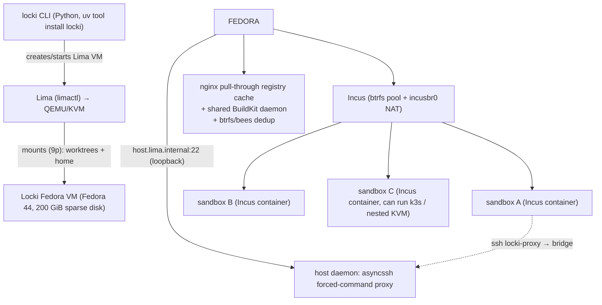

# Locki on Proxmox: Sandboxing AI Coding Agents on a Homelab Hypervisor

Running an AI coding agent in `--dangerously-skip-permissions` mode on a personal machine grants the agent the ability to read, write, and execute anything the operator can. The practical response is to run each agent inside a sandbox that the agent cannot escape, but that still resembles a real development machine. This article documents the analysis, design, and first maintenance step for hosting such a sandboxing tool — **Locki** — on a home Proxmox server, including the decision to run it nested first and the Proxmox VE upgrade performed to unblock a later native port.

> [!summary]
> 1. **Locki uses one VM as the security boundary and many Incus containers as cheap per-agent sandboxes** — this two-layer design is the reason a per-sandbox VM is the wrong shape for a hypervisor port.
> 2. **The outer-VM layer is the only Lima-coupled seam** — `VMService` owns every outer-VM operation, so a Proxmox-native port is a backend substitution behind a Protocol, not a fork.
> 3. **Proxmox VE 8.4 added native virtiofs**, which replaces Lima's 9p mounts and is the single reason the crib node was upgraded from 8.1.4.
> 4. **The node was never "stuck" on 8.1.4 by design** — a single stale Debian-11 apt repo line silently blocked `dist-upgrade`, and removing it unblocked the standard Bookworm minor upgrade.

## Why this note exists

This note preserves the engineering knowledge produced while planning how to run Locki on the crib Proxmox node and while performing the upgrade required for the native port. It is written so a future reader can understand the system, reproduce the setup, and apply the same upgrade procedure to a similar Bookworm-based Proxmox 8.x node. The triggering work lives in two docmgr tickets: `LOCKI-PROXMOX-CRIB-2026-08-18` (the design guide) and `PVE-UPGRADE-2026-08-18--crib-node-8.1.4-to-8.4` (the upgrade run).

## The problem: agents on the host

An AI coding agent with unconstrained shell access can read SSH keys, push to the wrong remote, rewrite production configuration, or delete state. The operator's goal is to allow the agent to work freely inside a project without giving it the host. Approaches differ in isolation strength and cost:

| Technique | Isolation | Can run containers/VMs inside | Start cost |
|---|---|---|---|
| OS-level jail (Landlock, Bubblewrap) | Restriction only | No | Low |
| OCI container per agent (Devcontainers, Distrobox) | Shared kernel | Limited | Low |
| MicroVM per agent (Firecracker) | Full kernel | Limited | Medium |
| Full VM per agent (Vagrant, Multipass) | Full kernel | Yes | High |
| One VM + many containers | One kernel boundary + cheap containers | Yes (in containers) | One-time, then low |

The last row is Locki's design. One real VM provides the trusted security boundary; inside it, many lightweight system containers give each agent a fresh, full-featured machine at near-zero incremental cost.

## Locki's two-layer architecture

Locki is a Python CLI installed with `uv tool install locki`. Every AI conversation receives two things: a Git worktree on the host, and an Incus container inside a single Fedora VM. The worktree is the code; the container is the machine. The original repository and the operator's real home directory are not visible from any sandbox.

The path mapping is the security boundary. Locki mounts exactly two host directories into the VM:

```text
Host                                              Sandbox (Incus container, inside the Locki VM)
~/.local/share/locki/worktrees/<id>/    ────────►  same path        (the project worktree)
~/.local/share/locki/home/              ────────►  /root/.locki/home (shared sandbox home, ~ inside sandboxes)
```

Everything else — the operator's actual `~`, other repos, the real `.git` — is out of reach. Git operations from inside a sandbox do not touch the worktree's `.git` directory directly; they go through a **command bridge** that validates each command against a grammar and scopes writes to the sandbox's own namespaced branches (`<name>#locki-<wt-id>`).

The outer VM is created today by **Lima**, a QEMU wrapper. Inside it, **Incus** manages the per-sandbox containers. The composition is:



The `default` Incus profile is nesting- and privileged-enabled, so a sandbox can itself run containers and Kubernetes. Incus also passes `/dev/kvm` and `/dev/vhost-net` into sandboxes when available, which means a sandbox can run its own nested VMs. This capability is what makes the nesting topology matter: every layer of nesting costs virtualization-extension pass-through, and deeper nesting is slower.

The shared infrastructure is what makes many sandboxes cheap. `vm-setup.sh` provisions the Fedora guest with a pull-through container-registry cache (nginx), a shared BuildKit daemon so Docker layers are cached across sandboxes, package caches for pip/uv/npm/cargo/go, and btrfs with `bees` deduplication. After the initial VM setup, spawning a new sandbox takes seconds.

## The Proxmox crib node

The deployment target is a home Proxmox VE server. A read-only probe (run before any change) established its state:

```text
Proxmox VE 8.1.4 (kernel 6.5.13-1-pve)
Host RAM: 62 GiB (~37 GiB available)
Nested KVM: Y (kvm_intel loaded; /sys/module/kvm_intel/parameters/nested = Y)
vmbr0: 192.168.0.227/24 (LAN bridge; gateway = cable modem at 192.168.0.1)
tailscale0: present (Tailscale already on the node)
local-lvm (lvmthin): ~259 GiB free
```

Three production VMs run continuously and must not be disturbed: 105 (Home Assistant), 106 (TrueNAS, `startup: order=10,up=120`), and 301 (k3s, `startup: order=20,up=30`). A reference VM configuration exists on the node (the k3s-server VM) and serves as the template for any new VM.

A prior deployment documented in the vault records a networking constraint that shapes every decision on this node: the cable modem at `192.168.0.1` is hostile to virtual MAC addresses. VMs on `vmbr0` get DHCP and reach the internet, but cannot be reached from other LAN devices at layer 3. The solution already in place is Tailscale, which gives every VM a stable `*.tail879302.ts.net` name reachable from any tailnet device. Every Locki-related VM is expected to join Tailscale.

## The nested setup (Phase 1)

The first phase runs Locki exactly as upstream ships it, but inside a Linux VM that Proxmox hosts. The goal is to evaluate whether Locki is worth a deeper investment before writing any code. The topology adds one layer:

```text
Proxmox/KVM  →  Linux "host" VM (VM 9410)  →  QEMU (Lima)  →  Locki Fedora VM  →  Incus  →  sandbox
```

This costs a virtualization layer (nested KVM is slower), but requires zero Locki code changes and carries no risk to the existing crib VMs. The host VM is created with the proven `qm` sequence already used for the k3s node, sized larger (16 GiB RAM, 8 cores, 60 GiB disk) and given nested-virt extensions for Lima's QEMU:

```bash
qm create 9410 --name locki-host --memory 16384 --cores 8 --cpu host \
  --net0 virtio,bridge=vmbr0 --bios ovmf --machine q35 --agent enabled=1
qm importdisk 9410 /var/lib/vz/template/iso/noble-server-cloudimg-amd64.img local-lvm
qm set 9410 --scsihw virtio-scsi-pci --scsi0 local-lvm:vm-9410-disk-0 \
  --efidisk0 local-lvm:1,efitype=4m,pre-enrolled-keys=0 \
  --ide2 local-lvm:cloudinit --boot order=scsi0 \
  --ciuser ubuntu --sshkeys /root/.ssh/authorized_keys --ipconfig0 ip=dhcp
qm set 9410 --args "-cpu host,+vmx"
qm start 9410
```

Inside the host VM, the operator installs QEMU (Lima needs it on Linux), installs `uv`, installs Locki, runs `locki setup`, and then `locki ai` in a project. The first run downloads the Fedora image and runs `vm-setup.sh`, which takes several minutes; subsequent sandbox spawns take seconds.

The decisive property of Phase 1 is that it answers the only question that matters before investing in Phase 2: does Locki fit the operator's workflow? If it does not, the native port is never written.

## The port seam: VMService

The reason a Proxmox-native port is feasible at all is that Locki already separates the outer-VM layer behind a single service. `src/locki/services/vm.py` defines `VMService`, which owns every interaction with the outer Lima VM. The Incus container code (`services/container.py`) and the port-forwarding code (`cmd/port_forward.py`) talk to the outer VM only through `VMService`.

The public surface is small and protocol-shaped:

```python
class VMService:
    def status(self) -> str | None: ...          # limactl list --format {{.Status}}
    def run(self, command, message, ...): ...   # limactl shell --start ... sudo -E <cmd>
    def incus(self, args): ...                  # limactl shell ... sudo incus <args>
    def copy_into(self, src, vm_path, message): ...  # limactl copy
    def shell(self, command, forward_env): ...  # limactl shell --yes --start
    def ensure_running(self) -> None: ...       # builds Lima YAML, creates+starts VM
    def stop(self, force=True, ...): ...        # limactl stop
    def delete(self): ...                       # limactl delete -f
```

Every method shells out to `limactl`. The Incus code never calls `limactl` directly; it calls `vm.run(["incus", ...])`. This is the seam. A Proxmox-native backend replaces each `limactl <verb>` with an SSH invocation against the PVE-managed VM, and the rest of Locki is unchanged.

Two parts of `vm-setup.sh` matter for the port. First, the guest provisioning script — which installs Incus, btrfs, the nginx cache, BuildKit, and bees — is Lima-agnostic. It runs inside Fedora regardless of who booted the VM, so the port reuses it verbatim. Second, the VM sizing (full host RAM, all CPUs, 200 GiB sparse disk) becomes explicit `qm` allocation on Proxmox, which is a benefit: explicit per-VM resource limits on a shared node.

## The command bridge and the loopback assumption

The most Lima-coupled part of Locki is the command bridge, and it is the trickiest to port. The bridge is an SSH server bound to `127.0.0.1` on the host. Sandboxes connect to it as `locki-proxy`, which resolves to `host.lima.internal` — a hostname Lima injects inside the VM that reaches the host's loopback. Each command is validated by a grammar parser before execution:

```text
sandbox  ──ssh locki-proxy──►  127.0.0.1:<port>  ──►  host daemon (asyncssh forced command)
                                                              │
                                                              ▼
                                              _resolve_bridged() validates against
                                              the AGENTS.md grammar (git/gh/locki-port-forward),
                                              checks .git for tampering, then runs the command
                                              on the host scoped to the sandbox's branches.
```

The Lima-specific assumption is `HostName host.lima.internal`. On a normally-bridged Proxmox VM there is no such hostname; the VM has its own IP. The unsafe shortcut — binding the daemon to `0.0.0.0` on the Proxmox node — would expose the command bridge to the LAN. The correct fix is an SSH reverse tunnel:

```text
PVE host (loopback 127.0.0.1:<port> = locki daemon)
   ▲
   │  reverse tunnel:  ssh -R 127.0.0.1:<port>:127.0.0.1:<port> locki-vm
   │
Locki Fedora VM  ── ssh locki-proxy ──► 127.0.0.1:<tunnel-port> ──► host daemon
```

The daemon stays loopback-only. The SSH backend establishes the reverse tunnel, and the sandbox's `locki-ssh-config` is rewritten to `HostName 127.0.0.1` with the tunnel port. Port forwarding has the same shape: `locki port-forward :8080` installs an Incus proxy device that listens on the VM's `0.0.0.0:8080`, and a local `ssh -L` forward makes that port reachable on the PVE host's loopback (and hence via Tailscale).

## The PVE-native port (Phase 2)

The native port replaces Lima with a Proxmox-managed Fedora VM, keeping Incus underneath. The topology drops a layer:

```text
Proxmox/KVM  →  Locki Fedora VM  →  Incus  →  sandbox
```

The design introduces a generic `VMBackend` Protocol rather than a Proxmox-specific subclass. The same `SSHBackend` then supports any remote Linux machine — libvirt, VMware, a bare-metal box — and Proxmox specifics are isolated in a thin `ProxmoxLifecycle` component that calls the REST API to provision, start, stop, and delete the VM.

```python
class VMBackend(Protocol):
    name: str
    def status(self) -> str | None: ...
    def ensure_running(self) -> None: ...
    def run(self, command, *, message, env=None, input=None, check=True, quiet=False): ...
    def shell(self, command, forward_env): ...
    def copy_into(self, src, vm_path, *, message): ...
    def stop(self, *, force=True, check=True, quiet=False): ...
    def delete(self): ...
```

The file-sharing requirement is the reason for the upgrade documented next. Locki mounts two host directories into the VM: the worktrees and the shared home. Lima does this over 9p. Proxmox VE 8.4 added native **virtiofs** directory sharing, which performs the same job at near-native speed with no network plumbing:

```bash
# On the PVE host, add two virtiofs shares to the Locki VM:
qm set 9410 --virtiofs0 locki-worktrees,dir=/home/you/.local/share/locki/worktrees
qm set 9410 --virtiofs1 locki-home,dir=/home/you/.local/share/locki/home

# Inside the Fedora VM, mount them at the paths vm-setup.sh expects:
mount -t virtiofs locki-worktrees /home/you/.local/share/locki/worktrees
mount -t virtiofs locki-home        /root/.locki/home
```

The Proxmox REST API exposes VM lifecycle through privilege-separated API tokens. A token's permissions are a subset of the backing user's, so Locki can be given exactly the privileges it needs without blanket hypervisor control:

| Method | Path | Purpose |
|---|---|---|
| GET | `/nodes/{node}/qemu/{vmid}/status/current` | VM status |
| POST | `/nodes/{node}/qemu/{vmid}/status/start` | Start VM |
| POST | `/nodes/{node}/qemu/{vmid}/status/stop` | Stop VM |
| POST | `/nodes/{node}/qemu/{vmid}/clone` | Clone (params: `newid`, `name`, `full`) |
| PUT | `/nodes/{node}/qemu/{vmid}/config` | Reconfigure (add virtiofs, etc.) |

## The upgrade: 8.1.4 → 8.4

The native port requires virtiofs, and virtiofs requires PVE 8.4. The crib node ran 8.1.4. An 8.1.4 → 8.4 upgrade is a Bookworm minor upgrade: same Debian 12 base, newer PVE packages, a newer kernel (6.5 → 6.8). It is performed with `apt dist-upgrade`, not a Debian major bump and not the `pve8to9` checker (that belongs to the separate 8.4 → 9.2 hop).

The first diagnostic finding was that the node was not stuck on 8.1.4 by any Proxmox limitation. A read-only probe of the apt repositories found a stale Debian-11 line:

```text
/etc/apt/sources.list.d/pve-community.list:
  deb http://download.proxmox.com/debian/pve bullseye pve-no-subscription   # Debian 11; node is Debian 12 (bookworm)
```

The correct repository was already present in `pve-install-repo.list` (`bookworm pve-no-subscription`), and the enterprise repository was correctly commented out. The symptom was characteristic: `apt update` reported 271 upgradable packages, but `apt dist-upgrade` installed zero of them. The bullseye suite mismatched the bookworm base, so apt resolved nothing upward. This is the single most common 8.1 → 8.4 failure reported on the Proxmox forum: a missing or wrong Proxmox repository, not a Proxmox defect.

Removing the stale line unblocked the standard procedure:

```bash
# 1. Remove the stale bullseye line (backed up first).
sed -i '/bullseye/d' /etc/apt/sources.list.d/pve-community.list

# 2. Upgrade. dist-upgrade, not upgrade, handles the kernel and dependency changes.
apt update
DEBIAN_FRONTEND=noninteractive apt-get -y \
  -o Dpkg::Options::=--force-confold -o Dpkg::Options::=--force-confdef \
  dist-upgrade

# 3. Reboot to load the new kernel.
reboot
```

`apt upgrade` is insufficient because it will not install the new kernel or packages whose dependencies change. `apt dist-upgrade` is required. The `--force-confold` option keeps existing configuration files on dpkg prompts so the run is unattended.

The upgrade was performed in a detached tmux session, with the orchestrator running on the operator's machine over SSH so it survived the node's own reboot. The result:

```text
pve-manager/8.4.20 (running kernel: 6.8.12-42-pve)
virtiofs present: /usr/share/perl5/PVE/QemuServer/Virtiofs.pm
```

All three production VMs returned via autostart ordering. 106 (TrueNAS, `order=10,up=120`) started first; 301 (k3s, `order=20,up=30`) started after 106 had been up for 120 seconds; 105 (Home Assistant, `onboot=1`) started once its own autostart turn arrived. A VM that appears "stopped" immediately after a reboot can be correct — the autostart window has not yet elapsed.

## Two operator bugs from the run

The run produced two reusable failures worth recording.

**Proxmox configuration IDs reject dots.** The first safety step was a snapshot named `pre-8.4-upgrade-20260818`. Proxmox rejected it: `400 Parameter verification failed. snapname: invalid configuration ID 'pre-8.4-upgrade-20260818'`. Proxmox config IDs, including snapshot names, must match `[a-zA-Z0-9_-]+`; the dot in `8.4` is illegal. No snapshots were taken. Because the upgrade changes only the hypervisor and not guest disks, the data risk was low, but the rollback checkpoint was absent. The fix is a dash-only name: `pre-8-4-upgrade-20260818`.

**Reboot detection must wait for down before waiting for up.** The orchestrator sent `nohup sh -c "sleep 2 && reboot" &` and immediately polled SSH. The first poll succeeded against the still-dying session and declared the node "back after 10s". The verification commands that followed were then cut off when the real reboot fired. The correct poll loop is a two-state machine: first confirm SSH has gone down (the node is actually rebooting), then poll for it to come back up, and finally confirm the new kernel loaded rather than a lingering old session.

```bash
# Wait for down.
for i in $(seq 1 30); do
  ssh ... "$NODE" 'true' 2>/dev/null || { echo "down"; break; }
  sleep 2
done
# Wait for up, then confirm the new kernel.
for i in $(seq 1 60); do
  ssh ... "$NODE" 'pveversion' 2>/dev/null | grep -q 'kernel: 6.8' && { echo "new kernel"; break; }
  sleep 10
done
```

## Working rules

1. **Run Locki nested before porting it.** The nested setup answers whether Locki fits the workflow at zero code cost. The native port is only worth building if the answer is yes.
2. **Never do Proxmox-VM-per-sandbox.** Locki's advantage is one real VM as the boundary plus cheap Incus containers with shared caches and btrfs dedup. Per-sandbox PVE VMs discard that advantage and are slow to start.
3. **Port behind a Protocol, not into a subclass.** A generic `VMBackend` with `LimaBackend` and `SSHBackend` supports any remote machine; Proxmox specifics stay in a thin `ProxmoxLifecycle`. This is more reusable upstream than baking Proxmox into Locki.
4. **Keep the command bridge loopback-only.** Do not bind the daemon to `0.0.0.0` to reach it from a VM. Use an SSH reverse tunnel so the daemon never touches the network.
5. **When `apt dist-upgrade` installs nothing on Proxmox 8.x, check the repository first.** The most common cause is a missing or wrong Proxmox repo line, not a Proxmox bug. A stale suite (bullseye on a bookworm node) silently blocks the upgrade while still reporting upgradable packages.
6. **Use `apt dist-upgrade`, not `apt upgrade`, for Proxmox point releases.** The kernel and several packages have dependency changes that plain `upgrade` will hold back.
7. **Take snapshots with dash-only names.** Proxmox config IDs reject dots; a name like `pre-8.4-upgrade` fails. Use `pre-8-4-upgrade`.
8. **After a Proxmox reboot, wait for the full autostart window before declaring a VM failed.** `startup: order=N,up=M` is a dependency chain with delays; a "stopped" VM immediately after reboot may simply not have had its turn yet.
9. **Reboot detection is a two-state machine.** Confirm the node went down before polling for it to come back up, and confirm the new kernel loaded rather than a lingering session.

## Related notes

- [[ARTICLE - Deploying k3s on Proxmox - A Technical Deep Dive]] — the prior crib-node deployment that established the `qm` workflow, the cable-modem networking constraint, and the Tailscale access pattern reused here.
- [[PROJ - poll-modem k3s Cluster on Proxmox]] — the crib k3s project; the reference VM configuration and autostart ordering.
- Docmgr tickets: `ttmp/2026/08/18/LOCKI-PROXMOX-CRIB-2026-08-18--...` (Locki design guide) and `ttmp/2026/08/18/PVE-UPGRADE-2026-08-18--crib-node-8.1.4-to-8.4--...` (upgrade run + run log).
- Locki source (cloned reference): `/home/manuel/code/others/llms/locki/` — `src/locki/services/vm.py` (the port seam), `src/locki/cmd/internal.py` (the loopback daemon), `src/locki/data/vm-setup.sh` (Lima-agnostic guest provisioning).
