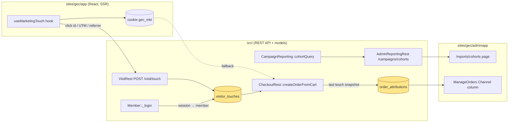
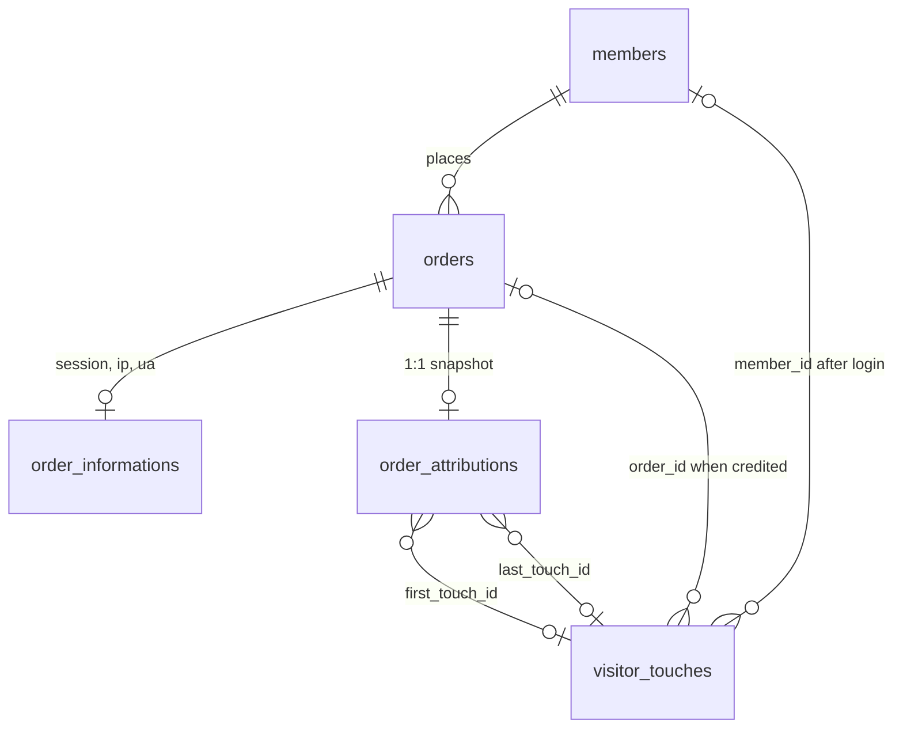

# Google Ads → Order Attribution for goldeneaglecoin.com: Phase 1–2 Implementation Deep Dive

This report explains what was built on 2026-08-19 for ticket GEC-ADS-ATTRIBUTION-001 in the goldeneaglecoin.com monorepo, why each part has the shape it has, and what a reader needs to know to extend it. The work has two halves: a cohort lifetime-value report computed purely from existing order data (Phase 1), and a capture pipeline that records marketing touches (gclid, UTM parameters, referrer) and writes an attribution snapshot onto every new order (Phase 2). Both halves are covered by PHPUnit tests that run through a new self-contained test runner, which is itself a small but consequential part of the delivery because the repository had no working PHP test setup before.

The source ticket lives at `goldeneaglecoin.com/ttmp/2026/08/18/GEC-ADS-ATTRIBUTION-001--google-ads-campaign-to-order-attribution-cac-and-ltv-analysis/` (design doc, investigation diary with Steps 1–12, changelog, tasks). The branch is `task/add-ad-tracking-gec`; nothing in this report is committed yet.

> [!summary]
> 1. **Phase 1 — cohort LTV report.** `CampaignReporting::cohortQuery()` groups customers by the period of their first non-cancelled order and sums revenue/profit of all their later orders, deduplicating customers by e-mail and ignoring the unreliable `orders.first_order` flag. Exposed as `GET /admin/reporting/campaigns/cohorts` and an adminapp page at `/reports/cohorts`.
> 2. **Phase 2 — touch capture and order attribution.** A storefront hook records gclid/UTM/referrer into a first-party cookie and `POST /visit/touch`; `Member::_login()` binds session touches to the member; `CheckoutRest::createOrderFromCart()` writes a last-touch snapshot into `order_attributions`, with cookie fallbacks (`gec_mkt`, Google's `_gcl_aw`) so data exists from day one.
> 3. **Test infrastructure.** PHPUnit 12 in `scripts/testrunner/` (gitignored vendor, `make test`), plus fixes to the stale `misc/schema/*.sql` files so the test database can be created on a strict MySQL 8 server.

## 1. The problem and the shape of the solution

The business wants to know which Google Ads campaigns produce customers, what those customers cost to acquire (CAC), and what they are worth over time (LTV). The investigation that preceded this work (diary Steps 1–4) established three facts that fix the design. First, the database stores order-side facts — totals, costs, status including `CANCELLED`, `placed_at`, the member, and per-order session id / IP / user agent in `order_informations` — but it stores nothing about *how a visitor arrived*: no gclid, no UTM parameters, no referrer, no landing page, in neither the schema nor the code paths nor a production snapshot. Second, tracking today is a single GTM container served from a server-side GTM host plus GA4 purchase events, and that configuration lives outside the repository. Third, there is no Google Ads API integration and no spend table.

These facts split the work. Anything that depends on knowing the campaign for an order requires *new capture*, and capture cannot be backfilled: a click that happened before the capture code shipped is gone, except for whatever Google's own conversion-linker cookie still holds in the visitor's browser. Anything that depends only on orders and customers can be computed *today* over the whole history. The implementation order follows directly: build the order-only report first (it validates the revenue and "new customer" definitions with the business while nothing is at stake), then ship capture as soon as possible (every day without it is data lost), and leave the Google Ads importer, the versioned attribution job and the campaign reports for later phases that depend on credentials the business has not yet provided.



## 2. Phase 1: the cohort LTV report

### 2.1 What a cohort is, precisely

A cohort row answers the question "of the customers whose first counting order fell in period P, how many were there, how much did they spend over their lifetime (or over the first N months), and how many came back?" Three definitions have to be pinned down before the SQL is meaningful, and each of them differs from what a naive reading of the schema would suggest.

**Counting order.** Only orders in status `IN_PROCESS`, `SHIPPED` or `PICKED_UP` count by default. `CANCELLED` orders never count. `NEW` orders (placed but not yet verified or paid) are excluded unless the caller passes `searchWithNew=1`, which mirrors the convention of the existing sales report in `src/reports/Reporting.php`.

**Customer.** The `members` table has one row per registration *and* one row per guest checkout (`MemberGuestRest::memberGuest` creates a member with `email = NULL`, `alternate_email = <address>`, `is_guest = 1`). A human who checks out twice as a guest is two member rows. The report therefore defines a customer as the canonical key

```sql
COALESCE(NULLIF(LOWER(TRIM(m.email)), ''),
         NULLIF(LOWER(TRIM(m.alternate_email)), ''),
         CONCAT('#', m.id))
```

which collapses guest rows and registered rows that share an address, and falls back to the row id for members with no address at all (26,607 such rows exist in the 2026-08-05 production snapshot). This is design decision D6 of the ticket and it is reused verbatim by Phase 2's `isFirstNonCancelledOrder()`.

**First order.** The `orders.first_order` boolean is set in `CheckoutRest::createOrderFromCart()` from `Order::count(member_id = ?) == 0`, which counts cancelled orders. A customer whose first attempt was cancelled and who then ordered successfully has *no* order flagged `first_order`. The report ignores the flag and computes `MIN(placed_at)` over counting orders per canonical customer instead.

**Revenue and profit** come in two flavours because the business spec and the existing sales report disagree. The spec defines revenue as `orders.total` and gross profit as `orders.total - orders.cost`; the sales report defines them from positions as `Σ final_price × quantity` and `Σ (final_price × quantity − position.cost)`, i.e. without shipping, payment fees and taxes. Both are exposed side by side (`revenue`/`profit` and `merch_revenue`/`merch_profit`) so the business can see the difference and choose (decision D5).

### 2.2 The query

The query is a chain of common table expressions. The structure matters for performance: computing "first order per customer" requires a scan of the whole order history regardless of which cohorts are requested, but the per-position aggregation — the expensive part on 489k orders — can be restricted to the orders of the selected cohorts.

```sql
WITH mk AS (                      -- canonical customer key per member
  SELECT m.id member_id, <canonical key expression> ckey FROM members m),
oo AS (                           -- counting orders
  SELECT o.id, o.placed_at, o.total, o.cost, mk.ckey
  FROM orders o JOIN mk ON mk.member_id = o.member_id
  WHERE o.status IN ('IN_PROCESS','SHIPPED','PICKED_UP') AND o.placed_at IS NOT NULL
    AND (o.order_type IS NULL OR o.order_type = 'WEB')),
firsts AS (SELECT ckey, MIN(placed_at) first_at FROM oo GROUP BY ckey),
cohort AS (                       -- only cohorts inside the requested range
  SELECT ckey, first_at, DATE_FORMAT(first_at, '%Y-%m') cohort
  FROM firsts WHERE first_at >= :from AND first_at <= :to),
co AS (                           -- every counting order of a cohort member, optionally within N months
  SELECT c.cohort, c.ckey, c.first_at, o.id, o.placed_at, o.total, o.cost
  FROM cohort c JOIN oo o ON o.ckey = c.ckey
   [AND o.placed_at < DATE_ADD(c.first_at, INTERVAL :n MONTH)]),
opx AS (                          -- positions only for those orders
  SELECT op.order_id, SUM(op.final_price*op.quantity) merch_total, SUM(op.cost) merch_cost
  FROM order_positions op JOIN co ON co.id = op.order_id GROUP BY op.order_id)
SELECT co.cohort _group,
  COUNT(DISTINCT co.ckey) customers, COUNT(co.id) order_count,
  ROUND(SUM(co.total),2) revenue, ROUND(SUM(co.total - co.cost),2) profit,
  ROUND(SUM(opx.merch_total),2) merch_revenue, ROUND(SUM(opx.merch_total - opx.merch_cost),2) merch_profit,
  ROUND(SUM(IF(co.placed_at = co.first_at, co.total, 0)),2) first_revenue,
  ROUND(SUM(IF(co.placed_at = co.first_at, co.total - co.cost, 0)),2) first_profit,
  COUNT(DISTINCT IF(co.placed_at > co.first_at, co.ckey, NULL)) repeat_customers,
  ... per-customer averages, repeat_rate, first_aov
FROM co LEFT JOIN opx ON opx.order_id = co.id
GROUP BY co.cohort ORDER BY <whitelisted sort>;
```

Two properties of this query deserve attention. The date range filters *cohorts* (by first order date), not *orders*: a customer acquired in February 2024 contributes their 2025 orders to the February 2024 row. That is what lifetime value means, and it is the reason the optional `searchLtvMonths` horizon exists — without it, older cohorts always look better than younger ones simply because they have had more time. With `searchLtvMonths=12` every cohort is measured over the same twelve months after acquisition and the rows become comparable.

The second property is that the cohort label and the range comparison operate in different time zones, exactly as the existing sales report does: the range is converted from the employee's time zone to UTC by `MyModel::toMysqlDateTime()`, while `DATE_FORMAT(first_at, …)` labels the raw UTC value. An order at 23:30 local time on the last day of a month is labelled with the next month. The behaviour was kept for consistency with the sales report and is documented rather than corrected.

On the production snapshot the query takes about 8 seconds (13 seconds before moving the position aggregation behind the cohort filter). That is acceptable for an on-demand admin report; a materialised `customer_first_orders` table would be the first optimisation if usage grows.

### 2.3 Parameters, endpoint, and user interface

`CampaignReporting::cohortParams()` normalises the request: `searchDate=YYYY-MM-DD,YYYY-MM-DD` or `searchDateFrom`/`searchDateTo`; `searchGroupBy` ∈ {month, quarter, year, week} (ISO week, `%x-W%v`); `searchOrderType` ∈ {WEB (default), ALL, WHOLESALE, RETAIL}; `searchWithNew`; `searchLtvMonths` 0–240 (0 = lifetime). `sort`/`order` are accepted but only from a whitelist of output column names — the sort key is interpolated into SQL, so the whitelist is the injection guard, not escaping.

`AdminReportingRest::campaignCohorts()` runs the query, adds `id = _group` so the adminapp table has a row key, and applies `min`/`max` pagination with `array_slice` (the result set is at most a few hundred rows, so slicing in PHP is simpler than a second query). A `/count` variant exists because the adminapp table component always requests it. The endpoints sit behind the existing `reports` capability; the design's dedicated `marketing_reports` capability requires an `ALTER TABLE employees … SET(...)` migration and was deferred to the phase that adds sensitive data (click ids) to reports.

The adminapp page (`src/containers/ManageCohortsReport/`) follows `ManageProductsReport`: a filter card (cohort bucket, order type, LTV horizon, first-order timeframe and date pickers defaulting to "January 1st two years ago → today", "include NEW orders") feeding `staticRequestParams` of `useTableCard`, and a `TableCard` with a footer. Each column definition carries a `title` with the metric's definition — the table header renders it as a tooltip — which is the first concrete application of the spec's rule that verified and modelled numbers must always be labelled. Footer averages are weighted (Σ revenue ÷ Σ customers), not means of per-row averages.

### 2.4 What the test proves

`tests/std/campaignReportingTest.php` builds a fixture designed around the three definitions above: Alice with a cancelled January order, a shipped February order, a repeat order in March and one 16 months later; Bob as two guest member rows with the same address in different case and whitespace; Carol with a `NEW` order; Dave with a `WHOLESALE` order. The assertions then check that January is *not* a cohort, that Bob is one customer whose second guest order counts as a repeat, that Carol appears only with `searchWithNew`, that Dave appears only with `searchOrderType=ALL`, that a 12-month horizon drops Alice's late order, that the date range filters cohorts and not orders, that the four bucket formats produce the expected labels, and that the sort whitelist rejects `revenue; DROP TABLE orders`. Eight tests, 106 assertions.

## 3. Phase 2: touches and the attribution snapshot

### 3.1 Where a click id can be observed, and why the client hook won

The design doc (§12.1) compares five capture points: the SPA on the client, the SSR loader, Google's `_gcl_aw` cookie read in PHP, a server-side GTM webhook, and Apache access logs. The client hook was chosen as the primary path because it is the only point that sees everything — the click id, the UTM parameters, the external referrer and the landing page — and because a cookie it writes is sent to PHP on every subsequent REST call, so the data survives even when the fire-and-forget POST is blocked. The `_gcl_aw` cookie was kept as a fallback because it already exists on the browsers of visitors who clicked an ad before this code shipped; it carries only the gclid and a timestamp, but that is enough for last-click Google attribution. The server-side GTM webhook was rejected because its logic would live outside the repository and it cannot see the PHP session; the access logs have no session id and are useful only forensically.

### 3.2 The data model

Two new tables carry the data; a third is reserved for the later attribution job.

| Table | Role | Cardinality | Written by |
|---|---|---|---|
| `visitor_touches` | raw, append-only record of every marketing arrival: `session_id`, `member_id`, `order_id`, `click_id` + `click_id_type` (enum gclid/gbraid/wbraid/msclkid/fbclid/ttclid/other), five `utm_*` columns, `referrer`, `landing_page`, `user_agent`, `ip_address`, `touched_at`, `source` (client / mkt_cookie / gcl_cookie / server) | many per session | `VisitRest`, cookie fallbacks at checkout |
| `order_attributions` | the chosen attribution per order (1:1, like `order_informations`): model, version, window, `first_touch_id`, `last_touch_id`, `touch_count`, denormalised click id / UTMs / referrer / landing of the credited touch, `channel`, `campaign_id` (filled later by click lookups), `is_first_order`, `is_verified`, `attributed_at` | one per order | `OrderAttribution::snapshotForOrder()` |
| `attribution_runs` | audit trail for the nightly re-attribution job (Phase 4) | one per run | not yet |

Raw touches and the chosen attribution are separate on purpose. The spec asks to "preserve the raw touches and clearly identify the selected reporting model"; keeping a denormalised snapshot on the order means reports never have to re-derive which touch was credited, and a later versioned re-attribution can be compared against the synchronous `v0-checkout` snapshot instead of overwriting it silently.



### 3.3 Capture on the client

`sites/gec/app/src/utils/marketingTouch.ts` holds the pure logic so it can be exercised without React; `src/hooks/useMarketingTouch.ts` is the thin effect that runs once per full page load, called from the `Layout` component in `root.tsx` next to the existing `useRefreshTimer`.

`readTouch(href, referrer)` returns `null` for internal navigation and a `Touch` object otherwise. "Internal" means no click-id parameter, no `utm_*` parameter, and a referrer whose registrable domain (last two host labels) equals the current one — so `checkout.goldeneaglecoin.com → www.goldeneaglecoin.com` is internal while `https://www.google.com/` is external. The landing page is rebuilt from the path plus *only* the marketing parameters, so an `email=` or token parameter in the URL is never stored; the referrer keeps origin and path but drops its query. Values are clipped to 255 characters.

When a touch exists, the hook merges it into the `gec_mkt` cookie — `{v:1, first: Touch, last: Touch}`, first kept, last replaced, `Max-Age` 90 days, `SameSite=Lax`, `Secure` on https, `Domain=.goldeneaglecoin.com` derived from the hostname (host-only on `localhost`) — and posts the touch to `/visit/touch` with `credentials: 'include'` so the `PHPSESSID` cookie accompanies it. Both steps are wrapped in `try/catch`; tracking must never break the page.

Two supporting changes: `redirects.ts` now appends `url.search` when redirecting legacy URLs (previously a visitor landing on `/gold-price?gclid=…` was redirected to `/metal-price/gold` *without* the gclid), and the pure functions were verified with a throwaway `node --experimental-strip-types` script (20 assertions) because `sites/gec/app` has no JavaScript unit-test runner yet.

### 3.4 The endpoint and the model

`VisitRest::touch()` is public (no `authorize()` method, which in this REST server means unauthenticated). It passes the body through `VisitorTouch::attributesFromPayload()`, which whitelists keys, trims and length-limits strings, maps an unknown `clickIdType` to `other`, drops a type without an id, and clamps the client timestamp `at` into `[now − 1h, now]` — the client's clock is not trusted but a short delay between page entry and the POST is allowed. The request's IP (forwarded-for first), user agent and the logged-in member, if any, are added server-side, and `VisitorTouch::record()` refuses the 51st touch of a session.

The login binding is one `UPDATE visitor_touches SET member_id = ? WHERE session_id = ? AND member_id IS NULL` in `Member::_login()`. That method is the single point every authentication path reaches — password login, registration (`MemberRest::createMember`), guest checkout (`MemberGuestRest::memberGuest`) and Google sign-in — so one hook covers all four, placed after the existing cart re-binding and wrapped so it cannot fail a login.

### 3.5 The snapshot at order creation

The hook for the order side is the end of `CheckoutRest::createOrderFromCart()`, chosen over `finalizeCart()` because `createOrderFromCart()` is the function shared by the three ways an order is created from a cart: the web checkout, the Plaid background finalisation in `src/lib/Plaid/CartProcessor.php`, and `scripts/helpers/convertToOrder.php`. The last two run without a PHP session, which shapes the first step of the algorithm.

```text
snapshotForOrder(order, cart, cookies):
  sessionIds  = {session_id(), cart.session_id, cart.cart_information.session_id,
                 order.order_information.session_id} minus empties
  window      = config attribution.window_days (default 30)
  touches     = visitor_touches WHERE (session_id IN sessionIds OR member_id = order.member_id)
                  AND touched_at BETWEEN placed_at - window AND placed_at + 5 min
                ORDER BY touched_at, id
  if touches empty and sessionIds non-empty:
      for each touch reconstructed from cookies (gec_mkt first/last, else _gcl_aw):
          touches += VisitorTouch::record(sessionIds[0], attrs, source=mkt_cookie|gcl_cookie)
  first, last = touches[0], touches[-1]
  upsert order_attributions(order_id):
      attribution_model   = last ? 'last_touch' : 'none'
      attribution_version = 'v0-checkout', window_days = window
      first/last_touch_id, touch_count, click id/type, utm_*, referrer, landing  ← from last
      channel             = channelFor(last)          # google_ads, bing_ads, …, organic, referral, direct
      is_first_order      = isFirstNonCancelledOrder(order)
      is_verified         = last has click_id or utm_campaign or utm_source
  mark credited touches with order_id
  (any Throwable → order.log('attribution snapshot failed', …); return null)
```

Three details are easy to get wrong. The five-minute slack after `placed_at` exists because the client posts the touch asynchronously and clocks differ; without it a touch that arrives a second after the order is created is excluded. The upsert (find by `order_id`, `set_attributes`, save) makes the function idempotent, which matters because finalize paths can be retried and because the Phase 4 job will call it again; after saving, the `order_attribution` relationship is removed from the order object so a later `toJSON()` does not serve a stale relation. And the cookie fallback inserts real `visitor_touches` rows (with `source` marking their origin) instead of attributing from the cookie directly, so a later re-attribution sees the same evidence as the synchronous snapshot did.

`isFirstNonCancelledOrder()` is the SQL counterpart of the report's definition: count earlier non-cancelled orders of any member whose `email` *or* `alternate_email` equals this member's address (ties on `placed_at` broken by id); a registered member who later checks out as a guest with the same address is correctly a repeat customer.

`channelFor()` classifies a touch in a fixed order: click-id type first (gclid/gbraid/wbraid → `google_ads`, msclkid → `bing_ads`, fbclid → `meta_ads`, ttclid → `tiktok_ads`); then `utm_medium` in {cpc, ppc, paid, paidsearch, display, pmax, shopping} by `utm_source` (google → `google_ads`, bing/microsoft → `bing_ads`, facebook/meta/instagram → `meta_ads`, else `paid`); `email`/mailchimp → `email`; `affiliate`; any other UTM → `campaign`; a referrer from google/bing/duckduckgo/yahoo/ecosia/brave → `organic`, any other referrer → `referral`; nothing → `direct`. The order encodes confidence: a click id is stronger evidence than a medium string, which is stronger than a referrer.

### 3.6 Exposure to staff

The order JSON gains `orderAttribution` (via `Order::$has_one` and the admin include lists), with booleans cast properly and a human `channelName`. The admin order list gets a hidden-by-default "Channel" column (channel name with `utmCampaign · clickIdType` underneath) and a `searchChannel` filter (`ALL`, a channel slug, or `NONE` for orders without a row), implemented as `Order::search_option_channel()` / `sort_option_channel()` with a LEFT JOIN that is added once even when search and sort both request it. The CSV export learns `channel` and `utmCampaign`.

### 3.7 What the tests prove — and the one they cannot yet

`tests/std/orderAttributionTest.php` (14 tests, 109 assertions) covers the endpoint (record, ignore internal navigation, sanitise and clamp, per-session cap), login binding, the snapshot in each branch (no touches → `none`/`direct`/unverified/first; last of two session touches wins and both are linked to the order; a member touch from another session; window exclusion and widening via `Configuration::SetConfig('attribution.window_days', 90)`; the `gec_mkt` fallback with first=email, last=gclid; the `_gcl_aw` fallback including a malformed value), `isFirstNonCancelledOrder` in the cancelled-first and guest-dedup cases, and the classifier table. One further test drives the real checkout — `PUT member/cart`, `POST member/cart/checkout` with `payment=BANK_WIRE`, `POST member/cart/finalize` — and asserts the snapshot on the resulting order. It is *skipped* with a guard because the test schema's `payment_methods` table lacks `require_verified_email`, which `CheckoutRest::checkoutCart()` reads; the `misc/schema/*.sql` files are stale relative to production. Until that is fixed (ticket task `ud0k`) the evidence that `createOrderFromCart` writes the snapshot is the unit tests plus code reading.

## 4. Test infrastructure: making the suite runnable again

The repository contained 37 PHPUnit-style tests in `tests/std` and `tests/rest` but no PHPUnit: not in `composer.json`, not in the `php:latest` image, not in CI (the workflows deploy, run Chromatic and generate DB dumps). The tests were written for PHPUnit < 8 (`setUp()` without a `void` return type) and `tests/config.test.php` rebuilt the schema from `misc/schema/*.sql` on every test, so they were effectively dormant.

The fix follows the pattern of the TTC repository: `scripts/testrunner/` holds its own `composer.json` requiring only `phpunit/phpunit ^12`, a gitignored `vendor/`, a `phpunit.xml` whose suites point at `../../tests/{std,rest}` with suffix `Test.php`, a `bootstrap.php` that requires `tests/config.test.php`, and a Makefile that installs PHPUnit inside the php container, creates `gec_test`, and runs phpunit there; the root `make test` delegates to it. PHPUnit stays out of the application's `vendor.composer`, so the image bootstrap (`composer.phar install`) is untouched.

Making the first test pass required repairing the schema files, which had evidently not been loaded by anything for years:

| Symptom (MySQL 8.4, strict mode) | Cause | Fix |
|---|---|---|
| `1101 BLOB, TEXT … column 'description' can't have a default value` | `TEXT DEFAULT ''` in several files | `SET SESSION sql_mode=''` on the schema-loading connection (the dev DB runs `mysqld --sql_mode=""`) |
| `1064 … near 'CREATE INDEX rec_recommended_id ON product_recommendations.recommended_id'` | `ON table.column` instead of `ON table (column)` | fixed in `product.sql` (3 indexes) |
| `1064 … near ';\n -- constraints\n FOREIGN KEY (billing_address_id)'` | `order_type … DEFAULT NULL;` with `;` instead of `,` inside `CREATE TABLE orders` | `orders.sql` |
| `1064 … near 'delimiter \|'` | the mysql CLI `delimiter` command inside a file loaded via PDO | trigger rewritten as a single-statement body without `BEGIN … END` |
| `1292 Incorrect datetime value: '… UTC' for column 'created_at'` | the application writes datetimes with a ` UTC` suffix and relies on lenient mode | `sql_mode=''` on the ActiveRecord connection after each reset |
| `Table 'gec_test.solr_jobs' doesn't exist` | `JobQueue::table_exists()` expected `PDO::query()` to return false; PDO throws under PHP 8 | try/catch in `JobQueue.php` |

Two findings about the legacy suite remain open. PHPUnit ≥ 10 derives the class name from the file name when loading a directory, so `checkoutTest.php` declaring `class TestCheckout` reports `Class checkoutTest cannot be found`; the 37 files need their classes renamed. And the `: void` return types were added mechanically (38 files) so the files at least compile. New tests (`CampaignReportingTest` in `campaignReportingTest.php`) are found because PHP class names are case-insensitive.

Because the docker dev stack was not running during this work (and agents must not start it), every PHP run used a throwaway container on the network of an existing MySQL 8.4 container that holds `gec_dev` and a production snapshot:

```bash
docker run --rm --user $(id -u):$(id -g) --network 2026-03-16--gec-rag_default \
  -v "$PWD:/gec" -v ~/code/gec/goldeneaglecoin.com/vendor.composer:/gec/vendor.composer:ro \
  -w /gec/scripts/testrunner --entrypoint sh php:latest \
  -c './vendor/bin/phpunit ../../tests/std/orderAttributionTest.php'
```

with a gitignored `config/config.ini` pointing `[db]`/`[test_db]` at that container. The same container ran `ecs --fix` and the ad-hoc query checks against the snapshot (aggregates only; the snapshot contains real customer data and was never used to develop against).

## 5. Security and privacy properties

The public endpoint accepts anonymous writes. Its guards are structural rather than rate-based: every field is whitelisted and length-capped, the click-id type is an enum, the timestamp is clamped, and a session can hold at most 50 touches. IP-level rate limiting belongs at the Apache/CDN layer if abuse appears. Nothing the client sends is ever interpolated into SQL — php-activerecord binds parameters — and the only SQL interpolation in the new code is the report's sort key, which is whitelisted.

Personal data is minimised at the source: the client strips every non-marketing query parameter from the landing page and the query from the referrer before sending; the server caps lengths but does not re-sanitise, which the diary flags as a possible belt-and-braces addition. Click ids, IP addresses and user agents are personal data under GDPR/CCPA-style regimes; retention (a GC script for touches without orders) and a consent gate for the hook are listed as follow-ups because the site currently has no consent banner.

The Google Ads side (Phases 3–7) is deliberately absent: no credentials exist in the repository, and the design keeps the API scope read-only until offline-conversion upload is separately approved.

## 6. What is not done, and what to do next

- **Apply the migration** `misc/migrations/2026-08-19--marketing-attribution.php` on dev and production, then run the browser end-to-end check from the design (`/?gclid=TEST123&utm_source=google&utm_medium=cpc&utm_campaign=1` → guest checkout → `order_attributions` row, Channel column in admin). This could not be done in the session because the dev stack was down.
- **Business inputs** O3/O4 (tracking template with `{campaignid}`, Google Ads customer id / MCC, OAuth owner) unblock Phase 3, the importer. O1/O2 (access-log retention, GA4 BigQuery export) decide whether any historical attribution is recoverable.
- **Legacy test revival** (`ud0k`): rename test classes to match file names, refresh `misc/schema/*.sql` from `SHOW CREATE TABLE` on dev so the checkout integration test can run, and decide whether to run `make test` in CI.
- **Add vitest** to `sites/gec/app` so the `marketingTouch.ts` checks become a real test.
- **Phase 4 onward**: the nightly job should reuse `OrderAttribution::candidateTouches()` and `VisitorTouch::channelFor()`, write `attribution_run_id`, resolve `campaign_id` via click lookups, and recompute `is_first_order` after cancellations.

## Key points

- The order data answers lifetime-value questions today; campaign questions require capture that started only now and cannot be backfilled, so capture shipped before the importer.
- "Customer" means canonical e-mail, not member row, and "first order" means first non-cancelled order, not `orders.first_order`; both the report and the snapshot use the same definition.
- Raw touches and the chosen attribution are separate tables; the synchronous snapshot is versioned `v0-checkout` so a later model can be compared against it rather than overwrite it.
- One hook in `Member::_login()` and one in `CheckoutRest::createOrderFromCart()` cover every authentication and order-creation path; both are wrapped so they can never break login or checkout.
- The cookie fallbacks (`gec_mkt`, `_gcl_aw`) mean the first attributed orders appear immediately after deployment, including for ad clicks that happened before the code shipped.
- The repository now has a runnable PHPUnit setup; the legacy suite itself still needs its classes renamed and its schema files refreshed.

## Sources

- Ticket: `goldeneaglecoin.com/ttmp/2026/08/18/GEC-ADS-ATTRIBUTION-001--google-ads-campaign-to-order-attribution-cac-and-ltv-analysis/` — `design-doc/01-…intern-guide…md` (design, §11–§20), `reference/01-investigation-diary.md` (Steps 1–12), `changelog.md`, `tasks.md`.
- Code: `src/reports/CampaignReporting.php`, `src/rest/AdminReportingRest.php`, `src/models/VisitorTouch.php`, `src/models/OrderAttribution.php`, `src/rest/VisitRest.php`, `src/models/Member.php` (`_login`), `src/rest/CheckoutRest.php` (`createOrderFromCart`), `misc/schema/{visitor_touches,order_attributions,attribution_runs}.sql`, `sites/gec/app/src/{utils/marketingTouch.ts,hooks/useMarketingTouch.ts}`, `sites/gec/adminapp/src/containers/{ManageCohortsReport,ManageOrders}`, `scripts/testrunner/`.
- Tests: `tests/std/campaignReportingTest.php`, `tests/std/orderAttributionTest.php`.
- Tracking issue: https://github.com/goldeneagle/coinvault/issues/8
