# PULP OS App Loader — Splitting the Monolith and Loading Apps as Source

PULP OS is the JavaScript operating system of the M5Stack PaperS3, an ESP32-S3 device with a 540×960 16-gray e-ink panel, an SD card slot, WiFi, and 8 MB of PSRAM. Before this project, its entire user-facing surface — a launcher and eleven applications — was one 1,125-line ES5 file compiled on a host machine into a single 45 KB MicroQuickJS bytecode image and embedded in the firmware. Changing one line of one app meant recompiling the image and reflashing the device. ESP-55 replaced that arrangement with an operating-system core that stays in the bytecode image and application modules that are plain source files, loaded on demand from flash assets or from the SD card, installable over HTTP in both directions, and listed by a launcher that reads a catalog instead of a hard-coded menu. This report explains the engine constraint that dictated the design, the measurements that sized it, the contracts that implement it, and the four firmware bugs the hardware gates caught along the way.

> [!summary]
> - MicroQuickJS accepts exactly one precompiled bytecode image per context, and only before any source has been evaluated; dynamic apps therefore load as **source text**, through a new native `load(path)` that parses directly from flash or from a PSRAM buffer.
> - The measured cost validates the choice: an app costs roughly 15 ms and 1.4 KB of retained heap per KB of source, against a 192 KiB arena and a panel refresh that costs an order of magnitude more time than the parse.
> - The app is now a value: one file evaluating to `({id, title, subtitle, version, abi, main})`. The same file shape is a flash asset, an SD file, a `curl -T` upload body, and an `http.get` download.
> - A 22-minute soak — 25 launcher cycles, 275 dynamic loads — completed with zero JavaScript exceptions and a flat arena.

## Why this project exists

The monolith failed three operational tests. First, iteration cost: the edit-to-device cycle for a one-line app change was a full bytecode regeneration plus an `idf.py flash`, several minutes of toolchain for a change the engine could evaluate in milliseconds. Second, memory coupling: every app added bytes to one image that lives in internal SRAM — the scarcest memory on the chip — and in the previous ticket (ESP-54) the image growth forced the JavaScript arena from 160 KiB to 192 KiB after an out-of-memory failure at boot. Third, distribution: there was no way to put an app on the device that did not involve the firmware build. A device with an SD card, a web server, and an mDNS name should accept an app the way it already accepted a book or a picture: as a file.

The project therefore had one structural goal — separate the operating system from the applications — and one distribution goal: make `curl -T dice.js http://pulp.local/apps/upload?name=dice` a complete deployment.

## Current project status

All eight planned phases (0 through 7) are implemented and hardware-validated; the ticket `ESP-55-PULP-APP-LOADER` (in `esp32-s3-m5/ttmp/2026/08/17/`) carries a 1,800-line intern guide, a 16-step implementation diary, and the evidence transcripts. The bytecode image shrank from 45,352 to roughly 10.7 KB; internal RAM gained 34.7 KB. Apps load from flash in 15–35 ms and from SD in 13–36 ms after filesystem warm-up. The device seeds its twelve built-in apps to `/sdcard/apps/` on first boot, merges SD manifests over the ROM catalog at every scan, accepts pushed modules over PUT/POST, pulls modules from URLs on its own, and survived the closing soak without a single exception. Three forward phases (a multi-context runtime, a UI-only sandbox stdlib, and a page-script browser) are designed in the guide but deliberately not built.

## The constraint field

One engine fact determined the entire architecture, and it is worth stating precisely. MicroQuickJS loads precompiled bytecode through `JS_LoadBytecode`, which enforces two conditions (`components/mquickjs/mquickjs.c:12943-12961`): the context must contain **zero RAM atoms** — meaning no source of any kind has been evaluated yet, because evaluation interns identifiers — and the context must have a free ROM atom-table slot, of which there are exactly two (`N_ROM_ATOM_TABLES_MAX = 2`), one permanently occupied by the standard library. A context therefore holds at most one bytecode image, loaded before the first eval, forever. Loading a second image at run time fails with `InternalError: too many rom atom tables`; loading any image after the two-line kernel eval fails with `no atom must be defined in RAM`. Both failures were reproduced empirically on a host harness before the design committed to anything.

The consequence divides code into two classes. The **image** is boot-time, singular, and cheap to run (the host measured 0.01 ms and ~8 KB of retained heap for the entire old OS as bytecode, because compiled functions live in the image buffer outside the JS heap). **Source** is loadable at any time, from anywhere, into the same context — the parser ships in the firmware and was already exercised by 22 console probes — but costs parse time and heap. The design follows directly: the OS core (kernel, facade, catalog, loader, launcher, boot — everything that must exist before the SD card is readable and must never fail) remains the one image; applications become source.

Two subordinate constraints shaped the details. The settings store holds sixteen records of `{char key[16]; int32}` — an app catalog cannot live there, which forced file-based manifests. And all JavaScript runs on one owner task with an 8 KiB stack under per-callback deadlines (1 s) — so the loader is synchronous, bounded, and never spawns anything.

## Measurements

Design preceded implementation, and measurement preceded design. A host harness (the firmware's vendored engine plus the host compiler's stubbed stdlib) established ratios; a `js measure` console operation then produced device numbers that matched the host predictions almost exactly.

| Metric (device, 240 MHz Xtensa, 192 KiB PSRAM arena) | Value |
|---|---|
| Whole 45 KB bytecode image: retained heap after GC | 7,496 B |
| dice.js (2,388 B source): eval / transient / retained | 35.4 ms / +24.3 KB / +3.0 KB |
| settings.js (5,447 B source): eval / transient / retained | 80.6 ms / +50.8 KB / +7.5 KB |
| Ten repeated evals with GC between | flat at 17,980 B — zero creep |
| Internal RAM during eval | unchanged (the arena is PSRAM) |

Three conclusions carried the design. First, the rule of thumb is ~15 ms and ~1.4 KB retained per KB of app source, with transient parse cost roughly ten times the retained cost; the largest app parses in 81 ms, well under one e-ink refresh, so launch latency is panel-bound, not parser-bound. Second, the compacting GC genuinely reclaims a discarded app — the flatness measurement is what makes "load, run, drop, load the next" a stable steady state rather than a slow leak. Third, the ESP-54 boot OOM that forced the arena to 192 KiB was a transient during image execution, not steady retention: the whole old OS retains under 8 KB. Steady-state pressure was never the problem; headroom during parse and page construction was.

## Architecture

### The app module contract

An application is one file whose evaluation yields a descriptor object:

```js
// tools/js/apps/dice.js — also /sdcard/apps/dice.js, also a curl upload body
({
  id: 'dice',
  title: 'Dice Tray',
  subtitle: '2d6 coin d20 d%',      // ROM entries may use a function here
  version: 1,
  abi: 2,                            // must equal abiVersion()
  main: function (os, arg) {
    var z = os.state('dice', function () {
      return { mode: '2d6', a: 3, b: 4, big: '', hist: [] };
    });
    /* build pages with the native builder API; register handlers */
  }
})
```

The file is a single parenthesized expression, so evaluating it with the engine's return-value flag yields the object and nothing enters the global scope. The descriptor is self-describing — `id` and `abi` are validated against the file's own claims, not against where it came from — which is what allows the same bytes to arrive as a flash asset, an SD file, or an HTTP body without any wrapper format.

Applications do not call the kernel directly. They receive `os`, a plain object built once by the core: layout chrome (`os.chrome`, `os.hintFooter`), formatting (`os.fmtClock`, `os.pad2`), the live content margin (`os.M`, an ES5 getter over the kernel global), navigation (`os.home()`, `os.launch(id, arg)`), the network helper (`os.netUp`), and state (`os.state(id, init)` — a map that survives app switches, replacing the module-level globals the monolith relied on). The boundary is deliberate: `enter()` — the function that resets the widget tree, the callback registry, and the web routes — is not on the facade, so an application cannot half-reset the system; only the loader crosses that boundary.

### The loader

```js
function launch(id, arg) {
  var e = catalogFind(id);
  if (!e) { errorPage(id, 'not in catalog'); return; }
  RUN.desc = null;
  gc();                                  // old app's functions become garbage
  var desc;                              // BEFORE the parser needs headroom
  try { desc = load(e.src); }            // "rom:dice" or "/apps/dice.js"
  catch (ex) { errorPage(id, 'load failed: ' + ex); return; }
  if (!desc || typeof desc.main !== 'function' ||
      desc.id !== id || desc.abi !== os.abi) {
    errorPage(id, 'bad descriptor'); return;
  }
  RUN.id = id; RUN.desc = desc;
  enter(id);                             // resetTree + OS callbacks + routes
  try { desc.main(os, arg); }
  catch (ex2) { errorPage(id, 'crashed: ' + ex2); }
}
```

The ordering encodes two invariants. The garbage collection runs before the load so the parser never competes with the previous application for arena headroom — the soak showed this keeps the walk at ~126 KB steady instead of the 114 KB-and-climbing drift observed without it. And `enter()` runs only after the descriptor validates, so a file that fails to parse, fails the ABI check, or is missing entirely never destroys the page currently on the panel; the previous screen survives until the error page replaces it. Unloading needs no mechanism at all: `resetTree()` drops every widget and callback, `RUN.desc = null` drops the last reference to the module's functions, and the next collection reclaims them.

`load(path)` is native (`main/app_js.cpp`), replacing a stub that had thrown `"load() not supported"` since the atoms were first generated — which meant implementing it required no stdlib regeneration. It resolves `rom:<id>` against a flash-asset registry (every `tools/js/apps/*.js` is embedded NUL-terminated via `EMBED_TXTFILES`) and parses directly from flash with zero copies; any other path goes through the SD path sanitizer into a lazily allocated 64 KiB PSRAM buffer. Evaluation runs under a 3-second deadline, and because `load` is invoked from inside JavaScript — where a 1-second callback deadline is already armed — the implementation saves and restores the caller's deadline rather than clearing it.

### The catalog

```mermaid
flowchart LR
    subgraph ROM
      RA["ROM_APPS\n(id, title, subtitle, src rom:id)"]
      FA["flash assets\ntools/js/apps/*.js"]
    end
    subgraph SD card
      MJ["/sdcard/apps/id.json\none-line manifests"]
      JS["/sdcard/apps/id.js\nmodules"]
    end
    RA --> M{merge}
    MJ --> M
    M --> C[catalog]
    C --> L[launcher rows]
    C --> LD["launch(id) -> load(src)"]
    LD --> FA
    LD --> JS
    style C fill:#263f2f,stroke:#61a273
```



Listing must not evaluate: the launcher shows a dozen entries without parsing a dozen files. ROM metadata lives in a `ROM_APPS` array in the core; SD metadata lives in one-line JSON manifests next to each module, scanned asynchronously through the files module (a sequential completion chain, since the files module allows one operation in flight). The merge rule gives the card authority: an SD manifest with a matching ABI overrides the ROM entry with the same id — this is how a built-in app is hot-patched without reflashing — with two refinements. Manifests written by the first-boot seeding pass carry a `seed` marker and keep the ROM metadata (a JSON manifest cannot carry the `2048` app's dynamic subtitle function; the seeded entry inherits it from ROM while loading its code from the card). And `settings` is exempt from override entirely, because it is the recovery application: a broken settings patch must never be able to lock the operator out of WiFi repair.

First boot seeds all twelve applications and manifests onto the card through two synchronous natives (`apps.copy`, `apps.writeText`) — synchronous because chaining twenty-four asynchronous file writes through boot's 3-second deadline would be a state machine with no benefit, and each write is single-digit milliseconds.

### HTTP in both directions

```mermaid
sequenceDiagram
    participant Dev as laptop (curl)
    participant H as httpd task
    participant O as owner task (JS)
    participant SD as /sdcard/apps
    Dev->>H: PUT /apps/upload?name=hello
    H->>SD: stream 1 KiB chunks to upload.part
    H->>SD: unlink + rename hello.js, manifest if absent
    H->>O: PostModuleDone(Apps, bytes, err)
    O->>O: apps.received cb -> scanApps -> rebuild launcher
    Dev->>H: GET /apps/run?id=hello
    H->>O: route handoff (request slot + semaphore)
    O->>O: PENDING_LAUNCH='hello'; home tick launches
```

Push reuses the upload pattern established by the ESP-54 image gallery: the httpd task streams the body straight to the card (the third and last sanctioned off-owner SD write path — one directory, plain files, never state files), validates the name against `[a-z0-9_-]{1,24}` and a 32 KiB cap, writes to a `.part` file and renames, and posts one completion event. The owner-side watcher — re-registered by every `enter()`, exactly like the OS web routes, so it survives app switches — rescans and rebuilds the launcher. Hot launch is a separate route that only records a pending id, because a route handler runs under the request slot's lifetime and a 1-second deadline and must not present to the panel; the launcher's own tick performs the launch, and the route answers 409 when any other application is showing.

Pull is the same machinery driven from the device: `installFromUrl` (OS core, so both the Settings URL-keyboard screen and test drivers share it) chains `http.get(url).limit(32768)` into `apps.writeText`, writes a manifest only if none exists, and rescans. The end-to-end gate was deliberately self-referential: a driver app *pushed* over HTTP whose `main` *pulled* a second app from a laptop HTTP server — after which `GET /status` reported the device running an application it had downloaded for itself.

## Four bugs the hardware gates caught

Each phase ended with a device gate, and the gates earned their keep. Four failures were real firmware defects rather than test mistakes; all four are the kind that survive code review and die only under execution.

**The parser reads to a NUL sentinel, not to the length argument.** SD-loaded modules failed with syntax errors positioned *past the end of the file* (`expecting ';' at 1:66` in a 65-byte file; `invalid lvalue at 2:2` in a one-line file). Flash assets worked because `EMBED_TXTFILES` NUL-terminates; every existing `JS_Eval` caller passed C strings. The SD read buffer was not terminated, so the lexer continued into whatever the previous load had left in the shared buffer. The first fix attempt (appending a newline, on an automatic-semicolon-insertion theory) changed the error and thereby disproved itself; the second (`buf[len] = '\0'`) matched the flash-asset contract and held. The contract is undocumented in the engine header; it is now documented at the call site and regression-tested by a probe that writes a file with no trailing terminator.

**The 33rd file in a directory silently vanished.** The files module's listing mailbox held 32 entries. After seeding (24 files), two pushed apps (4 files), probe scratch files, and one pulled app, `/sdcard/apps` reached 33 entries — and the newest manifest, `pulled.json`, was created last, listed last, and dropped without error. The install reported success; the catalog never showed the app. The assumption "32 is fine for v1" was written down during design and failed within hours of the feature existing. The cap is now 64, and probes delete their scratch files.

**`curl -T` sends PUT, and the server accepted only POST.** The design documents used `curl -T` throughout; the wildcard handler registered GET and POST. The first push returned 405. A third wildcard registration (`max_uri_handlers` from 2 to 3) routes PUT through the same dispatch, restricted to the app upload.

**Opening the serial port can wedge the chip in its ROM bootloader.** Unrelated to the loader but the most expensive lesson of the project: on the current host kernel, merely opening `/dev/ttyACM0` asserts DTR/RTS, and the resulting edge sequence left the ESP32-S3 latched in USB download mode — the application console silent while `esptool` still synced instantly (`--before no_reset flash_id` is the five-second diagnostic). The latch survives everything except a power-on reset. No software sequence through the held descriptor recovered it; a physical power cycle did. The repository now carries a hold-open console client (open once, keep the descriptor for all commands) and the README documents the fingerprint: `rst:0x15 (USB_UART_CHIP_RESET), boot:0x0 (DOWNLOAD)`.

## Soak

The closing soak drove the launcher through all eleven applications in a loop for 22 minutes — 25 full cycles, 275 dynamic loads, 274 screen presents — while a poller requested `/status` and `/apps/list` every ten seconds. Zero JavaScript exceptions were recorded; the arena oscillated between 126 KB and 137 KB (garbage-collection steady state, ending at 43 KB after a final collection) and never approached the 192 KiB ceiling. Eleven of 130 HTTP polls timed out while the single-worker httpd waited behind e-ink refreshes; this is the documented ESP-53 serving model, not a regression, but it is the number to watch if the web surface grows.

## What was deliberately not built

The intern guide designs two further stages so the loader would not foreclose them. The **multi-context runtime** (one MicroQuickJS context per application) is feasible — the engine has no global state, each context carries its own arena, atoms, and bytecode-image slot — but requires the binding layer's singleton state (`g_ctx`, the page, hit, dyn-value and callback tables) to move behind a per-context struct; it would make per-app bytecode possible again and would free the interned atoms that accumulate over a context's lifetime. On top of it, the **page-script browser** treats the builder DSL as a transport format: a web server returns a page as a descriptor `({title, main(ui, nav)})`, executed in a context whose standard library shares the ROM atom table but swaps the C function table so every non-UI native throws — the first real sandbox in the system, and the point at which the trust model would finally match "fetched from the network". Both remain paper designs with decision records (R-MULTICTX, R-UISANDBOX, R-PAGESCRIPT) and phased plans (8–10) in the guide.

The current trust model is explicit and narrower: an installed application is operator code with the operating system's full authority. The system bounds time (deadlines), memory (catchable OOM in a fixed arena), and paths (the SD sanitizer denies dot-segments and the state directory), and it never executes an application at boot — a broken module fails at launch, on an error page, with the launcher one swipe away.

## Important project docs

- Ticket workspace: `esp32-s3-m5/ttmp/2026/08/17/ESP-55-PULP-APP-LOADER--*/` — the 1,800-line intern guide (`design-doc/01`), the 16-step diary (`reference/01`), evidence collections (`sources/`), and seven scripts including the host eval harness, the hold-open console client, the push script, and the soak driver.
- Firmware: `/home/manuel/code/wesen/go-go-golems/esp32-s3-m5/0114-papers3-pulp-os` — OS core `tools/js/os/*.js`, apps `tools/js/apps/*.js`, loader native in `main/app_js.cpp`, asset registry `main/js_assets.cpp`, upload route in `main/net_serve.cpp`.
- Bundles on reMarkable: `/ai/2026/08/17/ESP-55-PULP-APP-LOADER/` (guide v1 and v2).
- Commit trail: `4d59929a` (P0 instrumentation) through `168d3a39` (P7 close-out), one commit and one diary step per phase.

## Open questions

- Should `files.list` paginate rather than cap at 64 entries? The launcher, gallery, and library all share the mailbox, and the 32-entry failure mode was silent.
- Should the pushed-manifest title default remain the bare id, or should the loader rewrite manifests from the descriptor after a successful first launch?
- When do Phases 8–10 (multi-context, sandbox, browser) become worth their three-to-seven days — at the first request to run untrusted pages, or earlier, to reclaim interned atoms?

## Near-term next steps

- Expose the `pulp.local/apps` workflow on the device itself (a QR or URL line on the Settings Apps screen).
- Fold the download-mode serial diagnostic into the shared console tooling so other PaperS3 projects inherit it.
- Revisit the 11 timed-out HTTP polls if the web surface grows: options are a second httpd worker or bounding present time while serving.

## Project working rule

> [!important]
> The bytecode image is the operating system and nothing else. Applications are data: one file, one descriptor value, the same bytes whether they arrive from flash, the card, or the network — and the loader validates the descriptor's own claims, never the transport.

## Related KB entries

- [[Research/KB/Projects/esp32]] — the ESP32 project map
- [[PROJ - PULP OS Image Gallery - mDNS Browser Upload and the Bitmap Blit]] — the preceding ticket (ESP-54), whose upload handoff and catalog patterns this project reused
