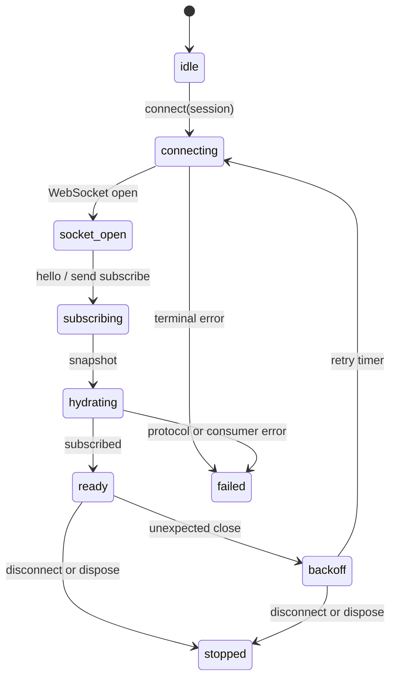
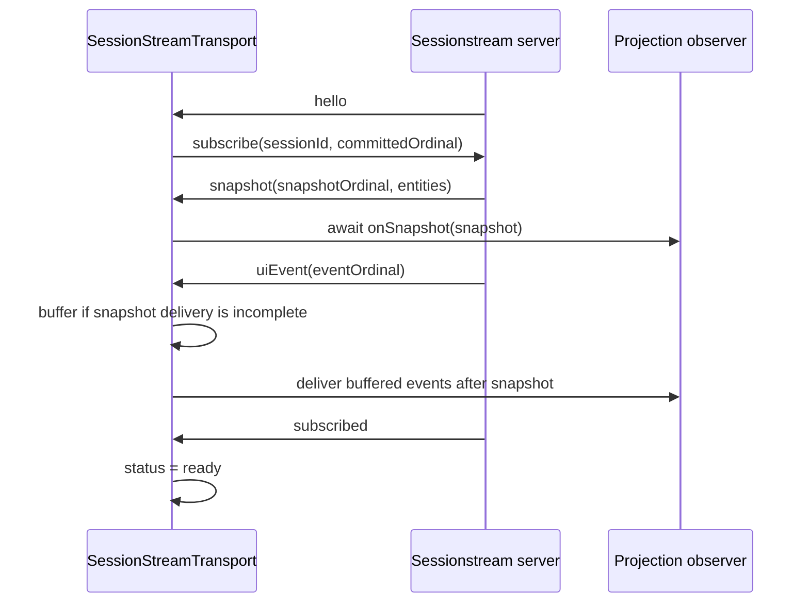

# React Chat: Resilient Sessionstream Transport and RAG-TTC Migration

A chat interface is correct only if it can reconstruct authoritative state, remain subscribed while a run is active, and recover from a failed connection without losing or duplicating projected events. This project moved those guarantees into React Chat's shared `ChatProvider`, then migrated the RAG-TTC Garden Assistant onto that foundation. The work began with a real failure: a Garden Assistant conversation appeared to finish after successful tool events, while the browser reported WebSocket close code `1006`. The investigation showed that connection liveness was only one part of the problem. Protocol typing, readiness, hydration order, resume semantics, projection completion, diagnostics, session ownership, HTTP customization, and attachments all needed explicit contracts.

> [!summary]
> This project established four connected foundations:
> 1. Sessionstream frames now have a strict, bigint-safe protocol boundary.
> 2. WebSocket lifecycle behavior lives in a React- and Redux-independent transport with heartbeat, hydration, reconnect, and committed-cursor semantics.
> 3. `ChatProvider` exposes explicit session, HTTP, attachment, error, and diagnostic contracts instead of consumer-specific behavior.
> 4. RAG-TTC now uses the new source API and serves an embedded production build, while package publication and real-browser reconnect acceptance remain intentionally open.

## Why the original failure required an architectural change

The visible symptom was a premature connection close. A narrow patch could have replied to heartbeat pings in the existing WebSocket manager. That would have addressed one immediate cause, but it would not have defined what the client means by connected, which ordinal is safe to resume from, how snapshot and live events interleave, or whether a consumer failure can silently advance the cursor.

The previous manager combined several responsibilities:

- It owned the browser WebSocket.
- It interpreted sessionstream frames.
- It dispatched Redux mutations.
- It applied timeline adapters.
- It emitted debugging information.
- It participated in session restoration and message submission indirectly.

Those responsibilities have different correctness boundaries. Network lifecycle must be testable without rendering React. Protocol parsing must reject malformed wire data before it reaches projections. Projection success must control cursor advancement. Diagnostics must describe behavior without copying prompts, tool arguments, results, or attachment content. The refactor separated those concerns and made the transport independently testable.

## The protocol boundary

Sessionstream sends protobuf-JSON envelopes such as `hello`, `snapshot`, `uiEvent`, `subscribed`, `ping`, and `error`. The client now normalizes each wire envelope into a discriminated TypeScript union. Unknown frames and missing required fields are protocol errors rather than partially valid objects passed deeper into the application.

The most important scalar is the event ordinal. Server ordinals are unsigned 64-bit values. JavaScript numbers cannot exactly represent every integer above `2^53 - 1`, so the client stores ordinals as branded decimal strings and compares them with `BigInt`:

```ts
export type EventOrdinal = string & {
  readonly __eventOrdinal: unique symbol;
};

export function parseEventOrdinal(raw: unknown): EventOrdinal {
  let text = '';
  if (typeof raw === 'bigint') text = raw.toString();
  else if (typeof raw === 'string') text = raw.trim();
  else if (typeof raw === 'number' && Number.isSafeInteger(raw) && raw >= 0) {
    text = String(raw);
  }
  if (!/^(0|[1-9][0-9]*)$/.test(text)) {
    throw new SessionStreamProtocolError(`invalid event ordinal: ${String(raw)}`);
  }
  return text as EventOrdinal;
}

export function compareEventOrdinals(a: EventOrdinal, b: EventOrdinal): number {
  const left = BigInt(a);
  const right = BigInt(b);
  return left < right ? -1 : left > right ? 1 : 0;
}
```

This representation preserves the server's ordering domain without exposing arbitrary bigint values throughout application code. Encoding is equally strict. A heartbeat response copies the exact nonce received from the server, and a subscribe request carries the last committed decimal-string ordinal.

## The transport state machine

The extracted `SessionStreamTransport` owns the WebSocket lifecycle but knows nothing about React components, Redux stores, timeline entity shapes, or Garden-specific tools. Consumers implement an observer with snapshot, event, status, error, and diagnostic callbacks.



The socket's `open` event is not readiness. At that point the server has not identified the session, supplied a snapshot, or acknowledged the subscription. `connect()` resolves only after the transport has processed `hello`, sent `subscribe`, delivered the snapshot, flushed eligible buffered events, and received `subscribed`. A caller that awaits `connect()` therefore receives a usable session projection rather than a raw TCP/WebSocket condition.

The state model also distinguishes intentional shutdown from network failure. `disconnect()` and `dispose()` cancel reconnect timers, invalidate callbacks, close the socket, and move to `stopped`. An unexpected close moves to `backoff` and schedules a bounded retry.

## Heartbeats and exact nonce preservation

The server sends ping frames to detect clients that are no longer processing traffic. The transport responds immediately through the codec:

```ts
case 'ping':
  this.send(this.codec.encodePong(frame.nonce));
  this.observer?.onDiagnostic?.({ type: 'heartbeat-pong-sent' });
  return;
```

There is no application-layer interpretation of the nonce. The response preserves it exactly, including characters that require JSON escaping. Fake-WebSocket tests verify one pong per ping and compare the serialized frame. This matters because a heartbeat implementation that generates a replacement nonce or responds more than once can still look active in browser logs while violating the server contract.

## Hydration before live projection

A reconnect does not begin from an empty client. The server sends an authoritative snapshot, and live events can arrive around the hydration boundary. The transport serializes frame processing through a promise queue so asynchronous projection callbacks cannot reorder snapshot and event delivery.



The hydration buffer is bounded by frame count and approximate byte count. The defaults are 1,000 frames and 4 MiB. Exceeding either limit terminates the connection with a `buffer-overflow` error instead of allowing unbounded memory growth during a slow or stalled projection.

After snapshot delivery, the transport drops buffered events at or below the snapshot ordinal and delivers later events in stable order. Stability is required because several events published in one server batch can share the same ordinal. Sorting only by ordinal would permit same-ordinal events to change relative order. Each buffered event therefore carries an insertion counter used as the secondary sort key.

## Resume means committed delivery

The resume cursor is not the largest ordinal observed on the wire. It is the largest ordinal successfully delivered to the consumer. The distinction prevents silent loss.

```ts
private async deliverEvent(frame: UIEventFrame): Promise<void> {
  await this.observer?.onEvent(frame);
  if (compareEventOrdinals(frame.ordinal, this.committedOrdinal) > 0) {
    this.committedOrdinal = frame.ordinal;
  }
}
```

If a timeline adapter throws while applying an event, the cursor does not advance. The connection fails rather than acknowledging state the application never incorporated. On reconnect, subscribe uses the committed cursor.

The current server treats `sinceSnapshotOrdinal` as advisory: every subscription still receives a fresh snapshot followed by buffered/live events and the subscription acknowledgement. The client therefore does not implement a speculative replay protocol. Its correctness comes from accepting a new snapshot, rejecting pre-snapshot duplicates, preserving post-snapshot order, and tracking successful consumer delivery. A future server replay feature can extend this contract without changing the meaning of committed delivery.

## Generation-safe reconnect

Closing one WebSocket does not synchronously erase every callback already queued by the browser. A callback from an old socket can arrive after a replacement socket has been created. The transport prevents stale work with two checks:

```ts
private isCurrent(generation: number, socket: WebSocketLike): boolean {
  return generation === this.generation && socket === this.socket;
}
```

Every new connection generation increments a counter. Event handlers capture both that generation and the socket instance. A handler is valid only when both still match current state. This blocks an old close handler from scheduling another reconnect and blocks an old message handler from mutating the new session projection.

Reconnect uses capped exponential delay with injected randomness:

```text
rawDelay = min(maxDelay, baseDelay * 2^attempt)
jitter   = 1 - ratio + random() * ratio * 2
delay    = round(rawDelay * jitter)
```

The defaults begin at 250 ms, cap at 10 seconds, apply 20 percent jitter, and stop after eight attempts. Timers and randomness are platform dependencies, so tests advance a fake clock and assert exact retry transitions without sleeping.

## ChatProvider became an application boundary

The shared transport is consumed through a thin `WsManager`. The manager supplies observers that apply snapshots and UI events to the existing timeline adapters and Redux store. It does not reimplement socket behavior. This preserves ChatProvider's projection model while making network semantics reusable by a non-Redux client later.

The public client was expanded at the same boundary. Message submission now accepts a structured request:

```ts
await client.send({
  prompt,
  attachments: attachmentRefs,
});
```

This removes the need to add another breaking overload when attachments are used. `client.attachments.upload(file)` posts multipart data and returns a normalized `ChatAttachmentRef`; `remove(id)` deletes it. The upload boundary accepts both camel-case and protobuf-style snake-case response fields because that normalization belongs at the HTTP edge, not in composers.

HTTP customization is operation-oriented. A consumer can inject `fetch`, dynamic headers, and a `beforeRequest(operation)` callback. Operations distinguish session creation, message submission, stop, tool manifest synchronization, tool results, and attachment mutations. This is sufficient for authorization and lease-refresh behavior without importing a middleware framework into the package.

Session restoration is now declarative:

```ts
type SessionPolicy =
  | { restore: 'never' }
  | { restore: 'local-storage'; storageKey?: string }
  | {
      restore: 'url';
      parameter?: string;
      fallback?: { restore: 'never' } | {
        restore: 'local-storage'; storageKey?: string
      };
    };
```

The Garden Assistant selects `{ restore: 'never' }`. It no longer removes local-storage keys imperatively while ChatProvider may be restoring them. The policy makes ownership explicit and testable.

## Diagnostics without transcript duplication

Debugging the original failure required lifecycle and tool information, but logging entire frames would create a second store of prompts, tool inputs, tool results, and attachment metadata. The new default diagnostic stream contains metadata only:

- lifecycle transitions and reconnect delays;
- frame type, ordinal, and serialized size;
- heartbeat response occurrence;
- resume cursor and hydration buffer depth;
- snapshot entity identity and adapter mapping;
- UI-event name, message ID, tool-call ID, tool name, status, and adapter name.

RAG-TTC's developer logging now filters for tool lifecycle events and prints only those selected fields. The old debug overlay behavior that reconstructed timeline content from raw diagnostic mutations was removed. Safe diagnostics and full transcript reconstruction are conflicting requirements. A future privileged recorder would need a separate, explicitly unsafe interface and storage policy.

## RAG-TTC migration

The Garden Assistant source migration was small because the shared boundary absorbed the difficult behavior. The composer changed from `send(prompt)` to `send({ prompt })`. The provider shell chose the non-restoring session policy and retained developer-only tool diagnostics in sanitized form. Its WebSocket test double changed more substantially: tests now complete the actual `hello -> subscribe -> snapshot -> subscribed` handshake rather than treating `open` as ready.

The frontend was rebuilt and copied into `cmd/ttc-garden/static`, which is embedded by the Go binary. The real provider runtime was restarted in tmux at `http://127.0.0.1:8080/` using:

- profile `ttc-live-luna-low`;
- full-corpus bundle `rk-2b0b331202f55eadcd1b485720a9cbc2`;
- 3,149 documents, 17,753 chunks, and 35,506 representations;
- durable timeline and turn databases under `/home/manuel/.cache/rag-ttc/garden`.

The runtime needed `GOWORK=off`. The surrounding multi-repository workspace contained a newer Ragkit checkout whose `Bundle` API no longer matched RAG-TTC's pinned code. Disabling workspace resolution selected the versions declared by RAG-TTC's module. The bundle argument also had to remain relative to the repository root; a repository-local `.cache/rag-ttc` symlink resolves to the requested user cache while satisfying that containment rule.

## Verification strategy

The implementation uses deterministic tests for failure cases that are difficult to reproduce reliably with a live socket. The transport suite covers:

- exact heartbeat pong behavior;
- readiness only after snapshot and subscription acknowledgement;
- bounded hydration buffering;
- stable same-ordinal event delivery;
- committed cursor reuse on reconnect;
- stale callback rejection;
- no reconnect after intentional disconnect;
- observer rejection without cursor advancement;
- bigint ordinals above JavaScript's safe integer range;
- malformed frame rejection.

Repository-level results were:

| Repository or package | Validation | Result |
|---|---|---|
| React Chat | Recursive TypeScript typecheck | Passed |
| React Chat | Unit tests | 45 tests in 9 files passed |
| React Chat | Workspace production build | Passed |
| Garden frontend | Typecheck | Passed |
| Garden frontend | Unit tests | 47 tests in 13 files passed |
| Garden frontend | Vite production build | Passed, 389 modules transformed |
| RAG-TTC | `GOWORK=off go test ./...` | Passed across the repository |
| Ticket documentation | `docmgr doctor` | Passed |

Two validation paths remain incomplete. The real-browser harness failed first because Playwright was resolved from the wrong package, then because the assumed textarea selector did not become visible. Work stopped after the second attempt under the repository debugging rule. The package tarball smoke command also failed twice because Node's `execFile` reported `spawn npm ENOENT` even though npm resolved in the parent shell. Neither failure was hidden by a workaround.

## Failure modes the design now handles

| Failure | Required behavior |
|---|---|
| Server sends a heartbeat ping | Send exactly one pong with the same nonce. |
| Socket opens but hydration is incomplete | Keep `connect()` pending and expose a non-ready state. |
| Live events arrive while snapshot projection runs | Buffer them within fixed limits, then flush after snapshot delivery. |
| Multiple events share an ordinal | Preserve their original arrival order. |
| Projection rejects an event | Do not advance the committed ordinal; fail the connection. |
| Old socket emits after replacement | Ignore it through generation and identity checks. |
| Socket closes unexpectedly | Retry with bounded exponential backoff and jitter. |
| Client disconnects intentionally | Cancel timers and never reconnect. |
| Diagnostic observer is enabled | Emit metadata without prompts, arguments, results, or raw frames. |
| Ordinal exceeds `Number.MAX_SAFE_INTEGER` | Preserve and compare it as a decimal string through `BigInt`. |

## Current project status

The transport implementation, ChatProvider API changes, RAG-TTC source migration, embedded production build, automated suites, and real full-corpus server restart are complete and committed. The Garden server is running in tmux session `rag-ttc-garden-real`.

The cutover is not yet release-complete. RAG-TTC's tracked package manifest still references the previously published ChatProvider version `0.2.1`. Local validation used a node_modules-only link to the new React Chat source; that machine-local link was not committed. Publishing a new ChatProvider version must happen before the RAG-TTC manifest and frozen lockfile can be updated reproducibly.

## Important implementation files

React Chat:

- `/home/manuel/workspaces/2026-08-12/deploy-dev-indexer/react-chat/packages/chat-provider/src/ws/protocol.ts`
- `/home/manuel/workspaces/2026-08-12/deploy-dev-indexer/react-chat/packages/chat-provider/src/ws/sessionStreamTransport.ts`
- `/home/manuel/workspaces/2026-08-12/deploy-dev-indexer/react-chat/packages/chat-provider/src/ws/sessionStreamTransport.test.ts`
- `/home/manuel/workspaces/2026-08-12/deploy-dev-indexer/react-chat/packages/chat-provider/src/ws/wsManager.ts`
- `/home/manuel/workspaces/2026-08-12/deploy-dev-indexer/react-chat/packages/chat-provider/src/core/createChatClient.ts`

RAG-TTC:

- `/home/manuel/workspaces/2026-08-12/deploy-dev-indexer/rag-ttc/apps/customer/web/packages/ttc-garden-assistant/src/features/chat/TtcChatProviderShell.tsx`
- `/home/manuel/workspaces/2026-08-12/deploy-dev-indexer/rag-ttc/apps/customer/web/packages/ttc-garden-assistant/src/features/chat/TtcChatComposer.tsx`
- `/home/manuel/workspaces/2026-08-12/deploy-dev-indexer/rag-ttc/apps/customer/web/packages/ttc-garden-assistant/src/features/chat/TtcChatProviderShell.test.tsx`

Design and implementation record:

- `/home/manuel/workspaces/2026-08-12/deploy-dev-indexer/react-chat/ttmp/2026/08/18/REACT-CHAT-TRANSPORT-001--converge-chatprovider-websocket-transport-and-migrate-rag-ttc/design-doc/02-complete-chatprovider-transport-foundation-intern-implementation-guide.md`
- `/home/manuel/workspaces/2026-08-12/deploy-dev-indexer/react-chat/ttmp/2026/08/18/REACT-CHAT-TRANSPORT-001--converge-chatprovider-websocket-transport-and-migrate-rag-ttc/reference/01-investigation-diary.md`

## Near-term next steps

1. Diagnose the package smoke subprocess environment and run a clean package tarball validation.
2. Choose and publish the next ChatProvider version through the repository's guarded npm workflow.
3. Update RAG-TTC's package manifest and frozen lockfile to the published version, remove the local validation link, and repeat typecheck, tests, and build.
4. Run the real Garden UI for more than three server heartbeat intervals and capture the connection states.
5. Execute a real tool/widget response, force one network disconnect, and verify snapshot hydration plus resume behavior after reconnect.
6. Record the consumable version in the CoinVault handoff issue before migrating CoinVault's copied transport implementation.

## Project working rules

> [!important]
> A WebSocket `open` event is not application readiness. Resolve readiness only after authoritative hydration and subscription acknowledgement.

> [!important]
> Advance a resume cursor only after consumer delivery succeeds. Observing an event is not the same as committing it.

> [!important]
> Keep diagnostics metadata-only by default. Content-bearing recording requires a separate explicit boundary.

> [!important]
> Do not commit machine-local package links. Publish the shared package, then update downstream manifests and lockfiles together.
