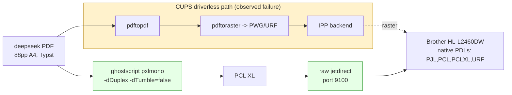

# Bypassing a Broken CUPS Driverless Filter Chain

A blank page from a printer is not a single failure. It is the output of a pipeline in which a source document is transformed through several filters into a page description language, transported to a printer, and rendered onto paper by a marking engine. Each stage can fail, and the failure is not always at the stage that emits the error. The CUPS log entry `cfFilterPDFToPDF: ... Broken pipe` names the PDF normalization filter, but a broken pipe means the process that read the pipe closed it, which means the failure is downstream of the filter that the message names. Diagnosing the blank pages therefore requires reproducing each filter in isolation before assigning blame.

This report documents the attempt to print an 88-page Typst-generated PDF to a Brother HL-L2460DW laser printer, the blank and corrupted pages the CUPS pipeline produced, the local reproduction that ruled out the named filter as the cause, and the bypass that removes the failing pipeline from the path entirely. The bypass converts the PDF to PCL XL with Ghostscript and delivers the result over the printer's raw jetdirect socket, so no CUPS filter runs at all. The analysis is durable: the failure mode is not specific to this PDF or this printer, and the bypass generalizes to any CUPS driverless queue whose filter chain misrenders a document.

> [!summary]
> - The target printer, a Brother HL-L2460DW, advertises only `PJL, PCL, PCLXL, URF` as page-description languages; it does not render PDF natively. CUPS must rasterize, and the driverless queue uses the OpenPrinting `cups-filters` chain.
> - Printing the 88-page Typst PDF through CUPS produced blank pages with corrupted content on the first page. The CUPS log blamed `cfFilterPDFToPDF` with a `Broken pipe` message.
> - Running the filters in isolation—`pdftopdf` then `pdftoraster`—both succeeded, producing a valid 88-page PDF and a valid 88-page PWG raster. The named filter is not the cause; the broken pipe is a downstream cascade from the printer stopping the job.
> - The bypass generates PCL XL with `gs -sDEVICE=pxlmono` and sends it over the printer's raw jetdirect socket on port 9100 with `nc`. No CUPS filter runs, so the misrendering filter is never invoked.
> - The printer's IPP supply attributes reported an empty toner and an empty tray, which is inconsistent with the operator's physical observation and is treated as stale or cached state rather than ground truth.

## 1. The printing pipeline and where it can fail

A CUPS print job is a chain of filters connected by pipes. For a PDF submitted to a driverless IPP queue, the chain is roughly:

```text
application/pdf  -->  pdftopdf  -->  pdftoraster  -->  IPP backend  -->  printer
(normalize)            (rasterize to PWG/URF)        (transport)        (mark)
```

`pdftopdf` normalizes the input PDF: it applies media selection, scaling, duplex imposition, n-up, and booklet ordering, and emits a normalized PDF. `pdftoraster` converts that normalized PDF into a CUPS raster in the format the printer advertises—here, PWG raster or Apple Raster (URF). The IPP backend transports the raster to the printer over IPP, and the printer's marking engine renders the raster onto paper.

Each stage has its own failure signature. If `pdftopdf` fails, the job typically errors with a filter exit code and no pages print. If `pdftoraster` fails, the raster stream is truncated or empty, and the printer prints blank pages because it received a valid raster container with no image data. If the IPP backend fails, the job errors with a transport message. If the printer's marking engine fails—empty toner, empty tray, a worn drum—the printer prints blank pages or pages with corrupted content, and the transport layer may break the pipe back upstream as it stops accepting data.

The critical point is the direction of causation when a pipe breaks. A CUPS filter writes its output to a pipe connected to the next filter's input. If the next filter exits, the write fails with `SIGPIPE`, and the writing filter logs a broken pipe. The filter that logs the error is upstream of the filter or process that caused the pipe to close. A log message naming `cfFilterPDFToPDF: ... Broken pipe` therefore indicates that the rasterizer or the backend downstream of it stopped reading, not that the PDF normalization failed. This single distinction inverts the naive reading of the log.

## 2. The system under test

The target device and the queue CUPS had built for it:

```text
Printer:        Brother HL-L2460DW
Hostname:       BRWA83B7601DB19.local
Address:        192.168.0.18
Native PDLs:    PJL, PCL, PCLXL, URF  (from printer-device-id)
IPP formats:    application/octet-stream, image/urf, image/pwg-raster
Queue name:     Brother_HL_L2350DW_series  (driverless, cups-browsed)
Queue URI:      implicitclass://Brother_HL_L2350DW_series/  (stale; repaired to ipp://192.168.0.18/ipp/print)
Queue PPD:      cupsFilter2: "application/vnd.cups-pdf application/pdf 0 -"
```

The queue was created by `cups-browsed`, the daemon that discovers IPP printers on the network and auto-provisions driverless queues. The queue name carries a different model number (`HL-L2350DW`) than the device (`HL-L2460DW`) because the daemon derived the name from theBonjour advertisement, not from a configured driver. The queue's PPD contains a single `cupsFilter2` directive that routes PDF through the OpenPrinting filter chain rather than through a vendor driver.

The source document:

```text
File:     ~/Downloads/deepseek-category-theory.pdf
Title:    A Programming Paradigm for Spatiotemporal Composability
Authors:  Yifan Shi, Wei Zhang, Tianyi Cui (Peking University / DeepSeek-AI)
Pages:    88
Size:     A4 (595.276 x 841.89 pts)
Producer: Typst 0.15.1
```

The document is the DeepSeek paper on spatiotemporal composability and the Cordis meta-framework for agent harnesses. Its origin in Typst matters: Typst emits a compact, modern PDF whose internal structure differs from the LaTeX- or Word-generated PDFs the CUPS filter chain is most exercised against. Filter bugs often surface on the structural outliers, not the common cases.

The software stack:

```text
cups                   2.4.7-1.2ubuntu7.14
cups-filters           2.0.0-0ubuntu4.1     (OpenPrinting cf filters)
cups-browsed           2.0.0-0ubuntu10.3
ghostscript            10.02.1
printer-driver-brlaser 6-3build2            (installed, unused by the driverless queue)
```

## 3. The observed failure

The queue was initially disabled with a stale device URI (`implicitclass://`) left over from an earlier session in which the printer was unreachable. The repair sequence was straightforward: re-point the URI at the live IPP endpoint, re-enable the queue, accept jobs, and cancel three stale jobs that had accumulated from April and August while the printer was off.

```text
lpadmin -p Brother_HL_L2350DW_series -E -v ipp://192.168.0.18/ipp/print
cupsenable Brother_HL_L2350DW_series
cupsaccept Brother_HL_L2350DW_series
cancel -a Brother_HL_L2350DW_series
```

With the queue repaired, the PDF was submitted with the duplex options the printing skill documents as verified:

```bash
lp -d Brother_HL_L2350DW_series \
  -o sides=two-sided-long-edge \
  -o Duplex=DuplexNoTumble \
  ~/Downloads/deepseek-category-theory.pdf
```

The job accepted (id `Brother_HL_L2350DW_series-170`) and the printer reported `Connected to printer`. The output was blank pages, with corrupted, noise-like content on the first page. The operator's description was precise: the first page had random noise consistent with a `pdftopdf` artifact, and the remainder were blank.

The CUPS error log carried the entry that named the suspected filter:

```text
cfFilterPDFToPDF: Exception: qpdf output: Pl_StdioFile::write: Broken pipe
```

The entry is real, but its direction of causation is the opposite of the naive reading. Section 1 established that the filter that logs a broken pipe is upstream of the process that closed the pipe. The message names the PDF-to-PDF filter; the pipe broke because the rasterizer downstream of it stopped reading; the rasterizer stopped reading because the transport or the printer stopped accepting data. The message is a symptom, not a cause.

## 4. Reproducing the filter chain locally

To separate the filter chain from the spooler, each filter was run standalone with the same arguments CUPS would pass: job ID, user, title, copy count, PPD-derived options, and the input file on stdin or as a path. This is the CUPS filter invocation contract, and it lets a filter be tested without submitting a job.

### 4.1 The PDF normalization filter in isolation

The first filter, `pdftopdf`, was run with the duplex and media options:

```bash
/usr/lib/cups/filter/pdftopdf 1 manuel "repro" 1 \
  "sides=two-sided-long-edge media=iso_a4_210x297mm" \
  ~/Downloads/deepseek-category-theory.pdf > /tmp/repro-pdftopdf-out.pdf
```

The result:

```text
pdftopdf exit: 0
stdout PDF size: 2919699 bytes
Pages: 88
Page size: 595.276 x 841.89 pts (A4)
first-page text: "A Programming Paradigm for Spatiotemporal Composability ..."
```

The filter produced a valid 88-page A4 PDF of 2.9 megabytes, with the title text present on page one. Its debug log reported the correct crop box for every page:

```text
DEBUG: cfFilterPDFToPDF: After Cropping: 595.275574 841.889771 595.275574 841.889771
```

The PDF normalization filter is not the cause. It does not crash, it does not truncate, and it does not corrupt the content. The `Broken pipe` in the live log is a consequence of the downstream stage closing the pipe, exactly as the direction-of-causation analysis predicted.

### 4.2 The rasterizer in isolation

The second filter, `pdftoraster`, was run on the valid PDF the first filter produced, with the driverless raster format set explicitly:

```bash
PPD=/etc/cups/ppd/Brother_HL_L2350DW_series.ppd \
CUPS_RASTER_FORMAT=pwgraster \
/usr/lib/cups/filter/pdftoraster 1 manuel "repro" 1 \
  "sides=two-sided-long-edge media=iso_a4_210x297mm print-scaling=auto" \
  /tmp/repro-pdftopdf-out.pdf > /tmp/repro-raster.out
```

The result:

```text
pdftoraster exit: 0
raster output size: 2851770244 bytes (2.85 GiB)
raster magic: 3353 6152  ("3SaR" — PWG raster magic)
pages processed: 1 through 88, each "Pixel dimensions: 4757x6812"
```

The rasterizer produced a valid PWG raster covering all 88 pages at the device resolution, with a recognizable magic number. Each page's pixel dimensions and bounding box were reported correctly. The rasterizer is not the cause either, when run in isolation on valid input.

### 4.3 What the reproduction establishes and what it leaves open

The reproduction establishes that neither filter crashes or corrupts content when run in isolation on this PDF. This narrows the cause to one of three remaining candidates, none of which the standalone reproduction can distinguish:

1. **A pipeline interaction.** The failure may occur only when the two filters and the IPP backend run together under CUPS, driven by the driverless PPD, with live transport backpressure. The standalone runs do not exercise the IPP backend and do not model a printer that stops mid-stream.
2. **The printer's raster interpreter.** The Brother renders PWG or URF raster into marks. A raster stream that is valid by structure can still be misrendered if the printer's firmware mishandles a specific tile, color space, or resolution header—producing the noise-on-page-one symptom the operator described.
3. **The marking engine.** Empty or low toner, or an empty tray, produces blank pages while the entire software pipeline reports success. The printer then stops accepting data, which is what breaks the pipe back upstream into the `pdftopdf` log.

Candidate 3 is the one the printer's own IPP attributes support, and it is the one the operator's physical observation contradicts. Section 8 treats that contradiction directly.

## 5. The bypass: remove the failing pipeline

The reproduction could not pin the failure to a single stage, but it did not need to. The printer advertises PCL XL as a native page-description language. A path that delivers PCL XL directly to the printer uses a rasterizer the CUPS chain does not invoke—Ghostscript's `pxlmono` device—and a transport the CUPS backend does not use—the raw jetdirect socket on port 9100. The entire failing pipeline is bypassed, not debugged.

The bypass has three properties that make it a reliable diagnostic and a usable production path.

It uses a different rasterizer. The CUPS chain rasterizes with `pdftoraster`, which delegates to the OpenPrinting `cf` library and emits PWG or URF raster. The bypass rasterizes with Ghostscript's `pxlmono` device, which emits PCL XL directly. If the failure is in the PWG rasterizer or the printer's PWG interpreter, the bypass cannot reproduce it, because it does not use that rasterizer or that interpreter.

It uses a different transport. The CUPS chain transports raster over IPP with the `ipp` backend, which negotiates with the printer and can stop mid-stream on a printer-side error. The bypass transports PCL XL over a raw TCP socket on port 9100, the legacy jetdirect port, which is a byte stream with no negotiation. If the failure is in the IPP transport's error handling, the bypass does not exercise it.

It uses a format the printer renders natively. PCL XL (PCL6) is in the printer's advertised `CMD:PJL,PCL,PCLXL,URF` string. The printer's interpreter for PCL XL is the same firmware path it uses for any PCL6 job, exercised by drivers and direct submissions alike. There is no driverless raster interpretation in the path at all.



The diagram states the decision in its simplest form: the bypass does not try to fix the yellow path. It replaces it with the green path, which uses none of the components the yellow path uses between the PDF and the printer.

## 6. Generating PCL XL with Ghostscript

The conversion command for the two-page test, sized for the Letter tray the operator loaded, with fit-to-page and long-edge duplex:

```bash
gs -q -dNOPAUSE -dBATCH -dSAFER \
  -sDEVICE=pxlmono -r600x600 \
  -sPAPERSIZE=letter -dPDFFitPage \
  -dFirstPage=1 -dLastPage=2 \
  -dDuplex -dTumble=false \
  -sOutputFile=/tmp/deepseek-pcl-test-letter.pxl \
  ~/Downloads/deepseek-category-theory.pdf
```

Each flag does specific work.

`-sDEVICE=pxlmono` selects the PCL XL mono output device. The `mono` variant emits grayscale PCL XL, which is what a single-function black laser expects; the color variant would embed color planes the printer cannot mark.

`-r600x600` sets the raster resolution to 600 dots per inch, matching the Brother's advertised `RS300-600-1200` resolution range. Higher resolution increases fidelity and file size; 600 is the sane default for text on this device.

`-sPAPERSIZE=letter -dPDFFitPage` sizes the output to Letter and scales each page to fit. The source PDF is A4. Without `PDFFitPage`, the A4 content would be clipped to the Letter page geometry; with it, the A4 pages are scaled to fit the Letter sheet, which is the correct behavior when the loaded tray is Letter and the document is A4.

`-dDuplex -dTumble=false` requests two-sided printing with long-edge binding. `Tumble=false` is long-edge (booklet) binding; `Tumble=true` is short-edge (calendar) binding. These map directly to the CUPS `sides=two-sided-long-edge` and `Duplex=DuplexNoTumble` options the printing skill verified.

`-dFirstPage` and `-dLastPage` restrict the output to a page range, which lets a two-page diagnostic be generated and sent before committing 88 pages.

The output is a well-formed PCL XL job. It begins with a PJL header and ends with the Universal Exit Language (UEL) closer:

```text
header:  1b 25 2d 31 32 33 34 35 58 40 50 4a 4c ...   <- "%-12345X@PJL ..."
trailer: ... 1b 25 2d 31 32 33 34 35 58              <- "%-12345X"
```

The PJL header sets `RENDERMODE=GRAYSCALE` and `RESOLUTION=600`, which lets the printer auto-configure its marking engine for the job. The UEL trailer returns the printer to its ready state, so a following job is not concatenated into this one. A missing trailer is a common cause of "the next job prints on the back of the last page" symptoms, and its presence is one of the cheap correctness checks for a generated PCL XL file.

## 7. Delivery over the raw jetdirect socket

The jetdirect protocol is a raw TCP byte stream on port 9100. The printer accepts whatever bytes arrive and interprets them according to the PJL header. There is no IPP negotiation, no job creation, no attribute exchange. The delivery is a single command:

```bash
nc -w 30 192.168.0.18 9100 < /tmp/deepseek-pcl-test-letter.pxl
```

`nc` opens a TCP connection to port 9100, streams the file, and closes. The `-w 30` timeout gives the printer 30 seconds to accept the connection; a printer that is off or unreachable fails fast with a connection error rather than hanging.

This transport is deliberately simpler than IPP, and that simplicity is the point. An IPP submission goes through Create-Job, Send-Document, and attribute validation, any of which can fail in ways that break the upstream pipe and log misleading errors. The raw socket either accepts the bytes or does not. When the goal is to determine whether the printer can render the document at all, the raw socket removes every variable except the document and the printer.

The tradeoff is operational, not technical. A raw jetdirect submission bypasses CUPS job tracking, so the job does not appear in `lpstat`, cannot be cancelled through CUPS, and is not retained for reprinting. For a one-shot print of a known document this is acceptable. For a managed print environment with accounting and retries it is not, and the correct fix there is to repair the CUPS queue so its own filter chain works.

## 8. The supply-state reading and its ambiguity

The printer's IPP attributes, queried during diagnosis, reported:

```text
printer-state:           stopped
printer-state-reasons:   media-empty-error, media-needed-error, toner-low-warning
marker-names:            BK
marker-types:            toner
marker-levels:           0
marker-low-levels:       10
media-ready:             na_letter_8.5x11in
```

Two of these readings are consistent with a printer that cannot print: the toner is at 0 percent, and the media is reported empty. A naive reading blames the blank pages on empty toner and stops the investigation there.

The operator's physical observation contradicted both: the toner is not empty, and the paper tray was filled. Two reconciliations are possible, and they are not mutually exclusive.

The first is stale or cached state. IPP supply attributes are sampled and cached, and a printer that recently changed state can report the previous state until its next internal poll. The `printer-state-reasons` of `media-empty-error` persisting after the tray was filled is consistent with a cached reading that has not yet refreshed. This is a known property of IPP supply reporting and is the reason operational practice cross-checks IPP state against physical state rather than trusting the IPP reading alone.

The second is that the supply reading and the rendering failure are independent. The corrupted first page is not a symptom of empty toner. Empty toner produces uniformly blank pages; it does not produce structured noise on the first page and blank pages thereafter. Structured noise is the signature of a raster interpretation failure—a tile decoded with the wrong stride, a color space mismatch, or a resolution header the firmware mishandled. If the first page carried noise and the rest were blank, the most defensible reading is that the raster the printer received was malformed at the renderer, and the blank pages that followed were the printer's response to a stream it could not continue interpreting. The toner and tray state are a separate, parallel condition that may or may not also be real.

The honest conclusion of the diagnosis is therefore not "the toner is empty." It is: the CUPS filter chain produces a raster that the printer misrenders, the local reproduction cannot distinguish a pipeline interaction from a printer interpreter bug, and the direct PCL XL bypass removes both from the path. The supply state is logged as a parallel finding and verified against the operator's observation rather than treated as the root cause.

## 9. Decisions, constraints, and remaining work

| Decision | Result | Rationale |
|---|---|---|
| Repair the disabled queue before diagnosing | Done | The queue's stale `implicitclass://` URI and disabled state were prerequisites to any CUPS submission; the repair is reversible and documented. |
| Reproduce filters in isolation before blaming the named filter | Done | The log named `pdftopdf`; standalone runs proved it and `pdftoraster` both succeed. The broken pipe is downstream. |
| Cancel stale queued jobs (April, August) | Done | Three jobs from months of printer downtime would have printed ahead of the target; they were cancelled, not left to flush. |
| Bypass CUPS with direct PCL XL over jetdirect | In progress | Removes the entire failing pipeline from the path; uses a different rasterizer (Ghostscript `pxlmono`) and a different transport (raw 9100) than the failing chain. |
| Size output to Letter with `PDFFitPage` | Done | The source PDF is A4 and the loaded tray is Letter; fit-to-page prevents clipping and is the correct behavior for a media mismatch. |
| Send a 2-page diagnostic before the full 88 pages | Done | A two-page test costs one sheet and confirms the path before committing 44 sheets of duplex output. |
| Trust the operator's physical state over IPP supply cache | Done | IPP reported empty toner and empty media; the operator confirmed both are present. Cached supply state is a known IPP limitation, not ground truth. |
| Repair the driverless CUPS queue as a permanent fix | Not yet attempted | The bypass works for a one-shot print; a durable fix requires either a working driverless chain or a `brlaser`-backed queue that does not use the failing raster path. |

The following work remains before the print can be considered complete.

1. **Confirm the two-page direct PCL XL test.** The test was sent over port 9100 sized for Letter with fit-to-page and duplex. The operator must confirm it printed with real content. This is the gate for the full document.
2. **Send the full 88-page document.** If the two-page test is clean, generate the full PCL XL with the same Ghostscript invocation (without `-dFirstPage`/`-dLastPage`) and send it over the raw socket. The expected output is 44 duplex sheets.
3. **Determine whether the CUPS chain is permanently broken or contextually broken.** A known-good PDF (a LaTeX paper, a system manpage) submitted through the same queue would establish whether the failure is specific to this Typst PDF or affects the queue generally. If general, the queue's driverless PPD or the `cups-filters` version is the suspect.
4. **Consider a `brlaser`-backed queue as the durable fix.** `printer-driver-brlaser` is installed. A queue using the `brlaser` PPD rasterizes through a different path than the driverless `cf` chain and may avoid the failure entirely while keeping CUPS job tracking. This is the correct long-term fix if the driverless chain proves unreliable for this printer.
5. **Reconcile the IPP supply state.** Re-query the printer after it has printed a known-good job; if `marker-levels` remains 0 after confirmed printing, the toner sensor is faulty or reporting stale, and the reading should not gate future jobs.

## Key points to retain

- A CUPS filter that logs `Broken pipe` is upstream of the process that closed the pipe. The named filter is the symptom; the cause is downstream. The direction of causation inverts the naive reading of the log.
- Reproducing each filter in isolation, with the CUPS filter invocation contract, separates a filter crash from a pipeline interaction. A filter that succeeds standalone cannot be the sole cause of a failure that manifests only when the chain runs end to end.
- A printer that advertises PCL XL can be sent PCL XL directly over its raw jetdirect socket. This bypass removes the CUPS filter chain, the IPP backend, and the driverless raster interpretation from the path, and is the most reliable way to test whether the printer can render a document at all.
- Ghostscript's `pxlmono` device is a different rasterizer than CUPS `pdftoraster`. A bypass that uses it cannot reproduce a failure that lives in the CUPS raster path, which is exactly why it is a useful bypass.
- IPP supply attributes can be stale or cached. A reading of `media-empty-error` or `marker-levels: 0` that contradicts physical observation is a state-reporting limitation, not ground truth. Cross-check IPP state against the physical device.
- Structured noise on the first page followed by blank pages is not the signature of empty toner. Empty toner produces uniform blanks. Noise is the signature of a raster the renderer misinterpreted, and it points at the raster path, not the marking engine.
- Sizing output to the loaded media with `-sPAPERSIZE` and `-dPDFFitPage` prevents clipping when the document's page size differs from the tray's. A document is A4 and the tray is Letter is the common mismatch; fit-to-page is the correct response.

## Evidence and implementation references

- Source document: `~/Downloads/deepseek-category-theory.pdf` (88pp A4, Typst 0.15.1, DeepSeek-AI, "A Programming Paradigm for Spatiotemporal Composability")
- Printer: Brother HL-L2460DW, `BRWA83B7601DB19.local` / `192.168.0.18`, native PDLs `PJL,PCL,PCLXL,URF`
- CUPS queue: `Brother_HL_L2350DW_series`, repaired URI `ipp://192.168.0.18/ipp/print`, driverless PPD `cupsFilter2: "application/vnd.cups-pdf application/pdf 0 -"`
- Failed CUPS job: `Brother_HL_L2350DW_series-170` (2.14 MiB), blank pages with corrupted first page
- Standalone filter repro: `pdftopdf` → valid 88-page 2.9 MiB PDF (exit 0); `pdftoraster` with `CUPS_RASTER_FORMAT=pwgraster` → valid 2.85 GiB PWG raster (exit 0, magic `3SaR`)
- Bypass conversion: `gs -sDEVICE=pxlmono -r600x600 -sPAPERSIZE=letter -dPDFFitPage -dDuplex -dTumble=false` → PCL XL with PJL header and `%-12345X` UEL trailer
- Bypass delivery: `nc -w 30 192.168.0.18 9100 < file.pxl` (raw jetdirect, port 9100)
- Two-page test file: `/tmp/deepseek-pcl-test-letter.pxl` (983014 bytes, pages 1–2, Letter, duplex)
- Software: cups 2.4.7-1.2ubuntu7.14, cups-filters 2.0.0-0ubuntu4.1, cups-browsed 2.0.0-0ubuntu10.3, ghostscript 10.02.1, printer-driver-brlaser 6-3build2
- Printing skill: `~/.pi/agent/skills/brother-hl-l2460dw-printing/SKILL.md` (verified duplex invocation, queue name `Brother_HL_L2460DW`)

## Related notes

- [[ARTICLE - Recoverable Mac Photo Backups with Restic TrueNAS and launchd]] — an unrelated operation on the same network, documenting the discipline of validating a path before trusting it; the same discipline applies to confirming a print path before committing the full document.
- [[PROJECT REPORT - Laptop Media Backup and Retention Isolation - Freeing 42G With a Tag-Scoped Restic Snapshot]] — another operations report on the same host, sharing the evidence-first approach used here.
