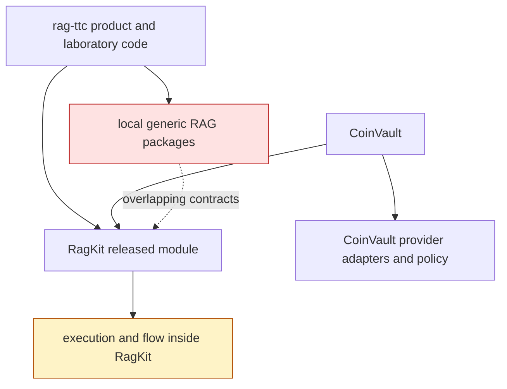
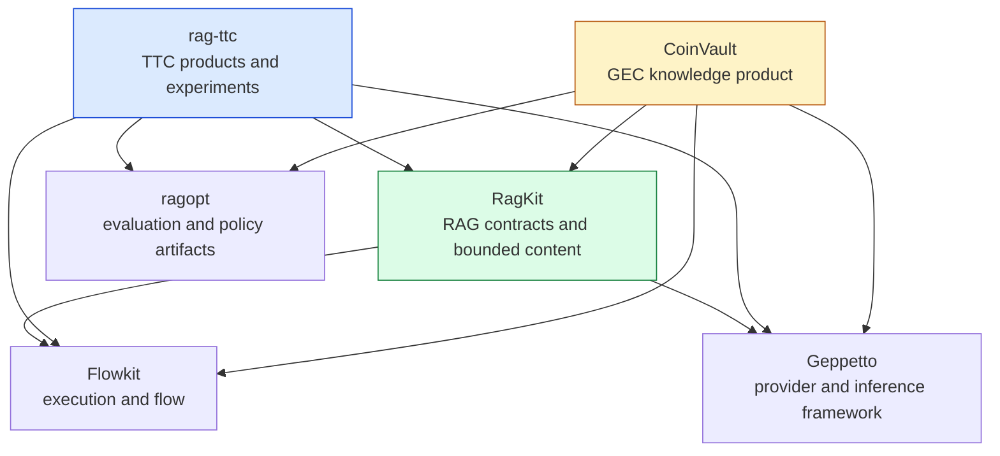
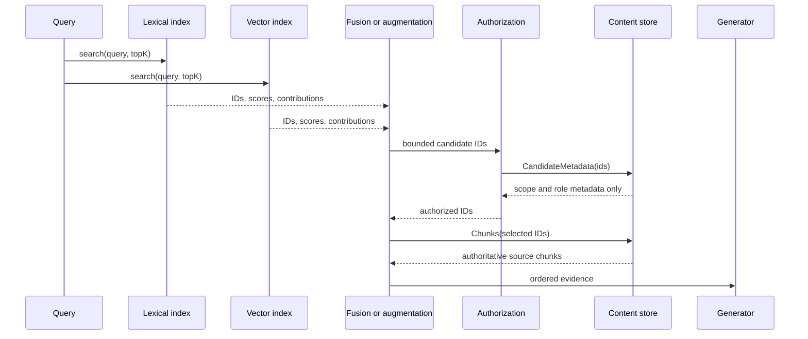
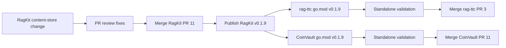

# Unified RAG Runtime: Bounded Content, Source Authority, and a Three-Repository Cutover

A retrieval system has two distinct data paths. The first path ranks identities: lexical and vector indexes return chunk IDs, document IDs, scores, and channel contributions. The second path resolves selected identities into authoritative source text and metadata. The distinction determines memory use, authorization order, evidence integrity, and the package boundaries between a reusable RAG library and the products that consume it.

This project made that distinction explicit across RagKit, rag-ttc, and CoinVault. RagKit now exposes bounded source-content lookup as a first-class contract. rag-ttc uses the contract throughout customer search, tool-based answering, connected retrieval, administration, and evaluation. CoinVault serves immutable bundles through their disk-backed content store while retaining product-owned authorization, profile selection, telemetry, and deployment policy. Flow execution moved to Flowkit, provider translation moved to the shared RagKit adapter where appropriate, and downstream modules were validated against the published RagKit v0.1.9 release rather than a local workspace replacement.

> [!summary]
> - Retrieval indexes now return identities; source text is hydrated only for a bounded selected set through `content.Store`. There is deliberately no whole-corpus load method.
> - Rerankers, augmenters, staged contexts, and storage implementations are treated as untrusted at evidence boundaries. Returned IDs are checked and rebound to service-owned source chunks before generation.
> - Package ownership is explicit: Flowkit owns execution mechanics, RagKit owns generic RAG contracts and Geppetto translation adapters, and each product owns prompts, policies, ledgers, routes, profiles, and user-visible behavior.
> - The cutover was proved in release mode. RagKit v0.1.9 was published first; rag-ttc and CoinVault then passed standalone tests, builds, lint, security scans, generation, and release checks before their PRs merged.

## 1. The problem was not an import-path migration

The visible starting point was duplicated generic RAG code in rag-ttc and a growing set of consumers in CoinVault. A direct package move could remove duplication, but it would not settle the more important questions:

1. Which repository owns execution and flow abstractions?
2. Which repository owns provider translation?
3. Which values are authoritative after a search, rerank, or augmentation step?
4. How much corpus content may a serving process retain in memory?
5. Can each product compile and test against a published module without the development workspace?

The old shape made several of these questions implicit. A bundle exposed eager `[]rag.Chunk` data. Answering services accepted that slice directly. Search and augmentation code could operate as if all source text were already resident. RagKit still contained `execution` and `flow` packages even after those mechanisms had acquired independent use. Product repositories carried similar Geppetto embedding adapters, but provider selection and profile policy were not actually generic in the same way as response translation.

The resulting dependency shape was unstable:



The target was not one repository containing every RAG-related behavior. The target was a dependency graph in which reusable mechanisms have one owner and product semantics remain visible at product boundaries.

## 2. The ownership model after the cutover

Four layers now have distinct responsibilities.

| Layer | Owns | Does not own |
|---|---|---|
| **Flowkit** | execution records, flow orchestration, reusable workflow mechanics | retrieval semantics, prompts, model providers, product policy |
| **RagKit** | RAG value types, immutable bundles, content lookup, retrieval, fusion, hydration, reranking contracts, answering validation, generic Geppetto adapters | TTC prompts, CoinVault access policy, product profiles, UI behavior |
| **rag-ttc** | TTC customer and admin composition, search routes, connected retrieval, prompts, evidence ledgers, tool loops, evaluation experiments | generic content storage or generic flow machinery |
| **CoinVault** | knowledge-source policy, access scopes and roles, embedding profile selection, cache-only behavior, deployment, telemetry, product retrieval behavior | generic Geppetto response decoding or generic bundle/content contracts |

The dependency graph is now directional:



This model rejects two tempting but incorrect simplifications. RagKit is not a product framework, so it does not absorb TTC search descriptions or CoinVault access rules. Product repositories are not allowed to preserve local copies of generic storage and provider translation merely because those copies are already integrated.

## 3. Identity and content are different contracts

A lexical or vector search result is an observation about a retrieval backend. It identifies a candidate and records how the backend ranked it. It is not source evidence by itself.

A simplified retrieval result has this shape:

```go
type Hit struct {
    ChunkID         string
    DocumentID      string
    RepresentationID string
    Score           float64
    Channel         string
}
```

The corresponding evidence value includes an authoritative chunk:

```go
type Evidence struct {
    Chunk          Chunk
    Rank           int
    RetrievalScore float64
    RerankerScore  *float64
}
```

The transition from `Hit` to `Evidence` must resolve `ChunkID` against trusted content. If the process already owns an eager corpus slice, that transition can look harmless. At production corpus sizes, however, an eager slice changes service startup and memory scaling: every chunk becomes resident even though one request may need only tens or hundreds of chunks.

RagKit's `content.Store` makes the transition explicit:

```go
type Store interface {
    Documents(context.Context, []string) ([]rag.Document, error)
    Chunks(context.Context, []string) ([]rag.Chunk, error)
    CandidateMetadata(context.Context, []string) ([]CandidateMetadata, error)
    Close() error
}
```

The contract has several deliberate properties:

- Every lookup is by an explicit finite ID set.
- Implementations reject duplicate IDs, missing IDs, and oversized batches.
- Results preserve caller order.
- `CandidateMetadata` excludes source text so authorization can run before evidence hydration.
- The interface has no `AllDocuments`, `AllChunks`, iterator over the complete corpus, or compatibility method that reconstructs an eager corpus.

That last omission is the central design choice. A compatibility layer that restored `Bundle.Chunks` would have allowed old call sites to compile while preserving the memory behavior the project was intended to remove.

## 4. The immutable bundle became the serving authority

RagKit index bundles already recorded immutable identities for corpus, chunking, representations, lexical indexes, vector indexes, and embedding configuration. The content store completed the serving boundary.

A schema-v2 manifest contains a content identity alongside lexical and vector identities:

```go
type Manifest struct {
    SchemaVersion int
    BundleID      string
    CorpusDigest  string
    ChunkDigest   string
    DocumentCount int
    ChunkCount    int
    Lexical       BackendIdentity
    Vector        *VectorIdentity
    Content       *contentsqlite.Identity
}
```

Opening a bundle yields three serving capabilities:

```text
bundle.Lexical  -> ranked lexical identities
bundle.Vector   -> ranked vector identities when configured
bundle.Content  -> bounded authoritative documents, chunks, and metadata
```

The request path is therefore:



The diagram shows why authorization metadata has its own projection. Hydrating text before access checks would place unauthorized content in process memory and in data structures visible to later stages even if the final response filtered it out. CoinVault now asks the content store for candidate metadata first, applies allowed scopes and source roles, and hydrates only authorized selected IDs.

The code in `coinvault/internal/knowledge/content_lookup.go` states the lifecycle directly:

```go
metadata, err := store.CandidateMetadata(ctx, ids)
if err != nil {
    return nil, fmt.Errorf("load candidate authorization metadata: %w", err)
}
for _, candidate := range metadata {
    if !scopesAllow(allowedScopes, candidate.Metadata[MetaAccessScopes]) {
        continue
    }
    if len(allowedRoles) > 0 {
        if _, ok := allowedRoles[candidate.Metadata[MetaSourceRole]]; !ok {
            continue
        }
    }
    authorized[candidate.ChunkID] = struct{}{}
}
```

The serving process retains request-scoped maps for selected records. It does not retain a corpus-wide map of documents or chunks.

## 5. Bounded storage requires bounded batching

The first RagKit implementation correctly bounded raw store calls at 256 IDs, but `HydrateFromStore` accepted evidence limits larger than 256 and forwarded the complete logical set to `Store.Chunks`. A valid request for 257 candidates therefore failed against both bundled stores.

The corrected design distinguishes logical request size from physical storage batch size. `content.LoadChunks` validates the complete logical ID set, determines a store-specific capacity, then executes bounded calls:

```go
batchSize := content.DefaultMaxBatch // 256
if sized, ok := store.(content.BatchSizer); ok {
    batchSize = sized.MaxBatchSize()
    if batchSize < 1 {
        return nil, fmt.Errorf("content store maximum batch must be positive")
    }
}

result := make([]rag.Chunk, 0, len(ids))
for start := 0; start < len(ids); start += batchSize {
    end := min(start+batchSize, len(ids))
    batch, err := store.Chunks(ctx, ids[start:end])
    if err != nil {
        return nil, fmt.Errorf("load content chunk batch [%d:%d]: %w", start, end, err)
    }
    result = append(result, batch...)
}
```

Validation occurs before splitting. This matters because duplicate checking performed independently inside each physical batch cannot detect the same ID in batch one and batch two. The helper also returns no partial result when a later batch fails. Callers either receive the complete requested sequence or an error.

The exact boundary has a regression test with 257 chunks:

```go
chunks := make([]rag.Chunk, content.DefaultMaxBatch+1)
ids := make([]string, len(chunks))
// populate chunks and IDs
loaded, err := content.LoadChunks(ctx, store, ids)
require.NoError(t, err)
require.Len(t, loaded, 257)
```

`BatchSizer` is optional so the base `Store` interface stays small. Unknown stores use the documented default of 256; Memory and SQLite stores report their actual configured limit. This is a practical compatibility decision, but it creates one future review point: an implementation with a smaller undisclosed limit must implement `BatchSizer` or it will receive requests up to 256.

## 6. Source-authority rebound protects evidence integrity

A model provider, reranker, or augmenter may decide order and scores. It must not become the authority for source text.

RagKit applies this rule at several stages:

- A reranker may return candidate IDs and reranker scores, but each ID must belong to the original candidate set and appear once.
- An augmenter may return IDs, order, and scores, but its chunks are replaced with chunks loaded from the service-owned content store.
- A staged prepared answer must map citation labels back to immutable chunk IDs and reload those chunks from the service store.
- A content store result must contain every requested ID exactly once and no unrequested ID.

The augmenter path captures the rule:

```go
byID, err := loadReferencedChunks(ctx, store, ids, "augmenter")
if err != nil {
    return nil, err
}
validated := make([]rag.Evidence, len(returned))
for index, item := range returned {
    item.Chunk = byID[item.Chunk.ID]
    validated[index] = item
}
```

The source bytes supplied by the augmenter are discarded. The service accepts only the reference and reloads the canonical chunk.

`retrieval.HydrateFromStore` applies the same discipline to storage results. It rejects:

- duplicate fused candidates;
- unrequested chunks returned by the store;
- duplicate chunks returned by the store;
- requested chunks omitted by the store.

It then reconstructs evidence in fused-hit order rather than trusting storage return order. The retrieval score comes from the fused hit; the source content comes from the content store. Each field has one authority.

## 7. Mutable metadata is part of the authorization boundary

Go maps are reference values. Copying a `rag.Document` struct does not copy its `Metadata map[string]string`. The first in-memory store implementation copied document structs into a map and returned document structs from that map. A caller could mutate returned metadata after the store released its read lock, changing the authorization metadata observed by a later request. The same alias allowed callers to mutate the original input map after constructing the store.

The correction clones metadata in both directions:

```go
for _, document := range documents {
    document.Metadata = cloneMetadata(document.Metadata)
    store.documents[document.ID] = document
}

func (m *Memory) Documents(ctx context.Context, ids []string) ([]rag.Document, error) {
    // validation omitted
    for _, id := range ids {
        document := m.documents[id]
        document.Metadata = cloneMetadata(document.Metadata)
        result = append(result, document)
    }
    return result, nil
}
```

The regression mutates three possible aliases:

1. the original document metadata after `NewMemory`;
2. metadata on a returned document;
3. metadata returned by `CandidateMetadata`.

A later authorization lookup must still observe the original stored value. This test is not merely a concurrency test. It defines ownership of mutable state at the storage boundary.

## 8. rag-ttc became a real downstream consumer

rag-ttc was the broadest migration because the local RAG implementation had accumulated consumers across serving, experiments, evaluation, and administration. The merged PR changed 51 files, adding 998 lines and deleting 440.

### 8.1 Flowkit owns execution

Twenty-three files moved from imports under `ragkit/{execution,flow}` to `flowkit/{execution,flow}`. This was not an alias migration. RagKit versions after v0.1.5 extracted those packages, and downstream code now imports their actual owner directly.

Representative consumers include:

- answer-quality experiment runners and budget accounting;
- index build, evaluation, and ANN bake-off commands;
- admin assistant controllers and TUI state;
- archive and usage records;
- knowledge build flows.

No compatibility package was added to RagKit. The direct imports make dependency ownership inspectable in source.

### 8.2 Search tools carry a content store, not an eager corpus

The TTC search tool now owns lexical and vector searchers plus `content.Store`:

```go
type SearchTool struct {
    lexical rag.Searcher
    vector  rag.Searcher
    content content.Store
    sources SourceCatalog
    ledger  *evidenceLedger
    routes  map[string]SearchRoute
}
```

A request searches each configured channel, collapses representation hits to chunks, applies weighted reciprocal rank fusion, optionally invokes a route augmenter, and finally hydrates through the content store:

```go
fused, err := retrieval.WeightedRRF(channels, config)
if route.Augmenter != nil {
    fused, augmentation, err = route.Augmenter.Augment(
        ctx, query, channels, fused, t.content,
    )
}
evidence, err := retrieval.HydrateFromStore(ctx, fused, t.content, len(fused))
```

The turn-scoped evidence ledger remains a TTC responsibility. It assigns user-visible citations, enforces distinct-evidence and rune budgets, and records whether evidence has already appeared. RagKit supplies authoritative evidence values; TTC decides how a conversation admits and presents them.

### 8.3 Customer and admin compositions open verified bundles

The Garden search handle requires a repository root, bundle path, tool configuration, scratch directory, and resolved inference settings. It verifies source metadata before opening a long-lived serving index, constructs a provider bundle from the product profile, opens the immutable RagKit bundle with explicit embedding identity and scratch space, then creates a fresh search tool for each session.

```go
bundle, err := indexbundle.Open(ctx, indexbundle.OpenOptions{
    Path:                indexPath,
    QueryEmbedder:       providers.Embedder,
    EmbeddingProvider:   providers.Metadata.Embedding.Provider,
    EmbeddingModel:      providers.Metadata.Embedding.Model,
    EmbeddingDimensions: providers.Metadata.Embedding.Dimensions,
    ScratchDirectory:    scratchPath,
})
```

The scratch directory became mandatory in RagKit v0.1.7. Requiring it at composition time prevents expensive verification from reaching a late disk-permission failure. The admin assistant follows the same lifecycle with its own cache-owned verification path.

### 8.4 Connected retrieval accepts the same source boundary

The deterministic connected-RAG runtime previously augmented an answering result against an eager chunk collection. It now accepts `content.Store`. Its planner can add knowledge-derived candidates and decide whether a gate opens, but selected IDs return through the same source-authoritative content path before generation and trace retention.

This preserves a crucial separation:

- connected retrieval owns planning, graph/fact gates, and trace semantics;
- RagKit owns source content and evidence validation;
- TTC owns numbered citations and the selected experimental policy.

## 9. CoinVault aligned without discarding production work

CoinVault presented a different migration problem. Its `task/unify-rag` branch began as a work-in-progress snapshot, while `main` had already advanced through Flowkit adoption, bounded content stores, verifier scratch requirements, telemetry, deployment changes, and profile-backed runtimes. Seven files conflicted when main was merged.

The correct conflict policy was not “prefer the unification branch.” The correct policy was to retain the newest complete production implementation unless the branch contained an independently valid boundary improvement.

Main was retained for:

- knowledge-service lifecycle and content lookup;
- bundle build and embedding behavior;
- ragopt gate code and tests;
- dependency state;
- telemetry and deployment-sensitive behavior.

One branch improvement survived: CoinVault's duplicate Geppetto embedding response adapter was replaced by `ragkit/rag/provider/geppetto.NewEmbedder`. CoinVault still selects a profile, asks Geppetto to construct a concrete provider, and validates provider/model/dimensions. RagKit translates the already-created provider into the generic `rag.Embedder` contract.

```go
factory := embeddings.NewSettingsFactoryFromInferenceSettings(settings)
provider, err := factory.NewProvider()
// CoinVault validates profile identity.
embedder, err := raggeppetto.NewEmbedder(provider)
// RagKit validates and translates provider responses.
```

This is a narrower and more stable extraction than moving profile selection into RagKit. Profile names, cache-only mode, document/query prefix policy, and network-credential behavior remain product decisions.

CoinVault's serving service now makes the bounded lifecycle explicit in comments and code. `indexbundle.Open` opens and identity-checks the read-only SQLite content backend. The service records a content-ready stage without loading the corpus into process memory. Request paths call `CandidateMetadata`, `Chunks`, and `Documents` for bounded candidate sets.

The final CoinVault dependency change from RagKit v0.1.7 to v0.1.9 changed only `go.mod` and `go.sum`. That small diff is useful evidence: CoinVault main had already reached the correct API shape before the final reviewed release.

## 10. Release sequencing was part of the architecture

A Go workspace can make several local modules appear compatible before any published release contains the required APIs. That happened here. rag-ttc compiled in the workspace against local RagKit, but its declared v0.1.4 dependency did not contain:

- `rag/content`;
- `answering.Service.Content`;
- the current Flowkit boundary;
- verifier scratch options.

Adding a local `replace` would have hidden the problem. The project instead used an explicit release sequence:



The version history explains why a direct jump was necessary:

| Version | Relevant state |
|---|---|
| v0.1.4 | RagKit still contained execution/flow and eager bundle chunks. |
| v0.1.5 | Bundles introduced the content boundary. |
| v0.1.6 | Execution and flow moved to Flowkit. |
| v0.1.7 | Verifier scratch directories became required. |
| v0.1.9 | Answering used `content.Store`; batched hydration and metadata isolation passed review. |

Standalone mode was always tested with `GOWORK=off`. This forced the Go command to resolve the versions and checksums recorded in each product's module files.

## 11. Failure analysis

The most durable output of a multi-repository cutover is often the set of failure classes it makes explicit.

### 11.1 Restoring `Bundle.Chunks` would have preserved the wrong architecture

Many compile errors could have been removed by reintroducing an eager chunk slice. That would have made downstream migration easier while defeating bounded serving. The project instead changed RagKit answering itself and migrated every consumer to `content.Store`.

### 11.2 Raw batch limits and logical request limits disagreed

Both bundled stores rejected more than 256 IDs, while answering configuration permitted 257 or more candidates. PR review found the mismatch. The fix belongs at the content boundary because retrieval hydration, augmenter validation, and staged answer validation all need the same bridge.

### 11.3 Struct copies did not isolate metadata maps

The in-memory store appeared to return copied documents, but document metadata remained aliased. This could mutate authorization state outside the lock and create data races. Cloning on ingestion and output established clear map ownership.

### 11.4 Upstream deletion was mistaken for a merge conflict to “repair”

rag-ttc main intentionally deleted an unused evaluator factory in favor of `tool-loop ragopt`. The branch still contained the old file. Call-site inspection showed no users, so the conflict resolution retained the deletion rather than resurrecting dead architecture.

### 11.5 CoinVault's branch was older than main in production-sensitive areas

The WIP branch did not contain newer profile, telemetry, scratch, and deployment work. Resolving conflicts wholesale toward the branch would have regressed production behavior. Main became the base; only the reusable adapter improvement was reapplied.

### 11.6 One CoinVault full-suite run closed an evalchat connection early

The first standalone run failed once:

```text
second SubmitAndObserve: canonical HTTP POST ... returned 500:
{"error":"connection conn-1: connection conn-1 is closed"}
```

The exact test passed 20 consecutive focused runs, and the complete suite passed three consecutive runs before build and lint. The failure was documented but not folded into the RagKit dependency change without a reproducible cause.

### 11.7 rag-ttc lint exposed migration hygiene

The first standalone lint found two ignored `Close` errors and several gofmt violations in migration-touched files. The close calls became explicit best-effort deferred functions; formatting was corrected. Full tests do not replace repository-wide static checks after broad import edits.

### 11.8 The pre-push release gate required frontend tool installation

rag-ttc's first push passed Go tests and lint but failed the GoReleaser snapshot because `tsc` and `protoc-gen-es` were absent. Both locked pnpm workspaces were installed with `corepack pnpm install --frozen-lockfile`; the repeated pre-push gate then passed generation and a single-target release build. The generated `tsconfig.tsbuildinfo` remained a local artifact and was removed.

### 11.9 The module Go version was a security dependency

rag-ttc PR #3 initially failed `govulncheck` with seven reachable standard-library vulnerabilities. Every finding was present in Go 1.26.5 and fixed in Go 1.26.6. Raising the module directive to 1.26.6 aligned it with the workspace and RagKit. A local scan then reported zero reachable vulnerabilities, and the rerun CI check passed.

## 12. Validation evidence

Validation was deliberately redundant because each layer catches a different class of error.

| Repository | Local validation | CI result | Merge |
|---|---|---|---|
| RagKit | focused content/retrieval/answering tests; `GOWORK=off go test ./...`; golangci-lint; pre-commit and pre-push gates | tests, lint, dependency review, vulnerability scan, CodeQL, secret scan all passed | PR #11, merge `8fd79b5`, published v0.1.9 |
| rag-ttc | standalone tests; standalone build; golangci-lint; Glazed vet; generation; GoReleaser snapshot; govulncheck | test, lint, CodeQL, GoSec, vulnerability scan, secret scan all passed | PR #3, merge `3f9b7882` |
| CoinVault | focused knowledge/build/ragopt tests; full suite ×3; focused flaky test ×20; standalone build; lint/vet/frontend generation | test, lint, secret scan all passed | PR #11, merge `5afcff1` |

The final merged changes were:

- RagKit PR #11: 11 files, 484 additions, 40 deletions.
- rag-ttc PR #3: 51 files, 998 additions, 440 deletions.
- CoinVault PR #11: 13 files, 4,963 additions, 49 deletions; most added lines are the detailed ticket research and diary retained with the implementation.

## 13. What the architecture now guarantees

Several properties are now executable rather than aspirational.

### Bounded hydration

A serving request loads source content only for selected candidate IDs. Logical candidate sets larger than a store batch are split safely.

### Fail-closed storage

Missing IDs, duplicate IDs, invalid batch sizes, closed stores, and malformed store responses return errors. Partial hydration does not continue to generation.

### Source authority

Indexes, rerankers, augmenters, and models may contribute identities, order, scores, and observations. Source text is loaded from the service-owned content store.

### Authorization before source text

CoinVault can filter candidate scopes and roles through `CandidateMetadata` without hydrating source chunks first.

### Immutable bundle identity

Content, lexical, and vector backends are opened under a manifest that records corpus, chunk, representation, provider, model, dimension, and backend identities.

### Product-owned state

Evidence ledgers, citation presentation, prompts, search routes, access policy, embedding profiles, and cache-only behavior remain in product repositories.

### Release-mode reproducibility

Downstream modules resolve RagKit v0.1.9 through normal Go module semantics. No local replacement is required for tests, builds, or CI.

## 14. Limits and open questions

The cutover closes the immediate unification work, but several design questions remain.

1. **Should `BatchSizer` become mandatory?** The optional interface keeps `Store` compact, but an external implementation with a limit below 256 must remember to advertise it.
2. **Should documents and authorization metadata gain shared batched helpers?** Current callers keep these sets bounded. The same logical-versus-physical limit issue will recur if larger callers appear.
3. **Should CoinVault use `content.LoadChunks` in every request-scoped helper?** Its candidate limits are currently bounded before raw store calls, but using the common helper would make the guarantee local and explicit.
4. **How should the proposed generic evidence-ledger kernel advance?** The COINVAULT-045 mathematical design identifies common laws—ordered uniqueness, budget admission, source rebound, and derived labels—but the project correctly avoided forcing all product ledgers into a premature shared package.
5. **How should the intermittent evalchat closure be tracked?** It deserves a separate lifecycle investigation if it recurs; it is not evidence of a RagKit regression.
6. **Should generated TypeScript build-info files be ignored explicitly?** The release gate produced an untracked `tsconfig.tsbuildinfo`; repository policy should decide whether to ignore it.
7. **Should historical docmgr relationship paths be normalized?** COINVAULT-045 still mixes CoinVault-root and workspace-root `repo://` paths. The warnings do not affect code, but they reduce documentation validation quality.

## 15. Important implementation and research files

### RagKit

- `/home/manuel/workspaces/2026-08-09/unify-rag/ragkit/rag/content/content.go`
- `/home/manuel/workspaces/2026-08-09/unify-rag/ragkit/rag/content/memory.go`
- `/home/manuel/workspaces/2026-08-09/unify-rag/ragkit/rag/content/sqlite/index.go`
- `/home/manuel/workspaces/2026-08-09/unify-rag/ragkit/rag/retrieval/retrieval.go`
- `/home/manuel/workspaces/2026-08-09/unify-rag/ragkit/rag/answering/service.go`
- `/home/manuel/workspaces/2026-08-09/unify-rag/ragkit/rag/indexbundle/types.go`

### rag-ttc

- `/home/manuel/workspaces/2026-08-09/unify-rag/rag-ttc/pkg/ttc/search/search.go`
- `/home/manuel/workspaces/2026-08-09/unify-rag/rag-ttc/pkg/ttc/toolanswer/service.go`
- `/home/manuel/workspaces/2026-08-09/unify-rag/rag-ttc/pkg/mixedttc/connected/runtime.go`
- `/home/manuel/workspaces/2026-08-09/unify-rag/rag-ttc/internal/customer/ragsearch/ragsearch.go`
- `/home/manuel/workspaces/2026-08-09/unify-rag/rag-ttc/internal/admin/assistant/runtime.go`
- `/home/manuel/workspaces/2026-08-09/unify-rag/rag-ttc/ttmp/2026/08/07/RAGKIT-CUTOVER-001--replace-pkg-rag-with-ragkit-and-remove-duplicated-generic-rag-source/design-doc/01-intern-guide-replacing-pkg-rag-with-ragkit.md`
- `/home/manuel/workspaces/2026-08-09/unify-rag/rag-ttc/ttmp/2026/08/07/RAGKIT-CUTOVER-001--replace-pkg-rag-with-ragkit-and-remove-duplicated-generic-rag-source/reference/01-investigation-diary.md`

### CoinVault

- `/home/manuel/workspaces/2026-08-09/unify-rag/coinvault/internal/knowledge/service.go`
- `/home/manuel/workspaces/2026-08-09/unify-rag/coinvault/internal/knowledge/content_lookup.go`
- `/home/manuel/workspaces/2026-08-09/unify-rag/coinvault/internal/knowledgebuild/embed.go`
- `/home/manuel/workspaces/2026-08-09/unify-rag/coinvault/ttmp/2026/08/09/COINVAULT-045--align-coinvault-with-current-ragkit-ragopt-and-rag-ttc-boundaries/design-doc/01-coinvault-rag-dependency-alignment-and-common-framework-plan.md`
- `/home/manuel/workspaces/2026-08-09/unify-rag/coinvault/ttmp/2026/08/09/COINVAULT-045--align-coinvault-with-current-ragkit-ragopt-and-rag-ttc-boundaries/design-doc/02-mathematical-evidence-ledger-kernel-intern-design-and-implementation-guide.md`
- `/home/manuel/workspaces/2026-08-09/unify-rag/coinvault/ttmp/2026/08/09/COINVAULT-045--align-coinvault-with-current-ragkit-ragopt-and-rag-ttc-boundaries/reference/01-investigation-diary.md`

## 16. Related vault notes

- [[PROJ - CoinVault GEC-RAG - ragkit Extraction and knowledge_search Integration]] records the original RagKit extraction and production `knowledge_search` integration.
- [[PROJECT REPORT - CoinVault Verifier Memory Scaling - Why RSS Grows and How to Operate It]] explains the bounded verifier work that made eager serving especially undesirable.
- [[PROJECT REPORT - RAG-TTC - Two Assistants One RAG Core and Bounded AdminOps]] establishes the product boundaries that this migration preserved.
- [[PROJECT REPORT - RAG-TTC Connected Retrieval - Gated Facts, Numbered Citations, and the Graph Stopping Rule]] explains the connected retrieval behavior now adapted to `content.Store`.
- [[PROJECT REPORT - From Pattern Zoos to an Architecture Garden - A Shared Mathematical Vocabulary for Composable Systems]] provides the broader vocabulary behind entity, derivation, observation, custody, and source-authority separation.

## 17. Working rules established by the project

> [!important]
> A retrieval observation is not source evidence. Convert identities into evidence only by resolving a bounded selected set through a trusted content store.

> [!important]
> Validate workspace mode and released-module mode independently. A green Go workspace does not prove that downstream `go.mod` files describe a buildable system.

> [!important]
> During cross-repository merges, preserve the newest complete production implementation. Reapply only those branch changes that improve a still-valid ownership boundary.

The completed system is smaller in the places where generic behavior had been duplicated and stricter in the places where source authority had been implicit. RagKit now defines a bounded content and evidence boundary. rag-ttc and CoinVault consume that boundary while retaining their different product contracts. The final proof is operational: all three pull requests merged, RagKit v0.1.9 is published, and both downstream repositories pass against the published release without a workspace replacement.
