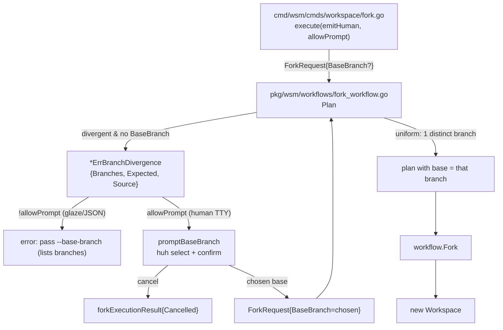

# PROJECT REPORT - WSM Fork Divergence Confirmation and Interactive Base Selection

This report documents the second half of the `workspace-manager` status-and-base work: making `wsm fork` stop hard-failing when a fork's source repositories are on different branches, and instead let the user choose which branch to fork from. The first report covered honest merge/rebase status and per-repo base resolution. This report covers the fork path, where the base branch is not configured ahead of time but discovered from the source workspace at fork time — and where that discovery can legitimately fail because the source has drifted.

The change is small in lines but precise in shape, because it crosses two layers and must preserve an existing convention. The workflow detects divergence and returns a typed error; the CLI owns the interaction. The report explains why the error is typed rather than a string, why the prompt offers both observed branches and a conventional default, and why the non-interactive path requires a flag rather than silently picking a majority branch.

The implementation lives on `task/fix-git-rebase-bug` under ticket `WSM-MO-013-FORK-REBASE-STATUS`, with the full design in `design-doc/03` and a chronological diary (Step 10) in the ticket's `reference/` directory. It builds directly on the base-resolution foundation from the first report: the branch the user chooses flows through `ResolveBaseBranchForRepo` and `ResolveBaseRef`, so a fork onto a local-only base still resolves correctly at status time.

> [!summary]
> The work changes one failure mode and adds one flag and one prompt:
> 1. **Typed divergence error** — `ForkWorkflow.Plan` returns `*ErrBranchDivergence` (carrying a per-repo branch map) instead of a plain string error, so the CLI can build a prompt from real data.
> 2. **`--base-branch` flag** — an explicit base that skips the uniform-branch check; the non-interactive escape hatch for CI and scripts.
> 3. **Interactive `huh` prompt** — a select-then-confirm form that defaults to the most frequent observed branch, offers the conventional `task/<source-name>`, and re-plans the fork with the chosen base.
> 4. **No silent majority pick** — in non-interactive mode the command errors with the observed branches rather than guessing, because the choice of base is a real decision, not an inconvenience.

## Why this project exists

`wsm fork <new-name> <source>` creates a new workspace from an existing one. It inherits the source's repository set and cuts fresh worktrees on a new branch. The new workspace's base branch — the upstream it was forked from — is derived from the source workspace at fork time, because it is not known until the source is inspected.

The original derivation was strict. `ForkWorkflow.Plan` took the first source repository's current branch as the base and required every source repository to be on the same branch:

```go
baseBranch := status.Repositories[0].CurrentBranch
for _, repoStatus := range status.Repositories {
    if repoStatus.CurrentBranch != baseBranch {
        return nil, errors.Errorf("repositories in source workspace are on different branches: %s is on %s, but expected %s",
            repoStatus.Repository.Name, repoStatus.CurrentBranch, baseBranch)
    }
}
```

This blocked a legitimate workflow. A source workspace's repositories drift onto different branches whenever one repository gets a side-fix on its own branch — `goldeneaglecoin.com` on `task/deploy-image` while the rest sit on `task/deploy-dev-indexer`. The user's command failed:

```
$ wsm fork ttc-admin-chat deploy-dev-indexer
Error: repositories in source workspace are on different branches:
       goldeneaglecoin.com is on task/deploy-image, but expected task/deploy-dev-indexer
```

The error message named the divergence, which was honest, but it offered no way forward. The user had to manually checkout the desired branch in every source repo before forking, or abandon the fork. The goal of this work is to let the fork proceed by asking which branch to use as the base.

The deeper problem is that the base branch at fork time is a *choice*, not a fact. There is no single correct answer when the source repos disagree; the user must decide which upstream the new workspace should track. The implementation's job is to present that choice clearly and let the user make it, while keeping the workflow layer free of interaction.

## Current project status

Phases F1 and F2 are implemented, tested, and committed. Phase F3 (validation) is covered by an integration test that runs the real `wsm` binary against a divergent source workspace; manual validation on the user's real workspace is left to the user. The full `go test ./...` suite is green, including the new fork-divergence scenarios.

What already exists:

- `ErrBranchDivergence`, a typed error carrying the per-repo branch map and the conventional expected branch.
- `ForkRequest.BaseBranch`, an explicit base that bypasses the uniformity check.
- A rewritten `Plan` that returns the typed error on divergence instead of a string.
- A `--base-branch` flag on `wsm fork`.
- An interactive `huh` select+confirm prompt in the CLI, gated by an `allowPrompt` flag so non-interactive mode cannot reach it.
- Integration tests proving the divergent source fails helpfully without the flag and succeeds with it, and that a uniform source still forks without the flag.

What is still incomplete:

- Manual F3 validation on the real `ttc-admin-chat` / `deploy-dev-indexer` workspace.
- A possible `--strict` variant that limits the selectable base to branches a repo is actually on (the current prompt offers the conventional `task/<source-name>` even if nothing is on it).

## Project shape

The change respects WSM's layering rule: the workflow layer detects divergence and returns data; the CLI layer owns the prompt. Nothing in `pkg/wsm` imports a TUI library.



The shape is deliberately a loop on the divergent path: the CLI catches the typed error, prompts, then re-runs `Plan` with the chosen base. `Plan` is cheap to re-run — it calls `GetWorkspaceStatus`, which is local git — so the cost of the second plan is negligible and the code stays simple.

## Architecture

### Why the error is typed

The original divergence error was a formatted string. A string is honest about what went wrong but carries no data a caller can use to build a prompt. To ask "which branch do you want?" the CLI needs the set of observed branches and which repo is on which. A string forces the CLI to parse its own error message back into data.

The typed error carries the data directly:

```go
type ErrBranchDivergence struct {
    Branches map[string]string // repo name -> current branch
    Expected string             // conventional task/<source-name>
    Source   string             // source workspace name, for messaging
}

func (e *ErrBranchDivergence) DistinctBranches() []string {
    return branch.DistinctBranches(e.Branches)
}
```

`DistinctBranches` is reused from the base-resolution package (`pkg/wsm/branch`), so the fork path and the status path share one definition of "the unique branches in a repo-to-branch map." The `Expected` field is the conventional branch for the source workspace name, built by `BuildWorkspaceBranch(sourceWorkspaceName, "", "task")` — `task/<source-name>`. It is offered as a default in the prompt even when no repository is currently on it, because a user forking `deploy-dev-indexer` often wants the new workspace to track `task/deploy-dev-indexer` regardless of where the source repos drifted.

The alternative — returning a `ForkPlan` with a divergence flag and no error — was rejected. It would change `Plan`'s contract to "returns a plan that is sometimes incomplete," which is a worse invariant than "returns a plan or an error." A typed error keeps `Plan` honest: it returns a complete plan, or it tells the caller exactly what is missing.

### The precedence inside `Plan`

`Plan` resolves the base branch with a small, explicit precedence:

```go
var baseBranch string
if req.BaseBranch != "" {
    baseBranch = req.BaseBranch          // explicit override skips the check
} else {
    branches := map[string]string{...}   // repo -> current branch
    distinct := branch.DistinctBranches(branches)
    if len(distinct) == 0 {
        return nil, errors.New("failed to detect base branch from source workspace")
    }
    if len(distinct) == 1 {
        baseBranch = distinct[0]
    } else {
        return nil, &ErrBranchDivergence{Branches: branches, Expected: ..., Source: ...}
    }
}
```

The explicit `BaseBranch` wins and skips the uniformity check entirely. This is what makes `--base-branch` work for CI: a script that knows the intended base passes it and `Plan` never inspects the source branches. Without an explicit base, `Plan` inspects, and on a single distinct branch it uses it; on more than one it returns the typed error. There is no silent majority pick. The choice of base is a real decision, and the implementation refuses to make it for the user in non-interactive mode.

### The `allowPrompt` gate

The two execution entrypoints set a boolean pair, matching the existing `delete` and `create` commands:

```go
// fork.go
func (c *ForkCommand) Run(ctx, vals) error {
    result, err := c.execute(ctx, vals, true, true)   // human + prompt allowed
    ...
}
func (c *ForkCommand) RunIntoGlazeProcessor(ctx, vals, gp) error {
    result, err := c.execute(ctx, vals, false, false) // glaze/JSON, no prompt
    ...
}
```

`execute` handles the typed error differently depending on `allowPrompt`:

```go
var div *workflows.ErrBranchDivergence
if errors.As(err, &div) {
    if !allowPrompt {
        return nil, errors.Errorf(
            "source workspace '%s' repos are on different branches (%s); pass --base-branch to choose one",
            div.Source, strings.Join(div.DistinctBranches(), ", "))
    }
    chosen, ok, cancelled := promptBaseBranch(div)
    if cancelled { return &forkExecutionResult{Cancelled: true}, nil }
    if !ok { return nil, errors.New("no base branch selected") }
    req.BaseBranch = chosen
    plan, err = workflow.Plan(ctx, req)   // re-plan with explicit base
    ...
}
```

The non-interactive error names the source workspace, lists the observed branches, and points at the flag. It mirrors `delete`'s `--force is required when using --with-glaze-output`: a destructive or consequential choice is never made silently in automation.

`errors.As` is the correct call here, not a string match. `Plan` returns the error directly (no wrapping), but `errors.As` is robust to future wrapping and is the idiomatic way to pull a typed error out of an error chain. The earlier status work learned this the hard way with `*exec.ExitError`: a custom `Unwrap`-based check failed because the wrapping package differed; `errors.As` walks the chain regardless.

## Implementation details

### The prompt

`promptBaseBranch` builds a `huh` form with a select followed by a confirm. The select's options are the distinct observed branches, with the conventional expected branch prepended if it is not already among them. The default is the most frequent observed branch, computed by `branch.MostFrequentBranch` (reused from the base-resolution package), falling back to `Expected` if the map is empty.

```go
func promptBaseBranch(div *workflows.ErrBranchDivergence) (chosen string, ok bool, cancelled bool) {
    options := div.DistinctBranches()
    if div.Expected != "" && !contains(options, div.Expected) {
        options = append([]string{div.Expected}, options...)
    }
    selected := branch.MostFrequentBranch(div.Branches)
    if selected == "" { selected = div.Expected }

    var confirm bool
    form := huh.NewForm(huh.NewGroup(
        huh.NewSelect[string]().
            Title("Source repos are on different branches. Choose the base branch to fork from:").
            Options(huh.NewOptions(options...)...).
            Value(&selected),
        huh.NewConfirm().
            Title(fmt.Sprintf("Fork using base branch '%s'?", selected)).
            Description(showDivergence(div)).
            Value(&confirm),
    ))
    if err := form.Run(); err != nil {
        if isUserCancelledError(err) { return "", false, true }
        return "", false, false
    }
    return selected, confirm, false
}
```

`showDivergence` renders the per-repo branch map as the confirm's description, so the user sees exactly which repository is on which branch before they commit:

```
Per-repo branches:
  coinvault -> task/deploy-dev-indexer
  geppetto -> task/deploy-dev-indexer
  goldeneaglecoin.com -> task/deploy-image
```

The three return values distinguish the three outcomes the caller cares about: a chosen branch (`ok=true`), a user decline (`ok=false, cancelled=false`), and an abort (`cancelled=true`). The existing `forkExecutionResult.Cancelled` path already existed for `Fork`-time cancellation, so a prompt cancel lands in the same place a `git worktree` cancel would.

### The `huh` option construction detail

`huh.NewSelect[T]().Options(...)` is variadic: it takes `huh.Option[T]...`. `huh.NewOptions(values...)` returns `[]huh.Option[T]`. Passing the slice directly fails to compile because a slice is not assignable to a variadic element. The correct call spreads the slice:

```go
.Options(huh.NewOptions(options...)...)
```

This is the kind of API detail that is obvious once seen and easy to get backwards the first time. It is recorded here because the same pattern recurs anywhere `huh` builds a select from a dynamic list.

### Reusing the base-resolution helpers

Two helpers from the status work are reused here without modification:

- `branch.DistinctBranches(map[string]string) []string` — sorted unique branches, used both in `ErrBranchDivergence.DistinctBranches()` and in `Plan`'s divergence check.
- `branch.MostFrequentBranch(map[string]string) string` — the prompt default.

This is the payoff of putting those helpers in the `branch` package during the first phase. The fork path needed them and got them for free; if they had lived in `pkg/wsm`, the workflow package would have imported `wsm` (an upward dependency) or the helpers would have been duplicated.

### What the integration test proves

The integration test builds a real source workspace with two repositories, diverges one onto a different branch, and runs the real `wsm` binary as a subprocess. It asserts two things the unit tests cannot: that the divergent fork fails *with a helpful message* (naming both branches and mentioning `--base-branch`), and that the same fork succeeds when the flag is passed.

```go
// Fork WITHOUT --base-branch in glaze mode: should fail with a divergence
// error that names both branches and mentions --base-branch.
res = s.RunWSM(t, nil, wsPath, "fork", "ws-fork-dst", wsName, "--with-glaze-output", "--output", "json")
if res.ExitCode == 0 { t.Fatalf("expected fork to fail without --base-branch ...") }
combined := res.Stdout + "\n" + res.Stderr
if !strings.Contains(combined, "--base-branch") { ... }
if !strings.Contains(combined, "task/base") || !strings.Contains(combined, "task/divergent") { ... }

// Fork WITH --base-branch task/base: should succeed despite the divergence.
res = s.RunWSM(t, nil, wsPath, "fork", "ws-fork-dst", wsName, "--base-branch", "task/base")
if res.ExitCode != 0 { t.Fatalf("expected fork with --base-branch to succeed ...") }
```

A second test guards the common case: a uniform source (all repos on the same branch) still forks without `--base-branch`. This is the regression guard — the divergence handling must not break the path everyone uses.

## Common failure modes

**Returning a string error when the caller needs data.** The original. A formatted message is human-readable but programmatically opaque. When a caller must build a prompt from the failure, the failure must carry structured data. A typed error is the smallest change that does this without altering the function's success contract.

**Silent majority pick in automation.** The temptation when source repos diverge is to pick the most frequent branch and continue. That hides a real decision from a script. The implementation refuses: in non-interactive mode it errors with the observed branches and the flag. A script that wants the majority branch must say so explicitly with `--base-branch`.

**Prompting from the workflow layer.** A workflow that imports a TUI library couples domain logic to interaction and makes the workflow untestable without a TTY. The typed error keeps `pkg/wsm/workflows` free of `huh`; the prompt lives in `cmd/wsm/cmds/workspace`, where the other prompts (`delete`, `create`) already live.

**Forgetting the regression guard.** Adding a divergence path risks breaking the uniform path that everyone uses. The integration test that forks a uniform source without the flag is the guard that catches a regression where the new code accidentally requires the flag always.

**Variadic vs slice in TUI option construction.** `huh.NewOptions(...)` returns a slice; `Options(...)` takes variadic. Forgetting the spread is a compile error, not a runtime bug, but it is the kind of friction that wastes a build cycle. Recorded so the next `huh` select is written correctly the first time.

## Current user-facing commands

```bash
# fork a uniform source (unchanged)
wsm fork iteration-2 deploy-dev-indexer

# fork a divergent source non-interactively (CI/scripts)
wsm fork ttc-admin-chat deploy-dev-indexer --base-branch task/deploy-dev-indexer

# fork a divergent source interactively (human TTY): prompts to choose
wsm fork ttc-admin-chat deploy-dev-indexer
#  -> huh select (default = most frequent), then confirm showing per-repo branches
```

The non-interactive failure, when no flag is passed in glaze mode:

```
source workspace 'deploy-dev-indexer' repos are on different branches
(task/deploy-dev-indexer, task/deploy-image); pass --base-branch to choose one
```

## Important project docs

The ticket workspace holds the design and diary:

- `/home/manuel/workspaces/2026-08-19/fix-git-rebase-bug/workspace-manager/ttmp/2026/08/19/WSM-MO-013-FORK-REBASE-STATUS--.../design-doc/03-fork-divergence-confirmation-allow-forking-when-source-repos-are-on-different-branches.md` — the full design with decision records F1–F3
- `.../reference/01-investigation-diary.md` — chronological diary; Step 10 covers F1+F2

Key source files:

- `pkg/wsm/workflows/fork_workflow.go` — `ErrBranchDivergence`, `ForkRequest.BaseBranch`, the `Plan` divergence block
- `cmd/wsm/cmds/workspace/fork.go` — `--base-branch` flag, `execute` `allowPrompt` gate, `promptBaseBranch`, `showDivergence`
- `test/integration/scenarios/fork_divergence_test.go` — end-to-end via the real `wsm` binary

The companion report for the foundation this builds on:

- `Projects/2026/08/19/PROJECT REPORT - WSM Forked-Workspace Status Honesty and Per-Repo Base Resolution.md` — E1–E5: `BaseComparison`, `ResolveBaseRef`, `ResolveBaseBranchForRepo`, `wsm set-base`, the status `BASE` column

## Open questions

- Should the prompt offer a `--strict` mode that limits the selectable base to branches a repository is actually on, excluding the conventional `task/<source-name>` when nothing is on it? The current prompt offers the conventional branch unconditionally; `ResolveBaseRef` will resolve or report unknown at status time if the user picks a branch that does not exist.
- Should `wsm fork` warn at fork time when the chosen base has no remote-tracking ref (the forked-workspace condition from the first report)? The status path already handles this via the local fallback, but a fork-time warning would set expectations earlier.
- Should `wsm fork` remember the chosen base by writing a per-repo override via `wsm set-base` for the new workspace, so the user does not have to re-establish it? Today the chosen base becomes the new workspace's `BaseBranch` at the workspace level, which is usually sufficient.

## Near-term next steps

- **F3 manual validation:** reproduce the original `wsm fork ttc-admin-chat deploy-dev-indexer` on the real divergent workspace and confirm both the interactive prompt and `--base-branch` work.
- Consider a `wsm fork --base-branch <branch> --fetch` combination that fetches the chosen base before forking, so the new workspace's status resolves against the remote-tracking ref from the start (mirroring `wsm set-base --fetch`).
- Close `WSM-MO-013-FORK-REBASE-STATUS` once E6 (the user's manual status validation on `ragkit-coinvault-mysql`) and F3 both pass.

## Project working rule

> [!important]
> The workflow layer returns typed errors; the CLI layer owns prompts. A divergence the caller can resolve interactively must be a typed error carrying the data the prompt needs, never a formatted string. Non-interactive mode requires an explicit flag rather than a silent default, because the choice of base is a real decision.

## Related notes

- [[PROJECT REPORT - WSM Forked-Workspace Status Honesty and Per-Repo Base Resolution]] — the foundation this report builds on (E1–E5: honest status, per-repo base resolution, `set-base`)

**Tribal candidates** (our-specific patterns not yet at 3-project threshold):
- typed-error-then-prompt layering (2/3) — a workflow returns a typed error carrying prompt data; the CLI catches it with `errors.As` and builds a `huh` form, keeping TUI out of the domain layer; seen here in `wsm fork` and in `wsm delete`/`wsm create` confirmations
- allowPrompt gate for non-interactive escape (2/3) — `Run` passes `(true,true)`, `RunIntoGlazeProcessor` passes `(false,false)`, and a destructive choice errors with the required flag instead of guessing; seen in `delete --force` and now `fork --base-branch`
