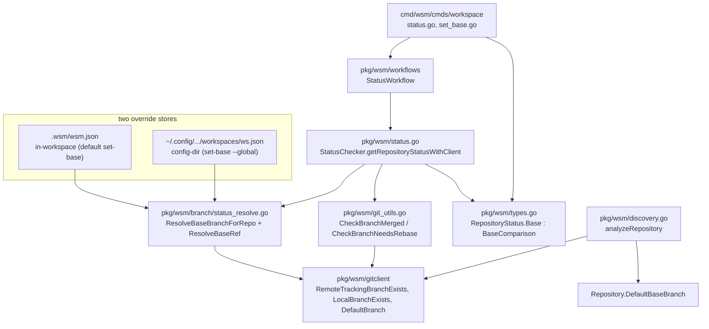
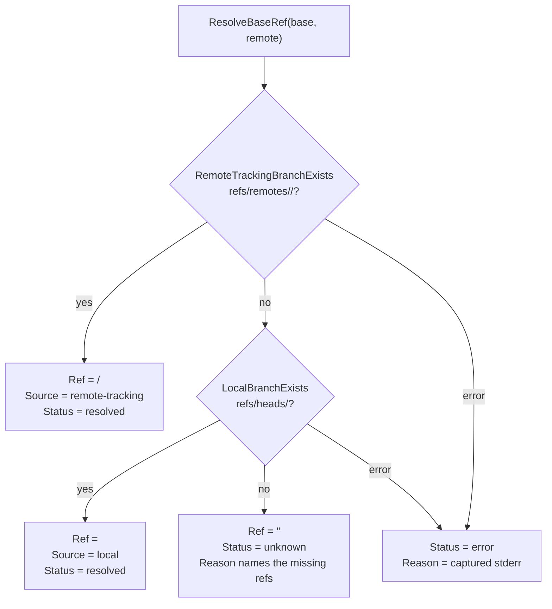

# PROJECT REPORT - WSM Forked-Workspace Status Honesty and Per-Repo Base Resolution

This report documents a focused refactor of the `workspace-manager` (WSM) CLI: making `wsm status` honest about merge and rebase outcomes, and giving each repository in a workspace its own comparison base. The work began from a single user-visible symptom — `wsm status` on a forked workspace silently reporting `merged=false` and logging `exit status 128` — and expanded into a four-part change: a provenance-bearing status result, per-repo default-branch discovery, per-repo overrides with local-beats-global precedence, and a `set-base` command to manage them. The report explains why each layer exists, how the pieces connect, and the failure modes that shaped the implementation.

The report is written for an engineer who will read or extend this code. It assumes familiarity with git references and Go, but not with WSM. Where a design decision is non-obvious, the report states the alternative that was rejected and why. The implementation lives on the `task/fix-git-rebase-bug` branch under ticket `WSM-MO-013-FORK-REBASE-STATUS`, with a chronological diary in the ticket's `reference/` directory.

> [!summary]
> The work delivers four things, each addressing a distinct gap:
> 1. **Honest status results** — `wsm status` no longer reports a confident `false` when the comparison ref is missing or git fails; it returns a `BaseComparison` with `resolved`/`unknown`/`error` and a reason, and the table shows `?`/`!` instead of lying `✓`/`-`.
> 2. **Per-repo default detection** — each repo's remote-advertised default branch is discovered via `git symbolic-ref refs/remotes/origin/HEAD`, so a repo that defaults to `develop` is compared against `develop`, not `main`.
> 3. **Per-repo base overrides with precedence** — a single `ResolveBaseBranchForRepo` function encodes a six-layer precedence (in-workspace override > config-dir override > workspace base > discovered default > env > `main`), structurally preventing the "forgot a layer" class of bug.
> 4. **`wsm set-base`** — a command to set a per-repo base override, writing to one of two stores (never mirrored), with optional `--fetch` to materialize the ref.

## Why this project exists

WSM manages multi-repository workspaces built from git worktrees. A workspace has a `branch` (the branch every repo is checked out on) and a `baseBranch` (the upstream it was forked from). `wsm status` walks every repo and reports two derived booleans per repository: `is_merged` ("is my branch already merged into the base?") and `needs_rebase` ("is my branch behind the base and needs rebasing?").

The original implementation computed both against a single hardcoded reference: `origin/<baseBranch>`. The code built that string unconditionally and ran git against it, never checking whether the reference existed. That assumption is correct for a workspace created from a branch that lives on the remote — `origin/main`, `origin/develop` — but it breaks for a **forked** workspace.

A forked workspace is created by `wsm fork` from an existing workspace. `ForkWorkflow.Plan` detects the base branch by reading the *current branch* of the source workspace's repositories. That branch is frequently a local task branch that was never pushed to `origin`. The fork's repos are cut from it, so the base they were forked from has no `origin/<base>` reference. The very status check the fork workflow used to detect the base will, once the workspace is forked, fail for the fork's own status — because the comparison reference no longer exists remotely.

The symptom, from the user's real workspace, was this per-repo debug output:

```
DBG Branch merge check result ... merged=false ... upstream=origin/task/deploy-dev-indexer
DBG Failed to check for commits ahead on configured remote base error="exit status 128"
```

Two things are wrong in that output, and they are worth separating. The merge check reports `merged=false` as a confident result even though the underlying git command failed. The rebase check returns an error, which the caller swallows into a default `false`. Both produce a confident-looking negative that is actually "I could not tell." A user reading `wsm status` has no way to distinguish "not merged" from "could not compare."

The deeper problem is that the codebase already had the right abstraction for this — a typed branch-resolution subsystem in `pkg/wsm/branch` — but the two status functions bypassed it. The fix was to route status through that subsystem and to make the outcome carry provenance.

## Current project status

Phases E1 through E5 are implemented, tested, and committed on `task/fix-git-rebase-bug`. The full `go test ./...` suite is green, including integration scenarios that exercise `wsm discover`, `wsm create`, and `wsm status` end to end. Phase E6 (manual validation on the real failing workspace) is left for the user to run. A follow-on enhancement, fork-divergence confirmation (when a fork's source repos are on different branches), is designed but not yet implemented.

What already exists:

- A `BaseComparison` struct on `RepositoryStatus` carrying the resolved ref, its source, a tri-state status, a reason, and the merged/rebase values.
- `ResolveBaseRef` in `pkg/wsm/branch`, which prefers the remote-tracking ref and falls back to the local branch.
- `DefaultBranch` on the git client, implemented via `git symbolic-ref refs/remotes/origin/HEAD`.
- `ResolveBaseBranchForRepo`, the single six-layer precedence function.
- `overlayWorkspaceBaseOverrides`, which merges in-workspace `.wsm/wsm.json` overrides onto the loaded workspace at load time.
- `wsm set-base`, with default in-workspace storage and `--global` config-dir storage.
- An honest status table: a `BASE` column and `?`/`!` glyphs.

What is still incomplete:

- Phase E6 manual validation on `ragkit-coinvault-mysql`.
- Fork-divergence confirmation (tasks F1–F3): when `wsm fork` source repos are on different branches, prompt to choose a base instead of hard-failing.

## Project shape

The change is layered to match WSM's existing four-layer architecture, and each layer gained exactly the responsibility it was missing.



The key property of this shape is that **all** base resolution flows through one function. Before this work, each status check called `ResolveBaseBranch` independently and could forget a layer. After this work, the checks receive an already-resolved `(base, remote)` pair from `ResolveBaseBranchForRepo`, and the precedence — including the empty-to-`main` fallback — lives in exactly one place.

## Architecture

### The two stores and why they are not mirrored

A workspace is stored in two JSON files, and the relationship between them is the most important structural decision in this work.

The **config-dir JSON** lives at `~/.config/workspace-manager/workspaces/<name>.json`. It is the canonical record of which workspaces exist, and it is what `wsm status` loads through `WorkspaceContextService.LoadWorkspace` → `LoadWorkspaces`. The **in-workspace JSON** lives at `<workspace>/.wsm/wsm.json`. It is written by `createWorkspaceMetadata` and is the file a user sees when they `ls` their workspace and would naturally edit.

A per-repo base override needs to be expressible in both, because a user might set it interactively (in-workspace, the most local store) or persist it across workspace re-creation (config-dir, the durable store). The design decision was to use **two flag-selected stores, never mirrored**. `wsm set-base` (default) writes only `.wsm/wsm.json`; `wsm set-base --global` writes only the config-dir JSON. At load time, `overlayWorkspaceBaseOverrides` reads `.wsm/wsm.json` and overlays its per-repo overrides onto the loaded `Repository` entries, so an in-workspace override supersedes a config-dir one for the same repo.

The rejected alternative was mirroring: writing both stores on every `set-base`. Mirroring creates two sources of truth that drift the moment a user hand-edits one file. Flag-selection keeps each write to one file and makes the precedence explicit and auditable: the status `BASE` column names the winning layer, and `set-base` prints `[stored: workspace|global]` so the writer knows which store they touched.

Local-beats-global is the least surprising override rule, and the default target is the most local, highest-precedence store — so the common case "set a base for this worktree" needs no flag.

### The precedence function

`ResolveBaseBranchForRepo` is a `switch` that returns the first non-empty layer. The order is most-specific first.

```go
func ResolveBaseBranchForRepo(in RepoBaseInput) (branch BranchName, remote RemoteName) {
    switch {
    case in.BaseBranchWorkspace != "":
        return BranchName(in.BaseBranchWorkspace), normalizeRemote(RemoteName(in.BaseRemoteWorkspace), DefaultRemoteName)
    case in.BaseBranchGlobal != "":
        return BranchName(in.BaseBranchGlobal), normalizeRemote(RemoteName(in.BaseRemoteGlobal), DefaultRemoteName)
    case in.WorkspaceBase != "":
        return BranchName(in.WorkspaceBase), DefaultRemoteName
    case in.DefaultBaseBranch != "":
        return BranchName(in.DefaultBaseBranch), DefaultRemoteName
    case os.Getenv("WSM_BASE_BRANCH") != "":
        return BranchName(os.Getenv("WSM_BASE_BRANCH")), DefaultRemoteName
    default:
        return DefaultBaseBranch, DefaultRemoteName
    }
}
```

This function exists because of a bug caught during implementation. The first version of the honest checks passed the raw `baseBranch` string straight to `ResolveBaseRef`. When a workspace had no explicit `--base-branch`, `Workspace.BaseBranch` was empty, and `ResolveBaseRef("")` returned `BaseUnknown` ("base branch is empty"). The integration test `TestStatusSemanticMergedAndNeedsRebase` went red: it expected `needs_rebase=true` after `--fetch` and got `false`, because the comparison never ran. The old code had an empty-to-`main` fallback inside `ResolveBaseBranch`; the new code had dropped it. Centralizing all precedence in one function means a call site cannot forget the fallback again — there is no per-check `ResolveBaseBranch` call to forget.

### Turning a branch into a concrete ref

`ResolveBaseRef` takes the chosen `(base, remote)` and produces a concrete git reference to compare `HEAD` against. The preference is the remote-tracking branch, because it reflects the shared upstream truth. The fallback is the local branch, which is what makes forked workspaces work.



The local fallback is the fix for the original symptom. The failing workspace's base branch `task/deploy-dev-indexer` exists locally (`refs/heads/task/deploy-dev-indexer`) but not remotely (`refs/remotes/origin/task/deploy-dev-indexer` is empty). Before this work, the checks ran git against `origin/task/deploy-dev-indexer` and failed. After this work, they fall back to the local branch and run a real comparison.

When neither ref exists, the function returns `BaseUnknown` with a precise reason: `"<base> is not a remote-tracking ref on <remote> and is not a local branch"`. This is the difference between "could not compare" and "compared and the answer is no." The caller must treat `unknown` as "could not compare," not as a negative.

### Default branch discovery

The hardcoded `main` fallback is the last resort, not the default. `DefaultBaseBranchForRepo` asks the remote what its default actually is.

```go
func DefaultBaseBranchForRepo(ctx, gc, repoPath, remote) (string, error) {
    if def, err := gc.DefaultBranch(ctx, h, remote); err == nil && def != "" {
        return def, nil
    }
    for _, cand := range []string{"main", "master", "develop"} {
        exists, _ := gc.RemoteTrackingBranchExists(ctx, h, remote, cand)
        if exists { return cand, nil }
    }
    return "", nil
}
```

`DefaultBranch` is implemented with `git symbolic-ref refs/remotes/origin/HEAD`. On the real workspace, `goldeneaglecoin.com` advertises `origin/HEAD -> origin/develop`, so its discovered default is `develop`, not `main`. The probe order `main, master, develop` is a documented heuristic for the rare case where `origin/HEAD` is unset.

The subtlety that shaped the test was that `git clone --branch main` synthesizes `origin/HEAD -> origin/main` on the client even when the bare remote's `HEAD` was never set. To test a genuinely unset default, the test deletes the synthesized reference with `git symbolic-ref -d refs/remotes/origin/HEAD`. That is the only way to reach the probe fallback from a clone.

## Implementation details

### Distinguishing "not an ancestor" from a real failure

`CheckBranchMerged` runs `git merge-base --is-ancestor HEAD <ref>`. That command exits `0` when `HEAD` is an ancestor of the base (merged) and `1` when it is not. Any other exit code is a genuine git failure. The old code conflated all non-zero exits with "not merged":

```go
// old: a corrupt repo and a real "not merged" both become false
merged := err == nil
```

The new code distinguishes the two with `errors.As` against `*exec.ExitError`:

```go
if err := runGitCaptureNoOut(ctx, path, "merge-base", "--is-ancestor", "HEAD", res.Ref); err != nil {
    if isNotAncestorExit(err) {   // exit code 1 -> real negative
        cmp.IsMerged = false
        return cmp, nil
    }
    cmp.Status = BaseError        // any other code -> git failed
    cmp.Reason = "merge-base --is-ancestor failed: " + err.Error()
    return cmp, err
}
```

`isNotAncestorExit` walks the error chain to find the `*exec.ExitError` and checks `ExitCode() == 1`. The first implementation of this helper used `github.com/pkg/errors.Unwrap` with an ad-hoc interface assertion, which failed because `pkg/errors.Wrapf` returns a wrapper whose unwrap chain did not match the assertion. The fix was to alias `pkg/errors` as `pkgerrors` and use the standard library `errors.As`, which walks the chain regardless of which errors package wrapped it.

This is the kind of detail that a code review must check: an exit-code check that works for the common case but misses a wrapped error will silently corrupt status on a broken repository — exactly the failure mode the fix is meant to prevent.

### Capturing stderr instead of discarding it

The old rebase check used `exec.CommandContext(...).Output()`, which discards stderr on failure. The error that survived was a bare `exit status 128` with no indication of *why*. The new `runGitCapture` helper uses `CombinedOutput` and wraps the stderr into the error message:

```go
func runGitCapture(ctx, dir, args ...string) ([]byte, error) {
    cmd := exec.CommandContext(ctx, "git", args...)
    cmd.Dir = dir
    out, err := cmd.CombinedOutput()
    if err != nil {
        return nil, pkgerrors.Wrapf(err, "git %s failed: %s", strings.Join(args, " "), strings.TrimSpace(string(out)))
    }
    return out, nil
}
```

The `BaseError.Reason` field now carries the actual git message. A user who sees `!` in the `REBASE` column can read the `BASE` column and see, for example, `! merge-base --is-ancestor failed: ... Not a valid object name`, which points at the real problem instead of a number.

### Keeping one source of truth for the status enums

The status enums (`BaseResolved`/`BaseUnknown`/`BaseError`, `RefSourceRemoteTracking`/`RefSourceLocal`) are defined in `pkg/wsm/branch`, because `branch` owns branch policy and must not import `wsm` (that would be an import cycle). `wsm` references them with type aliases:

```go
// pkg/wsm/types.go
type BaseComparisonStatus = branch.BaseResolutionStatus
const (
    BaseResolved = branch.BaseResolved
    BaseUnknown  = branch.BaseUnknown
    BaseError    = branch.BaseError
)
```

A naive duplicate declaration would compile but drift: two `BaseResolved` constants with the same string value but different types. The type alias makes `wsm.BaseResolved` and `branch.BaseResolved` the same value, so the JSON marshaling and the table renderer agree by construction.

### The overlay merge at load time

`overlayWorkspaceBaseOverrides` runs in both `LoadWorkspace` and `LoadWorkspaces`. The second is the one `wsm status` actually uses, through `WorkspaceContextService.LoadWorkspace`. Forgetting one makes the overlay invisible to status; the integration suite still passes because it uses the default path, but a unit test asserts both.

```go
func overlayWorkspaceBaseOverrides(workspace *Workspace) {
    metaPath := filepath.Join(workspace.Path, ".wsm", "wsm.json")
    data, err := os.ReadFile(metaPath)
    if err != nil { return }              // missing file is non-fatal
    var meta WorkspaceMetadata
    if err := json.Unmarshal(data, &meta); err != nil {
        log.Debug()...                   // corrupt file is non-fatal (debug log)
        return
    }
    override := map[string]RepositoryMetadata{...}
    for i := range workspace.Repositories {
        if rm, ok := override[workspace.Repositories[i].Name]; ok {
            workspace.Repositories[i].BaseBranchWorkspace = rm.BaseBranch
            workspace.Repositories[i].BaseRemoteWorkspace = rm.BaseRemote
        }
    }
}
```

The overlay fields `BaseBranchWorkspace` and `BaseRemoteWorkspace` on `Repository` use `json:"-"`. They are never serialized into the config-dir JSON, because they are load-time overlays from `.wsm/wsm.json`, not persisted values. A code review must confirm no path serializes a `Repository` expecting them to round-trip — they are rebuild-only at load.

## Common failure modes

The implementation surfaced several failure modes worth recording, because each is a class of bug that recurs in status-style code.

**Conflating "failed" with "negative."** The original bug. `merge-base` exits non-zero for both "not an ancestor" and "git broke." Treating non-zero as "not merged" turns a broken repo into a confident false. The fix separates the two with `errors.As(*exec.ExitError)` and an exit-code check.

**Discarding stderr.** `exec.Output()` throws away the command's stderr, leaving a bare exit code that explains nothing. The fix uses `CombinedOutput` and wraps stderr into the reason. Any status check that reports a failure reason should capture the git message, not just the code.

**Forgetting a precedence layer.** The empty-base regression. When resolution logic is duplicated across call sites, one site will forget the fallback. The fix centralizes precedence in one function so the call sites cannot forget — there is nothing to forget.

**Synthesized remote refs in tests.** `git clone --branch main` sets `origin/HEAD -> origin/main` on the client even when the remote's `HEAD` was never set. A test that wants a genuinely unset default must delete the synthesized reference. Tests that rely on "the remote didn't advertise a default" are flaky unless they account for this.

**Two-store drift.** Mirroring a value to two stores creates two sources of truth that drift on the first hand-edit. The fix writes to one store per invocation and resolves precedence at load time, so the effective value is always visible even when the two stores disagree.

## Current user-facing commands

The new and changed commands:

```bash
# status now shows a BASE column and honest ? / ! glyphs
wsm status
wsm status --with-glaze-output --output json   # base, base_ref, base_source, base_status, base_reason fields

# set a per-repo base override (default: in-workspace .wsm/wsm.json)
wsm set-base <repo> --branch <branch>
wsm set-base <repo> --branch <branch> --remote upstream
wsm set-base <repo> --branch <branch> --fetch          # git fetch first
wsm set-base <repo> --branch <branch> --global         # config-dir JSON

# discovery now records each repo's remote default
wsm discover ~/code
```

The smoke-test sequence on the working workspace:

```
$ wsm status
REPOSITORY         BRANCH                   BASE                           STATUS  CHANGES  SYNC  MERGED  REBASE
workspace-manager  task/fix-git-rebase-bug  origin/main (remote-tracking)  clean   -        ✓     -       ✓

$ wsm set-base workspace-manager --branch task/fix-git-rebase-bug
✓ Set workspace-manager base to task/fix-git-rebase-bug (remote: origin) [stored: workspace]

$ wsm status
workspace-manager  task/fix-git-rebase-bug  task/fix-git-rebase-bug (local)  clean   -        ✓     ✓       ✓
```

The `BASE` column moved from `origin/main (remote-tracking)` to `task/fix-git-rebase-bug (local)` after the override, and `MERGED` became `✓` because `HEAD` is the base itself.

## Important project docs

The ticket workspace holds the full design and diary:

- `/home/manuel/workspaces/2026-08-19/fix-git-rebase-bug/workspace-manager/ttmp/2026/08/19/WSM-MO-013-FORK-REBASE-STATUS--.../design-doc/01-forked-workspace-rebase-merge-status-bug-analysis-and-implementation-guide.md` — the base bug analysis and intern guide
- `.../design-doc/02-status-reporting-enhancements-per-repo-base-default-detection-and-honest-comparison-results.md` — the four enhancements (Q1–Q4) with decision records E1–E5
- `.../design-doc/03-fork-divergence-confirmation-allow-forking-when-source-repos-are-on-different-branches.md` — the fork-divergence design (not yet implemented)
- `.../reference/01-investigation-diary.md` — chronological implementation diary (Steps 1–9)

Repo docs updated by this work:

- `pkg/docs/04-architecture-overview.md` — branch resolution split into creation/checkout and status base-ref resolution
- `pkg/docs/05-persistence-and-state.md` — the two stores, per-repo override fields, the `set-base` write lifecycle
- `pkg/docs/02-command-reference.md` — `wsm set-base` reference, status `BASE` column and glyphs
- `pkg/docs/06-troubleshooting.md` — a Status issues section for `?`/`!`/wrong-branch/forked-false-negative

Key source files:

- `pkg/wsm/branch/status_resolve.go` — `ResolveBaseRef`, `ResolveBaseBranchForRepo`, `DefaultBaseBranchForRepo`
- `pkg/wsm/git_utils.go` — `CheckBranchMerged`/`CheckBranchNeedsRebase` returning `BaseComparison`
- `pkg/wsm/status.go` — `getRepositoryStatusWithClient` wiring the precedence + checks
- `pkg/wsm/types.go` — `BaseComparison`, `RepositoryStatus.Base`, the override fields
- `pkg/wsm/workspace.go` — `overlayWorkspaceBaseOverrides`, `SetRepoBase`, `RepositoryMetadata` overrides
- `pkg/wsm/gitclient/cli_client.go` — `DefaultBranch` via `symbolic-ref`
- `cmd/wsm/cmds/workspace/set_base.go` — the `set-base` command
- `cmd/wsm/cmds/workspace/status.go` — the `BASE` column and honest glyphs

## Open questions

- Should the `BASE` column show the precedence *layer* that won (e.g. `develop (default)` vs `task/x (workspace)` vs `task/y (global)`), or only the ref and source? It currently shows the ref and source; the layer is inferable but not explicit.
- Should `wsm set-base` support `--clear` to remove an override and revert to inherited? The storage supports it trivially (set the field to `""`), but the command does not yet expose it.
- Should `DefaultBaseBranch` be re-discovered on every `wsm status`, or only on `wsm discover`? It is persisted on discovery today, so status does not re-run git for it — cheap, but a stale default is possible if the remote re-points `origin/HEAD` without a re-discovery.
- Should `wsm fork` warn when the chosen base has no remote-tracking ref (the forked-workspace condition), at fork time rather than at status time?

## Near-term next steps

- **E6 (user-driven):** validate `wsm status` on the real `ragkit-coinvault-mysql` workspace; confirm the forked repos show their local base in the `BASE` column and no `exit status 128` debug lines remain.
- **F1–F3 (fork divergence):** when `wsm fork` source repos are on different branches, return a typed `ErrBranchDivergence` from `ForkWorkflow.Plan` and prompt in the CLI (or require `--base-branch` in non-interactive mode) instead of hard-failing. This builds directly on the `ResolveBaseBranchForRepo` precedence and the `ResolveBaseRef` fallback added here.
- Consider a `wsm show-base` or `wsm status --verbose` that prints the resolved precedence layer per repo, making the six-layer order auditable at runtime.

## Project working rule

> [!important]
> All base resolution flows through `ResolveBaseBranchForRepo`. Never call `ResolveBaseBranch` or `ResolveBaseRef` directly from a status check — pass the resolved `(base, remote)` pair in. A new precedence layer is added in one place, not in every call site.

## Related notes

- [[ARTICLE - Git Repository Consolidation - Migrating Corporate Submodules and Worktrees]] — the broader worktree/workspace consolidation context this WSM work supports

**Tribal candidates** (our-specific patterns not yet at 3-project threshold):
- local-beats-global overlay merge (1/3) — loading a config-dir store then overlaying a co-located in-workspace file so the more local value wins; seen here in WSM, also applicable to any tool with a per-project override file alongside a central registry
- honest tri-state status glyphs (1/3) — replacing a confident boolean with `resolved`/`unknown`/`error` + reason in a status table so "could not compare" is never mistaken for "compared and no"
