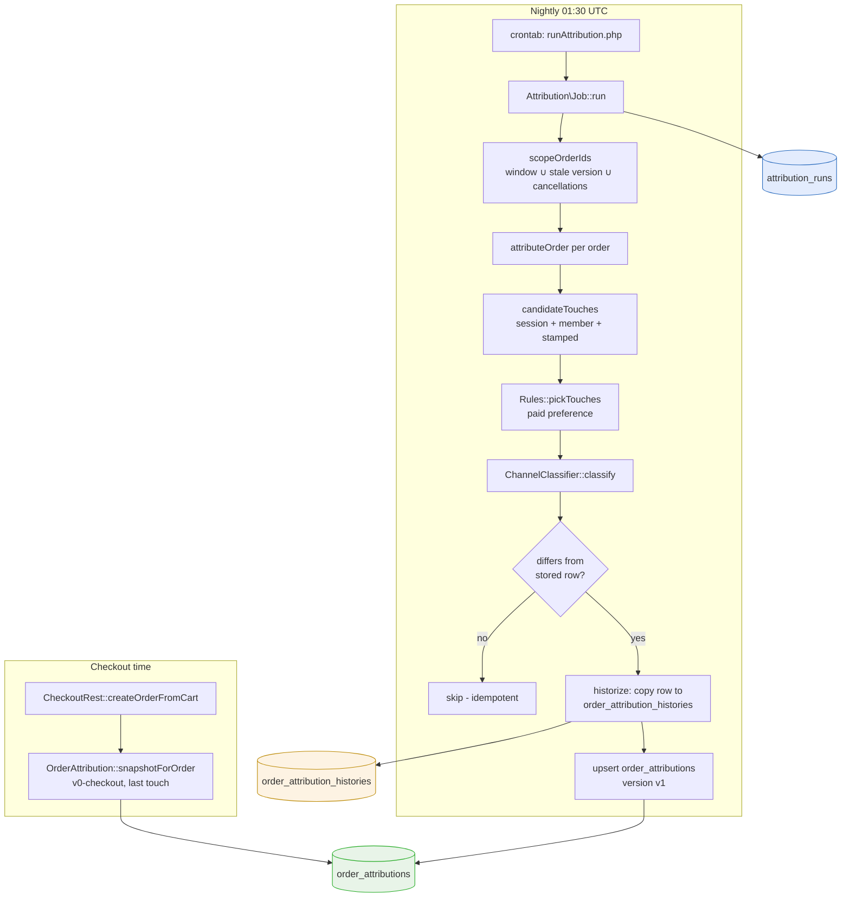

# GEC Ads Attribution - Nightly Attribution Job and Versioned Restatement (Phase 4)

Phase 4 of GEC-ADS-ATTRIBUTION-001 adds the official attribution model to goldeneaglecoin.com: a nightly job that recomputes every order's marketing attribution under a versioned rule set, preserves superseded results in a history table, and corrects facts that were unknowable at checkout time. This report explains why a second attribution pass exists at all, how the versioning scheme keeps reported numbers reproducible, and where the implementation deviates deliberately from the design document. It builds directly on the phase 1–2 report, which covered the cohort LTV report and the touch-capture pipeline; the data model introduced there (`visitor_touches`, `order_attributions`, `attribution_runs`) is assumed known.

> [!summary]
> - A synchronous checkout snapshot (`v0-checkout`) and a nightly recomputation (`v1`) coexist by design: the snapshot guarantees a row exists, the job guarantees the row is right.
> - The job is idempotent through semantic change detection: an order whose recomputed attribution equals the stored row is not touched, so history rows are always genuine supersessions.
> - Cancellations restate `is_first_order` on *sibling* orders that can lie far outside any date window — the scope query has a dedicated branch for this.
> - One channel classifier serves both the v0 snapshot and the v1 job; `VisitorTouch::channelFor` delegates to it, making divergence structurally impossible.

## Why this phase exists

Phase 2 writes an `order_attributions` row synchronously inside `CheckoutRest::createOrderFromCart()`. That snapshot has three structural limitations, each a direct consequence of *when* it runs.

First, the snapshot is frozen at order creation. If the customer's earlier order is cancelled a month later, this order retroactively becomes their first non-cancelled order, and the stored `is_first_order = 0` is now wrong. Cost-of-acquisition arithmetic divides spend by new customers, so a wrong first-order flag corrupts the one metric the whole project exists to compute.

Second, the snapshot must never block checkout, so it runs the cheapest defensible model: plain last-touch over whatever touches are visible in that request. It cannot afford preference rules (a paid click should beat a later organic revisit), and it cannot wait for external data such as Google Ads click lookups.

Third, attribution rules change. When they do, every historical number computed under the old rules must remain explainable. A single mutable row per order cannot answer "what did we report last month" once it has been overwritten.

The design answer (decision D4 in the design document) is a versioned model: the snapshot writes `attribution_version = 'v0-checkout'`; the nightly job rewrites rows under the current official version (`v1`), copies each superseded result to a history table first, and records every execution in `attribution_runs`. Reports filter on `attribution_version`, so a version bump never silently changes published numbers.

## Architecture



Three new artifacts carry the phase:

| Artifact | Location | Responsibility |
|---|---|---|
| `ChannelClassifier` | `src/lib/Attribution/ChannelClassifier.php` | Deterministic touch → channel slug mapping, shared by v0 and v1 |
| `Rules` | `src/lib/Attribution/Rules.php` | The versioned rule set: paid identification, touch picking, campaign resolution, verification |
| `Job` | `src/lib/Attribution/Job.php` | Scope, orchestration, change detection, history writes, run bookkeeping |

The CLI wrapper `scripts/cron/runAttribution.php` is deliberately thin — option parsing and a logger closure — so every behavior of consequence lives in the library class and is reachable from PHPUnit. The crontab line (`30 1 * * *` in `infra/webserver-config/common/crontabs/gec`) is checked in; production installs it via `step-install-crontabs.sh`.

## Implementation details

### One classifier, two callers

Phase 2 shipped channel classification as a static method on the touch model, `VisitorTouch::channelFor()`. Phase 4 needs the same logic plus rules that depend on order context (a promotion code is a property of the order, not of any touch). Duplicating the logic in the job would create two classifiers that drift apart, and the drift would be invisible until someone compared a checkout-time channel with a nightly channel for the same order.

The extraction therefore inverts the dependency: the full implementation moves to `Attribution\ChannelClassifier::classify(?array $touch, array $context = [])`, and the model method becomes a one-line delegation. Existing callers keep working; new callers pass context. The classifier's precedence order is a documented contract:

1. Click id type — `gclid`/`gbraid`/`wbraid` → `google_ads`, `msclkid` → `bing_ads`, `fbclid` → `meta_ads`, `ttclid` → `tiktok_ads`. A click id is the strongest possible evidence and beats everything, including the promo-code rule.
2. Paid `utm_medium` (`cpc`, `ppc`, `paid`, `display`, `pmax`, `shopping`, …) — mapped to a platform by substring of `utm_source`, else generic `paid`.
3. Recover-cart landing pages (`recoverCart/r/` in the path) → `email_recover_cart`. These links are generated by `RecoverCartHelper` in abandoned-cart mails.
4. E-mail — `utm_medium=email`, or the referrer host belongs to an e-mail service provider's click-tracking domain (`list-manage.com`, `klclick.com`, `constantcontact.com`, …). ESP referrers matter because newsletter links frequently lack UTM tags.
5. `utm_medium=affiliate` → `affiliate`.
6. Order context: a promotion code whose `promocodes.description` starts with `AD:` → `promo`. The prefix is a naming convention that lets marketing hand out attribution-carrying codes in offline or untagged placements. This rule fires even with no touch at all.
7. Any other UTM presence → `campaign`; then referrer (search engines → `organic`, otherwise `referral`); then `direct`.

The precedence resolves a real ambiguity: an order that carries both a Google click id and an `AD:` promotion code is a Google Ads order, because hard click evidence outranks a convention. The unit test `testAdPromocodeContext` pins exactly this case.

### The v1 rules

`Attribution\Rules` holds the version constants (`VERSION = 'v1'`, `MODEL = 'first_and_last'`) and four pure functions. Purity is the point: every rule is testable without a database, and the job composes them.

The interesting rule is touch picking. The design specifies paid preference: among a customer's touches inside the window, the credited first touch is the earliest *paid* touch if any paid touch exists, else the earliest touch; symmetrically for the last touch.

```php
public static function pickTouches(array $touches): array
{
    $paid = array_values(array_filter($touches,
        fn ($t) => self::hasPaidIdentifier(self::asArray($t))));
    $first = $paid[0] ?? $touches[0];
    $last  = $paid ? $paid[count($paid) - 1] : $touches[count($touches) - 1];
    return [$first, $last];
}
```

A touch is paid when it carries a click id or a paid `utm_medium`. The consequence, verified by `testFirstAndLastPreferPaidTouches`: the sequence *organic search → paid click → direct revisit* credits the paid click as both first and last touch, where the v0 snapshot would have credited the direct revisit as last touch. This is the single largest semantic difference between v0 and v1, and it moves attribution in the advertiser's favor by design — the project measures ad effectiveness, and an ad click sandwiched between organic visits is the event being paid for.

Campaign resolution in v1 handles only the case that needs no external data: a purely numeric `utm_campaign` is taken as the Google Ads campaign id, because the account-level tracking template installed for this project appends `utm_campaign={campaignid}`. The gclid → campaign lookup through the Ads API belongs to phase 3 and slots into this same function.

### Scope: three reasons an order needs recomputation

`Job::scopeOrderIds()` is one query with three OR branches, each corresponding to a distinct reason recomputation is necessary:

```sql
SELECT DISTINCT o.id
FROM orders o
LEFT JOIN order_attributions oa ON oa.order_id = o.id
WHERE o.order_type = 'WEB' AND o.status <> 'CANCELLED' AND o.placed_at IS NOT NULL
  AND (
    (o.placed_at >= ? AND o.placed_at <= ?)                    -- 1. restatement window
    OR (oa.id IS NOT NULL AND oa.attribution_version <> ?)     -- 2. stale version
    OR o.member_id IN (SELECT member_id FROM orders            -- 3. recent cancellation
        WHERE status = 'CANCELLED' AND member_id IS NOT NULL
          AND updated_at >= ? AND updated_at <= ?)
  )
```

Branch 1 is the routine case: orders placed in the last `attribution.restate_days` days (default 7) get re-evaluated nightly, picking up touches that were bound to the member after checkout.

Branch 2 is the upgrade path. Any stored attribution whose version differs from the current one is in scope regardless of age. On the first production run this restates every v0 snapshot to v1 in one pass; after a future version bump it does the same for v1 → v2. No separate backfill tooling exists or is needed.

Branch 3 is the subtle one and deserves the derivation. Suppose a customer places order A in January and order B in February; B is stored with `is_first_order = 0`. In June, A is cancelled. B — placed five months ago, far outside any restatement window — is now the customer's first non-cancelled order, and its stored flag is wrong. A window over `placed_at` can never catch B, because nothing about B changed. What changed is a *sibling* order. The scope therefore includes all non-cancelled WEB orders of any member who had an order cancelled inside the window, using `orders.updated_at` of the cancelled order as the event timestamp. The integration test `testCancellationRestatesIsFirstOrder` builds exactly this A/B pair and asserts the flip, including the history row that preserves the pre-flip result.

The branch has a known dependency worth stating plainly: it observes cancellations through `updated_at`. Any code path that sets `status = 'CANCELLED'` via raw SQL without touching `updated_at` would evade it until the affected order enters scope another way. The application's cancellation paths go through ActiveRecord, which maintains `updated_at`; the risk is confined to manual database surgery.

### Candidate touches at 01:30 in the morning

The snapshot assembles candidate session ids from the live checkout request: the PHP session, the cart's session, the cart information's session. None of these exist when a cron process examines an order days later — there is no PHP session, and carts are garbage collected. The job's `candidateTouches()` therefore builds its candidates from what persists:

- the session id stored on `order_informations` (written at order creation),
- all touches bound to the order's member id (the login hook from phase 2 binds pre-login touches to the member),
- all touches already stamped with this `order_id`.

The third source exists for one specific data-loss scenario: the snapshot's cookie fallback reconstructs touches from `gec_mkt`/`_gcl_aw` cookies and stamps them with the order id at creation time. Those reconstructed touches may carry a session id that matches nothing after garbage collection, and may belong to no member (guest checkout). The order-id stamp is then the only surviving link, and without this source the nightly job would *remove* attribution that the snapshot had correctly captured — a regression the design's pseudocode (which reads only `order_informations.session_id`) would have shipped. The three sources are merged by touch id and re-sorted by `(touched_at, id)` because `Rules::pickTouches` assumes oldest-first ordering.

### Idempotency through semantic change detection

The job may run twice in a night (manual invocation, cron overlap) and must converge: the second run over unchanged data writes nothing. The mechanism is a field-by-field comparison between the stored row and the recomputed attributes over 19 semantic fields — model, version, window, touch ids, touch count, click id and type, channel, the five UTM fields, referrer, landing page, campaign id, and the two flags. Two bookkeeping fields are deliberately excluded: `attribution_run_id` and `attributed_at` change on every write by definition, so including them would make every order "changed" on every run, rewrite every row nightly, and flood the history table with copies that supersede nothing.

The comparison normalizes types before testing inequality. MySQL hands back strings and integer-ish values (`'1'`, `1`); the recomputed attributes carry PHP ints and bools. A strict `!==` without normalization reports `'1' !== 1` as a change for every boolean column on every row — the flood scenario again, arrived at from a different direction. Booleans are cast on both sides; numerics are cast when either side is an int.

Only when a difference survives normalization does the job write, and the write order is fixed: history first, then upsert.

```php
if ($changed && !$this->dryRun) {
    if ($existing) {
        $this->historize($existing, $run);   // copy old row, superseded_by_run_id = current run
        $existing->set_attributes($attributes);
        $existing->save();
    } else {
        OrderAttribution::create($attributes);  // first attribution: nothing to historize
    }
}
```

`historize()` is a single `INSERT … SELECT` that copies the live row into `order_attribution_histories`, adding `order_attribution_id` (which live row this was) and `superseded_by_run_id` (which run replaced it). Because writes happen only on change, the history table carries an invariant worth relying on in later analysis: every history row is a result that was actually reported at some point and then genuinely superseded. Counting a member's history rows counts real attribution changes, not job executions.

A freshly attributed order (no prior row) produces no history row — there is no superseded result to preserve. `testJobAttributesOrderFromMemberTouches` asserts this explicitly.

### Run bookkeeping and the CLI

Every execution creates an `attribution_runs` row up front (`status = 'running'`) and finalizes it with counters: orders seen, attributed (a non-direct channel or at least one credited touch), verified (hard campaign evidence on the credited touch). A thrown exception is caught once at the top of `run()`, recorded on the run row (`status = 'error'`, message plus trace, truncated), and the run returns rather than rethrows — a cron job that dies silently between "running" and anything else is the failure mode being avoided.

`--dry-run` inverts the persistence rule wholesale: the run row is instantiated but never saved, and `attributeOrder` computes everything but writes nothing. The dry run still reports the would-be counters, which makes it the correct first command against any new database:

```
$ php scripts/cron/runAttribution.php --dry-run --from 2026-08-01
[2026-08-20 15:17:35] attributing 1 orders (2026-08-01 .. 2026-08-20, window 30d, version v1, DRY RUN)
[2026-08-20 15:17:35] done: 1 seen, 1 attributed, 1 verified, 1 changed
```

### Verification against real data

The dev database contains order 10633532 from the phase 2 browser test: a UTM-tagged visit, registration, and Bank Wire checkout, snapshot-attributed as `v0-checkout / google_ads / utm_campaign=summer`. Running the job against this database produced the exact expected state transition:

| | before | after run 1 | after run 2 |
|---|---|---|---|
| `order_attributions.attribution_version` | `v0-checkout` | `v1` | `v1` (untouched) |
| `order_attributions.attribution_run_id` | NULL | 1 | 1 (untouched) |
| history rows | 0 | 1 (`v0-checkout`, `superseded_by_run_id = 1`) | 1 |
| job output | — | `1 seen … 1 changed` | `1 seen … 0 changed` |

The `0 changed` on the second run is the idempotency property demonstrated on production-shaped data rather than fixtures.

## Testing

The split follows the code's own boundary. `attributionRulesTest.php` (14 tests, 58 assertions) exercises the pure functions with no database beyond bootstrap: every classifier precedence rule, paid preference in `pickTouches` including the all-organic and single-touch degenerate cases, numeric-only campaign resolution, and a completeness check that every emittable channel slug has a display name in `OrderAttribution::CHANNEL_NAMES` — a test that fails the build if someone adds a channel without wiring the admin UI vocabulary.

`attributionJobTest.php` (9 tests, 84 assertions) drives `Attribution\Job` end to end against the test schema: member-touch attribution with run counters, v0 → v1 upgrade with history, double-run idempotency, paid preference through the full pipeline, cancellation restatement, dry-run write-freedom, the `AD:` promo channel with zero touches, and scope exclusion of cancelled/non-WEB orders.

Two fixture traps surfaced, both instructive about this codebase. `Member::create(['firstname' => …])` throws `UndefinedPropertyException` — the column is `first_name`, and the established factory is `Member::CreateMember($first, $last, $password, $email)`. And `Promocode::create` with only code/description/formula fails validation *silently* at the call site (php-activerecord returns an invalid model with a NULL id rather than throwing); the test then wrote `promocode_id = 0` and the classifier correctly saw no promo context. The symptom — `'direct'` instead of `'promo'` — appeared two layers away from the cause. The fix supplies the required `minimum_amount`/`valid_from`/`valid_until` and asserts `$promocode->id` is non-null immediately, so a future validation change fails at the fixture, not at the assertion.

The full attribution suite now stands at 45 tests / 357 assertions across four files, one pre-existing skip (a checkout integration test gated on a stale payment schema, documented in phase 2).

## Deviations from the design document

Three deliberate deltas, each with a reason:

1. **No `member_dedup` view.** The design sketches a SQL view for canonical-member deduplication. The implementation reuses `OrderAttribution::isFirstNonCancelledOrder()` — the tested e-mail-dedup query from phase 2 — per order instead of a `ROW_NUMBER()` window over a view. The per-order query is one indexed lookup, the nightly scope is bounded, and a second implementation of the D6 dedup semantics is a second chance to get guest e-mail handling wrong. If profiling ever shows this as the job's cost center, the view is a drop-in optimization.
2. **Richer touch candidates than the pseudocode.** Covered above; the pseudocode's `order_informations.session_id`-only scope would drop cookie-reconstructed guest attributions.
3. **Campaign-id preservation.** When the rules resolve no campaign id but the stored row has one, the job keeps the stored value. This is a forward seam: the phase 3 importer will enrich rows with campaign ids from click lookups, and the nightly job must not erase that enrichment. The cost is that a stale campaign id can survive a re-run if touch data changes; the trade was taken knowingly and is flagged in the diary for review.

## Current status

- Phases 1, 2 and 4 are implemented, tested and on PR #982 (branch `task/add-ad-tracking-gec`); phase 4 spans commits `38e240aca` (history table), `2fc006359` (classifier + rules), `357605c4f` (job + CLI + crontab), `c002def3c` (ticket docs).
- Deploy requires both migrations (`2026-08-19--marketing-attribution.php`, `2026-08-20--attribution-job.php`); the crontab installs through the existing provisioning step. The first production run restates all v0 rows.
- Phase 3 (Google Ads importer) remains blocked on credentials: developer token, OAuth refresh token under a role account, customer/MCC ids, and the account-level tracking template. The unblocking checklist is in the ticket diary (step 18).
- Phase 5 (campaign CAC/ROAS reports) needs phase 3's spend data for CAC, but its new-vs-existing and reconciliation queries depend only on data that now exists.

## Important project docs

- Ticket: `ttmp/2026/08/18/GEC-ADS-ATTRIBUTION-001--google-ads-campaign-to-order-attribution-cac-and-ltv-analysis/` (design doc §14 = this phase; diary steps 18–20; this report as `report/02-…`).
- Companion note: [[PROJ - GEC Ads Attribution - Cohort LTV Report and Marketing Touch Capture (Phase 1-2)]].

## Open questions

- Should the promo-channel rule outrank generic `campaign` when both an `AD:` code and non-paid UTMs are present? Current precedence says yes for bare UTMs, no for paid UTMs; marketing may want a different tie-break once real promo campaigns run.
- Whether `orders(status, updated_at)` needs an index for the cancellation-scope subquery on production volume — deferred until the first production runs produce timing data.

## Near-term next steps

- Obtain phase 3 credentials (the long pole is Google's Basic-access review for the developer token; the application should be filed before any importer code exists).
- Phase 5 partial start: new-vs-existing and reconciliation-lite reports over `order_attributions` alone.
- Wire `Rules::resolveCampaignId` to `google_ads_click_lookups` when phase 3 lands.
