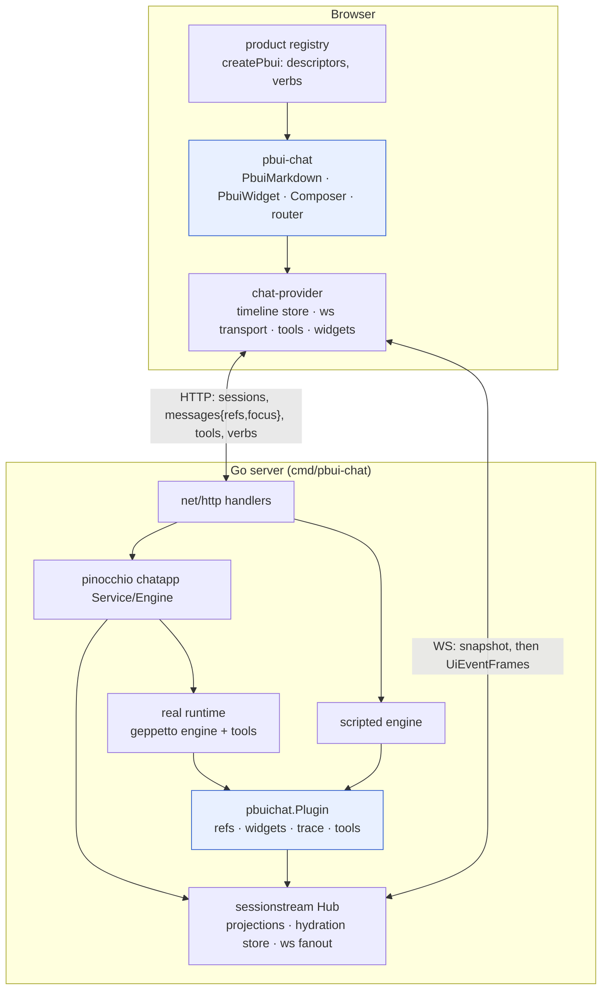

# PBUI Chat Agent: Presentation-Native Chat with Custom PBUI Widgets

A chat interface for an LLM agent usually renders strings and, on top of the strings, a small number of hand-built cards. Each card is a separate agreement between the model's prompt, a backend parser, a protobuf message, a frontend decoder and a React component; CoinVault, the shipped reference, needs about thirteen edit points to add one. This project replaces that arrangement with one in which the agent emits **objects**: every structured thing it says — a product, a column, a source, a proposal, a widget, a tool call, a performed action — is a PBUI presentation reference with a descriptor, and therefore gets the object menu, accept mode, the inspector, the watchlist, the trace and hydration from the presentation layer rather than from per-widget code. Custom widgets are declarative documents composed of PBUI components and embedded objects, validated against one vocabulary on both sides of the wire, so a new widget is data rather than a deploy.

The implementation lives in the `pbui` repository: a Go plugin for pinocchio's chat application layer (`pkg/pbuichat`), a Go HTTP server with a scripted demo engine and an optional real runtime (`pkg/chatserver`, `cmd/pbui-chat`), a React package (`packages/pbui-chat`) with a demo product that the binary embeds, and devctl profiles for development and production. The design and the implementation diary are in the docmgr ticket `PBUI-AGENT-1`.

> [!summary]
> Four decisions define the project:
> 1. The model names objects as `[[type:id|label]]` mentions; the server resolves them; the registry decides their verbs; the browser performs verbs; a trace remembers them.
> 2. Objects and widgets ride on pinocchio's existing widget-instance entity (`widget_name` `pbui.refs` / `pbui.widget` / `pbui.error`); the only new wire type is the verb trace.
> 3. One `vocabulary.json`, exported from the TypeScript registry and embedded by the Go binary, validates model output, generates the model's instructions and answers the `pbui_describe_types` tool.
> 4. A scripted engine exercises every emission path without model credentials, which is what makes the demo, the tests and the `prod` devctl profile possible.

## Why this project exists

PBUI is a presentation protocol, not a widget toolkit. A `PresentationReference` is `{type, value}`; a descriptor supplies `label`, `describe`, `actions` and `tone`; an action carries a **verb**, which is serialisable data rather than a closure; a single `ObjectMenu` renders any object's verbs; accept mode lets a command ask for an object of a given type and be satisfied by a click on any presentation of that type, across tiles. The `datalab-ui` product demonstrates that this model scales to fifteen types and a few dozen verbs.

Chat agents have not used it. The existing stack in the workspace — geppetto for inference and tools, sessionstream for session-scoped events with hydration, pinocchio `chatapp` for the chat application layer, react-chat `chat-provider` for the browser runtime — is complete as a chat stack, but its widgets are opaque React components keyed by name. Nothing in a rendered widget is an object the user can right-click, nothing the agent shows can be handed back to it by pointing, and the agent cannot ask the user to pick something. The question the project answers is what a chat agent looks like when its output is made of PBUI objects from the start, and how little new machinery that requires.

The answer to the second part is the more useful one: almost none. The seams needed already exist, and the work is an object layer on top of them.

## The object model

The design rests on a single rule, stated once in the design document and applied throughout: **the model names objects; the server resolves them; the registry decides their verbs; the router performs them; the trace remembers them.** Each clause assigns one responsibility to one component, and the boundaries between them are where validation happens.

| Concept | Definition | Where it is carried |
|---|---|---|
| Mention | `[[type:id\|label]]` in model prose | message text; resolved into the `pbui.refs` document |
| Reference | `{type, id, value?, provenance?}` | `proto Reference`; JSON inside widget props |
| Descriptor | per-type `label`, `describe`, `actions → verbs`, `tone` | product TypeScript (`descriptors/<type>.ts`) |
| Verb | `{kind, …}`, serialisable, never a closure | product `Verb` union; `vocabulary.json#/verbs` |
| Widget document | declarative composition of PBUI components with embedded references and verb chips | `WidgetInstanceEntity.props` under `widget_name: "pbui.widget"` |
| Accept request | `{types, prompt}` asked by the agent; answered by clicking | human tool `pbui_accept` |
| Proposal | an object whose verbs resolve a parked human tool | human tool `pbui_propose` |
| Trace entry | one performed verb with actor, target, outcome, sequence number | `PbuiVerbPerformed` command → `PbuiTraceEntry` entity |
| Vocabulary | types, tones, docs, verb schemas, widget kinds | `vocabulary.json` (TypeScript → Go) |

Two consequences follow from verbs being data. The model can *propose* verbs (as chips under a widget) that the browser performs locally without a model round trip, and the browser can *report* every performed verb to the server as data the model can read back through a tool. Neither is possible with closures.

## Current project status

Implemented and tested in the `pbui` repository on branch `task/add-pbui-agent`:

- `proto/hyperslop/pbui/chat/v1/chat.proto` and generated Go and TypeScript.
- `pkg/pbuichat`: vocabulary loading and validation, mention scanning, widget-document validation with limits, the emitter, the `chatapp.ChatPlugin`, the trace command and projections, the tool-result projection rule, three geppetto tools, the generated system-prompt section; seven unit tests.
- `pkg/chatserver`: server wiring, eleven HTTP routes, the scripted engine with nine scenarios, the real-runtime factory, the demo world; five end-to-end tests over the HTTP surface and the hydrated snapshot.
- `pkg/chatui`: SPA serving with the embed tag and on-disk fallback; route tests.
- `cmd/pbui-chat`: glazed `serve` and `prompt` commands.
- `.devctl.yaml` with `dev`, `dev-real` and `prod` profiles and the NDJSON plugin.
- `packages/pbui-chat`: the React package and the demo product (see the TypeScript section).

Exercised end to end in a browser against the embedded binary (devctl `prod` profile) with the scripted engine, and over the API against a real model (`gpt-5-nano-low` through a pinocchio profile): the model calls `shop_products`, the result is projected into a table widget, its own `pbui_widget` document is accepted after the validator's messages corrected it, and the mentions in its prose resolve into a `pbui.refs` entity.

Not yet done: agent-driven workbench mutations against a workbench host (design tier 4).

## Project shape

```
pbui/
  proto/hyperslop/pbui/chat/v1/chat.proto    Reference, VerbPerformedCommand, TraceEntry
  gen/go/hyperslop/pbui/chat/v1/             generated Go
  pkg/pbuichat/                              the plugin: vocabulary, mentions, widgetdoc,
                                             emitter, plugin, trace, tools, prompt, events
  pkg/chatserver/                            server wiring, handlers, real runtime
    demo/                                    vocabulary.json, the 8-SKU world, resolvers
    scripted/                                the scripted engine and its scenarios
  pkg/chatui/                                SPA serving (embed tag / on-disk), route tests
  cmd/pbui-chat/                             serve + prompt commands
  packages/pbui-chat/                        @hyperslop-systems/pbui-chat (React)
    demo/                                    the demo product; builds into pkg/chatui/embed
  plugins/devctl_pbui_chat.py  .devctl.yaml  dev / dev-real / prod
  ttmp/2026/08/20/PBUI-AGENT-1--…/           showcase, design, diary
```

## Architecture



The blue nodes are the new code. Everything else is the existing stack, used through its public seams: `chatapp.ChatPlugin` for projections, `widgets.PublishWidgetInstance*` for durable widgets, `frontendtools.Manager.Request` for browser-answered tools, `sessionstream.Hub.RegisterCommand` for the one new command, and chat-provider's `defineWidget`, `HumanTool` and `defineLiveAndHydrateAdapter` on the browser side.

## The wire contract

### Widget instances carry objects and widgets

Pinocchio's widget plugin already defines a durable entity, `ChatWidgetInstance`, with `widget_name`, `parent_message_id`, `status` and `props` (an inner `google.protobuf.Struct`), plus started/patched/completed/removed events and a live-and-hydrate adapter in chat-provider. The schema policy enforced by `sessionstream-lint` forbids a top-level `Struct` payload but allows one as a field, which is exactly this shape. Reusing it means there is one hydration path for objects and widgets, and no new adapter to keep in parity.

| `widget_name` | `instance_id` | `props` |
|---|---|---|
| `pbui.refs` | `<messageId>-refs` | `{schema_version: 1, refs: {"<type>:<id>": Reference}}` |
| `pbui.widget` | `<messageId>-w<n>` | the widget document |
| `pbui.error` | `<widgetId>-error` | `{message, document?, at}` |

### One new proto package

```proto
package hyperslop.pbui.chat.v1;

message Reference  { string type = 1; string id = 2; google.protobuf.Struct value = 3; Provenance provenance = 4; }
message Provenance { string message_id = 1; string tool_call_id = 2; string widget_id = 3; }
enum Actor { ACTOR_UNSPECIFIED = 0; ACTOR_HUMAN = 1; ACTOR_AGENT = 2; }

message VerbPerformedCommand { string client_seq = 1; Actor actor = 2; google.protobuf.Struct verb = 3; Reference target = 4; string outcome = 5; }
message TraceEntry { uint64 seq = 1; Actor actor = 2; google.protobuf.Struct verb = 3; Reference target = 4; string outcome = 5; google.protobuf.Timestamp at = 6; string client_seq = 7; }
```

`VerbPerformedCommand` is the typed replacement for pinocchio's `WidgetActionCommand`, which exists in `widget.proto` and as the constant `CommandWidgetAction` but is registered by nothing and handled by nothing. Before this project, the only browser-to-backend interaction channel was the frontend-tool result.

### HTTP routes

```
POST /api/chat/sessions                      -> {sessionId}
POST /api/chat/sessions/{id}/messages        {prompt, refs?: Reference[], focus?: {reference?, tile?}}
POST /api/chat/sessions/{id}/stop
GET  /api/chat/sessions/{id}                 hydrated snapshot
POST /api/chat/sessions/{id}/tools/manifest  browser tool manifest (pbui_accept, pbui_propose, …)
POST /api/chat/sessions/{id}/tools/results   a browser tool result
POST /api/chat/sessions/{id}/verbs           VerbPerformedCommand as JSON
GET  /api/pbui/vocabulary                    vocabulary.json
GET  /api/chat/ws                            sessionstream websocket
GET  /{$}   GET /ui/{path...}   GET /static/{path...}
```

The routes use Go 1.22 `http.ServeMux` patterns and are registered before the SPA handler. The SPA follows the PBUI playbook's three boundaries: the front door is an exact match on the empty path, `/ui/` falls back to `index.html`, and `/static/` never does, so a stale chunk fails with a 404 rather than a misleading syntax error.

## Implementation details

### Mentions become a refs document

The model writes `[[product:2049|1oz American Gold Eagle 2024]]`. The browser can render a chip from that syntax alone, before any server work, as an `unresolved` presentation. The server's job is to turn the id into the value the descriptor needs to decide its verbs, and to do it without trusting the model with anything but the id.

```go
// pkg/pbuichat/mentions.go
var mentionPattern = regexp.MustCompile(`\[\[([A-Za-z_][A-Za-z0-9_.-]*):([^\]|\n]+?)(?:\|([^\]\n]*))?\]\]`)

// pkg/pbuichat/emitter.go — called on text-segment-finished
func (e *Emitter) EmitRefsForText(ctx, publish Publisher, messageID, text string) (int, error) {
    mentions := UniqueMentions(ScanMentions(text))
    // keep only keys this message has not published yet, bounded by Limits.RefsPerMessage
    // resolve each: unknown type -> Unresolved(...); resolver error -> Unresolved(...)
    // publish WidgetInstanceStarted (first time) or WidgetInstancePatched carrying the WHOLE refs map
}
```

The resolver is application-owned and dispatches by type:

```go
type Resolver interface {
    Resolve(ctx context.Context, typ, id string) (map[string]any, error)
}
resolver := pbuichat.ResolverMux{
    "product": pbuichat.NewStaticResolver(products),   // the demo; a product wraps its database
    "order":   orderResolver,
}
```

Resolution failure is never an error to the user: an unknown type or id produces a reference of type `unresolved` whose value carries the original type, id, label and reason. The chip still has a menu (one verb: ask the agent what this is), and nothing the model says can break the page.

```mermaid
sequenceDiagram
  participant M as model / scripted engine
  participant PL as pbuichat.Plugin
  participant R as Resolver
  participant HUB as sessionstream
  participant B as browser
  M->>PL: text-segment-finished "…[[product:2049|AGE]]…"
  Note over B: chip already rendered as <unresolved product 2049>
  PL->>R: Resolve("product","2049")
  R-->>PL: {name, qty, price, …}
  PL->>HUB: WidgetInstanceStarted{pbui.refs, m17-refs, props.refs}
  HUB-->>B: UiEventFrame → refs entity
  Note over B: chip becomes <product 2049>; verbs decidable
```

### Widget documents

A widget document is a closed vocabulary of child kinds, each mapping to a PBUI component, plus slots for references and verb chips. Version 1 has twelve kinds: `text`, `refs`, `meter`, `sparkline`, `segmented`, `stat`, `callout`, `table`, `diff`, `log`, `form`, and `widget` for nesting.

```yaml
format: pbui.widget
schema_version: 1
title: Gold Eagle health
layout: stack
children:
  - { kind: meter,     label: stock vs reorder floor, value: 4, max: 19, ref: { type: category, id: "7" } }
  - { kind: sparkline, label: units sold, values: [12, 13, 17, 24, 24, 18, 14, 10, 9, 9, 9, 12] }
  - { kind: segmented, label: stock value by metal, parts: [{ label: gold, value: 61 }, …] }
  - { kind: refs,      label: worst first, refs: [{ type: product, id: "2077", value: { name: … } }] }
  - { kind: callout,   tone: warning, text: "1/10oz AGE 2024 is out of stock" }
verbs:
  - { label: Watch the category, verb: { kind: watch, ref: { type: category, id: "7" } } }
  - { label: Reorder now, danger: true, verb: { kind: reorder, productId: "2077" } }
```

The Go validator (`ValidateWidgetDocument`) checks the format and version, the layout, every child's kind and kind-specific requirements (a table needs columns, a meter needs a numeric value), nesting depth, total child count, table row count, every embedded reference's shape, and every verb chip against the vocabulary. The limits are explicit values (`Limits{RefsPerMessage: 32, WidgetBytes: 256 KiB, WidgetChildren: 64, WidgetDepth: 3, TableRows: 500, TraceKeep: 500}`) because the document comes from an untrusted model.

A document that fails validation is not dropped. `Emitter.EmitWidget` publishes a `pbui.error` instance carrying the message and the offending document, and returns the error so the tool can tell the model. Silence is the failure mode this rule exists to prevent: a model-driven interface in which a rejected widget produces no output teaches both the user and the model that nothing happened.

### Patch semantics: why every patch carries accumulated state

Streaming a table row by row exposed a divergence between the two sides of the existing stack. Pinocchio's timeline projection merges a `WidgetInstancePatched` by replacing each top-level key, and when `patch_paths` is set it *replaces* the listed keys. Chat-provider's store, when `patch_paths` is set, *appends* arrays under the listed keys. A patch carrying only the new rows with `patch_paths: ["rows"]` therefore renders correctly live and shows only the last batch after a reload, because the hydrated entity was overwritten batch by batch.

The only encoding both sides treat identically is a patch **without** `patch_paths` whose top-level values are the whole accumulated state. That is also sessionstream's documented pattern for streaming entities (each delta carries the accumulated value, so a reconnecting client never folds deltas). `Emitter.PatchWidget` takes the complete value per key, and `EmitStreamingTable` rebuilds the full `children` array for every batch:

```go
for i := 0; i < len(rows); i += batch {
    accumulated := NewTableDocument(title, docID, columns, rows[:end], end < len(rows))
    e.PatchWidget(ctx, publish, widgetID,
        map[string]any{"children": accumulated["children"]}, WIDGET_STATUS_STREAMING)
}
e.CompleteWidget(ctx, publish, widgetID)
```

The same rule governs the refs document: the second text segment of a message resolves only the new mentions but publishes the whole map.

### The verb trace

The browser is the only place a verb becomes an effect, so it is the only place that can report one. After the router performs (or rejects) a verb it posts `{clientSeq, actor, verb, target, outcome}` to `/verbs`; the handler decodes it into `VerbPerformedCommand` and submits it to the hub. The command handler assigns a per-session sequence number, validates the verb against the vocabulary, and publishes `PbuiVerbRecorded` with a `TraceEntry`.

An invalid verb is recorded, not dropped: its outcome becomes `rejected:<reason>`. The trace must reflect what the interface did, and an audit that only sees successes is not an audit. The UI projection forwards every entry live (`PbuiTraceEntryUpsert`); the timeline projection persists it as `PbuiTraceEntry` with id `trace-<seq>` and tombstones the entry `TraceKeep` positions older. Because the in-memory counter restarts with the process, `ProjectTimeline` seeds it from the highest `seq` in the timeline view, so a rehydrated session never reuses a number.

The model reads the trace through `pbui_trace`, which is what makes "what did I just do?" answerable from facts. The scripted engine's trace scenario narrates the entries as mentions of their targets, so the answer is itself made of objects.

### Tools and the generated instructions

| Tool | Mode | Purpose |
|---|---|---|
| `pbui_widget` | backend | validate and publish a widget document |
| `pbui_trace` | backend | read the session's recent verbs |
| `pbui_describe_types` | backend | the vocabulary in full |
| `pbui_accept` | human (browser) | ask the user to pick an object of given types |
| `pbui_propose` | human (browser) | ask for approval of a consequential action |

Backend tools are `geptools.NewToolFromFunc` definitions registered per session, because `pbui_trace` reads one session's trace. `pbui_widget` runs inside geppetto's tool executor, which does not know the chat message the run belongs to; the tool publishes a custom geppetto event (`pbui-widget-requested`) through `events.PublishEventToContext`, and the plugin's `HandleRuntimeEvent` — which receives `runtime.MessageID` — assigns the widget id and publishes the instance. Human tools are advertised by the browser's manifest, so a client that cannot accept simply does not offer the tool and the model is not told it exists.

The system-prompt section is generated from the vocabulary, so adding a type to the registry changes the model's instructions without prose edits:

```
## Objects and verbs (PBUI)
… Write an object as a mention: [[type:id|label]]. Known types and what identifies them:
  product      a sellable coin SKU in the shop inventory; id = products.id (a number); e.g. [[product:2049|1oz American Gold Eagle 2024]]
  field        a column of a table the agent produced; id = <tableId>.<column>; e.g. [[field:t3.qty|qty]]
  …
Never invent ids. The interface resolves mentions server-side; an unknown id is shown to the user as unresolved.
To show structured results, call pbui_widget with a widget document … Only these verb kinds exist:
  addFilter{field:string, op:string, tableId:string, value:string} — filter a table by a field
  resolveProposal{decision:string, id:string} — approve or reject a proposal (consequential: only a human may perform it)
```

`go run ./cmd/pbui-chat prompt` prints it.

### Accept mode and proposals over the frontend-tool bridge

The agent asking the user for an object needs no new wire type. `frontendtools.Manager.Request` publishes `FrontendToolCallRequested` and blocks the run until the browser posts a result; chat-provider renders a human tool through its `render` function. The `pbui_accept` human tool's render calls `pbui.accept({types, prompt})` on mount — which raises the `AcceptBanner` and makes every presentation of those types clickable, across tiles — and responds with the chosen reference or `{cancelled: true}`. A proposal is the same mechanism with a card whose verbs call `respond`.

```mermaid
sequenceDiagram
  participant E as engine (scripted or real)
  participant FT as frontendtools.Manager
  participant HUB as sessionstream
  participant B as browser
  E->>FT: Request(pbui_accept, {types:[product], prompt})
  FT->>HUB: FrontendToolCallRequested
  HUB-->>B: tool_call entity → HumanTool.render → pbui.accept()
  Note over B: ACCEPT banner; user clicks <product 2051> in a table two messages up
  B->>HUB: POST /tools/results {reference}
  HUB->>FT: FrontendToolResultCommand
  FT-->>E: result
  E->>FT: Request(pbui_propose, {title, body, danger:true, fields})
  Note over B: <proposal> card; Approve / Reject are verbs
  B->>HUB: POST /tools/results {decision: approve}
```

Chat-provider re-parks pending human tools after hydration, so an accept request survives a reload.

### The scripted engine

A real model is not needed to exercise any of the above, and for tests, stories and a credential-free `prod` profile it must not be. The scripted engine implements the same two commands a real runtime receives (`StartInference`, `StopInference`), publishes the same user-message, run and text-segment events, and calls the same `Emitter` methods. It selects a scenario by keyword:

| Prompt contains | Scenario | Exercises |
|---|---|---|
| low, stock, eagle | low-stock | six mentions across five types, a streaming table, a next-steps widget with four verb chips |
| health, overview, dashboard | health | meter, sparkline, segmented, stat, refs, callout; a `danger` verb |
| reorder, draft | reorder | `pbui_accept`, then `pbui_propose`, then a log widget |
| compare | compare | refs from the composer or two accept requests; a comparison table |
| sql, sellers, top | sql | `RowsToTable` projection of a tool result |
| form, details | form | a form whose `product` field accepts an object |
| error, broken | error | an invalid document → `pbui.error` |
| what did I, trace | trace | `Plugin.Trace` narrated as mentions |
| otherwise | help | the menu of prompts, with mentions |

The user's typed references reach the scripted engine structurally: the HTTP handler stores `{refs, focus}` against the session before submitting the command, because `StartInferenceCommand` has no field for them. The real runtime receives them as a `pbui-refs` fenced section appended to the prompt.

### The real runtime, and two seams the scripted engine hid

A pinocchio profile becomes an engine through `profilebootstrap.ResolveCLIEngineSettings` and `NewEngineFromResolvedCLIEngineSettings`; the server wraps it in a system-prompt middleware (the product prompt plus the generated PBUI section), registers the PBUI tools, the demo data tools (`shop_products`, `shop_product`) and the browser's manifest tools in one registry, and routes tool execution through `frontendtools.BridgeExecutor` so human tools reach the browser. Running this against a real model exposed two facts about pinocchio's plugin dispatch that the scripted engine could not reveal, because the scripted engine calls the emitter directly.

First, `chatapp.Engine.handleFeatureRuntimeEvent` iterates plugins in registration order and returns at the first one that reports an event as handled. The tool-call plugin claims tool events, so a plugin that wants to *observe* tool results without replacing their projection must be registered before it. `pbuichat` never claims an event and is now first.

Second, the runtime sink that converts geppetto events into chat events handles `EventTextSegmentStarted`, `EventTextDelta` and `EventTextSegmentFinished` in its own `switch` and forwards only unmatched events to plugins. A plugin therefore never sees finished assistant text. The hook that does see every geppetto event is `ComposedRuntime.WrapSink`, the same seam CoinVault uses for its structured-output extractors. The server installs a wrapper sink that publishes refs on `EventTextSegmentFinished` and forwards the event unchanged:

```go
type refsSink struct{ next gepevents.EventSink; run *runBinding }

func (s *refsSink) PublishEvent(event gepevents.Event) error {
    if ev, ok := event.(*gepevents.EventTextSegmentFinished); ok {
        sid, messageID, pub := s.run.current()
        s.run.plugin.EmitRefsForText(ctx, pbuichat.PublisherFor(sid, pub), messageID, ev.Text)
    }
    return s.next.PublishEvent(event)
}
```

The wrapper is created when the prompt request is built (the session is known, the message id is not) while `RuntimeContext` runs when the run starts (the message id is known); a small mutex-guarded `runBinding` shared by both closures carries the session, message id and publisher across that gap.

The model's behaviour under the contract is worth recording. Its first `pbui_widget` call guessed a schema and was rejected with "widget has no children"; after a worked example was added to the tool description and the prompt, its next attempt failed only on a verb chip ("verbs[0]: verb reorder is missing productId") and the retry was accepted. Validation errors that name the path and the rule are part of the model-facing interface, not only a defence.

### Serving the SPA

`pkg/chatui` has two implementations of `PublicFS()` selected by build tag: `//go:build embed` uses `//go:embed all:embed`, the default reads the same directory from disk (located relative to the source file, so `go run` works from any working directory). The UI build is a `go:generate` directive behind a `generate_ui` tag, so CI's `go generate ./...` — which runs for logcopter — does not need node. A committed `.gitkeep` in `pkg/chatui/embed/` lets `-tags embed` compile before the UI has been built; the handler then returns a 503 naming the command to run.

### The TypeScript package

`@hyperslop-systems/pbui-chat` is generic over the product's `<Values, Environment, Verb>` like pbui itself and depends on `@go-go-golems/chat-provider` (0.5.0), `@hyperslop-systems/pbui` and zod. Its entry point:

```ts
const chat = createPbuiChat<Values, Environment, Verb>({ pbui, registry, vocabulary, router, basePrefix? });
chat.extension        // defineChatExtensions({ widgets: [pbui.refs, pbui.widget, pbui.error],
                      //                        tools: [pbui_accept, pbui_propose], timelineAdapters: [trace] })
chat.Provider         // wraps pbui.Provider with onPerform = router.perform; binds the router to the chat client
chat.Messages  chat.Composer  chat.TracePanel  chat.InspectorPanel  chat.WatchlistPanel
chat.sendMessageBody  // (req) => { prompt, attachments?, refs?, focus? }
chat.exportVocabulary // the JSON the Go side embeds
```

Three conventions carry the design into the browser:

- **A presentation value is the wire reference.** pbui's `PresentationReference` is `{type, value}`; in the chat layer `value` *is* the `Reference {type, id, value, provenance}`, so a chip minted from a mention, a row minted by a table and a reference returned by accept mode are interchangeable.
- **Rendering builds a reference index.** `PbuiMarkdown` tokenises prose into paragraphs, emphasis, code, lists and mentions; each mention becomes `<Presentation reference={index.get("type:id") ?? unresolved(type, id, label)}>`. The index is built from every `pbui.refs` widget entity in the timeline (latest wins), so a mention in message 3 resolves the moment the server publishes its refs, and still renders — as `unresolved` — before that.
- **The router is the single effect boundary.** `createVerbRouter({ families: verb => "local" | "agent" | "tool", local, agent, tool })` validates the verb against the vocabulary, dispatches to the family handler with a context (`store`, `client`, `accept()`, `labelFor()`, `sendToAgent(template, refs)`), and posts `{clientSeq, actor, verb, target, outcome}` to `/verbs` whether the verb was performed or rejected. An `askAgent` verb composes its template (`{0}`, `{1}` → mentions) and sends it with the references attached.

`PbuiWidget` maps each child kind to a pbui component (`Meter`, `Sparkline`, `SegmentedBar`, `Callout`, `ResultLog`, …), wraps any child that carries a `ref` in a `<Presentation>`, mints `field` and `row` references for table headers and rows (`{type:"field", id:"<docId>.<name>"}`, `{type:"row", id:"<docId>#<i>"}`), and renders verb chips that are validated before they are enabled — an invalid chip is disabled with its reason as the tooltip, which is the client-side counterpart of the Go rule that rejects a document with a bad chip. The human tools are small: `pbui_accept` calls `pbui.accept({types, prompt})` on mount and answers with the chosen reference or `{cancelled: true}`; `pbui_propose` renders a `<proposal>` card whose Approve/Reject verbs answer `{decision}`.

The demo product under `packages/pbui-chat/demo` is the playbook's five-file binding layer — `types.ts`, `verbs.ts` (a zod discriminated union from which the verb specs are derived, so the vocabulary cannot drift from the types), `registry.ts`, `runtime.tsx`, one descriptor per type — over the same gold-shop vocabulary the Go server embeds; a test asserts that `exportVocabulary()` deep-equals `pkg/chatserver/demo/vocabulary.json`. Its Vite config spreads `pbuiVite()` (the React de-duplication preset pbui ships for linked consumers), sets `base: "/static/"` and builds into `pkg/chatui/embed`, restoring the `.gitkeep` that `emptyOutDir` removes. The package carries the family's structural tests: no raw `<button>`/`<input>`/`<textarea>` outside atoms, no hex colours outside the token file, one folder per component.

### devctl profiles

| Profile | What runs | Stores |
|---|---|---|
| `dev` | `go run ./cmd/pbui-chat serve` on :8090 and the Vite dev server on :5174 proxying `/api` and the websocket | in-memory |
| `dev-real` | as `dev`, with `--real-runtime --profile $PROFILE_SLUG` | in-memory |
| `prod` | `build.run` builds pbui, the demo SPA and `go build -tags embed -o bin/pbui-chat`; one service serves :8090 | SQLite under `var/devctl/` |

The plugin speaks the NDJSON v2 protocol: a handshake, then `config.mutate`, `validate.run` (checks go/pnpm/node, the repo layout, node_modules, the profile registry when the real runtime is requested), `build.run` (prod only; `steps[{name, ok, duration_ms}]` and an `artifacts` name→path map, which is the schema devctl requires — a different shape passes `devctl plan` and fails later as "could not resolve launch plan"), `launch.plan`, and three commands (`ui-build`, `vocab`, `prompt`).

## Verification strategy

| Level | What | Where |
|---|---|---|
| unit | mention scanning and stripping; verb validation (required fields, coarse types, optional fields, unknown kinds); widget-document validation (seven rejection cases); refs emission (first = started, later = patched with the whole map; unknown id and unknown type → `unresolved`); invalid widget → `pbui.error`; trace command, projections and `pbui_trace`; `RowsToTable`; prompt and refs suffix | `pkg/pbuichat/pbuichat_test.go` |
| end-to-end | a "low stock" run yields one refs entity with the expected keys, two READY widgets and the messages; `/verbs` records a performed verb and a rejected one, and the trace scenario narrates them; a "draft a reorder" run blocks on `pbui_accept`, is answered through `/tools/results`, blocks on `pbui_propose`, and finishes with the approved text and the log widget; "show an error" yields a `pbui.error` entity; the vocabulary endpoint serves a valid vocabulary | `pkg/chatserver/server_test.go` |
| routes | the three SPA boundaries and API 404s | `pkg/chatui/spa_test.go` |
| browser | against the embedded binary from `devctl up --profile prod`: mentions render as presentations, table headers and rows are `field`/`row` objects, the object menu shows verbs with `disabledBecause`, a menu verb updates the watchlist and records trace entry #1 | Playwright session; screenshot in the ticket's `various/` |
| real model | `gpt-5-nano-low`: tool call → projected table; model widget accepted after validator feedback; prose mentions → `pbui.refs` | API run, recorded in the diary (Step 5) |
| gates | `golangci-lint run` (0 issues), `glazed-lint`, `logcopter-check`, `buf lint`, lefthook pre-commit running all of them | `make ci-check`, `make protocol-check` |

```bash
make chat-test                                    # Go + TypeScript tests
GOWORK=off go run ./cmd/pbui-chat serve --port 8090
curl -s -X POST localhost:8090/api/chat/sessions -d '{}'
devctl up && devctl status                         # dev profile
devctl up --profile prod                           # builds bin/pbui-chat and serves it
```

## Failure modes the design handles

- A model that invents an id: the mention renders as `unresolved` with the resolver's reason; nothing breaks and the reason is visible.
- A model that emits an unknown widget kind, an unknown verb, or an oversized document: the document is rejected, a `pbui.error` widget shows the reason, and the tool result tells the model.
- A client that cannot perform accept mode: it does not advertise `pbui_accept`; the scripted engine (and a well-prompted model) falls back to asking for a mention.
- A reload during a streaming table or a pending accept request: hydration rebuilds the whole widget from accumulated patches, and chat-provider re-parks the pending human tool.
- A restart of the server: trace sequence numbers resume above the highest persisted `seq`.
- A verb the router rejects: it is still recorded, with outcome `rejected:<reason>`.

## Tricky details

- **Go replaces, TypeScript appends.** The `patch_paths` divergence described above was found by reading both merge functions side by side; the tests assert the accumulated-map behaviour on the refs path.
- **Plugins run in order and the first claim wins.** A plugin that observes events must be registered before the plugin that claims them.
- **The runtime sink eats text events.** Only `WrapSink` sees them; `HandleRuntimeEvent` does not.
- **A tool does not know its message.** The `pbui-widget-requested` geppetto event is the seam between a tool and the plugin; the tool's result therefore cannot return the final widget id and tells the model to mention the title instead. Passing the message id through the run context would close this.
- **lefthook runs the whole Go gate on every commit** (format, lint, logcopter, glazed-lint, tests, build). A half-written package blocks every commit in the repository; the server layer was committed only once it compiled.
- **logcopter owns `log`.** Every `pkg/...` package gets a generated `logcopter.go` declaring a package-level `log`; importing `zerolog/log` alongside it is a redeclaration. The generated logger has the zerolog event API.
- **The pnpm install needs a filter.** `datalab-ui` depends on `@hyperslop-systems/plot` from GitHub Packages, which the local token cannot fetch; `pnpm install --filter '!@hyperslop-systems/datalab-ui'` installs everything else and leaves the lockfile unchanged.
- **buf v2 has no per-plugin path filter.** Two templates (`buf.gen.yaml`, `buf.gen.chat.yaml`) invoked with `--path` keep the chat protocol out of the workbench-protocol TypeScript package.

## Important project docs

- `ttmp/2026/08/20/PBUI-AGENT-1--…/design-doc/01-feature-showcase-for-a-pbui-native-chat-agent.md` — twenty-two features with ASCII mock-ups and build tiers.
- `ttmp/2026/08/20/PBUI-AGENT-1--…/design-doc/02-design-pbui-native-chat-agent-with-custom-pbui-widgets.md` — the contract, the packages, sequences, trust boundaries, open decisions.
- `ttmp/2026/08/20/PBUI-AGENT-1--…/reference/01-diary.md` — the step-by-step diary, including every failure.
- `docs/playbooks/building-a-new-hyperslop-systems-app-on-pbui.md` — the PBUI-family rules the demo product follows.
- Related vault note: [[PROJ - React Chat - Resilient Sessionstream Transport and RAG-TTC Migration]] for the chat-provider transport this project builds on.

## Open questions

- Should objects and widgets get a dedicated `PbuiObject` entity instead of riding `ChatWidgetInstance`? The reuse avoids a second hydration path; a typed `reference` field would be the gain.
- Should `pkg/pbuichat` stay in `pbui` (whose `go.mod` now includes pinocchio, sessionstream and geppetto) or move to its own module once the contract settles?
- Should user refs become a typed turn block (`PromptRequest.InitialTurn`) rather than a prompt suffix?
- chat-provider has no generic "submit command" on the client; `/verbs` is an app route for that reason. A `client.submitCommand` upstream would retire it.

## Near-term next steps

- Run `--real-runtime` against a pinocchio profile and record a run as a fixture.
- Tier 4 of the design: a workbench host next to the chat server so `openInTile` and agent-driven layout mutations work.
- Migrate CoinVault's eight projection widgets to widget documents, one at a time, behind a profile flag.
- Tune the limits against real answers.

## Project working rules

- The model supplies ids; the server supplies values; a value never contains a secret.
- A verb is data. If a descriptor needs a closure, the verb vocabulary is missing a kind.
- Every patch carries the whole accumulated value of the keys it touches.
- Every rejected document or verb is visible somewhere: a `pbui.error` widget, a `rejected:` outcome in the trace, a tool result.
- The vocabulary is exported from TypeScript and embedded in Go; a mismatch is a test failure, not a runtime surprise.
