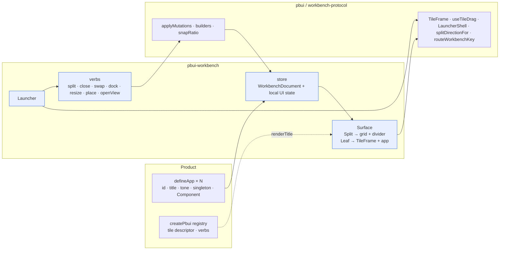

# PBUI Workbench Tiles: A Reusable Server-less Shell and the Chat Agent on Tiles

PBUI applications present their work as tiles: a workspace is a binary split tree, each leaf shows one application view, and the user splits, closes, drags, docks and resizes tiles or places applications through a launcher. Before this project the machinery for that existed in three places that did not compose: PBUI shipped the tile chrome (`TileFrame`, `useTileDrag`, `LauncherShell`) with no consumer; `@hyperslop-systems/workbench-protocol` shipped a React-free applier for the workbench document; and `datalab-ui` kept a complete but Redux-bound implementation that converted to the protocol only at its server boundary. Every other product in the family had hand-built its own shell. This project supplies the missing layer — `@hyperslop-systems/pbui-workbench`, a React shell that holds one protocol `WorkbenchDocument` locally and renders it with PBUI's chrome — and moves the PBUI chat agent ([[PROJ - PBUI Chat Agent - Presentation-Native Chat with Custom PBUI Widgets]]) onto it, so the chat, inspector, watchlist, trace and any widget are tiles like everything else.

The work is recorded in the docmgr ticket `PBUI-WORKBENCH-1` in the `pbui` repository, which also holds an intern-level guide to the whole workbench system (analysis, design, implementation, API and file references) and a diary.

> [!summary]
> Four things define this project:
> 1. The shell's only state is a protocol `WorkbenchDocument`; every gesture becomes `Mutation[]` through the protocol builders and is applied with the same applier the server uses. There is no second tree model and no Redux.
> 2. The chrome is PBUI's: `TileFrame` for the frame, `useTileDrag` for swap and dock, `LauncherShell` for the launcher, `splitDirectionFor` for the "never destroy a working tile" placement rule. The shell is their first real consumer.
> 3. Tile verbs are data (`tile.split`, `tile.dock`, `view.open`, …), so a product's object menu and an agent can drive the layout through one router.
> 4. The chat agent becomes five apps (`chat`, `inspector`, `watchlist`, `trace`, `widget`); "Open in tile" on any widget creates a doc-bound widget tile.

## Why this project exists

The first browser run of the chat agent showed its panels in a fixed two-column layout. That is not how PBUI products look or behave, and the difference is not cosmetic: a fixed panel cannot be split, linked, moved next to the thing it refers to, or closed when it is not needed. The family's interaction model is the workbench, and a chat agent that is "PBUI-native" has to live in it.

The second reason is reuse. Each product — datalab-ui, agentlogic, turboproof, hyperblog — had paid for its own tile shell, and the PBUI-UNIFY-001 ticket had extracted only the chrome, deferring a shared tree renderer "until a third consumer makes it real". The chat agent is that consumer. A shell that depends only on `pbui` and `workbench-protocol`, with no store opinion and no server, is something every product can adopt incrementally.

## The system before this project

Understanding what existed is what determined what the shell had to own.

| Layer | Where | What it knows |
|---|---|---|
| chrome kit | `pbui/src/chrome` | DOM ids and callbacks; no document, no store (decision DR-U3) |
| protocol and applier | `pbui/packages/workbench-protocol` (TS), `pbui/pkg/workbench` (Go) | the `WorkbenchDocument` graph; no React, no HTTP |
| product | `pbui/packages/datalab-ui` | Redux slices, its own tree type, apps, verbs |

Two facts from the analysis shaped the design. First, datalab-ui does not use the protocol document as runtime state; `store/layoutTree.ts` defines a structurally similar tree and `src/remote/codec.ts` converts at the remote boundary, with `snapRatio` duplicated verbatim. Second, `TileFrame` and `LauncherShell` had no consumer in the repository except their own tests; datalab-ui consumes only `useTileDrag`, `DropZoneOverlay` and the shortcut router and hand-rolls the rest. The responsibilities a reusable shell needs — tree rendering, resize handles, the active placement, the launcher invocation state, focus restoration by placement id, keyboard ownership, persistence policy — all lived inside datalab-ui's `store/layout.ts`, `organisms/Tile`, `pages/Workbench` and `apps/LauncherApp`.

### The document model

```
WorkbenchDocument { format "pbui.workbench"; schema_version 1; id; name;
                    workspaces[]; views: map<id, AppView>; view_order[]; documents: map<id, DocumentPayload> }
Workspace { id; name; tree: Node }
Node      { id; leaf { view_id } | split { direction ROW|COLUMN; ratio; a: Node; b: Node } }
AppView   { id; app_id; documents: map<binding, documentId>; title? }
Mutation  { 15 cases: workbenchRename, workspace{Create,Rename,Delete}, document{Put,Delete},
            view{Create,Configure,Clone,Delete,Close}, placement{Replace,Split,Close}, splitResize }
```

Four identities each own one thing: a workspace owns a split tree; a placement (a leaf) owns geometry identity — it is the React key, the drag hit-test target and the focus-restoration anchor; an application view owns the app id, named document bindings and an optional title; a document owns content that is opaque to the protocol. Two placements that reference one view are linked and stay in lockstep. The applier (`apply.ts`) clones first, applies one arm, and throws `MutationError{code, path}` with the same codes the Go applier uses; a `placementSplit` turns the target node into the split and keeps the split id, so client and server mint identical ids. The protocol's builders already express every shell gesture: `splitPlacement`, `closePlacement`, `swapPlacements`, `dockPlacement` (which emits the split before the close so the moved view is never unplaced), `resizeSplit`, and `snapRatio` over `[0.25, 1/3, 0.5, 2/3, 0.75]`.

### Decisions carried forward

- **DR-U3** — the chrome never sees a document. This is what makes a server-less shell possible: the adapter between a gesture and a mutation is a few lines.
- **DR-U6** — the launcher's policy (its rows model and `choose`) stays with the product; the shell extracts the mechanics.
- **DATADROP-18** — placement and view mutations are separate; a workbench snapshot is the revision boundary; the hosted server streams revision invalidations and the client refetches; and a list of local-only state that must never be persisted: current workspace, focused placement, open launcher or dialog, drag state, transient divider ratios, caches, credentials.
- **DATALAB-VIEW-001** — the active placement lives in layout state, not a React context, because a serialisable verb cannot reach a context; a global launcher invocation splits and never replaces a working tile; the keyboard router is one hard-coded action, not a command registry.

## Current project status

Implemented, tested and committed on `task/add-pbui-agent` in `pbui`:

- `packages/pbui-workbench` — the shell (28 tests; typecheck, lib build and Storybook build pass).
- `packages/pbui-chat/src/apps` — `createChatApps`; the router's `openTile` binds to the workbench when one is attached; 44 tests.
- The demo product runs on tiles with its layout persisted in `localStorage`; the embedded binary is rebuilt through the devctl `prod` profile, whose build step now builds `pbui-workbench` and `pbui-chat` before the demo.
- Browser verification against the Go server: split, linked duplicate, divider resize surviving a reload, Ctrl-K launcher placement, "Open in tile" producing a widget tile; the same UI against a real model.
- A layout defect found in use (a wide table overflowing a narrowed tile) fixed and guarded by a structural CSS test.

Not done: a `tile` presentation type in the chat vocabulary (tile titles are plain text in the demo), and the hosted mode in which the local store is replaced by the datalab-style mutate/stream endpoints.

## Project shape

```
pbui/packages/pbui-workbench/src/
  apps.ts                defineApp, createAppRegistry, AppDescriptor, AppProps
  document.ts            tile()/split()/layout()/singleTile(); serializeDocument/parseDocument
  store.ts               useSyncExternalStore store; mutate() applies batches with applyMutations
  verbs.ts               WorkbenchVerb data, workbenchVerbs.*, createVerbHandlers, performWorkbenchVerb
  createWorkbench.tsx    binds store, registry, verbs, Surface, Launcher
  components/Tile/       TileFrame + useTileDrag + the app in a one-cell grid + error boundary
  components/SplitPane/  CSS-grid split with a role="separator" divider (pointer and keyboard)
  components/Surface/    the tree walker
  components/Launcher/   LauncherShell + Mod-K routing
pbui/packages/pbui-chat/src/apps/   createChatApps, ChatApp, PanelApp, WidgetApp
pbui/packages/pbui-chat/demo/src/   workbench.ts (layout + persistence), App.tsx
pbui/ttmp/2026/08/20/PBUI-WORKBENCH-1--…/   intern guide, diary, screenshots
```

## Architecture



The blue nodes are new. The product contributes apps and, optionally, the `tile` presentation that becomes each frame's title. The shell contributes state, verbs, the tree renderer and the launcher, and it reaches down only into PBUI's chrome and the protocol client.

## Implementation details

### The store holds a protocol document and nothing else persistent

```ts
interface WorkbenchState {
  document: WorkbenchDocument;          // the only persisted part
  workspaceId: string;                  // local-only
  activePlacementId: string | null;     // keyboard-operation target; not DOM focus
  launcher: { from: string | null } | null;
  renamingViewId: string | null;
  draggingRatio: { splitId: string; ratio: number } | null;   // a live divider position
}
```

`mutate(mutations)` runs the protocol's `applyMutations` on the current document and publishes the result through `useSyncExternalStore`. A rejected batch throws `MutationError` and leaves the document unchanged. This is the design's central economy: the shell never re-implements a tree operation, and a document the shell produces is a document the Go applier accepts structurally, because both appliers are parity-tested against one fixture directory. `serialize()` and `restore()` are protobuf JSON of the document; the local-only fields are never written. Initial layouts are built with small spec functions that themselves go through `viewCreate` and `workspaceCreate` mutations:

```ts
layout(split("row", 0.6,
  tile("chat"),
  split("col", 1 / 3, tile("inspector"), split("col", 0.5, tile("watchlist"), tile("trace")))))
```

### Gestures are verbs, verbs are data

Every gesture has two doors. The imperative one is `wb.verbs.*`; the data one is `workbenchVerbs.*`, which returns plain objects a router can perform:

```ts
type WorkbenchVerb =
  | { kind: "tile.split"; placementId; direction: "row" | "col"; appId? }
  | { kind: "tile.close"; placementId } | { kind: "tile.swap"; a; b }
  | { kind: "tile.dock"; source; target; zone: "left" | "right" | "top" | "bottom" }
  | { kind: "tile.activate"; placementId } | { kind: "split.resize"; splitId; ratio }
  | { kind: "app.place"; appId; from? } | { kind: "view.setTitle"; viewId; title }
  | { kind: "view.open"; appId; documents; near?; title? }
  | { kind: "launcher.open" } | { kind: "launcher.close" };
```

Three verbs carry policy. `tile.split` with no app duplicates the view; with a singleton app it links a new placement to the singleton's existing view rather than minting a second view, because the structural applier would accept the duplicate and the server's `Validate` would reject it as `duplicate_singleton`. `app.place` implements the launcher rule: a placed singleton is a *go to*; otherwise the active tile is split along its longer rendered axis (`splitDirectionFor` reads the DOM box, because a layout tree knows ratios and not pixels). `view.open` is what the chat's "Open in tile" uses; a doc-bound view with identical bindings is treated as the same view and focused rather than duplicated.

### Rendering the tree

`Surface` walks the active workspace's tree. A split renders as a CSS grid whose two tracks are `ratio` and `1 − ratio` along the split direction, with a divider element that is `tabindex="0" role="separator" aria-valuenow`, so it is keyboard-operable: arrow keys step the ratio by 0.05 (0.01 with Shift). A pointer drag updates `draggingRatio` on every move without mutating the document and commits one `resizeSplit` with `snapRatio` on release, clamped to `[0.1, 0.9]` inside the protocol's `[0.05, 0.95]` validity range. A leaf renders PBUI's `TileFrame` with the adapter the chrome was designed for:

```ts
const drag = useTileDrag({
  id: placementId,
  onSwap: (a, b) => wb.verbs.swap(a, b),
  onDock: (source, target, zone) => wb.verbs.dock(source, target, zone),
});
<TileFrame placementId tone={app.tone} title={renderTitle(view, …)} canClose={leaves > 1}
  onSplit={(dir) => wb.verbs.split(placementId, dir)} onClose={() => wb.verbs.close(placementId)}
  grip={{ onPointerDown: drag.onGripPointerDown }} dropZone={drag.zone} dragging={drag.dragging}
  registerElement={drag.register}>
  <div className={oneCellGrid}><ErrorBoundary><app.Component placementId view /></ErrorBoundary></div>
</TileFrame>
```

The app sits in a one-cell grid with `minmax(0, 1fr)` on both axes. The playbook states why: a flex child with `height: 100%` resolves against a height flex has not committed, and every tile collapses to its content; a grid cell commits the height. An unknown app id renders an `EmptyState` naming the id rather than an empty frame.

### The launcher and the keyboard

`Launcher` wraps `LauncherShell` with rows from the app registry — singletons that already have a view are offered as *go to*, doc-bound apps are hidden from *new tile* because they would open empty — and a status line that names where the new tile will land before Enter commits. Mod-K is routed through `routeWorkbenchKey`, which ignores the chord while the launcher, a dialog, the object menu, accept mode or an inline rename owns the keyboard. The shell registers no escape surface; `Dialog` already does, and a second registration would leave Escape closing nothing — the invariant written in `LauncherShell`'s header comment after it was found in a browser.

### The chat agent as apps

`createChatApps(chat)` returns five `defineApp` descriptors:

| App | singleton | doc-bound | Component |
|---|---|---|---|
| `chat` | no | no | transcript, composer, mouse-doc line |
| `inspector`, `watchlist`, `trace` | yes | no | the chat package's panels |
| `widget` | no | yes — `documents.widget = <instanceId>` | `WidgetOutlet` over that widget instance |

The chat package gained one seam: `createPbuiChat({ workbench? })` (or `chat.attachWorkbench(wb)`) binds the router's `openTile(widgetId)` to `wb.verbs.openView("widget", { widget: widgetId }, { near: wb.activePlacementId(), title })`. The sequence for "Open in tile" shows how the two verb systems meet:

```
R-click <widget Low stock> → ObjectMenu → "Open in tile"
  → chat router performs {kind:"openInTile", widgetId:"msg-1-w1"}             (chat verb, family local)
  → ctx.openTile → wb.verbs.openView("widget", {widget:"msg-1-w1"}, {near})   (workbench verb)
  → builders: viewCreate{appId:"widget", documents:{widget:"msg-1-w1"}} + placementSplit(near, longer axis)
  → store.mutate → applyMutations → Surface re-renders with a new TileFrame
  → POST /api/chat/sessions/{id}/verbs {actor:"human", verb:{kind:"openInTile"}, outcome:"performed"}
```

The widget tile reads the same timeline entity the chat transcript reads, so a streaming table keeps streaming in its tile and a hydrated one survives a reload in both places.

### A defect the tiles exposed

Narrowing the chat tile made a wide table widget run past the tile's right edge; the tile body scrolled horizontally, and hovering any object — which re-renders every presentation — made it lay out correctly. Measuring `clientWidth/scrollWidth` from the table up to the tile showed the transcript, an `overflow: auto` block, at 707 px inside a 349 px tile. Patching styles live in the page isolated the cause in one step: the chat app's grid declared `grid-template-rows` and no `grid-template-columns`. An implicit column track is `auto`, and `auto` sizes to the widest child's max-content. Adding `grid-template-columns: minmax(0, 1fr)` made the transcript 334 px and the table scroll inside its own container. The rule for tile authors is exact: a tile's application root is a grid with `minmax(0, 1fr)` on both axes, and a scrolling region inside it is the only place a wide child may overflow. A structural test (`packages/pbui-chat/test/grid-columns.test.ts`) now fails any `display: grid` rule in pbui-chat or pbui-workbench without a column template; a rule whose template is computed at runtime — the split pane — opts out with a marker comment.

The same fix taught a second thing: the demo consumes the libraries through their `dist`, so a library edit is invisible to the demo until the library is rebuilt. `make chat-ui` and the devctl build step now build `pbui-workbench` and `pbui-chat` before the demo.

### Toward a hosted workbench

Replacing the local store with a server changes one module. `mutate` becomes apply-then-queue against `POST /v1/workbenches/{id}/mutate` with `If-Match: "workbench-{id}-{revision}"` and an `Idempotency-Key` minted per batch content; the shell grows `{revision, dirty, saving, conflict}`; an SSE stream of `workbench.updated {workbenchId, revision}` is treated as invalidation — ignore if not newer, defer while saving, conflict while dirty, otherwise refetch. The datalab server already implements this contract: a missing `If-Match` is 428, a stale revision is 409 with a `WorkbenchConflict` body, a validation failure is 400, an idempotent replay is answered before the revision is compared, and the stream subscribes before it reads the snapshot. Nothing in the renderer, the builders, the apps or the verbs changes; the local-only fields are never sent.

## Verification strategy

| Level | What | Where |
|---|---|---|
| unit | split/close/swap/dock/resize through `verbs` produce the expected protocol documents; resize clamps and snaps; `place` picks the longer rendered axis (mocked boxes); `Surface` renders one frame per leaf; the last tile cannot close; the launcher hides doc-bound apps | `packages/pbui-workbench` (28 tests) |
| unit | the chat router routes `openTile` to the workbench when attached; structural tests (no raw controls, no hex, one folder per component, no implicit-column grids) | `packages/pbui-chat` (44 tests) |
| browser | four frames at 60/40; split → linked fifth tile; divider 0.6 → 0.4 persisted across reload; Ctrl-K places `trace` below `chat`; a chat run inside the chat tile; "Open in tile" → widget tile bound to `msg-1-w1`, traced | Playwright against the Go server |
| browser | the overflow reproduced at ratio 25 % and gone after the fix (`transcript=334`, table scrolling inside its container) | Playwright against a scripted server |
| build | `devctl up --profile prod` builds pbui → pbui-workbench → pbui-chat → demo → `bin/pbui-chat -tags embed` and serves it | devctl |

## Important implementation files

- `pbui/packages/pbui-workbench/src/{store.ts,verbs.ts,document.ts,createWorkbench.tsx}`; `components/{Surface,SplitPane,Tile,Launcher}`.
- `pbui/packages/pbui-chat/src/apps/createChatApps.tsx`; `src/router/createVerbRouter.ts` (`openTile`); `src/apps/ChatApp/ChatApp.module.css` (the grid rule); `test/grid-columns.test.ts`.
- `pbui/packages/pbui-chat/demo/src/{workbench.ts,App.tsx}`.
- `pbui/src/chrome/{TileFrame.tsx,useTileDrag.ts,LauncherShell.tsx,shortcutRouting.ts}`; `pbui/packages/workbench-protocol/src/client/{apply,builders,ratios}.ts`.
- `pbui/ttmp/2026/08/20/PBUI-WORKBENCH-1--…/design-doc/01-intern-guide-…md` — the full guide (also on reMarkable under `/ai/2026/08/20/PBUI-WORKBENCH-1`); `reference/01-diary.md`.

## Open questions

- Should the shell move into pbui core (`src/workbench/`) once a second product adopts it? Today it is a separate package so pbui core does not depend on workbench-protocol.
- The `tile` presentation type: the chat vocabulary is embedded by the Go server and asserted equal by tests on both sides, so adding a type is a coordinated change; until then tile titles are plain text and the tile descriptor's verbs (rename, duplicate, replace) are not in the object menu.
- One anomaly was observed once during automated testing and not reproduced: an extra unbound `widget` tile listed in one evaluation and gone in the next, never persisted. No code path that creates an untraced tile was found.

## Near-term next steps

- Add the `tile` type and descriptor to the chat vocabulary and render each frame's title as a `<Presentation>`.
- Hosted mode against datalab's workbench endpoints, as described above.
- Adopt the shell in one existing product (agentlogic or turboproof, which hand-built theirs) to test the API against a second consumer.

## Project working rules

- The shell's state is the protocol document; a tree operation that is not a protocol mutation does not exist.
- A gesture is a verb, and a verb is data a menu, a key, a launcher row or an agent can produce.
- The chrome is imported from pbui, never transcribed.
- A tile's application root is a grid with `minmax(0, 1fr)` on both axes; wide content scrolls inside its own region.
- Local-only state (current workspace, active placement, launcher, rename, drag, transient ratios) is never serialised.
