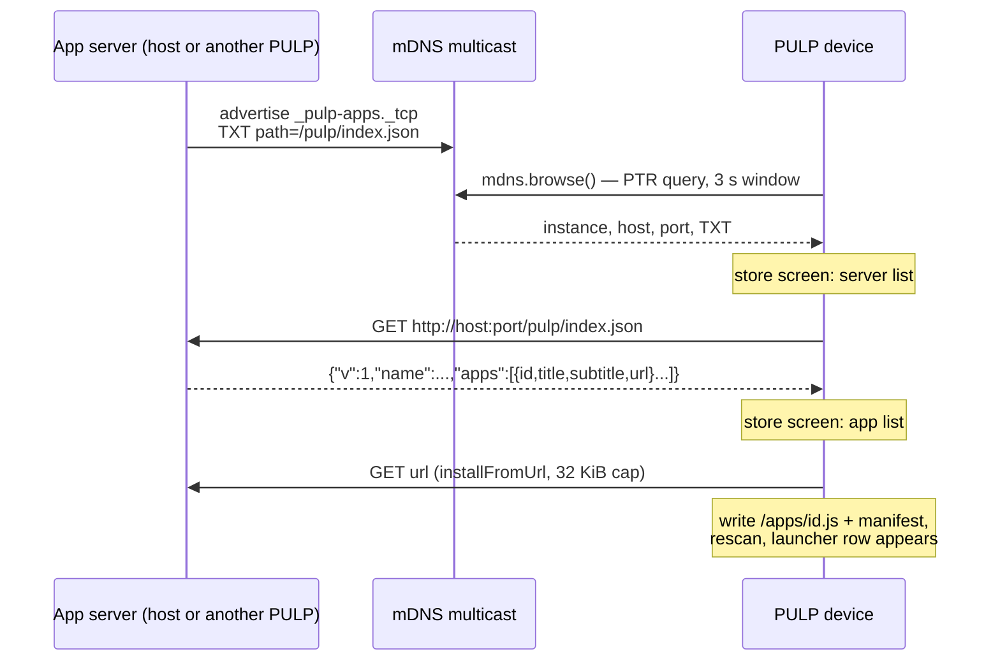

# PULP App Discovery — mDNS Browse, the Index Contract, and the Anatomy of a Lost Completion

This report covers two tightly coupled pieces of work on the PULP OS firmware for the M5Stack PaperS3: the diagnosis and repair of a silent catalog-scan failure that turned out to be a systemic event-queue defect (the close of ticket ESP-57), and the design and implementation of network app discovery (ticket ESP-58) — the device browses the local network for app servers over mDNS, fetches a JSON index from each, and installs apps with taps instead of typed URLs. The two belong in one report because the second was built on the guarantee the first established: that an asynchronous completion, once accepted by a native module, will actually be delivered.

> [!summary]
> - A "lost completion" bug class was root-caused live on hardware: synchronous native ops post their completions to a bounded owner event queue; under queue pressure the post fails and the registered JS callback waits forever, with three layers of individually reasonable error handling composing into total silence. The fix reserves queue headroom against droppable timer ticks and makes failed posts propagate.
> - Discovery is the unused half of an existing subsystem: the firmware already shipped the `espressif/mdns` component for advertising `pulp.local`; ESP-58 adds one async verb (`mdns.browse`) over its query API, a service-type convention (`_pulp-apps._tcp` + TXT `path=`), and a JSON index contract shared by host servers and the device itself.
> - Two capacity ceilings were found the honest way — by hitting them: the 128-slot retained-widget arena (whose enlargement is blocked by stack-allocated scratch arrays that scale with it), and the 8-slot JS route table (now exactly full when the webserver demo runs).

## Why this project exists

PULP OS installs apps over HTTP in two directions. A host can push a module to the device (`curl -T app.js http://pulp.local/apps/upload`), and the device can pull a module from a URL typed on its on-screen keyboard. Ticket ESP-54 made the push direction addressable — the device advertises `pulp.local` over mDNS, so scripts need no IP. Nothing did the same for the pull direction: the device could be found but could not find. In practice this meant that installing anything from the device side required transcribing a URL such as `http://192.168.0.39:8123/apps/d-widgets.js` on a 42-pixel-key e-ink keyboard.

The asymmetry was cheap to close because the mDNS component in the firmware carries a full query API (`mdns_query_ptr`, `mdns_query_async_new`) that no code called. Discovery required no new subsystem — only a convention for what an "app server" looks like on the network, one async verb to browse for it, a screen to walk the results, and a reciprocal route so that one PULP can serve its own apps to another.

## Prologue: the anatomy of a lost completion

ESP-57 closed with one open defect: after some boots the app catalog came up ROM-only — the SD-card scan that merges installed apps into the catalog reported nothing, printed nothing, and left no error anywhere. The instrumented JS error paths added at the end of that ticket never fired. Understanding why required following the failure below the JavaScript layer, and what was found there matters to every asynchronous API in the firmware.

### The async contract and its hidden synchrony

PULP OS runs all state mutation on a single owner task. JS-visible async verbs follow one grammar: the native registers a completion callback in a per-module slot (`RegisterModuleCb`), starts the operation, and the operation's last act is `PostModuleDone(module, kind, value, err)` — an event on the owner's queue that, when processed, invokes the JS callback. Network verbs (`http.get`) do their blocking work on short-lived worker tasks, so the post happens from another task while the owner is free to drain its queue.

The files module is different in a way that is easy to miss: `FilesList`, `FilesRead`, and their siblings are **synchronous on the owner task**. They perform the VFS work inline and post the completion event to the owner's own queue before returning. The "asynchrony" JS observes is purely the queue round-trip. This design is simple and safe — until the queue is full.

### The reproducer and the trace

The failure reproduced deterministically with the console command `js pulp`, which re-evaluates the entire OS bytecode. The re-run resets `SD_APPS = []` at the top level and kicks a fresh scan at the bottom; the scan begins with `files.list('/apps', cb)`. Three rounds of instrumentation on every silent exit in the dispatch path (a `resetTree` cancelling a live callback, `JsModuleDone` dropping a cancelled completion, `CallCbIn` finding a non-function in the callback registry) produced a log with none of those paths firing — and then, one build later, the actual verdict:

```
W (18990) files: completion post failed: CapacityExceeded
```

The mechanism, once visible, is short to state. The owner event queue holds 32 entries. A touch-tick producer posts a `TimerDue` event every 20 ms; its own comment says a full queue "just drops this tick," which is correct — the next tick follows in 20 ms. But during one long owner event — the `js pulp` re-evaluation plus a full-screen e-ink present is roughly 700 ms — the owner drains nothing, and roughly 35 ticks arrive. The queue fills with droppable events. When the scan's `FilesList`, running inline inside that same long event, posts its completion, `xQueueSend` fails, the module logs a warning and returns success to its caller, and the JS callback registered for the scan waits forever. The freshly reset `SD_APPS` never repopulates. At cold boot the same race ran with variable luck, which is why the original symptom was intermittent.

Three layers of error handling composed into silence:

1. The JS scan code checks the return code of `files.list` and prints on failure — but the native returned `Ok`, because the *operation* succeeded; only the completion post failed.
2. The dispatch layer logs dropped completions — but no completion event ever existed to drop.
3. The files module logged the failed post — as a warning, invisible unless a console is attached at the right moment, and without consequence for control flow.

### The fix: reservation plus propagation

Blocking on the queue is not available as a fix: the poster is the owner task, which is also the queue's only consumer; a timed `xQueueSend` from there is a deadlock. The repair has two layers (commit `147507c7`):

```c
// PostEvent: ticks may not consume the last 8 slots.
if (event.kind == AppEventKind::TimerDue) {
    constexpr UBaseType_t kReservedForCritical = 8;
    if (uxQueueSpacesAvailable(s_event_queue) <= kReservedForCritical) {
        return StatusCode::CapacityExceeded;   // tick self-heals in 20 ms
    }
}
```

The reservation encodes the actual difference between the two producer classes: timer ticks are droppable by design and load-bearing completions are not, so ticks are denied the final eight queue slots. Independently, every files-module completion post now propagates failure — `Post()` returns a boolean, and each operation returns `CapacityExceeded` when the post fails, which makes the JS binding cancel the registered callback and hand the caller a nonzero return code. A failure that was structurally silent is now structurally loud. The diagnostics added during the hunt stayed in permanently; they cost a log line only when something is actually lost.

Validation: cold boot plus three consecutive `js pulp` re-evaluations produced four out of four complete scans (`scanned 27 manifest(s)`), where before the fix the re-evaluation failed every time. The worked lesson generalizes: `net_http`, `net_serve`, and the WiFi module also post completions with unchecked results. The reservation protects them all; making their failures propagate is recorded follow-up work.

## The discovery system

### The wire protocol in one figure



Three round-trips, all initiated by taps. The only typing anywhere is on the host, once, to start a server.

### The service type and the index contract

An app server is any HTTP server that advertises `_pulp-apps._tcp` with a TXT record `path=` naming its index endpoint (default `/pulp/index.json`) and optionally `name=` carrying a human label. A dedicated service type was chosen over filtering `_http._tcp` because the PTR result set then *is* the server list — no probing of printers and NAS boxes with the device's single-flight HTTP slot.

The index is one JSON object:

```json
{"v": 1, "name": "Demo Shelf",
 "apps": [{"id": "d-widgets", "title": "Type and Widgets",
           "subtitle": "faces rules buttons",
           "url": "http://192.168.0.39:8123/apps/d-widgets.js"}]}
```

Each rule in the contract encodes a scar from the prior tickets: ids obey `[a-z0-9_-]{1,24}` (the charset the upload route and `idFromUrl` already enforce); titles are plain ASCII with no `&<>"` because the device-side manifest path never urldecodes (the ESP-57 encoding lesson, promoted from a script comment to a wire contract); URLs are absolute so the device performs zero URL assembly; the whole body must fit an 8 KiB fetch; unknown keys are ignored and `v` exists so pagination can arrive later without breaking old devices. The shape deliberately extends the `/apps/list` JSON the device already serves, so the reciprocal route in the final phase is a projection of data the OS already serializes.

The host-side server is a ~180-line Python script (`01-app-index-server.py` in the ticket): `http.server` plus `zeroconf`, index built per request by scanning a directory of `.js` files with optional `<id>.json` sidecars for metadata, and fail-fast plain-ASCII validation at startup so a bad title kills the server on the host rather than corrupting a manifest on the device.

### The browse verb

`mdns.browse(fn)` is the mdns singleton's first asynchronous verb, and it is the sixth instance of a shape with five hardware-proven precedents. The blocking query (`mdns_query_ptr`, 3-second window) runs on a throwaway worker task pinned below the owner's priority, exactly as `HttpSend` spawns `http_worker`: single-flight atomic, results into a fixed mailbox, `PostModuleDone(Mdns, kDoneMdnsBrowse, count, err)` as the worker's last act. Because completions carry only integers, results are read back through indexed accessors in the established `wifi.scan` idiom:

```js
mdns.browse(function (k, n, err) {      // fn(50, count, err)
  for (var i = 0; i < mdns.count(); i++) {
    rows.push(mdns.name(i), mdns.indexUrl(i));
  }
});
```

`indexUrl(i)` is assembled in C — a resolved IPv4 address is preferred over `<hostname>.local` (resolvers on the other end are the less reliable half of mDNS), the TXT `path` is applied with its default, and port 80 is elided — so JavaScript never string-builds a URL from parts it cannot validate. The snapshot is a static array of eight `{name[32], url[128]}` entries; the URL width is sized for the worst assembled case (124 bytes), a bound the compiler enforces via `-Werror=format-truncation`.

Two contract points surfaced during hardware validation. First, the WiFi gate had to move *before* `mdns_init`: the component's init fails without a live netif, and the designed behavior for a down link is a deterministic immediate completion (`count=0, err=1`), not an opaque init error. Second, the guard against overlapping browses turns out to be the module-callback slot itself — a second `browse()` during the window throws `module busy` before the native's own single-flight check can return a status, the same semantics the WiFi module exhibits for a join during a scan.

The lifecycle hazard is `MdnsStop`, which `serve.stop()`, `wifi.off()`, and the power quiesce path all call, and which frees the component. Freeing it under a live `mdns_query_ptr` on the worker would be a use-after-free. The chosen shape: a stop that arrives while a browse is in flight sets a deferral flag and returns; the owner applies the real stop when it processes the browse's `ModuleDone` — worst case one query window later. The queue reservation from the prologue is what makes "when it processes the ModuleDone" a dependable clause.

Adding the verb touched a fixed five-point checklist, and missing the last one is a sandbox hole rather than a link error: implement the natives, declare them in the bindings header, register them in the stdlib source of truth and regenerate (bytecode is atom-coupled, so the app images rebuild too), add host-compiler stubs, and **deny all four natives in the browser-page sandbox table**, because browse is a network capability and sandboxed pages must not have it.

### The store screens

The user-facing flow lives in Settings as three screens, each following the OS rule that screen changes cross `os.launch` so the loader owns every widget-tree reset. The browse screen shows a placeholder, registers the completion, and rebuilds with one row per discovered server; its empty state names the host script and the most likely field failure (access points with client isolation filter multicast, in which case manual URL entry still works). Tapping a server fetches its index with an 8 KiB cap, parses it with `JSON.parse`, and relaunches into the shelf screen with the parsed object riding the launch argument — a plain in-context value, no serialization. The shelf screen cross-references each advertised app against the live catalog to mark installed ones, renders id/URL-mismatched entries inert (installing them would create a different app than advertised), and installs through the same `installFromUrl` the URL keyboard uses. On the bench, the complete walk reads: Get apps → "Demo Shelf" → twelve rows, all marked installed from the ESP-57 suite → tap → `installed d-books (1970B)`.

### The device as a shelf

The final phase makes discovery reciprocal. The device now advertises `_pulp-apps._tcp` beside its existing `_http._tcp` (TXT `path` only — no `name`, so when two PULPs share a network, mDNS uniquifies their instance names rather than presenting two identical labels). It serves `/pulp/index.json` over its own catalog, including only visible, healthy, card-backed entries, under a 3.5 KB byte budget with an explicit `truncated` count — the response buffer caps at 4 KiB and the no-silent-caps rule applies.

The interesting constraint was where the module bytes come from. JS route handlers are synchronous; the JS files API is asynchronous; therefore a JS route cannot serve file contents. The solution is a native httpd alias: `GET /appsrc/<id>.js` streams `/sdcard/apps/<id>.js` from the httpd task, which is already the one sanctioned off-owner VFS reader (it runs the static site mount). The id charset `[a-z0-9_-]{1,24}` is validated before any path is built, so directory traversal is not expressible in the input language rather than being filtered out of it.

Validation with one device on the bench was host-side: a zeroconf browse sees both shelves (`PULP OS` at the device's address and `Demo Shelf` on the host), the device's index parses with 14 entries, a module fetch returns the exact source bytes, and a traversal attempt returns 404. One asymmetry fell out for free: the device's own store never lists the device itself, because the espressif mDNS responder does not answer its own queries — accidental, and correct, since installing from oneself is a no-op.

## The widget-arena ceiling

The store UI's first flash crashed the Settings app with `TypeError: widget arena full`. The retained widget tree is a fixed arena of 128 slots; a menu row costs about five widgets and page chrome about eight, so the ceiling supports roughly 22 rows. The Settings apps screen with a full catalog — four action rows plus sixteen visible apps — already sits at twenty; the new "Get apps" row was the twenty-first.

The tempting fix is raising the capacity, and it is exactly the kind of change that should not be made in passing: the diff engine keeps two `CurrentSlot current[kCapacity]` scratch arrays and the render compiler a `Rect clips[kCapacity]` array **on the stack of the 8 KiB owner task**. Doubling the capacity adds roughly ten kilobytes of stack pressure to a task that also runs the JS engine. The scoped resolution: the "Get apps" row moved to the main Settings screen (seven rows, ample headroom, and arguably the better placement), and the shelf screen caps its listing at fourteen rows with an explicit "+N more (not shown)" note. The arena enlargement — capacity constant plus relocating the scratch arrays to statics or the render heap — is recorded as its own piece of work.

## Common failure modes worth keeping

- **Same-host mDNS stacks do not compose.** `avahi-browse` on the development host saw neither the python-zeroconf record (same host) nor the device's record (different host), while a python-zeroconf client saw both. Avahi is not a usable gate on this machine; the ticket standardizes on a short zeroconf client snippet.
- **`Zeroconf()` with default interfaces can fail with `ENOBUFS`.** Joining the multicast group on every interface exhausts the kernel's `igmp_max_memberships` on hosts with many virtual interfaces. Bind the one outbound interface.
- **`mdns_init` requires a live netif.** Any verb layered on the component needs its own connectivity gate ahead of init if it wants a deterministic offline contract.
- **A synchronous native behind an asynchronous contract inherits every liability of the queue between them.** The files module's completions compete for queue slots with unrelated producers precisely while the owner cannot drain — the prologue's entire bug class in one sentence.
- **Capacity edges announce themselves only at n+1.** The 20-row apps screen worked; the 21st row threw. The 64-entry file listing worked until the demo suite's 65th file. Fixed-capacity designs are fine in this codebase's discipline — but each cap needs a visible overflow behavior, not a silent one.

## Current status

Both tickets are closed. ESP-57: twelve demo apps installed over HTTP, walked and screenshot-verified, with the queue fix validated by the formerly deterministic reproducer. ESP-58: all five phases landed in one day — host index server, browse verb (probe-validated on hardware), store screens (walked on-panel, install toast included), device-as-shelf (curl- and browse-validated), evidence appended to the intern guide and the bundle re-uploaded to reMarkable. The firmware commits run `147507c7` (queue fix) through `fbd4c299` (device as shelf).

## Important project docs

- ESP-58 ticket: `ttmp/2026/08/20/ESP-58-PULP-APP-DISCOVERY--…` — intern guide (nine sections, three decision records, as-built appendix §10), four-step diary, seven screenshots, the index-server script.
- ESP-57 ticket: `ttmp/2026/08/20/ESP-57-PULP-DEMO-APPS--…` — diary step 3 is the full lost-completion hunt narrative.
- Prior reports: [[PROJ - PULP OS App Loader - Splitting the Monolith and Loading Apps as Source]], [[PROJ - PULP Browser - Multi-Context MicroQuickJS and the Sandboxed Page Runtime]], [[PROJ - PULP Design System and Demo Suite - Screenshot-Driven UI Engineering]].

## Open questions

- Should the remaining unchecked `PostModuleDone` sites (http, serve, wifi, images, apps uploads) propagate failure the way the files module now does, or is the queue reservation sufficient protection for worker-task posters?
- The widget-arena capacity pass: how much of the diff/render scratch state can move off the owner stack, and what capacity does the launcher actually need long-term?
- The JS route table is 5/8 used by the OS; the webserver demo fills it exactly. Bump, consolidate, or page?
- `/appsrc/` serves installed app source to the LAN unauthenticated — the same trust level as accepting pushes, but the auth story for both directions remains open.
- A two-device install (PULP to PULP) is designed and half-validated; it needs a second PaperS3 on the bench.

## Near-term next steps

- Two-device discovery test when hardware allows.
- Propagation pass over the remaining completion-post sites.
- Sidecar metadata for the demo shelf so titles read "Type and Widgets" rather than "d-widgets".

## Project working rule

When an asynchronous chain dies silently, instrument every exit that can decline to call you back — and when the logs finally speak, fix the class, not the instance. The scan was one victim of a queue that treated load-bearing completions and self-healing ticks as the same kind of cargo; the repair distinguishes them once, for every module at once.
