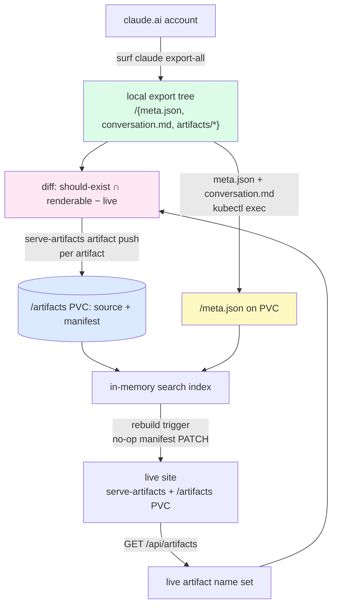
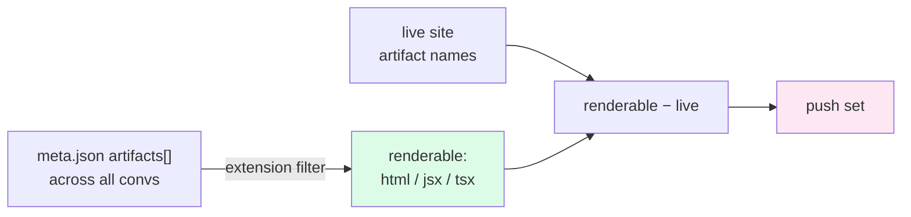
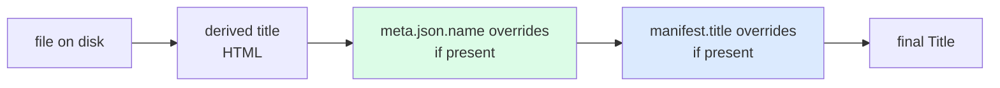

# claude.ai Artifact Import to artifacts.yolo

This project is the production sync layer for [[PROJ - claude.ai Artifact Archival - Browser Export, Diff Reconstruction, and Local Serving|the claude.ai artifact archival pipeline]]. The archival project solved extraction and reconstruction: it turns a claude.ai account into a local directory tree of artifacts plus metadata. This project solves the different problem that appears once that tree exists and a live site is running: how to compute what is missing from the live gallery, push only the artifacts the site can actually serve, and make the pushed artifacts indistinguishable from the seeded corpus.

The work is worth writing up because two facts about the system are not visible from any single file and only become clear by running the pipeline end to end. First, the export's notion of an "artifact" and the server's notion of an "artifact" are different sets, and conflating them produces either failed pushes or a silently half-populated gallery. Second, the push API writes the artifact and its manifest but not the conversation metadata that gives the artifact its provenance, so a naive push leaves new artifacts present-but-contextless. Both have clean fixes, but only after the gap is named.

> [!summary]
> - The live site (`https://artifacts.yolo.scapegoat.dev`) is a `serve-artifacts` Go server on a k3s cluster, serving a corpus of renderable artifacts (HTML, JSX, TSX) from a `local-path` persistent volume at `/artifacts`. The local export is a tree of `<uuid>/{meta.json, conversation.md, conversation.json, artifacts/*}` directories produced by `surf claude export-all`.
> - An export `meta.json` lists every file Claude created in a conversation, including non-renderable ones (`.md`, `.yaml`, `.go`, `.py`, `.svg`). The server only accepts HTML, JSX, and TSX. The diff must filter the export's artifact list to renderable types before pushing.
> - The push API (`POST /api/artifacts`, gated by a bearer write token) writes the artifact source and an optional `<base>.manifest.json` sidecar. It does not write the conversation `meta.json`. Conversation provenance — model, project, claude.ai URL, transcript link, reconstruction warnings — only appears when a `meta.json` exists on the volume at `<uuid>/meta.json`.
> - For artifacts in conversations that were never seeded onto the volume, the provenance gap is closed by copying `meta.json` and `conversation.md` from the local export onto the volume and triggering an index rebuild. The production pod does not run in watch mode, so direct volume writes are invisible to the in-memory index until an API write forces a rebuild.

## Why this project exists

The archival pipeline produces a local export that is a superset of what the live gallery should show. The live gallery, in turn, is a subset that has drifted behind the account: conversations continued after the last seed, and the seed itself only ever covered a slice. Without a sync step, the gallery and the account diverge, and the divergence is invisible — both sides look full.

A sync step has to answer three questions that the extraction stage never had to answer. Which artifacts are already on the live site, keyed by name? Which artifacts in the export are renderable by this server? And for artifacts that are new, what is the minimal set of writes that makes them as complete as the artifacts already there? The third question is where the subtlety lives, because "complete" on this site means provenance, and provenance is not something the push API produces.

The project is therefore not a copy operation. It is a reconciliation between two representations of the same data — a local export tree and a live in-memory index backed by a volume — with a write API in between that has a narrower contract than the corpus implies.

## Architecture

The sync has four stages. Each stage reads from the previous stage's output and writes to a different substrate.



Two repositories are involved. The export tooling lives in `surf-cli` (`/home/manuel/code/others/llms/pi/nicobailon/surf-cli`). The server, its push API, and the live deployment live in `serve-artifacts` (`/home/manuel/code/wesen/2026-03-29--serve-claude-experiments`). The local export tree lives at `/home/manuel/Downloads/claude-downloads/`. The live corpus lives on a PVC mounted into a k3s pod at `/artifacts`; how that volume and the write token were introduced is covered in [[PROJ - Serve Artifacts Stateful Migration - PVCs, Vault Write-Token, and an ArgoCD Sync-Wave Deadlock]].

## The export tree and the name key

`surf claude export-all` writes one directory per conversation. The directory name is the conversation UUID. Each directory contains `conversation.md` (the transcript), `conversation.json` (the slim structured payload, unused at serve time), `meta.json` (metadata), and an `artifacts/` subdirectory holding the reconstructed deliverable files.

```
<out>/<conversation-uuid>/
    conversation.md       # human-readable transcript
    conversation.json     # raw slim payload (unused at runtime)
    meta.json             # provenance the server ingests
    artifacts/
        Calendar.jsx
        page.html
        ...
```

The `meta.json` for a conversation looks like this:

```json
{
  "uuid": "f3d43330-56ed-4bc1-aa27-b0dc9d31ee4e",
  "name": "Minimal timezone-aware calendar",
  "model": "claude-opus-4-8",
  "created_at": "2026-07-06T17:03:21Z",
  "updated_at": "2026-07-06T17:40:00Z",
  "project_uuid": null,
  "artifacts": [
    { "file": "artifacts/Calendar.jsx", "path": "/mnt/user-data/outputs/Calendar.jsx", "bytes": 10233, "source": "file-tool" }
  ],
  "warnings": []
}
```

The server's artifact name is the slash-path of the file relative to the corpus root, without its extension. A file at `<uuid>/artifacts/Calendar.jsx` has the name `<uuid>/artifacts/Calendar`. A top-level file at `imports/business-app.jsx` keeps the bare name `business-app`. This name is the URL key, the dedup key, and the stable identity across the export, the volume, and the API. Every stage of the sync compares artifacts by this name.

## Stage 1: refreshing the export

The export is a snapshot. The account keeps moving, so the snapshot drifts. `surf claude export-all` is resumable: it pages every conversation, compares the conversation's current `updated_at` to the `updated_at` recorded in the local `meta.json`, and skips conversations whose timestamp is unchanged. Only new or changed conversations are re-downloaded.

```bash
surf claude export-all --out /home/manuel/Downloads/claude-downloads --timeout-ms 300000
# → 42 exported, 2907 skipped, 0 errors (of 2949)
```

Resumability is what makes the sync cheap to run repeatedly. Re-downloading 2949 conversations on every pass would be expensive and would hammer claude.ai's internal API. Comparing timestamps re-downloads only what changed, which on a quiet day is zero and on an active day is a small number.

The export command runs against a browser already signed into claude.ai. The `surf` extension injects `fetch` calls into a logged-in tab; the same mechanism the archival project documented, and the general browser-verb pattern is described in [[ARTICLE - surf-go Browser Verbs - Using JS Probes to Build Reliable Web Automation]]. No credentials are handled by the Go side.

## Stage 2: the diff, and why it must be filtered

The diff computes the set of artifacts that exist in the export, are renderable by the server, and are not already on the live site.



The live site exposes its current artifact set as JSON:

```bash
SERVE_ARTIFACTS_API=https://artifacts.yolo.scapegoat.dev \
  ./serve-artifacts artifact list --output json --limit 5000
```

The should-exist set is built by walking every `meta.json` in the export and reading its `artifacts[]` array. For each entry, the artifact name is `<uuid>/artifacts/<basename-without-extension>`, and the type is inferred from the file extension.

```
should = {}
for each <uuid> in export:
    meta = load(<uuid>/meta.json)
    for each a in meta.artifacts[]:
        base = basename(a.file)         # "Calendar.jsx"
        name = <uuid> + "/artifacts/" + stripExt(base)
        type = typeForExt(ext(base))    # html | jsx | tsx | other
        should[name] = { type, source: <uuid>/artifacts/<base>, ... }
```

The push set is the renderable subset of `should` minus the live name set:

```
push = [ r for r in should if r.name not in live_names and r.type in {html, jsx, tsx} ]
```

The filter to `{html, jsx, tsx}` is not a convenience. It is a hard constraint from the server. The type allowlist is enforced in `pkg/artifacts/writer.go`:

```go
func ExtensionForType(typ string) (string, error) {
    switch strings.ToLower(strings.TrimSpace(typ)) {
    case "html": return ".html", nil
    case "jsx":  return ".jsx", nil
    case "tsx":  return ".tsx", nil
    default:    return "", fmt.Errorf("%q: %w", typ, ErrUnsupportedType)
    }
}
```

A push with any other type returns `400` and `ErrUnsupportedType`. On this run the raw diff was 269 names; after the renderable filter it was 43. The other 226 were `.md`, `.yaml`, `.go`, `.py`, `.svg`, `.csv`, `.json`, `.lisp`, `.lean`, `.baml`, `.mermaid`, `.c`, `.h`, `.mod`, `.txt`, and `.yml` files that Claude created in the same conversations. They are real outputs of those conversations, but they are not artifacts the server is built to serve, and pushing them would produce 269 failures instead of 43 successes.

The distinction matters because `meta.json.artifacts[]` is not "the list of renderable artifacts." It is "the list of files Claude created in the conversation," which is a superset. An importer that reads `artifacts[]` as an artifact list will overcount, and an importer that trusts the export alone will undercount by ignoring the live site.

## Stage 3: the push API and its contract

Each artifact in the push set is written to the live site with `serve-artifacts artifact push`:

```bash
serve-artifacts artifact push \
  --api https://artifacts.yolo.scapegoat.dev \
  --token <write-token> \
  --file <uuid>/artifacts/Calendar.jsx \
  --name <uuid>/artifacts/Calendar \
  --type jsx \
  --title "Minimal timezone-aware calendar" \
  --date 2026-07-06
```

The push API was introduced in [[PROJ - serve-artifacts - Write API, Production Deployment, and the JSON Contract]]; this section describes its contract as the sync uses it. The server handler is `handleArtifactPush` in `pkg/server/artifactapi.go`. The request body is a `pushRequest`:

```go
type pushRequest struct {
    Name      string                       `json:"name"`      // extensionless key
    Type      string                       `json:"type"`      // html | jsx | tsx
    Source    string                        `json:"source"`    // artifact source text
    Manifest  *artifacts.ArtifactManifest   `json:"manifest"`  // optional sidecar
    Overwrite bool                         `json:"overwrite"` // replace existing
}
```

The handler validates the name and type, refuses an existing target unless `overwrite` is set, writes the source atomically, writes the manifest if supplied, rebuilds the in-memory index, and returns `201` with the new artifact view.

The name-to-path resolution is `SafeArtifactPath` in `pkg/artifacts/writer.go`. It is the single guard against path traversal on push, and it is what allows the nested `<uuid>/artifacts/<base>` name to be used:

```go
func SafeArtifactPath(root, name, ext string) (string, error) {
    name = strings.TrimSpace(name)
    if name == "" || strings.HasPrefix(name, "/") {
        return "", ErrBadArtifactName
    }
    clean := path.Clean(name)
    if clean == "." || clean == ".." || strings.HasPrefix(clean, "../") {
        return "", ErrBadArtifactName
    }
    abs := filepath.Join(root, filepath.FromSlash(clean)+ext)
    rp, err := filepath.Rel(root, abs)
    if err != nil || rp == ".." || strings.HasPrefix(rp, ".."+string(filepath.Separator)) {
        return "", ErrBadArtifactName
    }
    return abs, nil
}
```

The cleaned relative name is joined under the root, and the resolved path is confirmed to remain under the root. A name like `<uuid>/artifacts/Calendar` resolves to `/artifacts/<uuid>/artifacts/Calendar.jsx`, and `WriteFileAtomic` creates the parent directories. The push therefore lands the file at exactly the path the recursive scanner would discover it at, which is the precondition for the file to be served.

### What the push writes, and what it does not

This is the fact that the rest of the sync depends on. The push writes two files:

1. The artifact source, at `<root>/<name>.<ext>`.
2. An optional manifest, at `<root>/<name>.manifest.json`.

It does not write a conversation `meta.json`. The manifest and the conversation `meta.json` are different files with different schemas and different roles.

| File | Written by push | Purpose |
|---|---|---|
| `<name>.<ext>` | yes | the artifact source (HTML/JSX/TSX) |
| `<name>.manifest.json` | yes, optional | per-artifact title, description, tags, date, links |
| `<uuid>/meta.json` | no | per-conversation model, project, dates, warnings, claude.ai URL |
| `<uuid>/conversation.md` | no | the transcript, linked from the detail page |

The distinction is the provenance gap. The manifest is per-artifact and display-oriented. The `meta.json` is per-conversation and provenance-oriented. The scanner enriches an artifact with `meta.json` fields only when a `meta.json` exists on the volume at the right place, and the push API never creates one.

## Title precedence

Because the manifest and `meta.json` can both supply a title, the scanner applies a fixed precedence. The precedence is documented in the metasearch design doc and implemented in the scanner's enrichment order.



1. **Manifest title** — an explicit `<name>.manifest.json` `title`. Highest. Unchanged behavior for annotated artifacts.
2. **Conversation title** — `meta.json.name`. The improvement for exports: "Minimal timezone-aware calendar" instead of "Calendar" or "App".
3. **Derived title** — HTML `<title>` or JSX default-export component name.
4. **Name** — last resort, the filename.

The manifest is applied last, which means a push that seeds `--title` equal to the conversation name is safe and idempotent: it sets the title to what `meta.json.name` would have set it to, so a later provenance backfill does not change the displayed title. This is why the push seeds the manifest title even though the conversation title would eventually arrive via `meta.json`. It makes the artifact presentable immediately, before provenance exists, without conflicting with it later.

## Stage 4: provenance backfill

After the push, the pushed artifacts exist and are titled, but they have no model, no project, no claude.ai URL, and no transcript link. On the live site they look second-class next to seeded artifacts that carry all of those.

The scanner populates provenance by association. During the recursive walk, when a file's path contains an `artifacts/` segment, the scanner looks for a `meta.json` in the parent of that `artifacts/` directory and matches the file to its entry.

```
during Scan(), for each artifact file at abs path P:
    convDir = dir(dir(P))                       # parent of the artifacts/ dir
    metaPath = convDir + "/meta.json"
    if exists(metaPath):
        meta = loadMetaJSON(metaPath)           # cached by convDir
        entry = meta.artifacts[ file whose "file" == relpath(P, convDir) ]
        enrich(artifact, meta, entry)
```

The association is purely filesystem-positional. An artifact at `<uuid>/artifacts/Calendar.jsx` is associated with `<uuid>/meta.json`. If the `meta.json` is absent, the artifact is served with a derived title and no provenance. If it is present, the artifact inherits the conversation's model, project, dates, warnings, and a `claude.ai/chat/<uuid>` link.

The backfill is therefore mechanical. For each conversation whose artifacts were just pushed, copy `meta.json` and `conversation.md` from the local export onto the volume at `<uuid>/`. The artifact sources are already correct from the push; only the provenance files are missing.

```bash
kubectl -n artifacts exec -i <pod> -- sh -c \
  'mkdir -p /artifacts/<uuid> && cat > /artifacts/<uuid>/meta.json' \
  < /home/manuel/Downloads/claude-downloads/<uuid>/meta.json
kubectl -n artifacts exec -i <pod> -- sh -c \
  'mkdir -p /artifacts/<uuid> && cat > /artifacts/<uuid>/conversation.md' \
  < /home/manuel/Downloads/claude-downloads/<uuid>/conversation.md
```

The copies add only `meta.json` and `conversation.md`. They do not touch the artifact sources or the manifests the push wrote. The export's `meta.json` `artifacts[]` array lists non-renderable files too, but the scanner only enriches on-disk artifacts, so the unmatched entries are inert.

## The index rebuild problem

The production pod does not run with `--watch`. The in-memory search index is built at startup and rebuilt only when an API write calls `index.rebuild()`. A push calls it. A manifest write calls it. A direct volume write via `kubectl exec` does not.

This means the backfill's `meta.json` and `conversation.md` copies are invisible to the index until something forces a rebuild. The copies are on disk and the scanner would read them on the next rebuild, but no rebuild is triggered. The pushed artifacts would continue to show no provenance in the API even though the `meta.json` is sitting next to them.

The trigger is a no-op manifest patch. `PATCH /api/manifest/<name>` with `{"tags":[]}` writes the artifact's current manifest back unchanged and calls `index.rebuild()` in the same locked sequence:

```go
func (s *Server) writeManifestAndRespond(w http.ResponseWriter, r *http.Request, name string, m *artifacts.ArtifactManifest) {
    s.writeMu.Lock()
    defer s.writeMu.Unlock()
    // ... validate, write manifest, rebuild index, respond
}
```

An empty patch body is rejected by `decodeJSON`, so `{"tags":[]}` — setting tags to their current empty value — is the minimal valid trigger that writes the manifest back unchanged and rebuilds. After the rebuild, the scanner re-walks the volume, finds the new `meta.json` files, and enriches the pushed artifacts with provenance.

The rebuild is the synchronization point between the volume and the index. Without it, the volume and the index disagree. With it, they agree. The no-op patch is a deliberate way to force agreement without changing any data.

## Authentication and the write token

Writes are gated by a bearer token. The check is in `authorize`:

```go
func (s *Server) authorize(r *http.Request, act action) error {
    if act != actionWrite {
        return nil
    }
    if s.writeToken == "" {
        return nil // unauthenticated writes (dev/local)
    }
    presented := bearerToken(r)
    if presented == "" {
        return errors.New("missing write token")
    }
    if subtle.ConstantTimeCompare([]byte(presented), []byte(s.writeToken)) != 1 {
        return errors.New("invalid write token")
    }
    return nil
}
```

In production the token is injected from a Vault secret — the [[PROJ - Vault on K3s - Auth and Secret Delivery Platform|Vault on K3s]] platform's secret-delivery path — into the pod's environment as `SERVE_ARTIFACTS_WRITE_TOKEN` (see [[PROJ - Serve Artifacts Stateful Migration - PVCs, Vault Write-Token, and an ArgoCD Sync-Wave Deadlock]]). The CLI reads it from `--token` or `$SERVE_ARTIFACTS_TOKEN`. Reads are always open; only writes are gated.

The token is a shared bearer, not a per-user credential. It is a deliberate simplification: one writer, one token, constant-time comparison. A real identity provider would replace the body of `authorize` without changing the handlers or routes.

## A side effect worth naming: auth probes are not free

Testing write access by pushing a throwaway artifact is not side-effect-free. A push with a new name returns `201` and creates the artifact. There is no `DELETE` endpoint for artifacts. The probe artifact sits on the volume until it is removed by hand.

```bash
# this "probe" creates a real artifact
curl -X POST -H "Authorization: Bearer <token>" \
  -d '{"name":"__auth_probe_delete_me","type":"html","source":"<html></html>"}' \
  https://artifacts.yolo.scapegoat.dev/api/artifacts
# → 201 Created
```

The artifact must then be removed from the volume directly:

```bash
kubectl -n artifacts exec <pod> -- rm -f \
  /artifacts/__auth_probe_delete_me.html \
  /artifacts/__auth_probe_delete_me.manifest.json
```

The stale index entry for the removed file clears on the next push-triggered rebuild, because every push calls `index.rebuild()` and the rebuild re-scans the volume. A probe that uses a name which already exists returns `409` instead of `201` and creates nothing, which is the side-effect-free way to test write access.

The absence of a delete endpoint is a deliberate current limitation, but it turns a routine access check into a cleanup task. The lesson generalizes: a write API without a corresponding delete makes every test write a commitment.

## Implementation details: the scripts

Two scripts drive the sync. Both live in the ticket's `scripts/` directory so they are tracked with the work they perform.

`scripts/01-push-new-artifacts.py` reads the push set from a JSON file and calls `serve-artifacts artifact push` once per artifact, seeding a manifest with the conversation title and the original date. It records per-artifact results to a JSONL file and prints a summary. The push is sequential; each push triggers its own index rebuild, which dominates the per-artifact time at roughly one second on a 525-artifact corpus.

`scripts/02-backfill-provenance.py` takes the set of conversations touched by the push, and for each one copies `meta.json` and `conversation.md` from the local export onto the volume via `kubectl exec`, streaming the file over stdin. It then triggers one index rebuild with a no-op manifest patch. The script validates conversation UUIDs as hex-UUID-shaped before use, because direct volume writes bypass the API's `SafeArtifactPath` guard.

The scripts are deliberately split into two stages rather than one. The push is idempotent only with `--overwrite`; without it, a re-run returns `409` for names that already exist. The backfill is unconditionally idempotent: copying the same `meta.json` twice changes nothing. Splitting them lets the push be run once and the backfill be re-run safely, and it keeps the two different substrates (the API and the volume) in separate code.

## Current project status

The sync is functional and has been run once end to end against the live site. The local export was refreshed (42 conversations newly exported, 2907 skipped). The diff produced 43 renderable new artifacts (35 JSX, 8 HTML) across 29 conversations, all of which were fully absent from the live site. All 43 were pushed with zero failures, taking the live total from 525 to 568. Provenance was backfilled for all 29 conversations, and all 43 pushed artifacts were confirmed to carry model and claude.ai URL via `artifact get`.

The 226 non-renderable new files in the export were intentionally not pushed. They remain in the local export. The server does not serve them, and pushing them would have produced 226 failures.

## Key points

- The artifact name is a slash-path relative to the corpus root without extension. It is the URL key, the dedup key, and the stable identity across the export, the volume, and the API. The diff, the push, and the backfill all compare artifacts by this name.
- The export's `meta.json.artifacts[]` lists every file Claude created, not every renderable artifact. The diff must filter to `{html, jsx, tsx}` against the server's `ExtensionForType` allowlist before pushing. Conflating the two sets produces either failed pushes or an inflated diff.
- The push API writes the artifact source and an optional manifest, but not the conversation `meta.json`. Provenance is positional: the scanner associates an artifact at `<uuid>/artifacts/<file>` with a `meta.json` at `<uuid>/meta.json`. Closing the provenance gap for new conversations means putting `meta.json` on the volume at that path.
- The production pod does not run in watch mode, so direct volume writes are invisible to the in-memory index until an API write forces `index.rebuild()`. A no-op manifest patch is a data-preserving way to force the rebuild.
- Title precedence is manifest > `meta.json.name` > derived > name. Seeding the manifest title with the conversation name is idempotent against a later `meta.json` association, so an artifact can be titled before its provenance exists and stay titled the same way afterward.
- The push API has no delete endpoint. A push with a new name is a commitment. Auth probes should use a name that already exists to get a `409`, or they must be cleaned up from the volume by hand.

## Important project docs

- The predecessor note (now marked deprecated in favor of this report): [[PROJ - claude.ai Artifact Archival - Browser Export, Diff Reconstruction, and Local Serving]] — extraction, reconstruction, and the serving fixes that made exports render.
- `serve-artifacts` ticket `ARTIFACTS-IMPORT-20260820` — today's import work, diary, and the two sync scripts, under `ttmp/2026/08/20/`.
- `pkg/server/artifactapi.go` — the push handler, the manifest patch handler, and `authorize`.
- `pkg/artifacts/writer.go` — `SafeArtifactPath`, `ExtensionForType`, and `WriteFileAtomic`.
- The metasearch design doc at `ttmp/2026/07/13/SERVE-20260713-METASEARCH--.../design/01-export-metadata-ingest-and-search-analysis-design-and-implementation-guide.md` — the export layout, the association algorithm, and the title precedence the sync relies on.
- The deploy design doc at `ttmp/2026/07/14/SERVE-20260714-DEPLOY--.../design/01-deploying-serve-artifacts-to-k3s-analysis-design-and-implementation-guide.md` — the live topology, the PVC corpus, and the write-token secret.

## Related notes

The claude.ai-to-artifacts.yolo pipeline is covered across a series of vault notes. This report is the production-sync chapter; the others cover the stages it builds on.

- [[PROJ - Serve Artifacts - Claude AI Artifact Server]] — the original standalone server design (HTML direct, JSX via host page).
- [[PROJ - Serve Artifacts - Deploying to K3s with GitOps]] — first deployment to the cluster via GitOps.
- [[PROJ - claude.ai Artifact Archival - Browser Export, Diff Reconstruction, and Local Serving]] — extraction from the claude.ai internal API and artifact reconstruction by replaying file tools (deprecated for the current pipeline state; see this report).
- [[PROJ - claude.ai Archive Completion - Deep Paging, Legacy Artifact Recovery, and Model-Quirk Fixes]] — full-account export, deep paging, and legacy artifact recovery.
- [[PROJ - serve-artifacts - From Static Viewer to Searchable, Organizable, Visual Gallery]] — the metasearch ingest of `meta.json` and the search/index model this sync's provenance backfill populates.
- [[PROJ - Serve Artifacts Stateful Migration - PVCs, Vault Write-Token, and an ArgoCD Sync-Wave Deadlock]] — the PVC corpus, the Vault write token, and the stateful migration this sync writes into.
- [[PROJ - serve-artifacts - Write API, Production Deployment, and the JSON Contract]] — the push API and JSON contract this sync drives.
- [[PROJ - serve-artifacts - TSX, Per-Artifact Import Maps, and devctl Orchestration]] — TSX support and per-artifact import maps, which extend the renderable set this sync pushes.
- [[ARTICLE - surf-go Browser Verbs - Using JS Probes to Build Reliable Web Automation]] — the browser-verb mechanism `surf claude export-all` runs on.
- [[PROJ - Vault on K3s - Auth and Secret Delivery Platform]] — the Vault secret delivery that injects the write token into the pod.
- [[PROJ - Hetzner K3s Platform - Single-Node GitOps Bring-Up]] — the cluster the live site runs on.

## Open questions

- Should the push API accept a conversation `meta.json` and write it to the volume, so provenance backfill does not require `kubectl exec` and stays inside the API's path-traversal guard? The backfill currently bypasses `SafeArtifactPath` for the `meta.json` write and relies on UUID-shape validation instead.
- Should the artifact API expose a delete (or an empty-replacement) endpoint, so auth probes and bad pushes can be cleaned up without direct volume access?
- Should `export-all` flag which `artifacts[]` entries are renderable by the standard viewer, so importers do not have to re-derive the renderable set from extensions on every pass?
- Should the sync be scheduled, so the local export and the live gallery do not drift by days between manual runs?
- How should non-renderable new files be handled? They are real conversation outputs. Converting them to a viewable form, or extending the server's type support, would put them on the gallery; today they stay in the local export only.

## Near-term next steps

- Add an API endpoint to write `meta.json` and `conversation.md` for a conversation, so the provenance backfill becomes an API call and drops its `kubectl` dependency.
- Add a delete endpoint to the artifact API, scoped behind the same write token, so test writes and bad pushes are reversible without volume access.
- Write a runbook in the `serve-artifacts` repo that captures the four-stage sync as a repeatable procedure, so the next pass does not re-derive the diff filter and the rebuild trigger from first principles.
- Schedule `export-all` plus the diff and push on a cadence, so the gallery tracks the account without manual intervention.
- Derive a per-artifact description from the source (a first heading or summary line) so pushed artifacts get a description, not only a title.

## Project working rule

> [!important]
> Treat the export's `artifacts[]` as a superset, the live site's name set as the dedup authority, and the server's `ExtensionForType` allowlist as the renderable boundary. Push only the intersection of renderable and missing, and close provenance by putting `meta.json` at the path the scanner associates by position — never by editing artifact sources to compensate for missing metadata.
