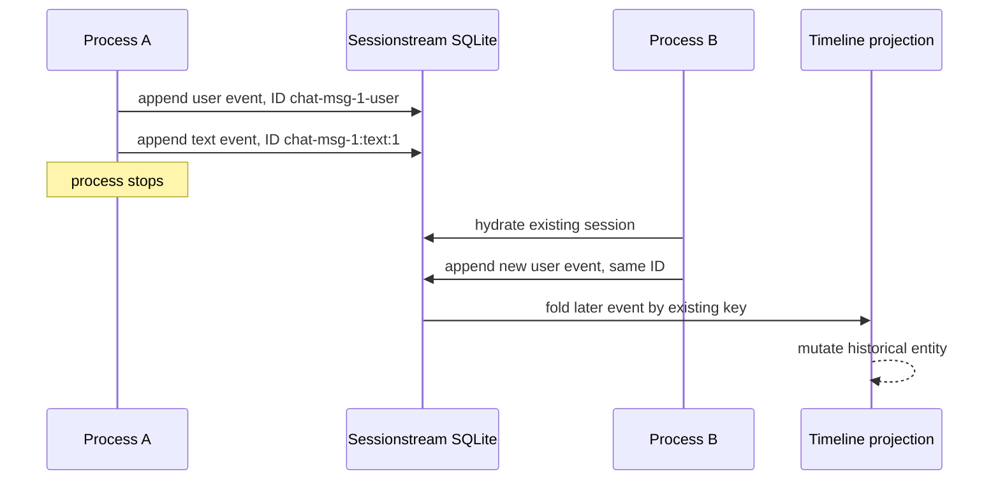
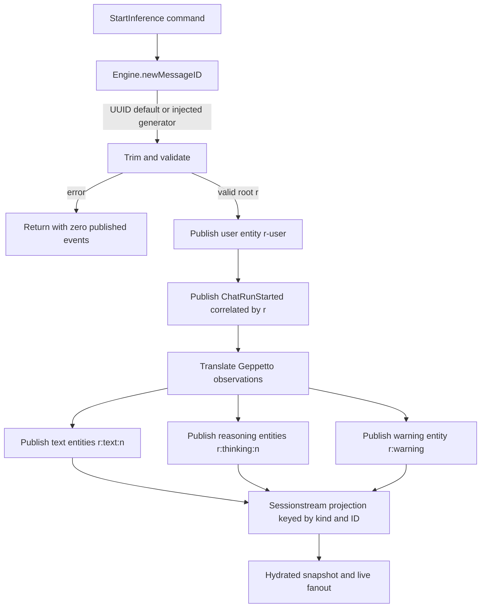

# Pinocchio Restart-Safe Chat Message Identity

Pinocchio pull request [#203](https://github.com/go-go-golems/pinocchio/pull/203) corrected a persistence defect in the chat application kernel. Before the change, each `chatapp.Engine` allocated root message IDs from a process-local integer counter. A newly constructed engine therefore began again at `chat-msg-1`. When a server reopened an existing persisted conversation and accepted another prompt, the new run reused IDs already present in the session timeline.

The event transport did not lose the new turn. Sessionstream stored the new events successfully. The defect occurred because the timeline projection uses entity identity as the update key. Reusing a historical identity instructed the projection to update an existing user or assistant entity. In the browser, this appeared as a missing user bubble and assistant output streaming into an earlier response.

The merged implementation replaces the counter with UUID-based root allocation, exposes a generator option for deterministic tests and deployment-specific policies, rejects roots that overlap Pinocchio's derived message namespaces, and aborts before publishing any event when allocation fails. The change was validated in Pinocchio, CoinVault, and RAG-TTC, then merged as `f776819` and tagged `v0.11.13`.

> [!summary]
> The central correction is a change in identity semantics. A chat message ID now identifies one logical message aggregate independently of process lifetime, engine instance, replica, and timeline order. Sessionstream ordinals continue to define chronology. Derived user, text, reasoning, and warning entities remain deterministically related to the root, but their namespaces are now explicitly disjoint from valid root IDs.

This report explains the failure, the relevant system model, the implementation, the review-driven refinement, the test strategy, and the consequences for downstream applications. The related architecture-garden entry is [[Research/Software Architecture Garden/pinocchio/designs/02 - Restart-Safe Aggregate Identity and Disjoint Derived Namespaces|Restart-Safe Aggregate Identity and Disjoint Derived Namespaces]].

## Project record

| Item | Value |
|---|---|
| GitHub issue | [go-go-golems/pinocchio#202](https://github.com/go-go-golems/pinocchio/issues/202) |
| Pull request | [go-go-golems/pinocchio#203](https://github.com/go-go-golems/pinocchio/pull/203) |
| Pull request title | `feat(chatapp): Make message ID generation restart and replica-safe` |
| Base release | `v0.11.12` at `9888e32` |
| Implementation commit | `6f4e946` — `fix(chatapp): generate restart-safe message IDs` |
| Review correction | `1961984` — `fix(chatapp): reserve derived message namespaces` |
| Merge commit | `f776819` |
| Published module tag | `v0.11.13` |
| CoinVault proof | `612b0df` — persistent canonical-server restart regression |
| RAG-TTC proof | `b7d79ba` — persistent conversation continuation regression |

The GitHub pull request merged on 2026-08-20. The `v0.11.13` tag points at the merge commit. The tag is the relevant Go module publication boundary; GitHub did not expose a separate Release object when this report was written.

## 1. The user-visible failure

The original symptom occurred after continuing an existing CoinVault conversation across a backend restart:

- the submitted prompt reached the backend;
- inference started and streamed normally;
- the new user message was absent from the rendered conversation;
- the new assistant stream appeared inside a previous assistant response;
- the WebSocket and backend logs still showed successful events.

This symptom initially made transport and frontend reconciliation plausible suspects. Inspection of the persisted timeline established a different cause. New events existed at later ordinals, but their entity IDs matched historical entities. For example, an entity such as `chat-msg-1-user` retained its old creation ordinal while receiving a payload from a much later event.

That evidence distinguishes two classes of defect:

| Observation | Likely boundary |
|---|---|
| New event absent from durable event log | ingress, execution, transport, or persistence failure |
| New event present, but projected under an old entity key | identity allocation or projection-key failure |
| New entity correct in snapshot, but absent in browser | browser adapter or state-reconciliation failure |

Pinocchio was in the second case. Sessionstream behaved correctly: it treated equal `(kind, entity ID)` coordinates as the same projected entity.

## 2. System model: events, identities, and order

Understanding the change requires separating three concepts that the old `chat-msg-N` format made easy to conflate.

### 2.1 Event ordinal

Sessionstream assigns each admitted event an ordinal within a session. The ordinal determines event order and projection replay order. If event `e_a` has ordinal 41 and event `e_b` has ordinal 42, then `e_a` precedes `e_b` regardless of their message IDs.

For session `s`, chronology is therefore represented by:

$$
e_i <_s e_j \iff \operatorname{ordinal}(e_i) < \operatorname{ordinal}(e_j).
$$

Message IDs do not need lexical or numeric ordering. UUIDv4 is consequently sufficient even though it is not time-sortable.

### 2.2 Root message identity

A root message ID identifies one inference run and the aggregate of entities derived from that run. It appears in run events and correlation metadata, and it becomes the prefix for related timeline entities.

Before PR #203:

```text
chat-msg-1
chat-msg-2
chat-msg-3
```

After PR #203:

```text
chat-msg-28db313f-53ab-4d4b-a024-ae9c760bb138
chat-msg-e7b7c79c-1856-47f0-9f40-3ead8a34e998
```

The `chat-msg-` prefix remains useful for inspection. The UUID portion supplies process-independent uniqueness.

### 2.3 Derived entity identity

Pinocchio derives several timeline entity IDs from the root:

| Entity | Construction |
|---|---|
| User message | `{root}-user` |
| Text segment | `{root}:text:{segment}` |
| Reasoning segment | `{root}:thinking:{segment}` |
| Runtime warning | `{root}:warning` |

The root is therefore not merely a label. It establishes a namespace for the aggregate. If `r` is the root and `D(r)` is the set of identifiers derived from it, correctness requires:

1. every allocated root is globally unique for the practical lifetime of persisted data;
2. a root is never equal to an identifier in any derived namespace;
3. derived identifiers for distinct roots do not collide;
4. chronology is obtained from ordinals, not from root formatting.

## 3. The pre-change allocator and its failure mode

The old `Engine` held an integer:

```go
type Engine struct {
    mu     sync.Mutex
    nextID int
    // ...
}

func (e *Engine) nextMessageID() string {
    e.mu.Lock()
    defer e.mu.Unlock()
    e.nextID++
    return fmt.Sprintf("chat-msg-%d", e.nextID)
}
```

The mutex made allocation safe among goroutines sharing one engine. It did not make allocation safe across engine instances, process restarts, or replicas.

### 3.1 Restart trace

The following sequence reproduces the semantic failure:

```text
Process A
  Engine.nextID = 0
  submit turn A1 -> root chat-msg-1
  persist chat-msg-1-user
  persist chat-msg-1:text:1
  stop process

Process B
  hydrate the same session from SQLite
  Engine.nextID = 0
  submit turn B1 -> root chat-msg-1
  project chat-msg-1-user       -> updates A1 user entity
  project chat-msg-1:text:1     -> updates A1 assistant entity
```

The projection cannot infer that Process B intended a new aggregate. Its input explicitly names the old aggregate.



### 3.2 Replica trace

The same design fails without a restart if two replicas accept commands for sessions that share persistence:

```text
Replica A, first allocation -> chat-msg-1
Replica B, first allocation -> chat-msg-1
```

A larger random starting counter would only reduce collision frequency. Persisting the counter would couple Pinocchio's reusable engine to a shared allocator and would require transactional coordination between replicas. Restoring a counter from existing rows would also require parsing the legacy format and agreeing on one maximum under concurrent writers.

UUID allocation avoids those dependencies. It does not require a schema migration, a counter table, or a leader.

## 4. The selected design

The implementation introduces a small API at the engine boundary:

```go
// MessageIDGenerator creates opaque root message IDs. Implementations must be
// safe for concurrent use when an Engine can handle commands concurrently.
// Generated roots must not occupy namespaces reserved for derived user, text,
// reasoning, or warning message entities; Engine validates this before publish.
type MessageIDGenerator func() (string, error)

func WithMessageIDGenerator(generate MessageIDGenerator) Option {
    return func(e *Engine) {
        e.messageIDGenerator = generate
    }
}
```

`NewEngine` installs a UUID default:

```go
func defaultMessageIDGenerator() (string, error) {
    return "chat-msg-" + uuid.NewString(), nil
}
```

The dependency `github.com/google/uuid` was already direct, so the change did not add a new dependency family.

### 4.1 Why the generator returns an error

The default generator does not normally fail, but the public option permits an external identity policy. Such a policy may depend on a service, entropy source, or application constraint. Returning `(string, error)` makes failure explicit and allows Pinocchio to preserve atomic command admission.

The engine performs allocation before publishing `ChatUserMessageAccepted`:

```go
messageID, err := e.newMessageID()
if err != nil {
    return err
}
userMessageID := messageID + userMessageIDSuffix
if err := e.publish(/* ChatUserMessageAccepted */); err != nil {
    return err
}
```

This ordering gives the start command a useful guarantee:

```text
generate and validate root
    failure -> return error, publish nothing
    success -> publish first aggregate event, begin run
```

The test `TestMessageIDGenerationFailurePublishesNoEvents` checks that the snapshot remains at ordinal zero and contains no entities after generator failure.

### 4.2 Why generator injection is engine-scoped

Many Pinocchio tests intentionally assert exact relationships such as `chat-msg-1-user` and `chat-msg-1:text:1`. Rewriting every test to discover random IDs would reduce the clarity of tests whose actual subject is projection or runtime behavior.

The test suite therefore injects a mutex-protected deterministic generator per engine:

```go
func newDeterministicTestEngine(opts ...Option) *Engine {
    var mu sync.Mutex
    nextID := 0
    deterministicIDs := WithMessageIDGenerator(func() (string, error) {
        mu.Lock()
        defer mu.Unlock()
        nextID++
        return fmt.Sprintf("chat-msg-%d", nextID), nil
    })
    return NewEngine(append(opts, deterministicIDs)...)
}
```

This is preferable to a package-global hook because parallel tests and independently constructed engines do not share mutable generator state. Production callers receive the UUID default unless they explicitly select another policy.

## 5. Validation and the derived namespace invariant

The first implementation validated that a custom root was nonblank and did not contain `:text:`. Code review identified a broader condition.

Suppose a custom generator emits these two distinct roots:

```text
x
x:thinking:1
```

The second root is unique among roots, but it is equal to the first root's reasoning child. Similar collisions are possible with `x-user` and `x:warning`. Root uniqueness alone is therefore insufficient.

### 5.1 Final validation rules

Pinocchio centralizes the structural tokens:

```go
const (
    userMessageIDSuffix         = "-user"
    textMessageIDDelimiter      = ":text:"
    reasoningMessageIDDelimiter = ":thinking:"
    warningMessageIDSuffix      = ":warning"
)
```

The final validator rejects:

- any root containing `:text:`;
- any root containing `:thinking:`;
- any root ending in `-user`;
- any root ending in `:warning`.

```go
func reservedDerivedMessageIDNamespace(id string) string {
    for _, delimiter := range []string{
        textMessageIDDelimiter,
        reasoningMessageIDDelimiter,
    } {
        if strings.Contains(id, delimiter) {
            return delimiter
        }
    }
    for _, suffix := range []string{
        userMessageIDSuffix,
        warningMessageIDSuffix,
    } {
        if strings.HasSuffix(id, suffix) {
            return suffix
        }
    }
    return ""
}
```

Delimiter and suffix checks intentionally differ. A text or reasoning delimiter anywhere in a root can be parsed as a structural boundary. A user or warning token only collides when it occupies the terminal position. The safe root `chat-msg-user-defined-warning` is therefore accepted.

### 5.2 Formal namespace condition

Let `R` be the set of valid roots and define:

$$
D(r) = \{r\texttt{-user},\ r\texttt{:warning}\}
       \cup \{r\texttt{:text:}x\}
       \cup \{r\texttt{:thinking:}x\}.
$$

The validator is designed to preserve:

$$
R \cap \bigcup_{r \in R} D(r) = \varnothing.
$$

Combined with unique root allocation, prefix-derived child construction then keeps aggregate identities separate.

### 5.3 Centralized construction tokens

The review correction also replaced repeated literals at the construction and parsing sites:

- `runtime_inference.go` uses `userMessageIDSuffix`;
- `runtime_sink.go` uses `textMessageIDDelimiter`;
- `projections.go` parses with `textMessageIDDelimiter`;
- `messages.go` uses `warningMessageIDSuffix`.

The reasoning plugin remains a child package and does not consume an unexported parent constant. Tests therefore guard the known `:thinking:` contract. Any new root-derived entity type must extend both root validation and its validation table in the same change.

## 6. End-to-end data path after the change

The identity change is localized, but the corrected value crosses several layers.



No protobuf field changed. No database column changed. No WebSocket frame changed. Consumers already model message IDs as opaque strings, so changing the root value from a decimal suffix to a UUID suffix is wire-compatible with the supported contract.

The change deliberately does not add a compatibility adapter for consumers that parse `chat-msg-N`. Repository searches found no supported production parsing of the numeric suffix. Chronology remains an ordinal property.

## 7. Verification strategy

The tests are organized around three distinct claims.

### 7.1 Pinocchio unit and package tests

`pkg/chatapp/message_id_test.go` verifies:

- the default begins with `chat-msg-` and contains a parseable UUID;
- separately constructed engines do not allocate the same default root;
- blank and nil generators fail;
- generator errors are wrapped and returned;
- reserved text, reasoning, user, and warning namespaces fail;
- nonstructural occurrences of namespace words remain valid;
- a generation failure publishes no partial event history.

The restart test constructs two engines rather than calling one engine twice. That distinction is essential: the old counter was unique within one engine and failed only when engine state was reconstructed or duplicated.

Focused and complete Pinocchio validation passed:

```bash
GOCACHE=/tmp/pinocchio-gocache go test ./pkg/chatapp/... -count=1
go test ./... -count=1
```

The repository hook additionally passed generation, the embedded frontend build, `go build ./...`, golangci-lint, custom vet tools, the full test suite, gosec, and govulncheck with no reachable vulnerabilities.

### 7.2 CoinVault persistence regression

CoinVault is the application in which the defect was observed. Commit `612b0df` adds `TestCanonicalServerRestartKeepsNewTurnSeparate` at the canonical HTTP and SQLite boundary.

The test procedure is:

```text
create SQLite timeline path
construct CanonicalServer A
submit prompt to session S through HTTP
wait until inference is idle
snapshot S and record the two chat entity IDs
close server A

construct CanonicalServer B with the same SQLite path
submit another prompt to session S through HTTP
wait until inference is idle
snapshot S
require four unique chat entities
require both pre-restart IDs still exist
```

This test proves more than allocator uniqueness. It exercises CoinVault's server construction, Pinocchio service path, Sessionstream persistence and hydration, HTTP routing, and timeline projection. The second server instance is the condition that would reset the historical counter.

The complete CoinVault suite passed with the workspace selecting the modified Pinocchio checkout.

### 7.3 RAG-TTC continuation regression

RAG-TTC commit `b7d79ba` adds `TestCanonicalConversationContinuesWithDistinctMessageAfterRestart`. It persists a conversation, closes the server, reopens it from the same root, submits a continuation, and verifies:

- first and second submission message IDs differ;
- the snapshot ordinal advances;
- the number of canonical `ChatMessage` entities increases;
- pre-restart chat entities remain byte-for-byte stable;
- the latest stored turn identity names the second submission's message and run.

Running the test with workspace resolution disabled and Pinocchio `v0.11.12` produced the intended regression failure:

```text
post-restart submission reused message ID "chat-msg-1"
```

Running it with the workspace-linked implementation passed. This A/B result demonstrates that the regression test detects the original defect rather than merely exercising an unrelated restart path.

## 8. What failed during implementation and what it established

Several failures refined either the implementation or the verification method.

### 8.1 Sandbox cache and listener restrictions

The default Go build cache was read-only in the execution sandbox. Setting `GOCACHE=/tmp/pinocchio-gocache` allowed focused tests to run. The first sandboxed full-suite attempt then failed because existing `httptest` users could not bind to `[::1]:0`. The identical suite passed in an environment that permitted localhost listeners.

These were environment failures, not product failures. Recording the exact boundary prevented unnecessary changes to valid tests.

### 8.2 Incomplete namespace validation

The first implementation reserved only the parsed text delimiter. Pull-request review identified root-versus-reasoning and root-versus-suffix collisions. The correct generalization was not another special case at a projection site; it was an explicit invariant for all root-derived namespaces.

This was the most important review contribution. It changed the custom-generator contract from “unique roots” to “unique roots in a namespace disjoint from derived entities.”

### 8.3 Overbroad RAG-TTC preservation assertion

The first RAG-TTC restart assertion treated every projected entity as immutable. That was incorrect for `ragttc.source/source-1`, whose stable key intentionally represents an application projection updated across turns. The final test limits immutability to canonical `ChatMessage` entities.

This distinction is architectural:

- canonical chat message identity represents a distinct historical aggregate and must not be reused;
- an application read-model key may intentionally identify one continuously updated projection.

A persistence test must state which kind of entity it is protecting.

### 8.4 Workspace-dependent downstream proof

CoinVault and RAG-TTC initially consumed Pinocchio `v0.11.12` in their module files while the local Go workspace selected the new checkout. This was useful for pre-release proof, but it also meant hooks run with `GOWORK=off` correctly observed the old behavior. RAG-TTC was committed with `LEFTHOOK=0` under explicit instruction, preserving the failing tagged-dependency check as evidence until `v0.11.13` became available.

The publication of `v0.11.13` removes that temporary dependency gap. Downstream module bumps remain separate integration work.

## 9. API and compatibility consequences

### 9.1 Public API addition

Pinocchio now exports:

```go
type MessageIDGenerator func() (string, error)
func WithMessageIDGenerator(generate MessageIDGenerator) Option
```

Custom implementations are responsible for concurrent safety when one engine handles commands concurrently. The engine remains responsible for trimming, nonblank validation, reserved-namespace validation, and atomic failure before the first event.

### 9.2 Stable interfaces

The following interfaces remain unchanged:

- `StartInferenceCommand` protobuf schema;
- chat event protobuf schemas;
- Sessionstream event and snapshot schemas;
- timeline entity key shape;
- WebSocket snapshot/live protocol;
- React chat-provider adapter contracts;
- SQLite schema.

This is an identity-policy correction behind existing string fields.

### 9.3 Behavioral change

Code that displays, stores, compares, or correlates message IDs as opaque strings continues to work. Code that relies on a numeric suffix, lexical message ordering, or a predictable first ID is outside the supported semantics and must be updated.

Tests requiring exact identities should inject a deterministic generator. Production code should normally retain the UUID default.

## 10. Correctness argument

The merged design establishes the required properties in stages.

### Property A: uniqueness across engine lifetimes

Each default root contains a UUIDv4. Two independently created engines draw from the same large random identity space rather than restarting a shared integer sequence. The probability of practical collision is negligible and does not depend on process-local state.

### Property B: atomic command admission

Generation and validation occur before the first event publication. A generator error, nil generator, blank root, or reserved root leaves the session at its previous ordinal and entity set.

### Property C: disjoint root and child identities

Valid roots exclude all structural forms that can equal current derived user, text, reasoning, or warning entities. Construction uses centralized tokens for the parent-package derivations, with validation tests guarding the complete current list.

### Property D: preserved chronology

Sessionstream ordinals are unchanged and remain the authoritative order. Replacing sequential roots does not alter fold order, creation ordinals, or last-event ordinals.

### Property E: preserved application behavior across restart

CoinVault and RAG-TTC tests reconstruct their servers over persistent state, submit a new turn, and require old chat entities to remain present while new chat entities appear. This proves the property at application boundaries rather than only inside the allocator.

## 11. Review and maintenance guide

Future changes involving chat entity identities should answer the following questions.

### Adding a derived entity type

If a new entity is constructed from the root:

1. define its structural delimiter or suffix;
2. add it to `reservedDerivedMessageIDNamespace`;
3. add invalid-root tests;
4. verify that a valid root cannot equal the new derived form;
5. add projection tests for the parent relationship.

### Providing a custom generator

A deployment-specific generator must:

- return globally unique roots for the lifetime of retained data;
- be safe for concurrent calls;
- avoid reserved derived namespaces;
- return errors rather than silently falling back;
- avoid encoding chronology that consumers then begin to depend on.

Pseudocode:

```text
function generateRoot() -> (string, error):
    id = externalAllocator.next()
    if allocation failed:
        return error
    return "chat-msg-" + id
```

Pinocchio will perform structural validation after generation.

### Testing a restart-sensitive consumer

The minimum useful downstream test must create a new engine or server instance. Reusing the original process object does not reproduce the historical failure.

```text
persist turn with instance A
destroy A
construct B over the same durable store
continue the same session with B
assert old canonical entities unchanged
assert new canonical entities exist under distinct IDs
```

## 12. Remaining work and open questions

The Pinocchio correction is merged and tagged. The immediate downstream work is operational rather than architectural:

- bump CoinVault to Pinocchio `v0.11.13` and run its restart regression with `GOWORK=off`;
- bump RAG-TTC to `v0.11.13` and rerun its previously failing `GOWORK=off` continuation test;
- manually continue an existing persisted conversation after restarting each application;
- verify that the browser renders a new user bubble and a separately keyed assistant response;
- inspect any externally maintained consumers for parsing of `chat-msg-N`.

Historical conversations already affected by ID reuse are not repaired by this change. Prevention and repair have different requirements. Repair would need to reconstruct aggregate boundaries from raw event ordinals and correlation metadata, then rewrite or rebuild projected entities. That work should be scoped separately and should begin by determining whether affected durable event histories still exist.

The namespace list is currently maintained explicitly. If Pinocchio gains many independently developed chat plugins that derive root-based IDs, a registration mechanism may become appropriate. The current explicit function is preferable while the namespace set is small because it is easy to audit and does not widen plugin API surface.

## 13. Files to read

### Pinocchio implementation

- `pkg/chatapp/chat.go` — generator type, engine field, option, and default installation.
- `pkg/chatapp/message_id.go` — UUID default, validation, and namespace rules.
- `pkg/chatapp/message_id_test.go` — allocation, validation, restart, and atomicity tests.
- `pkg/chatapp/runtime_inference.go` — allocation before the first event and user suffix construction.
- `pkg/chatapp/runtime_sink.go` — text-segment derivation.
- `pkg/chatapp/projections.go` — parent extraction from text segment IDs.
- `pkg/chatapp/messages.go` — warning identity derivation.
- `pkg/chatapp/plugins/reasoning.go` — reasoning child namespace.

### Downstream proofs

- CoinVault `internal/webchat/sessionstream/sessionstream_server_test.go` — `TestCanonicalServerRestartKeepsNewTurnSeparate`.
- RAG-TTC `internal/admin/chatserver/restart_test.go` — `TestCanonicalConversationContinuesWithDistinctMessageAfterRestart`.

### Project documentation

- Pinocchio ticket `ttmp/2026/08/20/PINOCCHIO-202--make-chat-message-identities-restart-safe-and-replica-safe/`.
- Ticket design guide `design-doc/01-restart-safe-chat-message-identity-analysis-design-and-implementation-guide.md`.
- Ticket diary `reference/01-investigation-diary.md`.
- [[Research/Software Architecture Garden/pinocchio/README|Pinocchio Architecture Garden]].
- [[Research/Software Architecture Garden/pinocchio/designs/02 - Restart-Safe Aggregate Identity and Disjoint Derived Namespaces|Restart-Safe Aggregate Identity and Disjoint Derived Namespaces]].

## Conclusion

PR #203 corrected an identity defect rather than a transport defect. The old allocator guaranteed uniqueness only inside one engine lifetime, while the persisted timeline required uniqueness across every engine and replica that could continue a session. UUID roots supply that independence without adding storage coordination. Generator injection preserves deterministic tests and supports explicit deployment policies. Pre-publication validation prevents partial aggregates. Review-driven namespace validation ensures that roots cannot collide with their own derived entity space.

The resulting design keeps the system's coordinates separate: ordinals define order, root IDs define logical message aggregates, derived IDs define aggregate members, and projection keys define read-model identity. The downstream restart tests demonstrate that this distinction survives real server reconstruction and persistent hydration. Pinocchio `v0.11.13` is therefore a narrowly scoped API change with a broad correctness effect at every application that continues persisted conversations.
