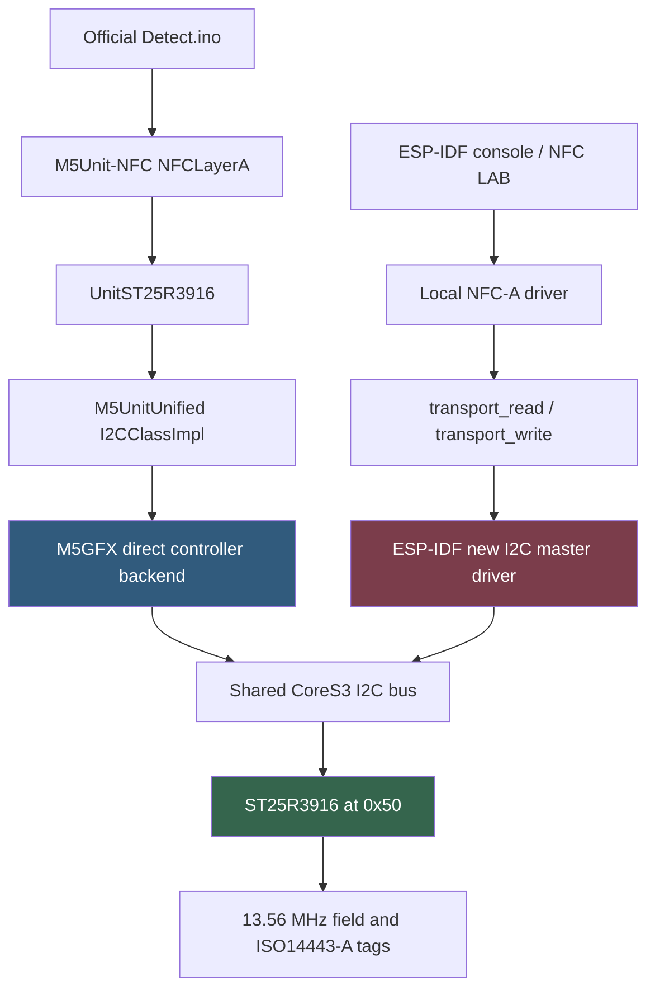
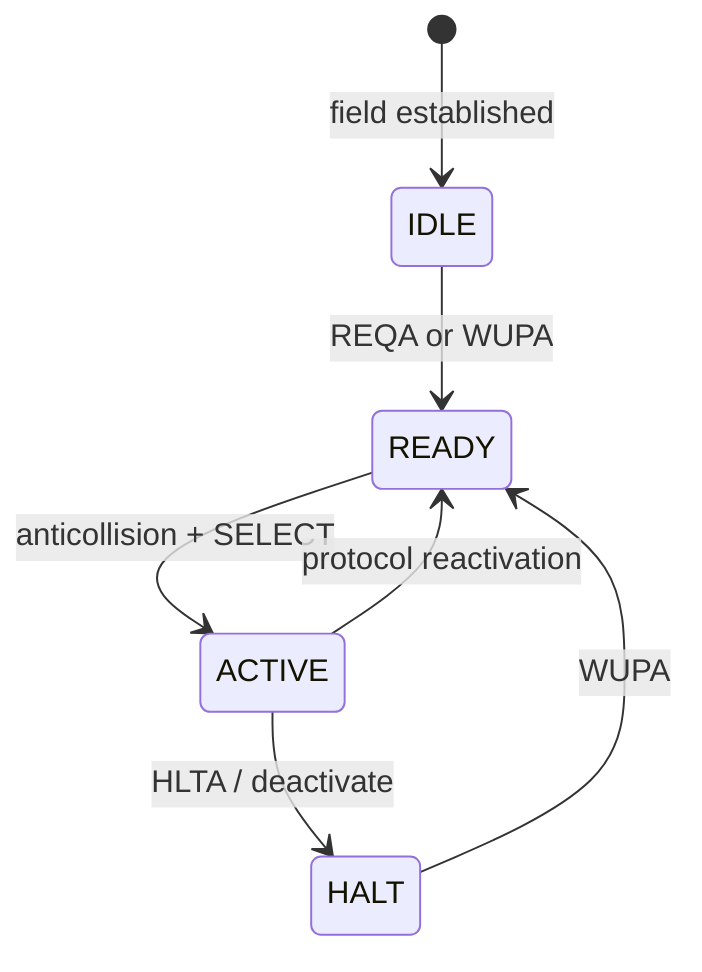
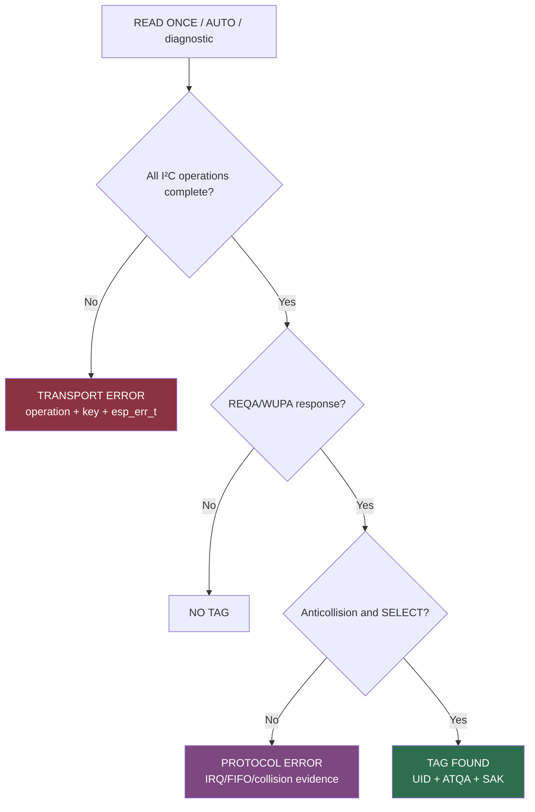
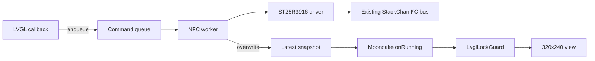

# M5StackChan NFC: From Arduino Reference Firmware to an ESP-IDF Diagnostic System

Porting the M5StackChan NFC reader from Arduino to ESP-IDF is not primarily a task of translating C++ calls into C functions. The supported Arduino firmware combines an ST25R3916 protocol implementation, M5UnitUnified adapters, a direct M5GFX I²C controller backend, request-level retry policy, board initialization, and known physical placement. The ESP-IDF port has to reproduce the relevant behavior while fitting a different runtime: a shared ESP-IDF I²C bus, FreeRTOS ownership, `esp_console`, Mooncake application lifecycle, LVGL locking, and explicit error classification.

This project batch built that system in stages. It produced a standalone ESP-IDF reader, a broad console diagnostic surface, a corrected ST25R3916 initialization sequence, an NFC-only 320×240 diagnostic application, structured serial evidence, a reproducible instrumented Arduino control, continuous multi-tag polling, and a persistent UID registry. It also produced a precise unresolved result. The official M5 path completed more than ten thousand observed ST25R3916 transactions without exposing one API-level I²C failure, while the ESP-IDF new master driver intermittently returns `ESP_ERR_INVALID_STATE` during ordinary pre-REQA register accesses.

The port is therefore not finished. It has advanced from an undifferentiated “NFC does not work” report to a bounded transport problem with two measured implementations, exact failing operations, known-good tags, known-good placement, preserved source versions, and a phased backend experiment plan.

> [!summary]
> - The official Arduino path reads real UIDs and completed 10,188 reported ST25R3916 transactions with zero M5Unified-level transport failures during the principal comparison run.
> - NFC LAB caught ESP-IDF failures before RF transmission: one at auxiliary-definition register `0x0A`, another at operation-control register `0x02`. Those attempts cannot be explained by tag type, placement, or anticollision.
> - The decisive implementation difference is below the NFC-A protocol layer. M5GFX directly controls the ESP32-S3 I²C peripheral with explicit START/restart/STOP, transaction-start FSM reset, locking, and recovery; NFC LAB uses ESP-IDF 5.5.4's new master driver.
> - The next engineering task is a controlled backend matrix in the standalone firmware: baseline new driver, defined operations, direct-command completion audit, and isolated legacy/direct behavior. Eventual UID success is insufficient; transport acceptance requires zero explicit failures.

## 1. The actual porting problem

The reader IC is an ST25R3916 at I²C address `0x50`. It is not a sensor that returns a UID from one register. Firmware configures its clock, regulator, transmitter, receiver, analog protection, frame timers, interrupt masks, FIFO, and NFC mode. Firmware then drives a stateful ISO/IEC 14443-A exchange: field activation, REQA or WUPA, ATQA reception, anticollision, selection, UID cascade handling, SAK processing, and optional product identification.

The Arduino reference implementation distributes these responsibilities across several layers:

```text
Detect.ino
  └── NFCLayerA
        ├── request / wakeup / detect / select / identify
        └── PollerST25R3916ForA
              └── UnitST25R3916
                    └── M5UnitUnified I2C adapter
                          └── M5Unified::I2C_Class
                                └── M5GFX direct ESP32 I2C controller code
```

The ESP-IDF implementation has a different shape:

```text
standalone esp_console or NFC LAB worker
  └── local ST25R3916 driver
        ├── NFC-A protocol helpers
        ├── register / FIFO / direct-command helpers
        └── i2c_master_transmit / i2c_master_transmit_receive
              └── ESP-IDF 5.5.4 new I2C master driver
```

A source-level port can reproduce register values and NFC command order while still behaving differently at the bus boundary. That is what the hardware evidence now shows.



The engineering objective is therefore behavioral: reproduce reliable transactions and protocol results under ESP-IDF without importing unnecessary Arduino runtime assumptions and without compromising StackChan’s shared-bus architecture.

## 2. Project boundaries and artifacts

The batch uses two ESP-IDF projects and one disposable Arduino control workspace.

### 2.1 Standalone ESP-IDF firmware

The smallest experiment host is:

```text
/home/manuel/code/wesen/go-go-golems/esp32-s3-m5/0115-m5stackchan-nfc-reader
```

It initializes the bus, attaches the ST25R3916, and exposes `esp_console` commands over serial. It has no display, Mooncake runtime, touch task, or LVGL task. This is the correct environment for changing I²C transaction semantics because it minimizes unrelated bus traffic and lifecycle constraints.

### 2.2 NFC LAB

The integrated diagnostic firmware is:

```text
/home/manuel/code/wesen/go-go-golems/esp32-s3-m5/0116-m5stackchan-nfc-debug-ui
```

It composes a tracked overlay onto pinned StackChan commit `1b5765599fba8aaad1811d9a79358ccc7051f5f3`. The overlay adds an NFC application, serialized worker, ST25R3916 driver, LVGL view, build scripts, and flash scripts. Standard StackChan app implementations are excluded; NFC LAB is the only installed Mooncake app and opens automatically.

### 2.3 Arduino control

The known-good control is generated under:

```text
/tmp/esp60-official-detect
```

The reproducible instrumentation that modifies it is committed under the ESP-60 ticket:

```text
ttmp/.../scripts/04-instrument-official-arduino-trace.py
ttmp/.../sources/code/arduino-trace/
```

The control pins the versions that produced a real UID:

| Component | Version |
|---|---|
| PIOArduino platform | `55.03.311` |
| Arduino-ESP32 | `3.3.11` |
| ESP-IDF framework libraries | `5.5.5` |
| M5Unified | `0.2.20` |
| M5GFX | `0.2.27` |
| M5UnitUnified | `0.5.5` |
| M5Unit-NFC | `0.1.0`, preserved local source |
| PlatformIO Core | `6.1.19` |

The ticket workspace contains the design guides, complete diary, source snapshots, datasheet, issue research, hardware logs, and trace analyses:

```text
ttmp/2026/08/20/ESP-60-M5STACKCHAN-NFC--.../
```

## 3. Establishing the hardware facts

A reliable port starts by separating physical facts from software assumptions.

The reader responded at address `0x50`. Its identity register decoded to type `0x05`, revision `0x02`. Oscillator startup completed. Antenna-capacitance measurements were stable near 124. Key Space-A and Space-B registers read back with the intended values. These results established that the controller was powered, attached to the bus, and connected to its analog network.

Physical placement was less obvious. The supported tag position is the **literal narrow top edge of the StackChan head**. The tag lies horizontally across that edge. The display face and body are not the demonstrated sensing surfaces. Official photographs were preserved because textual descriptions such as “top of the head” had already produced two incorrect placements.

The final physical control was stronger than a bus probe. The correctly built official `Detect.ino` displayed `PICC:<UID>` with a known NTAG at that top edge. That one observation proved the following system together:

- the reader IC functions;
- the antenna can couple to the tag;
- the tag is compatible;
- the placement is correct;
- the board power and clock environment can support a complete exchange;
- the M5 software stack can perform REQA, anticollision, selection, and UID extraction.

Once that result existed, later pre-REQA ESP-IDF failures could not reasonably be assigned to unsupported tag type or incorrect placement.

## 4. Reconstructing the ST25R3916 behavior

The early port was intentionally small, but a header-only reading of the vendor library omitted behavior that lived in implementation files. The corrected sequence came from tracing M5Unit-NFC’s `begin()`, NFC-A configuration, request/wakeup, NRT calculation, and detection loop.

### 4.1 Register spaces and command framing

Space-A register reads send one encoded command byte and then perform a repeated-start read:

```c
uint8_t command = (register_address & 0x3F) | 0x40;
i2c_master_transmit_receive(device, &command, 1, output, 1, timeout);
```

Space-A writes send the raw low-six-bit address and data. Space-B operations prepend `0xFB`. FIFO load uses `0x80`; FIFO read uses `0x9F`. Direct commands occupy the `0xC0`–`0xFF` region.

The important commands include:

| Command | Byte | Role |
|---|---:|---|
| SET_DEFAULT | `0xC1` | Reset configuration |
| STOP_ALL_ACTIVITIES | `0xC2` | Stop RF/protocol operation |
| TRANSMIT_WITH_CRC | `0xC4` | Transmit FIFO frame with CRC |
| TRANSMIT_WITHOUT_CRC | `0xC5` | Transmit FIFO frame without CRC |
| TRANSMIT_REQA | `0xC6` | Send REQA |
| TRANSMIT_WUPA | `0xC7` | Send WUPA |
| NFC_INITIAL_FIELD_ON | `0xC8` | Establish the field |
| RESET_RX_GAIN | `0xD5` | Restart gain adaptation |
| ADJUST_REGULATORS | `0xD6` | Run regulator calibration |
| CLEAR_FIFO | `0xDB` | Clear FIFO |
| SPACE_B_ACCESS | `0xFB` | Prefix Space-B access |
| TEST_ACCESS | `0xFC` | Test/protection access |

### 4.2 Initialization corrections

The final initialization incorporated the vendor protection frame `FC 04 10`, corrected the I/O register assignment, configured antenna tuning and transmitter drive, programmed receiver settings, restored Space-B overshoot/undershoot/correlator values, started the oscillator, adjusted regulators, and configured NFC-A initiator mode.

Verified values included:

```text
IO1=17 IO2=A4 MODE=09
RX1=08 RX2=2D RX3=D8 RX4=22
ANT1=82 ANT2=82 TXD=D0
NRT=0350
Space-B OS=40/03 US=40/03 CORR=47/00 EMD=40
```

This readback mattered because a successful write API result does not prove that the expected byte persisted. The project treats a transaction error and an unexpected returned value as different observations.

### 4.3 Request timing

M5 programs the No-Response Timer before each NFC-A exchange. REQA/WUPA use 4 ms; anticollision uses 8 ms. With `nrt_step=0`, a 4 ms interval becomes `0x0350` at a 13.56 MHz carrier.

```text
NRT = ceil(timeout_us × 13,560,000 / 64,000,000)
```

Correct NRT configuration produced the first repeatable nonzero RXS/RXE/collision interrupt evidence in the ESP-IDF driver. It did not produce a UID, but it established that the receiver sometimes observed tag modulation.

## 5. ISO14443-A state and why continuous polling needs WUPA

REQA addresses tags in IDLE. WUPA also wakes tags in HALT. Multi-tag detection uses this distinction deliberately: select one tag, HALT it, then request again so another tag can answer.



The official vector detection loop repeats request, select, deactivate, and append until its deadline. The default vector overload uses a one-second window. That behavior explains two observations:

1. one call can enumerate several PICCs by HALTing each selected tag;
2. a later loop that starts with REQA may see no tags because the previous loop left them HALTed.

The continuous Arduino monitor therefore begins each cycle with WUPA. It can then run bounded vector detection and rediscover tags without requiring removal or RF power cycling.

## 6. Console-first ESP-IDF diagnostics

The standalone firmware grew a broad command surface because each command answers a different diagnostic question.

| Command | Question |
|---|---|
| `nfc-scan` | Is address `0x50` present? |
| `nfc-probe` | Does identity decode as type `0x05`, revision `0x02`? |
| `nfc-regs` | Do the important Space-A and Space-B values match? |
| `nfc-cap` | Is antenna capacitance stable and nonzero? |
| `nfc-field` | Can field commands and operation-control changes complete? |
| `nfc-reqa` | What do raw request IRQ and FIFO states show? |
| `nfc-read` | Can the complete NFC-A path return a UID? |
| `nfc-poll` | How does repeated insertion/removal behave? |
| `nfc-dump` | What is the complete Space-A state? |
| `nfc-sweep` | How do RF amplitude observations change with placement? |

This structure prevented one failure domain from being interpreted as another. A valid identity response does not prove stable transport. A stable configuration dump does not prove that the next write will complete. RXS does not prove a valid ATQA. ATQA does not prove anticollision and selection.

The standalone firmware remains incomplete by its strict acceptance rule: Phase 1 is not complete until ESP-IDF itself prints a UID.

## 7. NFC LAB: making failure layers visible

The console is the right environment for backend experiments, but it is not ideal while a person moves tags around the physical antenna. NFC LAB embeds the driver in the production StackChan runtime and shows evidence on the 320×240 display.

The UI state model separates:

- **NO TAG**: transport completed but no valid PICC answered;
- **TRANSPORT ERROR**: an I²C operation returned timeout, invalid state, or invalid response;
- **PROTOCOL ERROR**: transport completed but NFC exchange or identification failed;
- **TAG FOUND**: selection and UID extraction completed.



### 7.1 One worker owns NFC

LVGL callbacks do not touch I²C. They enqueue fixed-size commands. One `NfcDebugService` FreeRTOS task owns all NFC operations and publishes immutable snapshots through a one-element overwrite queue. The application acquires `LvglLockGuard` only while applying a new snapshot to widgets.



The service reuses `hal_bridge::board_get_i2c_bus()`. It does not create a second controller for GPIO11/GPIO12. Reinitialization removes and re-adds only the NFC device handle; it does not reset the shared bus behind touch, power, RTC, and other clients.

### 7.2 NFC-only composition

A reproducible overlay excludes standard StackChan app implementations, installs only NFC LAB, starts Mooncake unconditionally, and opens NFC LAB at boot. `apps/common` remains because the HAL links against status-bar, reminder, and home-indicator support located there.

The NFC-only image was `0x30ae70`, approximately 613 KiB smaller than the complete StackChan plus NFC LAB build. The first migration required a full flash because the StackChan partition table and generated-assets partition differed from the standalone firmware. Later ESP-IDF UI iterations can use application-only flash, unless Arduino has replaced the partition table in the meantime.

## 8. Structured serial evidence

On-screen state is useful, but remote debugging requires a chronological text record. The ESP-IDF driver now emits a machine-greppable error for every failed low-level operation:

```text
NFC_I2C_FAIL txn=65 failed=1 op=READ_A(1) key=0x02 \
  err=ESP_ERR_INVALID_STATE(0x103) elapsed_us=195
```

Service records add high-level context:

```text
NFC_INIT event=failed err=ESP_ERR_INVALID_STATE(0x103) \
  elapsed_us=59057 txns=65 failed=1 last_op=1 last_key=0x02
```

The logger has a deliberate volume policy:

- every transport failure is ERROR and is never rate-limited;
- tag results are INFO;
- no-tag summaries are INFO on the first and every tenth result;
- full no-response RF detail is DEBUG;
- sampling and verification print bounded lifecycle summaries.

The logger does not issue extra I²C transactions. It formats values already held by the driver or service snapshot. This prevents diagnostics from changing the NFC operation sequence through additional bus traffic.

## 9. The first exact ESP-IDF failures

The first controlled NFC LAB READ ONCE ended with:

```text
total transactions: 365
succeeded:          360
failed:             5
last operation:     WRITE_A
last key:           0x0A
last error:         ESP_ERR_INVALID_STATE
```

Register `0x0A` is auxiliary definition. The driver was setting `no_crc_rx=0x80` before REQA:

```text
poll_nfca
  -> reqa
     -> nfca_wake
        -> set_bits(AUXILIARY_DEFINITION, 0x80)
           -> read register 0x0A
           -> write register 0x0A  <-- failed
```

The attempt aborted before direct command `0xC6`. No RF request was transmitted. Tag type, tag placement, antenna coupling, collision behavior, and UID cascade cannot explain that specific failed attempt.

After structured boot logging was deployed, another run failed during NFC initialization:

```text
NFC_I2C_FAIL txn=65 failed=1 op=READ_A(1) key=0x02 \
  err=ESP_ERR_INVALID_STATE(0x103) elapsed_us=195
```

Register `0x02` is operation control. This failure occurred while `st25r3916_field_on()` performed the read half of a read-modify-write. It again occurred before any tag request.

The fact that failures moved between ordinary registers weakened the hypothesis that one specific ST25R register or command-busy window was solely responsible.

## 10. What `ESP_ERR_INVALID_STATE` means in this driver

In ESP-IDF 5.5.4’s synchronous new I²C master path, `ESP_ERR_INVALID_STATE` does not uniquely mean that the public device handle was never initialized. The driver waits for a transaction completion event and examines controller status. Several non-DONE outcomes can emerge through the same public error result.

Espressif issue reports contain related NACK/invalid-state patterns. One historical recovery fix is already present in 5.5.4, so its existence is supporting context rather than a direct solution. Current evidence still cannot classify the physical event as NACK without a waveform or lower-level backend event.

The project therefore uses a conservative label: **host transaction did not complete normally**. It reserves “physical NACK” for evidence from SDA/SCL or a backend status that exposes ACK failure directly.

## 11. Instrumenting Arduino without changing its timing

Visible Arduino success initially left an important question unanswered: did M5 retry through hidden I²C failures?

Printing a line from every M5 I²C function would not provide a neutral measurement. At 115200 baud, a 100-character line takes several milliseconds to transmit. The measured transactions themselves usually complete in roughly 100–250 microseconds. Synchronous hot-path serial output would dominate timing and could eliminate a target-busy condition by inserting delays.

The instrumented control instead records fixed-size events in RAM. `M5Unified::I2C_Class` maintains one transaction context across:

```text
start -> write -> optional restart -> optional read -> stop
```

Each address-`0x50` event records:

- sequence number;
- start timestamp;
- elapsed time;
- write, read, or write-read kind;
- first transmitted byte;
- write and read lengths;
- failure-stage bits for START, restart, write, read, and STOP.

The sketch drains the ring only after initialization, detection, or identification completes. A 6,000-entry forensic mode preserves the full one-second detect loop. A 1,024-entry continuous mode supports bounded live cycles with lower RAM use.

```pseudo
on start(address, direction):
    context = new transaction context
    context.address = address
    context.started = now
    if start fails:
        context.failure |= START
        complete(context)

on write(bytes):
    if first write:
        context.key = bytes[0]
    context.write_length += len(bytes)
    if write fails:
        context.failure |= WRITE

on restart(direction):
    if restart fails:
        context.failure |= RESTART
        complete(context)

on read(length):
    context.read_length += length
    if read fails:
        context.failure |= READ

on stop():
    if stop fails:
        context.failure |= STOP
    complete(context)
```

This instrumentation measures errors visible at the M5Unified boundary. It does not prove that no lower-level electrical anomaly was internally recovered by M5GFX, but it directly answers whether the official stack was repeatedly returning failed logical transactions to M5Unit-NFC.

## 12. The measured Arduino comparison

With four physical chips on the literal top edge, the full trace reported:

| Phase | High-level outcome | Transactions | Reported failures | Median | p95 | Maximum |
|---|---:|---:|---:|---:|---:|---:|
| Initialization | success | 338 | 0 | 176 us | 187 us | 351 us |
| Detect window | three PICCs | 4,816 | 0 | 178 us | 213 us | 478 us |
| Identify UID 1 | success | 92 | 0 | 178.5 us | 228 us | 391 us |
| Identify UID 2 | false | 87 | 0 | 178 us | 242 us | 400 us |
| Identify UID 3 | false | 87 | 0 | 179 us | 243 us | 357 us |
| Next detect window | no PICC | 4,768 | 0 | 178 us | 213 us | 414 us |

The principal run therefore reported 10,188 successful M5 transactions and zero failures.

Three UIDs were discovered. One was fully identified:

```text
PICC:047BD44D9E6180 NTAG 215 0044/00 504/540
```

Two deeper identification calls returned false even though all 87 I²C transactions in each phase succeeded. This is useful evidence: protocol-level failure can exist on a clean transport. NFC LAB’s transport/protocol distinction is not theoretical.

### 12.1 Exact comparison at register `0x0A`

The first successful Arduino REQA sequence included:

| Transaction | Kind | Key | Meaning | Duration | Result |
|---:|---|---:|---|---:|---|
| 1 | WR | `0x52` | Read register `0x12` | 175 us | success |
| 2 | W | `0x10` | Write NRT high byte | 136 us | success |
| 3 | W | `0x05` | Write NFC-A settings | 105 us | success |
| 4 | WR | `0x4A` | Read raw register `0x0A` | 180 us | success |
| 5 | W | `0x0A` | Write raw register `0x0A` | 102 us | success |
| 6 | WR | `0x5A` | Read interrupt register | 209 us | success |
| 7 | W | `0xDB` | Clear FIFO | 78 us | success |
| 8 | W | `0xC6` | Transmit REQA | 79 us | success |
| 15 | WR | `0x9F` | Read FIFO response | 178 us | success |

Arduino completed the exact auxiliary-definition read-modify-write where NFC LAB had aborted. During the whole detect phase it performed 153 encoded reads of `0x0A` and seven writes to `0x0A`, all successfully.

### 12.2 Exact comparison at register `0x02`

During initialization, Arduino performed seven encoded reads of operation-control register `0x02` and four writes to it without failure. NFC LAB’s later initialization had failed on an ordinary read of that same logical register.

### 12.3 Timing is not enough to classify the fault

The ESP-IDF failed operation took 195 microseconds. Successful M5 logical reads commonly occupied a similar range. The elapsed time does not identify the controller outcome. The decisive evidence must come from controller status or SDA/SCL.

## 13. Continuous Arduino polling and multi-tag state

The forensic trace proved the backend comparison but was not useful as a live monitor. Printing thousands of buffered events after every one-second detect window created long output pauses. A second Arduino sketch mode retained the tracer but printed only phase summaries and actual failures.

### 13.1 One-tag continuous mode

The first continuous monitor used:

```text
WUPA -> SELECT -> IDENTIFY -> display -> 250 ms delay
```

In 49 captured cycles it completed 8,126 ST25R3916 transactions with zero failures. It repeatedly selected three different UIDs. Selection and identification sometimes failed while the transport remained clean, especially with four tags coupled at once.

### 13.2 Bounded multi-tag collection

The next version used:

```text
WUPA
vector detect for 120 ms
identify up to four returned PICCs
render four rows
wait 250 ms
```

The 120 ms window avoids the original one-second, approximately 4,800-transaction request loop. It still uses the official HALT-based multi-PICC behavior.

### 13.3 Persistent seen-device registry

A current-scan vector is not a historical inventory. The first multi-tag screen erased its rows when the next scan returned no PICCs. The final monitor uses a fixed four-entry registry keyed by UID.

Each entry stores:

```cpp
struct TagView {
    char uid[24];
    char type[28];
    uint16_t atqa;
    uint8_t sak;
    bool identified;
    bool occupied;
    bool present;
    uint32_t last_seen_poll;
    uint32_t observations;
};
```

At the start of a scan, every entry becomes absent. Returned UIDs update matching rows and become present. Empty scans do not delete rows. The screen uses `*` for currently present and `-` for retained but absent.

An uninterrupted 197-cycle run retained four unique UIDs. The final cycle reported:

```text
piccs=0 displayed=0 seen=4 failed=0
```

Repeated observations updated counters instead of allocating duplicates. If a fifth distinct UID appears, the monitor evicts the least-recently-seen row. Two physical tags with the same UID cannot be distinguished by a UID-keyed registry.

This Arduino monitor is diagnostic evidence and a UX experiment. It is not the final ESP-IDF solution, but it provides a measured behavioral reference for the port.

## 14. Why the M5 backend is materially different

M5UnitUnified uses `I2CClassImpl` for this build. It calls `M5Unified::I2C_Class` with explicit operations. M5GFX then directly manages the ESP32-S3 I²C peripheral.

Relevant behaviors include:

- a per-port lock;
- explicit START, write, repeated START, read with final NACK, and STOP;
- transaction-start controller FSM reset where supported;
- FIFO reset and controller register setup;
- bus-busy handling;
- forced STOP and recovery paths;
- direct interrupt/status inspection.

ESP-IDF NFC LAB instead calls `i2c_master_transmit()` and `i2c_master_transmit_receive()` on a device attached to the shared new-driver bus. Those APIs are correct in general, but the measured failure only occurs on this path.

The comparison does not yet establish which M5 behavior is decisive. Several hypotheses remain:

1. resetting the controller FSM at transaction start prevents stale state;
2. explicit STOP/recovery clears a state that the new driver leaves visible as invalid state;
3. defined repeated-start operation ordering differs in a relevant detail;
4. M5’s lock boundary spans an operation sequence that ESP-IDF interleaves with another shared-bus client;
5. a target-busy or NACK condition is recovered differently;
6. command-completion timing interacts with the host backend.

The next experiments must vary these factors separately.

## 15. Shared-bus constraints

NFC LAB cannot safely adopt every recovery action that works in the standalone project. The StackChan bus also serves display-adjacent peripherals, touch, RTC, power, I/O expanders, and other clients. A private NFC task owns NFC operations, but it does not own the entire board bus.

An uncoordinated `i2c_master_bus_reset()` could disrupt another client. Replacing the new-driver bus with a legacy driver inside NFC LAB could violate ownership. Two driver models cannot independently control the same ESP32 port and pins.

This constraint determines experiment order:

1. test aggressive backend alternatives in standalone `0115`;
2. measure identity, register verification, request behavior, and UID success;
3. choose the smallest reliable behavior change;
4. integrate that behavior into the shared production bus deliberately.

## 16. Observable retries, not hidden retries

M5Unit-NFC’s vector `detect(..., 1000)` retries failed requests until its deadline. That policy improves eventual discovery. It can also obscure the first-attempt failure rate if only the final UID is printed.

The ESP-IDF design therefore treats retries as evidence-producing operations. A retry system must retain:

- number of request attempts;
- first error code and transaction context;
- cumulative transport failures;
- whether the first attempt succeeded;
- whether a later attempt produced a UID;
- elapsed time to eventual success.

```pseudo
first_error = none
attempts = 0
start = now

while now - start < 1000 ms and attempts < maximum:
    attempts += 1
    before = transport_counters()
    result = one_complete_request_attempt()
    after = transport_counters()

    if after.failed > before.failed and first_error is none:
        first_error = capture_exact_context()

    if result is UID:
        return {
            eventual_success: true,
            first_attempt_success: attempts == 1,
            attempts,
            first_error,
            transport_delta: after - initial
        }

    delay(1 ms)

return failure_with_same_evidence
```

A UID after five failed transactions is valuable protocol progress, but it is not transport acceptance. The UI should show both eventual success and degraded transport.

## 17. The backend experiment plan

The port now has enough evidence to avoid broad, simultaneous changes.

### D0: Preserve first-error and event history

The serial logger already prints every failed transaction. The remaining baseline work is a fixed-size event ring shared with the future REGS/LOG page. It should preserve first-error context even after later success.

### D1: Add observable one-second request retries

Match M5’s request deadline while retaining counters and first-error context. This establishes whether ESP-IDF can achieve eventual UID success without claiming that the transport is fixed.

### D2: Capture SDA/SCL

Connect a logic analyzer to GPIO12 SDA and GPIO11 SCL with common ground. Trigger around the failing encoded write or read for register `0x0A` or `0x02`. Record address ACK, data ACK, repeated START, STOP, clock stretching, and bus-idle state.

### D3: Implement ESP-IDF defined operations

Use explicit operation descriptors to match M5’s framing:

```pseudo
write register:
    START
    WRITE address+W, require ACK
    WRITE register command, require ACK
    WRITE value, require ACK
    STOP

read register:
    START
    WRITE address+W, require ACK
    WRITE encoded read command, require ACK
    RESTART
    WRITE address+R, require ACK
    READ one byte with final NACK
    STOP
```

This tests framing control while retaining the new driver core. If the failure remains, defined operations have not isolated the driver implementation itself.

### D4: Audit direct-command completion

The ST datasheet warns that some direct commands prohibit later I²C access until completion. Build a command table that distinguishes fixed-delay, IRQ-completed, and immediately safe commands. Test whether the next failing register access follows a command that is still active.

### D5: Compare an isolated legacy/direct backend

Standalone `0115` can temporarily own the bus through an alternative backend. Reproduce M5’s transaction-start reset and STOP behavior without the rest of the Arduino framework. Compare the same trace schema.

### D6: Integrate the winner into NFC LAB

Only after one backend achieves repeated identity reads, 20-pass register verification, request attempts, and real UID reads with zero explicit failures should it enter the shared-bus UI firmware.

## 18. Acceptance criteria

The project distinguishes diagnostic progress from completion.

### Diagnostic milestone

A backend reaches the diagnostic milestone when it can:

- classify every failed transaction by operation and key;
- preserve first-error evidence through retries;
- correlate serial, UI, and waveform records;
- distinguish no-tag, transport, RF, and protocol outcomes.

### Transport milestone

A backend reaches the transport milestone when repeated tests show:

- zero explicit transaction failures;
- zero stable-register mismatches;
- no bus-stuck state;
- no required global reset of unrelated clients;
- repeatable initialization and shutdown.

### Phase-1 completion

Standalone Phase 1 completes only when ESP-IDF prints a valid ISO14443-A UID from the known-good tag. NFC LAB completion additionally requires stable continuous operation and correct lifecycle behavior.

## 19. Engineering conclusions

The strongest conclusions from this batch are concrete.

- **Reference firmware is an executable specification.** Headers described register encodings; implementation files revealed timing, Space-B values, recovery behavior, and retries.
- **A successful hardware control changes the fault domain.** Once official firmware read the UID at the documented placement, tag compatibility stopped being the primary explanation for pre-REQA ESP-IDF failures.
- **Readback is necessary but not sufficient.** Correct registers prove configuration at one moment. They do not prove the next transaction will complete.
- **Error categories must survive the UI boundary.** Two Arduino identifications failed over a clean bus. ESP-IDF transport failures occurred before RF. One generic “read failed” state would erase both facts.
- **Instrumentation placement determines what can be concluded.** Service-command counters were too coarse. Transaction wrappers exposed the actual failing operation. RAM-buffered Arduino events measured M5 without serial timing distortion.
- **Retries and reliability are different measurements.** Eventual UID success is useful; zero-failure transport is a separate acceptance condition.
- **Shared-bus safety constrains production recovery.** A reset that is acceptable in a standalone firmware may be unsafe inside StackChan.
- **Current-state vectors and historical registries are different structures.** Multi-tag detection returns one collection window. A persistent inventory needs UID-keyed retention, presence markers, observation counts, and bounded replacement.

## 20. Current status

The board currently runs the persistent multi-tag Arduino monitor and the Arduino partition table. It can display up to four retained UIDs, distinguish current from absent rows, and continuously emit compact serial summaries. This firmware is a control and diagnostic instrument.

The ESP-IDF source remains in `0115` and `0116`. Returning to NFC LAB requires a **full flash**, not application-only flash, because Arduino replaced the partition table. The unresolved implementation task is the backend comparison described above.

The project has not yet reached its original completion criterion: ESP-IDF has not printed the UID. It has reached a more useful engineering state than an early apparent success with hidden retries would have provided. The transport defect is observable, reproducible, bounded to concrete operations, and contrasted against a measured implementation that succeeds.

## 21. Reproduction commands

### Build NFC LAB

```bash
cd /home/manuel/code/wesen/go-go-golems/esp32-s3-m5/0116-m5stackchan-nfc-debug-ui
STACKCHAN_SOURCE=/tmp/nfc-research/repos/StackChan ./scripts/prepare.sh
source ~/esp/esp-idf-5.5.4/export.sh
./scripts/build.sh
```

### Restore NFC LAB after Arduino

```bash
./scripts/flash.sh --full
```

### Prepare the instrumented Arduino monitor

```bash
cd /home/manuel/code/wesen/go-go-golems/esp32-s3-m5
TICKET=ttmp/2026/08/20/ESP-60-M5STACKCHAN-NFC--esp-idf-st25r3916-nfc-reader-console-app-for-m5stackchan-intern-guide

$TICKET/scripts/04-instrument-official-arduino-trace.py \
  --mode continuous \
  /tmp/esp60-official-detect

cd /tmp/esp60-official-detect
/home/manuel/.platformio/penv/bin/pio run -e cores3
/home/manuel/.platformio/penv/bin/pio run -e cores3 -t upload \
  --upload-port /dev/ttyACM0
```

Only one process may own `/dev/ttyACM0`. Stop monitors before flashing and stop flashers before capturing serial output.

## 22. Source map

The most useful entry points are:

| Path | Purpose |
|---|---|
| `0115-m5stackchan-nfc-reader/main/nfc_reader_main.c` | Standalone ESP-IDF entry point |
| `0115-m5stackchan-nfc-reader/main/nfc_console.c` | Console diagnostics |
| `0116-m5stackchan-nfc-debug-ui/.../nfc_debug_service.cpp` | Serialized worker, classification, serial summaries |
| `0116-m5stackchan-nfc-debug-ui/.../st25r3916.c` | Current instrumented ESP-IDF driver |
| `0116-m5stackchan-nfc-debug-ui/.../nfc_debug_view.cpp` | LVGL pages and state rendering |
| `ttmp/.../design-doc/03-st25r3916-i2c-transport-debugging-analysis-design-and-intern-implementation-guide.md` | Backend experiment design |
| `ttmp/.../analysis/01-official-arduino-four-chip-i2c-trace-comparison.md` | Full empirical M5 comparison |
| `ttmp/.../reference/01-investigation-diary.md` | Chronological implementation evidence |
| `ttmp/.../scripts/04-instrument-official-arduino-trace.py` | Reproducible M5 tracer patch |
| `ttmp/.../sources/hardware/` | Exact serial captures and provenance |

## 23. Related notes

- [[ARTICLE - M5StackChan NFC - Porting the ST25R3916 Reader to ESP-IDF]] documents the initial register-level port, physical-placement investigation, and official firmware bisect.
- [[ARTICLE - M5StackChan NFC LAB - Building an On-Device NFC Diagnostic Firmware]] documents the Mooncake/LVGL architecture, NFC-only composition, and first physical deployment.
- [[ARTICLE - M5StackChan - Deep Dive Technical Analysis of a Kawaii Desktop Robot Platform]] provides broader StackChan platform context.
- [[ARTICLE - M5StackChan - Building and Deploying a Custom App on Real Hardware]] covers the general hardware deployment workflow.

## 24. Final working rules

The batch established a set of rules that should remain in force through the final port:

1. Keep the official Arduino firmware as a measured control, not as an assumed specification.
2. Preserve exact dependency versions and source snapshots for every comparison.
3. Test transport changes in standalone `0115` before placing them on StackChan’s shared production bus.
4. Record every failed low-level transaction and preserve first-error context across retries.
5. Do not classify `ESP_ERR_INVALID_STATE` as a physical NACK without controller or waveform evidence.
6. Do not mark Phase 1 complete until ESP-IDF itself prints a UID.
7. Do not hide transport degradation behind eventual protocol success.
8. Use a full flash when moving between Arduino and StackChan partition layouts.
9. Keep serial ownership exclusive.
10. Treat physical placement, transport, RF, anticollision, identification, and historical device inventory as separate state domains.
