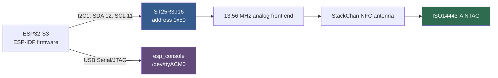
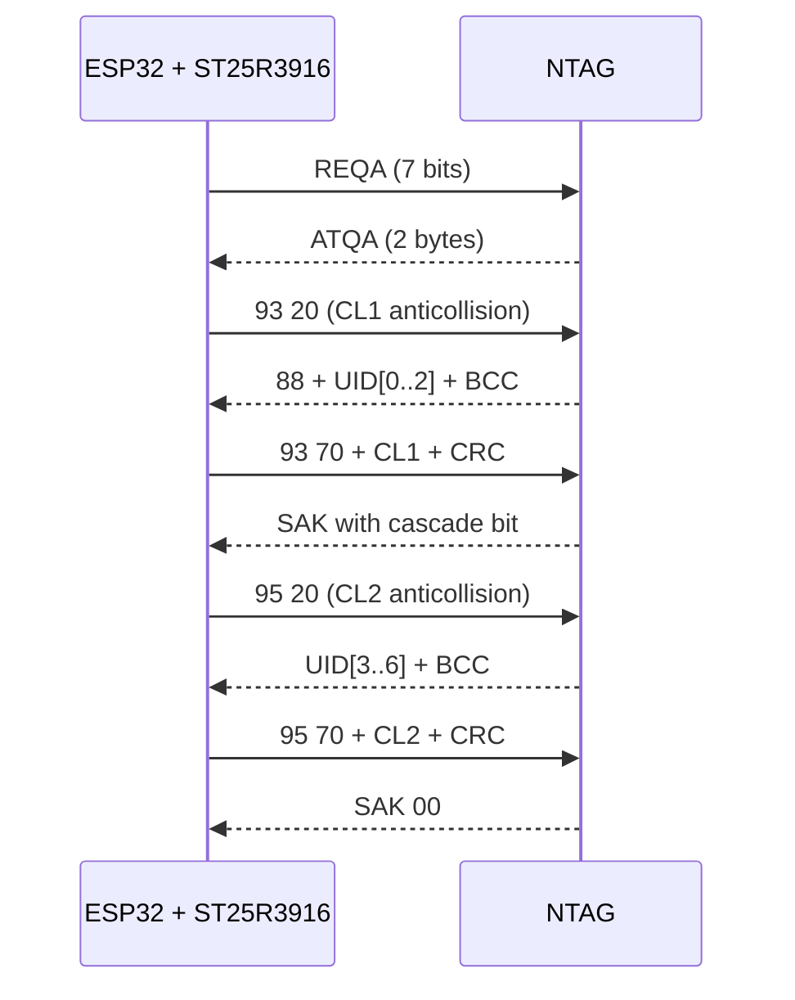
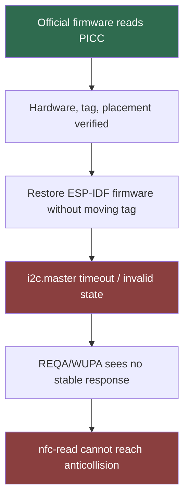

# M5StackChan NFC: Porting the ST25R3916 Reader to ESP-IDF

The M5StackChan includes an ST25R3916 NFC reader connected to the ESP32-S3 over I2C. M5’s supported reader example is written for Arduino and uses M5Unit-NFC, while the main StackChan firmware is built on ESP-IDF. This project set out to close that gap with a standalone ESP-IDF firmware that initializes the reader, polls ISO/IEC 14443-A tags, resolves a UID through anticollision, and exposes the process through an `esp_console` REPL over USB Serial/JTAG.

The implementation reached a useful but incomplete state. The ESP-IDF firmware builds, flashes, identifies the ST25R3916, configures its RF and NFC-A receive path, and exposes extensive diagnostics. The official Arduino `Detect.ino` successfully reads the same NTAG on the same device, proving that the hardware, tag, antenna, and physical placement work. The remaining failure is isolated to the ESP-IDF transport/runtime path: the new ESP-IDF I2C master driver intermittently reports transaction timeouts and corrupt register readback, and `nfc-read` has not yet returned the UID.

This report explains the system from the hardware and protocol foundations through the driver architecture, register-access rules, debugging evidence, invalid hypotheses, official-firmware bisect, and the next implementation step. It is written as a technical analysis rather than a success narrative. The unresolved behavior is part of the result.

> [!summary]
> - The standalone firmware lives at `/home/manuel/code/wesen/go-go-golems/esp32-s3-m5/0115-m5stackchan-nfc-reader` and targets ESP-IDF 5.5.4 on the ESP32-S3.
> - The ST25R3916 is present at I2C address `0x50`; identity, oscillator startup, antenna capacitance, Space-A configuration, and reader-critical Space-B configuration have all been verified through readback.
> - Official M5 photographs show that tags belong across the **literal narrow top edge of the StackChan head**, not against the front display and not on the robot body.
> - A correctly built official `Detect.ino` reads the NTAG and displays `PICC:<UID>`, proving the hardware path and placement.
> - The current ESP-IDF blocker is intermittent I2C failure (`I2C transaction timeout detected`, invalid-state errors, and occasional incorrect register values), not an unverified NFC tag or disconnected antenna.

## 1. Why this project exists

The factory StackChan firmware already uses ESP-IDF for the robot’s application framework, display, audio, camera, sensors, servos, and network stack. Its NFC examples, however, live in the separate Arduino StackChan BSP. That separation creates a practical problem for anyone who wants NFC inside the ESP-IDF firmware: the hardware is known to work, but its supported implementation brings Arduino framework assumptions, M5UnitUnified abstractions, and a large NFC stack.

Phase 1 deliberately avoids integrating NFC into Mooncake or LVGL. The immediate goal is a small firmware with a text interface. A successful console reader answers the most important questions before any UI work begins:

1. Can ESP-IDF communicate reliably with the ST25R3916 on the shared bus?
2. Can the firmware establish the RF field and receive an ISO14443-A response?
3. Can it execute REQA, anticollision, selection, and UID cascade handling?
4. Can each stage be observed independently when something fails?

The expected terminal result is intentionally compact:

```text
PICC: UID=04:34:56:78:9A:BC:DE ATQA=0044 SAK=00 type=MIFARE Ultralight/NTAG
```

The project is attached to docmgr ticket `ESP-60-M5STACKCHAN-NFC`. Its primary implementation and research artifacts are:

- firmware: `0115-m5stackchan-nfc-reader/`
- design guide: `ttmp/.../design-doc/01-esp-idf-st25r3916-nfc-reader-console-app-analysis-design-and-implementation-guide.md`
- implementation diary: `ttmp/.../reference/01-investigation-diary.md`
- debug handoff: `ttmp/.../reference/02-debug-handoff-st25r3916-antenna-coupling-failure.md`
- preserved vendor sources: `ttmp/.../sources/code/m5unit-nfc/`
- official placement evidence: `ttmp/.../sources/web/03-m5stack-stackchan-nfc-official-images.md`

This work extends the platform analysis in [[ARTICLE - M5StackChan - Deep Dive Technical Analysis of a Kawaii Desktop Robot Platform]] and follows the real-hardware discipline described in [[ARTICLE - M5StackChan - Building and Deploying a Custom App on Real Hardware]].

## 2. System boundary

### 2.1 Hardware path

The CoreS3 and StackChan body share an I2C bus on ESP32-S3 controller 1:

| Property | Value |
|---|---|
| I2C controller | `I2C_NUM_1` |
| SDA | GPIO12 |
| SCL | GPIO11 |
| Glitch-ignore count | 7 |
| Internal pull-ups | enabled |
| ST25R3916 address | `0x50` |
| Console | USB Serial/JTAG, normally `/dev/ttyACM0` |

The bus also contains the PMIC, touch controller, RTC, I/O expanders, body battery monitor, and touch devices. A scan from the standalone firmware has repeatedly detected the expected address map, including `0x50`.



The ST25R3916 is not a self-contained UID sensor. It is a configurable NFC analog front end and protocol accelerator. Firmware must configure its regulators, oscillator, transmitter, receiver, timers, interrupt masks, FIFO, modulation behavior, and NFC operating mode before issuing protocol commands.

### 2.2 Firmware path

The standalone application consists of three boundaries:

```text
app_main
  ├── initialize I2C master bus
  ├── initialize ST25R3916
  └── start USB Serial/JTAG esp_console
        │
        ├── nfc-scan / nfc-probe / nfc-regs
        ├── nfc-field / nfc-cap / nfc-dump
        └── nfc-read / nfc-poll / nfc-reqa
                │
                └── st25r3916 driver
                      ├── Space-A and Space-B register I/O
                      ├── direct commands and FIFO access
                      ├── RF/NFC-A initialization
                      └── REQA → anticollision → SELECT
```

The entry point is `main/nfc_reader_main.c`. Console registration lives in `main/nfc_console.c`. The driver and register definitions live under `main/st25r3916/`.

This structure keeps protocol code independent from command parsing. It also permits later integration into a Mooncake app without preserving the REPL.

## 3. ISO14443-A discovery and UID selection

A passive ISO14443-A tag does not send a UID immediately. The reader performs a defined sequence.

### 3.1 Request and answer

The reader transmits either:

- **REQA** (`0x26`, seven data bits) to request tags in the IDLE state, or
- **WUPA** (`0x52`, seven data bits) to include tags in the HALT state.

The ST25R3916 provides direct commands for these frames: `CMD_TRANSMIT_REQA` and `CMD_TRANSMIT_WUPA`. A tag answers with a two-byte ATQA value. NTAG-family devices commonly report `ATQA=0x0044`, indicating a double-size UID path.

The receive flow is:

```text
configure 4 ms no-response timer
set ISO14443-A anticollision mode
allow receive without CRC
clear interrupt state
clear FIFO
issue TRANSMIT_REQA
wait for RXS / RXE / COL
read two FIFO bytes as ATQA
```

The distinction between host timeout and chip timeout matters. The firmware can poll interrupt registers for 50 ms, but the ST25R3916’s own No-Response Timer defines how long its receive path remains active for the exchange.

### 3.2 Anticollision cascade

The UID can be 4, 7, or 10 bytes. Anticollision processes it in four-byte cascade blocks:

| Cascade level | Select byte | Typical role |
|---|---:|---|
| CL1 | `0x93` | complete 4-byte UID or first part of longer UID |
| CL2 | `0x95` | second part of 7- or 10-byte UID |
| CL3 | `0x97` | final part of a 10-byte UID |

Each level begins with `SEL, NVB=0x20`. The tag returns four bytes plus BCC. For longer UIDs, the first returned byte is the cascade tag `0x88`; it is not part of the UID. The reader then sends `SEL, NVB=0x70`, the returned bytes, BCC, and CRC. The SAK response indicates whether another cascade level is required.



The Phase-1 output type is provisional. A SAK of `0x00` is reported as MIFARE Ultralight/NTAG, but exact product identification requires additional commands.

## 4. ST25R3916 I2C protocol

### 4.1 Space-A register access

Normal registers occupy Space A. I2C access encodes operation bits in the command byte:

```c
read_command  = (reg & 0x3F) | 0x40;
write_command = (reg & 0x3F) | 0x00;
```

A register read performs a write of the command byte followed by a repeated-start read. A register write transmits the command byte and value.

```c
static esp_err_t rd8(uint8_t reg, uint8_t *out)
{
    uint8_t cmd = (reg & 0x3F) | 0x40;
    return i2c_master_transmit_receive(dev, &cmd, 1, out, 1, timeout);
}
```

### 4.2 Space-B register access

Reader-critical analog configuration exists in Space B. It requires the `0xFB` prefix followed by a normal Space-B register command.

```text
Space-B write: FB <register> <value>
Space-B read:  FB <register | 40>, repeated-start read 1
```

The port initially preserved only Space-A constants. That omission mattered because M5’s `configure_nfc_a()` programs overshoot protection, undershoot protection, and correlator behavior in Space B.

### 4.3 Direct commands

Direct commands are single-byte operations such as:

| Command | Value | Purpose |
|---|---:|---|
| SET_DEFAULT | `0xC1` | reset configuration registers |
| STOP_ALL_ACTIVITIES | `0xC2` | stop current RF/protocol activity |
| TRANSMIT_WITH_CRC | `0xC4` | send FIFO frame with CRC |
| TRANSMIT_WITHOUT_CRC | `0xC5` | send FIFO frame without CRC |
| TRANSMIT_REQA | `0xC6` | issue ISO14443-A REQA |
| TRANSMIT_WUPA | `0xC7` | issue ISO14443-A WUPA |
| NFC_INITIAL_FIELD_ON | `0xC8` | perform initial field-on sequence |
| RESET_RX_GAIN | `0xD5` | restart receiver gain adaptation |
| ADJUST_REGULATORS | `0xD6` | calibrate internal regulators |
| CLEAR_FIFO | `0xDB` | clear FIFO state |
| REGISTER_SPACE_B_ACCESS | `0xFB` | prefix Space-B access |
| TEST_ACCESS | `0xFC` | access test/protection register |

The M5 initialization also sends the three-byte frame `FC 04 10` after SET_DEFAULT. Its documented purpose is preventing internal overheat protection from triggering below the intended junction temperature.

### 4.4 FIFO representation

FIFO status is a two-register value. M5 reads it as a big-endian word:

```text
s = reg0x1E << 8 | reg0x1F
bytes = (s >> 8) | ((s & 0x00C0) << 2)
```

Therefore:

```c
bytes = status1 | ((status2 & 0xC0) << 2);
```

An earlier implementation reversed these registers. That bug remained invisible while no receive event occurred. Once NRT was configured and RXE appeared, the driver reported an empty FIFO because it decoded the status incorrectly.

## 5. Correct initialization sequence

The decisive source was not the header alone. It was the combination of:

- `unit_ST25R3916.cpp::begin()`
- `unit_ST25R3916_nfca.cpp::configure_nfc_a()`
- `unit_ST25R3916_nfca.cpp::nfca_request_wakeup()`
- `unit_ST25R3916_util.cpp::calculate_nrt()`
- `nfc_layer_a.cpp::detect()`

Exact snapshots from M5Unit-NFC commit `93745b547364f310cd64b5155a870103a7800a5d` are preserved in the ticket.

### 5.1 Global initialization

The corrected ESP-IDF initialization now follows this sequence:

```text
wait 50 ms for power stabilization
retry chip identity up to five times
STOP_ALL_ACTIVITIES
clear TX/RX enable bits
SET_DEFAULT
send TEST_ACCESS 04 10
write IO configuration
write transmitter and analog setup
set field thresholds and antenna tuning
clear FIFO
mask/clear interrupts
start oscillator and wait for I_osc
unmask interrupts
adjust regulators and wait 5 ms
configure NFC-A reader mode
```

### 5.2 I/O configuration correction

One of the most consequential mistakes was register packing. M5 forms a 16-bit configuration with I/O Configuration 1 as the most significant byte and I/O Configuration 2 as the least significant byte.

At M5’s 400 kHz setting, the final values are:

| Register | Correct M5 value | Meaning |
|---|---:|---|
| IO_CONFIG_1 | `0x17` | `i2c_thd0` plus MCU clock disabled |
| IO_CONFIG_2 | `0xA4` | 3.3 V supply, AAT enabled, I/O drive level |

The early port wrote `0x8B/0x30`. Those values assigned fields to the wrong registers. This invalidated the claim that initialization matched M5 byte-for-byte and may contribute to transport and analog instability.

A later controlled experiment was prepared to run the ESP-IDF `i2c_master` backend at 100 kHz with `IO_CONFIG_1=0x07`, removing the high-speed threshold bit. That experiment had not been built or validated when this report was written and is not treated as evidence.

### 5.3 Reader analog configuration

M5’s NFC-A configuration includes Space-B values that the minimal port originally omitted:

| Configuration | Space | Register | Value |
|---|---|---:|---:|
| EMD suppression | B | `0x05` | `0x40` |
| Correlator 1 | B | `0x0C` | `0x47` |
| Correlator 2 | B | `0x0D` | `0x00` |
| Overshoot protection 1 | B | `0x30` | `0x40` |
| Overshoot protection 2 | B | `0x31` | `0x03` |
| Undershoot protection 1 | B | `0x32` | `0x40` |
| Undershoot protection 2 | B | `0x33` | `0x03` |

The final live readback proved these writes reached the chip:

```text
SpaceB: OS=40/03 US=40/03 CORR=47/00 EMD=40
```

Other verified values include:

```text
MODE=09          NFC-A initiator with automatic response handling
RX1=08
RX2=2D
RX3=D8
RX4=22
ANT1=82
ANT2=82
TXD=D0
NFCIP1_FDT=50
PASSIVE_TARGET_MOD=5F
```

The important methodological point is that successful I2C function returns were not accepted as proof. The values were read back from both register spaces.

## 6. Frame-wait timing

M5 configures the No-Response Timer immediately before NFC-A exchanges:

- 4 ms for REQA/WUPA
- 8 ms for anticollision

The timer tick depends on `TIMER_AND_EMV_CONTROL.nrt_step`:

- `0`: 64 carrier cycles
- `1`: 4096 carrier cycles

With a 13.56 MHz carrier and `nrt_step=0`, the integer calculation is:

```text
NRT = ceil(timeout_us × 13,560,000 / 64,000,000)
```

For 4 ms:

```text
ceil(4000 × 13,560,000 / 64,000,000) = 848 = 0x0350
```

For 8 ms:

```text
ceil(8000 × 13,560,000 / 64,000,000) = 1695 = 0x069F
```

The driver writes NRT big-endian: register `0x10` receives the most significant byte and `0x11` the least significant byte.

After this change, the reader produced its first reproducible nonzero receive interrupts while the tag was moving:

```text
reqa: irq=000034 fifo=0 rxs=1 rxe=1 col=1
```

`0x34` combines:

- `0x20`: receive start
- `0x10`: receive end
- `0x04`: collision

This proved that the receiver could observe tag-induced modulation under some positions. It did not prove that a valid ATQA had been decoded. The FIFO remained empty, and later controlled tests showed that the events occurred only with the tag present and moving.

## 7. Console-first diagnostics

The REPL has grown beyond the five commands needed for the final application because each diagnostic isolates a different failure boundary.

| Command | Boundary tested |
|---|---|
| `nfc-scan` | physical I2C bus and address map |
| `nfc-probe` | ST25R identity register |
| `nfc-field on/off` | field command path |
| `nfc-read` | one complete NFC-A poll |
| `nfc-poll` | repeated insertion/removal behavior |
| `nfc-regs` | key Space-A/Space-B readback |
| `nfc-dump` | complete Space-A state |
| `nfc-cap` | antenna capacitance measurement |
| `nfc-reqa` | repeated raw REQA/WUPA observations |
| `nfc-sweep` | RF amplitude experiment |

A useful diagnostic progression is:

```text
nfc-scan
  ↓ confirms 0x50
nfc-probe
  ↓ confirms type 0x05, revision 0x02
nfc-regs
  ↓ confirms initialization
nfc-cap
  ↓ confirms stable antenna capacitance
nfc-read
  ↓ tests protocol sequence
raw IRQ/FIFO/error snapshot
  ↓ localizes receive failure
```

This progression prevents protocol debugging when the actual failure is bus access or configuration.

## 8. Physical placement: what “top” means

Physical placement consumed substantial debugging time because “top sensing surface” was interpreted incorrectly twice.

The initial assumptions were:

1. the reader IC is associated with the body, so the coil must be on the body;
2. after that was disproved, “top of the head” meant the front display area.

The official M5 Quick Scan photographs show the actual supported position. Cards rest horizontally across the **literal narrow upper edge of the head**, perpendicular to the display. The front glass is not the demonstrated sensing surface.

```text
Side view:

        NFC tag/card
    ───────────────────
       literal top edge
      ┌──────────────┐
      │              │
      │ front display│
      │              │
      └──────────────┘
```

The distinction was verified operationally. The official `Detect.ino`, correctly built, displayed `PICC:<UID>` with the tag in this position. That result is stronger than a textual placement description because it combines position, tag, hardware, and vendor firmware in one test.

The reusable rule is direct: when vendor documentation includes a physical demonstration, preserve and inspect the image. Do not infer the antenna location from the controller IC’s logical bus location.

## 9. The official Arduino bisect

### 9.1 Why the bisect was necessary

Register dumps can show that software state resembles a reference implementation, but they cannot prove that every runtime interaction is equivalent. The official firmware provides a system-level control:

```text
same StackChan
same ST25R3916
same antenna
same tag
same physical position
vendor implementation instead of ESP-IDF port
```

If the official firmware failed, the investigation would return to placement, tag health, antenna hardware, or board-specific analog behavior. If it succeeded, the remaining defect would belong to the ESP-IDF port or its environment.

### 9.2 Reproducing the official build

The checked-out sources were:

- StackChan-BSP commit `f7ed40e6f5d9a1d08440cb926f3a0865b81882f8`
- M5Unit-NFC commit `93745b547364f310cd64b5155a870103a7800a5d`

The current BSP could not be built validly with PlatformIO’s older official ESP32 platform. It required:

- PIOArduino platform `55.03.311`
- Arduino-ESP32 `3.3.11`
- ESP-IDF libraries `5.5.5`
- PlatformIO Core `6.1.19`
- C++17

Several build failures were informative:

```text
deduced return type only available with -std=c++14
UART_SCLK_DEFAULT was not declared
platform depends on PlatformIO Core >=6.1.19
fatal error: Wire.h: No such file or directory
```

The Wire failure was a dependency-visibility problem. M5UnitUnified checks for `<utility/I2C_Class.hpp>`, which exists in M5Unified, but its PlatformIO manifest does not declare M5Unified as a dependency. Without an explicit M5Unified include path, it compiled a deliberate stub:

```text
Not support I2C_Class
```

The sketch then displayed a red screen because `Units.add(...)` or `Units.begin()` failed. That first red-screen result was an invalid bisect: the official NFC logic was not running against a functional I2C adapter.

After exposing the M5Unified include path, the build reported:

```text
Support I2C_Class
```

The corrected official firmware flashed successfully. With the NTAG on the literal top edge, the screen displayed `PICC:<UID> ...`.

### 9.3 What the successful result proves

The corrected official result establishes all of the following:

- the ST25R3916 chip is operational;
- the antenna and matching network can power and receive from the tag;
- the NTAG supports the expected ISO14443-A request path;
- the physical tag position is correct;
- the M5 register-level implementation works on this device;
- the ESP-IDF port’s remaining failure is software or transport behavior.

It does not identify the exact ESP-IDF defect. It narrows the failure domain.

## 10. Current blocker: ESP-IDF I2C reliability

After the official firmware displayed the PICC, the latest ESP-IDF firmware was restored without moving the tag. Its first read produced:

```text
E (...) i2c.master: I2C transaction timeout detected
read error: ESP_ERR_INVALID_STATE
```

Other attempts have produced impossible or transient register values:

```text
OPC=FF
OPC=00
ANT1=00
TXD=00
RX1=00
SpaceB OS=40/00
TEMV=42
```

Stable reads before and after these anomalies return the intended values. This pattern indicates transaction-level instability rather than persistent register reconfiguration.

The current failure chain is:



The ESP-IDF application uses the same bus constructor as the main StackChan firmware:

```c
.i2c_port          = I2C_NUM_1,
.sda_io_num        = GPIO_NUM_12,
.scl_io_num        = GPIO_NUM_11,
.clk_source        = I2C_CLK_SRC_DEFAULT,
.glitch_ignore_cnt = 7,
.flags.enable_internal_pullup = 1,
```

The device handle was configured at 400 kHz, matching the nominal M5Unit-NFC component clock. The transport implementations differ:

- official Arduino path: M5 `I2C_Class`, using explicit start/restart/read/write/stop operations;
- ESP-IDF path: new `driver/i2c_master.h`, using `i2c_master_transmit()` and `i2c_master_transmit_receive()`.

The next controlled experiment is a 100 kHz ESP-IDF device clock with the corresponding ST25R threshold configuration (`IO_CONFIG_1=0x07`). Its purpose is to determine whether the new driver’s timing on this loaded bus is the remaining source of timeouts. That experiment must be built, flashed, and measured before it is accepted.

A second useful experiment is replacing generic repeated-start operations with an explicit transaction sequence that matches M5 `I2C_Class` more closely, while retaining the ESP-IDF framework. Bus recovery and retry behavior should also be logged rather than hidden behind zero-valued diagnostics.

## 11. Failure analysis: claims that had to be withdrawn

This project contains several examples of conclusions that were stronger than the evidence.

### 11.1 “The antenna is on the body”

This was inferred from the NFC controller’s association with body peripherals. Official product images disproved it.

### 11.2 “The antenna is over the display”

This was a second interpretation of “top sensing surface.” The official photo shows the literal upper edge.

### 11.3 “Amplitude zero means the antenna is dead”

The amplitude command measures received signal conditions; zero without a useful reflected/load-modulated signal is not proof that the transmitter or antenna is disconnected. The stable capacitance measurement (`cap≈124`) was better evidence that the antenna path exists.

### 11.4 “Every initialization register matches M5”

The original comparison focused on a subset of Space-A values and headers. Full `.cpp` review later found:

- incorrect IO register packing;
- missing test-access protection command;
- missing NFCIP FDT and passive-target defaults;
- missing Space-B EMD settings;
- missing overshoot and undershoot protection;
- missing correlator configuration.

A register match claim must identify the complete set being compared and include both register spaces.

### 11.5 “The tag is the remaining variable”

The tag label identified it as an ISO14443-A NTAG213/215/216-class product. More decisively, official firmware read it. The tag was not the remaining variable.

### 11.6 “The official red screen means M5 also fails”

The first official build had compiled M5UnitUnified’s unsupported I2C stub due to PlatformIO include isolation. The red screen reported initialization failure in an invalid build environment. Only after the log changed from `Not support I2C_Class` to `Support I2C_Class` did the official result become meaningful.

These corrections are not incidental history. They define the review standard for the remaining work: distinguish a plausible explanation from a controlled result.

## 12. A disciplined embedded-debugging method

The debugging process can be expressed as a sequence of evidence gates.

### Gate 1: establish transport identity

Require:

- target address appears in a bus scan;
- identity register returns the expected chip type and revision;
- repeated reads remain stable.

A single successful read is not sufficient if later diagnostics show `0x00` or `0xFF` intermittently.

### Gate 2: prove initialization through readback

Read back:

- I/O configuration;
- operation and mode registers;
- transmitter and antenna settings;
- receiver settings;
- timer values;
- Space-B receive path settings.

Do not infer Space-B success from Space-A state.

### Gate 3: isolate RF hardware from protocol decoding

Use independent measurements:

- antenna capacitance for physical antenna-path evidence;
- field and operation-control state;
- raw receive interrupts;
- FIFO status and error registers.

Do not treat any one diagnostic as a complete RF proof.

### Gate 4: control the physical test

Specify:

- tag protocol and known-good status;
- exact position and orientation;
- number of tags present;
- nearby cards and phones;
- whether firmware was reflashed or reset between tests.

The no-tag baseline in this project produced 117 REQA/WUPA samples with zero nonzero receive interrupts. Moving the tag produced `0x34` events. That comparison showed that the receiver events were tag-induced even though they were not valid frames.

### Gate 5: run the vendor implementation

The vendor bisect must itself be valid:

- correct board profile;
- compatible framework version;
- correct dependencies;
- no stubbed backend;
- observable success criterion.

A binary that builds is not necessarily executing the intended implementation.

### Gate 6: change one subsystem at a time

The next transport experiment changes clock and the corresponding ST25R threshold bit together because those two settings form one electrical contract. It should not also change NFC-A receiver gain, timeout, or protocol behavior.

## 13. Implementation review and known code debt

The firmware is a productive debugging vehicle, but it is not ready to be treated as a reusable component without cleanup.

### 13.1 Error propagation

Several initialization writes historically ignored return values. Recent corrections check critical operations, but the driver should consistently propagate transport errors and report the operation and register that failed.

A useful interface would preserve context:

```c
typedef struct {
    esp_err_t transport_error;
    uint8_t operation;
    uint8_t reg;
    uint8_t attempt;
} st25r_error_context_t;
```

Diagnostics should not print an initialized zero after a failed read as though zero came from the chip.

### 13.2 Bus recovery and retries

Identity detection retries at startup, but ordinary reads and writes do not implement bounded retry or bus recovery. Because the observed failure is intermittent, retries must be explicit and instrumented:

```text
attempt operation
if success: return
if timeout: record timeout, recover bus, retry once
if second failure: return original context
```

Retries must not conceal persistent signal-integrity problems. Counters should remain visible in `nfc-regs`.

### 13.3 Interrupt representation

The current driver polls IRQ registers. M5Unit-NFC can use an interrupt GPIO, but this StackChan integration has not established an IRQ pin in the ESP-IDF firmware. Polling is sufficient for Phase 1 if transaction latency remains below the NFC timing windows, but transport timeouts make the polling design more sensitive.

The reader should preserve:

- Main IRQ;
- Timer/NFC IRQ;
- Error/Wakeup IRQ;
- raw FIFO status;
- collision display.

The order matters because reading Main can clear related error state.

### 13.4 Anticollision completeness

The Phase-1 anticollision function assumes a single tag and originally returned immediately on collision. M5’s implementation resolves collisions by reading the collision position, selecting a branch bit, updating NVB, and continuing. The official example can enumerate multiple PICCs.

A robust component should eventually port that loop. It is not the current blocker because ESP-IDF has not yet obtained a valid ATQA at the verified tag position.

### 13.5 Stale comments and command help

Some comments still reflect superseded behavior—for example, WUPA documentation that says it stops all activities and field-cycles, and console help that says “sweep tag over body.” These should be corrected after transport validation so the source no longer preserves known-wrong physical instructions.

## 14. Reproduction commands

### ESP-IDF firmware

```bash
cd /home/manuel/code/wesen/go-go-golems/esp32-s3-m5/0115-m5stackchan-nfc-reader
source ~/esp/esp-idf-5.5.4/export.sh
idf.py build
idf.py -p /dev/ttyACM0 flash
```

The interactive REPL uses USB Serial/JTAG. In a non-TTY agent environment, pyserial can send commands directly:

```python
import serial, time

s = serial.Serial('/dev/ttyACM0', 115200, timeout=0.2)
time.sleep(3)
s.write(b'nfc-regs\n')
time.sleep(1)
s.write(b'nfc-read\n')
time.sleep(2)
print(s.read(16384).decode('utf-8', 'replace'))
s.close()
```

Serial ownership is single-process. Do not run `idf.py monitor`, a custom pyserial script, and a flasher concurrently against the same device.

### Official firmware bisect

The successful temporary build used an isolated PlatformIO project with local symlinks to the preserved repositories and a pinned modern platform. The important environment facts were:

```text
board: m5stack-cores3
platform: pioarduino 55.03.311
Arduino-ESP32: 3.3.11
IDF libraries: 5.5.5
C++ standard: gnu++17
PlatformIO Core: 6.1.19
```

The build had to expose both framework Wire headers and M5Unified headers so M5UnitUnified compiled its real `I2C_Class` adapter. The compile log must contain:

```text
Support I2C_Class
```

A build containing `Not support I2C_Class` is not a valid bisect and produces the red initialization screen.

## 15. Current status and next steps

### Completed

- Standalone ESP-IDF project structure and USB console.
- I2C scanning and ST25R identity probe.
- Space-A and Space-B access.
- Oscillator and regulator startup.
- NFC-A mode, receiver, transmitter, antenna, and correlator configuration.
- Frame-wait timer calculation and writeback.
- FIFO operation and corrected status-byte order.
- REQA, WUPA, single-tag anticollision, selection, and UID cascade scaffolding.
- Raw IRQ, FIFO, collision, timer, error, capacitance, and register diagnostics.
- Official placement evidence preserved locally.
- Official `Detect.ino` build and successful PICC detection on the same hardware/tag.

### Not complete

- `nfc-read` has not returned a UID under ESP-IDF.
- I2C transactions are not stable under the current ESP-IDF new-driver configuration.
- Anticollision has not been exercised end-to-end with a valid ESP-IDF ATQA.
- The prepared 100 kHz experiment has not been validated.
- No Mooncake/LVGL integration should begin until console UID reading is reliable.

### Recommended next sequence

1. Build and flash the 100 kHz transport experiment with the matching `IO_CONFIG_1=0x07`.
2. Keep the NTAG in the exact position proven by official firmware.
3. Run repeated identity and configuration reads before issuing any NFC command; quantify timeout and corruption rates.
4. If transport stabilizes, run `nfc-read` and inspect ATQA/FIFO evidence.
5. If 100 kHz still fails, implement explicit M5-like start/restart/read/write/stop transactions or test the ESP-IDF legacy I2C backend in a controlled branch.
6. Add bounded, observable bus recovery.
7. Once ATQA is stable, validate CL1/CL2 selection for the seven-byte NTAG UID.
8. Correct stale comments and help strings.
9. Only then integrate the component into a Mooncake application with LVGL UID display.

## 16. Working rules retained from the project

> [!important]
> A register-level driver is not verified because it builds, because the target acknowledges its address, or because a subset of register values looks plausible. Verification requires stable transport, complete initialization readback, a controlled physical test, and comparison against a valid vendor implementation.

The key points to retain are:

- Read implementation files, not only headers and examples. The reader-critical Space-B configuration was present in `.cpp` code that the first analysis did not preserve.
- Treat physical placement as a measured variable. “Top” was insufficient until official photographs and a successful vendor test established the exact surface.
- Preserve vendor artifacts with commit provenance. Mutable online code and temporary clones are poor long-term references.
- Separate chip timers from host polling timeouts. They control different state transitions.
- Read interrupt registers in the documented order. Read-to-clear behavior can destroy the evidence needed for diagnosis.
- Reject invalid bisects. The first red-screen official build used an I2C stub and did not test the NFC implementation.
- Report unfinished results directly. The project has proven the hardware and isolated an I2C transport failure, but Phase 1 remains incomplete until ESP-IDF prints the UID.

## References

### Local implementation

- `/home/manuel/code/wesen/go-go-golems/esp32-s3-m5/0115-m5stackchan-nfc-reader/main/nfc_reader_main.c`
- `/home/manuel/code/wesen/go-go-golems/esp32-s3-m5/0115-m5stackchan-nfc-reader/main/nfc_console.c`
- `/home/manuel/code/wesen/go-go-golems/esp32-s3-m5/0115-m5stackchan-nfc-reader/main/st25r3916/st25r3916.c`
- `/home/manuel/code/wesen/go-go-golems/esp32-s3-m5/0115-m5stackchan-nfc-reader/main/st25r3916/st25r3916.h`
- `/home/manuel/code/wesen/go-go-golems/esp32-s3-m5/0115-m5stackchan-nfc-reader/main/st25r3916/st25r3916_regs.h`

### Ticket documentation

- `ESP-60-M5STACKCHAN-NFC` design guide
- `reference/01-investigation-diary.md`, especially Steps 10–13
- `reference/02-debug-handoff-st25r3916-antenna-coupling-failure.md`
- `sources/code/m5unit-nfc/README.md`
- `sources/web/03-m5stack-stackchan-nfc-official-images.md`

### Upstream sources

- [M5 StackChan NFC documentation](https://docs.m5stack.com/en/arduino/stackchan/nfc)
- [M5Unit-NFC](https://github.com/m5stack/M5Unit-NFC)
- [StackChan-BSP](https://github.com/m5stack/StackChan-BSP)
- [ST25R3916B datasheet](https://www.st.com/resource/en/datasheet/st25r3916b.pdf)

### Related vault notes

- [[ARTICLE - M5StackChan - Deep Dive Technical Analysis of a Kawaii Desktop Robot Platform]]
- [[ARTICLE - M5StackChan - Building and Deploying a Custom App on Real Hardware]]
- [[ARTICLE - M5StackChan - Measuring Draw Performance and Display Pipeline Limits]]
