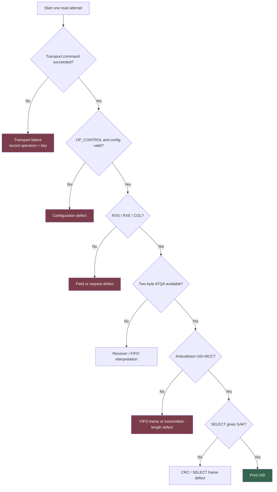

# M5StackChan NFC: Solving the Native ESP-IDF Reader from First Principles

The native ESP-IDF M5StackChan NFC reader now prints a real ISO/IEC 14443-A UID. The successful run used the same standalone firmware, the same ST25R3916 at I²C address `0x50`, the same top-edge antenna, and the same tag that the Arduino reference implementation had identified. Two ESP-IDF transport backends — the ordinary high-level master API and an explicit defined-operations backend — both returned the same UID with zero transport failures:

```text
idf-high:    UID=04:91:D4:4C:9E:61:80 ATQA=0044 SAK=00 failed=0/200
idf-defined: UID=04:91:D4:4C:9E:61:80 ATQA=0044 SAK=00 failed=0/439
```

The final result did not come from replacing ESP-IDF, copying the M5GFX controller backend, or suppressing errors with retries. It came from restarting the diagnosis at the protocol boundaries and finding three deterministic mistakes in the native port:

1. Field activation cleared `TX_EN|RX_EN` when the working M5 code set those bits.
2. Every poll reissued `CMD_NFC_INITIAL_FIELD_ON` even when the carrier was already active.
3. The two-byte `NUM_TX_BYTES` register pair was written in reversed byte order, so FIFO-based anticollision and SELECT frames used an invalid transmitted-bit count.

The intermittent I²C NACKs were real. They deserved instrumentation, comparison, and a refuted FSM-reset experiment. They were not the primary reason the firmware could not print a UID. The missing UID was caused by incorrect application-level ST25R3916 semantics.

> [!summary]
> - The Arduino control proved the current single tag, physical placement, antenna, and reader hardware were functional: WUPA returned `ATQA=0x0044`, one PICC was detected and identified, and more than 13,000 transactions completed without a transport error.
> - A same-firmware A/B harness showed that `idf-high` and explicit `idf-defined` operations behaved identically. Before the protocol fixes, both had zero transport failures and still failed to read a UID. This removed I²C framing from the active blocker.
> - Correcting field enable, making field activation idempotent, and writing `NUM_TX_BYTES_1/2` as MSB/LSB completed REQA, two UID cascade levels, SELECT, and SAK processing.
> - The resulting diagnostic collection remains part of the project: observer-safe traces, first-error bundles, backend switching, prompt-aware serial scripts, Arduino trace instrumentation, and source-normalized comparison tools.

## 1. The completed system

The ST25R3916 is a reader front end, not a UID register. Firmware must configure its regulator, oscillator, transmitter, receiver, modulation path, frame timers, interrupts, FIFO, and NFC protocol mode. It must then execute the ISO/IEC 14443-A sequence correctly.


The final standalone implementation is under:

```text
/home/manuel/code/wesen/go-go-golems/esp32-s3-m5/0115-m5stackchan-nfc-reader
```

The relevant files are:

```text
main/
├── nfc_reader_main.c                 I2C bus + USB Serial/JTAG console
├── nfc_console.c                     commands and backend selector
├── st25r3916/
│   ├── st25r3916.c                   transport + NFC-A implementation
│   ├── st25r3916.h
│   └── st25r3916_regs.h
└── st25r_trace/
    ├── st25r_trace.c                 observer-safe transaction ring
    └── st25r_trace.h
```

The shared body bus is ESP32-S3 I2C port 1, SDA GPIO12, SCL GPIO11. The console uses USB Serial/JTAG. The ST25R3916 antenna is the narrow top edge of the StackChan head. These hardware facts matter because a correct software exchange cannot compensate for wrong antenna placement or a conflicting UART console.

## 2. Why the earlier diagnosis became complicated

The first ESP-IDF implementation exhibited several conditions at once:

- `nfc-probe` often read the correct chip identity.
- register configuration gradually converged toward the Arduino values;
- REQA/WUPA often produced no RF IRQ;
- occasional I²C operations returned `ESP_ERR_INVALID_STATE`;
- the driver DEBUG log later proved those results were `I2C_EVENT_NACK`;
- four tags on the antenna produced an RF collision condition that the implementation did not support;
- the same `ESP_ERR_INVALID_STATE` value was also used by application code for collision.

This created a classification problem. An I²C NACK, an absent tag, a legal multi-tag collision, an empty FIFO, and a bad anticollision frame all appeared close together in the same high-level read operation. The initial investigation naturally concentrated on the transport anomaly because it had an explicit ESP-IDF error code and a measurable difference from M5GFX.

That concentration produced useful tools and eliminated several hypotheses, but it delayed a simpler inspection: whether the native port had reproduced the ST25R3916 field and transmitted-length semantics correctly.

The correction was not to ignore transport. It was to restore layer boundaries.

## 3. The layered diagnosis

The successful restart treated UID output as six independently testable layers.

| Layer | Question | Required evidence |
|---|---|---|
| I²C transport | Did register/direct/FIFO transactions complete? | raw API result, trace key, first-error neighborhood |
| Chip state | Are critical registers equal to the reference? | readback matrix, especially `OP_CONTROL`, MODE, receiver, NRT |
| RF request | Did REQA/WUPA cause any tag response? | RXS, RXE, COL, FIFO bytes, ATQA |
| Anticollision | Did SEL+NVB produce UID+BCC? | FIFO data, collision position, BCC validation |
| Selection | Did SELECT produce SAK and cascade state? | SAK + CRC, cascade bit |
| UID output | Were cascade-level bytes assembled correctly? | 4/7/10-byte UID, ATQA, SAK |



This model produced a strict investigation rule: do not infer a protocol defect if the request command was never transmitted, and do not infer a transport root cause if two transports fail identically with zero transport errors.

## 4. Building observer-safe evidence

Serial logging inside an I²C operation changes the timing being measured. The project therefore records transactions in RAM and emits them only after the NFC phase.

The trace event includes:

```c
typedef struct {
    uint32_t sequence;
    uint32_t timestamp_us;
    uint32_t elapsed_us;
    uint32_t gap_us;
    uint16_t write_len;
    uint16_t read_len;
    int32_t  api_result;
    uint8_t  backend;
    uint8_t  phase;
    uint8_t  attempt;
    uint8_t  kind;
    uint8_t  op;
    uint8_t  logical_key;
    uint8_t  wire_key;
    uint8_t  driver_hint;
    uint8_t  error_class;
    uint8_t  flags;
} st25r_trace_event_t;
```

The ring holds 512 events. On the first transport failure, it freezes:

- the 16 preceding transactions;
- the error event;
- the next 16 transactions.

That frozen bundle survives later ring overwrite. This matters because a failed IRQ read is usually followed by hundreds of successful polling reads. A last-error field would lose the causal neighborhood; an unbounded trace would consume too much RAM.

Representative trace output:

```text
I2C_TRACE seq=48 t_us=1157791 gap_us=12 elapsed_us=239
  backend=idf-high phase=irq-wait kind=WR op=READ_A
  logical=1C wire=5C wlen=1 rlen=1
  api=ESP_ERR_INVALID_STATE hint=UNKNOWN class=NOT_DONE_UNKNOWN
  flags=FIRST_ERROR
```

Driver DEBUG later classified the public `ESP_ERR_INVALID_STATE` as `I2C_EVENT_NACK`. No timeout log appeared in those runs. This was real transport evidence, even though it was not the root cause of the missing UID.

## 5. The Arduino control

The Arduino firmware was not treated as documentation alone. It was instrumented as a measured control.

The reference stack is:

```text
continuous monitor application
  └── NFCLayerA
        └── UnitST25R3916
              └── M5UnitUnified I2C adapter
                    └── M5Unified I2C_Class
                          └── M5GFX direct ESP32-S3 I2C backend
```

The tracer recorded logical transactions without printing from the hot path. A principal run reported 10,187 ST25R3916 events with zero API-level transport failures. A later control was run after three tags were removed, leaving the exact tag used for the final ESP-IDF test:

```text
M5_PHASE phase=init ok=1 elapsed_ms=122
  txns=335 succeeded=335 failed=0

M5_MULTI cycle=1
  woke=1 wake_atqa=0044
  detected=1 piccs=1 displayed=1 identified=1 seen=1
  txns=709 failed=0
```

The control did three jobs:

1. It proved the current physical arrangement, tag, field, and antenna were working.
2. It supplied exact register and transaction sequences for source comparison.
3. It prevented software changes from being excused by tag movement or stale hardware assumptions.

The temporary control workspace remains `/tmp/esp60-official-detect`. The persistent source copies and trace tools are stored under the ESP-60 ticket.

## 6. False lead: the I²C FSM-reset hypothesis

ESP-IDF and M5GFX manage the ESP32-S3 I²C controller differently. M5GFX resets and reinitializes the controller during every `beginTransaction`. ESP-IDF resets its command FSM reactively under timeout or bus-busy conditions. The ESP-IDF source even notes that a stuck FSM can produce repeated ACK errors.

This supported a testable hypothesis: an unconditional per-transaction `fsm_rst` would eliminate the NACKs.

A reproducible patch changed `s_i2c_transaction_start()` to call:

```c
s_i2c_hw_fsm_reset(i2c_master, false);
```

on every transaction. The patched object was disassembled to prove the call was unconditional and used `clear_bus=false`. The result refuted the hypothesis:

| Build | Failed / total | Failure rate | First failure phase |
|---|---:|---:|---|
| unconditional `fsm_rst` | 213 / 11,807 | 1.80% | field-on / request setup |
| reverted baseline | 144 / 12,274 | 1.17% | IRQ wait |

The patch made behavior worse and introduced failures into phases that had previously been clean. It was reverted; the patch and captures were retained as a negative-result artifact.

This experiment was still useful. It established that a bare FSM reset was not the missing semantic. It also demonstrated why hypotheses should be committed before measurement: a falsifiable prediction can be rejected without rewriting the evidence.

## 7. Deterministic defect one: receiver disabled after field-on

The first fresh four-tag run executed REQA and WUPA but produced no RXS, RXE, or COL IRQ. FIFO stayed empty. The critical register dump showed:

```text
OPC=8B MODE=09 ISO=00 AUX=00
```

`OPERATION_CONTROL=0x8B` has the oscillator (`0x80`), transmitter (`0x08`), and external field-detector bits (`0x03`) set, but receiver enable (`0x40`) is clear.

The working M5 code is explicit:

```cpp
writeDirectCommand(CMD_NFC_INITIAL_FIELD_ON);
delay(5);
return modify_bit_register8(
    REG_OPERATION_CONTROL,
    tx_en | rx_en,  // set mask
    0x00            // clear mask
);
```

The native port had implemented the opposite:

```c
return clear_bits(
    ST25R_REG_OPERATION_CONTROL,
    ST25R_OPCTRL_TX_EN | ST25R_OPCTRL_RX_EN
);
```

The local comment also claimed that M5 cleared these bits. Reading the helper implementation proved the comment wrong: `modify_bit_register8(set_mask, clear_mask)` computes

```c
(v & ~clear_mask) | set_mask
```

so M5 sets both bits.

After correction, the register became:

```text
OPC=CB
```

and the four-tag WUPA immediately produced:

```text
irq=000034 rxs=1 rxe=1 col=1
```

That before/after test established a direct causal relationship. The native path now generated an RF field, received tag responses, and observed collision.

## 8. Deterministic defect two: restarting a field that was already active

The first correction was necessary but not sufficient. RF responses remained intermittent across repeated calls. Source comparison found another lifecycle mismatch.

M5's `nfc_initial_field_on()` reads `OPERATION_CONTROL` first. If `tx_en` is already set, it does not issue `CMD_NFC_INITIAL_FIELD_ON` again. Field activation is an initialization transition, not an operation to repeat before every request.

The native `st25r3916_poll_nfca()` called field-on before every read. The earlier field-on helper always issued C8. That meant an already-active carrier was repeatedly subjected to initial-field-on collision avoidance and guard behavior.

The corrected field-on operation is idempotent:

```c
read OPERATION_CONTROL

if TX_EN and RX_EN are both set:
    return OK

if TX_EN is set but RX_EN is clear:
    set TX_EN | RX_EN
    return

issue CMD_NFC_INITIAL_FIELD_ON
wait 5 ms
set TX_EN | RX_EN
read back OPERATION_CONTROL
require both bits
```

After this correction, both ESP-IDF backends consistently crossed the request layer:

```text
idf-high REQA:
  irq=0x20 (RXS)
  FIFO=2
  fallback detects complete ATQA

idf-defined REQA:
  irq=0x30 (RXS|RXE)
  FIFO=2
```

The two-byte FIFO result was ATQA `0x0044`, matching Arduino. Anticollision still timed out. This isolated the remaining defect to FIFO-based transmit setup.

## 9. Same-firmware transport A/B

The project added a runtime-selectable transport layer so protocol code, register values, and physical state stayed constant while only bus framing changed.

### 9.1 `idf-high`

This backend uses:

```c
i2c_master_transmit(...)
i2c_master_transmit_receive(...)
```

with a normal addressed device handle.

### 9.2 `idf-defined`

This backend uses `i2c_master_execute_defined_operations()` on a device handle configured with `I2C_DEVICE_ADDRESS_NOT_USED`. It supplies explicit jobs:

```text
START
WRITE 0xA0 with ACK check
WRITE command payload with ACK check
REPEATED START
WRITE 0xA1 with ACK check
READ n-1 bytes with ACK
READ final byte with NACK
STOP
```

A console command switches backend and clears the trace epoch:

```text
nfc-backend idf-high
nfc-backend idf-defined
```

Another command applies the same NFC-A configuration through the selected backend:

```text
nfc-configure
```

The reusable script `scripts/11-compare-runtime-backends.py` runs both in one boot:

```text
select backend
configure NFC-A through that backend
verify registers
run reads
capture trace status and first error
switch backend
repeat
```

Before the final protocol fix:

| Backend | Transport failures | NFC result |
|---|---:|---|
| `idf-high` | 0 / 2,836 | ATQA available, anticollision timeout |
| `idf-defined` | 0 / 2,556 | ATQA available, anticollision timeout |

The A/B result was decisive. Explicit START/address/repeated-START/final-NACK/STOP framing did not change the failure. I²C transport was not the active blocker.

## 10. Deterministic defect three: transmitted-byte-count byte order

REQA and WUPA are ST25R3916 direct commands. They do not use the FIFO transmitted-length register pair. Anticollision and SELECT do:

```text
clear interrupts
clear FIFO
write frame to FIFO
write NUM_TX_BYTES_1/2
issue TRANSMIT_WITHOUT_CRC or TRANSMIT_WITH_CRC
wait for receive IRQ
```

This difference explains the observed boundary:

- request commands produced ATQA;
- every FIFO-based anticollision command timed out.

The native helper encoded the byte count correctly:

```c
value = ((bytes & 0x01FF) << 3) | (bits & 0x07);
```

It then wrote the two registers in the wrong order:

```c
// wrong
write 0x22 = value & 0xFF;
write 0x23 = value >> 8;
```

M5Unit-NFC documents the pair directly:

```text
REG_NUMBER_OF_TRANSMITTED_BYTES_1 (0x22) = MSB
REG_NUMBER_OF_TRANSMITTED_BYTES_2 (0x23) = LSB
```

For an anticollision frame containing two full bytes:

```text
encoded value = 2 << 3 = 0x0010
correct: 0x22=0x00, 0x23=0x10
wrong:   0x22=0x10, 0x23=0x00
```

The wrong value told the ST25R3916 to transmit an invalid length. REQA/WUPA continued to work because their direct commands generate fixed protocol frames. FIFO-based anticollision and SELECT could never produce a valid response.

The fix was small:

```c
write 0x22 = value >> 8;   // MSB
write 0x23 = value & 0xFF; // LSB
```

Its effect crossed the final two protocol layers immediately.

## 11. The successful exchange

With one tag, idempotent field state, and corrected transmitted length, the high-level backend produced:

```text
REQA:
  irq=RXS
  FIFO=2
  ATQA=0044

Anticollision CL1:
  SEL=93
  IRQ=RXE
  FIFO=5
  collision display=70
  UID fragment + BCC valid

SELECT CL1:
  SAK cascade bit set

Anticollision CL2:
  SEL=95
  IRQ=RXE
  FIFO=5
  UID fragment + BCC valid

SELECT CL2:
  SAK=00

PICC:
  UID=04:91:D4:4C:9E:61:80
  ATQA=0044
  SAK=00
  type=MIFARE Ultralight/NTAG
```

The trace summary was:

```text
TRACE_STATUS mode=all backend=idf-high
  recorded=200 failed=0 ring=200/512
  overwritten=0 first_error=none
```

The explicit-defined backend then produced the same UID:

```text
TRACE_STATUS mode=all backend=idf-def
  recorded=439 failed=0 ring=439/512
  overwritten=0 first_error=none
```

The higher transaction count reflects its request path using REQA then WUPA in that state and the expanded explicit operation flow. It does not indicate failure.

The successful UID uses two cascade levels. `0x88` cascade handling in CL1 is removed from the assembled UID, producing seven final bytes. SAK `0x00` indicates the cascade is complete and the selected PICC is in the Ultralight/NTAG family at this preliminary classification stage.

## 12. Collision handling and the four-tag setup

Four tags were initially present. The old port aborted on `ST25R_IRQ_COL` under a deliberate single-tag assumption. A bounded collision resolver was ported from M5Unit-NFC:

```text
known UID prefix = empty
NVB = 0x20
repeat at most 32 times:
    transmit SEL + NVB + known prefix without CRC
    wait for RXE or COL
    read partial FIFO and collision display
    if collision:
        choose branch bit 1
        extend known prefix
        update NVB
        retry
    else:
        require UID fragment + BCC
        break
```

The four-tag tests were useful because they proved RF reception after the field-enable correction. They were not a clean environment for finding the transmitted-length defect. The user removed three tags, which eliminated legitimate multi-PICC collision and exposed that a single-tag request could return ATQA while anticollision consistently timed out.

The collision resolver remains valuable for restoring multi-tag behavior later. The first completion milestone, however, is correctly satisfied with one known tag and zero transport failures.

## 13. The diagnostic toolkit left behind

The final project contains reusable facilities rather than one-off debugging output.

### 13.1 Console commands

```text
nfc-scan                       scan I²C bus
nfc-probe                      read ST25R3916 identity
nfc-configure                  apply NFC-A config via selected backend
nfc-field on|off               control field lifecycle
nfc-read --attempts N          read one PICC with observable attempts
nfc-poll                       continuous polling
nfc-regs                       critical register matrix
nfc-cap                        antenna capacitance measurement
nfc-sweep                      amplitude measurement
nfc-trace status               ring/counter summary
nfc-trace dump --last N        normalized transaction tail
nfc-trace first-error          frozen first-error neighborhood
nfc-trace mode off|failure|all trace policy
nfc-trace annotate nack        evidence-backed classification
nfc-backend idf-high           standard API backend
nfc-backend idf-defined        explicit operation backend
nfc-i2c-debug on|off           driver DEBUG NACK visibility
```

### 13.2 Ticket scripts

Under the ESP-60 ticket `scripts/` directory:

- `04-instrument-official-arduino-trace.py` instruments the official control.
- `05-analyze-arduino-trace.py` summarizes M5 traces.
- `06-probe-st25r-trace.py` exercises trace commands.
- `07-probe-i2c-driver-debug.py` confirms NACK vs timeout.
- `08-compare-arduino-espidf-traces.py` normalizes both trace formats.
- `09-probe-four-tag-layered.py` runs one prompt-aware layered attempt.
- `10-probe-field-state-and-read.py` records field/register state boundaries.
- `11-compare-runtime-backends.py` runs same-boot transport A/B.

These scripts enforce serial single ownership and prompt-aware command boundaries. They remain useful for future NFC LAB integration and for other stateful I²C peripherals.

## 14. Engineering lessons

### 14.1 Verify application semantics before replacing infrastructure

The I²C NACKs were observable and real. They were also a more complex target than the deterministic port defects. A source comparison of field enable and transmitted-length register order produced the UID without replacing the transport.

The rule is precise:

> When a control implementation works, compare the semantic state transitions and register representations before replacing the subsystem below them.

### 14.2 Read back state at layer boundaries

`ESP_OK` from a write means the controller accepted the transaction. It does not prove the peripheral is in the intended state. The useful checkpoints were:

- `OPERATION_CONTROL=0xCB` after field-on;
- FIFO byte count after REQA;
- ATQA after request;
- five UID+BCC bytes after anticollision;
- SAK after SELECT.

Each checkpoint made the next failure local.

### 14.3 Special commands can conceal generic-frame defects

REQA/WUPA worked while anticollision did not because the former are fixed ST25R3916 direct commands and the latter uses FIFO + transmitted-length registers. A partial protocol success does not validate shared lower-level helpers that the successful command bypasses.

### 14.4 Same-firmware A/B is stronger than unrelated binary comparison

Arduino remained necessary as the hardware and behavioral control. The decisive transport comparison was inside one native ESP-IDF binary. Backend switching held constant:

- register configuration;
- protocol implementation;
- field state;
- tag position;
- trace schema;
- serial session.

When both backends failed identically with zero transport errors, the investigation moved upward with confidence.

### 14.5 Negative experiments remain part of the result

The FSM-reset patch was wrong. Preserving it prevents the same plausible hypothesis from consuming another session. The evidence states exactly how it was applied, how the binary was verified, and how it worsened behavior.

### 14.6 Error identity must include the layer

`ESP_ERR_INVALID_STATE` alone was not enough. The project now records:

```text
backend + phase + operation + logical key + wire key + raw result + evidence class
```

The same numeric value can describe an I²C NACK or an application collision abort. Layer-qualified errors prevent that ambiguity.

## 15. Current status and next work

The standalone Phase 1 objective is achieved:

- native ESP-IDF controls the ST25R3916;
- a real UID is printed;
- ATQA and SAK are valid;
- standard and defined-operation backends both succeed;
- the successful attempts report zero transport failures.

Remaining work is integration and breadth, not proof of basic function:

1. Add readback verification for `NUM_TX_BYTES_1/2` and field state to prevent regression.
2. Re-test bounded anticollision with the four-tag stack.
3. Restore multi-tag detect/deactivate behavior comparable to the Arduino monitor.
4. Integrate the deterministic fixes and backend selector into NFC LAB.
5. Complete UI event-log/register-matrix and lifecycle endurance testing.
6. Retain the standalone project as the transport/protocol regression harness.

The board currently runs the successful native ESP-IDF standalone firmware with one tag on the antenna. Returning to Arduino or NFC LAB requires a full flash because their partition layouts differ.

## 16. Source and evidence map

Primary repository:

```text
/home/manuel/code/wesen/go-go-golems/esp32-s3-m5
```

Ticket workspace:

```text
ttmp/2026/08/20/ESP-60-M5STACKCHAN-NFC--esp-idf-st25r3916-nfc-reader-console-app-for-m5stackchan-intern-guide
```

Key analysis and evidence:

- `analysis/02-fresh-base-principles-reconstruction-of-the-esp-idf-st25r3916-failure.md`
- `sources/hardware/10-11-four-tag-field-enable.provenance.md`
- `sources/hardware/12-16-anticollision-and-single-tag-probes.provenance.md`
- `sources/hardware/17-20-side-by-side-and-uid-breakthrough.provenance.md`
- `sources/hardware/18-arduino-single-tag-current-placement.txt`
- `sources/hardware/20-tx-length-fix-high-vs-defined-one-tag.txt`
- `reference/01-investigation-diary.md`

Related vault notes:

- [[ARTICLE - M5StackChan NFC - From Arduino Reference Firmware to an ESP-IDF Diagnostic System]]
- [[ARTICLE - M5StackChan NFC - Porting the ST25R3916 Reader to ESP-IDF]]
- [[ARTICLE - M5StackChan NFC LAB - Building an On-Device NFC Diagnostic Firmware]]

The earlier articles preserve the state before completion. This note records the resolved native ESP-IDF path and the method that produced it.
