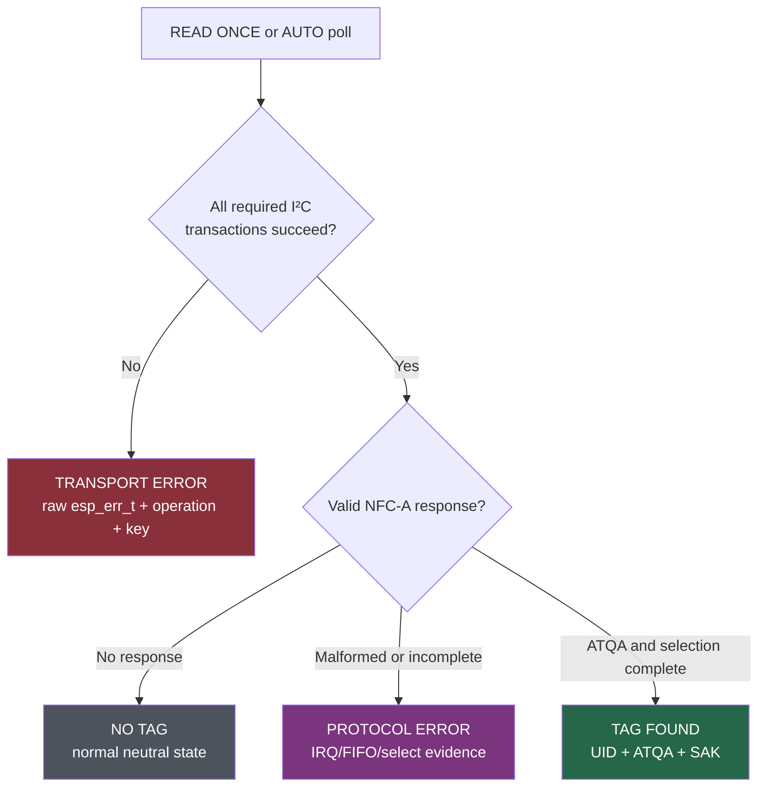
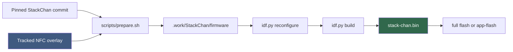
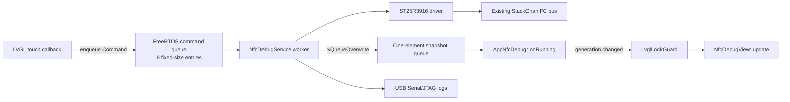

# M5StackChan NFC LAB: Building an On-Device NFC Diagnostic Firmware

The first M5StackChan NFC investigation produced a standalone ESP-IDF console firmware, a corrected ST25R3916 initialization sequence, and a controlled vendor comparison. It also established an unresolved result: official M5 Arduino firmware reads the tag on the same device, but the ESP-IDF implementation intermittently loses I²C transactions and has not produced a UID.

NFC LAB is the next stage of that work. It places the driver inside the production StackChan display, touch, and application runtime, then presents transport, RF, and protocol evidence on the 320×240 screen. It is not a success screen wrapped around an unfinished driver. It is a diagnostic firmware designed to show exactly which layer failed.

The application now runs on physical hardware. It boots directly into NFC LAB, exposes Reader, RF/IRQ, and Bus pages, and reports a rising error count during attempted tag reads. That behavior confirms the value of the architecture: the interface does not misreport transport failures as an absent tag. It also confirms that the NFC backend remains incomplete. The tag is known-good, the placement is known-good, and the official firmware reads it; the current ESP-IDF path does not.

> [!summary]
> - NFC LAB is a reproducible overlay on pinned StackChan commit `1b5765599fba8aaad1811d9a79358ccc7051f5f3`, built with ESP-IDF 5.5.4.
> - One FreeRTOS worker owns every ST25R3916 operation. Touch callbacks enqueue fixed-size commands, and the LVGL task consumes complete immutable snapshots.
> - The UI separates **NO TAG**, **TRANSPORT ERROR**, and **PROTOCOL ERROR**. A cumulative error counter reflects failed low-level I²C transactions, not ordinary no-tag polls.
> - The firmware reuses StackChan’s existing shared I²C bus and never creates a second controller for the NFC device.
> - An NFC-only composition removes all standard StackChan app implementations, boots directly into NFC LAB, and reduces the application image by approximately 613 KiB, or 16%.
> - Physical deployment succeeded, but tag recognition did not. A rising error count remains evidence of the known ESP-IDF transport instability, not evidence that the tag is unsupported.

## 1. The problem the UI must solve

A conventional NFC reader interface can show a prompt, a progress state, and a UID. That is sufficient only after the transport and protocol stack are reliable. This project is at an earlier stage. The ST25R3916 answers identity reads, accepts configuration, starts its oscillator, and sometimes returns the expected register values. The same runtime also produces timeouts, invalid-state errors, and transient register corruption.

A useful interface therefore has to preserve three independent questions:

1. Did the ESP32 complete the I²C transactions required for the operation?
2. Did the ST25R3916 observe an RF event and produce coherent FIFO/IRQ state?
3. Did the ISO14443-A exchange reach ATQA, anticollision, selection, and UID identification?

These questions define the user-visible state model. If I²C fails, the screen reports a transport error. If I²C completes but REQA receives no response, the screen reports no tag. If the chip receives a frame but selection fails, the screen reports a protocol error. A tag UID is shown only when the complete path succeeds.



The distinction is not cosmetic. The first physical run produced both `NO TAG` and `TRANSPORT ERROR` transitions while the cumulative transaction failure count increased. A UI that displayed only “No tag found” would have hidden the active blocker.

## 2. Two firmware projects, two responsibilities

The implementation deliberately keeps two ESP-IDF projects.

The standalone project at:

```text
/home/manuel/code/wesen/go-go-golems/esp32-s3-m5/0115-m5stackchan-nfc-reader
```

contains the smallest environment for driver work. It provides an `esp_console` REPL over USB Serial/JTAG and commands such as `nfc-probe`, `nfc-regs`, `nfc-read`, `nfc-reqa`, and `nfc-dump`. It remains the appropriate place to change I²C transaction semantics because display, touch, audio, and application tasks are absent.

The UI project at:

```text
/home/manuel/code/wesen/go-go-golems/esp32-s3-m5/0116-m5stackchan-nfc-debug-ui
```

integrates the same driver concepts into StackChan. It provides the actual CoreS3 display and capacitive touch environment, exposes counters while the operator changes physical tag placement, and tests the driver under production-like shared-bus load.

The UI project does not replace the standalone project. It adds operational visibility. Transport changes should first become reliable in the smaller firmware, then move into NFC LAB for user-facing validation.

For the complete register-level and vendor-bisect history, see [[ARTICLE - M5StackChan NFC - Porting the ST25R3916 Reader to ESP-IDF]].

## 3. Reproducibility through a pinned source overlay

The production StackChan firmware is an upstream project with hundreds of files and managed dependencies. Copying the entire repository into this monorepo would obscure provenance and make future updates difficult. Editing only a temporary clone would make the NFC work uncommitted and non-reproducible.

NFC LAB uses a third approach: a tracked overlay applied to an exact upstream revision.

```text
0116-m5stackchan-nfc-debug-ui/
├── upstream.env
├── README.md
├── overlay/
│   └── firmware/main/apps/app_nfc_debug/
│       ├── app_nfc_debug.h
│       ├── app_nfc_debug.cpp
│       ├── nfc_debug_service.h
│       ├── nfc_debug_service.cpp
│       ├── st25r3916/
│       └── view/
└── scripts/
    ├── prepare.sh
    ├── build.sh
    └── flash.sh
```

`upstream.env` pins StackChan commit `1b5765599fba8aaad1811d9a79358ccc7051f5f3`. `prepare.sh` creates or reuses a disposable checkout at `.work/StackChan`, hard-resets it to that commit, copies the overlay, and performs narrowly defined integration edits. The generated worktree is ignored by Git and can be deleted at any time.

The resulting pipeline is deterministic at the source-composition level:



The preparation script is also idempotent. Re-running it resets upstream files before applying the same changes. This property matters because UI implementation adds source files incrementally. A stale composed tree can otherwise hide missing integration steps.

### Why `idf.py reconfigure` is mandatory

Upstream StackChan collects application sources with `GLOB_RECURSE` but does not use `CONFIGURE_DEPENDS`. CMake therefore does not automatically discover a newly copied `.cpp` file in an existing build directory.

The first Reader-page build compiled but failed at link time with undefined `NfcDebugView` symbols. The source existed; the generated build graph did not include it. `scripts/build.sh` now runs:

```bash
idf.py reconfigure
idf.py build
```

This is part of the overlay contract, not an optional cleanup command.

## 4. Runtime architecture: one NFC owner

StackChan’s touch controller, PMIC, RTC, I/O expanders, and NFC controller share the board I²C environment. LVGL has its own task and locking rules. Mooncake invokes application lifecycle methods. A correct architecture must prevent three failure classes:

- an LVGL callback blocking on NFC I²C;
- multiple tasks issuing ST25R3916 operations concurrently;
- a worker changing LVGL objects without the display lock.

NFC LAB uses one service task as the sole NFC owner.



The application obtains the existing bus handle:

```cpp
const esp_err_t result =
    _service.start(hal_bridge::board_get_i2c_bus());
```

It does not call `i2c_new_master_bus()`. Creating another bus for the same controller and pins would violate ESP-IDF ownership rules and introduce a second unsynchronized path to shared hardware.

### 4.1 Commands are value objects

Every user action becomes a small command:

```cpp
enum class CommandType : uint8_t {
    ReadOnce,
    SetAutoPoll,
    Probe,
    VerifyRegisters,
    SampleIrqWindow,
    ClearCounters,
    ResetBus,
    SetField,
    Shutdown,
};

struct Command {
    CommandType type = CommandType::Probe;
    uint32_t argument = 0;
};
```

A touch callback only enqueues one of these values and returns. The READ callback is representative:

```cpp
void NfcDebugView::request_read()
{
    (void)_service.enqueue(Command{CommandType::ReadOnce, 0});
}
```

There is no driver pointer in the view, no I²C handle in the callback, and no LVGL lock around the NFC operation.

### 4.2 Snapshots are complete render inputs

The worker publishes a complete `Snapshot` through a one-element overwrite queue. The snapshot contains:

- reader, transport, and protocol states;
- UID, ATQA, SAK, and provisional card type;
- transaction counts and categorized failures;
- last error context;
- RF, IRQ, FIFO, RSSI, NRT, and capacitance values;
- register verification rows;
- long-running sample/verification progress.

The one-element queue intentionally retains only the newest state. Rendering every intermediate counter update would increase LVGL work without adding useful information. Serial logs preserve chronological transitions.

`AppNfcDebug::onRunning()` first checks the generation number, then acquires the LVGL lock:

```cpp
nfc_debug::Snapshot snapshot{};
if (!_service.latest(snapshot) ||
    snapshot.generation == _last_generation) {
    return;
}
_last_generation = snapshot.generation;

LvglLockGuard lock;
if (_view) _view->update(snapshot);
```

The ordering is important. No lock is taken when there is nothing to render, and no I²C transaction occurs while the lock is held.

## 5. Worker scheduling and lifecycle

The service owns two FreeRTOS queues and one 8 KiB worker task. It initializes the ST25R3916 once, then blocks on the command queue when no background operation is active.

```text
service start
  create command queue
  create one-element snapshot queue
  publish STARTING
  create worker
    initialize driver
    publish READY or TRANSPORT ERROR
    wait for command
```

When AUTO, sampling, or verification is active, the worker waits at most 20 ms so it can advance the background job. The AUTO interval is 333 ms, approximately 3 Hz. This is fast enough for insertion/removal feedback without creating a tight NFC loop.

Long operations are cooperative:

- A ten-second RF sample alternates REQA and WUPA every 200 ms.
- Register verification performs one 12-register pass per worker iteration.
- Shutdown is checked between these units of work.

A monolithic ten-second function would delay app closure and make watchdog diagnosis harder. Cooperative progress keeps the command path responsive while preserving single-owner access.

### Shutdown order

Mooncake applications can open and close repeatedly. The standalone driver originally assumed process-lifetime state, so UI integration required explicit teardown.

The shutdown sequence is:

```text
enqueue Shutdown
worker exits command loop
turn RF field off
remove ST25R3916 device handle from shared bus
publish STOPPED
clear worker task handle
caller deletes queues
view is destroyed under LvglLockGuard
```

`Service::stop()` waits up to two seconds for the worker. If the worker does not stop, it logs an error and deliberately leaves the resources allocated rather than deleting objects that the task may still access. This avoids a use-after-free, though the timeout policy needs further validation under repeated 100 ms I²C timeouts.

## 6. Instrumenting the actual transport boundary

Early service counters measured high-level commands. That was insufficient. One NFC poll performs many register reads, direct commands, and FIFO operations. A command may fail after ten successful transactions, and a diagnostic refresh may itself encounter the next failure.

UI-2 moved instrumentation to the two functions that invoke the ESP-IDF I²C API:

```c
static esp_err_t transport_write(
    st25r3916_transport_operation_t operation,
    uint8_t key,
    const uint8_t *data,
    size_t len)
{
    int64_t started = esp_timer_get_time();
    esp_err_t error =
        i2c_master_transmit(s_dev, data, len, I2C_TICKS);
    record_transport(operation, key, error, started);
    return error;
}

static esp_err_t transport_read(
    st25r3916_transport_operation_t operation,
    uint8_t key,
    const uint8_t *command,
    size_t command_len,
    uint8_t *data,
    size_t data_len)
{
    int64_t started = esp_timer_get_time();
    esp_err_t error = i2c_master_transmit_receive(
        s_dev, command, command_len,
        data, data_len, I2C_TICKS);
    record_transport(operation, key, error, started);
    return error;
}
```

Every Space-A read/write, Space-B read/write, direct command, and FIFO transfer crosses these wrappers. `record_transport()` captures:

| Field | Meaning |
|---|---|
| `total` | All attempted low-level I²C transactions |
| `succeeded` | Transactions that returned `ESP_OK` |
| `failed` | All non-OK transaction results |
| `timeouts` | `ESP_ERR_TIMEOUT` |
| `invalid_state` | `ESP_ERR_INVALID_STATE` |
| `other_errors` | Remaining error values |
| `last_operation` | Read A, Write A, Read B, Write B, direct command, FIFO read, or FIFO write |
| `last_key` | Register address or command byte |
| `last_error` | Raw `esp_err_t` |
| `last_elapsed_us` | Transaction duration |

This instrumentation explains the on-screen error count. `err:NNN` is the cumulative `failed` value modulo 1000. An ordinary no-tag result does not increment it unless an I²C operation also failed.

### Diagnostic reads count too

Reading operation-control, RSSI, and NRT registers is still I²C traffic. `refresh_driver_snapshot(true)` reads those values first and copies transport statistics afterward. The displayed totals therefore include the transactions required to collect the diagnostics.

This is the honest result, but it has an operational consequence: refreshing diagnostics can reveal or add transport failures. The counter is not limited to tag-protocol transactions.

## 7. Reader state classification

The service maps driver results to explicit reader states.

```cpp
if (result == ESP_ERR_NOT_FOUND) {
    _snapshot.no_tag_count++;
    _snapshot.reader_state = ReaderState::NoTag;
    _snapshot.transport_state =
        _snapshot.counters.failed == 0
            ? TransportState::Healthy
            : TransportState::Warning;
    return;
}

if (is_transport_error(result)) {
    _snapshot.reader_state = ReaderState::TransportError;
    _snapshot.transport_state = TransportState::Failed;
} else {
    _snapshot.reader_state = ReaderState::ProtocolError;
    _snapshot.transport_state = TransportState::Warning;
}
```

The classification currently recognizes timeout, invalid-state, and invalid-response results as transport errors. `ESP_ERR_NOT_FOUND` means the request path completed without finding a PICC. Other failures become protocol errors.

The transaction counters add a second dimension. A poll can return `ESP_ERR_NOT_FOUND` while earlier or diagnostic transactions have failed. In that case the Reader page says `NO TAG`, but the header remains amber rather than green. This is why the header and primary state must both remain visible.

## 8. The 320×240 interface

The CoreS3 display is exactly 320×240 in landscape orientation. NFC LAB uses the complete area with fixed geometry:

```text
┌──────────────────────────────────────────────┐ 0
│ NFC LAB      I2C ●        err:000            │ 28
├──────────────────────────────────────────────┤
│                                              │
│              active page                    │ 196
│                                              │
├──────────────────────────────────────────────┤
│  READ   │  RF/IRQ  │   BUS   │  REGS/LOG    │ 240
└──────────────────────────────────────────────┘
```

The 28-pixel header shows global transport health. The 168-pixel content area changes by page. The 44-pixel bottom row provides touch targets consistent with the production StackChan UI.

The firmware currently implements three pages. REGS/LOG remains disabled until UI-3.

### 8.1 Reader page

The Reader page is organized around operator intent. It tells the user where to place the tag and gives one explicit scan action.

```text
┌──────────────────────────────────────────────┐
│ NFC LAB      I2C ●        err:000            │
├──────────────────────────────────────────────┤
│                    READY                     │
│                                              │
│       Place ONE tag across the literal       │
│              TOP EDGE of the head            │
│               Then touch READ ONCE           │
│                                              │
│      DETECT -   SELECT -   IDENTIFY -        │
│                                              │
│     [ READ ONCE ]       [ AUTO: OFF ]        │
├──────────────────────────────────────────────┤
│  READ   │  RF/IRQ  │   BUS   │  REGS/LOG    │
└──────────────────────────────────────────────┘
```

The instruction says “literal TOP EDGE” because the official M5 photographs and firmware test disproved two earlier placements: the robot body and the front display. The known-good placement is flat across the narrow upper edge of the head.

Reader outcomes have distinct colors:

| State | Color | Meaning |
|---|---|---|
| READY | white | Driver is initialized and waiting |
| SCANNING | purple | Worker is executing an NFC poll |
| TAG FOUND | green | UID selection completed |
| NO TAG | gray | Transport completed without a PICC response |
| TRANSPORT ERROR | red | I²C operation failed |
| PROTOCOL ERROR | magenta | Transport completed but NFC exchange failed |

On success, the page is prepared to show UID, ATQA, SAK, UID length, and card type. That rendering path is implemented but has not yet been reached by the ESP-IDF backend.

### 8.2 RF/IRQ page

The RF page exposes the chip-level evidence behind a read:

- RF field state;
- antenna capacitance;
- RSSI register;
- FIFO byte count;
- NRT value;
- Main, Timer/NFC, and Error/Wakeup IRQ bytes;
- RXS, RXE, collision, no-response, and error flags;
- operation-control and collision-display values;
- count of no-tag results;
- ten-second sample progress.

The sample action alternates REQA and WUPA at 200 ms intervals. It counts either a complete request result or raw RXS/RXE activity as an event. This does not claim to measure calibrated RF strength. It measures whether the receiver reports relevant events while the operator changes placement.

### 8.3 Bus page

The Bus page presents the current blocker directly:

```text
ST25R3916 0x50     type 05 rev 02
backend idf-new    speed 400 kHz

txns 1842   ok 1830   fail 12
timeout 3   invalid 7   mismatch 2

LAST: READ A key 27
ESP_ERR_INVALID_STATE   10.3 ms   verify 4

[ PROBE ] [ VERIFY 20x ] [ REINIT NFC ]
```

`VERIFY 20x` reads a stable set of 12 expected registers over 20 passes. The set includes IO1, IO2, MODE, RX1–RX4, ANT1, ANT2, TXD, and two Space-B receiver registers. A mismatch is recorded separately from an ESP-IDF transaction error because both outcomes matter:

- a transaction can fail explicitly;
- a transaction can return `ESP_OK` with an unexpected byte;
- a stable register may later return its correct value again.

`REINIT NFC` removes and re-adds only the ST25R3916 device handle. It does not reset the shared bus because that bus also serves touch, power, audio-related, and other board clients.

## 9. NFC-only firmware composition

The first UI builds added NFC LAB to the complete StackChan application suite. This was correct for integration but inefficient for repeated NFC development. Upstream recursively includes all app sources and links the main component with `WHOLE_ARCHIVE`, so merely not opening standard apps does not remove them from the binary.

The NFC-only composition makes three changes during preparation:

1. Generate an `apps.h` containing only `AppNfcDebug`.
2. Remove all standard `installApp(...)` calls and install only NFC LAB.
3. Filter standard app directories from `STACK_CHAN_SOURCES` before component registration.

The excluded implementations are:

```text
app_ai_agent
app_app_center
app_avatar
app_dance
app_espnow_ctrl
app_ezdata
app_launcher
app_setup
app_template
```

NFC LAB then opens itself from `onCreate()`:

```cpp
void AppNfcDebug::onCreate()
{
    mclog::tagInfo(getAppInfo().name,
                   "on create (NFC-only auto-open)");
    open();
}
```

The quit button was removed because there is no launcher to return to.

### Why `apps/common` remains

The first source filter also removed `apps/common`. The final link failed with unresolved symbols including:

```text
undefined reference to 'tools::update_reminders()'
undefined reference to 'view::update_home_indicator()'
undefined reference to 'view::create_status_bar(...)'
```

These are framework support functions called by the HAL, despite living below the `apps` directory. Retaining `apps/common` resolved the link without restoring standard applications.

This result defines the actual binary boundary: source directory names are not sufficient evidence of optionality. Link references determine which shared support code remains required.

### Image-size result

| Firmware composition | Image size | Smallest partition free |
|---|---:|---:|
| Complete StackChan + NFC LAB UI-2 | `0x3a0920` | 27% |
| NFC-only StackChan + NFC LAB | `0x30ae70` | 38% |

The reduction is `0x95ab0`, approximately 613 KiB or 16% of the previous application image. The remaining image still includes the StackChan HAL, display, touch, Mooncake, LVGL, networking, audio, and other platform foundations.

## 10. Full flash versus application-only flash

Before NFC LAB was deployed, the board ran the standalone `0115` firmware. Its partition table does not match StackChan’s layout, which includes a generated-assets partition at `0xA00000`. The first migration therefore required a complete flash:

```bash
source ~/esp/esp-idf-5.5.4/export.sh
./scripts/flash.sh --full
```

That operation wrote:

- bootloader;
- partition table;
- OTA data;
- the `0x30ae70` application image;
- approximately 2.30 MB of generated assets.

All writes completed with hash verification.

After the partition layout exists, ordinary NFC iterations use:

```bash
./scripts/flash.sh app
```

This writes only the application partition. It avoids retransmitting the unchanged generated-assets image. “App-only” refers to the ESP-IDF partition; it does not mean a dynamically independent Mooncake app.

## 11. Physical deployment result

The first NFC-only full flash succeeded over `/dev/ttyACM0`. Live USB Serial/JTAG output proved that NFC LAB started, published snapshots, executed polling, and updated its error state:

```text
[NFC.LAB] state=SCANNING generation=3 errors=0
st25r3916: reqa: irq=000000 timer=00 error=00 fifo=0
st25r3916: wupa: irq=000000 timer=00 error=00 fifo=0
[NFC.LAB] state=NO TAG generation=4 errors=3
[NFC.LAB] state=SCANNING generation=5 errors=3
[NFC.LAB] state=TRANSPORT ERROR generation=6 errors=7
```

Later transitions alternated between `NO TAG` and `TRANSPORT ERROR` while the error count continued to rise. The operator also observed that the tag was not recognized and that the displayed error count increased.

This result should be interpreted precisely:

- The UI is running on the device.
- Touch or AUTO initiated NFC operations.
- The ST25R3916 request path did not produce a UID.
- Low-level I²C operations failed during repeated polling.
- The error counter is correctly exposing those failures.

It does **not** establish that the NFC tag is unsupported or incorrectly placed. The official M5 `Detect.ino` already read this tag at the literal narrow top edge. The controlled variable that still differs is the software transport/runtime path.

A later passive serial capture produced no poll sequence, indicating AUTO was no longer active. A synchronized READ ONCE capture is still needed to pair one visible UI result with one exact raw transaction trace.

> [!warning] Current hardware status
> NFC LAB is physically deployed, but ISO14443-A UID reading remains incomplete. A rising `err:` counter indicates transport failures. Keep the tag flat against the literal narrow top edge, use one explicit READ ONCE operation, and inspect the Bus page before changing RF or protocol settings.

## 12. Failure modes encountered during implementation

### 12.1 A build was mistaken for deployment

UI-0 through UI-2 built successfully before any NFC LAB image was flashed. The device continued to run the standalone console firmware. This was corrected only when the operator reported that no UI was visible.

The engineering rule is direct: build, flash, boot, visible UI, touch response, and backend behavior are separate validation gates. A successful ELF does not establish any later gate.

### 12.2 A forward-declared view broke `unique_ptr` destruction

`AppNfcDebug` stored `std::unique_ptr<NfcDebugView>` while the header only forward-declared the view. The implicit application destructor was instantiated where the view type was incomplete, producing:

```text
invalid application of 'sizeof' to incomplete type
'nfc_debug::view::NfcDebugView'
```

The fix was to declare `~AppNfcDebug()` in the header and define it out-of-line in the `.cpp` after including the complete view type.

### 12.3 New overlay source was absent from the generated build graph

The Reader view source existed in the composed worktree, but upstream CMake had already evaluated its recursive glob. The link failed with undefined view symbols. Adding `idf.py reconfigure` to every overlay build fixed the source-discovery contract.

### 12.4 Command counters hid transaction failures

Counting one failed `ReadOnce` command does not identify which operation failed or how many preceding operations succeeded. Instrumentation had to move down to every direct ESP-IDF I²C call.

### 12.5 Removing all standard app directories removed required HAL support

The first NFC-only link removed `apps/common` and failed. The repair was not to restore every app. It was to retain only the shared support source proven necessary by linker references.

### 12.6 AUTO appeared active after boot

The first physical capture began with repeated scans even though a fresh `Snapshot` defaults `auto_poll` to false. The cause is unresolved. Possibilities include a touch event during startup, retained touch behavior, or an unintended callback. Later passive capture showed no polling, so AUTO was no longer active.

The UI-4 stability phase must reproduce startup under controlled no-touch conditions and verify that AUTO changes only after one intended button event.

## 13. What the rising error count means

The current operator symptom is: the tag is not recognized and the error count rises.

The count originates in `record_transport()`. It increments when `i2c_master_transmit()` or `i2c_master_transmit_receive()` returns a non-OK result. It is categorized into timeout, invalid-state, and other errors. It is not a count of failed tag detections.

The correct diagnostic sequence on the current firmware is:

1. Place one known-good tag flat across the literal narrow top edge.
2. Ensure AUTO is off.
3. Open the Bus page and note `txns`, `fail`, `timeout`, and `invalid`.
4. Return to Reader and press READ ONCE once.
5. Record the Reader state and new error count.
6. Open Bus and record the last operation, key, raw error, and duration.
7. Open RF/IRQ and record Main IRQ, Timer IRQ, Error IRQ, FIFO, NRT, and capacitance.
8. Run PROBE once. If identity reads fail, do not continue protocol analysis.
9. Run VERIFY 20x only after the single-operation evidence is captured.

This sequence prevents continuous polling from generating hundreds of failures before the first failing transaction is identified.

## 14. The next transport experiment

The current ESP-IDF driver uses the new master API:

```c
i2c_master_transmit(...)
i2c_master_transmit_receive(...)
```

The successful M5 Arduino path uses M5 `I2C_Class`, which expresses start, write, repeated-start, read, and stop behavior explicitly. A 100 kHz ESP-IDF experiment did not improve reliability and produced worse register corruption, so bus frequency alone is not the next useful variable.

The next controlled experiment should compare transaction semantics while leaving NFC configuration unchanged.

### Option A: explicit operation sequence on the new driver

Construct operations that make the register-read framing explicit:

```text
START
WRITE address + write bit
WRITE register-read command
REPEATED START
WRITE address + read bit
READ one byte with NACK
STOP
```

Instrument every operation and preserve the same register verification set.

### Option B: ESP-IDF legacy I²C backend

Implement the equivalent command-link sequence using the legacy driver in the standalone firmware. This changes the host backend but leaves ST25R3916 initialization and NFC-A protocol code intact.

### Acceptance criteria

A transport backend is not accepted because one probe succeeds. It must satisfy all of the following:

- repeated identity reads remain stable;
- 20-pass configuration verification has zero explicit failures and zero mismatches;
- NRT reads remain `0x0350` for REQA/WUPA configuration;
- the same known-good tag produces a valid ATQA;
- repeated READ ONCE operations do not increase the transport error count;
- the final NFC-A selection prints and displays the UID.

The Bus page was designed specifically to compare these results without changing the UI architecture.

## 15. Current implementation status

### Completed

- Reproducible overlay pinned to an exact upstream StackChan commit.
- ESP-IDF 5.5.4 prepare, reconfigure, build, full-flash, and app-flash workflow.
- Shared-bus ST25R3916 attachment and explicit device deinitialization.
- Single-worker command ownership and one-element snapshot publication.
- Reader page with explicit no-tag, transport, protocol, and success states.
- RF/IRQ page with raw chip evidence and cooperative ten-second sampling.
- Bus page with transaction counters, categorized failures, raw last-error context, probe, verification, and NFC-only reinitialization.
- NFC-only firmware composition with direct boot into NFC LAB.
- Physical full flash and live runtime-log capture.

### Incomplete

- The ESP-IDF backend has not produced a UID.
- A synchronized tag-present READ ONCE trace has not yet been captured from NFC LAB.
- Register matrix and fixed-size event log are not yet merged; partial UI-3 work is preserved outside the tracked tree.
- AUTO startup behavior needs controlled reproduction.
- Physical touch/navigation, long UID layout, repeated lifecycle, heap stability, and watchdog behavior require systematic validation.
- Continuous-operation UI-4 remains pending.

## 16. Review guide

The implementation is best read in this order:

1. `0116-m5stackchan-nfc-debug-ui/README.md` defines the source-composition and deployment contract.
2. `scripts/prepare.sh` shows the pinned overlay, NFC-only app registry, and standard-app source filtering.
3. `nfc_debug_service.h` defines commands, states, counters, error context, diagnostics, and snapshots.
4. `nfc_debug_service.cpp::task_loop()` shows serialization and cooperative job scheduling.
5. `st25r3916.c::transport_write()`, `transport_read()`, and `record_transport()` define what the error counter means.
6. `view/nfc_debug_view.cpp::render_reader()`, `render_rf()`, and `render_bus()` show how backend evidence maps to screen state.
7. `app_nfc_debug.cpp` shows shared-bus startup, generation-based rendering, LVGL locking, and lifecycle teardown.

Reproduction commands:

```bash
cd /home/manuel/code/wesen/go-go-golems/esp32-s3-m5/0116-m5stackchan-nfc-debug-ui
STACKCHAN_SOURCE=/tmp/nfc-research/repos/StackChan ./scripts/prepare.sh
source ~/esp/esp-idf-5.5.4/export.sh
./scripts/build.sh
```

First migration from an unrelated partition layout:

```bash
./scripts/flash.sh --full
```

Normal NFC iteration:

```bash
./scripts/flash.sh app
```

Only one process may own `/dev/ttyACM0`. Do not run a monitor, pyserial capture, and flasher concurrently.

## 17. Engineering rules established by the project

- A diagnostic UI must preserve failure layers rather than compress every unsuccessful operation into one message.
- Touch callbacks should enqueue intent. They should not perform peripheral operations.
- One task should own stateful protocol access when command ordering and raw failure evidence matter.
- A UI snapshot should be complete and immutable from the renderer’s perspective.
- LVGL locks should surround LVGL mutation only. They should never span I²C transactions.
- A shared board bus should be reused through the platform’s existing handle; creating a second controller instance is not isolation.
- Low-level counters belong at the actual transport boundary, not at a high-level command wrapper.
- Diagnostic reads are transactions and must be counted as such.
- A successful build, link, flash, boot, render, touch event, and peripheral result are distinct claims requiring distinct evidence.
- A vendor comparison is valid only when its backend is actually enabled and its success criterion is observed.
- A known-good tag and a known-good position should remain fixed while transport semantics change.
- An unfinished backend should be reported as unfinished even when the UI around it works correctly.

## 18. Conclusion

NFC LAB converts a difficult serial-only investigation into an on-device diagnostic system without weakening the evidence model. The application has a clear concurrency boundary, uses the production display and touch stack correctly, instruments every ST25R3916 transaction, and exposes transport, RF, and protocol state separately. The pinned overlay and NFC-only composition make the result reproducible and reduce repeated flashing cost.

The current physical result is intentionally not presented as successful NFC reading. The tag is not recognized, and the transaction error count rises. That result agrees with the standalone firmware’s unresolved ESP-IDF I²C instability. The UI has done its immediate job: it makes that failure visible instead of reporting a generic no-tag state.

The next decisive work is below the UI. The ESP-IDF transaction sequence must be compared directly with M5’s explicit I²C behavior, validated through repeated stable register reads, and then exercised against the known-good tag. NFC LAB can remain unchanged while that backend is replaced. When the transport is stable, the existing Reader page is already prepared to display the final ATQA, SAK, and UID.

## References

### Project source

- `/home/manuel/code/wesen/go-go-golems/esp32-s3-m5/0115-m5stackchan-nfc-reader`
- `/home/manuel/code/wesen/go-go-golems/esp32-s3-m5/0116-m5stackchan-nfc-debug-ui`
- `/home/manuel/code/wesen/go-go-golems/esp32-s3-m5/0116-m5stackchan-nfc-debug-ui/overlay/firmware/main/apps/app_nfc_debug/nfc_debug_service.cpp`
- `/home/manuel/code/wesen/go-go-golems/esp32-s3-m5/0116-m5stackchan-nfc-debug-ui/overlay/firmware/main/apps/app_nfc_debug/view/nfc_debug_view.cpp`
- `/home/manuel/code/wesen/go-go-golems/esp32-s3-m5/0116-m5stackchan-nfc-debug-ui/overlay/firmware/main/apps/app_nfc_debug/st25r3916/st25r3916.c`

### Project documentation

- Ticket `ESP-60-M5STACKCHAN-NFC`
- `design-doc/02-m5stackchan-nfc-debug-ui-320x240-lvgl-design.md`
- `reference/01-investigation-diary.md`, Steps 16–20
- [[ARTICLE - M5StackChan NFC - Porting the ST25R3916 Reader to ESP-IDF]]
- [[ARTICLE - M5StackChan - Building and Deploying a Custom App on Real Hardware]]

### Key implementation commits

- `50d7c151` — pinned overlay and serialized NFC service
- `11d5f0e0` — 320×240 Reader page
- `e7229ec9` — RF/IRQ and I²C Bus pages
- `51efbe4f` — NFC-only direct-boot firmware
