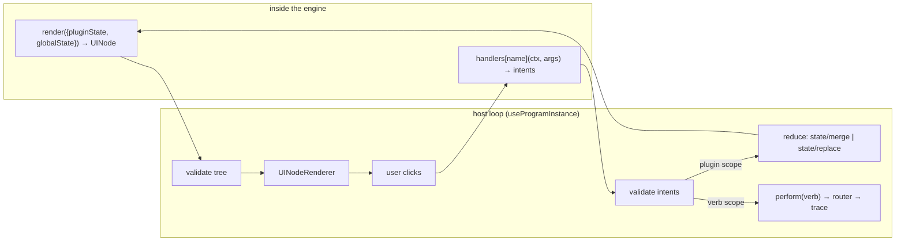
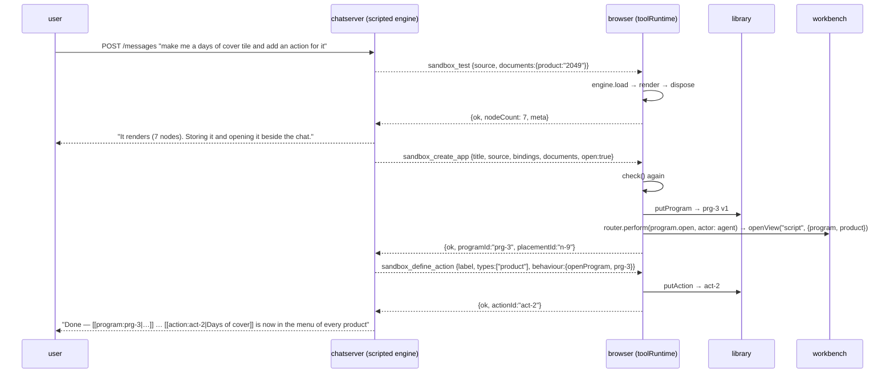

# PBUI Generative Tiles: Agent-Written Programs, Generated Actions, and the Reactive Sandbox

This project gives the PBUI chat agent the ability to write small JavaScript programs that run in the user's browser and appear as workbench tiles, and to define new menu actions on existing object types. The programs are written in a fixed dialect borrowed from vm-system's frontend plugin runtime: a pure `render` function from state to a JSON UI tree, and handlers that emit intents rather than mutating anything. The browser validates a program, stores it in a local library, runs it through a swappable engine (QuickJS in a Web Worker by default, `eval` on the same thread as a fallback), renders its tree with PBUI atoms, and turns its intents into either program state or verbs through the chat's existing router and trace. Ticket `PBUI-AGENT-3` holds the design guide and the diary; the code lives in a new package, `@hyperslop-systems/pbui-sandbox`, plus additions to `pbui-chat`, the demo product and the Go prompt.

> [!summary]
> 1. **Programs are pure functions over JSON.** `definePlugin(({ ui }) => ({ initialState, widgets: { main: { render, handlers } } }))`; `render` returns a `UINode` tree, handlers emit `state/merge`, `state/replace` or a `verb` intent. There is no DOM, network, timer or import in a program.
> 2. **The vocabulary stays closed.** Two presentation types (`program`, `action`) and five verb kinds (`program.open`, `program.remove`, `program.pin`, `action.run`, `action.remove`) are declared once; every generated program or action is a payload, never a new kind. The Go prompt and validator regenerate once.
> 3. **The engine is a one-line choice.** vm-system's `RuntimeHostAdapter` became `ProgramEngine`; `createEvalEngine()` and `createQuickJsEngine({ worker })` pass one conformance suite, and the difference between them is exactly the trust boundary (isolation and a 100 ms interrupt).
> 4. **Generated actions are data.** An action record names a label, the types it applies to, and one of three behaviours (open a program bound to the clicked object, perform a declared verb with `"$ref"` substituted, ask the agent). A registry wrapper appends them to menus; no closure is ever installed in a descriptor.

## Why this project exists

The two preceding tickets built a chat agent whose structured output is PBUI presentation objects ([[PROJ - PBUI Chat Agent - Presentation-Native Chat with Custom PBUI Widgets]]) and gave it tools to read and rearrange the user's workbench ([[PROJ - PBUI Workbench Tiles - A Reusable Server-less Shell and the Chat Agent on Tiles]]). After those, the agent could name objects, publish declarative widgets, and place any *shipped* application in a tile. It could not make a new kind of tile. Every interactive thing on screen had been written by a developer and deployed.

The request for this ticket was to close that gap with code generation: let the model write a small JavaScript application with a UI DSL, run it in a sandbox following vm-system's "reactive sandbox" pattern, and show it as a tile. Mid-flight the scope gained a second half — let the agent define new actions for existing presentation types, persisted in `localStorage` so they are there tomorrow — and one simplification: an `eval()`-based engine was acceptable for a first version.

The constraint that shapes everything is PBUI's founding rule, stated in `src/presentation/types.ts`: a verb is serialisable data, never a closure. Generated code must fit into a product whose menus, trace, vocabulary and prompt all assume that verbs can be validated, stored and described to a model. A program is therefore a thing the agent *makes* and the product *runs*, never a thing that reaches into the product.

## Current project status

Phases 0–5 of the design guide are built, tested and verified in a browser; Phase 6 (a server-side goja dry-run) is optional and open.

What exists on `pbui` branch `task/add-pbui-agent`:

- `packages/pbui-sandbox` — the bootstrap, contracts and validators, the `ProgramEngine` interface with the `eval` and QuickJS engines, the PBUI-atoms renderer, the `localStorage` program library, the view-keyed state store, the host-loop hook, the `script` tile and its app descriptor, and the generated-action registry wrapper. 53 tests, including one conformance suite run on both engines.
- `packages/pbui-chat/src/tools/sandboxTools.ts` — seven `sandbox_*` frontend tools behind a policy gate; `createPbuiChat` gained `attachSandbox()`; the router gained provenance; the vocabulary gained an optional `sandbox` block. 110 tests in the package.
- `packages/pbui-chat/demo` — `program` and `action` presentation types with descriptors, the five verb kinds and their local handlers, two seeded programs, launcher rows for programs, the registry wrapped with `withGeneratedActions`, QuickJS in a worker by default.
- `pkg/pbuichat` — `Vocabulary.Sandbox` validated like widget kinds, and a `## Programs` system-prompt section generated from it with a complete worked program. `pkg/chatserver/scripted` — a `programScenario` that drives the real bridged tools so `make chat-serve` demonstrates the whole gesture without a model; two Go end-to-end tests.

Ticket: `ttmp/2026/08/21/PBUI-AGENT-3--generative-tiles-agent-written-js-apps-and-actions-in-a-reactive-sandbox/` (a ~1400-line intern guide with fourteen decision records, an eight-step diary, and seven browser screenshots). Both documents are on the reMarkable under `/ai/2026/08/21/PBUI-AGENT-3`.

## Project shape

The work has three layers, and the order matters because each layer is only allowed to talk to the one below it through data.

1. **The sandbox** (`pbui-sandbox`): what a program is, how it is run, how its tree is drawn, where it is stored. Domain-neutral; it knows nothing about chat, products or SKUs.
2. **The agent's tools** (`pbui-chat`): how a model writes, tests, stores, opens, updates and removes programs and actions, and what it is told. Domain-neutral too; it reaches the sandbox through closures.
3. **The product** (the demo): which objects exist, how bindings resolve (`product: "2049"` → a reference with stock and sales), which verbs a program may emit, what the menus show.

```mermaid
graph TD
  subgraph browser
    subgraph sandbox["@hyperslop-systems/pbui-sandbox"]
      B[bootstrap: definePlugin, ui.*, __pluginHost]
      E[ProgramEngine: eval | quickjs worker]
      R[UINodeRenderer → pbui atoms]
      L[ProgramLibrary → localStorage]
      H[useProgramInstance host loop]
      S[script tile]
      A[withGeneratedActions]
    end
    subgraph chat["@hyperslop-systems/pbui-chat"]
      T[sandbox_* frontend tools]
      V[createVerbRouter + trace]
    end
    subgraph product["demo product"]
      D[descriptors: program, action]
      K[local verb handlers]
      W[workbench + script app]
    end
  end
  subgraph server["Go"]
    P[prompt.go: ## Programs]
    G[vocabulary.go: sandbox block]
    Q[scripted programScenario]
  end
  T --> L
  T --> E
  T --> V
  V --> K
  K --> W
  K --> L
  W --> S
  S --> H
  H --> E
  H --> R
  H --> V
  D --> A
  A --> L
  G --> P
  Q -. bridged tool calls .-> T
  style L fill:#fde68a,stroke:#92400e
  style E fill:#bfdbfe,stroke:#1e3a8a
  style V fill:#d1fae5,stroke:#065f46
```

## Architecture

### The reactive sandbox pattern, and where it came from

vm-system (`github.com/go-go-golems/vm-system`) is two things: a Go daemon that hosts goja sessions behind a REST API, and a frontend "Plugin Playground" at `frontend/packages/plugin-runtime`. The second is the pattern this project borrows. A plugin there is a single JavaScript file that calls `definePlugin()`, declares its own state, renders a JSON UI tree, and communicates only through dispatch intents that a host reduces under a capability policy, all inside QuickJS in a Web Worker.

Four properties follow from that shape, and each one is something an untrusted, model-written program must have:

- The program is pure functions over JSON. `render` has nothing to have side effects on; the same state renders the same tree, so it is testable without a browser and safe to re-render at any time.
- Intents are the only egress. A handler describes a change; the host decides whether it happens. Policy, audit and tracing all live in the host.
- State is owned by the host. The program receives `pluginState` and returns intents about it; the host can snapshot, reset, persist or share it between two tiles without the program knowing.
- Everything crosses the boundary as JSON. vm-system's `toJsLiteral` is `JSON.stringify`; `context.dump` on the way back. No object reference leaks in either direction, which is what makes the engine replaceable.

The loop, as the host runs it per tile:



### The dialect

The program API is vm-system's, kept byte-compatible where that costs nothing so the upstream documentation stays true, and extended in three places PBUI needs. A complete program, and the one the prompt carries as its worked example:

```js
definePlugin(({ ui }) => ({
  id: "days-of-cover", title: "Days of cover", bindings: ["product"], initialState: { days: 30 },
  widgets: { main: {
    render({ pluginState, globalState }) {
      const product = globalState.shared.documents?.product;
      if (!product) return ui.callout({ variant: "warning", text: "bind this tile to a product" });
      const stock = Number(product.value?.stock ?? 0), perDay = Number(product.value?.sold30d ?? 0) / 30;
      const days = Number(pluginState?.days ?? 30), needed = Math.ceil(perDay * days);
      return ui.column([
        ui.row([ui.ref(product), ui.badge(stock >= needed ? "covered" : "short")]),
        ui.input(String(days), { type: "number", placeholder: "days", onChange: { handler: "setDays" } }),
        ui.meter({ fraction: needed === 0 ? 1 : Math.min(1, stock / needed), value: stock + " / " + needed, label: "stock vs need" }),
        ui.button("Draft a reorder", { variant: "destructive", disabled: stock >= needed, onClick: { handler: "reorder" } }),
      ]);
    },
    handlers: {
      setDays({ dispatchPluginAction }, args) { dispatchPluginAction("state/merge", { days: Number(args?.value ?? 0) }); },
      reorder({ dispatchVerb, globalState }) { const p = globalState.shared.documents?.product; if (p) dispatchVerb({ kind: "reorder", productId: p.id }); },
    },
  } },
}))
```

Unchanged from vm-system: `definePlugin`, the factory's `{ ui }`, `initialState`, `widgets`, `render({ pluginState, globalState })`, `handlers[name](context, args)`, `dispatchPluginAction` with `state/merge` and `state/replace`, the `ui.text/badge/button/input/row/column/panel/table` helpers, the `{ handler, args? }` event reference and the `{ value }` payload an input's handler receives, and the `{ self, shared, system }` shape of `globalState`.

Added:

| Addition | Why |
|---|---|
| `ui.ref(reference, label?)` | the bridge to the object model: the node renders as the product's `<Presentation>`, with the object's menu, accept behaviour and mouse-doc |
| `ui.meter`, `ui.sparkline`, `ui.callout`, `ui.select` | the atoms pbui has and a data tile wants |
| `dispatchVerb(verb)` in the handler context | the only effect a program has beyond its own state; the verb must be a kind the vocabulary declares, and the router rejects the rest visibly |
| `bindings: string[]` on the plugin | lets a tool refuse an unbound open and lets the tile know what to resolve |
| `globalState.shared.documents` and `.env` | the view's bindings resolved into wire references, and the product's descriptor environment — two read-only domains, which is vm-system's capability model with one read grant and no write grants |

Removed: `ui.counter` (no pbui atom) and `dispatchSharedAction` (no writable domains; a door that always answers "ignored" would teach the model something false, so it is a `ReferenceError` at test time instead).

### The bootstrap and the two engines

The bootstrap is a string evaluated before the program's source. It defines `__ui`, `definePlugin`, and a `const __pluginHost` with three entry points the host calls by evaluating strings: `getMeta()`, `render(widgetId, pluginState, globalState)` and `event(widgetId, handler, args, pluginState, globalState)`. The string deliberately does not touch `globalThis`; each engine appends its own epilogue (`return __pluginHost;` under `new Function`, `globalThis.__pluginHost = __pluginHost;` under QuickJS). That one decision is what lets the eval engine bind `globalThis` itself to a forbidden proxy and still run the shim.

The interface both engines implement is vm-system's `RuntimeHostAdapter` with pbui's names:

```ts
interface ProgramEngine {
  readonly kind: "eval" | "quickjs";
  load(input: { instanceId; programId; source }): Promise<LoadedProgram>;
  render(input: { instanceId; widgetId; pluginState; globalState }): Promise<UINode>;
  event(input: { …render input; handler; args }): Promise<DispatchIntent[]>;
  dispose(instanceId): Promise<boolean>;
  health(): Promise<{ ready: true; instances: string[] }>;
  terminate?(): void;
}
```

The eval engine compiles one `Function` per instance:

```ts
const factory = new Function(...SHADOWED_GLOBALS, `"use strict";\n${BOOTSTRAP_SOURCE}\n${source}\n;return __pluginHost;`);
const host = factory(...SHADOWED_GLOBALS.map((name) => forbidden(name)));
```

`SHADOWED_GLOBALS` is `window, document, globalThis, self, fetch, XMLHttpRequest, WebSocket, localStorage, sessionStorage, indexedDB, setTimeout, setInterval, requestAnimationFrame, queueMicrotask, importScripts, navigator, location, history`, and `forbidden(name)` is a `Proxy` whose every trap throws `ReferenceError: document is not available inside a program: programs are pure functions over their state and bindings — no DOM, network, storage or timers`. Binding the names to `undefined` was the first version; it produced "Cannot read properties of undefined (reading 'title')", which hides the rule the model broke. Arguments cross into the program and results cross out through `structuredClone`, so on a shared heap the program still cannot mutate the host's state object in place; a conformance test pins that.

What the eval engine cannot do is stated plainly rather than softened: no isolation (`(0, eval)("this")` reaches the real global), no timeouts (a `while (true) {}` in `render` freezes the tab, because nothing can interrupt synchronous code on its own thread), no memory limit. What it gives is zero dependencies, synchronous rendering, real stack traces, and a working demo in a day.

The QuickJS engine is vm-system's `QuickJSRuntimeService` ported onto the shared bootstrap: one `QuickJSRuntime` and context per instance, `setMemoryLimit(32 MiB)`, `setMaxStackSize(1 MiB)`, and `setInterruptHandler(() => Date.now() > vm.deadlineMs)` with the deadline set around each evaluation (1000 ms to load, 100 ms to render or handle an event). It ships as a second package entry, `@hyperslop-systems/pbui-sandbox/quickjs`, so an eval-only consumer never imports the wasm, in two forms: `createQuickJsDirectEngine()` on the calling thread (the conformance suite runs it under a Node vitest environment) and `createQuickJsEngine({ worker })` over a Web Worker.

The worker's ownership is the design question Phase 5 actually settled. vm-system's client does `new Worker(new URL("./runtime.worker.ts", import.meta.url))` inside the library, which works in an application and fails in a published library: the consumer's bundler sees a URL into `node_modules/…/dist` and emits nothing for it. So the library exports the worker's *body*, `installQuickJsWorker()`, and the consumer ships a one-line worker *file* — the demo's `sandbox.worker.ts` — and passes the instance in. Vite then emits `sandbox.worker-….js` beside the application.

| | eval | QuickJS |
|---|---|---|
| can reach the DOM, `fetch`, storage | yes, if it tries | no |
| can hang the tab | yes | no — `RUNTIME_TIMEOUT` after 100 ms |
| can exhaust memory | yes | no — 32 MiB |
| can leak host objects | no (cloned at the boundary) | no |
| can perform an undeclared verb | no (router rejects) | no |
| needs in a CSP | `script-src 'unsafe-eval'` | `'wasm-unsafe-eval'` |

### Rendering with PBUI atoms

vm-system's `WidgetRenderer` emits Tailwind-styled raw DOM. PBUI's structural tests forbid that: `no-raw-controls.test.ts` fails a raw `<button>`, `no-hex.test.ts` fails a colour literal, and `grid-columns.test.ts` polices the tile-overflow defect recorded in the workbench ticket. The `UINodeRenderer` is therefore a switch over the thirteen node kinds onto `Button`, `TextInput`, `SelectInput`, `Chip`, `Meter`, `Sparkline`, `Callout`, `Text`, `Stack`, `Toolbar` and `Surface`, with tables in a `min-width: 0` scroll container and `ref` nodes delegated to a `renderReference(reference, label)` render prop so the renderer stays ignorant of any product's `createPbui` instance. A generated tile is indistinguishable in chrome, tokens and keyboard behaviour from a shipped one, which is what makes it part of the product rather than a frame beside it. The three structural tests now scan the sandbox package too.

### The host loop per tile

`useProgramInstance` runs the loop for one tile and owns three effects:

```
load    when (programId, version) changes:
          dispose the previous instance; engine.load(`${viewId}:${programId}:v${version}#${mount}`)
          if the view has no state → states.set(viewId, initialState)
          else probe-render with the previous state; on failure reset to initialState and note it
render  when (meta, state, documents, env) change:
          for each widget: engine.render(...) → trees; a thrown error becomes {phase:"render", code, message}
event   UINodeRenderer.onEvent(ref, payload):
          intents = engine.event(handler, payload ?? ref.args, state, globalState)
          plugin scope → reducePluginIntent (state/merge | state/replace) → states.set(viewId)
          verb scope   → perform(verb, { provenance: { programId } })  — the product routes it with actor "human"
```

Two choices are deliberate. The instance id includes the program version, so an update is a fresh load rather than a re-evaluation in a dirty context (`load` refuses a duplicate id, as vm-system's does). Program state is keyed by **view id**, not placement id, so two linked placements of one view show one state — the same invariant `AppProps` documents for every workbench application, and the reason the "split the counter tile" check showed one count in two tiles without any code about it.

The library's own record is small:

```ts
interface ProgramRecord { id; title; source; version; bindings; meta: { declaredId?, widgets }; by: "agent" | "human"; pinned; lastError?; createdAt; updatedAt }
interface ActionRecord  { id; label; types; behaviour; danger?; description?; by; pinned; createdAt; updatedAt }
type ActionBehaviour = { kind: "openProgram"; programId; bind? } | { kind: "verb"; verb } | { kind: "askAgent"; template };
```

`createProgramLibrary({ key })` persists to `localStorage` debounced at 300 ms, enforces `sourceBytes` (64 KiB), program and action counts (64 each) and a total size (1 MiB) at the door, refreshes from the `storage` event so two tabs converge, and — the lesson from the workbench ticket's notes tile — never resets silently on a corrupt entry: the bytes are copied under `<key>.corrupt-<timestamp>` and the library starts empty with a reported reason. Programs and actions get separate id counters (`prg-1, prg-2`; `act-1, act-2`) because the ids are read aloud to a model and a shared counter invites it to guess.

### Why the library is not the workbench document

Programs could have lived in `WorkbenchDocument.documents` as `DocumentPayload{ format: "pbui.program" }`; the notes tile in the demo already proves `documentPut`/`documentDelete` work. The fact that decided against it is one function in `demo/src/workbench.ts`: `resetLayout()` replaces the whole document. A program stored there would vanish with a layout reset, and "reset layout" must never delete code the user kept. The library is separate; a tile binds to a program the way a `sku` tile binds to a product, through `view.documents.program = "prg-7"`, and inherits the workbench's doc-binding rule for free — opening the same program with identical bindings goes to the existing tile.

### Generated actions

An action is a record, and its three behaviours cover what the agent is actually asked for: "open my tile for this" (`openProgram`, binding the clicked object under its type or a chosen key), "do the existing thing to this" (`verb`, a declared verb with `"$ref"`, `"$ref.id"` or `"$ref.type"` substituted), and "ask me about this" (`askAgent`, a template with `{0}`). If an action needs logic, the logic is a program, and the program already has the sandbox, the renderer and the error handling.

How an action reaches a menu: `createPresentationRegistry` takes a closed map and `ObjectMenu` calls `registry.actionsFor(reference, environment)` when it opens, not at registration. So a wrapper that forwards four methods and extends the fifth is the whole mechanism:

```ts
export const registry = withGeneratedActions(base, {
  getActions: () => Object.values(library.getState().actions),
  toVerb: (action, reference) => ({ kind: "action.run", actionId: action.id, ref: fromPresentationReference(reference) }),
  programExists: (id) => Boolean(library.getState().programs[id]),   // → disabledBecause when the program is gone
});
```

An action defined a moment ago is in the next menu. When it is clicked, the product's `local` handler expands `action.run` through `ctx.perform`, so the trace holds two entries — the action and the verb it became — which is what an audit needs to answer "what did the generated action actually do".

### The tools

Seven frontend tools, all late-bound: each has `available: () => library !== null && engine !== null`, and pinocchio's `RegisterManifestTools` skips unavailable descriptors, so a product without a sandbox never tells its model these exist. `attachSandbox(library, engine)` flips them and re-syncs the manifest, exactly as `attachWorkbench` does.

| Tool | What it does |
|---|---|
| `sandbox_describe` | programs (with which tiles show them), actions, the engine, the limits, the dialect's helpers and a worked example |
| `sandbox_test` | load, render every widget with resolved bindings, replay events through the reducer, render again; return trees, intents, state or `{ phase, code, error }`; **store nothing** |
| `sandbox_create_app` | the same dry run, then `library.putProgram`, then `program.open` through the router; nothing is stored if the run fails |
| `sandbox_update_app` | the dry run; on success a version bump (every tile showing it reloads); on failure the old version keeps running |
| `sandbox_open` | open a stored program bound to documents; `wentToExisting` when the de-dup rule fired |
| `sandbox_define_action` | validate types against the vocabulary, the program's existence, the verb against the vocabulary with a sample reference substituted, the template's `{0}`; store |
| `sandbox_remove` | a program (closing its tiles) or an action, through the router |

The single shared dry run is what guarantees the model's test and the real create cannot disagree. It also enforces the tools' own limits — a product may cap what the *agent* writes more tightly than the engine its own seeded programs run in — and returns the failing *phase*, so a model fixes the load, the render, or the event it got wrong.

Policy is the workbench tools' mechanism reused: `allow` / `confirm` / `deny` per capability, where `confirm` means a `pbui_propose` id the product's `isApproved(id, verb)` recognises, spent once, only after the change performed. One rule is new: a pinned or human-made program or action escalates `allow` to `confirm` for update and removal whatever the table says, because the protection belongs to the thing the user pinned.

### What the model is told

`pkg/pbuichat/prompt.go` emits a `## Programs` section only when the vocabulary declares a `program` type and a `sandbox` block. The block, declared in TypeScript beside `widget.kinds` and exported to `vocabulary.json`, lists the node kinds and intents the renderer is built against, so the prompt is generated from the same declaration the validator uses and cannot drift from it. The section states the dialect, the helpers, the `globalState` shape, the rules (no DOM, fetch, timer, import or async; coerce what you read from state; declare bindings rather than copying an object's fields into the source), the workflow (`sandbox_test` first), and the complete days-of-cover program above. Both earlier tickets recorded the model guessing a nested schema until its instructions held one complete, valid value; a program is the most nested thing yet.

## Implementation details

### Sequence: "make me a days of cover tile and add an action for it"

This is the scripted scenario, which calls the same bridged tools a real model would, and it is the sequence that ran in the browser:



The trace panel afterwards shows `#1 agent program.open ✓`: the tool performed the verb through the router with `actor: "agent"`, the same path a real model's call takes.

### Sequence: a click inside a generated tile

```
user clicks "Draft a reorder" in the days-of-cover tile
  UINodeRenderer → onEvent({handler:"reorder"})
  engine.event("main", "reorder", undefined, {days:45}, {shared:{documents:{product:{…2049…}}}})
    → [{scope:"verb", verb:{kind:"reorder", productId:"2049"}}]
  perform(verb, {provenance:{programId:"prg-3"}})
    → router.perform(verb, undefined, {actor:"human", provenance})
      validateVerb(vocabulary, verb)            ← a kind the product declared
      family "agent" → sendToAgent("draft a reorder for {0} …", [product])
      POST /verbs {actor:"human", verb:{kind:"reorder", productId:"2049", _provenance:{programId:"prg-3"}}, outcome:"performed"}
```

The actor is `human` because a human clicked; the program id travels as provenance so the trace can answer "through what". Provenance rides inside the verb `Struct` as `_provenance` rather than in a new proto field; Go's `ValidateVerb` iterates only the declared fields, so the extra key is accepted and stored without a wire change.

### The busy loop the tests did not catch

The first time a program tile mounted in the demo, the tab froze. The hook had passed its tests because every test passed stable callbacks; `ScriptTile` passed an inline `onError` arrow. The `fail` callback depended on `onError`, the render effect depended on `fail`, and `setTrees(next)` allocated a fresh object each time: render → `setTrees` → re-render → new `onError` → new `fail` → the effect again, a loop of microtasks and renders that never settled. The fix is the usual one — callbacks through refs, an unchanged tree keeps its object identity — and a regression test now counts engine renders under deliberately unstable callbacks and asserts they stop. A hook whose effects depend on caller-supplied callbacks is only as stable as its least careful caller.

### Errors across the worker boundary

An `Error` cannot cross `postMessage` with its class. The worker sends `{ code, message }`; the main thread rebuilds an `Error` under a marker name so `toProgramError` can tell a timeout from a runtime error without parsing the message, and a validation failure becomes a real `ProgramValidationError` again so the hook's `VALIDATION_ERROR` path is identical on both engines. Two details cost an hour each. `QuickJSContext.dump(error)` omits `name`, because `name` lives on `Error.prototype` and `dump` copies own properties; the name is read with `context.getProp(handle, "name")` before the dump, so a model reads `TypeError: cannot read property 'getItem' of undefined` once and with its name. And vitest's `toThrow(/re/)` matches the message only; V8 says `Unexpected token '<'` and QuickJS says `unexpected token in expression: '<'`, so the conformance assertions check `name` (`rejects.toMatchObject({ name: "SyntaxError" })`) rather than a message substring.

### Two gates for limits

The engine has construction-time limits; the tools have their own. They answer different questions — what this browser is willing to run, and what this product lets the *agent* write — and the first test of a tool-level `sourceBytes: 40` could not have passed, because the harness's engine was built with defaults and the limit reached neither `engine.load` nor the library. The dry run now enforces the tools' `sourceBytes` before load and re-validates every rendered tree with the tools' limits. Under the eval engine that validates a tree twice; a `limits` argument on `engine.render` would remove the duplication.

### A stale embedded vocabulary

`vocabulary.json` is `go:embed`ed into `pbui-chat serve`, while the demo SPA is served from disk. After regenerating the vocabulary with the five new verb kinds, the browser validated and performed `action.run` while the server's trace recorded `✗ unknown verb action.run`. Not a code defect: the same closed vocabulary is checked on both sides, and a process started before the regeneration rejects what the browser accepts — visibly, in the trace, rather than silently. Restart the server after `pnpm vocab`.

## Key code locations

- `packages/pbui-sandbox/src/bootstrap.ts` — the `definePlugin` shim; diff it against vm-system `frontend/packages/plugin-runtime/src/runtimeService.ts:13-127`
- `packages/pbui-sandbox/src/engines/evalEngine.ts` — `forbidden()`, `clone()`, the epilogue
- `packages/pbui-sandbox/src/quickjs/{runtimeService,worker,workerEngine,directEngine}.ts` — the QuickJS half, behind the `…/quickjs` entry
- `packages/pbui-sandbox/src/engines/conformance.ts` — the shared suite both engines run
- `packages/pbui-sandbox/src/host/useProgramInstance.ts` — the host loop and `reducePluginIntent`
- `packages/pbui-sandbox/src/library.ts`, `src/state.ts`, `src/actions.ts`
- `packages/pbui-sandbox/src/render/UINodeRenderer/`, `src/ScriptTile/`, `src/createScriptApp.tsx`
- `packages/pbui-chat/src/tools/sandboxTools.ts` — the seven tools, `gate`, `check`
- `packages/pbui-chat/src/createPbuiChat.tsx` — `sandbox` option, `attachSandbox`
- `packages/pbui-chat/demo/src/{sandbox,sandbox.worker,chat,workbench}.ts`, `demo/src/pbui/{verbs,vocabulary,registry}.ts`, `demo/src/pbui/descriptors/{program,action}.ts`
- `pkg/pbuichat/{prompt,vocabulary}.go` — `sandboxSection`, `SandboxExampleProgram`, `SandboxVocabulary`
- `pkg/chatserver/scripted/programs.go`, `pkg/chatserver/server_test.go` — the scripted scenario and its end-to-end tests

## Important project docs

- `ttmp/2026/08/21/PBUI-AGENT-3--…/design-doc/01-intern-guide-generative-tiles-….md` — the guide: §3 is the pattern from vm-system's source with line anchors, §4 the gap table, §5 the design with decision records D1–D14, §6 the phases, §9 eighteen failure modes
- `ttmp/2026/08/21/PBUI-AGENT-3--…/reference/01-diary.md` — eight steps; steps 4–7 record every failure with its exact message and fix
- `ttmp/2026/08/21/PBUI-AGENT-3--…/various/01–07` — browser screenshots of each acceptance gesture
- vm-system `frontend/docs/{architecture/ui-dsl,architecture/dispatch-lifecycle,architecture/capability-model,runtime/embedding}.md` — the pattern's own documentation, still accurate for the unchanged parts of the dialect

## Working rules

- A program is pure functions over JSON; anything it needs from the world arrives through bindings, and anything it does to the world leaves as a verb. If a feature needs a program to do more than that, the feature belongs in the host.
- Never mint a verb kind per generated artifact. Declare generic kinds once; generated things are payloads. Regenerate `vocabulary.json` and restart the server.
- Write the engine-neutral suite first and run it on every engine; it found two assertion bugs and one engine bug on its first run against a second engine.
- A published library cannot own its worker URL; the consumer ships the one-line worker file.
- Callbacks a hook receives go through refs; structurally-equal values keep their identity in `setState`.
- Test a program with `sandbox_test` before storing it; the tools are built so the model cannot store a program that did not render.

## Open questions

- Should `program.run` be a `confirm`-policy capability, showing the source in a proposal before agent code first executes? The guide designs it; the tools' policy does not implement it; the demo defaults to QuickJS, which lowers the stakes.
- Should program state persist across reloads? It is view-keyed and ephemeral today (guide D11); an opt-in `persistState` would need a migration story for incompatible updates.
- Should programs get read-only shared domains beyond `documents` and `env` — the watchlist, the inventory table's filters — and should there ever be a writable one?
- One QuickJS runtime per instance, all in one worker, at 32 MiB each: a product with many open program tiles will want a cap or a runtime pool.
- Is `_provenance` inside the verb `Struct` acceptable, or should `VerbPerformedCommand` gain a field?

## Near-term next steps

- Phase 6, optional: `pbui_sandbox_check` in goja (in-process, or a vm-system daemon session as the linter) for syntax and `getMeta()` before a browser round trip, and for validating programs with no browser attached.
- Wire the demo's `isApproved` to its proposal state (the open Tier 4 of the workbench-tools ticket), which would make pinned removals performable by the agent after a proposal.
- A `library` tile with export and import.
- Run the conformance suite on both engines in CI and publish `@hyperslop-systems/pbui-sandbox` with the other packages.

## Project working rule

Treat the vocabulary as the contract and the engine as a detail. A change to what a program may draw or emit is a four-place change — bootstrap, validator, renderer, `sandbox.kinds` — caught by the vocabulary round-trip test; a change of engine is one file behind `ProgramEngine` and must pass the same conformance suite before the demo switches to it.

## Related notes

- [[PROJ - PBUI - Presentation-Based UIs in TypeScript and React]]
- [[PROJ - PBUI Chat Agent - Presentation-Native Chat with Custom PBUI Widgets]]
- [[PROJ - PBUI Workbench Tiles - A Reusable Server-less Shell and the Chat Agent on Tiles]]
- [[PROJ - PULP Browser - Multi-Context MicroQuickJS and the Sandboxed Page Runtime]]
- [[PROJ - go-go-wm - Multiple Goja Sandboxes: Isolating Extensions, Leasing Keybindings, and Detecting a Wedged Event Loop]]
