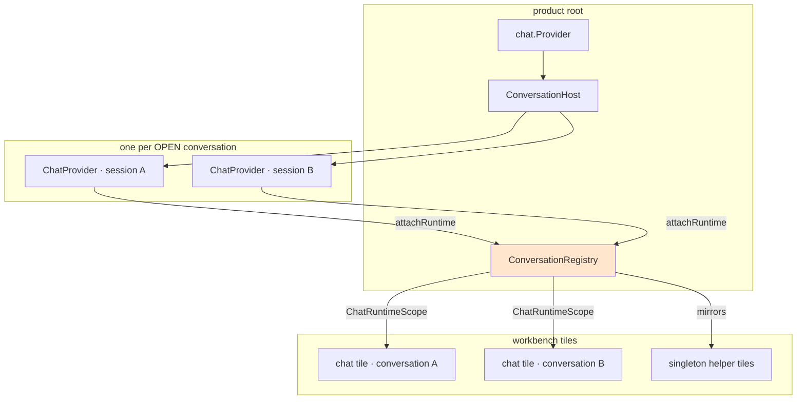

# PBUI Multi-Agent Workbench

This note records the third day of work on PBUI: the ticket `PBUI-AGENT-4`, which took a product that could hold exactly one agent conversation and made it hold as many as the user wants. The previous two days built the agent's abilities — [[PROJ - PBUI Generative Tiles - Agent-Written Programs, Generated Actions, and the Reactive Sandbox]] gave it programs, [[PROJ - PBUI Sandbox Devtools - Observing, Driving and Editing Agent-Written Programs]] gave a person the means to watch them run. This day changed the number of agents from one to N and built the five tiles a person needs once that is true.

Five of six phases were done when this note was written. The report covers what was built, the four assumptions in the existing code that had to be broken to build it, and the six failures that changed the design along the way. The sixth phase and the close-out are in [[PROJ - PBUI Multi-Agent Workbench Completed - The Session Index, the Merge, and What the Code Refused]].

> [!summary]
> - A `<ChatProvider>` **is** a session by construction: one Redux store, one WebSocket manager, one client, one `overlay.sessionId`. Holding several means holding several providers, and a **conversation registry** that owns them outside React.
> - The chat application became a **view of a `conversation` document**, which is the same move `script` made for programs. Two tiles with two bindings are two agents; the workbench's doc-binding rule supplies de-duplication, titles and linked splits for free.
> - A mid-ticket correction — *everything that can be an object should be an object* — turned four gestures that had deliberately been kept out of the vocabulary into verbs, and turned a row of seven buttons into a right-click menu. An entry in an object menu is a verb or it is nothing.
> - Cross-conversation views are joins over N Redux stores. Three separate bugs came from that: an infinite render loop, a tile that never updated, and a memo that reported stale state. All three were fixed by writing down exactly what the derived value depends on.
> - Agent-to-agent messaging is gated on a human approval that is checked **against the message**, not against the proposal id. The gate proved itself during the browser check by stopping a two-agent loop on its first iteration.

## Why this project exists

A PBUI product is a workbench: a tree of tiles, each showing one application, with an agent in one of them. Until this ticket the agent was singular in a way that was structural rather than intentional. `ChatProvider` — the React component chat-provider gives a consumer — builds its runtime inside a `useMemo`:

```js
export function ChatProvider({ children, config }) {
    const runtime = useMemo(() => {
        const store = createChatStore();
        const toolRegistry = createToolRegistry();
        const widgetRegistry = createWidgetRegistry();
        const adapterRegistry = createTimelineAdapterRegistry();
        // …
        const client = createChatClient({ config, store, toolRegistry, toolRuntime, adapterRegistry, wsManager: createWsManager(config?.transport) });
        // …
    }, [config]);
    return <Provider store={runtime.store} context={ChatReduxContext}>
        <ChatRuntimeContext.Provider value={runtime.context}>{children}</ChatRuntimeContext.Provider>
    </Provider>;
}
```

One store, one client, one socket, and an `overlay` slice whose `sessionId` is a single string. A second conversation is not a configuration option; it is a second instance of all of that.

The consuming layer had matched the assumption. `createPbuiChat` — the factory that assembles a PBUI-native chat for a product — kept a module-level `pending` (mentions queued for the next send), a module-level `chatClientRef` (so `attachWorkbench` could re-advertise the tool manifest), and a `Binder` component that bound the product's single verb router to whichever client had mounted last. Each of those is correct for one conversation and wrong for two.

The server, meanwhile, was already indifferent. `POST /api/chat/sessions` mints a uuid and remembers nothing; the hub and the hydration store hold a session's events, and any browser that knows an id can connect to it. Nothing on the Go side prevented several sessions; the browser simply never asked for one.

The second half of the problem is what a person needs once several agents exist. The runtime records a great deal that no product had ever rendered: a classified debug event stream keyed by conversation id, a run-statistics slice with token totals and streaming state, `tool_call` timeline entities with their inputs and results, parked human tools awaiting a decision, and the tool manifest the browser advertises. All of it was being collected and discarded.

## Current project status

Phases 0 through 4 are built, tested and verified in the browser against the demo product and the Go server. Phase 5 — a server-side session index, the registry's merge against it, and the documentation close-out — was built the following day and is recorded in [[PROJ - PBUI Multi-Agent Workbench Completed - The Session Index, the Merge, and What the Code Refused]]; the ticket is complete.

| Phase | What it built | Tests after |
|---|---|---|
| 0 | The conversation registry, one provider per open conversation, the session-aware router, the `chat` app rebound to a document | 131 |
| 1 | The Conversations tile, the *new conversation* gesture, five conversation verbs, the gated prompt section | 156 |
| — | Objects-first correction: conversations and workspaces as presentations, four more verbs, one page-level status bar | 159 |
| 2 | The Events tile over chat-provider's debug store | 171 |
| 3 | The Runs and Tools tiles, and the cross-conversation selectors | 182 |
| 4 | `conversation_list` and `conversation_send`, the agent-context tile, the scripted handoff | 203 |

Nine commits of code and five of documentation. The Go side gained one prompt section, two tool-name constants and one scripted scenario; everything else is in `packages/pbui-chat` and its demo.

## Project shape

The work divides into three layers that were built in order, because each depends on the one before it.

**The runtime layer** answers "how does a browser hold several chat sessions at once". It is `conversations/runtime.ts`, `conversations/ConversationHost.tsx` and `conversations/registry.ts`, plus the changes to `createPbuiChat` and `createVerbRouter` that let per-product machinery address a specific session.

**The tile layer** answers "what does a person need to see". It is five workbench applications: Conversations, Events, Runs, Tools and Agent context — the first four singletons, the last doc-bound.

**The agent layer** answers "what does a model know about its neighbours". It is a `conversation` presentation type with nine verb kinds, two frontend tools, and a prompt section that appears only when a product declares the type.

## Architecture

### The registry, and why the runtime is captured rather than constructed

The design called for a factory: `createChatRuntime(config)` assembling the same graph `ChatProvider` assembles, from the pieces chat-provider exports, for a session id known up front. That factory cannot be written. `createChatClient` requires a `ToolRuntime`, and `createToolRuntime` is not reachable through any of the package's export paths:

```json
"exports": {
  ".": "./index.js",
  "./core": "./core/index.js",
  "./store": "./store/store.js",
  "./tools": "./tools/index.js",
  "./widgets": "./widgets/index.js",
  "./ws": "./ws/index.js",
  "./debug": "./debug/index.js"
}
```

`tools/index.js` exports the tool registry and the hooks, not the runtime, and the map has no wildcard, so a deep import does not resolve either. Vendoring the 111-line implementation does not help on its own: it is built on `parseToolInput`, `parseToolResult` and `formatToolValidationError`, which are also unexported, so vendoring the runtime means vendoring the registry's validation and accepting that two copies of the tool contract will drift.

The substitute keeps every property the factory was wanted for and uses only public API. A component at the product's root renders one `<ChatProvider>` per **open** conversation, and a capture component inside each reports the runtime graph to the registry:

```tsx
export function ConversationHost({ registry }: { registry: ConversationRegistry }) {
  const openIds = useConversations(registry, (r) => r.openIds());
  return <>{openIds.map((id) => (
    <ChatProvider key={id} config={registry.configFor(id)}>
      <Capture registry={registry} conversationId={id} />
    </ChatProvider>
  ))}</>;
}

function Capture({ registry, conversationId }) {
  const context = useChatRuntime();
  const store = useChatStore() as unknown as ChatStore;
  useEffect(() => {
    store.dispatch(overlaySlice.actions.setSessionId(conversationId));
    registry.attachRuntime(conversationId, { store, context });
    if (registry.autoConnect()) void context.client.connect().catch(() => undefined);
    return () => {
      registry.detachRuntime(conversationId);
      context.client.reset();
    };
  }, [registry, conversationId, store, context]);
  return null;
}
```

Three details carry the design. The host is mounted **outside every tile**, so a runtime's lifetime is the conversation's rather than a tile's — closing every chat tile leaves the socket up, and only `registry.close(id)` takes it down. The session id is dispatched into the overlay **before** `connect()`, which is what stops `ensureSession` from minting a session or reading the URL:

```js
async function ensureSession() {
    let sessionId = args.store.getState().overlay.sessionId;
    if (sessionId) return sessionId;
    sessionId = persistedSessionId(config);
    // …POST /api/chat/sessions
}
```

Every runtime's `sessionPolicy` is `{ restore: "never" }` for the same reason. And the cleanup calls `client.reset()`, because `ChatProvider` has no cleanup of its own — without it a closed conversation's socket would stay open for the life of the page.

What is lost is synchronous construction. `registry.open(id)` marks a conversation open and a runtime appears one effect later, so a scope renders "opening conversation…" for a frame. That is the entire cost.



### What the registry holds, and what it deliberately does not

```ts
export interface ConversationRecord {
  id: string;                 // the session id, minted by the server
  title: string;
  titledBy: "auto" | "human" | "agent";
  createdAt: string; lastActivityAt: string;
  pinned: boolean; archived: boolean;
  messageCount: number;
  model?: string | null; provider?: string | null;
}

export interface ConversationMirror {
  runStatus: string;
  wsStatus: TransportStatus | "closed";
  error: string | null;
  streaming: boolean;
  stats: ChatRunStats | null;
  waiting: number;
}
```

Records persist in `localStorage`; a runtime is lazy. That split is the point: a socket per known conversation would not scale past a handful and serves nothing while no tile shows it, whereas a record is a few hundred bytes and is what makes a reload return to the same list.

The mirror is a deliberately small set of fields read from each open runtime's Redux store through **one** subscription per runtime. The registry re-notifies its own subscribers only when a mirrored field changed by `Object.is`. Cross-conversation tiles read mirrors; nothing else subscribes to N stores. This is the same shape the sandbox devtools used for the selected sandbox, and the reason is the same: the tiles that follow the selection are siblings of the tiles that set it, not descendants, so the state cannot live in a React context above them.

Titles are derived until owned. Until someone renames, a conversation's title is the first sixty characters of its first user message, recomputed as long as `titledBy` stays `auto`. A human rename sets `"human"` and an agent may not overwrite it — a rule that only became enforceable when the router started carrying the actor (below).

### Conversations as documents

The `chat` application became doc-bound:

```tsx
defineApp({
  id: "chat",
  docBound: true,
  duplicable: true,
  bindings: [CONVERSATION_BINDING],
  titleFor: (view) => view.title || chat.conversations.get(view.documents.conversation)?.title || "chat",
  Component: ChatApp,
})
```

The workbench's doc-binding rule then supplies three behaviours without further code. A second `openView("chat", { conversation: id })` for a conversation that already has a tile goes to that tile rather than opening a duplicate. A tile's title comes from the registry, so renaming a conversation renames its tile. And splitting a chat tile links a second placement to the same view — the same transcript twice — which is what splitting has always meant, while two tiles with two *bindings* are two agents.

A layout saved before conversations existed has a `chat` tile with no binding. The demo migrates it: the session id the old `sessionPolicy` persisted becomes the first record and the binding for that tile, and the legacy key is removed so it cannot resurrect as a duplicate.

### One router, many sessions

`createVerbRouter` is per product and stays so: the vocabulary, the verb families and the handlers are product facts. Only the destination of a trace POST and of `sendToAgent` is a session fact. The change is in the binding and in one option:

```ts
export interface PerformOptions {
  actor?: Actor;
  provenance?: Record<string, unknown>;
  conversationId?: string;
}

export type RouterBinding = Omit<RouterContext, "perform" | "conversationId" | "client" | "actor"> & {
  conversation(conversationId?: string): { id: string; client: ChatClient } | null;
};
```

Every `perform` resolves the conversation once — the one named, else the active one — and hands the handler a context carrying `conversationId`, that conversation's client, and a `sendToAgent` that defaults to the same conversation rather than to whichever is active by the time an `await` resolves. The trace POST goes to `/api/chat/sessions/{that id}/verbs`.

Where the id comes from is a short list: a chip or menu inside a conversation tile passes its own; a frontend tool passes the session it was instantiated for; a program's verb, a launcher row and a workbench bar pass nothing and get the active conversation.

### Tools instantiated per session

A frontend tool's `execute` receives `{ signal, toolCallId }` and nothing else. One shared descriptor therefore cannot tell which model called it, and every verb it performed would be traced against whichever conversation happened to be active.

Three approaches were tried. Passing a `conversationId` in the execution context fails because `createWorkbenchTools` and `createSandboxTools` call `options.perform(verb)` from a dozen places deep inside their own closures and never see the context. An ambient "current conversation" set around the call fails because `execute` awaits, so two calls from two conversations interleave. What works is building the tool sets **per conversation**:

```ts
function toolsFor(conversationId: string): ConversationToolset {
  const perform = (verb: VerbLike) => router.perform(verb, undefined, { actor: "agent", conversationId });
  const workbenchTools = createWorkbenchTools({ getWorkbench: () => workbench, perform, ...options.workbenchTools });
  const sandboxTools = createSandboxTools({ /* … */ perform, vocabulary, ...sandboxOptions });
  const conversationTools = createConversationTools({ getConversations: () => conversations, conversationId, perform, ...options.conversationTools });
  // …memoised per id
}
```

The knowledge lives in a closure created when the conversation was, where it is exact and cannot race. It also settles a question the design had left open: each agent gets its own layout undo ring, which is what "undo what you just did" has to mean when two agents are rearranging one screen.

### Everything that can be an object is an object

Midway through the ticket the rule arrived as a correction: list rows should be presentation objects whose actions come from the type's descriptor, not labels with button rows beside them. The Conversations tile had shipped with seven buttons per row.

The correction has a consequence that is not cosmetic. An entry in an object menu is a **verb** or it is nothing — the descriptor's action list is `{ label, verb }` pairs. The first version had deliberately kept four gestures out of the vocabulary on the argument that pinning or archiving changes only this browser's list, not the conversation. That argument does not survive contact with `tile.close` and `workspace.delete`, which are verbs and also change only this browser's layout. `conversation.pin`, `.archive`, `.close` and `.forget` joined the vocabulary.

One gesture resisted: renaming needs a text field, and a menu has nowhere to type. The shape that works is one the vocabulary already used elsewhere — `compareWith` without a `right` opens accept mode — so a verb with a field missing is a **request**:

```ts
case "conversation.rename": {
  const snapshot = requireKnown(ctx, verb.conversationId);
  if (ctx.actor === "agent" && snapshot.titledBy === "human") {
    throw new Error("the user named this conversation; ask them before renaming it");
  }
  if (verb.title === undefined) {
    ctx.conversations.requestRename(verb.conversationId);   // open the editor
    return;
  }
  if (!verb.title.trim()) throw new Error("a conversation needs a name");
  ctx.conversations.rename(verb.conversationId, verb.title, ctx.actor === "agent" ? "agent" : "human");
  return;
}
```

`requestRename` is registry state; whatever is showing the conversation opens an inline editor, and committing performs the same verb with the title. One verb, two meanings, both declared — and an agent can now ask the user to name a conversation instead of naming it itself.

The rule left two kinds of button standing: a gesture with no object to hang off (*new conversation* — the object does not exist yet), and one that needs input a menu cannot collect. Workspaces became objects the same day, and required no library change at all: `WorkspaceStrip` had shipped with a `renderWorkspace` prop whose documentation says "a product that wants its `<workspace>` Presentation puts it there too, so the object menu and this strip are the same verbs".

### The five helper tiles

| Tile | Kind | Reads | Shows |
|---|---|---|---|
| Conversations | singleton | registry records + mirrors | every agent: title, status, connection, messages, age, tokens, waiting |
| Events | singleton | chat-provider's debug store | frames, lifecycle transitions, projected UI events, by family |
| Runs | singleton | registry mirrors only | model, runs, tokens, last duration and stop reason, live token rate |
| Tools | singleton | mirrors **and** each open runtime's store | waiting-for-you, then every tool call with input and result |
| Agent context | **doc-bound** | one runtime's registry and recorded state | the tools it can be offered, the last message on the wire, environment, vocabulary |

Four are singletons that follow the active conversation or read across all of them. The fifth is doc-bound because "what this agent was told" is a fact about one conversation, and two of them side by side comparing two agents is the intended use rather than a duplicate.

The Events tile is the clearest case of rendering something that already existed. chat-provider's WebSocket manager emits a debug event for every frame and every lifecycle transition; `createChatDebugEventStore` classifies each into one of six families, writes a one-line summary at ingest, and keeps a capped ring per conversation id. The tile adds no state to the runtime and cannot fall behind it. Rows are `<chatEvent>` objects, so the raw frame the summary was made from is one right-click away — which is the justification for summarising in the first place.

### The handoff, and the gate

Two frontend tools give a model a view of its neighbours. `conversation_list` returns the records with three flags that matter — `isYou`, `isActive`, `connected` — because a model that cannot tell itself from its neighbours will hand work to itself. `conversation_send` is the handoff, and it is `confirm` by default.

The refusals are ordered and each is a sentence a model can act on:

```ts
if (decision === "deny")                     return fail("this product does not let agents message each other");
if (!target)                                 return fail(`no conversation ${id}; call conversation_list for the ids`);
if (id === options.conversationId)           return fail("that is this conversation; answer the user directly instead");
if (!target.open)                            return fail(`${target.title} is disconnected; ask the user to open it first`);
if (!input.prompt.trim())                    return fail("a message needs something in it");
if (input.prompt.length > maxPromptLength)   return fail(`that message is ${n} characters; the limit is ${max}`);
if (decision === "confirm" && !confirmationId) return fail(`…call pbui_propose describing what you want to ask ${target.title}, then call this again with that proposal's id as confirmationId.${hint}`);
if (!options.isApproved?.(confirmationId, id, prompt)) return fail(`proposal ${confirmationId} was not approved for this message`);
```

The important design decision is in the last line. An `isApproved(confirmationId)` that only asks "was this proposal approved" authorises every later send equally: approve one handoff and the same id sends anything, anywhere. The check takes the target and the message, and the demo's implementation compares them against what the user actually read:

```ts
function approvedSend(confirmationId: string, target: string, prompt: string): boolean {
  for (const snapshot of chat.conversations.all()) {
    const runtime = snapshot.runtime;
    if (!runtime) continue;
    for (const entity of selectTimelineEntities(runtime.store.getState())) {
      if (entity.kind !== "tool_call" || entity.props.toolName !== "pbui_propose") continue;
      const input = entity.props.input as { id?: string; fields?: { label?: string; value?: string }[] };
      if (input.id !== confirmationId) continue;
      if ((entity.props.result as { decision?: string })?.decision !== "approve") return false;
      const fields = input.fields ?? [];
      return fields.find((f) => f.label === "to")?.value === target
          && fields.find((f) => f.label === "message")?.value === prompt;
    }
  }
  return false;
}
```

Reading the timeline rather than keeping a set of approved ids has a second benefit: the check survives a reload, because the session hydrates its tool calls.

Because `isApproved` belongs to the product, the package cannot know what shape a proposal must take — but the model has to produce it. `confirmationHint` is the seam: the package writes the general refusal and the product appends the specific requirement, so a model that produces an unmatched proposal learns why rather than looping.

```mermaid
sequenceDiagram
    participant U as user
    participant A as agent A
    participant B as browser
    participant C as agent B
    A->>B: conversation_list
    B-->>A: ids, titles, isYou, connected
    A->>B: pbui_propose · to + message
    B->>U: proposal card
    U-->>B: Approve
    B-->>A: decision approve
    A->>B: conversation_send · id, prompt, confirmationId
    B->>B: approvedSend compares to + message
    B->>C: message in conversation B
    C-->>U: answers in its own conversation
```



## Implementation details

### Sequence: opening a second agent

1. The user clicks *new conversation* (masthead, tile header, or launcher row). All three perform the same verb.
2. `performConversationVerb` calls `registry.create()`, which POSTs `/api/chat/sessions`, records the returned id, marks it open and makes it active.
3. `ConversationHost` re-renders and mounts a `<ChatProvider>` for the new id with `registry.configFor(id)` — a memoised config carrying that session's extension (its own tool set), its own `sendMessageBody`, and an `onDebugEvent` that pushes into the shared debug store under that id.
4. `Capture`'s effect dispatches the session id, attaches the runtime, and connects. The registry subscribes to the new store and begins mirroring.
5. The verb opens a `chat` tile bound to the conversation. `ConversationScope` re-provides the runtime's two contexts, and every pbui-chat component inside — transcript, composer, widget outlets, tool cards — reads that conversation's store without knowing anything changed.

### The stale embedded vocabulary

Twice during the browser checks the verb trace read `rejected:unknown verb conversation.pin` while the pin had plainly worked. The first occurrence was a stale bundle. The second was real, and it is worth recording because it is the most confusing failure this system can produce: the browser and the trace disagreeing about what happened.

The server re-validates every reported verb against the vocabulary it embeds at compile time:

```go
if err := p.vocab.ValidateVerb(payload.GetVerb().AsMap()); err != nil && outcome == traceOutcomePerformed {
    outcome = "rejected:" + err.Error()
}
```

`pkg/chatserver/demo/vocabulary.json` is generated from the TypeScript vocabulary by `pnpm vocab` and embedded with `//go:embed`. A server started before the regeneration keeps serving the old one. Adding a verb kind therefore takes three steps, not two — change the schema, regenerate, **restart the server** — and the failure that skipping the third produces looks nothing like its cause.

### Three bugs from joining N stores

The Runs tile reads only mirrored fields and needed nothing special. Tool traffic needs timeline **entities**, which the registry does not mirror because there can be thousands of them and they change on every frame. Reading them across conversations produced three separate failures.

**An infinite render loop.** `useConversations` is `useSyncExternalStore`, which compares snapshots by identity. A selector that *computes* rather than reads returns a new array every call:

```
Error: Maximum update depth exceeded.
 ❯ forceStoreRerender react-dom-client.development.js:8261:18
```

The contract is stated in the hook's own doc comment — "the selector must return a stable reference for an unchanged slice" — and holds trivially for `all()` and `activeId()`. It broke the first time a selector derived something. The joins now memoise on the identities of their inputs.

**A tile that never updated.** With the loop fixed, the Tools tile showed nothing. A tool call arriving changes no mirrored field: the message count is the same, the run statistics are the same. The registry therefore never notified and the tile never re-rendered. The fix subscribes to the open runtimes as well as to the registry, re-attaching only when the set of open runtimes actually changes:

```ts
const reattach = () => {
  const open = registry.all().map((s) => s.runtime).filter((r): r is ChatRuntime => r !== null);
  const unchanged = attached.length === open.length && attached.every((e, i) => e.runtime === open[i]);
  if (unchanged) return;
  for (const entry of attached) entry.off();
  attached = open.map((runtime) => ({ runtime, off: runtime.store.subscribe(onChange) }));
};
```

**A memo that reported stale state.** Answering a parked human tool changes nothing about the timeline entities — the result arrives later, in its own frame — so an entity-identity memo kept reporting `waiting: true` after the user had decided. The memo key gained a signature of which human tools are currently parked, built by asking `isPendingHumanTool` about each human tool call with no result. It allocates nothing and walks only the calls that could be parked.

The three failures are the same problem seen from three sides: a value derived from several stores must be identical when nothing changed, and the only reliable way to get that is to write down exactly what it depends on rather than to rely on a dependency array.

### Where the manifest actually lives

The agent-context tile initially read `runtime.lastManifest`, a field set by the runtime's own `syncManifest()`. It reported "nothing advertised yet" while the manifest was going out with every message. Wrapping the client's exposed `client.tools.syncManifest` did not fix it either, because `connect()` and `send()` call an internal closure rather than the public alias:

```js
async connect() {
    dispatch(overlaySlice.actions.setError(null));
    const sessionId = await ensureSession();
    await ensureConnection(sessionId);
    await syncToolManifest();          // the closure, not tools.syncManifest
}
```

The correct source is not "what was last sent" but "what can this model be offered", which is the tool registry read at render time. The tile lists `runtime.toolRegistry.manifest()` and uses `lastManifest` only for the "last advertised … · revision n" stamp when one exists. A tool that is registered but unavailable is listed **with** its reason rather than omitted, because "the tool is missing" and "the tool is there but turned off" are different problems that look identical in a transcript.

### Two React copies, through an undeclared dependency

`ChatRuntimeScope` needs `react-redux`'s `Provider` to re-provide a store under `ChatReduxContext`. pbui-chat had never imported `react-redux` directly — it appeared in the build's externals list but not in `dependencies` — so the bare specifier resolved from the monorepo root, whose copy pulled a different React than the one react-dom had loaded:

```
TypeError: Cannot read properties of null (reading 'useMemo')
 ❯ Module.exports.useMemo ../../../../../../node_modules/react/cjs/react.development.js:1209:33
 ❯ Provider ../../../../../../node_modules/react-redux/src/components/Provider.tsx:62:29
```

This is exactly the failure `pbuiVite()`'s `resolve.dedupe` exists to prevent, arriving through a package that was used transitively for years and declared never. Adding `"react-redux": "^9.3.0"` to `dependencies` fixed five failing tests with no other change.

### The gate catching a loop, live

During the Phase 4 browser check the receiving agent was handed a message that happened to match the scripted handoff scenario's own keywords. It immediately began handing the work back — and stopped at the proposal, waiting for a human. Without the gate that is an unbounded exchange between two agents, each starting a run in the other. With it, it is one card the user can reject.

The scenario was written to demonstrate the gate; it demonstrated it in a way that was not planned.

## Key code locations

All paths relative to `/home/manuel/workspaces/2026-08-20/add-pbui-agent/pbui`.

- `packages/pbui-chat/src/conversations/registry.ts` — records, lazy runtimes, mirrors, activation, the rename request
- `packages/pbui-chat/src/conversations/ConversationHost.tsx` — one provider per open conversation; `ChatRuntimeScope`
- `packages/pbui-chat/src/conversations/runtime.ts` — the runtime value, and why it is captured
- `packages/pbui-chat/src/conversations/verbs.ts` — nine verb kinds, one dispatcher, the title-ownership rule
- `packages/pbui-chat/src/conversations/selectors.ts` — `toolCallsOf`, `selectToolTraffic`, `useToolTraffic`, `streamRate`
- `packages/pbui-chat/src/conversations/{ConversationsTile,EventsTile,RunsTile,ToolsTile,ContextTile}/` — the five tiles
- `packages/pbui-chat/src/tools/conversationTools.ts` — `conversation_list`, `conversation_send`, the policy
- `packages/pbui-chat/src/createPbuiChat.tsx` — per-conversation tools, pending and extensions; one router binding
- `packages/pbui-chat/src/router/createVerbRouter.ts` — `conversationId` targeting and `actor`
- `packages/pbui-chat/demo/src/pbui/descriptors/conversation.ts` — the ten menu entries
- `packages/pbui-chat/demo/src/chat.ts` — `approvedSend`
- `pkg/pbuichat/prompt.go` — the `## Conversations` section, gated on the type
- `pkg/chatserver/scripted/scenarios.go` — `handoffScenario`

## Important project docs

- `ttmp/2026/08/21/PBUI-AGENT-4--…/design-doc/01-intern-guide-many-conversations-on-one-workbench-….md` — the design with decision records D1–D12, failure modes R1–R14, and the six-phase plan
- `ttmp/2026/08/21/PBUI-AGENT-4--…/reference/01-diary.md` — seven steps, one per phase plus the objects correction, with every failure recorded as it happened
- `ttmp/2026/08/21/PBUI-AGENT-4--…/various/` — nine screenshots from the browser checks

## Working rules

- A conversation is a **document**, not an application. Anything that is a view of one is doc-bound; anything that follows the active one is a singleton.
- A gesture that appears in an object menu is a **verb**. A button is for a gesture with no object, or one that needs input a menu cannot collect.
- Cross-conversation values read **mirrors** unless they need entities, and anything that derives a value must memoise on exactly what it depends on.
- An approval names **what was approved**, never only an id.
- Adding a verb kind means: schema, `pnpm vocab`, restart the server.
- Build workbench layouts with `verbs.*` or `parseDocument`. A hand-written document that fails validation is persisted before it fails, and blanks the page until the storage keys are cleared. This happened twice.

## Open questions

- The `llm`, `tool` and `widget` event families are always empty in the demo, because they come from a `familyAliases` map — from UI-event name to family — that the classifier accepts as an option and no product supplies. What that mapping should be is a product fact this ticket has not settled.
- `useToolTraffic` re-attaches its per-runtime subscriptions inside the registry's notification, which fires on every mirror change of every conversation. The comparison is cheap; the frequency has not been measured with ten conversations open.
- The demo's scripted engine reports no token usage, so every number in the Runs tile is zero. The tile is verified for layout and liveness but not against real figures.
- Two `chat.Provider`s in one tree mount two hosts and re-attach every runtime. Products mount one, and a test that mounted two found this — but nothing prevents it.

## Near-term next steps

- Phase 5: a rebuildable `SessionIndex` in Go behind `GET /api/chat/sessions` and `PATCH /api/chat/sessions/{id}`, with the registry **merging** the server's list into its records rather than replacing them; the hub stays authoritative and a browser must work when the index is empty.
- The Conversations tile's `waiting` count should link into the Tools tile now that it exists.
- Propose `createToolRuntime` (and the tool-input/result helpers it needs) as exports upstream in chat-provider, then replace the provider-per-conversation host with the factory the design describes. The registry API does not change; only how a runtime comes into being does.

## Project working rule

Each phase ends with the package tests green, a browser check against the running Go server, a commit, and a diary step that records the failures verbatim. The diary is written during the work rather than after it, which is why the three store-join bugs and the stale-vocabulary trace are recorded with their exact error text.

## Related notes

- [[PROJ - PBUI Generative Tiles - Agent-Written Programs, Generated Actions, and the Reactive Sandbox]]
- [[PROJ - PBUI Sandbox Devtools - Observing, Driving and Editing Agent-Written Programs]]
