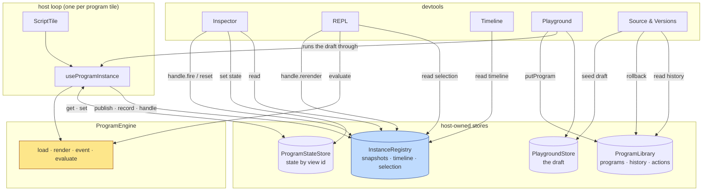
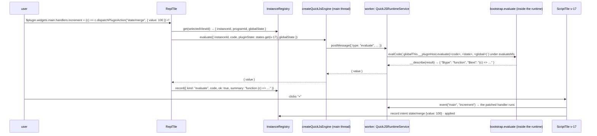

# PBUI Sandbox Devtools

This note records the second day of work on the PBUI sandbox: the ticket `PBUI-SANDBOX-1`, which took the runtime built in [[PROJ - PBUI Generative Tiles - Agent-Written Programs, Generated Actions, and the Reactive Sandbox]] and made every running program observable and addressable from other tiles. The result is one new store, one new engine method, and five workbench applications — a program inspector, a REPL that evaluates inside a live instance, a dispatch timeline, a playground that runs a draft as you type, and a source-and-versions tile with rollback. The ticket also found and fixed a race in the host loop that had existed since the previous day.

> [!summary]
> - Everything a running program knows — status, metadata, trees, timings, a control handle — was trapped inside the React hook that runs it. An **instance registry** (a store keyed by view id, with one global timeline ring and "the selected sandbox") publishes it to the rest of the workbench.
> - The REPL required one door through the engine boundary. `evaluate` is implemented **once, in the bootstrap, with a direct `eval`**, so the eval engine and QuickJS expose exactly the same scope and helpers; the conformance suite proves it on both.
> - The five tiles are ordinary workbench app descriptors on pbui atoms: two doc-bound to `program`, three singletons that follow the selection. No verb kinds, no vocabulary, no prompt and no Go changed; the agent only gained a `running[]` field in `sandbox_describe`.
> - The timeline, on its first day, exposed a reload race in the host hook: the render effect fired for the next instance before its load finished. The fix is a one-line guard with a regression test.

## Why this project exists

After `PBUI-AGENT-3` the chat agent could write a program in vm-system's `definePlugin` dialect, test it, store it and open it as a tile. What it could not do — and what the human could not do either — was look at the program while it ran. The hook `useProgramInstance` owned the loaded metadata, the rendered trees, the error and a fifty-line string log, and returned them to the one `ScriptTile` that mounted it. Every question that came up while debugging the previous ticket ("what did it render", "what state is it in", "did the binding resolve", "why is this slow") was answered through a console door, `window.__pbuiDemo`, by hand.

The user asked for a short list of tiles that would support the generative feature; eight were proposed, and five were chosen: an inspector, a REPL that injects into a selected sandbox, a timeline, a playground, and a versions tile. The constraint that carried over from the previous ticket is the founding rule of PBUI — a program is pure functions over JSON, intents are its only egress, verbs its only effect — and the constraint added by this one is that the devtools must read the host's side of that boundary and push through doors the host already has, plus one new door that keeps the boundary intact.

## Current project status

All six phases are built, tested and verified in a browser under the QuickJS worker engine. On `pbui` branch `task/add-pbui-agent`, commits `2c031a6` through `240ffc6`:

- `packages/pbui-sandbox/src/instances.ts` — the registry; `src/host/hostOptions.ts` — `SandboxHost`, the single options object every tile takes; `src/host/useProgramInstance.ts` — publishes, records, registers a handle, and no longer keeps a log.
- `src/bootstrap.ts` — `__pluginHost.evaluate` and `__describe` (bootstrap version 2); `src/engine.ts` and both engines — `evaluate`; `src/engines/conformance.ts` — five evaluate cases run on both engines.
- `src/devtools/` — `InspectorTile`, `ReplTile`, `TimelineTile`, `PlaygroundTile` (+ `playgroundStore.ts`), `SourceTile` (+ `diffLines.ts`), and `createSandboxDevtools(host)` which returns the five descriptors.
- `src/library.ts` — `ProgramRecord.history`, `rollback`; `src/limits.ts` — `evaluateMs`, `historyDepth`.
- `packages/pbui-chat` — `attachSandbox(library, engine, instances)`; `sandbox_describe` reports `running[]` and a `history` count per program.
- 103 tests in `pbui-sandbox` (53 before), 111 in `pbui-chat` (110 before). Ticket: `ttmp/2026/08/21/PBUI-SANDBOX-1--sandbox-devtools-inspector-repl-timeline-playground-and-versions-tiles/` with a ~650-line intern guide (fourteen decision records, fifteen failure modes) and an eight-step diary; both on the reMarkable under `/ai/2026/08/21/PBUI-SANDBOX-1`.

Not built, and recorded as such: storybook stories (the package has storybook scripts but no configuration) and a checked-in Playwright test over the five scenes (each scene was verified by hand through Playwright MCP, with screenshots in the ticket).

## Project shape

The work has three layers. The order matters, because each layer may only read from the one below it through a store or call into it through a handle.

1. **The registry and the engine door** (`instances.ts`, `bootstrap.ts`): what is running, what happened, which instance is selected; and a way to evaluate code inside an instance.
2. **The host loop** (`useProgramInstance.ts`, `ScriptTile.tsx`): the one writer of the registry. It publishes after each effect, records a structured entry for each thing that happens, and registers a handle so a devtool can fire, reset or re-render it.
3. **The five tiles** (`devtools/`): readers of the registry, the library, the state store and the playground store, that write only through `states.set`, `library.put*`/`rollback`, the handle, or `host.perform`.



The playground deserves a remark in this picture: it is not only a reader. It mounts `useProgramInstance` itself with a synthetic program record, so the draft is a host-loop instance like any other and appears in the registry as program `draft` under view `playground`. The REPL can target it and the timeline records it without either knowing what a draft is.

## Architecture

### The instance registry, and what "the selected sandbox" means

The registry is a store in the same style as the state store and the library — plain closures over a `Map`, a listener set, and a `useSyncExternalStore` hook named `useInstances(registry, selector)`. It holds three things.

The first is a **snapshot per view id**:

```ts
interface InstanceSnapshot {
  viewId; placementIds: string[];            // every placement that mounted this view
  programId: string | null; version: number;
  instanceId: string | null;                 // null while loading or after a failed load
  status: "idle" | "loading" | "ready" | "error";
  meta: LoadedProgram | null;
  trees: Record<string, UINode>;
  globalState: ProgramGlobalState | null;    // what the last render saw: resolved bindings, env
  error: ProgramErrorPayload | null;
  timings: { loadMs?, lastRenderMs?, lastEventMs?, renders, events, errors, timeouts };
  handle: { fire(widgetId, ref, payload?), reset(), rerender() } | null;
  highlight: string | null;                  // a node path the tile should outline
}
```

Keying by view rather than placement keeps the invariant every workbench application documents: two linked placements of one view are one logical thing. They share program state through the state store already; the registry records both placement ids on one snapshot and drops the snapshot when the last one unmounts. One consequence is worth stating because it surprised me: two linked placements each mount their own hook and therefore run two engine instances; the snapshot's `instanceId` and `handle` are whichever placement published last. Both instances are equivalent — same program, same state — so a handle drives the view's state correctly either way, but the inspector's "instance id" is one of two. Making one hook serve two placements would require moving the hook out of the tile, and was not worth it.

The second is a **timeline ring**: one array, ordered by a monotonic `seq`, of structured entries, kept to 500. The first design had a log per instance, which was wrong for the question the Timeline tile answers — "what happened across the three open tiles in the last ten seconds" needs one order. The entry body is a discriminated union:

```ts
type TimelineEntryBody =
  | { kind: "load"; durationMs }
  | { kind: "render"; widgetId; durationMs; nodeCount }
  | { kind: "event"; widgetId; handler; args; durationMs; intents: DispatchIntent[] }
  | { kind: "intent"; intent: DispatchIntent; outcome: "applied" | "ignored" | "performed" | "rejected"; detail? }
  | { kind: "error"; phase; code; message }
  | { kind: "evaluate"; code; durationMs; ok; summary }
  | { kind: "note"; text };
```

The hook's old string log (`InstanceLogEntry { kind, text, outcome }`) was deleted rather than kept beside the ring; two records of the same events drift. The script tile's "details" disclosure now filters the ring by its view id and formats entries with the same `formatEntry` the Timeline tile uses, so the two never disagree.

The third is the **selection**: `selectedViewId()` and `select(viewId)`. It lives in the store rather than in any tile or React context because the tiles that use it — the REPL, the timeline's default filter — are not ancestors or descendants of the program tiles; they are siblings in a layout the user arranges. A program tile calls `select(view.id)` on focus-within or click (a `tabIndex={-1}` container with `onFocusCapture` and `onClickCapture`). Unmounting the selected view clears the selection, so a singleton that follows it shows its empty state rather than a stale target.

Two implementation details keep the registry from re-rendering everything on every write. `publish(viewId, patch)` compares each patched field to the current one with `Object.is` and does not notify when nothing changed; and the hook hands it a *new* `trees` object only when the rendered content changed (`treesRef` mirrors the last published trees and a JSON comparison decides). A subscriber that selects `get(viewId)?.trees` therefore re-renders only when a tree changed; a subscriber that selects `timeline()` re-renders on every record, which is what the Timeline tile wants and nothing else does.

### `evaluate`: one door, implemented once

The REPL must run arbitrary code inside a live instance with access to the program's `definePlugin` result, the bootstrap's `ui` helpers and the current state, and return a value the host can show. The engine boundary is JSON; the two engines hold the program in different places — the eval engine keeps the bootstrap and the program inside one `new Function` closure, QuickJS evaluates them as successive scripts into one global lexical scope. Two facts make a single implementation possible: inside that `new Function`, a *direct* `eval(code)` sees the enclosing function scope; and inside QuickJS, every later `evalCode` in the same context sees the global lexical scope the bootstrap and program declared into. So the door is a method on `__pluginHost`, in the bootstrap string both engines evaluate:

```js
evaluate(code, pluginState, globalState) {
  const $plugin = __plugin;
  const $ui = __ui;
  const $state = pluginState;
  const $global = globalState;
  const $widget = __plugin && __plugin.widgets ? Object.keys(__plugin.widgets)[0] : "main";
  const $render = (s, g, w) => __pluginHost.render(w ?? $widget, s ?? $state, g ?? $global);
  const $event = (handler, args, s, g, w) => __pluginHost.event(w ?? $widget, handler, args, s ?? $state, g ?? $global);
  return __describe(eval(code));
}
```

The helpers are locals, so the direct eval sees them; being direct, it also sees `__plugin`, `__ui` and whatever the program declared at its top level. `__describe` turns the result into something that survives the boundary: JSON passes through; `undefined`, functions (with their text), symbols, bigints, non-finite numbers, cyclic references and `Error`s become `{ $type, … }` markers; depth is capped at 8 and arrays at 200. The eval engine wraps this in a clone in and a clone out; the QuickJS service builds an `evalCode` string with `JSON.stringify`-escaped arguments under a new `evaluateMs` limit (1 s), so the runtime's interrupt handler covers a runaway REPL line; the worker protocol gained one request. A thrown error propagates with its own name, as render and event errors do.

| Engine | Where the program lives | What `evaluate` sees | Timeout |
|---|---|---|---|
| eval (`new Function`) | one closure: bootstrap + program + epilogue | the closure (helpers, `__plugin`, program top-level) | none — same thread |
| QuickJS (worker or direct) | one runtime, scripts into the global lexical scope | the global lexical scope + the method's locals | `evaluateMs`, via the interrupt handler |

Why not an engine-level `eval` outside the bootstrap? Because the two engines would then differ in what the code can see, and the helper names would have to be injected twice. Why not a separate debug context? Because the point is to reach the live `__plugin`: `$plugin.widgets.main.handlers.reorder = …` must change what the tile does on its next click, and it does, under both engines — the conformance suite patches a handler through `evaluate` and asserts the next `event` returns the patched intents.

Trust is unchanged by this door. Under QuickJS a REPL line cannot leave the runtime; under eval it is the same `new Function` scope with the same shadowed globals the program itself has. `evaluate` is deliberately not offered as an agent tool.

### The dialect of the five tiles

All five are ordinary `defineApp` descriptors returned by `createSandboxDevtools(host)`, where `host` is the same `SandboxHost` object passed to `createScriptApp`. The factory sets `host.devtools = true`, which is what makes program tiles show their *inspect* and *source* buttons — a product without devtools never shows dead buttons.

| Tile | App id | Kind | Reads | Writes through |
|---|---|---|---|---|
| Program Inspector | `program-inspector` | doc-bound to `program`, optional `view` | snapshot, state store | `states.set`, `handle.fire/reset`, `publish({highlight})` |
| REPL | `sandbox-repl` | singleton, follows the selection | snapshot, state store | `engine.evaluate`, `states.set`, reducer + `host.perform`, `handle.rerender` |
| Dispatch Timeline | `sandbox-timeline` | singleton | timeline ring, library titles | `handle.fire` (fire again), `clearTimeline` |
| Playground | `sandbox-playground` | singleton | playground store, library | `library.putProgram`, `host.perform(program.open)` |
| Source & Versions | `program-source` | doc-bound to `program` | library (history) | `library.rollback`, playground store (seed) |

Doc-bound versus singleton was decided by grammar: "inspect prg-3" and "the source of prg-3" are sentences with an object, so the workbench's doc-binding rule de-duplicates them (two *inspect* clicks on one program's tiles go to one inspector, and `titleFor` names them); "the REPL", "the timeline" and "the playground" are not, so they are singletons whose default target is the selected sandbox.

Each tile is built from pbui atoms only (`TextArea code` for editors, `JsonBlock`, `SelectInput`, `DiffHunk`, `Dialog`, `Chip`, `Button selected`), which the chat package's structural tests enforce across the sandbox package too: no raw `<button>`, `<input>`, `<select>`, `<textarea>`, no colour literals.

### The inspector's outline and the renderer's paths

The inspector's tree pane lists every node of the rendered tree as a row — kind, a one-line summary (`"Count: 0"`, `value="45" onChange→setDays`, `3 columns × 8 rows`), and for controls a *fire* button that sends what the renderer would send (`{ value }` for an input or select, the ref's `args` for a button). Hovering a row outlines that node inside the program tile. This cost one attribute. The renderer already threaded React keys of the form `root`, `root.0`, `root.0.2` (child index) through its recursion; `walkNodes(tree, visit(node, path, depth))` in the validator computes the same paths by the same rule, the renderer stamps `data-node-path` on the `display: contents` wrapper it already emitted per node, and a `highlightPath` prop marks one wrapper with `data-highlighted`. The CSS module outlines the wrapper's first child through the focus-ring tokens, because a `display: contents` element paints nothing itself. The inspector hovers → `publish(viewId, { highlight: path })` → the program tile, subscribed to its own snapshot's `highlight`, passes it to the renderer. No DOM queries, no refs across tiles.

### The playground runs a live instance

The obvious design for a playground reuses the agent tools' dry run (`check()` in `sandboxTools.ts`: load, render, replay events, render, dispose). It was rejected because a human wants to click. Instead the playground keeps a draft in its own persisted store (`createPlaygroundStore({ key })` under `<libraryKey>.playground`, debounced, with a template program as the empty state — a draft is minutes of typing that a tile remount must not lose, and it is not a library record because the library is "programs that exist"). After a pause in typing (`reloadMs`, 400 ms) the tile copies the source into a synthetic `ProgramRecord` (`id: "draft"`, version bumped) and mounts `useProgramInstance` on it under `viewId: "playground"`. A version bump is a fresh load with a new instance id — the same mechanism by which a library update reloads every tile showing a program — so the host loop needed no special case. Clicks in the preview go through the real event path; verbs reach `host.perform` with `provenance: { programId: "draft" }`.

Saving is allowed only when the loaded source equals the editor's (no reload pending), the instance is `ready`, and the size is under `sourceBytes`. The reason is that the saved record takes its title, bindings and `declaredId` from the *loaded* metadata; saving mid-reload would describe a different source than the one stored. *save as new* writes `by: "human"` and performs the product's `program.open` verb, so the trace sees a program appear; *update prg-N* is a version bump of the program the draft came from; *load from…* seeds the draft with a library program and its declared binding keys, asking through a `Dialog` when the editor holds anything but the untouched template. The bindings picker renders a `SelectInput` when the product's `host.bindingChoices(key)` returns choices (the demo lists its products, metals, categories and orders) and a `TextInput` otherwise, and shows the resolved reference through the product's own presentation.

### History on the record, rollback as an update

`putProgram` with an existing id overwrote `source`; the versions tile needed the past. The record gained `history: ProgramVersion[]`, newest first, capped at `limits.historyDepth` (10): `putProgram` pushes the *replaced* version (`{ version, source, title, bindings, meta, by, at }`, where `at` is that version's own `updatedAt`) before installing the new one. `rollback(id, version)` finds the entry and calls `putProgram` with its fields and `by: "human"` — an ordinary update whose source happens to be old. Every invariant the tools and tiles rely on (a version bump reloads tiles, the agent's `sandbox_describe` sees a new version, the policy gate applies to the agent's own updates) holds without special-casing. The version that was rolled back from joins the history, so a rollback is itself reversible. Records persisted before the field existed restore with an empty history. Ten versions of a 64 KiB program is 640 KiB against the 1 MiB library limit; the versions pane shows the history's byte count, and `historyDepth` is a limit a product may lower.

The diff is an O(n·m) line LCS producing pbui's `Hunk`/`DiffRow` shape; at the sizes involved (two thousand lines at most) it runs in milliseconds, so Myers was not needed. `trimContext` keeps changed rows plus three lines of context so a one-line edit in a 300-line program shows the edit. Ties in the LCS walk go to the removal, so a replaced line reads `- old / + new`.

## Implementation details

### Sequence: the inspector fires a handler

```
user clicks "inspect" in the days-of-cover tile (view v-17, placement n-4)
  ScriptTile → useWorkbench().verbs.openView("program-inspector", { program: "prg-3", view: "v-17" }, { near: "n-4" })
  workbench: doc-bound, identical bindings? no → a new tile beside n-4
InspectorTile mounts
  candidates = instances.all().filter(s => s.programId === "prg-3")
  target = chooseInstance(candidates, wanted: "v-17", selected, chosen)   // chosen → wanted → selected → latest
  snapshot = useInstances(instances, r => r.get("v-17"))
  state = useProgramState(states, "v-17")                                   // {days: 45}
user hovers the row "button "Draft a reorder" onClick→reorder"
  instances.publish("v-17", { highlight: "root.0.3" })
  ScriptTile (subscribed to its snapshot's highlight) → <UINodeRenderer highlightPath="root.0.3">
  → the wrapper at data-node-path="root.0.3" gets data-highlighted="true"
user clicks "fire reorder"
  snapshot.handle.fire("main", { handler: "reorder" })
  → the tile's onEvent → engine.event(...) → record({kind:"event", handler:"reorder", durationMs, intents})
  → perform({kind:"reorder", productId:"2049"}, { provenance: { programId: "prg-3" } })
  → record({kind:"intent", intent, outcome:"performed"})
```

### Sequence: a REPL injection under QuickJS



This was verified in the browser with the worker engine: after the injection the real `+` button set the counter to 100. One consequence is in the REPL's help text: a closure written at the REPL captures the REPL-time `$state` (a copy), so an injected handler should read `ctx.pluginState`, not `$state`.

### The host loop after the change

```
mount   instances.mount(viewId, placementId)            (cleanup: unmount)
load    when (programId, source, version) change:
          dispose previous; instanceRef = `${viewId}:${programId}:v${version}#${n}`
          publish({status:"loading"}); t0 = now()
          engine.load → record({kind:"load", durationMs}); seed or probe state
          setMeta(loaded); publish({status:"ready", instanceId, meta, timings:{loadMs}})
render  when (meta, globalState, pluginState, tick) change:
          if meta.instanceId !== instanceRef.current → return       ← the R15 guard
          per widget: engine.render → record({kind:"render", widgetId, durationMs, nodeCount})
          published = equal(treesRef, next) ? treesRef : next; setTrees(published)
          publish({status:"ready", trees: published, globalState})
event   onEvent(widgetId, ref, payload):
          engine.event → record({kind:"event", …, intents})
          plugin intents → reducePluginIntent → states.set; record({kind:"intent", outcome})
          verb intents   → perform(verb, {provenance}) ; record({kind:"intent", outcome: performed|rejected})
handle  one stable object per mount, methods through refs: publish({handle}) ; null on cleanup (only if still ours)
```

Two choices keep this from looping. Callbacks the hook receives (`perform`, `onError`) are read through refs, the lesson of the previous ticket's busy loop; and the handle is one object per mount whose methods call the latest `onEvent`/`reset` through refs, so the registry is written once, not on every render.

### The race the timeline found

The first Playground screenshot showed, on every reload of the draft, a row `draft v2 · error · render · RUNTIME_ERROR · Error: Program instance not found`. The cause is in the host loop and predates the ticket. When `version` changes, React runs every effect's cleanup, then every effect, in order. The load effect's cleanup disposes the old instance; the new load effect points `instanceRef` at the next id and schedules `setStatus("loading")`; then the render effect runs — its dependencies changed because `globalState` depends on `version` — with `meta` and the `status` in its closure still belonging to the previous instance, and asks the engine to render an id that is not loaded. Under AGENT-3 the error state was overwritten when the load finished a few milliseconds later, so nobody saw it. With a registry the error was recorded, counted in `timings.errors`, and — through `onError` — written to the program's `lastError`, which the agent reads. The fix is the guard shown above: the loaded metadata carries the instance id it belongs to, and the render effect returns unless it matches the current one. A regression test updates a program and asserts no error entries and `timings.errors === 0`; in the browser three successive updates produced zero errors.

### Pbui atoms and test hooks

Three times across the phases a `data-part` attribute placed on a pbui atom (`Toolbar`, `Text`) vanished from the DOM, because the atoms take a fixed prop list and drop the rest. The rule that came out of it: test hooks and ARIA group labels go on a wrapper element, never on an atom. The same family of lesson from the tooling side: vitest without `globals: true` does not auto-cleanup `@testing-library/react`, so a test file that renders in several tests needs `afterEach(cleanup)` or its queries match the previous test's tree; and the package has no jest-dom matchers, so `element.disabled` is asserted directly.

### What the agent is told

The only agent-facing change is in `sandbox_describe`. When a registry is attached (`attachSandbox(library, engine, instances)`), each program gains `running: [{ viewId, version, status, tiles, lastRenderMs?, renders, events, errors, timeouts, error? }]` and a `history` count. A model asked "why is my tile slow" or "is it erroring" reads the answer; a product without a registry produces no `running` key. The model still cannot evaluate inside a tile; that remains a developer act.

## Key code locations

- `packages/pbui-sandbox/src/instances.ts` — `createInstanceRegistry`, `useInstances`, `formatEntry`, the entry union
- `packages/pbui-sandbox/src/host/hostOptions.ts` — `SandboxHost`
- `packages/pbui-sandbox/src/host/useProgramInstance.ts` — the loop, the handle effect, the R15 guard
- `packages/pbui-sandbox/src/bootstrap.ts` — `__describe`, `evaluate`; `src/engines/conformance.ts` — "evaluate — the REPL's door"
- `packages/pbui-sandbox/src/render/UINodeRenderer/UINodeRenderer.tsx` — `wrap()`, `data-node-path`, `highlightPath`; `src/validate/uiSchema.ts` — `walkNodes`
- `packages/pbui-sandbox/src/devtools/createSandboxDevtools.tsx` — the factory and the five app ids
- `packages/pbui-sandbox/src/devtools/{InspectorTile,ReplTile,TimelineTile,PlaygroundTile,SourceTile}/`, `devtools/playgroundStore.ts`, `devtools/diffLines.ts`
- `packages/pbui-sandbox/src/library.ts` — `ProgramVersion`, `history`, `rollback`
- `packages/pbui-chat/src/tools/sandboxTools.ts` — `getInstances`, `running()`; `src/createPbuiChat.tsx` — `attachSandbox(…, instances)`
- `packages/pbui-chat/demo/src/{sandbox,workbench}.ts` — `instances`, `sandboxHost`, `demoBindingChoices`, `createSandboxDevtools(sandboxHost, { playgroundKey })`

## Important project docs

- `ttmp/2026/08/21/PBUI-SANDBOX-1--…/design-doc/01-intern-guide-observing-driving-and-editing-running-programs-….md` — §2 the system with line anchors, §3 the gap table, §4 the design with D1–D12, §5 the phases as built, §7 failure modes R1–R15
- `ttmp/2026/08/21/PBUI-SANDBOX-1--…/reference/01-diary.md` — eight steps; every failure with its exact message
- `ttmp/2026/08/21/PBUI-SANDBOX-1--…/various/01–07` — screenshots of each phase's acceptance in the browser
- `packages/pbui-sandbox/README.md` — the engines and devtools sections
- The previous day's guide and diary under `PBUI-AGENT-3`, for the sandbox itself

## Working rules

- A devtool reads the host's stores and writes only through the host's doors: `states.set`, the library, the handle, `host.perform`. If a tool needs something else from an instance, the hook publishes it; the tool never reaches into a tile.
- Anything that must work the same under both engines is implemented in the bootstrap string and proven by the conformance suite, not by two engine-specific code paths.
- The selection lives in the registry. A tile that wants "the program the user is looking at" reads `selectedViewId()`; a tile that is about a specific program is doc-bound to it.
- Test hooks go on wrapper elements; pbui atoms drop unknown props. Test files that render more than once call `afterEach(cleanup)`.
- A version bump is the only way a running program changes; rollback, update-from-playground and the agent's `sandbox_update_app` are all `putProgram`.

## Open questions

- Should rollback, state edits from the inspector and REPL injections be verbs, so the trace sees them? They are developer acts on a developer surface and go to the timeline, not the trace (guide D9); a product that audits program changes would add `program.rollback`.
- Two linked placements run two engine instances; the registry records the last publisher's. Is one instance per view worth moving the hook above the tile?
- `overLimit` in the timeline compares against `DEFAULT_LIMITS` because engines do not expose their configured limits; a product with custom limits sees the defaults as thresholds.
- The playground's draft runs as program id `draft`; the library does not reserve that id.

## Near-term next steps

- Storybook stories for the five tiles once the package has a `.storybook` configuration; a checked-in Playwright test over the five scenes (the diary's MCP steps are the script).
- Reserve `draft` as a program id in the library; expose engine limits so the timeline's thresholds are the real ones.
- The AGENT-3 follow-ups still open: the goja dry-run, `isApproved` wiring, a library export/import tile.

## Project working rule

Make the runtime observable before making it controllable. Every tile here exists because the registry first published what the hook knew; the REPL, the most powerful of them, is a thin shell over one engine method because the scope it needed was already in the bootstrap. When a new devtool is wanted, ask first what the hook should publish, then what door it should use — and let the timeline tell you whether the loop is doing something it should not.

## Related notes

- [[PROJ - PBUI Generative Tiles - Agent-Written Programs, Generated Actions, and the Reactive Sandbox]]
- [[PROJ - PBUI Workbench Tiles - A Reusable Server-less Shell and the Chat Agent on Tiles]]
- [[PROJ - PBUI Chat Agent - Presentation-Native Chat with Custom PBUI Widgets]]
- [[PROJ - PBUI - Presentation-Based UIs in TypeScript and React]]
- [[PROJ - PULP Browser - Multi-Context MicroQuickJS and the Sandboxed Page Runtime]]
- [[PROJ - go-go-wm - Multiple Goja Sandboxes: Isolating Extensions, Leasing Keybindings, and Detecting a Wedged Event Loop]]
