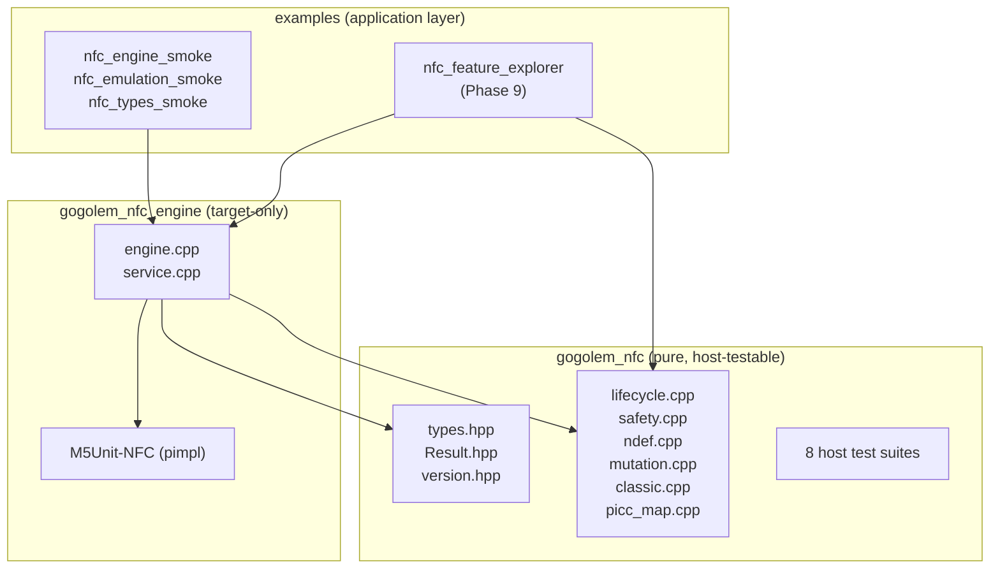
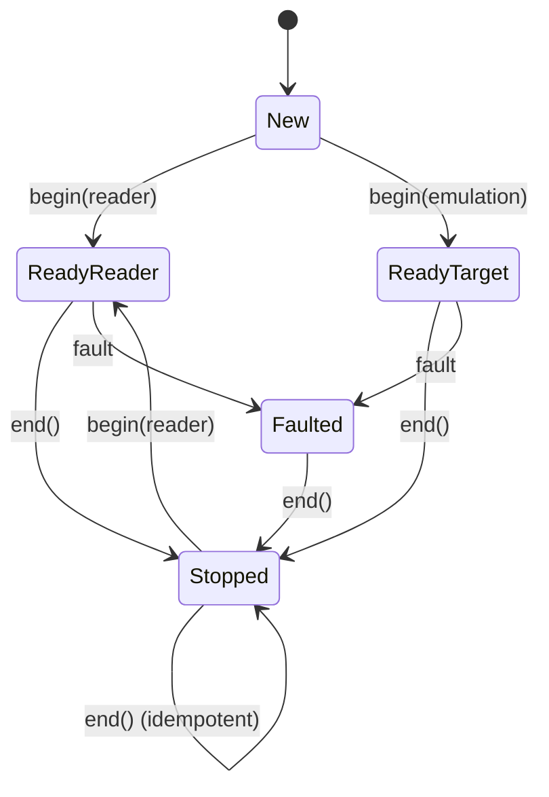
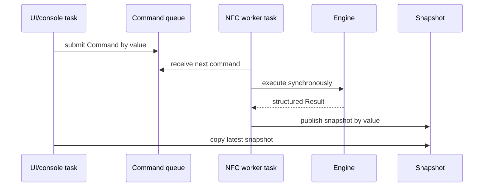

# M5StackChan NFC: Building a Reusable Native ESP-IDF NFC Component

The M5StackChan NFC work produced three working implementations, each solving a different problem, but none of them was a clean, reusable component that another project could consume without carrying diagnostic or application policy with it. `0115-m5stackchan-nfc-reader` is a minimal C transport and anticollision harness with process-wide static state. `0116-m5stackchan-nfc-debug-ui` demonstrates the correct single-worker runtime pattern but embeds its diagnostic schema inside an application overlay. `0117-m5stackchan-nfc-feature-explorer` proves the full NFC-A feature surface through the official M5Unit-NFC library but prints directly to stdout, owns NVS mode persistence, hard-codes demo records and keys, returns mostly `bool`, and has no reusable shutdown contract.

This article documents the extraction of the proven behavior into a reusable native ESP-IDF component named `gogolem_nfc`. The component wraps the pinned M5Unit-NFC protocol layer behind a stable, board-independent API. It separates five concerns: a synchronous instance-based Engine, a single-owner worker Service, optional console/NVS/trace adapters, application-provided policy for confirmation and credentials, and board-provided ownership of the I²C bus. The result is a component whose deterministic foundation is fully host-tested and whose hardware behavior is proven on a real ST25R3916 with a live NTAG215.

> [!summary]
> - The component splits into two ESP-IDF components: `gogolem_nfc` (pure logic, host-testable, no M5Unit-NFC dependency) and `gogolem_nfc_engine` (target-only Engine wrapping M5Unit-NFC via pimpl).
> - Eight host test suites cover domain types, `Result<T>`, lifecycle rules, safety validators, NDEF codec, mutation permits, Classic value-block codec, and PICC→TagInfo conversion — all without hardware or ESP-IDF.
> - The Engine's `begin()`, `scan()`, `activate_one()`, `raw_read()`, `read_ndef()`, `dump()`, `reversible_write()`, `write_ndef()`, and target emulation are all proven on the real ST25R3916 at I²C address `0x50` with a live NTAG215 (UID `04:DA:F7:4D:9E:61:80`).
> - Hardware answered a key design question: the pinned M5Unit-NFC revision cannot re-`begin()` on the same `UnitUnified` instance after `end()`, so the Engine is initialize-once.
> - The REQA→WUPA fallback, first proven in `0117`, is preserved in the Engine and validated: consecutive `activate_one()` calls on a halted stationary tag succeed via WUPA.
> - Mutation safety is machine-checkable: a `MutationPermit` binds the mutation kind to the selected UID, the `is_safe_write_target()` gate rejects protected regions, and `WriteReport` records write, verification, and restoration separately.

## 1. Why a reusable component was needed

The three existing implementations serve different purposes and cannot be directly reused:

| Implementation | Purpose | Reuse limitation |
|---|---|---|
| `0115` | Minimal C transport, RF, anticollision, UID regression | Process-wide static state; only NFC-A reader path; no NDEF/Classic/emulation |
| `0116` | Production NFC LAB UI with single-worker ownership | Diagnostic schema embedded in application overlay; driver predates final protocol fixes |
| `0117` | Full feature explorer (scan, dump, NDEF, Classic, emulation) | Prints directly; owns NVS; hard-codes demo records/keys/UIDs; returns `bool`; no reusable `end()` |

A future project that wants NFC behavior should not have to copy `app_main.cpp`, console handlers, NVS namespaces, board pins, or demo text. It should add one manifest dependency, obtain or create an I²C bus, construct an `Engine` or `Service`, and receive structured results.

The reusable value is not the NFC protocol itself — M5Unit-NFC already provides that. The reusable value is lifecycle, ownership, safety, structured results, worker serialization, and integration adapters, all kept free of console, NVS, LVGL, Mooncake, and board-specific configuration.

## 2. The two-component split

The component is split into two ESP-IDF components to keep the pure logic host-testable:



`gogolem_nfc` contains only standard C++ headers in its public interface. It compiles under a plain `g++` on the host and under the ESP-IDF xtensa toolchain. `gogolem_nfc_engine` requires M5Unit-NFC, `esp_driver_i2c`, and FreeRTOS, and uses pimpl (a `std::unique_ptr<Impl>`) so M5Unit-NFC types never appear in the public `engine.hpp` header.

The package layout is:

```text
components/
├── gogolem_nfc/
│   ├── CMakeLists.txt
│   ├── idf_component.yml
│   ├── LICENSE
│   ├── README.md
│   ├── include/gogolem/nfc/
│   │   ├── types.hpp        domain enums and records
│   │   ├── result.hpp       Result<T> success/failure without exceptions
│   │   ├── version.hpp      component version accessors
│   │   ├── lifecycle.hpp    begin/end/fault state machine rules
│   │   ├── safety.hpp       protected-region validators
│   │   ├── ndef.hpp         NDEF record/message model and codec
│   │   ├── mutation.hpp     UID-bound permits and write-report precedence
│   │   ├── classic.hpp      MIFARE Classic value-block codec
│   │   └── picc_map.hpp     PICC → TagInfo conversion
│   ├── src/
│   │   ├── gogolem_nfc.cpp   version + name helpers
│   │   ├── lifecycle.cpp     begin/end/fault transitions
│   │   ├── safety.cpp        Type 2 + Classic geometry
│   │   ├── ndef.cpp          encode/decode + Type 2 TLV framing
│   │   ├── mutation.cpp      permit matching + write-report logic
│   │   ├── classic.cpp       value-block encode/decode
│   │   └── picc_map.cpp       upstream Type → TagFamily mapping
│   └── test_host/            8 auto-discovered test binaries
└── gogolem_nfc_engine/
    ├── CMakeLists.txt
    ├── idf_component.yml
    ├── include/gogolem/nfc/
    │   ├── engine.hpp        synchronous Engine (pimpl)
    │   └── service.hpp       single-owner FreeRTOS Service
    └── src/
        ├── engine.cpp        M5Unit-NFC wiring
        └── service.cpp       worker task + queues
```

## 3. Domain types and the Result API

The foundation is a set of enums and value types that carry no ESP-IDF, console, or library dependency. They are the stable contract that the Engine, Service, adapters, and consumers all share.

### 3.1 Error classification

A single `bool` cannot distinguish an I²C NACK from an absent tag, a legal collision, a bad NDEF TLV, a rejected Classic key, or a failed restoration. The `ErrorLayer` enum provides the machine-readable classifier:

```cpp
enum class ErrorLayer : uint8_t {
    None, Argument, Lifecycle, Policy, Transport, ChipState,
    Rf, Activation, Collision, Protocol, CardFamily,
    Authentication, Access, DataFormat, Capacity,
    Verification, Restoration, Internal,
};
```

An `Error` struct carries the layer, the raw ESP-IDF code (as `int32_t` to avoid pulling `esp_err.h` into a host-testable header), the upstream code, the operation that produced it, and a fixed-size 96-byte detail buffer:

```cpp
struct Error {
    ErrorLayer layer{ErrorLayer::None};
    int32_t esp_code{ESP_CODE_OK};
    int32_t upstream_code{0};
    Operation operation{Operation::None};
    uint8_t address{0};
    bool retryable{false};
    std::array<char, 96> detail{};
};
```

Callers branch on `layer`, `esp_code`, and `operation`. The `detail` string is diagnostic context, never a classifier.

### 3.2 Result without exceptions

ESP-IDF commonly builds without C++ exception support, and NFC failure is an expected runtime result. The `Result<T>` template is a compact expected-style value that owns either a value of type `T` or an `Error`:

```cpp
auto r = engine.activate_one();
if (r.ok()) {
    use(r.value().tag);
} else {
    log(r.error().layer, r.error().detail.data());
}
```

It is move-only (copying would duplicate value ownership), uses placement new with manual destruction to avoid exceptions, and provides `success()`, `failure()`, `ok()`, `value()`, `take_value()`, and `error()`. A `Result<void>` specialization exists for operations with no return value.

## 4. The lifecycle state machine

The Engine transitions through a defined set of states. The rules are pure functions, host-testable without hardware:



`lifecycle_can_begin()` returns true only from `New` or `Stopped`. `lifecycle_after_begin()` maps the mode to `ReadyReader` or `ReadyTarget`. `lifecycle_after_end()` is idempotent from `Stopped` but rejects `New` ("nothing started") and `Stopping` ("already stopping"). `lifecycle_after_fault()` moves to `Faulted` unless already terminal.

These abstract rules are the basis for the Engine's lifecycle. The Engine adds one binding-specific constraint discovered on hardware: initialize-once.

## 5. Safety validators

The safety validators encode the rule that generic write commands must reject manufacturer, lock, configuration, and sector-trailer regions and may only touch identified ordinary user memory.

### 5.1 Type 2 (Ultralight / NTAG21x)

Type 2 tags expose four-byte pages. User pages are `[first_user, last_user]` inclusive. Everything else — UID/manufacturer, static lock, capability container, dynamic lock, configuration, password — is protected:

```cpp
bool is_type2_user_page(uint16_t address, uint16_t first_user, uint16_t last_user) {
    return address >= first_user && address <= last_user;
}
```

For the known NTAG215, `first_user=4` and `last_user=129`. Pages 0–3 (UID/BCC/internal/capability container) and 130–134 (dynamic lock/configuration) are protected.

### 5.2 MIFARE Classic (1K and 4K aware)

Classic memory is divided into sectors. A 4K card has 32 small sectors (4 blocks each) and 8 large sectors (16 blocks each). The model must be 4K-aware because a 1K-only `block % 4 == 3` rule misclassifies large-sector trailers:

```cpp
uint8_t classic_sector_trailer_block(uint8_t sector, bool is_4k) {
    if (is_4k && sector >= 32) {
        return 128 + (sector - 32) * 16 + 15;
    }
    return sector * 4 + 3;
}
```

Block 0 is the manufacturer block. The last block of every sector is the trailer (Key A, access bits, Key B). The remaining blocks are ordinary data. `is_classic_user_data_block()` rejects manufacturer, trailer, and out-of-range blocks.

### 5.3 The single mutation gate

`is_safe_write_target()` is the single function the Engine consults before any mutation. It dispatches by family:

```cpp
bool is_safe_write_target(TagFamily family, uint16_t address, ...) {
    switch (family) {
        case TagFamily::MifareUltralight:
        case TagFamily::Ntag21x:
            return is_type2_user_page(address, first_user, last_user);
        case TagFamily::MifareClassic:
            return is_classic_user_data_block(address, is_4k, classic_blocks);
        default:
            return false;
    }
}
```

Unknown families are never safe write targets. A generic write path cannot bypass this gate because it is the only entry point.

## 6. The NDEF public model and codec

NDEF (NFC Data Exchange Format) is the interoperable application data layer. The component implements a deterministic, host-testable codec that does not depend on M5Unit-NFC.

### 6.1 Record structure

An NDEF message is an ordered list of records. Each record has a Type Name Format (TNF), a type, an optional identifier, and a payload:

```cpp
struct NdefRecord {
    NdefTnf tnf{NdefTnf::Unknown};
    std::vector<uint8_t> type;
    std::vector<uint8_t> id;
    std::vector<uint8_t> payload;
};
```

The first record sets the MB (Message Begin) flag; the last sets ME (Message End). The SR (Short Record) flag selects a one-byte payload length; long records use four bytes. Chunked records (CF) are rejected on decode.

### 6.2 URI records

A well-known URI record (type `U`) compresses a common prefix using a one-byte URI Identifier Code. The codec includes the full NFC Forum RTD-URI table (0x00–0x23) and selects the longest matching prefix automatically:

```cpp
NdefRecord make_uri_record("https://www.example.com");
// payload[0] = 0x02 ("https://www."), rest = "example.com"
```

### 6.3 Text records

A well-known text record (type `T`) begins with a status byte encoding the language-code length, followed by the language code and UTF-8 text:

```cpp
NdefRecord make_text_record("Native ESP-IDF M5StackChan NFC", "en");
// payload[0] = 0x02 (lang "en"), rest = text bytes
```

### 6.4 Type 2 TLV framing

On a Type 2 Tag, the NDEF message is stored inside an NDEF Message TLV:

```text
03 <length> <serialized NDEF records> FE
```

For messages up to 255 bytes, the length is one byte. Longer messages use `0xFF` followed by a two-byte big-endian length. The codec handles both forms and rejects malformed input (bad lengths, missing MB/ME, chunked records).

The empty NDEF case — `03 00 FE` — is a valid empty NDEF area. The Engine treats `read_ndef()` returning success with zero records as "valid format, no records", not as an error.

## 7. Mutation safety: permits and write reports

### 7.1 UID-bound permits

A `MutationPermit` binds a mutation kind to the selected physical UID so a confirmation phrase cannot mutate the wrong tag:

```cpp
struct MutationPermit {
    std::array<uint8_t, 10> expected_uid{};
    uint8_t expected_uid_length{0};
    MutationKind allowed{MutationKind::None};
    bool require_readback{true};
    bool require_restoration{false};
};
```

`permit_allows()` returns true only when the kind is not `None`, the kind matches, and the tag's UID exactly matches the permit. The Engine consults this before any mutation; it never branches on human confirmation text. The console adapter converts a phrase like `RESTORE-AFTER-TEST` into a `MutationPermit` containing the actual selected UID.

### 7.2 Write-report precedence

A reversible write has multiple phases that can fail independently. A single `bool` cannot represent "write succeeded, verification failed, restoration succeeded" or "restoration failed". The `WriteReport` records each phase separately:

```cpp
struct WriteReport {
    bool write_attempted{false};
    bool write_succeeded{false};
    bool verification_attempted{false};
    bool verification_succeeded{false};
    bool restoration_required{false};
    bool restoration_attempted{false};
    bool restoration_succeeded{false};
    Error first_error{};
};
```

`write_report_ok()` requires a successful write, successful verification, and (when restoration was required) successful restoration. `write_report_primary_failure()` prefers a recorded `first_error.layer`; when none is set, it derives the layer from flags — `Verification` for a verification failure, `Restoration` for a restoration failure.

This precedence is critical: a restoration failure is a high-severity outcome (the tag is changed) and must not be hidden behind a successful write or verification.

## 8. MIFARE Classic value-block codec

Classic value blocks store a signed 32-bit value and an 8-bit address with full redundancy so an interrupted write is detectable. The 16-byte format is:

```text
bytes  0..3:  value, little-endian
bytes  4..7:  bitwise complement of value
bytes  8..11: value repeated
byte      12: address
byte      13: complement of address
byte      14: address repeated
byte      15: complement of address repeated
```

`decode_value_block()` validates all redundant copies and rejects any mismatch. This is what the chip does internally; the component encodes it as pure logic so the Engine can validate a block before treating it as a value block for increment/decrement/transfer.

A notable edge case: an all-zero 16-byte block must be rejected. Value 0 passes the value checks, but address 0 with its complement 0 fails the address-complement check, so a zeroed data block is not misread as value 0 at address 0.

## 9. PICC → TagInfo conversion

The Engine converts upstream M5Unit-NFC `PICC` objects into the stable `TagInfo` at the component boundary. To keep this conversion host-testable without M5Unit-NFC, the module operates on a plain `PiccFields` value type and numeric type codes that mirror the upstream `m5::nfc::a::Type` enum ordinals.

```cpp
TagFamily picc_type_to_family(uint8_t type_code) {
    if (type_code >= picc_type::MifareClassicMini &&
        type_code <= picc_type::MifareClassic4K)
        return TagFamily::MifareClassic;
    if (type_code >= picc_type::MifareUltralight &&
        type_code <= picc_type::MifareUltralightC)
        return TagFamily::MifareUltralight;
    if ((type_code >= picc_type::Ntag203 &&
         type_code <= picc_type::Ntag216) ||
        type_code == picc_type::Ntag4xx)
        return TagFamily::Ntag21x;
    // ... ST25TA, ISO-DEP, Plus, DESFire
    return TagFamily::Unknown;
}
```

A `static_assert` in `engine.cpp` guards that the mirrored ordinals still match the pinned upstream revision. If a dependency upgrade changes the enum order, the build fails and the constants must be re-synced.

The host test converts the known NTAG215 fixture (UID `04:91:D4:4C:9E:61:80`, ATQA `0x0044`, SAK `0x00`, 135 pages, 504 user bytes) to the exact `TagInfo` observed in ESP-60, proving the boundary conversion is correct.

## 10. The synchronous Engine

The Engine is the target-only component that wraps M5Unit-NFC. It is instance-based (not a singleton), accepts an application-owned `i2c_master_bus_handle_t`, and is explicitly not thread-safe. One task calls it at a time; the Service provides multi-task serialization.

### 10.1 Configuration and ownership

```cpp
struct EngineConfig {
    i2c_master_bus_handle_t bus{};   // caller-owned; must outlive the Engine
    uint8_t i2c_address{0x50};
    Mode mode{Mode::Reader};
    EmulationProfile emulation_profile{};
};
```

The application creates and owns the bus. The Engine stores the borrowed handle and must stop before the caller deletes the bus. The Engine does not choose GPIO pins, create a second bus, initialize NVS, start a console, or reboot.

### 10.2 The begin/scan sequence

`begin()` faithfully ports the proven `0117` initialization: configure NFC-A mode and the emulation flag, then `units.add(unit, bus)` and `units.begin()`. With no tag, `scan()` returns success with an empty tag list — a valid no-tag outcome, not an error.

Hardware runtime on the real ST25R3916 (no tag):

```text
smoke begin ok=1 state=ready-reader
smoke scan ok=1 tags=0 state=ready-reader
```

### 10.3 activate_one with REQA→WUPA fallback

The defining Phase 2 behavior is the REQA→WUPA fallback. NFC-A enumeration deliberately HALTs discovered tags, so a stationary tag does not answer the next REQA. The Engine tries REQA first (for an IDLE tag), then WUPA (for a HALT tag), so consecutive commands work without moving the tag:

```cpp
ActivationSource source = ActivationSource::REQA;
if (!reader.request(picc.atqa)) {
    if (!reader.wakeup(picc.atqa)) {
        return Rf error "no tag answered REQA or WUPA";
    }
    source = ActivationSource::WUPA;
}
reader.select(picc);
reader.identify(picc);
reader.reactivate(picc);
```

Hardware runtime on the real NTAG215:

```text
smoke activate ok=1 source=REQA uid=04DAF74D9E6180 family=NTAG21x
smoke activate ok=1 source=WUPA uid=04DAF74D9E6180 family=NTAG21x
smoke activate ok=1 source=WUPA uid=04DAF74D9E6180 family=NTAG21x
```

The first activation uses REQA (tag IDLE from boot); every subsequent activation uses WUPA (tag HALT after `deactivate()`). The UID and family return through the stable public types, not upstream types.

### 10.4 The initialize-once finding

The first smoke loop revealed that after `end()`, a second `begin()` on the same Engine fails because the pinned M5Unit-NFC `UnitUnified::add()`/`begin()` cannot re-initialize on the same instance. This answered design-guide open question #1: the Engine is initialize-once.

The Engine encodes this honestly — `begin()` rejects re-begin with a typed Lifecycle error:

```text
smoke begin ok=0 state=faulted
error: "initialize-once; construct a new Engine"
```

Re-use requires constructing a new Engine (and re-creating the bus if needed). The Service owns one Engine for the process lifetime and restarts by re-creating the bus and Engine on fault.

### 10.5 Raw read, NDEF read, and dump

`raw_read(address)` returns 16 bytes (4 Type 2 pages or 1 Classic block) via upstream `read16`. `read_ndef()` checks NDEF support, validates the format, reads the TLV, and converts upstream records to the public `NdefMessage`. `dump()` reads the entire card through upstream `reader.dump()`.

Hardware runtime on the real NTAG215:

```text
smoke raw_read ok=1 len=16 hex=04DAF7A14D9E618032480000E1103E00
smoke ndef_read ok=1 records=0
smoke dump ok=1  (135 pages: [000/00] through [134/86])
```

The raw read returns the correct UID, BCC, internal bytes, and capability container `E1 10 3E 00`. The NDEF read returns valid with zero records (empty NDEF area `03 00 FE`). The dump reads all 135 pages including configuration pages at 130–134.

### 10.6 Reversible write

`reversible_write(address, permit)` saves the original bytes, writes a test pattern, verifies it, restores the original, and verifies restoration. It uses `is_safe_write_target()` to reject protected regions and `permit_allows()` to verify the UID. It returns a full `WriteReport`.

Hardware runtime on the sacrificial NTAG215 (page 5, user area 4–129):

```text
smoke write ok=1 write=1 verify=1 restore=1
smoke ndef_after_write ok=1 records=0
```

The full cycle works: save → write `D1 A6 05 5A` → verify → restore → verify → NDEF still valid. Repeated across three iterations with WUPA.

### 10.7 NDEF write

`write_ndef(message, permit)` converts the public `NdefMessage` to upstream `TLV` records, checks NDEF support and existing valid format (refusing to convert non-NDEF tags), checks capacity, and writes. The public codec's `encode_ndef_message()` is used to compute the serialized size for the capacity check.

Hardware runtime on the sacrificial NTAG215:

```text
smoke ndef_write ok=1
smoke ndef_readback ok=1 records=2
smoke ndef_record[0] uri=https://m5stack.com/esp60
smoke ndef_record[1] text=Native ESP-IDF M5StackChan NFC lang=en
```

The NDEF write succeeded. The read-back correctly parsed both records through the stable public `NdefMessage`/`NdefRecord` types. The reversible write on page 5 still works after the NDEF write, and the NDEF message is preserved.

## 11. The worker Service

The Service wraps the Engine in a FreeRTOS worker task with a command queue. Other tasks submit bounded commands; the worker executes them one at a time. Snapshots are published by value so consumers never touch mutable Engine state.



The Service owns one Engine, creates two queues (commands and snapshots), and a FreeRTOS task. `start()` calls `engine.begin()` before creating the worker. `stop()` sends a `Shutdown` command and waits for the worker to exit. `submit()` rejects commands after stopping begins. `latest()` copies the snapshot under a mutex.

Hardware runtime on the real NTAG215:

```text
smoke service start ok=1 running=1
smoke snap ops=3 fail=1 tag=0 ndef_ok=1 recs=0 raw_ok=1
smoke snap ops=6 fail=1 tag=1 ndef_ok=1 recs=0 raw_ok=1
smoke snap ops=9 fail=1 tag=1 ndef_ok=1 recs=0 raw_ok=1
```

Nine operations processed by the worker, one failure (the expected first-post-flash REQA), all subsequent operations succeed. The main task reads snapshots by value without touching the Engine.

## 12. Target emulation

The Engine supports NFC-A target emulation through `start_emulation()`, `update_emulation()`, and `emulation_state()`. The caller provides an `EmulationProfile` containing the family, UID, and memory image. The Engine copies the memory, embeds the UID using the same BCC computation as `0117`, and starts the upstream `EmulationLayerA`.

```cpp
struct EmulationProfile {
    TagFamily family{TagFamily::Unknown};
    std::array<uint8_t, 10> uid{};
    uint8_t uid_length{0};
    std::vector<uint8_t> memory;
};
```

The `update_emulation()` method must be called in a tight loop (~1 ms) for target mode. The `EmulationState` enum mirrors the upstream state machine: `None`, `Off`, `Idle`, `Ready`, `Active`, `Halt`.

Hardware runtime (NTAG213 profile, no phone):

```text
smoke begin ok=1 state=ready-target
smoke emu state=off
```

The user validated RF interoperability by reading the emulated NTAG213 (UID `99:88:77:66:55:44:33`) with an iPhone. The phone read the M5Stack URL and text records embedded in the profile memory.

## 13. The host test suite

The component has eight host test suites, all auto-discovered by `test_host/build.sh`:

```text
ALL TESTS PASSED  (test_types)
ALL TESTS PASSED  (test_result)
ALL TESTS PASSED  (test_lifecycle)
ALL TESTS PASSED  (test_safety)
ALL TESTS PASSED  (test_ndef)
ALL TESTS PASSED  (test_mutation)
ALL TESTS PASSED  (test_classic)
ALL TESTS PASSED  (test_picc_map)
```

The build script compiles every `test_host/test_*.cpp` against all `src/*.cpp` with `-Wall -Wextra -Werror -O2` and runs each binary. No ESP-IDF installation is required.

A reproducible validation script (`scripts/03-validate-component.sh`) runs the host tests, checks that no application policy leaked into the core component, and builds the ESP-IDF smoke project:

```bash
rg -n 'printf|ESP_LOG|nvs_|esp_restart|GPIO_NUM|i2c_new_master_bus' \
   components/gogolem_nfc/src components/gogolem_nfc/include
# Expected: no matches — the core is policy-free
```

## 14. The safety architecture

The safety architecture divides mechanism from policy. The Engine enforces invariant safety; the application enforces operator policy.

### 14.1 Mechanism (in the Engine)

- Family and geometry checks via `is_safe_write_target()`
- Protected-region rejection (UID/manufacturer, lock, configuration, trailer)
- UID match against `MutationPermit` via `permit_allows()`
- Capacity checks before NDEF writes
- Readback verification after writes
- Restoration attempt and reporting via `WriteReport`
- No Classic operations on Type 2 tags
- No reader writes in target mode

### 14.2 Policy (in the application)

- Confirmation phrase (`RESTORE-AFTER-TEST`, `REPLACE-NDEF`, `MUTATE-CLASSIC`)
- Which physical tag is sacrificial
- Credential selection (Classic keys)
- Whether a particular NDEF message may replace existing content
- Whether a mode switch should reboot
- Audit logging and user identity

The console adapter converts human confirmation into a typed `MutationPermit` containing the actual selected UID. The Engine never interprets human strings.

### 14.3 No generic unsafe escape hatch

Version one does not include `--unsafe`, `force=true`, or a generic arbitrary-page bypass. Such flags collapse family-specific rules into one unreviewable path. Lock bits, passwords, DESFire formatting, and Classic key changes require dedicated operations with separate designs.

## 15. Hardware validation summary

| Phase | Operation | Hardware result |
|---|---|---|
| 0 | Read-only baseline | scan/info/raw-read/ndef-read/dump all ok=1 |
| 2 | Engine begin/scan | begin ok=1, scan ok=1 tags=0 (no-tag) |
| 2 | activate_one + WUPA | REQA then WUPA on halted tag, repeated |
| 3 | raw_read | 16 bytes incl. capability container `E1 10 3E 00` |
| 3 | read_ndef | valid, zero records (empty NDEF) |
| 3 | dump | 135 pages (0–134) |
| 4 | Service worker | 9 ops through queue, 1 expected failure |
| 5 | Emulation init | begin ok=1 state=ready-target |
| 5 | Emulation RF | iPhone reads emulated NTAG213 |
| 6 | Reversible write | write=1 verify=1 restore=1, NDEF valid after |
| 7 | NDEF write | write ok=1, readback 2 records (URI + text) |

All hardware validation used the same NTAG215 (UID `04:DA:F7:4D:9E:61:80`) on the M5StackChan ST25R3916 at I²C address `0x50`, USB Serial/JTAG console, ESP-IDF 5.5.4.

## 16. What the component does not do

The component is deliberately scoped. Version one does not:

- create an I²C bus from hard-coded pins (the application owns the bus)
- initialize or erase global NVS (the application or an adapter does)
- reboot the MCU (the application or an adapter does)
- own LVGL, Mooncake, USB Serial/JTAG, or a shell
- format DESFire cards or convert arbitrary non-NDEF tags
- change NTAG lock bits, passwords, or configuration pages
- promise runtime reader-to-target mode switching (the Engine is initialize-once)
- present a C ABI (deferred until a real C consumer exists)
- claim formal NFC Forum conformance from interoperability tests

## 17. Dependency management

The direct M5Unit-NFC dependency is pinned:

```yaml
dependencies:
  idf:
    version: ">=5.5.2,<6.0"
  m5stack/M5Unit-NFC:
    git: https://github.com/m5stack/M5Unit-NFC.git
    version: 93745b547364f310cd64b5155a870103a7800a5d
```

Each consuming project commits a `dependencies.lock` recording the exact transitive revisions:

```text
M5Unit-NFC    = 93745b547364f310cd64b5155a870103a7800a5d
M5UnitUnified = bf711f370047cf16355b00005450ef615fab36e2
M5HAL         = 0f06f9d3134706ce030fd5515601cce65a267233
M5Utility     = 301a6b5c6413875e1dd80b027e0639921972b433
```

Build artifacts (`build/`, `managed_components/`, `sdkconfig`) are gitignored. Source, `idf_component.yml`, and `dependencies.lock` are committed.

## 18. Phase status

| Phase | Description | Status |
|---|---|---|
| 0 | Prove baseline | ✅ hardware |
| 1 | Component skeleton, types, Result | ✅ build + host + runtime |
| 2 | Engine begin/scan/activate_one/WUPA | ✅ hardware |
| 3 | raw_read, read_ndef, dump | ✅ hardware |
| 4 | Worker Service | ✅ hardware |
| 5 | Target emulation | ✅ hardware (iPhone) |
| 6 | Mutation permits, reversible write | ✅ hardware (sacrificial NTAG215) |
| 7 | NDEF write | ✅ hardware (sacrificial NTAG215) |
| 8 | Classic value-block codec | ✅ host tests (hardware needs Classic card) |
| 9 | Migrate 0117 to component example | in progress |
| 10 | Integrate into NFC LAB | pending |

Phase 8's pure logic (value-block encode/decode, credentials) is host-tested and complete. Hardware wallet validation is blocked because no MIFARE Classic card is available.

## 19. Project paths

```text
Repository:
/home/manuel/code/wesen/go-go-golems/esp32-s3-m5

Pure component:
components/gogolem_nfc/

Engine component:
components/gogolem_nfc_engine/

Examples:
examples/nfc_types_smoke/
examples/nfc_engine_smoke/
examples/nfc_emulation_smoke/
examples/nfc_feature_explorer/  (Phase 9, in progress)

Ticket:
ttmp/2026/08/22/ESP-61-REUSABLE-NFC-COMPONENT--extract-reusable-native-esp-idf-nfc-component/
```

## 20. Related vault notes

- [[ARTICLE - M5StackChan NFC - Solving the Native ESP-IDF Reader from First Principles]]
- [[ARTICLE - M5StackChan NFC - From RF Fields to NDEF and Tag Emulation]]
- [[ARTICLE - M5StackChan NFC - From Arduino Reference Firmware to an ESP-IDF Diagnostic System]]
- [[ARTICLE - M5StackChan NFC - Porting the ST25R3916 Reader to ESP-IDF]]
- [[ARTICLE - M5StackChan NFC LAB - Building an On-Device NFC Diagnostic Firmware]]

The earlier notes document the root-cause diagnosis, the feature explorer, and the transport debugging. This article documents the extraction of that proven behavior into a reusable component.

## 21. Working rules

The durable operating rules from this work:

- Split pure logic from target-only code so the pure logic is host-testable without hardware.
- Mirror upstream enum ordinals as constants and guard them with `static_assert` so dependency upgrades are caught at build time.
- Use pimpl to keep upstream library types out of public headers.
- Make no-tag a success with an empty result, not an error.
- Make the mutation gate a single function that dispatches by family; never add a generic unsafe bypass.
- Bind mutations to the selected UID through a typed permit, not a human string.
- Record write, verification, and restoration separately; a restoration failure is high-severity.
- Treat the empty NDEF case (`03 00 FE`) as success with zero records.
- Encode the initialize-once constraint as a typed error rather than hiding it.
- The application owns the bus; the component owns NFC state.
