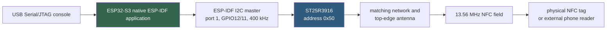
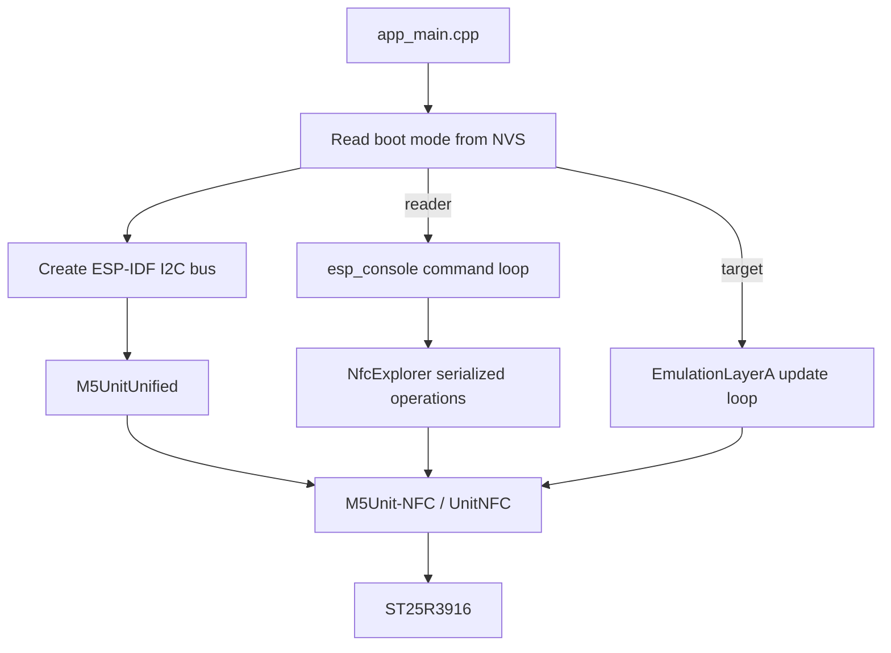
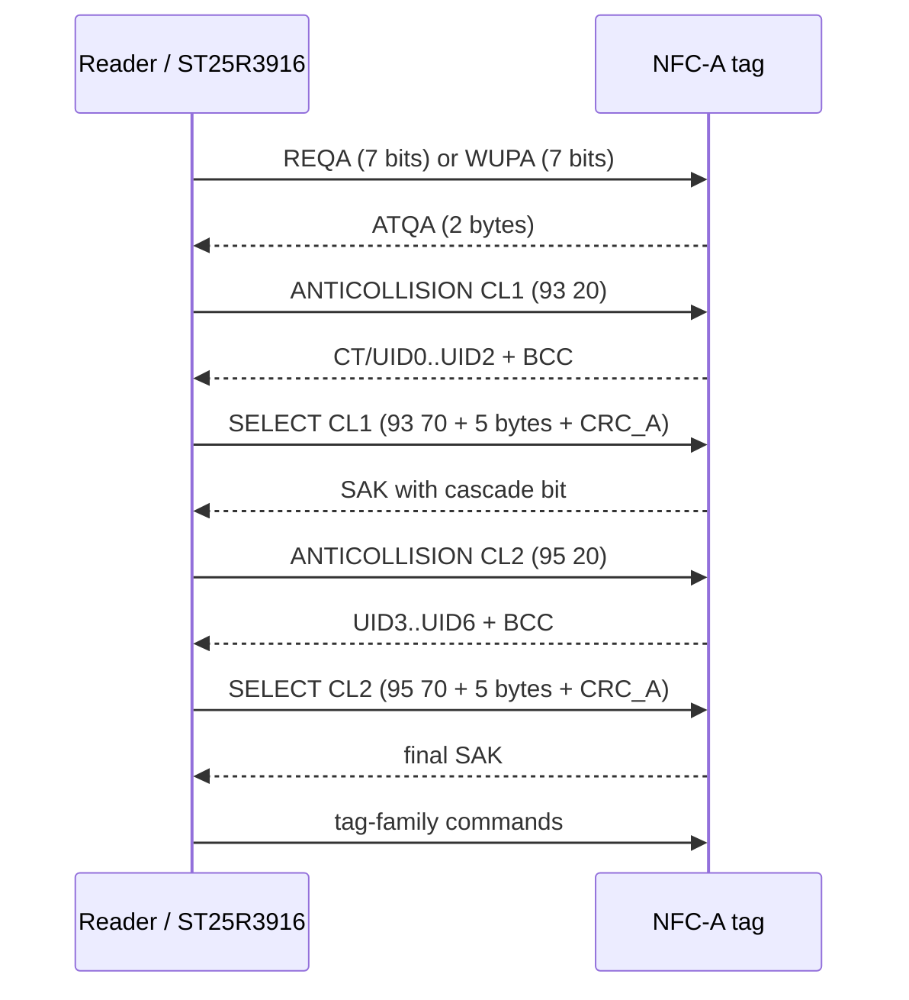
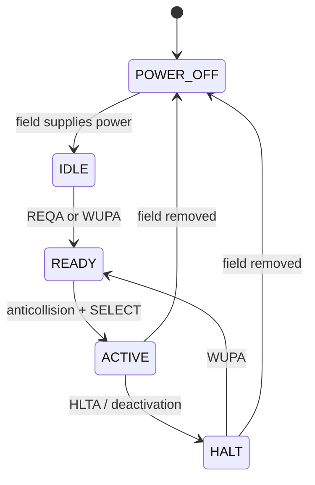
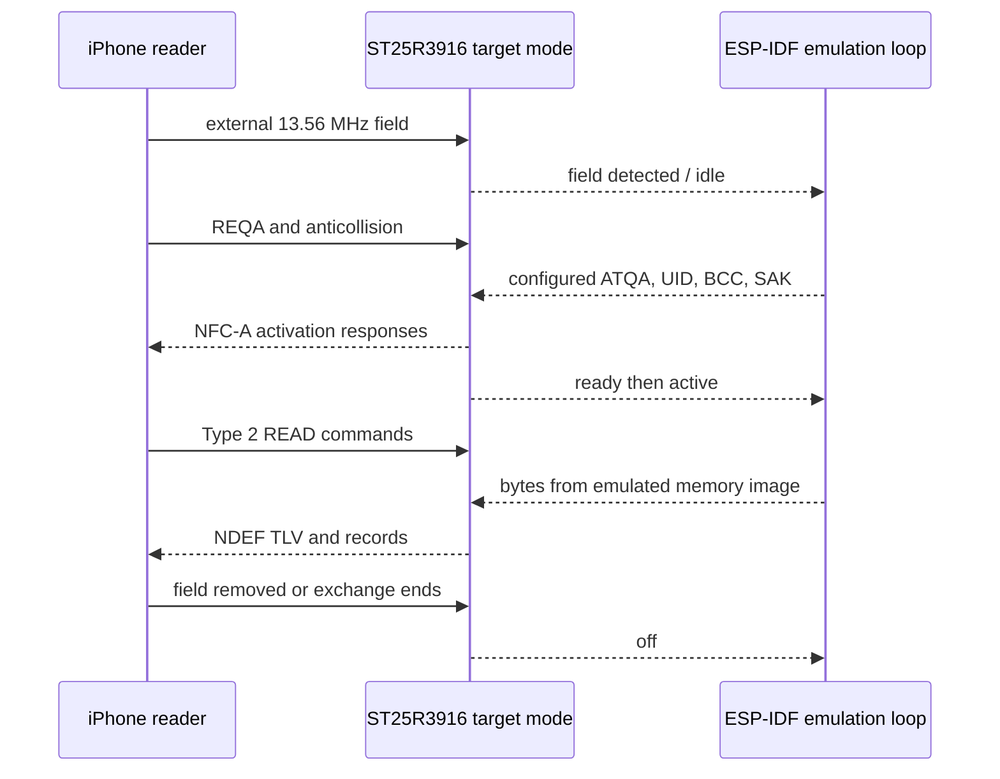
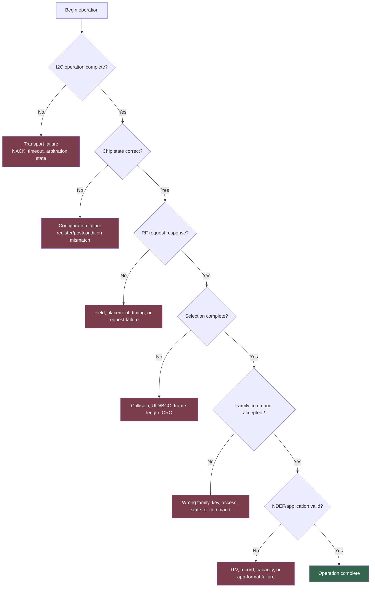

# M5StackChan NFC: From RF Fields to NDEF and Tag Emulation

M5StackChan now runs a native ESP-IDF NFC feature explorer that can act as either an NFC reader or an emulated NFC-A tag. In reader mode it identifies cards, reads raw memory, parses NDEF messages, dumps complete tags, and exposes guarded write experiments. In target mode the same ST25R3916 presents an emulated MIFARE Ultralight or NTAG213 to a phone. Both target profiles have completed real over-the-air exchanges with an iPhone.

This article explains the complete system: the 13.56 MHz physical interface, NFC-A discovery and selection, the ST25R3916 reader front end, tag state transitions, UID cascade levels, NTAG215 memory, Type 2 Tag formatting, NDEF records, MIFARE Classic sectors and value blocks, target emulation, the native ESP-IDF architecture, and the operating procedures for safe experimentation. It also records the distinction between capabilities proved on hardware and operations that remain intentionally untested because they mutate physical cards.

> [!summary]
> - NFC is a family of radio technologies and protocol layers. A successful UID read proves RF activation and card selection, but it does not by itself prove memory access, NDEF support, authentication, application protocols, or target emulation.
> - M5StackChan uses an ESP32-S3 to control an ST25R3916 over I²C. The ST25R3916 generates and receives the 13.56 MHz signal; firmware still owns configuration, command sequencing, collision handling, card-family logic, and application data.
> - The physical test tag is an NFC Forum Type 2 NTAG215 with UID `04:91:D4:4C:9E:61:80`, 135 four-byte pages, 504 bytes of user memory, and a valid empty NDEF area.
> - Project `0117-m5stackchan-nfc-feature-explorer` implements native ESP-IDF equivalents for all six official StackChan NFC example families. Read-only behavior and both emulation profiles are proven. Raw writes, NDEF replacement, and MIFARE Classic wallet mutation remain guarded experiments for explicitly sacrificial tags.

## 1. What NFC includes

Near Field Communication operates at 13.56 MHz and defines short-range communication between an initiator that creates or controls an RF exchange and a target that responds. The term *NFC* covers several related radio technologies, framing rules, activation procedures, data-exchange protocols, and application formats. Treating NFC as a single command obscures the boundaries that matter during implementation and diagnosis.

A complete interaction may involve these layers:

| Layer | Responsibility | M5StackChan example |
|---|---|---|
| RF and analog front end | Generate the carrier, modulate it, receive load modulation, detect field and collisions | ST25R3916 transmitter, receiver, antenna, regulators, measurements |
| NFC technology | Define modulation, coding, frame timing, polling, and activation | NFC-A at 106 kbit/s for NTAG and MIFARE cards |
| Discovery and selection | Find one card among zero, one, or many cards | REQA/WUPA, ATQA, anticollision, SELECT, SAK |
| Tag command set | Read and write memory or execute family-specific commands | Type 2 `READ`, NTAG page write, Classic authentication and value operations |
| Data format | Describe application data in interoperable records | NDEF URI and text records inside a Type 2 TLV |
| Application | Interpret the records and decide what action to offer | iPhone opens a URL or an NFC utility displays records |

This separation explains why several statements can all be true:

- A reader can detect RF activity but fail to receive a valid frame.
- A card can answer REQA but fail during anticollision.
- A card can return a UID but reject every memory read that requires authentication.
- Raw memory can be readable while the NDEF structure is invalid.
- An NDEF message can be valid while a phone declines to launch an action.
- A reader front end can support NFC-B, NFC-F, and NFC-V while the current application implements only NFC-A.

The feature explorer reports these boundaries separately instead of reducing all outcomes to “tag found” or “tag missing.”

## 2. Operating modes and roles

NFC devices can participate in several modes. The terminology varies between standards and APIs, but the role distinction remains precise.

### 2.1 Reader/writer mode

The NFC device produces the field, polls for tags, selects a target, and issues commands. Passive tags obtain operating power from the field and answer by modulating their load. M5StackChan reader mode uses this path to identify and read the physical NTAG215.

### 2.2 Card emulation or target mode

The device behaves as a contactless card toward an external reader. M5StackChan configures the ST25R3916 as an NFC-A target and supplies an in-memory Ultralight or NTAG213 image. An iPhone then performs the polling and reader side of the exchange.

The ST25R3916 target-mode trace observed during the successful iPhone test included:

```text
NFC_EMULATION state=idle mode=emulation-ntag213
NFC_EMULATION state=ready mode=emulation-ntag213
NFC_EMULATION state=active mode=emulation-ntag213
NFC_EMULATION state=off mode=emulation-ntag213
```

`ready` means the target has answered initial NFC-A activation. `active` means the reader selected it and can issue tag commands. `off` means no usable external field is currently present or the activation ended. The repeated transitions are expected when a phone retries, changes its antenna position, or ends one transaction and starts another.

### 2.3 Peer-to-peer mode

NFC peer-to-peer communication uses NFC-DEP over active or passive NFC communication modes. It is distinct from exposing a Type 2 memory image. The ST25R3916 supports NFC initiator and target functions beyond the feature explorer’s current Type 2 work, but `0117` does not expose a peer-to-peer application.

### 2.4 Reader and target mode are mutually exclusive in this firmware

Reader mode and target mode require different ST25R3916 initialization and runtime loops. The explorer selects one mode from NVS before initializing the device. A command that reads or writes a physical tag is therefore rejected while target emulation is active:

```text
NFC_RESULT op=ndef-write-demo ok=0 reason=emulation-mode current=emulation-ntag213
```

This is not a failed card write. The operation is refused before any physical card command is attempted. Switching mode requires an explicit reboot:

```text
nfc-mode reader --confirm REBOOT
nfc-mode emulation-ultralight --confirm REBOOT
nfc-mode emulation-ntag213 --confirm REBOOT
```

The persisted mode makes boot behavior deterministic and avoids relying on incomplete runtime teardown of the RF and protocol state machines.

## 3. The 13.56 MHz physical exchange

NFC reader communication begins when the ST25R3916 drives alternating current through the antenna matching network. The resulting magnetic field couples to a nearby tag antenna. A passive tag rectifies energy from that field to power its logic. The reader transmits by modulating the field according to the selected NFC technology. The tag answers through load modulation: it changes the electrical load presented by its antenna, and the reader detects the resulting sidebands and amplitude changes.

The usable range depends on antenna geometry, tuning, field strength, coupling, orientation, nearby conductive material, receiver sensitivity, and protocol timing. It is not determined solely by software transmit power. M5StackChan’s NFC antenna is the literal narrow top edge of the head. Correct tag placement is therefore on that edge, not against the display or the center of the enclosure.

An external phone reader should not be expected to read a physical tag while that tag remains on M5StackChan’s energized reader antenna. Two active readers can interfere, and both may attempt to control the same passive target. For phone testing of a physical tag, first finish the M5StackChan operation, remove the tag from the StackChan antenna, then present it to the phone’s NFC antenna.

### 3.1 Reader-side signal responsibilities

The ST25R3916 integrates substantial RF functionality:

- carrier generation and transmitter control;
- receiver gain and demodulation paths;
- automatic antenna tuning support and amplitude/phase measurements;
- FIFO buffering;
- ISO 14443 and NFC framing assistance;
- CRC generation and checking;
- no-response and general-purpose timers;
- collision and interrupt reporting;
- low-power field detection;
- initiator, target, reader, and card-emulation support.

It does not decide the application sequence by itself. Firmware must configure operating mode, enable transmitter and receiver, load frame bytes, set the exact number of transmitted bits, issue commands, interpret interrupts, read the FIFO, handle collisions, and continue the protocol.

This distinction produced one of the project’s central lessons. The ST25R3916 can execute a direct REQA command successfully while FIFO-based anticollision remains broken. REQA proves the direct-command path and initial RF response; it does not prove that general FIFO transmission length is configured correctly.

## 4. M5StackChan hardware and software architecture

The physical command path is:



The relevant hardware configuration is:

```text
MCU:                 ESP32-S3 in M5Stack CoreS3
NFC front end:       ST25R3916
I2C controller:      port 1
SDA:                 GPIO12
SCL:                 GPIO11
I2C frequency:       400 kHz
ST25R3916 address:   0x50
Operator console:    USB Serial/JTAG at 115200 baud
Antenna location:    narrow top edge of the StackChan head
```

There are two intentionally separate native ESP-IDF projects.

### 4.1 `0115`: the minimal protocol and transport harness

`0115-m5stackchan-nfc-reader` contains a small C implementation used to isolate:

- I²C register and FIFO operations;
- ST25R3916 initialization and readback;
- RF field state;
- REQA/WUPA;
- NFC-A anticollision and SELECT;
- UID assembly;
- transaction tracing and first-error capture;
- runtime `idf-high` versus explicit `idf-defined` transport A/B tests.

Its purpose is narrow observability. It proved that native ESP-IDF can print the real UID on both transport backends with zero failed operations.

### 4.2 `0117`: the card-family feature explorer

`0117-m5stackchan-nfc-feature-explorer` uses the official M5Unit-NFC protocol implementation under pure ESP-IDF. It covers the broader feature families from M5Stack’s Arduino examples without introducing Arduino or `Wire`:

1. scan and precise identification;
2. complete memory dump;
3. Ultralight and NTAG213 target emulation;
4. raw page/block read and guarded write testing;
5. NDEF validation, parsing, and guarded replacement;
6. MIFARE Classic value-block inspection and wallet operations.

The application creates the ESP-IDF I²C bus and passes its `i2c_master_bus_handle_t` to M5UnitUnified. The official NFC component owns ST25R3916 and higher protocol behavior, while the application retains board-level bus ownership.



The direct dependency is pinned at:

```text
M5Unit-NFC 93745b547364f310cd64b5155a870103a7800a5d
```

`dependencies.lock` records the exact M5UnitUnified, M5Utility, M5HAL, and other transitive revisions.

## 5. NFC-A polling and card selection

The current tags use NFC-A, based on ISO/IEC 14443 Type A activation. The reader cannot begin by requesting an arbitrary UID register. It establishes a field, asks cards to enter the discovery process, resolves collisions, selects one UID cascade at a time, and receives a final selection response.

A successful path is:



### 5.1 REQA and WUPA

`REQA` asks cards in the IDLE state to enter the READY state. It is a seven-bit short frame, not a normal eight-bit byte command. Cards already in HALT do not answer REQA.

`WUPA` has a similar initial role but also wakes cards in HALT. This distinction became directly visible in `0117`. The first implementation ran `nfc-scan`, which enumerated and deliberately halted the selected card. The next command sent REQA and reported no tag even though the card had not moved.

The corrected single-card activation is:

```text
send REQA
if REQA receives no card:
    send WUPA
perform SELECT
identify card family
reactivate as required by the family layer
```

After that change, the stationary NTAG215 passed scan, info, raw read, NDEF read, and complete dump in one session. The problem was persistent NFC-A card state, not I²C transport or antenna instability.

### 5.2 ATQA

ATQA is the two-byte Answer To Request for NFC-A activation. It communicates activation characteristics used by the selection process. It is not a unique product identifier. The physical NTAG215 and both emulated profiles use:

```text
ATQA = 0x0044
```

ATQA must be interpreted together with UID structure, SAK, protocol responses, and memory behavior. Different products can share the same ATQA/SAK combination.

### 5.3 Anticollision

Multiple cards may answer the initial request. NFC-A anticollision resolves their UIDs bit by bit. A collision is therefore a protocol event, not automatically an electrical or software error. The reader identifies the collision position, chooses a branch, continues the known UID prefix, and eventually selects one card. It can halt that card and repeat the process to enumerate others.

The selection command byte identifies the cascade level:

| Cascade level | SEL byte | UID coverage |
|---|---:|---|
| CL1 | `0x93` | Complete four-byte UID, or cascade tag plus first three UID bytes |
| CL2 | `0x95` | Remaining bytes for seven-byte UID, or another partial level |
| CL3 | `0x97` | Final bytes for ten-byte UID |

NVB, the Number of Valid Bits, tells tags how much of the anticollision/select frame contains a valid prefix. `0x20` means the command has two complete bytes and no UID prefix bits. `0x70` means the full seven-byte SELECT body precedes CRC_A.

### 5.4 UID cascade structure for the measured NTAG215

The physical card UID is:

```text
04:91:D4:4C:9E:61:80
```

Because it is seven bytes long, selection uses two cascade levels. CL1 includes the cascade tag `0x88` followed by the first three UID bytes:

```text
CL1 data: 88 04 91 D4 C9
          └─┬────────┘ └┬┘
          4 BCC inputs  BCC1

BCC1 = 88 XOR 04 XOR 91 XOR D4 = C9
```

CL2 carries the remaining four UID bytes:

```text
CL2 data: 4C 9E 61 80 33
          └─────┬─────┘ └┬┘
             UID bytes    BCC2

BCC2 = 4C XOR 9E XOR 61 XOR 80 = 33
```

The first three raw pages observed on the NTAG215 preserve exactly these values:

```text
page 0: 04 91 D4 C9
page 1: 4C 9E 61 80
page 2: 33 48 00 00
```

The BCC bytes protect anticollision UID blocks from simple bit errors. They are not cryptographic authentication.

### 5.5 SAK and cascade completion

After each SELECT, the tag returns SAK, the Select Acknowledge. The cascade bit indicates whether another UID cascade level follows. The final SAK for the physical tag is:

```text
SAK = 0x00
```

That value is consistent with the Type 2 Ultralight/NTAG family and does not request ISO-DEP activation. It does not uniquely distinguish NTAG213, NTAG215, and NTAG216. Exact identification requires additional product/version or memory behavior.

## 6. NFC-A card states

A reader command changes card state. That state persists while the card remains powered by the RF field.



The practical consequences are:

- REQA is not a universal reset command.
- Enumeration often halts each selected card so remaining cards can be discovered.
- A command sequence must either preserve the active card, wake a halted card with WUPA, or remove and re-establish the field.
- Moving the card away removes power and returns volatile protocol state to its power-on condition.

The `0117` WUPA correction is a small implementation change with broad protocol significance. It makes consecutive console commands compatible with a continuously powered stationary tag.

## 7. NFC tag families and NFC Forum tag types

Product families, radio technologies, and NFC Forum tag types describe different dimensions. A product name such as NTAG215 identifies a particular chip. NFC-A identifies its activation technology. NFC Forum Type 2 specifies how a reader accesses NDEF data over that technology.

A compact map is:

| NFC Forum type | Underlying technology | Typical products/protocol | Characteristics |
|---|---|---|---|
| Type 1 | NFC-A / ISO 14443A-derived | Topaz/Jewel | Simple memory tags; less common in new designs |
| Type 2 | NFC-A | MIFARE Ultralight, NTAG21x | Four-byte pages, compact commands, common phone-readable tags |
| Type 3 | NFC-F | FeliCa | Block-oriented services and systems |
| Type 4 | NFC-A or NFC-B with ISO-DEP | DESFire and smart-card-style products | APDU-based files and richer security/application models |
| Type 5 | NFC-V / ISO 15693 | Vicinity tags | Different coding and longer practical range under suitable readers |

The ST25R3916 silicon supports a broad set including NFC-A, NFC-B, NFC-F, NFC-V, ISO 18092 initiator/target modes, and card emulation. The current `0117` feature explorer focuses on NFC-A and the product families represented by M5Stack’s examples. Silicon capability does not imply that every protocol is exposed by the application.

## 8. The physical NTAG215

The measured tag was identified as:

```text
UID:                 04:91:D4:4C:9E:61:80
Product:             NTAG215
ATQA:                0x0044
SAK:                 0x00
Memory units:        135 pages
Bytes per page:      4
Total address space: 540 bytes
Reported user area:  504 bytes
NFC Forum type:      Type 2
NDEF state:          valid format, zero records at capture time
```

NTAG213, NTAG215, and NTAG216 are NFC Forum Type 2 Tag ICs. They use NFC-A at 106 kbit/s and expose page-oriented EEPROM plus product metadata, lock configuration, counters, password features, and configuration areas. They are not MIFARE Classic cards and do not implement Classic sectors, Crypto1 authentication, or Classic value-block commands.

### 8.1 Page organization

A page is four bytes. The broad NTAG215 organization is:

| Region | Purpose |
|---|---|
| Manufacturer and UID pages | UID, BCC values, internal/manufacturer data |
| Static lock and capability data | Lock controls and NFC Forum capability container |
| User memory | TLVs, NDEF message, application bytes |
| Dynamic lock/configuration area | Lock coverage, password/access settings, counters, mirror and RF behavior settings depending on product |

The explorer reports pages 4 through 129 as the general user range, but the NFC Forum capability container advertises a specific NDEF data-area extent. Application code must distinguish total EEPROM, general user bytes, NDEF data-area size, current TLV overhead, and maximum record payload. These quantities are related but not interchangeable.

### 8.2 Capability container

Page 3 contains:

```text
E1 10 3E 00
```

For an NFC Forum Type 2 Tag, these bytes communicate:

| Byte | Value | Meaning |
|---|---:|---|
| Magic | `E1` | NFC Forum Type 2 formatting is present |
| Version/access | `10` | Mapping version 1.0 and access information |
| Data-area size | `3E` | `0x3E × 8 = 496` bytes in the advertised data area |
| Access conditions | `00` | Read/write access according to the CC encoding |

The 496-byte data area contains TLVs, not 496 bytes of arbitrary NDEF payload. The NDEF TLV consumes type and length bytes, and each NDEF record contains its own header, type, optional identifier, and payload fields. The maximum useful application payload is therefore smaller.

### 8.3 Initial NDEF bytes

At capture time page 4 contained:

```text
03 00 FE 00
```

The bytes parse as:

```text
03    NDEF Message TLV type
00    NDEF Message length = 0 bytes
FE    Terminator TLV
00    unused/padding byte
```

This is a valid NDEF-formatted tag with no NDEF records. “Valid” means the storage structure conforms to the expected Type 2 mapping. It does not mean that the tag currently contains a URL, text, or other application record.

### 8.4 Locking and protected memory

NTAG lock and configuration writes require special care. Some lock bits are one-time programmable or only transition toward a more restrictive state. Password configuration can make later writes or reads require credentials. Manufacturer and UID bytes are not ordinary application storage. A generic write command must therefore reject UID pages, lock bytes, configuration pages, and protected regions unless a dedicated operation implements the product-specific rules.

The feature explorer’s reversible write test accepts only identified user addresses and attempts this sequence:

```text
read original bytes
write test pattern
read and verify test pattern
write original bytes
read and verify restoration
```

This is safer than an unverified write, but it is not risk-free. RF loss, reset, or communication failure after the test write can prevent restoration. The command consequently requires the exact token `RESTORE-AFTER-TEST` and should be used only on a named sacrificial tag.

## 9. Type 2 Tag commands

Type 2 products expose compact commands after NFC-A selection. Exact command availability depends on the product and version. Common operations include:

| Operation | Purpose |
|---|---|
| `READ` | Read a group of pages, typically returning 16 bytes beginning at the addressed page |
| `FAST_READ` | Read a larger contiguous page range on products that support it |
| `WRITE` | Write one four-byte page |
| `GET_VERSION` | Return product/version and storage-size information |
| `READ_SIG` | Read an originality signature on supporting products |
| `PWD_AUTH` | Authenticate with a configured password and receive password acknowledgement |
| Counter/config commands | Inspect or change product-specific counters and behavior |

The explorer’s `nfc-raw-read <address>` reflects the hardware command behavior rather than printing only one page. Reading address 0 returned 16 bytes covering pages 0 through 3:

```text
04 91 D4 C9 4C 9E 61 80 33 48 00 00 E1 10 3E 00
```

Those bytes contain UID/BCC material, internal/static control bytes, and the capability container. Raw memory output is useful for diagnosis, but application code should use identified memory boundaries and NDEF parsers rather than hard-coding offsets from one product.

## 10. NDEF: interoperable application data

NDEF, the NFC Data Exchange Format, serializes one or more records into a compact binary message. NDEF does not define the RF carrier or card selection process. It begins after the reader has selected a card and found the tag-type-specific storage container.

An NDEF message is:

```text
NDEF message
├── record 1
├── record 2
└── ...
```

Each record contains:

- a header with flags and Type Name Format;
- the type length;
- the payload length;
- an optional identifier length;
- the type bytes;
- an optional identifier;
- the payload.

### 10.1 Record header flags

The first byte includes these fields:

| Field | Meaning |
|---|---|
| MB | This record begins the NDEF message |
| ME | This record ends the NDEF message |
| CF | The payload is chunked across records |
| SR | Payload length uses the one-byte short-record form |
| IL | An identifier-length field is present |
| TNF | Type Name Format: empty, NFC well-known, MIME, absolute URI, external, unknown, or reserved |

A single short URI record usually sets both MB and ME. In a two-record message, the first record sets MB and the second sets ME.

### 10.2 URI records

The NFC well-known URI record has type `U`. Its payload begins with a URI Identifier Code that compresses a common prefix such as `https://`, followed by the remaining URI characters. A phone reconstructs the final URI before presenting an action.

The explorer’s demonstration message includes:

```text
https://m5stack.com/esp60
```

The source constructs it as:

```cpp
uri.setURIPayload("m5stack.com/esp60", URIProtocol::HTTPS)
```

The protocol enum supplies the `https://` prefix code. The stored payload is therefore more compact than storing the full URL as untyped text.

### 10.3 Text records

An NFC well-known text record has type `T`. Its payload begins with a status byte that encodes text encoding and language-code length, followed by the language code and text bytes. The demonstration record is:

```text
language: en
text: Native ESP-IDF M5StackChan NFC
```

The complete demo NDEF message contains both URI and text records. A phone’s background reader may prioritize the actionable URI notification, while an NFC inspection application can display both records.

### 10.4 Type 2 TLV storage

On a Type 2 Tag, the NDEF message is placed inside an NDEF Message TLV:

```text
03 <length> <serialized NDEF records> FE
```

For short messages, the length fits in one byte. Larger Type 2 messages use the extended-length encoding defined by the mapping. The terminator `FE` marks the end of meaningful TLVs.

Other TLV types can describe null padding, lock-control information, memory-control information, or proprietary data. A parser must advance by each TLV’s encoded length rather than assuming that byte 0 of the data area is always an NDEF message.

### 10.5 Writing NDEF safely

`nfc-ndef-write-demo --confirm REPLACE-NDEF` performs more than a raw page write:

```text
require reader mode
activate and identify one card
verify that the card family supports NDEF
verify that a valid NDEF format already exists
construct URI and text records
calculate required capacity
refuse if the message exceeds the reported user area
write the NDEF TLV/message
read it back
parse and print the result
```

The implementation intentionally refuses to convert a non-NDEF Ultralight tag and refuses automatic DESFire formatting. Formatting changes tag structure and sometimes access configuration; it deserves a separate command and safety contract.

The exact confirmation token prevents accidental shell invocation. It cannot confirm that the intended physical tag is on the antenna. A future write workflow should add a UID allow-list and print the selected UID immediately before mutation.

### 10.6 iPhone behavior

For a physical tag test:

1. Put the firmware in reader mode.
2. Place the tag on M5StackChan and perform the write/readback.
3. Remove the tag completely from M5StackChan’s field.
4. Unlock the iPhone.
5. Present the tag to the iPhone’s NFC antenna near the top edge/camera area.
6. Use an NFC inspection application if background reading does not show a notification.

For target-emulation testing, the phone reads M5StackChan directly. No physical tag should remain on the StackChan antenna during that test.

## 11. Tag emulation in `0117`

Target emulation reverses the reader relationship. The iPhone produces the field and sends NFC-A commands. The ST25R3916 detects the external field and passes target-mode events to the emulation layer. Firmware answers selection and memory commands from a RAM image.



### 11.1 Emulated profiles

The firmware includes two profiles derived from the official examples:

| Profile | UID | ATQA | SAK | Memory image |
|---|---|---:|---:|---:|
| MIFARE Ultralight | `04:34:56:78:9A:BC:DE` | `0x0044` | `0x00` | 64 bytes |
| NTAG213 | `99:88:77:66:55:44:33` | `0x0044` | `0x00` | 180 bytes |

The UID and BCC bytes embedded in the memory image must agree with the anticollision responses. A mismatch can allow initial activation but expose inconsistent raw UID pages to a reader application.

### 11.2 What the successful phone test proves

The earlier automated capture proved that both profiles initialized locally. The later interactive iPhone test added over-the-air evidence: both profiles were readable, and the NTAG213 state machine reached `ready` and `active` repeatedly.

That proves:

- the ST25R3916 detects the iPhone’s field;
- NFC-A target activation works;
- the configured UID/ATQA/SAK path is accepted by the phone;
- the emulated Type 2 memory can be read sufficiently for the phone to recognize it;
- target state transitions are visible through the native ESP-IDF console.

It does not prove conformance for every Type 2 command, every phone model, writes to emulated memory, long-duration field behavior, or every timing corner. Those require a larger interoperability test matrix.

### 11.3 Why target state returns to `off`

A phone may energize the field briefly, poll, read enough data to classify the target, and then stop. Position changes can also move coupling below the receiver threshold. The state sequence can therefore include several `idle`, `ready`, `active`, and `off` cycles during one operator attempt. The meaningful evidence is that activation reaches `active`, not that it stays there indefinitely.

## 12. MIFARE Classic and value blocks

MIFARE Classic is a different card architecture from NTAG21x. It uses NFC-A activation but then applies Classic-specific memory organization, authentication, Crypto1 communication, access conditions, and value commands. A shared RF technology does not make command sets interchangeable.

### 12.1 Sector and block organization

MIFARE Classic memory is divided into sectors, and sectors are divided into 16-byte blocks. In the small sectors of a Classic 1K card, each sector has three data blocks and one sector trailer. The trailer stores:

```text
Key A | access bytes + general-purpose byte | Key B
```

Access bits define which key can read, write, increment, decrement, restore, transfer, or modify keys and access conditions. Writing an invalid or overly restrictive trailer can make sector data inaccessible.

Block 0 contains manufacturer data and the UID on common Classic cards. It is not a normal application block. Sector trailers and manufacturer blocks must be excluded from generic data-write commands.

### 12.2 Authentication

Before protected block access, the reader authenticates to a sector with Key A or Key B. Factory/default cards often use:

```text
FF FF FF FF FF FF
```

The explorer exposes that default because it matches the official demonstration. It must not be treated as a secure credential. MIFARE Classic’s Crypto1 design is legacy technology with publicly known security weaknesses; it is unsuitable as the sole protection for new high-value systems.

A failed key does not indicate an I²C or RF failure. It is an application/security-layer result. It may also change the card’s active state, so the reader should deactivate or reactivate cleanly before another attempt.

### 12.3 Value-block encoding

A Classic value block stores a signed 32-bit value with redundancy and an address byte with redundancy. The 16 bytes are arranged as:

```text
bytes  0..3: value, little-endian
bytes  4..7: bitwise complement of value
bytes 8..11: value repeated
byte      12: block address
byte      13: complement of block address
byte      14: block address repeated
byte      15: complement of block address repeated
```

A reader validates all redundant fields before accepting the block as a value block. The structure detects many incomplete or corrupted writes; it does not provide cryptographic authenticity.

### 12.4 Increment, decrement, restore, and transfer

Classic value operations use an internal transfer buffer. Conceptually:

```text
INCREMENT or DECREMENT:
    read authenticated value block into internal operation path
    compute new value
    place result in transfer buffer

RESTORE:
    copy an existing block value into transfer buffer

TRANSFER:
    write transfer-buffer value into a destination value block
```

The separation allows controlled movement and arithmetic under access conditions. Whether a key may execute each operation depends on the sector trailer.

### 12.5 Wallet demonstration safety

The explorer’s wallet demonstration can alter both data and access conditions, then attempt restoration. It requires:

```text
nfc-wallet-demo <block> <non-rechargeable|rechargeable> --confirm MUTATE-CLASSIC
```

The physical NTAG215 must not be used for this command. It is not a Classic card, and the read-only inspection correctly reports:

```text
NFC_VALUE_SCAN ok=0 reason=not-classic type="NTAG 215"
```

A proper test requires a named sacrificial MIFARE Classic card whose keys and original trailer/data are recorded. Restoration is best-effort because a reset, RF loss, incorrect key assumption, or restrictive access-byte write can prevent later restoration.

## 13. Other card families and higher protocols

The official library contains support beyond the currently tested NTAG215 and Classic demonstrations. Understanding the boundaries prevents accidental assumptions.

### 13.1 ISO-DEP and Type 4 Tags

ISO-DEP, based on ISO/IEC 14443-4, carries block-oriented data exchange above NFC-A or NFC-B activation. Smart-card applications commonly use APDUs over this transport. NFC Forum Type 4 Tags store NDEF in files selected and accessed through APDUs rather than Type 2 page commands.

A final SAK that advertises ISO-DEP changes the next protocol step. The reader does not issue NTAG `READ` commands to a Type 4 Tag; it activates ISO-DEP and uses the application/file command model.

### 13.2 MIFARE DESFire

DESFire products implement applications, files, keys, permissions, authentication, and transaction-oriented operations over ISO-DEP. Formatting a DESFire product as an NFC Forum Type 4 Tag involves creating/selecting the required NDEF application and files with correct identifiers and access settings. It is not equivalent to writing `03 <length> ... FE` into page 4.

`0117` intentionally refuses automatic DESFire formatting. If added, it should be a separate purpose-built command with explicit key assumptions, application/file plans, and recovery documentation.

### 13.3 MIFARE Plus

MIFARE Plus supports multiple security levels and migration paths. Its operation depends on current security level, keys, and authentication state. A generic raw read command cannot safely infer that an upgrade or authenticated SL3 operation is acceptable. The upstream library can supply protocol support, but the explorer should expose security transitions only through explicit family-specific workflows.

### 13.4 NFC-F and NFC-V

NFC-F uses FeliCa-derived polling and service/block concepts. NFC-V uses ISO 15693 vicinity-card framing, inventory, and block commands. Both differ materially from NFC-A activation and Type 2 memory. ST25R3916 support at the RF/framing level is a foundation, not a complete `0117` feature implementation.

## 14. Console command guide

The feature explorer presents stable commands rather than six separate firmware images.

### 14.1 Connect

```bash
cd /home/manuel/code/wesen/go-go-golems/esp32-s3-m5/0117-m5stackchan-nfc-feature-explorer
source ~/esp/esp-idf-5.5.4/export.sh
idf.py -p '/dev/serial/by-id/usb-Espressif_USB_JTAG_serial_debug_unit_44:1B:F6:E2:80:28-if00' monitor
```

Opening USB Serial/JTAG may reset the ESP32-S3 with:

```text
rst:0x15 (USB_UART_CHIP_RESET)
```

That reset is expected. Only one monitor, flashing process, or probe script may own the device. Exit the ESP-IDF monitor with `Ctrl+]` before running an automated probe.

### 14.2 Read-only discovery

Place one tag on the narrow top edge, then run:

```text
nfc-capabilities
nfc-scan 1000
nfc-info
nfc-raw-read 0
nfc-ndef-read
nfc-dump
nfc-value-inspect
```

| Command | Result |
|---|---|
| `nfc-capabilities` | Lists implemented commands and current mode |
| `nfc-scan 1000` | Enumerates cards during the timeout and prints UID/type summaries |
| `nfc-info` | Activates one card and prints exact product, UID, ATQA, SAK, sizes, and NDEF support |
| `nfc-raw-read 0` | Reads raw page/block data using family semantics |
| `nfc-ndef-read` | Validates NDEF mapping, reads TLVs, and prints decoded records |
| `nfc-dump` | Reads the complete identified card layout |
| `nfc-value-inspect` | Searches a Classic card for valid value blocks without mutating it |

For the measured tag, expected identification includes:

```text
NFC_PICC uid=0491D44C9E6180 type="NTAG 215" atqa=0044 sak=00 \
  uid_bytes=7 blocks=135 unit=4 user=504 total=540 \
  first_user=4 last_user=129 ndef=1 forum_tag=2
```

### 14.3 Automated read-only probe

The prompt-aware script owns the serial device for one session and writes normalized output:

```bash
python3 ../ttmp/2026/08/20/ESP-60-M5STACKCHAN-NFC--esp-idf-st25r3916-nfc-reader-console-app-for-m5stackchan-intern-guide/scripts/12-probe-nfc-feature-explorer.py \
  --port '/dev/serial/by-id/usb-Espressif_USB_JTAG_serial_debug_unit_44:1B:F6:E2:80:28-if00' \
  --output /tmp/nfc-feature-probe.txt
```

Do not leave `idf.py monitor` open while the script runs.

### 14.4 Emulation

Remove physical tags from the antenna before target tests. Select a profile:

```text
nfc-mode emulation-ultralight --confirm REBOOT
```

or:

```text
nfc-mode emulation-ntag213 --confirm REBOOT
```

After reboot:

```text
nfc-emulation-status
```

Present an unlocked NFC-capable phone to the top edge and observe state transitions. Restore reader mode when finished:

```text
nfc-mode reader --confirm REBOOT
```

### 14.5 Guarded writes

The current mutation commands are:

```text
nfc-write-test <address> --confirm RESTORE-AFTER-TEST
nfc-ndef-write-demo --confirm REPLACE-NDEF
nfc-wallet-demo <block> <non-rechargeable|rechargeable> --confirm MUTATE-CLASSIC
```

Their safety properties differ:

| Command | Intended card | Persistent effect | Main risk |
|---|---|---|---|
| `nfc-write-test` | Identified writable user page/block | Attempts to restore original bytes | Communication loss before restoration |
| `nfc-ndef-write-demo` | Existing valid writable NDEF tag | Replaces current NDEF message | Prior application data is overwritten |
| `nfc-wallet-demo` | Default-key sacrificial Classic card | Changes data/access state, then attempts restoration | Authentication/access changes may prevent restoration |

The confirmation-token probe proved that missing and incorrect tokens reject execution. It did not execute the valid mutation paths.

## 15. Building and flashing

The project is pinned to ESP-IDF 5.5.4:

```bash
cd /home/manuel/code/wesen/go-go-golems/esp32-s3-m5/0117-m5stackchan-nfc-feature-explorer
source ~/esp/esp-idf-5.5.4/export.sh
idf.py set-target esp32s3   # only when initializing/changing target
idf.py build
idf.py -p '/dev/serial/by-id/usb-Espressif_USB_JTAG_serial_debug_unit_44:1B:F6:E2:80:28-if00' flash
```

When switching from Arduino or firmware with a different partition layout, perform a complete flash rather than assuming only the application partition is compatible.

If a changed `sdkconfig.defaults` value must replace an existing generated setting:

```bash
rm -f sdkconfig
idf.py build
```

`idf.py fullclean` does not remove `sdkconfig`. Build outputs, `managed_components/`, and `sdkconfig` remain ignored; source, deliberate assets, `main/idf_component.yml`, and `dependencies.lock` are committed.

The validated build reported:

```text
m5stackchan_nfc_feature_explorer.bin size 0x67760
factory partition 0x100000
free 0x988a0 (60%)
```

## 16. How the completed implementation was validated

Validation was divided by capability rather than summarized as one “works” result.

| Capability | Evidence status |
|---|---|
| Native ESP-IDF I²C control of ST25R3916 | Proven on ESP-IDF 5.5.4 |
| ST25R3916 identity and configuration | Proven by register readback and repeated probes |
| NFC-A request, anticollision, SELECT, and UID | Proven on both `idf-high` and `idf-defined` backends |
| Physical NTAG215 exact identification | Proven |
| Full 135-page dump | Proven |
| Type 2/NDEF format inspection | Proven; initially valid and empty |
| Consecutive commands on a halted stationary card | Proven after REQA/WUPA fallback |
| Ultralight emulation local initialization | Proven |
| NTAG213 emulation local initialization | Proven |
| Ultralight emulation over the air to iPhone | Proven by operator test |
| NTAG213 emulation over the air to iPhone | Proven; trace reached `ready` and `active` |
| Mutation guards | Proven with missing and incorrect tokens |
| Reversible physical write | Not yet run on a named sacrificial tag |
| Physical NDEF replacement and phone readback | Not recorded as completed evidence |
| Classic authentication/value mutation | Not yet run; current NTAG215 is incompatible |
| Multi-phone or formal conformance matrix | Not yet run |

This wording preserves the difference between implementation, local initialization, over-the-air interoperability, and destructive hardware validation.

## 17. The protocol defects that preceded the feature explorer

The working feature explorer was possible because the lower-level native reader had already resolved three deterministic porting defects.

### 17.1 Transmitter and receiver enable semantics

The initial C port cleared `TX_EN|RX_EN` after initial-field-on where the M5 implementation set those bits. The resulting `OP_CONTROL` value was `0x8B` instead of the working `0xCB`. Setting both enabled RF responses and collision interrupts.

### 17.2 Initial-field-on was not idempotent

The port reissued the initial-field-on command during polling even when the transmitter already had a field established. The working behavior preserves an active field and repairs receiver enable without repeatedly restarting field establishment.

### 17.3 Transmitted-length byte order

The ST25R3916 transmitted-length register pair was reversed. Register `0x22` is the most-significant byte and `0x23` is the least-significant byte. For a two-byte frame, the encoded transmitted bit count is:

```text
0x0010
```

and must be stored as:

```text
register 0x22 = 0x00
register 0x23 = 0x10
```

REQA/WUPA still appeared to work because they use direct commands. Anticollision and SELECT use FIFO frames and therefore failed until the length pair was corrected.

After the corrections:

```text
idf-high:    UID=04:91:D4:4C:9E:61:80 ATQA=0044 SAK=00 failed=0/200
idf-defined: UID=04:91:D4:4C:9E:61:80 ATQA=0044 SAK=00 failed=0/439
```

The result established a clean foundation for adopting the official higher-level card-family implementation in `0117`.

## 18. Failure classification for future NFC work

A reliable NFC diagnostic reports the layer at which progress stopped.



The important diagnostic categories are:

- **Transport failure:** the ESP32 and ST25R3916 did not complete an I²C operation.
- **Chip-state failure:** the transaction succeeded but the required ST25R3916 state was not established.
- **No-tag outcome:** a valid RF request completed with no response.
- **Collision:** multiple NFC-A responses overlap and require anticollision handling.
- **Selection failure:** UID/BCC/CRC/cascade processing did not complete.
- **Family mismatch:** an NTAG command was attempted on another family or a Classic-only operation was requested on NTAG215.
- **Authentication/access failure:** the card was selected but credentials or access conditions refused the operation.
- **Data-format failure:** memory was readable but TLV/NDEF/application parsing was invalid.
- **Phone-policy outcome:** NDEF was valid but the phone UI did not launch an action automatically.

Retries should preserve the first failure. Eventual success must not erase whether the first attempt saw an I²C NACK, a halted tag, an RF timeout, or invalid NDEF.

## 19. Safe experimental progression

NFC experimentation should advance from reversible observation to controlled mutation.

### Phase 1: Identify without writing

Record:

```text
UID
ATQA
SAK
exact product type
memory geometry
NDEF support
current protection state when available
```

Run `nfc-info`, `nfc-ndef-read`, and `nfc-dump`. Save the output before changing the tag.

### Phase 2: Verify phone interoperability without mutation

Use the two built-in emulation profiles. This validates phone placement, target mode, UID selection, and NDEF reading without modifying physical EEPROM.

### Phase 3: Reversible user-page write

Choose a sacrificial Type 2 tag and an address known to be ordinary writable user memory. Record the full dump, execute `nfc-write-test`, and compare the final dump byte for byte. Keep the tag UID in the evidence.

### Phase 4: NDEF replacement

On a sacrificial, already formatted NDEF tag, record the previous message, write the demo, read it back with M5StackChan, remove the tag from the reader field, and read it with a phone. Add an explicit erase/restore command before treating this as routine.

### Phase 5: Classic value operations

Use a sacrificial default-key Classic card. Record every sector trailer and data block first. Confirm the chosen block is neither block 0 nor a trailer. Run read-only value inspection before mutation. Preserve the final restoration dump and report restoration failure as a high-severity outcome.

### Phase 6: Security and family-specific features

Password protection, lock bits, originality signatures, DESFire formatting, MIFARE Plus security transitions, and key changes need dedicated commands. They should never be hidden behind a generic `raw-write` option.

## 20. What can be built with the current system

The proven platform supports practical applications without requiring additional low-level transport work.

### 20.1 Physical tag inventory

`nfc-scan`, `nfc-info`, and UID-deduplicated polling can maintain an inventory of nearby NFC-A tags. UID alone should be treated as an identifier supplied by the card, not as a secure proof of identity.

### 20.2 NDEF authoring and inspection

The NTAG path can create phone-readable URLs, text records, MIME records, external-type records, or application-specific payloads within capacity. Production tooling should support readback, prior-content backup, UID allow-lists, and lock/protection inspection.

### 20.3 Interactive target emulation

The ST25R3916 target state machine can expose RAM-backed Type 2 content that changes between boots or sessions. This can support demonstrations, dynamic URL selection, test fixtures, and phone interoperability checks. Security-sensitive credential emulation requires a separate threat model and protocol implementation.

### 20.4 Card-family diagnostics

The feature explorer can identify whether a presented card is NTAG/Ultralight, Classic, ISO-DEP-capable, or another supported family, then route to the correct inspector. This is more reliable than selecting commands from ATQA alone.

### 20.5 Regression and conformance-oriented testing

`0115` provides transport/RF traces; `0117` provides application behaviors. Together they can test:

- reader initialization after reset;
- REQA versus WUPA state handling;
- one-card and multi-card selection;
- full memory geometry;
- NDEF parser boundaries;
- phone compatibility across emulated profiles;
- write verification and restoration;
- long-running shared-bus stability after integration into NFC LAB.

## 21. Limits and security rules

Several rules should remain explicit in future implementations.

1. **A UID is not a secret and is not sufficient authentication.** It is transmitted during ordinary card selection.
2. **NDEF is a data format, not an authorization system.** A valid record can contain untrusted URLs or application payloads.
3. **Confirmation strings prevent accidental command invocation, not wrong-tag selection.** Writes need UID confirmation or an allow-list.
4. **Manufacturer, lock, configuration, and sector-trailer areas require family-specific code.** Generic writes should reject them.
5. **MIFARE Classic default keys and Crypto1 do not provide modern security.** Do not design new high-value authorization around them.
6. **A successful API return should be followed by readback for persistent writes.** Transport completion does not prove intended EEPROM content.
7. **Reader and target mode have different ownership and timing.** They should not share one uncoordinated runtime path.
8. **One task should own NFC operations.** UI callbacks and other components should enqueue work rather than access the reader concurrently.
9. **One process should own the USB serial device.** Concurrent monitors and probe scripts produce misleading timeouts and missing output.
10. **Phone behavior is a separate validation layer.** Test raw tag content, parsed NDEF, and phone presentation independently.

## 22. Current status and next work

The native ESP-IDF reader objective is complete. The physical NTAG215 is identified and fully readable. Both explicit I²C backends read its UID without transport failure. The broader feature explorer builds cleanly, executes consecutive card commands through correct WUPA handling, dumps all 135 pages, parses the empty Type 2 NDEF structure, and emulates both Ultralight and NTAG213 profiles successfully to an iPhone.

The remaining work is deliberate rather than diagnostic uncertainty:

- designate a sacrificial Type 2 tag for reversible write testing;
- add an NDEF erase/restore command before routine NDEF mutation;
- record physical NDEF write, firmware readback, and phone readback as one evidence bundle;
- obtain a sacrificial default-key MIFARE Classic card for value-block testing;
- test emulation with additional phone models and longer sessions;
- revalidate bounded four-tag anticollision after the transmitted-length fix;
- port the proven field and frame-length behavior into NFC LAB;
- complete shared-bus UI lifecycle and endurance testing.

## 23. Project paths and evidence

Primary repositories and projects:

```text
Repository:
/home/manuel/code/wesen/go-go-golems/esp32-s3-m5

Minimal reader:
0115-m5stackchan-nfc-reader/

NFC LAB integration target:
0116-m5stackchan-nfc-debug-ui/

Feature explorer:
0117-m5stackchan-nfc-feature-explorer/
```

Ticket workspace:

```text
ttmp/2026/08/20/ESP-60-M5STACKCHAN-NFC--esp-idf-st25r3916-nfc-reader-console-app-for-m5stackchan-intern-guide/
```

Key evidence:

```text
analysis/02-fresh-base-principles-reconstruction-of-the-esp-idf-st25r3916-failure.md
design-doc/06-official-stackchan-nfc-sketches-to-native-esp-idf-feature-explorer.md
sources/hardware/17-20-side-by-side-and-uid-breakthrough.provenance.md
sources/hardware/20-tx-length-fix-high-vs-defined-one-tag.txt
sources/hardware/21-24-native-feature-explorer.provenance.md
sources/hardware/22-native-feature-explorer-read-only-after-wupa-fix.txt
sources/hardware/23-native-feature-explorer-emulation-mode-cycle.txt
sources/hardware/24-native-feature-explorer-mutation-guards.txt
```

## 24. Related vault notes

- [[ARTICLE - M5StackChan NFC - From Arduino Reference Firmware to an ESP-IDF Diagnostic System]]
- [[ARTICLE - M5StackChan NFC - Porting the ST25R3916 Reader to ESP-IDF]]
- [[ARTICLE - M5StackChan NFC LAB - Building an On-Device NFC Diagnostic Firmware]]
- [[ARTICLE - M5StackChan NFC - Solving the Native ESP-IDF Reader from First Principles]]

The earlier notes preserve the investigation chronologically. This article extends them with the completed feature explorer, the confirmed iPhone emulation result, and a reusable technical treatment of NFC-A, Type 2 Tags, NDEF, and Classic value blocks.

## 25. References

### Standards and technology references

- NFC Forum, “NFC Technology”: https://nfc-forum.org/learn/nfc-technology/
- NFC Forum, “Specifications”: https://nfc-forum.org/build/specifications
- NFC Forum, “Type 2 Tag Specification”: https://nfc-forum.org/build/specifications/type-2-tag-specification/
- STMicroelectronics, “ST25R3916 High Performance NFC Universal Device”: https://www.st.com/en/nfc/st25r3916.html
- STMicroelectronics, “ST25R3916/ST25R3917 Datasheet”: https://www.st.com/resource/en/datasheet/st25r3916.pdf
- NXP Semiconductors, “NTAG213/215/216”: https://www.nxp.com/products/NTAG213_215_216
- NXP Semiconductors, “NTAG213/215/216 Datasheet”: https://www.nxp.com/docs/en/data-sheet/NTAG213_215_216.pdf
- NXP Semiconductors, “MIFARE Classic EV1 1K Datasheet”: https://www.nxp.com/docs/en/data-sheet/MF1S50YYX_V1.pdf

### Project and upstream references

- M5Stack, “StackChan NFC Near Field Communication”: https://docs.m5stack.com/en/arduino/stackchan/nfc
- M5Stack, `M5Unit-NFC`: https://github.com/m5stack/M5Unit-NFC
- Pinned M5Unit-NFC revision: `93745b547364f310cd64b5155a870103a7800a5d`
- ESP-IDF version: `5.5.4`

## 26. Working rules

The durable operating rules are concise:

- Establish the RF and card-selection layer before interpreting application failures.
- Read back persistent state rather than assuming a successful write persisted.
- Use WUPA when a continuously powered card may be in HALT.
- Choose commands from the identified card family, not from UID or ATQA alone.
- Parse Type 2 TLVs and NDEF records; do not treat user memory as an unstructured string.
- Keep reader and target initialization explicit and reboot-selected until teardown is proven.
- Preserve first errors and layer-specific outcomes in diagnostic output.
- Make read-only inspection the default and mutation explicit, typed, verified, and tag-specific.
