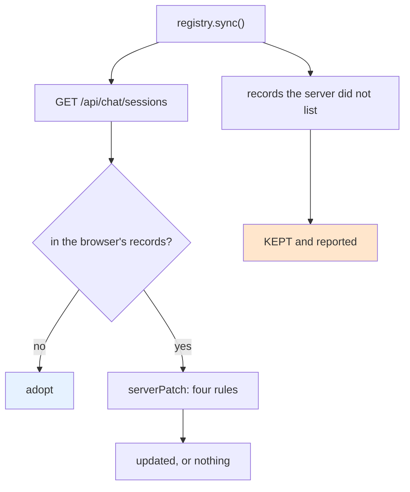

# PBUI Multi-Agent Workbench, Completed

This note closes `PBUI-AGENT-4`. The first five phases are recorded in [[PROJ - PBUI Multi-Agent Workbench - Conversations as Documents, Helper Tiles, and the Handoff Gate]], which was written when Phase 5 had not started. This one covers the last phase — a session list on the server that the server is allowed to lose, and a merge in the browser that never costs the user anything — and then looks back across the whole ticket at two things worth recording separately from the work: the seven places where the code refused the design, and the five kinds of failure that produced them.

> [!summary]
> - The server's session index is a **convenience, not a source of truth**, and every method follows from that: `Touch` inserts a session it has never seen, a failed index write is a log line, and the table is rebuildable from the event stream except for titles.
> - `registry.sync()` **merges**. Four fields, four different rules — the title defers to a human, the message count takes the maximum, `createdAt` is taken only on adoption, `lastActivityAt` takes the later. One "prefer the server" rule would be wrong in at least two of the four cases.
> - The design document was left as written and given a §4.10 listing what changed. Seven items; every one of them is the code refusing the design, not the design being reconsidered.
> - Across the ticket the failures fall into five kinds — packaging, dependency resolution, staleness, identity, and notification — and four of the five are invisible to type checking and to unit tests that do not run the real thing.

## Why this project exists

A workbench that holds several agents needs a way for a person to find a conversation they started yesterday, and for a second browser to show something better than a uuid. The Go server minted session uuids and remembered nothing: `POST /api/chat/sessions` returned an id, the hub and hydration store held that session's events, and no endpoint listed what existed.

The obvious design is a session table. The non-obvious part is deciding how much to trust it, and that decision propagates into every method on both sides.

## Current project status

`PBUI-AGENT-4` is complete: six phases, 207 tests in `pbui-chat`, the Go suite, an eight-step diary, ten screenshots from browser checks, and a bundle on the reMarkable. The remaining follow-ups are recorded below and none of them block the product.

The finished system, stated once:

- A product mounts `chat.Provider` at its root. It hosts one `<ChatProvider>` per **open** conversation and owns a registry of every conversation the browser knows.
- The `chat` application is doc-bound to a `conversation`. Two tiles with two bindings are two agents.
- Nine verb kinds act on conversations. Every action a person can take on one is in its object menu, because a menu entry is a verb or it is nothing.
- Five helper tiles: Conversations, Events, Runs, Tools, Agent context.
- A model can see its neighbours (`conversation_list`) and hand work to one (`conversation_send`), the second behind an approval checked against the message.
- The server keeps a list it can rebuild or lose, and the browser merges rather than trusts.

## Project shape

Phase 5 is three pieces and two folded-in fixes.

| Piece | Where | What it decides |
|---|---|---|
| `SessionIndex` | `pkg/chatserver/sessions.go` | how much the list is trusted |
| Two routes | `pkg/chatserver/handlers.go` | what a client can read and write |
| `registry.sync()` | `packages/pbui-chat/src/conversations/registry.ts` | what a merge costs the user |
| `DEFAULT_EVENT_FAMILIES` | `conversations/EventsTile/EventsTile.tsx` | whether three filters can ever match |
| *Show what is waiting* | the demo's conversation descriptor | where a parked tool is answered |

## Architecture

### An index that is allowed to be wrong

```go
// SessionIndex is a list of the sessions this server has seen.
//
// It is a CONVENIENCE, not a source of truth. The hub and the hydration store
// remain authoritative for a session's events: a browser that knows a session
// id this index has never heard of — because the index is in memory and the
// process restarted — can still connect to it and hydrate its whole
// transcript.
type SessionIndex interface {
    Remember(ctx context.Context, id string, at time.Time) error
    Touch(ctx context.Context, id string, at time.Time, counted bool) error
    Retitle(ctx context.Context, id string, title string) error
    List(ctx context.Context) ([]SessionRecord, error)
    Close() error
}
```

Three consequences follow directly, and each removes a failure mode that a stricter index would have.

**`Touch` inserts a session it has never seen.** A browser holding an id from before a restart submits a message; a strict index would reject an unknown id, and the submission would fail for a reason that has nothing to do with the submission. Instead the row is created with the activity it is being touched for. The memory implementation does it explicitly; the SQLite one does it in the same statement as the update:

```sql
INSERT INTO sessions (id, created_at, last_activity_at, message_count) VALUES (?, ?, ?, ?)
ON CONFLICT(id) DO UPDATE SET last_activity_at = excluded.last_activity_at,
                              message_count = sessions.message_count + ?
```

**A failed index write is a log line, not an error to the client.** `HandleCreateSession` still returns the id:

```go
id := uuid.NewString()
if err := s.sessions.Remember(r.Context(), id, time.Now()); err != nil {
    log.Warn().Err(err).Str("session_id", id).Msg("pbui-chat: could not index the new session")
}
writeJSON(w, http.StatusOK, serverkit.CreateSessionResponse{SessionID: id})
```

A session works whether or not it is remembered. Failing the create because the list could not be updated would make a convenience into a dependency.

**The table is rebuildable.** Every field except the title is derivable from the event stream — creation, activity and message count are all events. Losing the file costs a list, not a transcript. That is what makes an in-memory default acceptable and a SQLite path (`Options.SessionsDB`) an option rather than a requirement.

The sort is total on purpose: most recently active first, then by id. Two sessions created in the same millisecond must not swap places between two requests, which is the kind of instability that makes a list appear to flicker for reasons no one can reproduce.

### The merge, field by field

`sync()` is the whole of the "merge, never replace" decision on the browser side. It is short, and the interesting part is `serverPatch`, which decides what of a server row is worth taking.

```ts
function serverPatch(session: ServerSession, record: ConversationRecord | null): Partial<ConversationRecord> {
  const patch: Partial<ConversationRecord> = {};
  const title = String(session.title ?? "").trim();
  if (title && (!record || record.titledBy !== "human") && record?.title !== title) {
    patch.title = title;
    patch.titledBy = "agent";
  }
  const count = Number(session.messageCount ?? 0);
  if (Number.isFinite(count) && count > (record?.messageCount ?? -1)) patch.messageCount = count;
  const created = String(session.createdAt ?? "").trim();
  if (created && !record) patch.createdAt = created;
  const last = String(session.lastActivityAt ?? "").trim();
  if (last && (!record || last > record.lastActivityAt)) patch.lastActivityAt = last;
  return patch;
}
```

Four fields, four rules, and no two of them point the same way.

| Field | Rule | Why |
|---|---|---|
| `title` | defer to a human; otherwise take the server's | the user named it *in this browser*; the index only knows what some browser told it |
| `messageCount` | take the **maximum** | this browser counts a hydrated timeline it has seen; the index counts submissions, possibly another browser's |
| `createdAt` | take only when adopting | an existing record's own creation time is older or equal by construction |
| `lastActivityAt` | take the later | either side may have seen activity the other has not |

The count rule is the one worth defending. The index's number can be *higher* than the browser's, because another browser has been talking to the same session; taking it is how a list stays honest across two tabs. It can also be *lower*, because the index counts submissions and the browser counts a timeline it has hydrated in full; taking that would silently drop messages from the display. The maximum is the only rule that is right in both directions.

The result is reported rather than applied silently:

```ts
export interface SyncResult {
  adopted: string[];          // the server listed these and this browser did not know them
  updated: string[];          // the server had something better
  unknownToServer: string[];  // KEPT — the server may simply have forgotten them
}
```

`unknownToServer` is the field that matters. A conversation this browser knows and the index does not still connects and hydrates perfectly; dropping it would be the interface deleting the user's work because a server restarted. The Conversations tile prints the count.



### The canonical case, arranged by accident

The browser check for Phase 5 landed on exactly the situation the design exists for, without being set up. The Go server had just been restarted — so its index was empty — while the browser still held six conversation records from earlier work.

```
knownBefore: 6
serverListed: [ { id: "29882eb6", messages: 1 } ]
sync: { adopted: 0, updated: 0, unknownToServer: 6 }
titleKept: "made after the restart"
```

Nothing was adopted, nothing was updated, six records were kept, and the tile's footer read:

```
6 the server does not list (kept) · right-click a conversation for what you can do to it
```

The `updated: 0` on the newly created session is also correct: the browser's message count, taken from its own hydrated timeline, was already at least the index's.

### A filter that could never match

chat-provider's debug classifier files every unlisted `ui-event` under `timeline`, and takes a `familyAliases` map — from UI-event name to family — as an option. No product had ever supplied one. The Events tile therefore shipped with six family chips of which three, `llm`, `tool` and `widget`, could never match a single row.

`DEFAULT_EVENT_FAMILIES` files the chatapp event vocabulary the Go side emits: run and provider and text and reasoning events as `llm`, every `ChatTool*` and `ChatFrontendTool*` as `tool`, every `ChatWidgetInstance*` as `widget`. A name the map does not know still classifies, in the default family, so an event added upstream lands somewhere sensible rather than breaking the tile.

The fix broke a test, which is how it was confirmed to be a fix:

```
AssertionError: expected 'llm' to be 'timeline'
```

The test had asserted that a `ChatMessage` event classifies as `timeline`. It did. That was the bug.

## Implementation details

### What the code refused

The design document was left exactly as written and given a new section, §4.10, listing what changed. Preserving both is deliberate: what was considered is worth reading beside what shipped, and a design rewritten to match its outcome loses the record of the alternatives.

Seven items, each because the code refused the design rather than because the design was reconsidered.

1. **A runtime is captured, not constructed.** `createChatRuntime` cannot be written: `createChatClient` requires a `ToolRuntime`, and `createToolRuntime` is not reachable through any of chat-provider 0.5.0's export paths, nor are the tool input/result helpers it is built on. One `<ChatProvider>` per open conversation, mounted outside every tile, with a capture component reporting the graph.
2. **Tool sets are per conversation, not wrapped descriptors.** `perform` is called from a dozen places deep inside the tool factories, which never see an execution context; an ambient "current conversation" races across awaits. A consequence the design did not state: each agent gets its own layout undo ring.
3. **`RouterContext` carries the actor.** The rule that a human owns a conversation's title cannot be enforced by a handler that does not know who is asking.
4. **Four more verbs, and rename as a request.** Pin, archive, close and forget had been kept out of the vocabulary on the argument that they change only this browser's list — which does not survive the rule that an object menu entry is a verb or it is nothing. And a menu cannot hold a text field, so `conversation.rename` without a title asks the interface for its editor.
5. **Cross-conversation reads need three memos.** Below.
6. **The agent-context tile reads the tool registry, not the last recorded manifest.** `connect()` and `send()` call an internal closure rather than the exposed method.
7. **A family map for the events tile.** Above.

### A taxonomy of the failures

Across six phases the failures fall into five kinds. The classification is worth keeping because four of the five are invisible to a type checker and to unit tests that do not exercise the real thing.

**Packaging.** A symbol exists on disk and is unreachable. `createToolRuntime` is in `tools/toolRuntime.js`; the package's `exports` map has no wildcard and its `/tools` entry does not re-export it. Checking that a symbol exists is not checking that it is importable, and a design written from `.d.ts` files will not notice the difference.

**Dependency resolution.** `react-redux` was in pbui-chat's bundler externals and absent from its `dependencies` — correct for years of transitive use, wrong the moment a source file imported it. The bare specifier resolved from the monorepo root, whose copy pulled a second React:

```
TypeError: Cannot read properties of null (reading 'useMemo')
 ❯ Provider ../../../../../../node_modules/react-redux/src/components/Provider.tsx:62:29
```

**Staleness.** Twice a verb trace read `rejected:unknown verb conversation.pin` while the pin had plainly worked. The server re-validates every reported verb against the vocabulary it embedded at compile time, so a binary started before `pnpm vocab` disagrees with the browser about what happened. Adding a verb kind is three steps — schema, regenerate, restart — and skipping the third produces the most confusing failure this system can produce, because the two halves of the interface tell different stories about the same action.

**Identity.** `useConversations` feeds `useSyncExternalStore`, which compares snapshots by identity. A selector that reads is trivially stable; a selector that *derives* is not, and returns a new array on every call:

```
Error: Maximum update depth exceeded.
```

Three of the ticket's bugs are this one seen from different sides. The fix in each case was to write down exactly what the derived value depends on — entities, title, the parked set, the set of open runtimes — rather than to rely on a dependency array.

**Notification.** A value can be correct and still never reach the screen. A tool call arriving changes no mirrored field, so the registry never notified and the Tools tile never re-rendered. Answering a parked tool changes no timeline entity, so an entity-identity memo kept reporting stale state. `lastManifest` and `lastSend` are plain fields on a runtime, so setting them re-rendered nothing until the runtime took an `onChange`. Each needed a different fix; what they share is that the data was right and the subscription was wrong.

### The three memos, stated once

```ts
// per runtime: entities, the title the rows carry, and which human tools are parked
memos.set(runtime, { entities, title: conversationTitle, parked, calls });

// the join across conversations: all() plus each runtime's calls array
trafficMemos.set(registry, { key, rows });

// waiting: derived from the join, keyed on the join's identity
waitingMemos.set(registry, { key: [traffic], rows });
```

`parked` is the subtle one. It is a string of `1`s and `0`s built by asking `isPendingHumanTool` about each human tool call with no result — cheap, allocation-free, and the only part of the key that changes when a user answers a proposal, because answering produces no entity until the result frame arrives.

## Key code locations

- `pkg/chatserver/sessions.go` — the index, both implementations, and the doc comment that justifies the rest
- `pkg/chatserver/handlers.go` — `HandleListSessions`, `HandleRetitleSession`, and the `Remember` / `Touch` calls
- `pkg/chatserver/server_test.go` — six cases, including submitting to a session the index never saw
- `packages/pbui-chat/src/conversations/registry.ts` — `sync()` and `serverPatch`
- `packages/pbui-chat/src/conversations/EventsTile/EventsTile.tsx` — `DEFAULT_EVENT_FAMILIES`
- `packages/pbui-chat/README.md` — the package's own documentation, written at the close-out

## Important project docs

- `ttmp/2026/08/21/PBUI-AGENT-4--…/design-doc/01-intern-guide-….md` — the design, with §4.10: what changed between the design and the build
- `ttmp/2026/08/21/PBUI-AGENT-4--…/reference/01-diary.md` — eight steps, every failure with its exact error text
- `ttmp/2026/08/21/PBUI-AGENT-4--…/various/` — ten screenshots

## Working rules

- An index that is allowed to be wrong is easier to write and safer to depend on than one that is not. Decide how much a store is trusted before writing its first method.
- A merge rule per field. "Prefer the server" and "prefer the browser" are both wrong when the fields disagree about which side knows more.
- Report what a reconciliation did **not** change. A row that silently vanishes teaches the user that the list is unreliable.
- A design document is a record of what was considered. Amend it with what changed; do not rewrite it into the outcome.
- Adding a verb kind: change the schema, regenerate the vocabulary, restart the server.

## Open questions

- Nothing removes a session from the index, so a long-lived server accumulates rows. Deletion is not obviously correct — the hub may still hold the session — but a retention rule is missing.
- `Touch` runs before the run starts, so a submission that then fails to start is still counted. Defensible for a convenience; undocumented.
- `sync()` has no caller but the tile's button. Syncing on load would adopt every session the server remembers into every browser, which is wrong; the rule that should govern it has not been written.
- `conversation_list` reads only the browser's records, so a session this browser has never opened is invisible to a model even when the server lists it.

## Near-term next steps

- Propose `createToolRuntime` and the tool input/result helpers as exports upstream in chat-provider, then replace the provider-per-conversation host with the factory the design describes. The registry API does not change; only how a runtime comes into being.
- A retention rule for the session index.
- The demo's scripted engine reports no token usage, so every figure in the Runs tile is zero. The tile is verified for layout and liveness and not against real numbers; the real runtime would settle that.

## Project working rule

Each phase ended with the package tests green, a browser check against the running Go server, a commit, and a diary step written during the work rather than after it. That discipline is why the five failure kinds above can be quoted with their exact error text: none of them was reconstructed from memory.

## Related notes

- [[PROJ - PBUI Multi-Agent Workbench - Conversations as Documents, Helper Tiles, and the Handoff Gate]]
- [[PROJ - PBUI Sandbox Devtools - Observing, Driving and Editing Agent-Written Programs]]
- [[PROJ - PBUI Generative Tiles - Agent-Written Programs, Generated Actions, and the Reactive Sandbox]]
