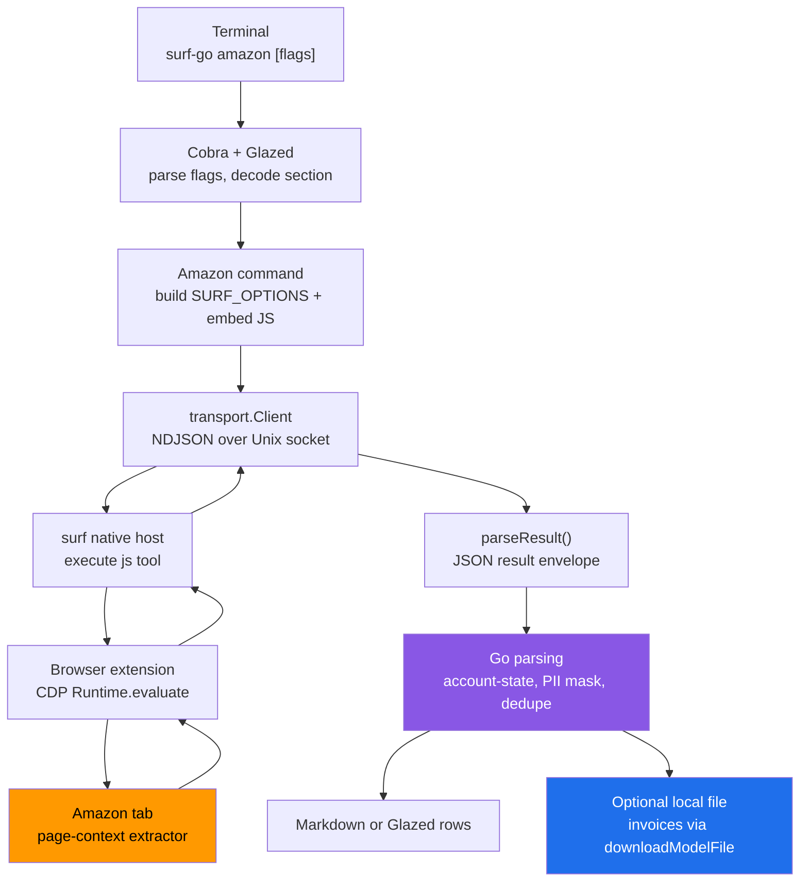
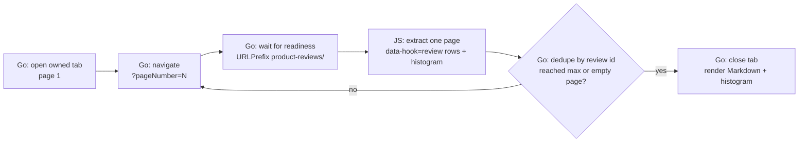
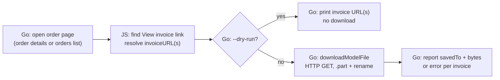

# Deep-Dive Project Report: surf-go Amazon Marketplace Verbs

This report explains the design and implementation of twenty-three Amazon verbs added to the Go version of `surf-cli` across four docmgr tickets. It is written for an engineer who needs to understand why the verbs are split into four tiers, how each tier's extraction contracts were discovered, how the mutation tier prevents accidental account-visible state changes, and where the implementation's boundaries remain provisional. The report is not a changelog. It is a technical analysis of the contracts, the safety model, and the validation evidence that justifies each decision.

The central architectural decision is that Amazon is treated as four distinct problem domains rather than one. Browse verbs operate against public pages and require no login. Account-read verbs operate against pages that belong to the signed-in user and carry personally identifiable information. Mutation verbs change account-visible state and therefore require a safety gate that a single mistyped flag cannot satisfy. Download verbs resolve a file URL inside the browser tab and fetch its bytes from Go. These domains share the same transport and rendering machinery, but they differ in readiness, error detection, side effects, and validation strategy. Treating them as one domain would force the mutation gate onto read-only verbs or omit it from the verbs that need it most.

> [!summary]
> - The project adds twenty-three Amazon verbs across four tickets: six browse verbs (AMAZON2), nine account-read verbs (AMAZON3), six mutation verbs (AMAZON4), and two download verbs (AMAZON5). The earlier AMAZON1 ticket shipped `search` and `product` and was extended here with search filter flags.
> - Every browse and account-read verb was live-validated against a real Amazon session. Every mutation verb was live-validated on the dry-run and refused paths only; the act path was never executed live, by the user's standing guardrail.
> - The mutation tier uses a two-flag gate (`--submit` plus `--confirm-i-understand-this-mutates-my-amazon`), never retries a write (`RetryCount: 0`), defaults to a dry run that clicks nothing, and is proven by a mock-host test that asserts no click occurs without both flags.
> - The account-read tier masks personally identifiable information by default and detects three account-state failure modes — `not_logged_in`, `account_setup_required`, and `captcha_required` — that ordinary readiness checks cannot distinguish from a successfully loaded page.
> - The download tier resolves invoice URLs inside the browser tab and downloads via a shared HTTP client, never streaming file bytes through the bounded JavaScript result channel.

## 1. Executive summary

The work began as four design tickets, each with an intern-oriented analysis and implementation guide stored in the repository's `ttmp/` tree and uploaded to a reMarkable device. The design phase established the verb taxonomy, the shared safety model, and the per-verb selectors that each ticket marked as requiring live validation. The implementation phase then executed each ticket's phased task list: live-probe the selectors read-only, write the Go command and embedded JavaScript extractor, register the command under the `amazon` group, run the build and tests, validate only the safe paths live, and record every phase in a strict-format diary.

The implementation follows the repository's existing browser-verb pattern. A Go command parses flags, builds a JavaScript program by injecting a `SURF_OPTIONS` prelude before an embedded extractor, sends it through the native-host socket, and renders the returned structured object as Markdown or Glazed rows. The page JavaScript is responsible for extraction only. Go owns transport, parsing, validation, masking, and presentation. This separation is the same one used by the eBay verbs, the ChatGPT downloader, and the Apple Card verbs. The Amazon work does not add a new protocol; it adds commands within an established architecture.

The four tiers differ in what they may do, not in how they are built. Browse verbs use the generic owned-tab readiness pattern with a URL-prefix check. Account-read verbs relax that readiness to interactive-state tolerance because Amazon redirects logged-out or incomplete accounts. Mutation verbs add a second confirmation flag and disable tab retry so a transient connection failure cannot replay a state change. Download verbs resolve a URL in the page and then fetch it from Go with an HTTP client, because the JavaScript result channel is bounded and Amazon invoice pages are large.

Validation was incremental and failure-driven. Live probing corrected the design doc's guessed selectors in nearly every tier: the search refinement codes, the best-sellers card class, the deals card class, the reviews container tag, and the orders container structure all differed from the documented assumptions. Each correction was recorded in the ticket diary alongside the exact probe that revealed it. The final implementation reflects the observed page structure, not the initial design.

## 2. Scope, evidence, and terminology

A report about browser automation must distinguish observed behavior from inference. Amazon's public pages are useful evidence because they expose stable card containers and refinement links, but the exact facet identifiers and the per-page card markup change without notice. Page-context probes executed by `surf-go` against a signed-in session are stronger evidence for the account used during validation, but they contain account-specific state and must not be treated as a guarantee about every Amazon account or every Amazon layout variant.

This report uses three evidence levels:

1. **Repository evidence** comes from the source code, the test suite, the tutorials, and the ticket documents in `/home/manuel/workspaces/2026-08-22/surf-ebay/surf-cli`.
2. **Public-page evidence** comes from page-context JavaScript executed against Amazon pages without relying on the account. It establishes card containers, link patterns, and refinement facet codes.
3. **Authenticated-session evidence** comes from page-context JavaScript executed against a manually signed-in Amazon tab. It establishes order-history structure, account-state redirect behavior, and the mutation button states.

The term **page context** means the JavaScript execution environment associated with a target browser tab's document. Code running there can read the DOM, use same-browser cookies, call `fetch()`, and rely on the browser's origin policy. The Go process does not receive credentials. It receives only the explicit structured object the page script returns.

The term **owned tab** has a specific meaning in `surf-go`: a command opens a tab, records its identifier, uses it, and closes it. Read verbs use this pattern with a URL-prefix readiness check. Mutation verbs also use it but pass `RetryCount: 0` so a lost tab never replays the write. Account-read verbs use it with interactive-state readiness and no URL-prefix check, because Amazon redirects those pages when the session is invalid.

The term **two-flag gate** means a command requires two boolean flags to perform an action. A single flag is insufficient. The flags are `--submit` and `--confirm-i-understand-this-mutates-my-amazon`. The second flag's name is deliberately verbose because it states the consequence in its own identifier.

## 3. The problem the project solves

Amazon's web application exposes browse, account, and purchase workflows through a browser. A user can search, read reviews, view orders, manage a cart and wish list, and download invoices, but each action is a manual click sequence with no inspectable structure and no scriptable output. The project's goal is to expose each of those workflows as a command-line verb that returns structured output, can be composed in scripts, and never performs a state-changing action by accident.

A single-tier implementation would fail for several reasons. First, the browse pages and the account pages have different access requirements. The search page renders public results without authentication; the orders page redirects to a sign-in page when the session is invalid. A readiness check that treats both as "the page loaded" would scrape the sign-in page and report it as an empty order history. Second, the read verbs and the mutation verbs have different side-effect profiles. Reading a wish list is safe; adding an item to a wish list changes state that is visible to the account and, indirectly, to the seller. A command surface that uses one `--submit` flag for both would let a mistyped flag mutate the account. Third, the download verbs must transfer file bytes, and the JavaScript result channel is bounded at roughly six hundred seventy-five kilobytes per round trip. An invoice page exceeds that bound, so the bytes cannot flow through the JavaScript result.

The project therefore solves a compound problem:

- discover the extraction contract for each Amazon page by reading it, not by guessing it;
- distinguish four failure modes that look like a successfully loaded page: empty results, no-results pages, account-state redirects, and CAPTCHA challenges;
- separate the read path from the mutation path so a single flag cannot mutate state;
- prevent a transient connection failure from replaying a write;
- resolve file URLs inside the page so Go can download them without reconstructing authentication;
- mask personally identifiable information by default so a command's output does not leak a shipping address when it is pasted into a log;
- preserve enough probes and diaries that a future engineer can revalidate the behavior when Amazon changes its markup.

The solution is a four-tier taxonomy implemented within the existing browser-verb architecture. Each tier adds exactly the machinery its access and side-effect profile requires, and no more.

## 4. Repository architecture and execution path

The Amazon verbs reuse the existing `surf-go` architecture without adding a new native-host protocol. Every verb is a Go command plus an embedded JavaScript file, registered under the `amazon` group in `go/cmd/surf-go/main.go`. The terminal-to-page execution path is unchanged from the Apple Card and eBay verbs:



The responsibilities are deliberately narrow:

| Layer | Responsibility | Does not own |
|---|---|---|
| Cobra/Glazed | Command names, flags, output mode, argument decoding | Amazon authentication or page structure |
| Amazon Go command | Orchestration, parsing, account-state translation, PII masking, dedupe, file writes | Browser cookies, login state |
| Amazon JavaScript extractor | Page readiness, selector matching, structured extraction, the gated click | Local paths, filesystem, Markdown rendering |
| `transport.Client` | Socket request and response transport | Amazon-specific response interpretation |
| Browser tab | Amazon login state, cookies, `fetch()` origin, the actual DOM | Local output directory policy |

The production code lives in two directories:

```text
/home/manuel/workspaces/2026-08-22/surf-ebay/surf-cli/go/internal/cli/commands/
/home/manuel/workspaces/2026-08-22/surf-ebay/surf-cli/go/internal/cli/commands/scripts/
```

The root command registration lives in:

```text
/home/manuel/workspaces/2026-08-22/surf-ebay/surf-cli/go/cmd/surf-go/main.go
```

The investigation probes and diaries live in the ticket workspace:

```text
/home/manuel/workspaces/2026-08-22/surf-ebay/surf-cli/ttmp/2026/08/22/SURF-20260822-AMAZON2--.../scripts/
/home/manuel/workspaces/2026-08-22/surf-ebay/surf-cli/ttmp/2026/08/22/SURF-20260822-AMAZON3--.../scripts/
/home/manuel/workspaces/2026-08-22/surf-ebay/surf-cli/ttmp/2026/08/22/SURF-20260822-AMAZON4--.../scripts/
/home/manuel/workspaces/2026-08-22/surf-ebay/surf-cli/ttmp/2026/08/22/SURF-20260822-AMAZON5--.../scripts/
```

The separation matters during maintenance. The numbered probes preserve discovery history and failed assumptions. The embedded script is the maintained implementation. An intern should not copy an exploratory probe into production without reconciling its output shape, error behavior, and masking policy.

## 5. The four-tier verb taxonomy

The verbs are grouped by access requirement and side-effect profile. Each group shares a readiness strategy, an error model, and a validation policy.

| Tier | Ticket | Verbs | Login | Side effect | Readiness | Validation policy |
|---|---|---|---|---|---|---|
| Browse | AMAZON2 | search flags, bestsellers, deals, reviews, seller, list | none required | none | owned tab, URL-prefix | full read paths live |
| Account-read | AMAZON3 | orders, order, track, cart, wishlist, subscriptions, giftcard, addresses, returns | required | none | owned tab, interactive, no URL-prefix | read paths live; track/returns happy-path selectors provisional |
| Mutation | AMAZON4 | wishlist add/remove, cart add/update/remove/clear | required | account-visible state change | owned tab, `RetryCount: 0` | dry-run and refused paths live; act path never run |
| Download | AMAZON5 | invoice `<url>`, invoice `--all` | required | local file write | owned tab, interactive | `--dry-run` path live; download path provisional for cookie-gated pages |

The `amazon` command group registered in `main.go` exposes seventeen top-level subcommands. Two of them, `cart` and `wishlist`, are Cobra parent commands that have a default run action for the read verb and subcommands for the mutations:

```text
surf-go amazon search ...
surf-go amazon product <url>
surf-go amazon bestsellers [--category]
surf-go amazon deals
surf-go amazon reviews <url> [--sort] [--rating] [--max-results] [--max-pages]
surf-go amazon seller <url>
surf-go amazon list <url>
surf-go amazon orders [--since]
surf-go amazon order <id> [--full]
surf-go amazon track <url|itemId>
surf-go amazon cart                         # read
surf-go amazon cart add <url>
surf-go amazon cart update <url> --quantity N
surf-go amazon cart remove <url>
surf-go amazon cart clear
surf-go amazon wishlist                     # read
surf-go amazon wishlist add <url>
surf-go amazon wishlist remove <url>
surf-go amazon subscriptions
surf-go amazon giftcard
surf-go amazon addresses [--full]
surf-go amazon returns
surf-go amazon invoice <url> [--dry-run] | --all [--since]
```

The parent-with-subcommands structure is deliberate. It keeps the read verb at the name a user would type first, and it groups the mutations under that name so the help text reads as one coherent surface rather than seven unrelated commands.

## 6. The browse tier: three layouts and a refinement grammar

The browse verbs operate against public Amazon pages. They require no login, and they share a single extraction concern: Amazon renders different listing pages with different card containers, and no single selector works across all of them. The design doc assumed the best-sellers and deals pages reused the search card. Live probing proved they do not.

### 6.1 Search filter flags and the refinement grammar

The search verb already existed from the AMAZON1 ticket. The browse tier extended it with six filter flags: `--sort`, `--prime`, `--min-rating`, `--min-price`, `--max-price`, and `--condition`. Amazon expresses filters through a query-string refinement hash, not through discrete parameters. The design doc guessed at the facet codes. The implementation validated each code by navigating to a filtered search and copying the `rh=` value from Amazon's own left-sidebar refinement links.

The validated codes are not the guessed ones:

| Flag | Amazon parameter | Validated value |
|---|---|---|
| `--sort` | `s=` | `relevanceblender`, `price-asc-rank`, `price-desc-rank`, `date-desc-rank`, `review-rank` |
| `--prime` | `rh=p_85:` | `2470955011` (not `1`) |
| `--min-price` / `--max-price` | `rh=p_36:<lo>-<hi>` | cents, e.g. `5000-10000` for $50–$100 |
| `--min-rating` (1–4) | `rh=p_72:` | bucket ids `1248966011` (1★) through `1248963011` (4★) |
| `--condition` | `rh=p_n_condition-type:` | `6503240011` (new), `6503242011` (used), `16907722011` (renewed) |

Three of these contradicted the design doc. The Prime facet is `p_85:2470955011`, not `p_85:1`. The rating facet uses bucket identifiers, not a greater-than expression such as `p_72:>3`. The condition facet is `p_n_condition-type`, with a hyphen, not `p_n_condition`. A command that shipped the guessed codes would silently return unfiltered results, because Amazon accepts unknown facet codes without error. Validation by navigating and copying the real `rh=` value was therefore not a nicety; it was the only reliable source.

The Go side maps friendly flag names to the validated codes and assembles the refinement hash:

```go
var rh []string
if s.Prime {
    rh = append(rh, "p_85:2470955011")
}
if s.MinRating > 0 {
    if code, ok := amazonRatingValues[s.MinRating]; ok {
        rh = append(rh, "p_72:"+code)
    }
}
if s.MinPrice > 0 || s.MaxPrice > 0 {
    rh = append(rh, fmt.Sprintf("p_36:%d-%d", s.MinPrice*100, s.MaxPrice*100))
}
if len(rh) > 0 {
    u += "&rh=" + url.QueryEscape(strings.Join(rh, ","))
}
```

The extractor itself is unchanged. Filters are a URL concern, not a script concern. This is the correct separation: the page script reads whatever cards the filtered URL renders, and the Go side owns the URL construction that determines which cards appear.

### 6.2 Three distinct listing layouts

The best-sellers, deals, and search pages each render a different card container. A single extractor cannot serve all three.

| Page | Card container | ASIN source | Rank / extra field |
|---|---|---|---|
| Search | `div[data-component-type="s-search-result"]` | `data-asin` attribute | none |
| Best Sellers | `div.zg-grid-general-faceout` | `/dp/<ASIN>` link href | rank from `_sccl_<N>` ref suffix |
| Deals (Gold Box) | `div.a-cardui.dcl-product` | `/dp/<ASIN>` link href | deal price, list price, percent off, deal type |

The search card carries the ASIN as an attribute on the card element. The best-sellers and deals cards do not; the ASIN lives in the product link's href. The best-sellers rank is not a visible badge element. It is the trailing `_sccl_<N>` number in the link's `ref` suffix, so the extractor parses the rank from the URL rather than from the DOM text. The deals card carries two `.a-price .a-offscreen` elements: the first is the deal price, the second is the list price. The percent off and the deal type ("Limited time deal", "Ends in") come from the badge's label and message sub-elements.

The lesson is that Amazon has at least three distinct listing layouts with no shared card class. A browse verb that assumes one layout will silently return zero results on the others. Each browse verb requires its own live probe before its selector is trusted.

### 6.3 Reviews: subview pagination owned by Go

The reviews verb is structurally different from the other browse verbs. A product's reviews are paginated and loaded through the dedicated `/product-reviews/<ASIN>/` page with a `?pageNumber=N` query parameter, not through the product detail page. A single JavaScript execution runs in one page load, so the page script extracts one page and Go owns the page loop.



The extractor waits for `[data-hook="review"]` elements, because reviews load after the initial render. It returns the review rows, the rating histogram (the first five percentage cells, mapped to five stars through one star), the average rating, and the total rating count. Go accumulates the rows across pages, deduplicates by review id, and stops when a page returns no new reviews or the maximum result count is reached.

The container tag is not stable. The first probe session rendered the review container as a `div`; the validation session rendered it as an `li`. The extractor matches the `data-hook` attribute on any tag, not `div[data-hook="review"]`. Hardcoding the tag would have returned zero results in the session where Amazon used `li`. This is the single most important selector correction in the browse tier, and it was caught only because the live validation step ran against the real page.

## 7. The account-read tier: account-state detection and PII masking

The account-read verbs operate against pages that belong to the signed-in user: orders, order detail, tracking, cart, wish list, subscriptions, gift card, addresses, and returns. These pages share two concerns that the browse tier does not have. They can redirect to a sign-in page or an account-info completion flow when the session is invalid, and they can expose personally identifiable information.

### 7.1 The account-state guard

Amazon My Account pages redirect when the session is logged out or when the account is incomplete. A readiness check that only tests `document.readyState` would treat the redirected sign-in page as a successfully loaded orders page and report an empty history. The account-read tier introduces a shared `detectAccountState` function that every account-read extractor calls before it extracts anything:

```javascript
function detectAccountState() {
  if (/\/signin\b|\/ap\/signin/i.test(location.href) || /sign in\b/i.test(document.title)) return 'not_logged_in';
  if (/account-info|complete your account/i.test(document.title + ' ' + (document.body.innerText || ''))) return 'account_setup_required';
  if (/robot check|captcha/i.test(document.title) || /Enter the characters you see below/i.test(document.body.innerText || '')) return 'captcha_required';
  return null;
}
```

Each extractor's `main` function checks this first and returns an error object with the code and an actionable message. Go translates the code into a command error rather than rendering an empty result:

```go
switch getString(dataMap, "error") {
case amazonCaptchaRequired, amazonNotLoggedIn, amazonAccountSetupNeeded:
    return nil, fmt.Errorf("%s", getString(dataMap, "errorText"))
}
```

The three codes are defined as package constants. `amazonCaptchaRequired` lives in `amazon_search.go` and is reused across all tiers. `amazonNotLoggedIn` and `amazonAccountSetupNeeded` live in `amazon_orders.go`. Two verbs add a fourth code for a page-specific redirect: `amazon track` adds `track_link_expired` for stale track links that redirect to order history, and `amazon returns` adds `page_not_found` for the Online Return Center's order-context-dependent 404.

### 7.2 Interactive readiness without a URL prefix

Account pages are heavy and can redirect. The browse tier's readiness check, which waits for the URL to match a known prefix, would fail on a redirect to a sign-in page. The account-read tier uses `tabReadyOptions{Timeout: 20 * time.Second, AllowInteractive: true}` with no `URLPrefix` and no `URLExact`. The readiness check accepts the `interactive` ready state as well as `complete`, and it does not reject a URL that has changed because Amazon redirected it. This is the same lesson the eBay `saved` and `invoice` verbs recorded: an exact or prefix URL match flakes when the page redirects.

### 7.3 PII masking by default

Two account-read verbs surface personally identifiable information. `amazon order` extracts the shipping address and the payment method. `amazon addresses` extracts saved shipping addresses including the street and the phone number. A command's output is often pasted into a log or a note, so the verbs mask the sensitive fields by default and require an explicit `--full` flag to unmask them.

The order extractor returns the shipping address in two forms. `shippingAddressMasked` is the city, state, and ZIP, derived by a regex that finds the city, state abbreviation, and ZIP in the full address block. `shippingAddressFull` is the complete address text. The Go renderer shows the masked form by default and the full form only when `--full` is set, with a callout that marks the output as personally identifiable information:

```go
if showFull && full != "" {
    b.WriteString(fmt.Sprintf("- Shipping address: %s\n", full))
    b.WriteString("\n> ⚠ PII: full shipping address shown (--full).\n")
} else if masked != "" {
    b.WriteString(fmt.Sprintf("- Shipping address: %s (masked; --full to show full)\n", masked))
}
```

The unit test for the masked path asserts that the street address does not appear in the rendered Markdown. The unit test for the full path asserts that it does appear and that the PII callout is present. Masking is therefore not a documentation claim; it is a tested behavior.

### 7.4 The orders container and the sibling-box problem

The orders verb illustrates why live probing is necessary even when a selector seems obvious. The order id matches the pattern `\d{3}-\d{7}-\d{7}`. The first implementation selected `.a-box` elements whose text contained an order id and extracted the date, total, status, and items from each. The live validation returned the order id, date, and total, but the status and items were empty.

The cause is that an Amazon order is composed of multiple `.a-box` siblings inside an `a-box-group` wrapper. The header `.a-box` carries the order id, the date, the total, and the ship-to address. The items live in a separate sibling `.a-box`. Selecting the first `.a-box` that contains the order id selects only the header, which has no item links.

The fix is to anchor on the order-id text element and walk up to the ancestor that contains the `/dp/` item links, falling back to the `.a-box-group` wrapper:

```javascript
let card = idEl;
for (let i = 0; i < 12 && card; i++) {
  if (card.querySelectorAll('a[href*="/dp/"]').length > 0) break;
  card = card.parentElement;
}
if (!card) card = idEl.closest('.a-box-group') || idEl.parentElement;
```

The live validation after this fix returned the status ("returned", "Delivered") and the items for three orders. The walk-up approach is robust because it finds the wrapper that holds both the header and the items, regardless of how many `.a-box` siblings Amazon inserts between them.

## 8. The mutation tier: the two-flag safety gate

The mutation verbs change account-visible state. `wishlist add` and `wishlist remove` toggle an item's presence on the user's wish list. `cart add`, `cart update`, `cart remove`, and `cart clear` change the contents of the shopping cart. These verbs are reversible, but they are visible to the account and, in the wish-list case, indirectly to the seller through watcher counts. The defining concern of the mutation tier is safety: no account-affecting action should run without explicit confirmation, and a single mistyped flag should not be enough to trigger it.

### 8.1 Why two flags

The repository's existing convention is a single `--submit` flag. That convention is adequate for reversible, low-stakes actions on other sites. It is not adequate for Amazon mutations, for two reasons. A single boolean is easy to type by accident when a user means to pass a different flag. And the consequence of an accidental mutation is account-visible state that the user did not intend to change.

The solution is a two-flag gate. The first flag is `--submit`. The second flag is `--confirm-i-understand-this-mutates-my-amazon`. The second flag's name is deliberately verbose: it states the consequence in its own identifier, so a user who reads their shell history can see what the flag authorizes before they re-run the command. Both flags must be true for the act path to run.

```go
const amazonMutationConfirmFlag = "confirm-i-understand-this-mutates-my-amazon"
```

The gate encodes three states the verb must distinguish:

1. **Dry run** (no flags, or only `--submit`): read the current state, report it, click nothing.
2. **Refused** (`--submit` without the confirm flag): read the current state, report it, click nothing, print a refusal note.
3. **Act** (`--submit` and the confirm flag): the only path that clicks, then report the observed post-state.

The page script encodes the gate directly. The click is the only line that mutates state, and it is reachable only when both flags are true:

```javascript
const submit = options.submit === true;
const confirm = options.confirm === true;
if (!submit && !confirm) {
  note = 'dry run: no flags given; nothing was changed';
} else if (submit && !confirm) {
  note = 'refused: --submit given without --confirm-i-understand-this-mutates-my-amazon; nothing was changed';
} else if (submit && confirm && button) {
  button.click();
  clicked = true;
  await sleep(800);
  after = readState();
  note = 'acted: clicked ...';
}
```

The Go renderer always reports the observed pre-state, the observed post-state, the `clicked` boolean, the `submitted` boolean, and the note. It never reports only "done". A user who runs the command in dry-run mode sees the current state and a note that nothing changed. A user who runs it with only `--submit` sees the same state and a note that the action was refused. A user who runs it with both flags sees the pre-state, the post-state, and a confirmation that the click occurred.

### 8.2 No retry on a write

The owned-tab retry mechanism exists to recover from a lost tab. It is correct for read verbs, because a re-executed read produces the same result. It is incorrect for write verbs, because a re-executed write applies the state change a second time. A replayed `wishlist add` adds the item twice. A replayed `cart add` adds the quantity twice. A replayed `cart clear` is a no-op, but the replayed add is the real risk.

The mutation tier disables retry by passing `RetryCount: 0` to the owned-tab options. This is the same invariant the `modelsocial.go` file records for the Thingiverse mutations: a write must not be retryable.

```go
err := withOwnedTabRetry(ctx, client, ownedTabRetryOptions{
    URL:        destURL,
    Ready:      ready,
    RetryCount: 0, // MUTATION SAFETY: never retry a write
    RetryDelay: defaultOwnedTabRetryDelay,
    KeepTabOpen: s.KeepTabOpen,
}, func(ownedTabID int64) error {
    resp, err := ExecuteTool(ctx, client, "js", map[string]any{"code": code}, &ownedTabID, nil)
    // ...
})
```

The shared `runAmazonMutation` runner centralizes this decision. All six mutation verbs call it, so the `RetryCount: 0` invariant lives in one place and cannot be forgotten by a new mutation verb that copies a read verb's runner.

### 8.3 The value-setter discipline for cart quantity

`cart update` sets a quantity input to a new value. The obvious implementation is to set the input's `value` property and then click the form's Update button. That implementation can submit the entire cart form as a side effect of the click, because the quantity input lives inside a form. The tutorial records this failure mode as "a form-level button submitted the whole form".

The cart update extractor uses the native value setter and dispatches `input` and `change` events, without clicking any button to set the value:

```javascript
function setQuantity(input, n) {
  const setter = Object.getOwnPropertyDescriptor(window.HTMLInputElement.prototype, 'value').set;
  setter.call(input, String(n));
  input.dispatchEvent(new Event('input', { bubbles: true }));
  input.dispatchEvent(new Event('change', { bubbles: true }));
}
```

The only code that clicks a commit button is the gated act path, and only after the quantity has been set. The value-setter and the click are separate operations, so a dry run can set and report the value without committing it, and a refused run can set and report it without clicking Update. The act path sets the value and then clicks Update in one gated sequence.

### 8.4 Subcommands of the read verb

The six mutation verbs are registered as Cobra subcommands of the read verbs they extend. `cart add`, `cart update`, `cart remove`, and `cart clear` are subcommands of `cart`. `wishlist add` and `wishlist remove` are subcommands of `wishlist`. The read verbs retain their default run action, so `surf-go amazon cart` still lists the cart, and `surf-go amazon cart add <url>` adds to it.

This structure preserves the name a user would type first for the read verb and groups the mutations under that name. It also means the help text reads as one coherent surface: `surf-go amazon cart --help` shows the read verb and the four mutation subcommands together, with the mutation short descriptions marked as gated.

### 8.5 Validating the gate without running the act path

The user's standing guardrail is that no mutation act path runs without explicit approval. The validation policy for the mutation tier is therefore to exercise only the dry-run and refused paths live, and to prove the gate with a mock-host test that asserts no click occurs without both flags.

The mock-host test for `wishlist add` asserts three properties. The prelude the Go command injects must carry `submit:false` and `confirm:false` in a dry run. The mock host must receive exactly four tool calls: `tab.new`, the readiness `js` probe, the extract `js` call, and `tab.close`. There is no fifth call, because the act path would require a second `js` call to click, and the dry run does not perform one. The test fails if the prelude authorizes a click or if a fifth call appears.

```go
// The mock host asserts the dry-run prelude does not authorize a click.
if !strings.Contains(code, `const SURF_OPTIONS = {"confirm":false,"submit":false};`) {
    done <- fmt.Errorf("dry run must not authorize: %q", code)
}
```

This is the strongest test the guardrail permits. It proves the gate's structure without exercising the act path. The live validation confirms the same structure end to end: a dry run reports the current state and the "nothing was changed" note, and a run with only `--submit` reports the same state and the "refused" note. Neither clicks.

## 9. The download tier: resolve in the page, fetch from Go

The download verbs resolve Amazon order invoice URLs and download the invoice files. The central decision is the same one the Apple Card and ChatGPT downloaders made: the page script resolves the URL, and Go fetches the bytes. The JavaScript result channel is bounded, and an invoice page can exceed the bound, so the bytes must not flow through the channel as base64.

### 9.1 Resolve in the page, fetch with downloadModelFile

The invoice extractor opens the order detail page, finds the "View invoice" link, and returns the invoice URL. It returns a URL only, never bytes. The Go command then iterates the resolved URLs and downloads each one with the shared `downloadModelFile` helper, which performs an HTTP GET with a polite user agent, writes to a `.part` temporary file, and renames it into place only after the full response is received.



The `--all` mode pages the orders history, collects each order id, and builds the invoice URL for each. The invoice URL is predictable from the order id: `https://www.amazon.com/gp/css/summary/print.html?orderID=<id>`. The single mode reads the actual "View invoice" link from the order detail page, which carries a `ref_` parameter Amazon uses for tracking.

### 9.2 The cookie-gated limitation

Amazon's invoice pages are cookie-gated HTML print pages, not directly downloadable PDFs. The `downloadModelFile` helper uses a plain Go HTTP client with no browser cookies. A plain HTTP GET to `print.html?orderID=<id>` returns the sign-in page, not the invoice, because the request does not carry the browser session.

The implementation documents this limitation rather than hiding it. The command help states that `--dry-run` is the reliable path for cookie-gated invoices, because it gives the user the URL to open in the browser. The download path is correct for any directly downloadable PDF invoice, and it remains in place for that case. The Markdown output includes a note that explains the limitation after any non-dry-run download.

The honest design choice is to make the `--dry-run` resolve path the validated primary artifact and to leave the download path as best-effort for cookie-gated pages. A future enhancement could pass the browser session cookies to the Go HTTP client, but that requires the surf host to expose them, which it does not today.

### 9.3 Never base64 through the JavaScript channel

The decision to resolve in the page and fetch from Go is not a performance optimization. It is a correctness constraint. The native-host JavaScript result channel is bounded at roughly nine hundred thousand characters, which decodes to roughly six hundred seventy-five kilobytes. An invoice page can exceed that bound. A command that streamed the invoice bytes through the channel as base64 would truncate large invoices silently, producing a partial file that looks complete.

The `downloadModelFile` helper is the shared solution the repository already uses for 3D model files. It writes to a temporary file and renames it into place atomically, so an interrupted download leaves a `.part` file rather than a partial destination file. The Amazon invoice verbs reuse it unchanged.

## 10. Shared safety invariants

Several invariants apply across the tiers. They are not per-verb decisions; they are properties of the Amazon verb surface as a whole.

- **The CAPTCHA guard is universal.** Every Amazon extractor checks for a "Robot Check" page title or the "Enter the characters you see below" body text and returns `error: 'captcha_required'`. Amazon is the most bot-hostile site in the repository, and a CAPTCHA page is not a successfully loaded page. The `amazonCaptchaRequired` constant is defined once in `amazon_search.go` and reused by every tier.
- **Readiness matches the tier's redirect behavior.** Browse verbs use a URL-prefix readiness check. Account-read and download verbs use interactive-state readiness with no URL-prefix check, because Amazon redirects those pages. Mutation verbs use the owned-tab runner with `RetryCount: 0`.
- **A user-supplied tab is never closed and never re-navigated.** When a user passes `--tab-id`, the verb runs against the page already open in that tab. This matters for mutations, where re-navigating an authenticated cart page in an automated tab can bounce to a login page, and it matters for account-read verbs, where the user's tab may already be on the right page.
- **PII is masked by default.** The order and addresses verbs mask shipping addresses and payment methods unless `--full` is set. The masking is tested, not just documented.
- **The mutation gate is structural, not advisory.** The two-flag gate is enforced in the page script, and the no-click property is asserted by a mock-host test. A future verb that copies a mutation verb must copy the gate, because the test will fail without it.

## 11. Command surface and output design

The verbs use `buildDualModeCommand`, matching the repository pattern for commands that render Markdown by default and support Glazed structured output through `--with-glaze-output`. Every verb accepts the browser transport settings used throughout the repository: `--socket-path`, `--timeout-ms`, `--tab-id`, `--window-id`, and `--debug-socket`.

The mutation verbs add `--submit` and `--confirm-i-understand-this-mutates-my-amazon` to that set. The `mutationFlags` helper returns the common mutation flag set so all six mutation verbs share it:

```go
func mutationFlags() []*fields.Definition {
    return []*fields.Definition{
        fields.New("submit", fields.TypeBool, fields.WithDefault(false), ...),
        fields.New(amazonMutationConfirmFlag, fields.TypeBool, fields.WithDefault(false), ...),
        // ... transport and tab flags
    }
}
```

The download verbs add `--save-to`, `--force`, and `--dry-run`. The `cart update` verb adds `--quantity`. The `order` and `addresses` verbs add `--full`. The `orders` and `invoice --all` verbs add `--since`, which accepts a year or a year-month and maps to Amazon's `timeFilter` query parameter.

The output is Markdown by default. The Markdown for a listing verb renders the page-level fields (query, URL, result count, logged-in state) and then one section per item. The Markdown for a detail verb renders the object's fields as a definition list. The Markdown for a mutation verb renders the observed pre-state, the observed post-state, the `clicked` and `submitted` booleans, and the note. The Markdown for a download verb renders each resolved invoice's URL and, when not a dry run, the saved path and byte count.

## 12. Validation narrative and failure analysis

The validation was incremental. Each failure changed a concrete implementation decision. The failures are the most valuable part of the record, because they distinguish a stable selector from a guessed one.

### Phase A: browse tier

The search filter flags exposed the refinement-grammar problem. The design doc guessed `p_85:1` for Prime, `p_72:>3` for rating, and `p_n_condition` for condition. Navigating to a filtered search and copying the `rh=` value from Amazon's own sidebar links proved all three wrong. The Prime facet is `p_85:2470955011`. The rating facet uses bucket identifiers. The condition facet is `p_n_condition-type`. The implementation uses the validated codes, and the diary records the probe that produced each one.

The best-sellers probe exposed the layout problem. The design doc assumed best-sellers reused the search card. The probe returned zero `s-search-result` cards. The actual card is `div.zg-grid-general-faceout`, and the rank is the `_sccl_<N>` ref suffix, not a badge element. The deals probe exposed a third layout, `div.a-cardui.dcl-product`, with the deal price and list price as the first and second `.a-price .a-offscreen` elements.

The reviews validation exposed the container-tag problem. The first live run returned zero reviews. The probe showed `[data-hook="review"]` had ten elements but `div[data-hook="review"]` had zero: Amazon rendered the container as `li`, not `div`, in that session. The extractor was changed to match the `data-hook` attribute on any tag. The fix was caught only because the live validation step ran against the real page.

### Phase B: account-read tier

The orders validation exposed the sibling-box problem. The first implementation selected `.a-box` elements with an order id and extracted from each. The live run returned the order id, date, and total, but the status and items were empty. The probe showed the order id lives in the header `.a-box` and the items live in a sibling `.a-box`. The fix walks up from the order-id element to the `a-box-group` ancestor that contains the item links. After the fix, the live run returned the status and items for three orders.

The order detail validation exposed a success-sentinel collision. The first live run returned `error:"ready"`. The extractor returned the string `'ready'` for a successful readiness check, which collided with the account-state guard's `typeof cond.value === 'string'` check that treats any string as an error code. The fix changed the success sentinel to the boolean `true`. The collision was caught only because the live run returned the error JSON.

The track validation exposed the stale-link redirect. Every track link from delivered or returned orders redirected to order history, because the `itemId` is order-scoped and expires. The verb detects the redirect with a `track_link_expired` code and reports an actionable message. The happy-path selectors (carrier, tracking number, estimated delivery) are best-effort, because a current in-transit order was not available to validate them against.

The seller validation exposed a data-correctness problem. The first attempt at a per-period rating-counts map reported `1month: 2233`, which is the twelve-month count. The probe showed `document.body.innerText` renders only the visible twelve-month block; the one-month, three-month, and lifetime counts live in hidden DOM or embedded JSON that `innerText` excludes. Rather than ship wrong per-period data, the verb reports only the validated twelve-month count and the positive-feedback percentage.

### Phase C: mutation tier

The mutation tier was validated on the dry-run and refused paths only. The dry run for `wishlist add` reported the "Add to List" button label and the "nothing was changed" note. The refused run with only `--submit` reported the same state and the "refused" note. Neither clicked. The mock-host test asserted the dry-run prelude carries `submit:false` and `confirm:false` and that the mock host receives exactly four tool calls with no click.

The `cart clear` dry run reported the item count that would be removed. This is the destructive mutation, and the dry run makes the consequence visible before the user authorizes it. The act-path delete and Update button selectors are best-effort, because the cart delete and Update probe timed out against the heavy cart DOM, and the guardrail forbids running the act path to validate them. The gate itself is fully validated; the act-path selectors require a re-probe before real use.

### Phase D: download tier

The invoice `--dry-run` validation succeeded for both modes. The single mode resolved the actual "View invoice" link from the order detail page, including the `ref_` tracking parameter. The `--all` mode paged the orders history and resolved an invoice URL for each of three orders. Neither downloaded anything.

The download path itself was not validated against a real cookie-gated invoice, because the plain HTTP client cannot authenticate. The limitation is documented in the command help and in the Markdown output. The `downloadModelFile` helper is validated by the existing 3D model tests, so the download mechanism is sound; only the Amazon-specific authentication gap remains.

## 13. Reimplementation guide

An intern reimplementing any Amazon verb should follow a sequence that preserves evidence and respects the tier's safety model.

### Step 1: read the tutorial and the closest existing verb

Start with `go/pkg/doc/tutorials/01-building-browser-side-verbs.md`, which explains how a page-side script becomes a Go command. Then read the closest existing verb in the same tier. For a browse verb, read `amazon_search.go` and `amazon_bestsellers.go`. For an account-read verb, read `amazon_orders.go` and `amazon_order.go`. For a mutation verb, read `amazon_wishlist_mutation.go` and the shared `runAmazonMutation` runner. For a download verb, read `amazon_invoice.go` and the existing `chatgpt_download.go` or `apple_card.go`.

### Step 2: create numbered probes

Each probe should answer one question and return a small JSON object. Save the probes in the ticket's `scripts/` directory with a numeric prefix so they preserve discovery order. For a browse verb, the questions are: what is the card container, what is the ASIN source, what extra fields does the card carry, and what marks a no-results page. For an account-read verb, add: what marks the authenticated page, what does the account-state redirect look like, and where does the personally identifiable information live. For a mutation verb, add: what is the button's current state, and what control commits the change. Never click during a probe.

### Step 3: stabilize the read path before the click path

For a mutation verb, the read path is the dry run. It must report the current state and click nothing. Stabilize it first. The click path is the gated act path, and it reuses the read path's state-reading code. A verb whose dry run reports the wrong state will report the wrong post-state after the act path runs.

### Step 4: choose the readiness strategy for the tier

Browse verbs use `tabReadyOptions{URLPrefix: "..."}`. Account-read and download verbs use `tabReadyOptions{Timeout: 20 * time.Second, AllowInteractive: true}` with no URL prefix. Mutation verbs use the owned-tab runner with `RetryCount: 0`. Do not mix these. A URL-prefix readiness check on an account page will fail when Amazon redirects to sign-in. A retryable runner on a mutation verb will replay the write.

### Step 5: embed the gated extractor

Inject the `SURF_OPTIONS` prelude before the embedded script. For a mutation verb, the prelude carries `submit` and `confirm`. For a dry run, both are false. The page script reads them and branches on them. The only line that mutates state is inside the `submit && confirm` branch.

### Step 6: parse once and translate errors

Use `parseResult` to extract the structured object. Check the `error` field and translate the account-state and CAPTCHA codes into command errors. Do not render an empty result for an account-state error; the user must know the session is invalid.

### Step 7: mask PII in the renderer, not in the extractor

The extractor returns both the masked and the full form of a shipping address. The Go renderer chooses which to show based on the `--full` flag. This keeps the masking decision in one place and makes it testable. The unit test asserts the street does not appear in the masked output.

### Step 8: test the gate, not the act

For a mutation verb, the unit tests cover the prelude shape (dry run, refused, authorized), the ASIN extraction, the Markdown rendering, and the account-state translation. The mock-host test asserts the dry-run prelude does not authorize a click and that the mock host receives exactly four tool calls. Do not write a mock-host test that simulates the act path; the act path is not validated live, and a mock-host test for it would not prove the real button selector works.

### Step 9: validate only the safe paths live

For a browse or account-read verb, validate the full read path live. For a mutation verb, validate the dry-run and refused paths live. Never run the act path live without explicit user approval. For a download verb, validate the `--dry-run` path live. Record the validation commands and their output in the ticket diary.

## 14. Testing and operational validation

The repository test command is:

```bash
cd /home/manuel/workspaces/2026-08-22/surf-ebay/surf-cli/go
go test ./... -count=1
```

The full suite passes: twelve packages are green after the Amazon verbs are added. The new unit tests live next to each command file: `amazon_search_test.go`, `amazon_bestsellers_test.go`, and so on. The mock-host integration tests are appended to `go/cmd/surf-go/integration_test.go`.

The docmgr validation command for each ticket is:

```bash
docmgr doctor --ticket SURF-20260822-AMAZON2 --stale-after 30
docmgr doctor --ticket SURF-20260822-AMAZON3 --stale-after 30
docmgr doctor --ticket SURF-20260822-AMAZON4 --stale-after 30
docmgr doctor --ticket SURF-20260822-AMAZON5 --stale-after 30
```

All four pass after the implementation and diary updates. Each ticket contains the design guide, the page-analysis reference, the implementation diary, the numbered probes, and the bookkeeping files.

The live validation used a temporary build because the installed `surf-go` binary predated the new command registration:

```bash
cd /home/manuel/workspaces/2026-08-22/surf-ebay/surf-cli/go
go build -o /tmp/surf-go ./cmd/surf-go
```

This distinction matters when a user reports that an Amazon verb is unknown. The source tree can contain the command while the installed binary remains stale. Installation or rebuild should be a release step, not an assumption.

## 15. Common failure modes and anti-patterns

### Trusting the design doc's guessed selectors

The design docs marked nearly every selector as requiring live validation. The guesses were wrong in most cases: the Prime facet code, the rating facet format, the best-sellers card class, the deals card class, the reviews container tag, and the orders container structure. A verb that ships the guessed selector will silently return zero results or wrong data, because Amazon accepts unknown facet codes and renders different layouts without error. Live probing is the only reliable source.

### Treating a loaded page as a successfully loaded page

Amazon redirects account pages to a sign-in page or an account-info completion flow when the session is invalid. A readiness check that only tests `document.readyState` will treat the sign-in page as the orders page and report an empty history. The account-state guard must run before extraction, and Go must translate its codes into command errors.

### Using a string success sentinel

The account-state guard treats any string value returned by the readiness check as an error code. A success sentinel that is a string, such as `'ready'`, collides with this check and produces `error:"ready"`. The success sentinel must be a non-string truthy value, such as the boolean `true` or the array of matched elements.

### Single-flag authorization for a mutation

A single `--submit` flag is too easy to type by accident for an account-visible state change. The two-flag gate requires `--submit` and `--confirm-i-understand-this-mutates-my-amazon`. A mutation verb that uses a single flag violates the safety model and will fail its mock-host no-click test.

### Retrying a write

The owned-tab retry mechanism re-executes the script on a lost tab. For a read verb, this is safe. For a write verb, it applies the state change a second time. Mutation verbs must pass `RetryCount: 0`. A mutation verb that copies a read verb's runner will replay the write on a transient failure.

### Clicking a form-level button to set a value

Setting a quantity input by clicking a button inside the cart form can submit the entire form. The cart update extractor uses the native value setter and dispatches `input` and `change` events. The only click is the gated act path's commit button, and only after the value is set.

### Streaming file bytes through the JavaScript channel

The JavaScript result channel is bounded. An invoice page can exceed the bound. A command that streams the invoice as base64 through the channel will truncate large invoices silently. The page script resolves the URL; Go fetches the bytes with `downloadModelFile`.

### Shipping unmasked PII by default

A command's output is often pasted into a log. The order and addresses verbs mask shipping addresses and payment methods by default. The `--full` flag unmaskes them with a PII callout. A verb that ships unmasked PII by default leaks the address into wherever the output is pasted.

### Treating the download path as reliable for cookie-gated pages

Amazon invoices are cookie-gated HTML print pages. The plain Go HTTP client has no browser cookies. A download to `print.html?orderID=<id>` returns the sign-in page, not the invoice. The `--dry-run` path is the reliable artifact for cookie-gated invoices. The download path is correct for directly downloadable PDFs and remains in place for that case.

## 16. Current status and implementation inventory

The implementation is in commits `694bc3e` through `d39441e`. The working tree is clean. The full Go test suite passes: twelve packages are green. The four docmgr tickets pass `doctor`. The `amazon` group exposes seventeen top-level subcommands, with `cart` and `wishlist` each carrying mutation subcommands.

Implemented files:

| File | Role |
|---|---|
| `go/internal/cli/commands/amazon_search.go` | Search command, filter flags, refinement-grammar code maps, validation |
| `go/internal/cli/commands/amazon_bestsellers.go` | Best-sellers listing verb |
| `go/internal/cli/commands/amazon_deals.go` | Deals listing verb |
| `go/internal/cli/commands/amazon_reviews.go` | Reviews verb with Go-owned page loop |
| `go/internal/cli/commands/amazon_seller.go` | Seller profile verb |
| `go/internal/cli/commands/amazon_list.go` | Public list verb |
| `go/internal/cli/commands/amazon_orders.go` | Orders listing verb, account-state constants |
| `go/internal/cli/commands/amazon_order.go` | Order detail verb with PII masking |
| `go/internal/cli/commands/amazon_track.go` | Tracking verb with `track_link_expired` guard |
| `go/internal/cli/commands/amazon_cart.go` | Cart read verb |
| `go/internal/cli/commands/amazon_wishlist.go` | Wish list read verb |
| `go/internal/cli/commands/amazon_subscriptions.go` | Subscriptions verb |
| `go/internal/cli/commands/amazon_giftcard.go` | Gift card balance verb |
| `go/internal/cli/commands/amazon_addresses.go` | Addresses verb with PII masking |
| `go/internal/cli/commands/amazon_returns.go` | Returns verb with `page_not_found` guard |
| `go/internal/cli/commands/amazon_wishlist_mutation.go` | Shared mutation gate, runner, wishlist add/remove |
| `go/internal/cli/commands/amazon_cart_mutation.go` | Cart add/update/remove/clear mutations |
| `go/internal/cli/commands/amazon_invoice.go` | Invoice resolve and download verbs |
| `go/internal/cli/commands/scripts/amazon_*.js` | One embedded extractor per verb |
| `go/cmd/surf-go/main.go` | `amazon` group registration with all subcommands |

Validated live paths:

| Tier | Live-validated | Provisional |
|---|---|---|
| Browse | all six read paths | none |
| Account-read | orders, order, cart, wishlist, subscriptions, giftcard, addresses | track happy-path selectors, returns happy-path selectors |
| Mutation | dry-run and refused for all six | act-path button selectors |
| Download | `--dry-run` single and `--all` | download path for cookie-gated invoices |

## 17. Open questions and next steps

### Mutation act-path selector validation

The cart delete, cart update, and wish-list remove button selectors are best-effort. They were not validated live, because the guardrail forbids running the act path and the cart delete probe timed out against the heavy DOM. A future session with explicit user approval could validate each act path once, against a disposable test item, and correct the selectors. Until then, the gate is proven and the selectors are provisional.

### Track and returns happy-path validation

The `track` verb's `track_link_expired` guard is live-validated, but the carrier, tracking number, and estimated-delivery selectors are best-effort, because a current in-transit order was not available. The `returns` verb's `page_not_found` guard is live-validated, but the refund and status extraction is best-effort, because the Online Return Center is order-context-dependent. Both need a session with the right page state to finalize.

### Browser-cookie download for invoices

The download path uses a plain Go HTTP client with no browser cookies. Amazon invoices are cookie-gated, so the download returns the sign-in page. A future enhancement could expose the browser session cookies to the Go HTTP client through the surf host, which would let `downloadModelFile` authenticate. Until then, `--dry-run` is the reliable artifact.

### Orders cross-page pagination

The orders verb extracts one page of order history. A large history requires the `startIndex` pagination loop that the reviews verb uses. The current `--max-results` caps within the page. A future `--all` mode for orders would page the history and deduplicate by order id.

### Per-period seller rating counts

The seller verb reports only the twelve-month rating count, because `innerText` excludes the hidden one-month, three-month, and lifetime blocks. A future enhancement could parse the embedded JSON in the page's `script` tags, which carries the per-period counts. Until then, the verb reports the validated count and omits the rest.

### A third confirmation flag for purchase verbs

A future `amazon buy` verb would be a real spend, the most dangerous mutation in the repository. The design doc proposes a third explicit confirmation flag, `--confirm-i-understand-this-charges-my-card`, and an interactive total confirmation. The two-flag gate should not be relaxed for a purchase verb; it should be extended.

## 18. References and sources

### Project implementation

| Reference | Role |
|---|---|
| `/home/manuel/workspaces/2026-08-22/surf-ebay/surf-cli/go/cmd/surf-go/main.go` | `amazon` group registration and dual-mode builder |
| `/home/manuel/workspaces/2026-08-22/surf-ebay/surf-cli/go/internal/cli/commands/amazon_search.go` | Search flags, refinement-grammar code maps, `amazonCaptchaRequired` |
| `/home/manuel/workspaces/2026-08-22/surf-ebay/surf-cli/go/internal/cli/commands/amazon_orders.go` | `amazonNotLoggedIn`, `amazonAccountSetupNeeded` |
| `/home/manuel/workspaces/2026-08-22/surf-ebay/surf-cli/go/internal/cli/commands/amazon_wishlist_mutation.go` | `amazonMutationConfirmFlag`, `runAmazonMutation` with `RetryCount: 0` |
| `/home/manuel/workspaces/2026-08-22/surf-ebay/surf-cli/go/internal/cli/commands/amazon_track.go` | `amazonTrackLinkExpired` |
| `/home/manuel/workspaces/2026-08-22/surf-ebay/surf-cli/go/internal/cli/commands/amazon_returns.go` | `amazonPageNotFound` |
| `/home/manuel/workspaces/2026-08-22/surf-ebay/surf-cli/go/internal/cli/commands/amazon_invoice.go` | Resolve-in-tab and `downloadModelFile` download loop |
| `/home/manuel/workspaces/2026-08-22/surf-ebay/surf-cli/go/internal/cli/commands/modelfiles.go` | `downloadModelFile`, `modelDownloadPath`, `modelDownloadUserAgent` |
| `/home/manuel/workspaces/2026-08-22/surf-ebay/surf-cli/go/internal/cli/commands/ebay_watch.go` | Two-flag gate template (`ebayWatchConfirmFlag`) |
| `/home/manuel/workspaces/2026-08-22/surf-ebay/surf-cli/go/internal/cli/commands/ebay_invoice.go` | Resolve-in-tab download template |

### Investigation artifacts

| Reference | Role |
|---|---|
| `ttmp/2026/08/22/SURF-20260822-AMAZON2--.../design-doc/01-*.md` | Browse verbs intern design guide |
| `ttmp/2026/08/22/SURF-20260822-AMAZON2--.../reference/01-implementation-diary.md` | Browse verbs implementation diary |
| `ttmp/2026/08/22/SURF-20260822-AMAZON3--.../reference/01-implementation-diary.md` | Account-read verbs implementation diary |
| `ttmp/2026/08/22/SURF-20260822-AMAZON4--.../reference/01-implementation-diary.md` | Mutation verbs implementation diary |
| `ttmp/2026/08/22/SURF-20260822-AMAZON5--.../reference/01-implementation-diary.md` | Download verbs implementation diary |
| `ttmp/2026/08/22/SURF-20260822-AMAZON2--.../scripts/01-amazon-search-filter-codes-probe.js` | Refinement-grammar code discovery |
| `ttmp/2026/08/22/SURF-20260822-AMAZON2--.../scripts/03-amazon-bestsellers-cards-probe.js` | Best-sellers layout discovery |
| `ttmp/2026/08/22/SURF-20260822-AMAZON2--.../scripts/06-amazon-deals-cards-probe.js` | Deals layout discovery |
| `ttmp/2026/08/22/SURF-20260822-AMAZON2--.../scripts/10-amazon-reviews-structure-probe.js` | Reviews container and pagination discovery |
| `ttmp/2026/08/22/SURF-20260822-AMAZON3--.../scripts/02-amazon-orders-extract-probe.js` | Orders sibling-box discovery |
| `ttmp/2026/08/22/SURF-20260822-AMAZON4--.../scripts/01-amazon-wishlist-add-button-probe.js` | Mutation button-state discovery |

### Related vault knowledge

- [[ARTICLE - surf-go Browser Verbs - Using JS Probes to Build Reliable Web Automation]] (2026-04-10) — the probe-first browser-verb development process.
- [[PROJECT REPORT - surf-go Apple Card Statement Downloads]] (2026-08-03) — page-context authenticated downloads, chunked transfer, and the security-boundary analysis this project reuses.
- `Projects/2026/07/21/PROJECT REPORT - surf-go ChatGPT File Downloader - Driving the Backend API Through the Page Context.md` — page-context downloads and the bounded-result-channel lesson.
- `Projects/2026/07/11/PROJ - surf-go Upwork Bidding - Two-Phase Proposals, Automation Flakiness, and an Accidental Submit.md` — the form-level-submit failure mode that the cart value-setter discipline addresses.

## 19. Closing perspective

The Amazon project demonstrates why a verb surface should be organized by access and side-effect profile rather than by site. Twenty-three verbs across four tiers share the same transport and rendering machinery, but they differ in readiness, error detection, masking, retry behavior, and validation policy. Treating them as one tier would either impose the mutation gate on read-only verbs or omit it from the verbs that need it most. Treating them as four tiers lets each tier add exactly the machinery its profile requires.

The difficult work was not writing the commands. It was determining which parts of each Amazon page were stable enough to use. The search refinement codes, the three listing layouts, the reviews container tag, the orders container structure, the account-state redirect behavior, and the cookie-gated invoice limitation were each discovered by probing, and each discovery contradicted a design-doc assumption. The final implementation reflects the observed page structure, and the ticket diaries record the probes and failures that produced it.

The mutation tier is the project's strongest property. The two-flag gate, the `RetryCount: 0` invariant, and the mock-host no-click test together make an accidental account-visible state change structurally difficult. The gate is not advisory; it is enforced in the page script and asserted by a test. A future verb that copies a mutation verb must copy the gate, because the test will fail without it.

The provisional paths are honest. The track and returns happy-path selectors, the mutation act-path button selectors, and the cookie-gated invoice download are each documented as requiring further validation, with the exact condition that would unblock them. The project does not claim completeness it did not earn. Each behavior was first observed, then encoded, then tested, then documented, and the boundaries where observation stopped are recorded as open questions rather than hidden as finished work.
