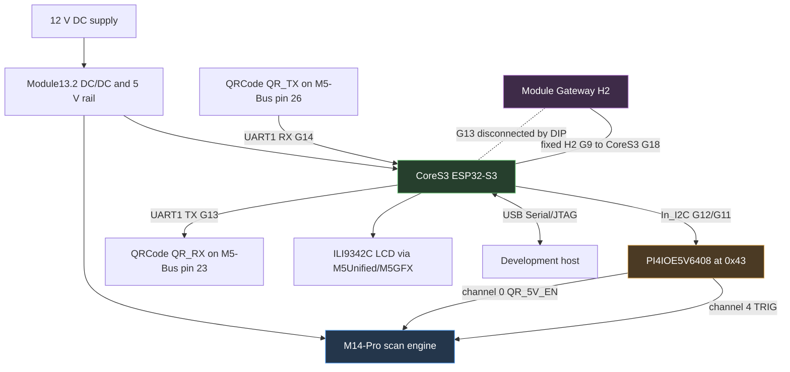
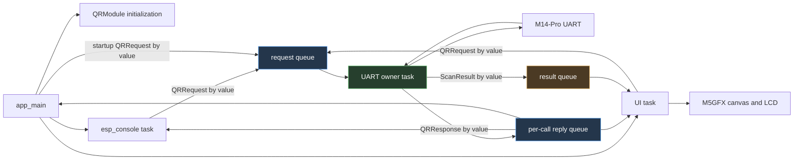

# CoreS3 QRCode Scanner: Hardware Bring-Up, UART Framing, and FreeRTOS Ownership

The CoreS3 QRCode Scanner is ESP-IDF firmware for an M5Stack CoreS3 connected to a Module13.2 QRCode scanner and, optionally, a stacked Module Gateway H2. The scanner engine performs image capture and barcode decoding. The CoreS3 configures the engine over UART, receives decoded bytes, displays the latest value on its LCD, and exposes a USB Serial/JTAG console for diagnostics and control.

The project began as a small device integration and developed into a study of three embedded-system boundaries: electrical pin ownership in a multi-board stack, framing for an asynchronous byte stream without a reliable delimiter, and object lifetime across FreeRTOS task boundaries. Each boundary produced failures that initially resembled problems in another layer. The useful result is not only a scanner firmware, but a concrete record of how to separate hardware, protocol, and concurrency evidence during device bring-up.

> [!summary]
> - The working three-layer UART route is CoreS3 **TX=G13, RX=G14**, with the QRCode module routed to M5-Bus pins 23/26 and the H2's G13 connection switched to NC. The original G17/G18 route conflicts with the H2's fixed G18 connection.
> - The M14-Pro engine emitted decoded bytes without `\r\n`; a quiet-time boundary was required. The live capture decoded `X0052L3WPN` and proved the scanner-to-CoreS3 data path.
> - The first request/response refactor misused FreeRTOS queue-copy semantics, then replaced the lost response with pointers to caller stack state. A timeout deleted the completion semaphore while the UART owner still referenced it, causing a deterministic reboot loop.
> - Commit `38df1be2` replaced those pointers and semaphores with value responses on per-transaction reply queues. A 28-second hardware capture then showed one boot, a running UI, and no assertion, reboot, abort, or watchdog.
> - The firmware is stable, but the scanner is currently not decoding after the factory-reset experiments. It powers briefly, its optics turn off, and firmware/raw queries return no bytes. That hardware/protocol state remains open and is not presented here as solved.

## 1. What the project is building

The target device has three independently meaningful parts:

1. The **CoreS3** is the host controller. It initializes the display, runs ESP-IDF, owns the scanner UART, and provides the USB Serial/JTAG console.
2. The **Module13.2 QRCode** contains the M14-Pro scan engine, illumination and positioning lights, a buzzer, a PI4IOE5V6408 I2C GPIO expander, and a 9–24 V input.
3. The optional **Module Gateway H2** adds an ESP32-H2 for Zigbee, Thread, or Matter work. It also occupies several M5-Bus pins, including one fixed connection that conflicts with the scanner's default CoreS3 UART route.

The CoreS3 does not receive camera frames and decode QR symbols in software. The M14-Pro engine performs that work internally. The firmware deals with decoded text and scanner configuration commands.

The intended user path is short:

```text
power stack
  -> initialize CoreS3 display and internal I2C
  -> enable scanner through PI4IOE5V6408
  -> configure scanner over UART1
  -> start or automatically enter a decode session
  -> receive decoded bytes
  -> delimit one logical scan result
  -> enqueue ScanResult
  -> update LCD and history
```

The implementation lives at:

```text
/home/manuel/code/wesen/go-go-golems/esp32-s3-m5/0118-cores3-qrcode-scanner
```

The associated research ticket is:

```text
/home/manuel/code/wesen/go-go-golems/esp32-s3-m5/
  ttmp/2026/08/23/
  ESP-62-CORES3-QRCODE--esp-idf-cores3-module13-2-qrcode-barcode-qr-scanner-with-on-screen-display-intern-guide
```

## 2. Current status and evidence boundaries

Embedded bring-up reports become misleading when implementation state and hardware proof are merged into one status label. This project has several levels of evidence.

| Claim | Evidence | Status |
|---|---|---|
| ESP-IDF firmware builds with the pinned toolchain | Repeated `idf.py build` and full-clean builds with ESP-IDF 5.3.4 | Proven |
| CoreS3 LCD and USB console initialize | Live boot logs and visible UI startup | Proven |
| PI4IOE5V6408 responds at I2C address `0x43` | Live `begin: expander OK` logs | Proven |
| Scanner UART works on G13/G14 with H2 stacked and its DIPs off | Firmware reply `44 02 c1 00 03 31 2e 30` and scan bytes | Proven |
| Scanner firmware version is `1.0` when responsive | Decoded status reply | Proven |
| Scanner decoded barcode `X0052L3WPN` | UART bytes `58 30 30 35 32 4c 33 57 50 4e` | Proven |
| Quiet-time parser emits a logical result | `qr_module: emit code: X0052L3WPN` | Proven |
| UI task starts after the ownership refactor | `step: UI started`, `ready -- UI + console started` | Proven |
| Crashloop is removed | One boot over 28 seconds, no panic/assert/reboot/watchdog | Proven |
| A post-refactor scan is visibly rendered on the LCD | No single final capture combines stable refactor + `qr_ui: code` + visual confirmation | Not yet re-proven |
| Scanner currently resumes scanning in AUTO mode | Engine powers briefly, then optics turn off; no status/raw response | Currently failing |

The distinction in the final two rows matters. Earlier work proved the physical UART route and decoded-data pump. Later work proved the corrected task-ownership design and stable UI startup. A final hardware run still needs to prove both at the same time.

## 3. Physical architecture and power control

### 3.1 System diagram



### 3.2 Why 12 V matters

The Module13.2 accepts 9–24 V through its barrel connector. Its DC/DC stage supplies the scanner and can supply the stack's 5 V rail. In this project, the 12 V source is not merely an alternate way to power the CoreS3. It supplies the scan engine and its illumination subsystem under the operating conditions expected by the module design.

The CoreS3 controls scanner power through the PI4IOE5V6408 rather than directly driving an engine pin. The official M5Stack library establishes the relevant mapping:

| Expander channel | Signal | Firmware action |
|---:|---|---|
| 0 | `QR_5V_EN` | Drive high to enable scanner power |
| 4 | `TRIG` | Keep high when idle; active-low for pulse-trigger operation |

The firmware performs the same initialization as the official library:

```cpp
for (uint8_t ch : {kChPowerEn, kChTrig}) {
    io.setDirection(ch, true);
    io.setPullMode(ch, true);
    io.enablePull(ch, true);
    io.setHighImpedance(ch, false);
}
setEnable(true);
vTaskDelay(pdMS_TO_TICKS(300));
```

This path was verified independently of scanner UART communication: the expander consistently probes successfully at `0x43`. Therefore, `PI4IOE5V6408 not found` and `scanner does not answer UART` are separate failures and should remain separate in diagnostics.

## 4. Pin routing in the three-layer stack

### 4.1 The original two-layer route

For CoreS3 plus Module13.2 alone, the obvious UART route is:

| Direction | CoreS3 | M5-Bus | QRCode signal |
|---|---:|---:|---|
| CoreS3 to scanner | G17 TX | pin 16 | `QR_RX` |
| Scanner to CoreS3 | G18 RX | pin 15 | `QR_TX` |

This matches the CoreS3 Port-C UART mapping and the original project design. It is also the route still described in `0118-cores3-qrcode-scanner/README.md`, which is now stale for the three-layer configuration.

### 4.2 Why the H2 makes G18 unusable

The Module Gateway H2 connects its GPIO9 to M5-Bus pin 15, which maps to CoreS3 G18. This connection is fixed. It is not one of the H2's DIP-switchable lines.

If the QRCode module also routes `QR_TX` to pin 15, both the scanner and H2 are electrically connected to CoreS3 G18. Even if the CoreS3 configures G18 as an input, the two modules can still drive or load the same line. The resulting symptoms include missing replies, corrupted bytes, and state-dependent behavior.

The H2 DIPs disconnect these CoreS3 lines:

```text
G35, G36, G37, G13, G5, G6, G0
```

G18 is absent from that list. It cannot be released with an H2 DIP.

### 4.3 Routes considered

| Candidate route | Advantage | Blocking issue |
|---|---|---|
| G17/G18 | Native CoreS3 Port-C UART | H2 has fixed G18 connection |
| G43/G44 | H2 does not use these pins | Reserved for ESP32-S3 USB Serial/JTAG console and flash workflow |
| G6/G7 | QRCode DIP supports this pair | H2 uses `BT_ACTIVE` and enable lines |
| G13/G14 | Scanner can route to pins 23/26; G14 is free | H2 uses G13 as SPI CS, but G13 is DIP-disconnectable |

The selected three-layer route is therefore:

```text
CoreS3 UART1 TX = G13 -> M5-Bus pin 23 -> QR_RX
CoreS3 UART1 RX = G14 <- M5-Bus pin 26 <- QR_TX
```

The H2's G13 DIP must be set to NC. During live bring-up, setting all H2 DIPs off provided a known disconnected state and produced both the firmware reply and decoded scan bytes.

### 4.4 What the routing investigation established

The routing problem was not solved by trying UART pins until bytes appeared. It was solved by combining four sources:

1. the CoreS3-to-M5-Bus map;
2. the Module13.2 DIP-routable UART pairs;
3. the H2 compatibility matrix;
4. the H2 schematic, which distinguishes fixed from DIP-switchable connections.

This produced a route with explicit electrical ownership. That standard is stronger than observing one successful packet, because it explains why the route remains valid when the H2 is present.

## 5. Scanner protocol

### 5.1 UART configuration

The M14-Pro interface runs at 115200 baud, 8 data bits, no parity, one stop bit, and no flow control. The firmware uses ESP-IDF UART1 with 1024-byte RX and TX buffers.

Commands have a compact byte-oriented structure:

```text
TYPE  PID  FID  PARAM...
```

The principal command classes are:

| Type | Meaning | Reply type |
|---:|---|---:|
| `0x21` | configuration write | `0x22` |
| `0x23` | configuration read | `0x24` |
| `0x32` | control | `0x33` when defined |
| `0x43` | status read | `0x44` |
| `0x60` | image read | `0x61` |

The firmware uses a limited subset:

| Operation | Host bytes | Expected behavior |
|---|---|---|
| Read firmware | `43 02 C1` | `44 02 C1 <len-hi> <len-lo> <data>` |
| Start decode | `32 75 01` | no reply required |
| Stop decode | `32 75 02` | `33 75 02 00 00` |
| Set continuous | `21 61 41 01` | `22 61 41 01 00` |
| Set auto | `21 61 41 02` | `22 61 41 02 00` |
| Fill light on decode | `21 62 41 02` | `22 62 41 02 00` |
| Fill light always on | `21 62 41 03` | `22 62 41 03 00` |
| Position light on decode | `21 62 42 02` | `22 62 42 02 00` |
| Factory reset | `32 76 01` | persistent reset behavior; use with care |

The trigger-mode values in the implementation match the official library:

```cpp
enum TriggerMode {
    KEY = 0,
    CONTINUOUS = 1,
    AUTO = 2,
    PULSE = 4,
    MOTION = 5,
};
```

### 5.2 Status reply parsing

A status response begins with a five-byte header:

```text
44  <PID>  <FID>  <length high>  <length low>  <payload...>
```

The payload length is big-endian. The firmware version reply observed on hardware was:

```text
44 02 c1 00 03 31 2e 30
```

Parsing it produces:

```text
length = 0x0003
payload = 31 2e 30
text    = "1.0"
```

An early bug treated a valid zero-length payload as failure. The scanner's serial-number query could return a valid `0x44` header with no data, so success must be based on a valid reply header and complete declared payload, not on `payload_length > 0`.

## 6. Scan results are a separate data path

Configuration/status traffic is framed. Decoded barcode output is not necessarily framed the same way. The official library reads whatever bytes are available and returns them as a string. In the observed module state, decoded output arrived without `\r\n`.

The live barcode was:

```text
ASCII: X0052L3WPN
HEX:   58 30 30 35 32 4c 33 57 50 4e
```

Continuous mode repeated those ten bytes at approximately 100 ms intervals. A parser that waited only for `\r\n` accumulated data indefinitely and never emitted a result.

### 6.1 Quiet-time framing

The accumulator now treats 30 ms without a new byte as a record boundary. It also recognizes `\r\n` if suffix configuration succeeds and enforces a length cap.

The intended state transition is:

```text
EMPTY
  -- byte --> ACCUMULATING

ACCUMULATING
  -- byte --> append; reset last_rx timestamp
  -- CRLF --> emit without CRLF; return EMPTY
  -- length cap --> emit; return EMPTY
  -- idle >= 30 ms --> emit; return EMPTY
```

A crucial implementation detail was missed in the first quiet-time patch: the code tested elapsed time only when another UART packet arrived. A one-shot decode with no later packet would remain buffered forever. The owner loop must invoke the framing function after a UART read timeout as well as after a successful read.

Current logic:

```cpp
int n = engine.readBytes(buf, sizeof(buf), 30);
pump(n > 0 ? buf : nullptr, n);
```

Inside `pump`, the idle deadline is evaluated before returning on `n <= 0`:

```cpp
if (len && last_rx_us && now - last_rx_us >= 30000) {
    line[len] = 0;
    emit(line);
    len = 0;
}
if (!data || n <= 0) return;
```

This supports both continuous and one-shot output without requiring a configured suffix.

## 7. Firmware architecture

### 7.1 Source boundaries

| File | Responsibility |
|---|---|
| `main/app_main.cpp` | CoreS3 boot, startup order, top-level service wiring |
| `main/qr_engine.{h,cpp}` | M14-Pro command bytes and ESP-IDF UART reads/writes |
| `main/qr_module.{h,cpp}` | Expander control, UART owner task, request/reply queues, scan accumulator |
| `main/qr_console.{h,cpp}` | USB Serial/JTAG `qr` command family |
| `main/qr_ui.{h,cpp}` | Display owner task, buttons, current result, recent history |

The project uses M5Unified and M5GFX as managed ESP-IDF components. This follows existing repository practice and provides both the CoreS3 display integration and the PI4IOE5V6408 class used by the official scanner library.

### 7.2 Runtime ownership



The central invariant is precise:

> Only the UART owner task calls `uart_read_bytes`, `uart_write_bytes`, `uart_flush_input`, or any `QRCodeM14` method that uses them.

The console, UI, and startup code submit commands. They do not pause the owner and access the engine directly. This removes command/reply races with the scan pump.

### 7.3 UI ownership

The UI task is similarly single-owner state. It is the only task that calls `M5.update()` or redraws the LCD. It maintains:

- scanning state;
- current trigger mode;
- firmware text;
- latest decoded value;
- a six-entry history;
- a dirty flag.

BtnA toggles scanning. BtnB cycles the supported modes, skipping enum value 3. The result queue carries fixed-size `ScanResult` values so scanner data remains valid after the UART owner returns to its loop.

## 8. The implementation sequence

The firmware was built in small commits so each boundary could be examined independently.

| Commit | Phase | Result |
|---|---|---|
| `9981d58f` | CoreS3 skeleton and display | M5Unified/M5GFX boot and build baseline |
| `bd0e0a5b` | Scanner driver | PI4IOE5V6408, UART1, M14-Pro protocol, status command |
| `79eeb454` | On-screen UI | Single display task, buttons, current code and history |
| `52d01d75` | Console and documentation | Runtime controls and reproducible full-clean build |
| `c0787055` | Live scan framing and first response repair | G13/G14 route, quiet-time emit, but unsafe response pointers |
| `bc5c7dce` | UART serialization | Startup configuration routed through owner; UI reaches startup |
| `38df1be2` | Lifetime-safe request/reply | Value reply queues; crashloop removed; raw console owner-mediated |

The sequence matters because later fixes do not invalidate earlier hardware evidence. The scan bytes proved the route and engine output. The crash fix proved task lifetime and startup stability. The remaining work is to restore scanner operating state and combine those proofs in one final run.

## 9. Live bring-up: failures and what each one established

### 9.1 USB device present, no `/dev/ttyACM0`

The host initially saw Espressif USB device `303a:1001`, but Linux had not loaded `cdc_acm`. This created a USB enumeration fact without a serial character device. Loading `cdc_acm` produced `/dev/ttyACM0` and enabled flashing and monitoring.

The stable operational path is the by-id symlink:

```text
/dev/serial/by-id/
usb-Espressif_USB_JTAG_serial_debug_unit_30:ED:A0:0B:0F:50-if00
```

The tty number changed during re-enumeration, while the by-id path remained stable.

### 9.2 A host serial probe could not reach the stacked scanner

The QRCode engine's UART is connected to the CoreS3's UART1 through the M5-Bus. It is not bridged to the CoreS3 USB console. A host `pyserial` script connected to USB Serial/JTAG cannot directly send M14-Pro commands to UART1.

The useful probe therefore became an on-device console command. `qr raw 43 02 C1` sends bytes through the scanner UART and prints the reply over the independent USB console.

### 9.3 Apparent boot hang

Early logs stopped near UART initialization, which suggested a driver deadlock. Additional step logs and moving console startup earlier showed that the application was not deadlocked. The missing output was a logging/observation problem. This distinction prevented changes to the UART driver based on an unproven hypothesis.

### 9.4 Firmware status said no reply while raw bytes showed `1.0`

The raw command established that the electrical route and UART parameters were correct. The higher-level status method still reported failure because it mishandled response semantics. This was a protocol parser bug, not a hardware failure.

The diagnostic sequence was effective because it tested progressively narrower layers:

```text
expander probe
  -> UART raw bytes
  -> status frame parser
  -> public getInfo API
  -> console formatting
```

### 9.5 Scanner beeps but UI remains empty

A raw UART capture showed decoded text without a terminator. That isolated the failure to scan-result framing. Adding quiet-time emission produced:

```text
qr_module: emit code: X0052L3WPN
```

At that point, the optical scanner, UART route, decoded output, and accumulator had all been demonstrated.

## 10. FreeRTOS queue semantics and the crashloop

The concurrency failures occurred in three stages. Each stage corrected one visible symptom while exposing a deeper ownership problem.

### 10.1 Stage one: modifying a copied request

The first request type contained its response fields directly:

```cpp
struct QRRequest {
    QRReqType type;
    char resp_str[64];
    bool resp_ok;
    SemaphoreHandle_t resp_sem;
};
```

The caller created a request on its stack and sent it through `xQueueSend`. FreeRTOS copied the request bytes into the queue. The owner received another copy and wrote `resp_str` and `resp_ok` there. Giving the semaphore woke the caller, but the caller examined its original request, which remained unchanged.

The trace made the contradiction visible:

```text
getInfos ... data_got=3 -> '1.0'
getInfo ... semaphore completed
module ready, firmware=(no reply)
```

The UART transaction succeeded. Response propagation failed.

### 10.2 Stage two: pointers made the response visible but unsafe

The next version put pointers in the copied request:

```cpp
char *resp_out;
bool *resp_ok_flag;
SemaphoreHandle_t resp_sem;
```

The owner could now write through those pointers into caller-owned storage. This worked when the owner completed before the caller returned.

The caller imposed a 1500 ms timeout:

```cpp
bool done = xSemaphoreTake(resp_sem, pdMS_TO_TICKS(1500));
vSemaphoreDelete(resp_sem);
return done && ok_flag;
```

This timeout was shorter than the full worst-case `getInfos` operation, which could spend 800 ms waiting for a header and another 800 ms waiting for payload. More importantly, the timeout started when the request was enqueued. Startup configuration commands ahead of the UI query added their own ACK waits.

The failure sequence was deterministic:

```mermaid
sequenceDiagram
    participant UI as UI/app caller
    participant Q as Request queue
    participant O as UART owner
    participant S as Deleted semaphore / stack state

    UI->>Q: enqueue GetInfo with pointers and semaphore
    Note over O: process earlier configuration commands
    UI->>UI: 1500 ms timeout expires
    UI->>S: delete semaphore
    UI->>UI: return; stack response fields expire
    Q->>O: deliver GetInfo
    O->>O: complete UART query
    O->>S: write response and xSemaphoreGive
    S-->>O: invalid object access
    O-->>UI: assert and reboot
```

The exact assertion was:

```text
assert failed: xQueueGenericSend queue.c:937
(!( ( pvItemToQueue == ((void *)0) ) &&
   ( pxQueue->uxItemSize != ( UBaseType_t ) 0U ) ))
```

A 14-second capture contained three `Calling app_main` lines and repeated `Rebooting...` output.

### 10.3 Why the assertion mentioned `xQueueGenericSend`

`xSemaphoreGive` uses FreeRTOS queue internals. A semaphore is represented by a queue-like object with zero-size items, so giving it invokes a queue send with no item payload. The code called this operation through an invalid, deleted handle. The resulting object state no longer satisfied the semaphore invariants, and the assertion appeared in `xQueueGenericSend`.

Every explicit application `xQueueSend` passed `&request` or `&result`, which initially made the null-item message confusing. Decoding the backtrace located the hidden send:

```text
QRModule::ownerTask
  -> QRModule::handle
  -> xSemaphoreGive
  -> xQueueGenericSend
```

The failure was a lifetime error, not a null request-queue payload.

## 11. Correct request/reply ownership

The corrected design uses a response object copied by value:

```cpp
struct QRResponse {
    bool ok = false;
    char info[64] = {0};
    uint8_t raw[128] = {0};
    size_t raw_len = 0;
};
```

A synchronous caller creates a one-element response queue, includes its handle in the request, and waits for the response:

```cpp
bool QRModule::transact(QRRequest &request, QRResponse *response) {
    QueueHandle_t reply = xQueueCreate(1, sizeof(QRResponse));
    if (!reply) return false;

    request.reply_queue = reply;
    bool sent = xQueueSend(_req_q, &request, pdMS_TO_TICKS(100)) == pdTRUE;
    bool received = false;
    if (sent) {
        received = xQueueReceive(reply, response, portMAX_DELAY) == pdTRUE;
    }
    vQueueDelete(reply);
    return sent && received;
}
```

The owner creates its response locally and copies it into the response queue:

```cpp
void QRModule::handle(const QRRequest &request) {
    QRResponse response{};

    switch (request.type) {
        case QRReqType::GetInfo:
            response.ok = engine.getInfos(
                request.arg_u8, response.info, sizeof(response.info));
            break;
        // other commands omitted
    }

    if (request.reply_queue) {
        xQueueSend(request.reply_queue, &response, portMAX_DELAY);
    }
}
```

The ownership rules are now explicit:

- `QRRequest` is copied by value into the request queue.
- `QRResponse` is copied by value into the reply queue.
- The caller owns the reply queue.
- The caller does not delete the reply queue until it receives the owner's response.
- No queued object points to caller stack data.
- Owner-side UART operations are internally bounded, so waiting for completion does not depend on an unsafe caller-side timeout.

If a future command can block indefinitely, this design must be extended. A safe bounded timeout would require owner-managed transaction allocation, cancellation acknowledgment, reference counting, or a persistent response channel. Reintroducing a caller timeout followed by immediate queue deletion would recreate the same class of bug.

## 12. Removing the remaining UART escape hatch

The console originally implemented `qr raw` by setting a volatile pause flag, waiting for the owner loop to notice it, then calling the protocol engine directly from the console task. That does not establish exclusive ownership. The owner can already be inside `uart_read_bytes` or command handling when the flag changes.

The corrected design adds `RawCommand` as another owner request. The command bytes are copied into `QRRequest`; reply bytes are copied into `QRResponse`. The console never receives a `QRCodeM14&` and cannot access UART1 directly.

This change matters even if raw commands are used only for debugging. Debug paths execute during failures, when timing and state are already abnormal. They need stronger ownership rules than the normal path, not weaker ones.

## 13. Validation after the lifetime fix

The fixed firmware was built with ESP-IDF 5.3.4 and flashed through the stable USB by-id port. Validation used one serial owner at a time.

### 13.1 Clean boot capture

A 28-second reset-and-boot capture showed:

```text
boot_count = 1
assertions = 0
backtraces = 0
reboots = 0
watchdogs = 0
```

The important milestones were:

```text
I (...) cores3_qr: module ready, firmware=(no reply)
I (...) qr_ui: start: entering (will read firmware)
I (...) qr_ui: start: firmware=(no reply), creating UI task
I (...) cores3_qr: step: UI started
I (...) cores3_qr: ready -- UI + console started
```

The scanner did not answer, but the failed query became a normal response path. It no longer corrupted RTOS state.

### 13.2 Transaction tests

The console then exercised multiple paths:

1. `qr status` ran two sequential synchronous `getInfo` transactions and returned `NO REPLY` without crashing.
2. `qr raw 43 02 C1` ran through the owner and returned `rx 0 bytes:`.
3. A subsequent `qr start` returned `started`, demonstrating that the owner task remained alive and responsive after the raw transaction.

Evidence files remain in the ESP-62 ticket:

```text
various/2026-08-23-queue-lifetime-fix-28s-clean-boot.txt
various/2026-08-23-queue-lifetime-fix-status.txt
various/2026-08-23-owner-mediated-raw-command.txt
various/2026-08-23-post-raw-start-command.txt
```

## 14. The current scanner-state failure

After the crash repair, the firmware is stable but the scanner is not operating normally. The physical observation is specific: the module powers up, its optical subsystem is active briefly, then it turns off. Setting AUTO mode, enabling the fill light, or sending start-decode does not restore scanning. Status and raw firmware queries return no bytes.

This state appeared after factory-reset experiments. The temporal relationship is relevant but does not prove that factory reset is the cause. The current evidence supports these statements:

- The CoreS3 boots and remains stable.
- The PI4IOE5V6408 responds, so the I2C control path exists.
- The firmware drives `QR_5V_EN` high during initialization.
- UART1 is configured for G13/G14 at 115200 8N1.
- The engine previously replied and decoded on this physical route.
- The engine currently does not answer `43 02 C1` and does not remain visibly active in AUTO mode.

### 14.1 Leading hypotheses

The next investigation should treat these as hypotheses, not conclusions:

1. **Persistent factory-reset state.** Reset may have restored an interface, trigger, protocol, or power-related configuration that differs from the previously working state.
2. **Startup command failure hidden by `void` APIs.** Mode and light setters currently enqueue commands but do not report `CmdResult`. The console prints `mode set` when the request was submitted, not when the scanner acknowledged it.
3. **Configuration order.** Startup sends status, fill-light mode, position-light mode, continuous mode, communication mode, and suffix configuration. One command may invalidate or flush traffic needed by a later command.
4. **Physical route changed during handling.** QRCode DIP positions, H2 DIP positions, or stack contact may no longer match the proven G13/G14 configuration.
5. **Power-enable or trigger level differs from the intended electrical state.** The expander responds, but its output values have not yet been read back during the failing state.
6. **The communication-mode command is ineffective in the current interface state.** If the scanner has returned to a USB-oriented output mode, the UART command may not be accepted or the physical DIP may govern access differently.

### 14.2 Minimal next experiment

The next firmware should reduce startup to one controlled sequence rather than send the full configuration set:

```text
1. Initialize CoreS3 and expander.
2. Drive QR_5V_EN low for a documented interval.
3. Drive TRIG high.
4. Drive QR_5V_EN high.
5. Wait for scanner boot.
6. Configure UART1 G13/G14.
7. Send only 43 02 C1 and capture every received byte.
8. If responsive, send fill-light always-on and record the exact ACK.
9. Send AUTO mode and record the exact ACK.
10. Observe optics and scan bytes before sending suffix or other commands.
```

Every configuration API should return one of:

```text
OK
TIMEOUT
ACK_MISMATCH
INVALID
QUEUE_FULL
MODULE_NOT_READY
```

The console should print that result. `mode set` should mean the scanner acknowledged the exact mode value, not merely that a request entered the queue.

A second experiment should pulse the hardware trigger through expander channel 4 after confirming the idle-high level. That distinguishes a trigger-mode problem from a nonresponsive engine.

## 15. Documentation and implementation debt

Several artifacts were written before the H2 route changed and now need alignment:

- `0118-cores3-qrcode-scanner/README.md` still documents G17/G18. Current code uses G13/G14.
- The original design document describes the two-layer route as the final assignment. The later H2 source notes supersede it for the three-layer stack.
- Setter APIs are `void`, hiding ACK timeout and mismatch results from the UI and console.
- Startup reads firmware twice: once in `app_main` and once in `QRUI::start`. This is safe after the reply-queue fix but unnecessary. Firmware metadata should be read once or cached.
- Continuous scans are not deduplicated before entering UI history.
- The quiet-time threshold requires testing with long and fragmented barcode payloads.

These are not reasons to discard the current architecture. They are the next points where evidence and API contracts need to become more precise.

## 16. Working rules established by the project

- Assign every physical bus line one electrical owner. A pin map is incomplete unless it distinguishes fixed and disconnectable connections.
- Preserve USB Serial/JTAG on ESP32-S3 unless the project explicitly replaces the console and flashing workflow.
- Test protocol layers independently. Raw reply bytes can prove hardware while a high-level status API remains wrong.
- Treat decoded scan output separately from command replies. They have different framing rules even though they share one UART.
- A quiet-time parser must receive idle ticks. Checking elapsed time only when new bytes arrive does not complete one-shot records.
- FreeRTOS queues copy item bytes. Modifying a dequeued struct does not modify the sender's original struct.
- A copied pointer does not acquire ownership of the referenced object. The referenced lifetime must cover every possible worker access.
- A timeout followed by deletion is unsafe when the worker can still signal or write through the transaction.
- Keep one task as the sole UART owner. Console diagnostics, UI actions, and startup configuration all use the same command path.
- Preserve failing intermediate commits and diary entries. The pointer-based response commit is wrong, but it provides the exact transition from lost response to use-after-free.
- Distinguish firmware stability from peripheral functionality. The current system is stable while the scanner remains unresponsive.

## 17. Building and reproducing

The project is pinned to ESP-IDF 5.3.4:

```bash
cd /home/manuel/code/wesen/go-go-golems/esp32-s3-m5/0118-cores3-qrcode-scanner
unset IDF_PYTHON_ENV_PATH
source ~/esp/esp-idf-5.3.4/export.sh
idf.py build
idf.py -p \
  /dev/serial/by-id/usb-Espressif_USB_JTAG_serial_debug_unit_30:ED:A0:0B:0F:50-if00 \
  flash
```

Use the ticket monitor helper for bounded captures:

```bash
python3 ../ttmp/2026/08/23/ESP-62-CORES3-QRCODE--*/scripts/03-serial-monitor.py \
  --port /dev/serial/by-id/usb-Espressif_USB_JTAG_serial_debug_unit_30:ED:A0:0B:0F:50-if00 \
  --secs 20 \
  --out /tmp/cores3-qr.txt
```

Only one process should own the serial device. Stop monitors before flashing and do not run `idf.py monitor` concurrently with a Python capture.

Useful console commands are:

```text
qr status
qr raw 43 02 C1
qr start
qr stop
qr mode key|cont|auto|pulse|sense
qr light off|decode|on
qr brightness 0-100
qr beep on|off
qr reset
```

Until ACK results are surfaced, configuration-command output confirms submission only.

## 18. Source map

The durable evidence is concentrated in these paths:

### Firmware

```text
/home/manuel/code/wesen/go-go-golems/esp32-s3-m5/0118-cores3-qrcode-scanner/main/app_main.cpp
/home/manuel/code/wesen/go-go-golems/esp32-s3-m5/0118-cores3-qrcode-scanner/main/qr_engine.cpp
/home/manuel/code/wesen/go-go-golems/esp32-s3-m5/0118-cores3-qrcode-scanner/main/qr_module.cpp
/home/manuel/code/wesen/go-go-golems/esp32-s3-m5/0118-cores3-qrcode-scanner/main/qr_console.cpp
/home/manuel/code/wesen/go-go-golems/esp32-s3-m5/0118-cores3-qrcode-scanner/main/qr_ui.cpp
```

### Ticket documents

```text
.../design-doc/01-cores3-module13.2-qrcode-scanner-analysis-design-and-implementation-guide.md
.../reference/01-diary.md
.../sources/MANIFEST.md
.../sources/qr-uart-on-g13-g14-with-h2-uart-mode.md
.../sources/stack-compat-cores3-qrcode-h2.md
.../sources/module-gateway-h2-M141-pinmap.md
```

### Primary external material saved locally

```text
.../sources/arduino-lib/src/M5ModuleQRCode.cpp
.../sources/arduino-lib/src/qrcode_m14.cpp
.../sources/protocol-pdf/Module13.2-QRCode-Protocol-EN.txt
.../sources/protocol-pdf/ZBarcode-Scanner-User-Guide-2.5-EN.txt
.../sources/h2/SCH_Module-Gateway_H2_v0.4.pdf
```

## 19. Near-term next steps

1. Create a minimal scanner-recovery boot path with no suffix configuration and no duplicate firmware query.
2. Return and display command ACK results for trigger mode, lights, brightness, stop, and suffix configuration.
3. Read back or explicitly log PI4IOE5V6408 power-enable and trigger states.
4. Verify QRCode pin routing remains pin 23/26 and H2 G13 is disconnected.
5. Perform a controlled scanner power cycle through `QR_5V_EN`, then query firmware before any other command.
6. Re-establish a responsive engine and capture one final sequence containing `firmware=1.0`, `emit code`, `qr_ui: code`, and visual LCD confirmation.
7. Update the README and design document to make G13/G14 the documented three-layer route while retaining G17/G18 as the two-layer alternative.
8. Add scan deduplication and test long payload framing only after the scanner state is recovered.

## Related notes

- [[ARTICLE - QuickJS Wasm on ESP32-P4 - Device Bring-Up and Two WAMR Embedding Crashes]] — another ESP-IDF owner-thread postmortem where execution context and resource ownership determined correctness.
- [[ARTICLE - ESP32-S3 QuickJS HTTP and Fetch - Owner Tasks Promises and Stored Scripts]] — owner-task patterns for serializing access to stateful embedded runtimes.
- [[PROJ - CoreS3 Magnet Base - 3D Model Search]] — related CoreS3 project context in the vault.

> [!important]
> The project is not complete merely because it no longer reboots. Completion requires the scanner to answer configuration queries, decode a code, deliver the result through the stable owner-task architecture, and display it on the CoreS3 LCD in one reproducible hardware run.
