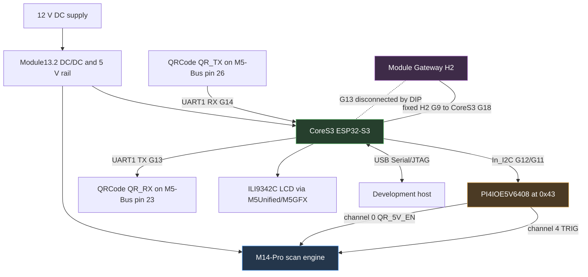
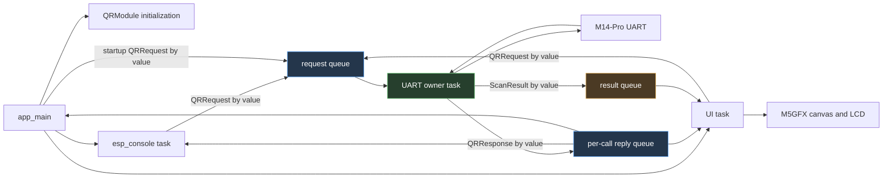
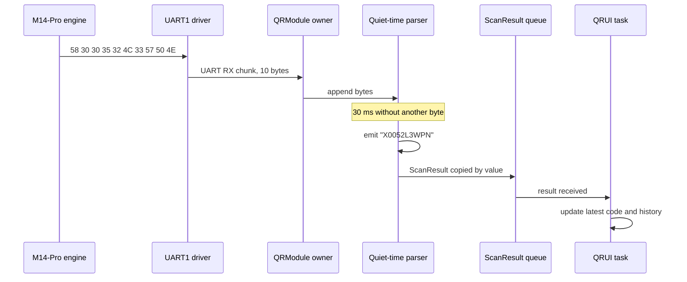

# CoreS3 QRCode Scanner: Hardware Bring-Up, UART Framing, FreeRTOS Ownership, and Stateful Interface Recovery

The CoreS3 QRCode Scanner is ESP-IDF firmware for an M5Stack CoreS3 connected to a Module13.2 QRCode scanner and, optionally, a stacked Module Gateway H2. The scanner engine performs image capture and barcode decoding. The CoreS3 configures the engine over UART, receives decoded bytes, displays the latest value on its LCD, and exposes a USB Serial/JTAG console for diagnostics and control.

The project began as a small device integration and developed into a study of four embedded-system boundaries: electrical pin ownership in a multi-board stack, framing for an asynchronous byte stream without a reliable delimiter, object lifetime across FreeRTOS task boundaries, and persistent state inside an independently programmable peripheral. Each boundary produced symptoms that initially implicated another layer. The final recovery is valuable because it shows how to separate host firmware, electrical control, scanner operation, transport selection, and UI delivery with concrete evidence.

> [!summary]
> - The working UART route is CoreS3 **TX=G13, RX=G14**, with the QRCode module routed to M5-Bus pins 23/26. The original G17/G18 route conflicts with the optional H2's fixed G18 connection; the final recovery test removed the H2 entirely.
> - The M14-Pro engine emitted decoded bytes without `\r\n`; a quiet-time boundary was required. The live capture decoded `X0052L3WPN` and proved raw UART, framing, result-queue, and UI delivery.
> - The first request/response refactor misunderstood FreeRTOS queue-copy semantics. Its pointer-based repair then deleted a semaphore and invalidated stack storage while the UART owner still referenced both, producing a deterministic reboot loop.
> - Commit `38df1be2` replaced caller-owned response pointers with value responses on per-transaction reply queues. Subsequent captures showed one stable boot and no assertion, reboot, abort, or watchdog.
> - The long no-UART incident was not a baud, pin, power, parser, or current-firmware failure. The scanner had persisted a USB communication mode. Optical triggering still worked, but decoded values and command replies were not routed to TTL serial.
> - Scanning the official **Serial Communication** programming barcode `21424000` restored UART. The next capture contained firmware `1.0`, raw bytes for `X0052L3WPN`, `emit code`, and `qr_ui: code` in one stable run.

## 1. What the project is building

The target device has three independently meaningful parts:

1. The **CoreS3** is the host controller. It initializes the display, runs ESP-IDF, owns the scanner UART, and provides the USB Serial/JTAG console.
2. The **Module13.2 QRCode** contains the M14-Pro scan engine, illumination and positioning lights, a buzzer, a PI4IOE5V6408 I2C GPIO expander, and a 9–24 V input.
3. The optional **Module Gateway H2** adds an ESP32-H2 for Zigbee, Thread, or Matter work. It also occupies several M5-Bus pins, including one fixed connection that conflicts with the scanner's default CoreS3 UART route.

The CoreS3 does not receive camera frames and decode QR symbols in software. The M14-Pro engine performs that work internally. The firmware deals with decoded text and scanner configuration commands.

The intended user path is short:

```text
power stack
  -> initialize CoreS3 display and internal I2C
  -> enable scanner through PI4IOE5V6408
  -> configure scanner over UART1
  -> start or automatically enter a decode session
  -> receive decoded bytes
  -> delimit one logical scan result
  -> enqueue ScanResult
  -> update LCD and history
```

The implementation lives at:

```text
/home/manuel/code/wesen/go-go-golems/esp32-s3-m5/0118-cores3-qrcode-scanner
```

The associated research ticket is:

```text
/home/manuel/code/wesen/go-go-golems/esp32-s3-m5/
  ttmp/2026/08/23/
  ESP-62-CORES3-QRCODE--esp-idf-cores3-module13-2-qrcode-barcode-qr-scanner-with-on-screen-display-intern-guide
```

## 2. Current status and evidence boundaries

Embedded bring-up reports become misleading when implementation state and hardware proof are merged into one status label. This project has several levels of evidence.

| Claim | Evidence | Status |
|---|---|---|
| ESP-IDF firmware builds with the pinned toolchain | Repeated `idf.py build` and full-clean builds with ESP-IDF 5.3.4 | Proven |
| CoreS3 LCD and USB console initialize | Live boot logs and visible UI startup | Proven |
| PI4IOE5V6408 responds at I2C address `0x43` | Live `begin: expander OK` logs | Proven |
| Scanner UART works on G13/G14 with H2 stacked and its DIPs off | Firmware reply `44 02 c1 00 03 31 2e 30` and scan bytes | Proven |
| Scanner firmware version is `1.0` when responsive | Decoded status reply | Proven |
| Scanner decoded barcode `X0052L3WPN` | UART bytes `58 30 30 35 32 4c 33 57 50 4e` | Proven |
| Quiet-time parser emits a logical result | `qr_module: emit code: X0052L3WPN` | Proven |
| UI task starts after the ownership refactor | `step: UI started`, `ready -- UI + console started` | Proven |
| Crashloop is removed | One boot over 28 seconds, no panic/assert/reboot/watchdog | Proven |
| Post-refactor scan reaches the UI task | `UART RX chunk`, `emit code`, and `qr_ui: code: X0052L3WPN` in one capture | Proven |
| Persisted USB mode explains the silent UART | Trigger tests produced optics with zero UART; scanning `21424000` immediately restored replies and scan bytes | Proven by intervention |
| Scanner firmware version after recovery | `qr firmware=1.0` | Proven |
| AUTO/continuous mode is restored as the default user experience | User identified it as preferred; final ACK-backed startup configuration remains to be re-enabled | Pending |

The evidence now joins the previously separate proofs. The corrected owner-task architecture receives a real scan, quiet-time framing emits it, and the UI task consumes it. AUTO/continuous startup remains a product-behavior task, not an unresolved transport failure.

## 3. Physical architecture and power control

### 3.1 System diagram



### 3.2 Why 12 V matters

The Module13.2 accepts 9–24 V through its barrel connector. Its DC/DC stage supplies the scanner and can supply the stack's 5 V rail. In this project, the 12 V source is not merely an alternate way to power the CoreS3. It supplies the scan engine and its illumination subsystem under the operating conditions expected by the module design.

The CoreS3 controls scanner power through the PI4IOE5V6408 rather than directly driving an engine pin. The official M5Stack library establishes the relevant mapping:

| Expander channel | Signal | Firmware action |
|---:|---|---|
| 0 | `QR_5V_EN` | Drive high to enable scanner power |
| 4 | `TRIG` | Keep high when idle; active-low for pulse-trigger operation |

The initial firmware enabled output drive before preloading the active-low trigger's idle state. The final implementation uses a stricter ordering, derived from the minimal `0119` probe:

```cpp
io.digitalWrite(kChPowerEn, false); // preload engine off
io.digitalWrite(kChTrig, true);     // preload active-low TRIG idle
for (uint8_t ch : {kChPowerEn, kChTrig}) {
    io.setDirection(ch, true);
    io.setPullMode(ch, true);
    io.enablePull(ch, true);
    io.setHighImpedance(ch, false);
}
setTriggerLevel(true);              // establish idle before power edge
io.digitalWrite(kChPowerEn, true);  // power engine last
```

The ordering prevents an accidental trigger assertion while scanner power rises. It did not, by itself, repair the later transport outage, but it removes a real electrical ambiguity from startup.

This path was verified independently of scanner UART communication: the expander consistently probes successfully at `0x43`. Therefore, `PI4IOE5V6408 not found` and `scanner does not answer UART` are separate failures and should remain separate in diagnostics.

## 4. Pin routing in the three-layer stack

### 4.1 The original two-layer route

For CoreS3 plus Module13.2 alone, the obvious UART route is:

| Direction | CoreS3 | M5-Bus | QRCode signal |
|---|---:|---:|---|
| CoreS3 to scanner | G17 TX | pin 16 | `QR_RX` |
| Scanner to CoreS3 | G18 RX | pin 15 | `QR_TX` |

This matches the CoreS3 Port-C UART mapping and the original project design. The README now documents G13/G14 as the active route and retains the routing investigation as context for optional H2 integration.

### 4.2 Why the H2 makes G18 unusable

The Module Gateway H2 connects its GPIO9 to M5-Bus pin 15, which maps to CoreS3 G18. This connection is fixed. It is not one of the H2's DIP-switchable lines.

If the QRCode module also routes `QR_TX` to pin 15, both the scanner and H2 are electrically connected to CoreS3 G18. Even if the CoreS3 configures G18 as an input, the two modules can still drive or load the same line. The resulting symptoms include missing replies, corrupted bytes, and state-dependent behavior.

The H2 DIPs disconnect these CoreS3 lines:

```text
G35, G36, G37, G13, G5, G6, G0
```

G18 is absent from that list. It cannot be released with an H2 DIP.

### 4.3 Routes considered

| Candidate route | Advantage | Blocking issue |
|---|---|---|
| G17/G18 | Native CoreS3 Port-C UART | H2 has fixed G18 connection |
| G43/G44 | H2 does not use these pins | Reserved for ESP32-S3 USB Serial/JTAG console and flash workflow |
| G6/G7 | QRCode DIP supports this pair | H2 uses `BT_ACTIVE` and enable lines |
| G13/G14 | Scanner can route to pins 23/26; G14 is free | H2 uses G13 as SPI CS, but G13 is DIP-disconnectable |

The selected three-layer route is therefore:

```text
CoreS3 UART1 TX = G13 -> M5-Bus pin 23 -> QR_RX
CoreS3 UART1 RX = G14 <- M5-Bus pin 26 <- QR_TX
```

The H2's G13 DIP must be set to NC. During live bring-up, setting all H2 DIPs off provided a known disconnected state and produced both the firmware reply and decoded scan bytes.

### 4.4 What the routing investigation established

The routing problem was not solved by trying UART pins until bytes appeared. It was solved by combining four sources:

1. the CoreS3-to-M5-Bus map;
2. the Module13.2 DIP-routable UART pairs;
3. the H2 compatibility matrix;
4. the H2 schematic, which distinguishes fixed from DIP-switchable connections.

This produced a route with explicit electrical ownership. That standard is stronger than observing one successful packet, because it explains why the route remains valid when the H2 is present.

## 5. Scanner protocol

### 5.1 UART configuration

The M14-Pro interface runs at 115200 baud, 8 data bits, no parity, one stop bit, and no flow control. The firmware uses ESP-IDF UART1 with 1024-byte RX and TX buffers.

Commands have a compact byte-oriented structure:

```text
TYPE  PID  FID  PARAM...
```

The principal command classes are:

| Type | Meaning | Reply type |
|---:|---|---:|
| `0x21` | configuration write | `0x22` |
| `0x23` | configuration read | `0x24` |
| `0x32` | control | `0x33` when defined |
| `0x43` | status read | `0x44` |
| `0x60` | image read | `0x61` |

The firmware uses a limited subset:

| Operation | Host bytes | Expected behavior |
|---|---|---|
| Read firmware | `43 02 C1` | `44 02 C1 <len-hi> <len-lo> <data>` |
| Start decode | `32 75 01` | no reply required |
| Stop decode | `32 75 02` | `33 75 02 00 00` |
| Set continuous | `21 61 41 01` | `22 61 41 01 00` |
| Set auto | `21 61 41 02` | `22 61 41 02 00` |
| Fill light on decode | `21 62 41 02` | `22 62 41 02 00` |
| Fill light always on | `21 62 41 03` | `22 62 41 03 00` |
| Position light on decode | `21 62 42 02` | `22 62 42 02 00` |
| Factory reset | `32 76 01` | persistent reset behavior; use with care |

The trigger-mode values in the implementation match the official library:

```cpp
enum TriggerMode {
    KEY = 0,
    CONTINUOUS = 1,
    AUTO = 2,
    PULSE = 4,
    MOTION = 5,
};
```

### 5.2 Status reply parsing

A status response begins with a five-byte header:

```text
44  <PID>  <FID>  <length high>  <length low>  <payload...>
```

The payload length is big-endian. The firmware version reply observed on hardware was:

```text
44 02 c1 00 03 31 2e 30
```

Parsing it produces:

```text
length = 0x0003
payload = 31 2e 30
text    = "1.0"
```

An early bug treated a valid zero-length payload as failure. The scanner's serial-number query could return a valid `0x44` header with no data, so success must be based on a valid reply header and complete declared payload, not on `payload_length > 0`.

## 6. Scan results are a separate data path

Configuration/status traffic is framed. Decoded barcode output is not necessarily framed the same way. The official library reads whatever bytes are available and returns them as a string. In the observed module state, decoded output arrived without `\r\n`.

The live barcode was:

```text
ASCII: X0052L3WPN
HEX:   58 30 30 35 32 4c 33 57 50 4e
```

Continuous mode repeated those ten bytes at approximately 100 ms intervals. A parser that waited only for `\r\n` accumulated data indefinitely and never emitted a result.

### 6.1 Quiet-time framing

The accumulator now treats 30 ms without a new byte as a record boundary. It also recognizes `\r\n` if suffix configuration succeeds and enforces a length cap.

The intended state transition is:

```text
EMPTY
  -- byte --> ACCUMULATING

ACCUMULATING
  -- byte --> append; reset last_rx timestamp
  -- CRLF --> emit without CRLF; return EMPTY
  -- length cap --> emit; return EMPTY
  -- idle >= 30 ms --> emit; return EMPTY
```

A crucial implementation detail was missed in the first quiet-time patch: the code tested elapsed time only when another UART packet arrived. A one-shot decode with no later packet would remain buffered forever. The owner loop must invoke the framing function after a UART read timeout as well as after a successful read.

Current logic:

```cpp
int n = engine.readBytes(buf, sizeof(buf), 30);
pump(n > 0 ? buf : nullptr, n);
```

Inside `pump`, the idle deadline is evaluated before returning on `n <= 0`:

```cpp
if (len && last_rx_us && now - last_rx_us >= 30000) {
    line[len] = 0;
    emit(line);
    len = 0;
}
if (!data || n <= 0) return;
```

This supports both continuous and one-shot output without requiring a configured suffix.

## 7. Firmware architecture

### 7.1 Source boundaries

| File | Responsibility |
|---|---|
| `main/app_main.cpp` | CoreS3 boot, startup order, top-level service wiring |
| `main/qr_engine.{h,cpp}` | M14-Pro command bytes and ESP-IDF UART reads/writes |
| `main/qr_module.{h,cpp}` | Expander control, UART owner task, request/reply queues, scan accumulator |
| `main/qr_console.{h,cpp}` | USB Serial/JTAG `qr` command family |
| `main/qr_ui.{h,cpp}` | Display owner task, buttons, current result, recent history |

The project uses M5Unified and M5GFX as managed ESP-IDF components. This follows existing repository practice and provides both the CoreS3 display integration and the PI4IOE5V6408 class used by the official scanner library.

### 7.2 Runtime ownership



The central invariant is precise:

> Only the UART owner task calls `uart_read_bytes`, `uart_write_bytes`, `uart_flush_input`, or any `QRCodeM14` method that uses them.

The console, UI, and startup code submit commands. They do not pause the owner and access the engine directly. This removes command/reply races with the scan pump.

### 7.3 UI ownership

The UI task is similarly single-owner state. It is the only task that calls `M5.update()` or redraws the LCD. It maintains:

- scanning state;
- current trigger mode;
- firmware text;
- latest decoded value;
- a six-entry history;
- a dirty flag.

During recovery, the UI interaction was simplified to match the direct minimal probe: any touchscreen click enqueues a 100 ms active-low hardware-trigger pulse, and no trigger-mode write is coupled to that click. The result queue carries fixed-size `ScanResult` values so scanner data remains valid after the UART owner returns to its loop. AUTO/continuous operation can be restored as ACK-backed startup configuration after UART health is positively established.

## 8. The implementation sequence

The firmware was built in small commits so each boundary could be examined independently.

| Commit | Phase | Result |
|---|---|---|
| `9981d58f` | CoreS3 skeleton and display | M5Unified/M5GFX boot and build baseline |
| `bd0e0a5b` | Scanner driver | PI4IOE5V6408, UART1, M14-Pro protocol, status command |
| `79eeb454` | On-screen UI | Single display task, buttons, current code and history |
| `52d01d75` | Console and documentation | Runtime controls and reproducible full-clean build |
| `c0787055` | Live scan framing and first response repair | G13/G14 route, quiet-time emit, but unsafe response pointers |
| `bc5c7dce` | UART serialization | Startup configuration routed through owner; UI reaches startup |
| `38df1be2` | Lifetime-safe request/reply | Value reply queues; crashloop removed; raw console owner-mediated |
| `66ed582d` | Observable diagnostics | Minimal startup and synchronous command results |
| `8604fd71` | Electrical and baud diagnostics | Output-latch reporting and documented baud sweep |
| `6e28274c` | Nonblocking UI | Long owner diagnostics no longer freeze touch/display |
| `888a0f66` | Safe route probe | G13/G14, G17/G18, and G43/G44 tested without H2 control-line risk |
| `fe21fc26` | Separate minimal probe | One-loop direct expander/UART/TRIG firmware |
| `766a4451` | Safe trigger sequencing | TRIG preloaded high before scanner power |
| `ea5d1d42`, `b8c6258b` | Hardware-trigger UI | Full UI matched the minimal probe's touch behavior |
| `db10cdfd` | Raw receive evidence | Every UART chunk logged before framing |
| `cea1ad44`, `90d97304` | Recovery UX | LCD preserves an explicit offline state and points to programming barcode `21424000` |
| `c881fae5` | Final evidence package | Official guide, recovery barcode, console script, diary, and successful trace |

The sequence matters because each commit constrains a different failure domain. The scan bytes proved the route and engine output. The crash fix proved task lifetime and startup stability. The minimal probe proved optical triggering. The programming barcode then restored the missing transport dimension and combined all proofs in one final run.

## 9. Live bring-up: failures and what each one established

### 9.1 USB device present, no `/dev/ttyACM0`

The host initially saw Espressif USB device `303a:1001`, but Linux had not loaded `cdc_acm`. This created a USB enumeration fact without a serial character device. Loading `cdc_acm` produced `/dev/ttyACM0` and enabled flashing and monitoring.

The stable operational path is the by-id symlink:

```text
/dev/serial/by-id/
usb-Espressif_USB_JTAG_serial_debug_unit_30:ED:A0:0B:0F:50-if00
```

The tty number changed during re-enumeration, while the by-id path remained stable.

### 9.2 A host serial probe could not reach the stacked scanner

The QRCode engine's UART is connected to the CoreS3's UART1 through the M5-Bus. It is not bridged to the CoreS3 USB console. A host `pyserial` script connected to USB Serial/JTAG cannot directly send M14-Pro commands to UART1.

The useful probe therefore became an on-device console command. `qr raw 43 02 C1` sends bytes through the scanner UART and prints the reply over the independent USB console.

### 9.3 Apparent boot hang

Early logs stopped near UART initialization, which suggested a driver deadlock. Additional step logs and moving console startup earlier showed that the application was not deadlocked. The missing output was a logging/observation problem. This distinction prevented changes to the UART driver based on an unproven hypothesis.

### 9.4 Firmware status said no reply while raw bytes showed `1.0`

The raw command established that the electrical route and UART parameters were correct. The higher-level status method still reported failure because it mishandled response semantics. This was a protocol parser bug, not a hardware failure.

The diagnostic sequence was effective because it tested progressively narrower layers:

```text
expander probe
  -> UART raw bytes
  -> status frame parser
  -> public getInfo API
  -> console formatting
```

### 9.5 Scanner beeps but UI remains empty

A raw UART capture showed decoded text without a terminator. That isolated the failure to scan-result framing. Adding quiet-time emission produced:

```text
qr_module: emit code: X0052L3WPN
```

At that point, the optical scanner, UART route, decoded output, and accumulator had all been demonstrated.

## 10. FreeRTOS queue semantics and the crashloop

The concurrency failures occurred in three stages. Each stage corrected one visible symptom while exposing a deeper ownership problem.

### 10.1 Stage one: modifying a copied request

The first request type contained its response fields directly:

```cpp
struct QRRequest {
    QRReqType type;
    char resp_str[64];
    bool resp_ok;
    SemaphoreHandle_t resp_sem;
};
```

The caller created a request on its stack and sent it through `xQueueSend`. FreeRTOS copied the request bytes into the queue. The owner received another copy and wrote `resp_str` and `resp_ok` there. Giving the semaphore woke the caller, but the caller examined its original request, which remained unchanged.

The trace made the contradiction visible:

```text
getInfos ... data_got=3 -> '1.0'
getInfo ... semaphore completed
module ready, firmware=(no reply)
```

The UART transaction succeeded. Response propagation failed.

### 10.2 Stage two: pointers made the response visible but unsafe

The next version put pointers in the copied request:

```cpp
char *resp_out;
bool *resp_ok_flag;
SemaphoreHandle_t resp_sem;
```

The owner could now write through those pointers into caller-owned storage. This worked when the owner completed before the caller returned.

The caller imposed a 1500 ms timeout:

```cpp
bool done = xSemaphoreTake(resp_sem, pdMS_TO_TICKS(1500));
vSemaphoreDelete(resp_sem);
return done && ok_flag;
```

This timeout was shorter than the full worst-case `getInfos` operation, which could spend 800 ms waiting for a header and another 800 ms waiting for payload. More importantly, the timeout started when the request was enqueued. Startup configuration commands ahead of the UI query added their own ACK waits.

The failure sequence was deterministic:

```mermaid
sequenceDiagram
    participant UI as UI/app caller
    participant Q as Request queue
    participant O as UART owner
    participant S as Deleted semaphore / stack state

    UI->>Q: enqueue GetInfo with pointers and semaphore
    Note over O: process earlier configuration commands
    UI->>UI: 1500 ms timeout expires
    UI->>S: delete semaphore
    UI->>UI: return; stack response fields expire
    Q->>O: deliver GetInfo
    O->>O: complete UART query
    O->>S: write response and xSemaphoreGive
    S-->>O: invalid object access
    O-->>UI: assert and reboot
```

The exact assertion was:

```text
assert failed: xQueueGenericSend queue.c:937
(!( ( pvItemToQueue == ((void *)0) ) &&
   ( pxQueue->uxItemSize != ( UBaseType_t ) 0U ) ))
```

A 14-second capture contained three `Calling app_main` lines and repeated `Rebooting...` output.

### 10.3 Why the assertion mentioned `xQueueGenericSend`

`xSemaphoreGive` uses FreeRTOS queue internals. A semaphore is represented by a queue-like object with zero-size items, so giving it invokes a queue send with no item payload. The code called this operation through an invalid, deleted handle. The resulting object state no longer satisfied the semaphore invariants, and the assertion appeared in `xQueueGenericSend`.

Every explicit application `xQueueSend` passed `&request` or `&result`, which initially made the null-item message confusing. Decoding the backtrace located the hidden send:

```text
QRModule::ownerTask
  -> QRModule::handle
  -> xSemaphoreGive
  -> xQueueGenericSend
```

The failure was a lifetime error, not a null request-queue payload.

## 11. Correct request/reply ownership

The corrected design uses a response object copied by value:

```cpp
struct QRResponse {
    bool ok = false;
    char info[64] = {0};
    uint8_t raw[128] = {0};
    size_t raw_len = 0;
};
```

A synchronous caller creates a one-element response queue, includes its handle in the request, and waits for the response:

```cpp
bool QRModule::transact(QRRequest &request, QRResponse *response) {
    QueueHandle_t reply = xQueueCreate(1, sizeof(QRResponse));
    if (!reply) return false;

    request.reply_queue = reply;
    bool sent = xQueueSend(_req_q, &request, pdMS_TO_TICKS(100)) == pdTRUE;
    bool received = false;
    if (sent) {
        received = xQueueReceive(reply, response, portMAX_DELAY) == pdTRUE;
    }
    vQueueDelete(reply);
    return sent && received;
}
```

The owner creates its response locally and copies it into the response queue:

```cpp
void QRModule::handle(const QRRequest &request) {
    QRResponse response{};

    switch (request.type) {
        case QRReqType::GetInfo:
            response.ok = engine.getInfos(
                request.arg_u8, response.info, sizeof(response.info));
            break;
        // other commands omitted
    }

    if (request.reply_queue) {
        xQueueSend(request.reply_queue, &response, portMAX_DELAY);
    }
}
```

The ownership rules are now explicit:

- `QRRequest` is copied by value into the request queue.
- `QRResponse` is copied by value into the reply queue.
- The caller owns the reply queue.
- The caller does not delete the reply queue until it receives the owner's response.
- No queued object points to caller stack data.
- Owner-side UART operations are internally bounded, so waiting for completion does not depend on an unsafe caller-side timeout.

If a future command can block indefinitely, this design must be extended. A safe bounded timeout would require owner-managed transaction allocation, cancellation acknowledgment, reference counting, or a persistent response channel. Reintroducing a caller timeout followed by immediate queue deletion would recreate the same class of bug.

## 12. Removing the remaining UART escape hatch

The console originally implemented `qr raw` by setting a volatile pause flag, waiting for the owner loop to notice it, then calling the protocol engine directly from the console task. That does not establish exclusive ownership. The owner can already be inside `uart_read_bytes` or command handling when the flag changes.

The corrected design adds `RawCommand` as another owner request. The command bytes are copied into `QRRequest`; reply bytes are copied into `QRResponse`. The console never receives a `QRCodeM14&` and cannot access UART1 directly.

This change matters even if raw commands are used only for debugging. Debug paths execute during failures, when timing and state are already abnormal. They need stronger ownership rules than the normal path, not weaker ones.

## 13. Validation after the lifetime fix

The fixed firmware was built with ESP-IDF 5.3.4 and flashed through the stable USB by-id port. Validation used one serial owner at a time.

### 13.1 Clean boot capture

A 28-second reset-and-boot capture showed:

```text
boot_count = 1
assertions = 0
backtraces = 0
reboots = 0
watchdogs = 0
```

The important milestones were:

```text
I (...) cores3_qr: module ready, firmware=(no reply)
I (...) qr_ui: start: entering (will read firmware)
I (...) qr_ui: start: firmware=(no reply), creating UI task
I (...) cores3_qr: step: UI started
I (...) cores3_qr: ready -- UI + console started
```

The scanner did not answer, but the failed query became a normal response path. It no longer corrupted RTOS state.

### 13.2 Transaction tests

The console then exercised multiple paths:

1. `qr status` ran two sequential synchronous `getInfo` transactions and returned `NO REPLY` without crashing.
2. `qr raw 43 02 C1` ran through the owner and returned `rx 0 bytes:`.
3. A subsequent `qr start` returned `started`, demonstrating that the owner task remained alive and responsive after the raw transaction.

Evidence files remain in the ESP-62 ticket:

```text
various/2026-08-23-queue-lifetime-fix-28s-clean-boot.txt
various/2026-08-23-queue-lifetime-fix-status.txt
various/2026-08-23-owner-mediated-raw-command.txt
various/2026-08-23-post-raw-start-command.txt
```

## 14. The no-UART incident after the crash repair

The stable firmware exposed a new failure. The scanner powered, but status queries returned no bytes. AUTO mode, fill-light commands, stop commands, raw queries, and hardware triggers did not produce UART traffic. Because the scanner had replied on G13/G14 earlier, the failure initially looked like a regression introduced by the concurrency work.

That interpretation was plausible and wrong. The host firmware had become more observable at the same time that the scanner's own persistent state had changed. Reflashing host firmware does not reset configuration stored inside the M14-Pro engine.

### 14.1 Observable command results

Earlier console commands reported success after placing a request on the owner queue. They did not report whether the scanner acknowledged the command. That distinction is essential for device control. The command path was changed to return:

```text
OK
TIMEOUT
ACK_MISMATCH
INVALID
```

`sendCmd()` now logs transmitted bytes, waits for the exact defined ACK, and prints received and expected frames on mismatch. Startup was reduced to power initialization, UART initialization, and one firmware query. Duplicate firmware queries and opaque configuration writes were removed.

The resulting evidence was consistent:

```text
firmware query: hdr_got=0
fill light always on: ack timeout, got=0 expected=5
AUTO mode:           ack timeout, got=0 expected=5
stop decode:         ack timeout, got=0 expected=5
```

`startDecode` could still return `OK`, but this command has no protocol ACK. In that case, `OK` means only that ESP-IDF accepted three bytes for UART transmission. It does not prove that the scanner received or acted on them.

### 14.2 Electrical-state reporting

The PI4IOE5V6408 exposes separate output-latch and input-status registers. `getWriteValue()` reads the output register; `digitalRead()` reads the input-status register. During the investigation, the output latches reported high while the input samples on the same configured output channels reported low.

```text
pwr_wr=1  pwr_pin=0
trig_wr=1 trig_pin=0
rx_g14=1
```

The visible scanner power cycle proved that channel 0 was changing the engine state. The input register therefore could not be treated as authoritative output verification for this circuit. Reporting both values prevented the investigation from collapsing into the incorrect statement “scanner power is low.”

G14 sampled idle-high. That ruled out a scanner TX line permanently shorted low, but it did not prove that the engine was selecting TTL serial or transmitting frames.

### 14.3 Baud and route sweeps

The host tested all documented scanner baud rates:

```text
115200, 9600, 19200, 38400, 57600,
4800, 2400, 1200, 128000
```

Every firmware query received zero bytes. The host restored 115200 after the sweep.

A second owner-mediated test moved UART1 across safe QRCode DIP routes:

```text
G13/G14  M5-Bus pins 23/26
G17/G18  M5-Bus pins 16/15
G43/G44  M5-Bus pins 14/13
```

G6/G7 was intentionally excluded while H2 control-line isolation was uncertain. All tested routes returned zero bytes, and the host restored G13/G14.

These tests were not wasted. They eliminated host baud and pin selection from the active hypothesis set. Their limitation became apparent later: they varied properties of a TTL UART while the scanner was not selecting TTL UART as its communication interface.

## 15. Why the UI appeared frozen

The UI task originally called synchronous scanner operations. A command could wait behind a long baud sweep and then spend additional time waiting for scanner ACK timeouts. The display loop also owns `M5.update()`, so blocking that task delayed both touch processing and redraws.

The solution was to distinguish two API contracts:

- Console diagnostics use synchronous transactions because their output must report the actual scanner result.
- UI controls enqueue nonblocking requests and return immediately because screen responsiveness must not depend on a peripheral reply.

This distinction is more precise than making every operation asynchronous. Synchronous behavior is useful when a human operator asks whether a command was acknowledged. It is inappropriate in a 30 Hz display loop.

## 16. Testing the exact previously working firmware

The most direct software-regression test was to rebuild and flash commit `c0787055`, the revision that had previously returned firmware `1.0` and decoded `X0052L3WPN`. The build used the same ESP-IDF 5.3.4 toolchain and the same dependency lock versions.

The exact old firmware now failed identically:

```text
I (...) qr_module: getInfo: enqueue id=0xc1
W (...) qr_engine: getInfos id=0xc1 hdr_got=0 byte0=0x00
I (...) qr_module: getInfo: id=0xc1 ok=1 resp_ok=0
I (...) cores3_qr: module ready, firmware=(no reply)
```

This A/B test ruled out the current queue architecture, diagnostic logging, and startup simplification as sufficient causes. It did not prove a damaged board. A peripheral's nonvolatile configuration is part of the test state, and that state was not restored by flashing an old host binary.

This point changes how firmware bisects should be interpreted. A host revision is reproducible only if external device state is also reproducible. Relevant state includes interface selection, baud rate, trigger mode, suffix configuration, enabled symbologies, and factory-reset defaults.

## 17. The separate minimal probe

A second project, `0119-cores3-qrcode-minimal-probe`, was created to remove the full application's architecture from the test. It contains one `app_main()` loop and direct calls only:

1. Initialize M5Unified and the LCD.
2. Construct the PI4IOE5V6408 object at `0x43`.
3. Preload scanner power low and active-low TRIG high while outputs are high-impedance.
4. Enable output drive and raise scanner power last.
5. Wait one second.
6. Install UART1 at 115200 on G13/G14.
7. Send one firmware query, `43 02 C1`.
8. Dump every received byte.
9. Pulse hardware TRIG when the screen is touched.

The probe deliberately contains no request queues, console, protocol class, factory reset, suffix write, trigger-mode write, lighting write, or output-interface write.

### 17.1 What the minimal probe actually proved

The scanner illuminated when touched. At first, this was described as “it works.” The boot log still contained:

```text
TX firmware query: 43 02 C1
firmware query: zero RX bytes
```

The distinction matters. The probe had demonstrated:

- CoreS3 touch input;
- expander access;
- scanner power;
- physical active-low trigger delivery;
- optical engine activation.

It had not demonstrated:

- successful symbol decoding;
- TTL serial output;
- UART command reception;
- scan framing;
- UI result delivery.

The full firmware copied the minimal probe's safe power ordering and hardware-trigger behavior. The scanner still produced no UART bytes. That failure corrected the overbroad interpretation of “works.”

### 17.2 Safe active-low trigger sequencing

The minimal probe did expose a real startup improvement. The old initialization configured output drive before writing the trigger's idle-high latch value. Depending on expander reset state and register ordering, TRIG could be low briefly while scanner power rose.

The corrected invariant is:

```text
power latch = low
TRIG latch = high
configure direction/output drive
TRIG = high
power = high
```

Power-off now removes power while preserving TRIG high. Power-on establishes TRIG high before raising power. This change removes an electrical transient, but the subsequent tests proved it was not the cause of the silent UART.

## 18. Separating optical activation from data transport

The full UI was changed to enqueue the same 100 ms hardware trigger used by the minimal probe. Any screen tap generated the pulse, eliminating virtual-button region ambiguity and bypassing the unacknowledged `startDecode` command.

The scanner light activated, but no decoded value appeared. The UART owner was then instrumented to hexdump every receive chunk before framing. If bytes were present but the UI remained empty, the defect would lie in quiet-time parsing, queue delivery, or rendering. If no chunk appeared, the defect preceded all three.

Two autonomous `esp_console` tests were run while the scanner remained pointed at a code.

First, a 100 ms pulse:

```text
qr trig pulse
I (...) qr_module: TRIG pulse: LOW 100ms -> HIGH
trig-pulse: ok
```

Second, a five-second active-low hold:

```text
qr trig low
I (...) qr_module: TRIG=LOW
trig-low: ok

... five seconds ...

qr trig high
I (...) qr_module: TRIG=HIGH
trig-high: ok
```

Neither test produced `UART RX chunk`. The user guide states that a trigger-mode decode session continues until a symbol is decoded or the active trigger is removed. Extending the hold from 100 ms to five seconds therefore tested whether the short pulse merely ended acquisition too early. It did not restore transport.

At this point, the evidence was specific:

```text
power path          working
hardware trigger    working
optical activation  working
host UART RX         silent
host command ACKs    silent
```

## 19. The missing state dimension: communication interface

The scanner engine supports several communication interfaces:

| Value | Interface |
|---:|---|
| `00` | RS232 / TTL serial |
| `01` | USB keyboard emulation |
| `02` | USB virtual serial port |
| `03` | USB HID-POS |
| `04` | RS485 |

The configuration PID/FID is `42 40`. A serial-mode write is therefore:

```text
21 42 40 00
```

The existence of that command does not guarantee recoverability over UART. If the active scanner interface is USB, the host's TTL UART command may not enter the active control path. The official M5Stack `UsbMode.ino` example explicitly handles this problem. On startup it tells the operator:

> If you are unsure which port was configured on the device before the last power-off, please scan the serial communication configuration code when this message appears; otherwise, the QRCode module may not start correctly.

The same example warns that returning from USB mode requires scanning the Serial Communication configuration code from the user guide.

### 19.1 Two controls with different responsibilities

The Module13.2 has a physical USB/UART selector. The scan engine also stores a communication-interface parameter. These controls must not be conflated.

The physical selector determines how module-level signals are connected. The engine parameter determines which protocol endpoint receives commands and decoded data. A selector in the UART position cannot force an engine configured for USB keyboard output to emit bytes on TTL TX.

This explains the complete symptom set without contradicting earlier evidence:

- 12 V power and expander control remained correct.
- Hardware TRIG activated the engine.
- The engine could image and possibly decode the symbol.
- G14 remained idle-high because the engine was not transmitting TTL serial frames.
- Every UART baud and route remained silent.
- Reflashing the exact old host firmware changed nothing because scanner state persisted.

### 19.2 How the state likely changed

The silent state appeared after factory-reset and interface experiments. The strongest operational hypothesis is that a reset or configuration action selected a USB interface. The session did not capture an interface query immediately before and after `32 76 01`, so the report does not claim that factory reset was proven to be the sole cause.

The engineering conclusion does not require that stronger claim. The scanner was in a non-serial state, and scanning the serial programming barcode restored serial operation immediately. Factory reset remains hazardous because it can strand a UART-managed installation in a state that the host cannot repair over its normal transport.

## 20. Programming-barcode recovery

The official ZBarcode user guide contains a **Serial Communication** programming barcode on page 9. Its human-readable configuration value is:

```text
21424000
```

The full page and a cropped barcode were archived with the ESP-62 ticket:

```text
various/2026-08-23-serial-communication-recovery-page.png
various/2026-08-23-serial-communication-recovery-barcode.png
```

The programming barcode is processed by the scanner's decoding engine. It does not depend on a working host UART, which breaks the circular dependency: the operator can restore UART without first sending a UART command.

The recovery sequence is:

```text
1. Supply 12 V and boot the CoreS3 firmware.
2. Verify that a touch or console trigger activates illumination.
3. Present the official Serial Communication programming barcode.
4. Wait for the scanner's success indication.
5. Present a normal barcode or QR code.
6. Run `qr status` over the independent USB Serial/JTAG console.
7. Confirm firmware, raw scan bytes, parser emission, and UI delivery.
```

## 21. Final end-to-end proof

After the user scanned `21424000`, the same running firmware received the normal code already in view:

```text
I (...) qr_module: UART RX chunk: 10 bytes
I (...) qr_module: 58 30 30 35 32 4c 33 57 50 4e |X0052L3WPN|
I (...) qr_module: emit code: X0052L3WPN
I (...) qr_ui: code: X0052L3WPN
```

A subsequent status query produced:

```text
qr status
[qr status] probing...
I (...) qr_engine: 43 02 c1 |C..|
W (...) qr_engine: getInfos id=0xc1 data_len=3 data_got=3 -> '1.0'
I (...) qr_engine: 43 02 c5 |C..|
W (...) qr_engine: getInfos id=0xc5 data_len=0 data_got=0 -> ''
qr firmware=1.0
qr serial   =
```

This trace proves the complete software path:



It also joins evidence that had previously been separate:

| Layer | Final evidence |
|---|---|
| Scanner power and trigger | Illumination responds to active-low TRIG |
| Persisted interface | `21424000` changes subsequent behavior |
| TTL transport | Ten raw bytes arrive on G14/UART1 |
| Framing | Quiet-time parser emits exactly one value |
| RTOS ownership | Owner task remains stable; no direct console/UI UART access |
| Queue lifetime | `ScanResult` and responses cross by value |
| UI delivery | `qr_ui: code: X0052L3WPN` |
| Status protocol | Firmware reply decodes to `1.0` |

## 22. Why AUTO and continuous mode remain a separate product decision

The user reported that AUTO or continuous mode provided the best earlier experience because the scanner remained ready and required no touch. The recovered transport makes that behavior possible again, but the startup policy should be restored carefully.

A robust startup sequence should configure automatic operation only after serial health is proven:

```text
power scanner with TRIG idle-high
wait for engine boot
query firmware 43 02 C1
if valid 44 reply:
    set communication interface to serial
    set fill/position light policy
    set AUTO or CONTINUOUS mode
    require exact ACKs
    report READY
else:
    do not claim mode success
    show 21424000 recovery instruction
    keep hardware trigger fallback available
```

AUTO and continuous are not interchangeable:

- **Continuous mode** keeps decode acquisition active according to the engine's continuous policy and can repeat the same symbol frequently.
- **AUTO mode** uses the engine's automatic detection behavior and may reduce unnecessary repeated acquisition depending on configuration.
- **Hardware-trigger mode** is a deterministic fallback and recovery tool, not the preferred normal experience for this project.

The UI history will need deduplication or rate limiting when always-on scanning is restored. The observed engine repeated the same ten-byte code at roughly 100 ms intervals in continuous mode. Without policy, six identical values can replace useful history almost immediately.

## 23. Operational safety changes implied by the incident

### 23.1 Guard factory reset

`qr reset` should not remain a casual one-word command. Safer options include:

1. remove it from normal builds;
2. require a typed confirmation phrase;
3. print the recovery-barcode path before sending the reset;
4. require the recovery image to be available to the operator;
5. immediately test serial health after reset and display a persistent recovery state if it fails.

A command that can disable its own control transport needs an explicit operational contract.

### 23.2 Distinguish readiness states

A single `ready` boolean is insufficient. Useful states are:

```text
HOST_READY          display, console, queues initialized
EXPANDER_READY      PI4IOE5V6408 responds
ENGINE_POWERED      output latch and observed power behavior agree
UART_RESPONSIVE     valid status frame received
SCANNER_CONFIGURED  required mode/light ACKs received
SCAN_ACTIVE         automatic or trigger decode session active
RESULT_SEEN         decoded bytes reached parser/UI
RECOVERY_REQUIRED   optics work but serial status remains silent
```

The LCD can then explain the exact boundary instead of showing `fw=(no reply)` as a generic failure.

### 23.3 Preserve the independent console

USB Serial/JTAG remained operational while the scanner UART was offline. This independent diagnostic channel made it possible to manipulate TRIG, inspect expander state, sweep baud/routes, and capture final evidence. Reusing scanner UART pins for the host console would have eliminated that separation.

### 23.4 Keep the minimal probe small

`0119-cores3-qrcode-minimal-probe` should remain intentionally limited. Its value is that it tests power, active-low trigger, UART installation, raw receive, and LCD output without inheriting the full scanner application's policy. Adding automatic configuration and recovery behavior would reduce its diagnostic independence.

## 24. A disciplined diagnostic method for stateful peripherals

The investigation supports a reusable order for devices that contain their own firmware and nonvolatile configuration.

### Step 1: Enumerate state holders

List every component that can retain state across a host flash:

```text
host firmware and NVS
GPIO expander registers until power loss
scanner nonvolatile configuration
physical selector position
DIP routing
external module firmware
host serial-driver state
```

A host Git revision does not identify the complete system state.

### Step 2: Separate control from observation

For each claim, identify an independent observation:

| Claim | Better evidence |
|---|---|
| “Power is on” | output latch plus visible power-cycle behavior or voltage measurement |
| “Command worked” | exact ACK bytes, not queue admission |
| “Scanner works” | decoded bytes, not illumination alone |
| “UART works” | raw RX chunk, not successful `uart_write_bytes` |
| “UI works” | result consumed and rendered, not task creation |

### Step 3: Test one boundary at a time

The effective order in this project was:

```text
I2C expander
-> output latch and TRIG behavior
-> raw UART receive
-> framed status parser
-> command ACK propagation
-> scan-result framing
-> result queue
-> UI delivery
-> persistent interface recovery
```

### Step 4: Use negative evidence narrowly

A complete baud sweep proves that no tested baud produced bytes on the tested transport. It does not prove that the peripheral selected that transport. A route sweep proves that no tested pin pair produced bytes. It does not prove that the engine's output protocol is serial.

### Step 5: Reproduce with a minimal host

A minimal host removes scheduler and policy variables. Interpret its success criteria explicitly. Optical activation and decoded transport are different milestones.

### Step 6: Search vendor examples for recovery behavior

Protocol tables describe command bytes. Examples often document operational transitions that the table cannot express, such as “scan this programming barcode because the active host interface cannot receive the command needed to change itself.” Both forms of documentation are required.

## 25. Updated working rules

- Treat peripheral nonvolatile configuration as part of the reproducibility envelope.
- Do not interpret reflashing a known-good host binary as a complete system rollback.
- Preload active-low control signals to their idle state before enabling output drive or peripheral power.
- Treat illumination as evidence of power and trigger only; require decoded bytes before claiming scan success.
- Require exact ACK evidence before claiming a scanner configuration took effect.
- Keep UI actions nonblocking even when console diagnostics are synchronous.
- Keep one task as sole UART owner; route raw diagnostics through it.
- Copy queue requests and responses by value unless a separately proven lifetime protocol exists.
- Evaluate quiet-time framing during idle reads, not only when new bytes arrive.
- Preserve an independent host console that does not share peripheral transport pins.
- Archive vendor programming barcodes required to recover persisted interface state.
- Guard commands that can disable the transport used to issue subsequent recovery commands.

## 26. Build, recovery, and validation procedure

Build with the pinned toolchain:

```bash
cd /home/manuel/code/wesen/go-go-golems/esp32-s3-m5/0118-cores3-qrcode-scanner
unset IDF_PYTHON_ENV_PATH
source ~/esp/esp-idf-5.3.4/export.sh
idf.py build
idf.py -p \
  /dev/serial/by-id/usb-Espressif_USB_JTAG_serial_debug_unit_30:ED:A0:0B:0F:50-if00 \
  flash
```

If the scanner is optically active but `qr status` returns no reply:

1. Do not repeat route or baud sweeps until the interface state is checked.
2. Display `2026-08-23-serial-communication-recovery-barcode.png` on another device or print it.
3. Trigger the scanner and scan programming barcode `21424000`.
4. Run `qr status`; require firmware `1.0` or another valid version string.
5. Trigger a normal code; require `UART RX chunk`, `emit code`, and `qr_ui: code`.
6. Configure AUTO or continuous mode and require exact ACK output.

Only one process may own the USB Serial/JTAG device during flash, monitor, or scripted console work.

## 27. Evidence and source map

### Main firmware

```text
/home/manuel/code/wesen/go-go-golems/esp32-s3-m5/0118-cores3-qrcode-scanner
```

### Minimal probe

```text
/home/manuel/code/wesen/go-go-golems/esp32-s3-m5/0119-cores3-qrcode-minimal-probe
```

### Ticket diary and design material

```text
.../reference/01-diary.md
.../design-doc/01-cores3-module13.2-qrcode-scanner-analysis-design-and-implementation-guide.md
.../sources/MANIFEST.md
.../sources/protocol-pdf/Module13.2-QRCode-Protocol-EN.pdf
.../sources/protocol-pdf/ZBarcode-Scanner-User-Guide-2.5-EN.pdf
.../sources/arduino-lib/examples/UsbMode/UsbMode.ino
```

### Recovery and final proof

```text
.../various/2026-08-23-serial-communication-recovery-page.png
.../various/2026-08-23-serial-communication-recovery-barcode.png
.../various/2026-08-23-uart-offline-trigger-pulse.txt
.../various/2026-08-23-uart-offline-trigger-held-5s.txt
.../various/2026-08-23-serial-recovery-end-to-end-success.txt
```

### Diagnostic scripts

```text
.../scripts/03-serial-monitor.py
.../scripts/04-console-trigger-hold.py
```

## 28. Current status and next engineering work

The principal bring-up objective is now proven. The recovered scanner sends decoded bytes over G13/G14, the single UART owner receives them, quiet-time framing emits a stable value, the queue copies it safely, and the UI task consumes it. Firmware status replies again decode to `1.0`.

The next work is product refinement rather than root-cause recovery:

1. Restore ACK-backed AUTO or continuous configuration after a positive boot-time firmware query.
2. Make always-on scanning the default user experience, with touch trigger retained as fallback.
3. Deduplicate repeated continuous-mode scans in UI history.
4. Guard or remove factory reset.
5. Promote `RECOVERY_REQUIRED` to an explicit LCD/console state.
6. Verify the optional H2 stack again only after the two-layer scanner remains stable.
7. Add a test that delays owner handling to protect the value-response lifetime invariant.
8. Validate quiet-time framing with long, fragmented, and binary-adjacent payloads.

## Related notes

- [[ARTICLE - QuickJS Wasm on ESP32-P4 - Device Bring-Up and Two WAMR Embedding Crashes]] — another ESP-IDF investigation where execution context and resource ownership determined correctness.
- [[ARTICLE - ESP32-S3 QuickJS HTTP and Fetch - Owner Tasks Promises and Stored Scripts]] — owner-task patterns for serializing access to stateful embedded runtimes.
- [[PROJ - CoreS3 Magnet Base - 3D Model Search]] — related CoreS3 project context in the vault.

> [!success] End-to-end recovery criterion met
> The scanner answered with firmware `1.0`, delivered raw `X0052L3WPN` bytes, emitted a quiet-time-framed `ScanResult`, and reached `qr_ui: code` through the lifetime-safe owner architecture. The remaining AUTO/continuous work changes operating policy; it no longer blocks proof of the transport and display pipeline.
