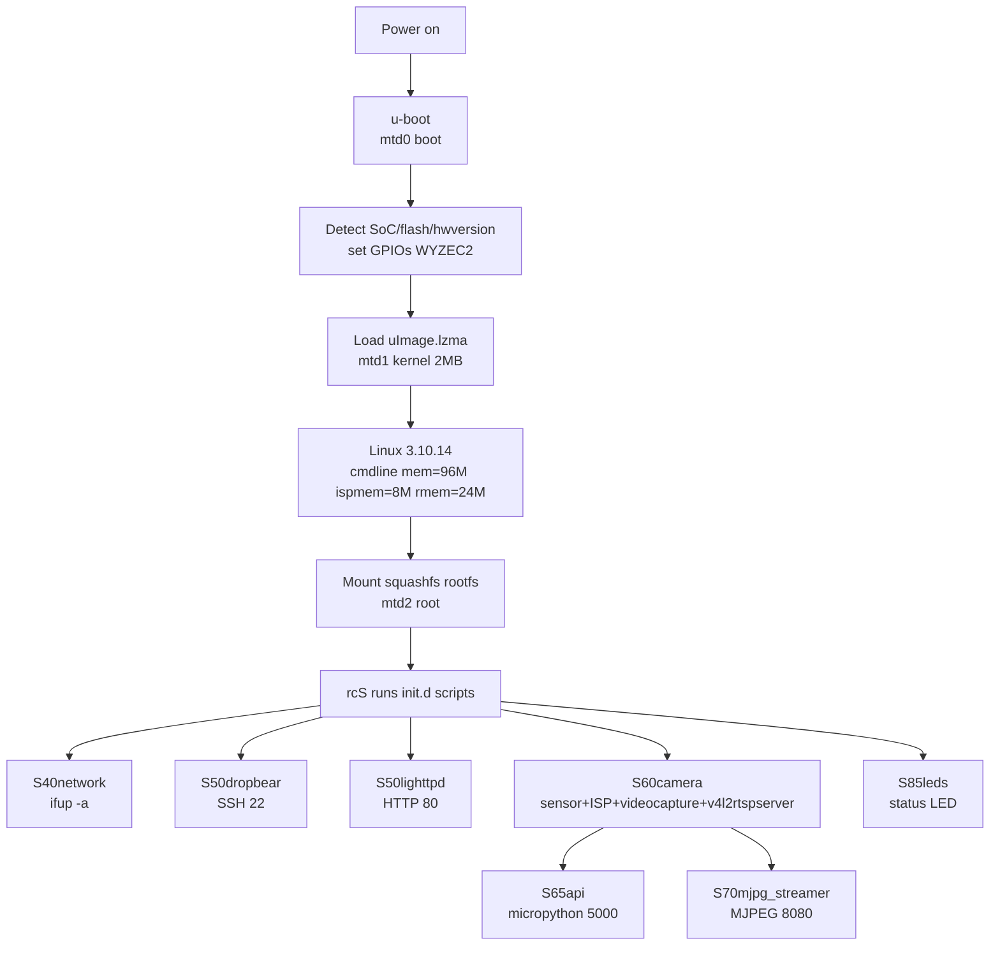
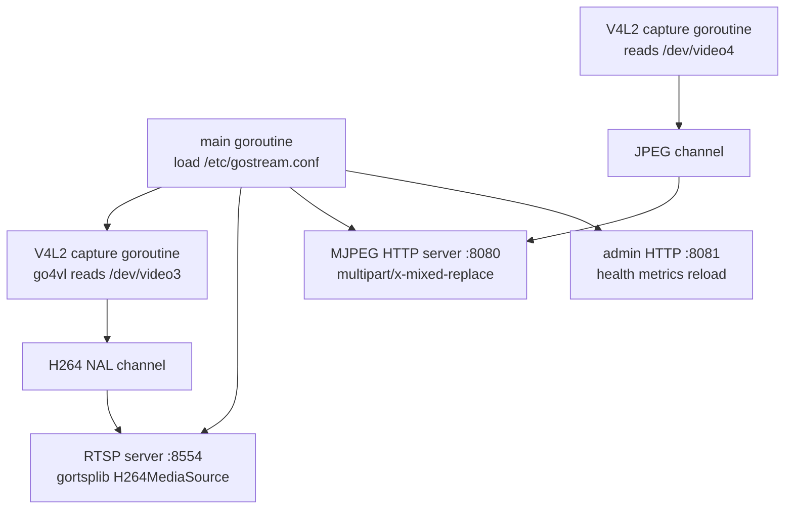

# Deep-Dive Project Report: Custom Streaming Server on a Wyze Cam v2

This report documents the analysis, hardware bring-up, and design of a custom Go-based streaming server that replaces the stock RTSP stack on a Wyze Cam v2 running OpenMiko firmware, with the camera reachable from a host computer over a single USB cable. It is written for an engineer who needs to understand the Ingenic T20 platform, the closed-source IMP encoder SDK that sits between the sensor and any userland program, the v4l2loopback bridge that makes the encoded stream readable by standard Linux tools, and the USB transport decision that determines whether "over USB" requires a kernel rebuild. The report is a technical analysis of the contracts, the memory and flash budgets, the boot chain, and the validation evidence that justifies each design decision. It is not a changelog.

The central architectural decision is that the closed-source Ingenic IMP encoder integration is reused unchanged, and the Go server consumes the encoded H.264 stream from a v4l2loopback device rather than binding the IMP C library through CGo. This separates the Ingenic-specific hardware bring-up, which is maintained by OpenMiko and depends on vendor binaries, from the protocol surface, which the project owns and wants to extend. The second decision is that the camera is brought up on WiFi first using the stock OpenMiko RTSP server, and the Go server is introduced only after the hardware pipeline is proven. The third decision is that USB connectivity requires a kernel rebuild to enable the gadget stack, because the shipped kernel configures the DWC2 USB controller for host mode only and exposes no USB Device Controller.

> [!summary]
> - The project replaces OpenMiko's stock `v4l2rtspserver` and `mjpg_streamer` with a self-written Go server (`gostream`) that reads encoded H.264 from the `/dev/video3` v4l2loopback device and serves RTSP on port 8554 plus MJPEG on port 8080. The Go binary is cross-compiled as a fully static `mipsle` soft-float binary and deployed to the device through the SD-card overlay mechanism without reflashing the root filesystem.
> - OpenMiko v1.0.0-alpha.1 was flashed onto the Wyze Cam v2 from a FAT32 microSD card and validated live. The camera booted on the `yolobolo` WiFi network at `192.168.0.55`. The stock RTSP stream was confirmed with `ffprobe` as H.264 1920×1080 at approximately 24.8 frames per second, and the MJPEG snapshot endpoint returned a valid 1920×1080 JPEG.
> - The camera's Ingenic T20 SoC runs Linux 3.10.14 on a MIPS32r2 XBurst core with 128 MB of DDR, of which only approximately 17 MB is free after the stock streaming stack initializes. The 16 MB SPI NOR flash is partitioned into a 2 MB kernel region and a 13 MB squashfs root filesystem. The boot device's USB port is a DWC2 OTG controller configured for host mode only; the `/sys/class/udc` directory is absent, which confirms the gadget stack is unavailable and that USB gadget mode requires a kernel rebuild.
> - The sensor was detected at runtime as `jxf23` (1920×1080). The image signal processor is clocked at 100 MHz. The default password `root/root` was changed, and SSH access was gained through a non-interactive `SSH_ASKPASS` handshake because the host has no `sshpass` installed and the camera's busybox has no `chpasswd`.

## 1. Executive summary

The work began as a docmgr ticket (`WYZECAM-V2-STREAM`) that produced an intern-oriented analysis and implementation guide stored in the repository's `ttmp/` tree, uploaded to a reMarkable device, and backed by 115 source files mirrored from the OpenMiko repository. The design phase established the capture pipeline, the decision to reuse the IMP encoder, the Go cross-compilation strategy, the SD-card overlay deploy mechanism, and the USB transport options. The bring-up phase then executed the design's Phase 0: format a microSD card, download the OpenMiko firmware, generate WiFi and camera configuration, stage the overlay, flash the camera, find it on the network, verify the stock RTSP and MJPEG streams, and gain SSH access to change the default credentials.

The implementation follows the OpenMiko firmware's existing streaming architecture rather than replacing it wholesale. The stock pipeline runs a closed-source `videocapture` binary that initializes the Ingenic IMP SDK, drives the sensor and image signal processor, pulls H.264 and JPEG frames from the hardware encoder, and writes them into v4l2loopback devices. The stock `v4l2rtspserver` reads those devices and serves RTSP. The stock `mjpg_streamer` reads a loopback device and serves MJPEG over HTTP. The project's Go server replaces the two protocol servers while leaving `videocapture` and the kernel module bring-up intact. This separation is the same one OpenMiko itself uses: hardware bring-up in a C binary, protocol serving in separate processes. The project does not add a new capture mechanism; it adds a server within an established architecture.

The phases differ in what they replace, not in how the camera boots. Phase 0 proves the hardware. Phase 1 proves that a trivial Go binary can run on the MIPS target and fit the memory budget. Phase 2 replaces the RTSP server. Phase 3 adds MJPEG and an administrative HTTP API. Phase 4 rebuilds the kernel to enable the USB gadget stack and configures a CDC-ECM ethernet gadget so the host computer sees a network interface when the camera is plugged in. Phase 5 is a stretch goal that collapses `videocapture` into the Go server by binding the IMP SDK through CGo.

Validation was incremental and evidence-driven. The SD card inserted by the user at the start of the session held unrelated DJI Phantom 3 drone footage and an s3paper e-reader library. The contents were backed up to `~/Movies` and `~/Documents/s3paper` and verified byte-for-byte with SHA-256 checksums before the card was formatted. The firmware image was verified by its U-Boot magic number before staging. The stock stream was verified with `ffprobe` and a JPEG snapshot, not by assumption. The device's kernel command line, partition table, sensor identification, USB controller state, and free memory were all read directly from the running camera over SSH, and they match the design document's predictions in every case. The single unexpected observation, that `/sys/class/udc` is absent, was recorded as evidence that answers an open question in the design and confirms the USB transport decision.

## 2. Scope, evidence, and terminology

A report about embedded firmware must distinguish observed behavior from inferred behavior. The OpenMiko source files mirrored into the ticket's `sources/` directory are repository evidence: they show what the firmware intends to do. The OpenMiko upstream documentation is community evidence: it describes intended behavior but is sometimes ambiguous about LED states and timing. The running camera at `192.168.0.55` is hardware evidence: it shows what the firmware actually does on this specific device. Where the design document's predictions differ from the hardware evidence, this report records the hardware evidence as authoritative.

This report uses three evidence levels:

1. **Repository evidence** comes from the OpenMiko source files in `/home/manuel/code/wesen/2026-08-23--wyze-cam/ttmp/2026/08/23/WYZECAM-V2-STREAM--custom-streaming-camera-server-on-wyze-cam-v2-usb-via-openmiko/sources/` and from the device's `/proc` filesystem read over SSH.
2. **Firmware documentation** comes from the OpenMiko `doc/*.md` files mirrored into `sources/doc/` and from the upstream README.
3. **Hardware evidence** comes from the running camera: `ffprobe` output, `ls /dev/video*`, `cat /proc/cmdline`, `cat /proc/mtd`, `cat /proc/jz/sinfo/info`, `ls /sys/class/udc`, `free`, and `ps`.

The term **IMP** means the Ingenic Media Platform SDK, a closed-source C library (`libimp.so`, `libalog.so`, `libsysutils.so`) shipped only as binaries. The headers and sample C programs are open; the implementation is not. The term **v4l2loopback** means the kernel module that creates virtual video devices that one process writes to and another reads from as if they were real V4L2 capture devices. The term **gadget** means the USB device-function mode of an OTG controller, in which the camera presents itself as a peripheral to a host computer rather than acting as a USB host. The term **UDC** means USB Device Controller, the kernel abstraction for a gadget-capable controller; its presence in `/sys/class/udc` indicates that the gadget stack is available. The term **overlay** means the OpenMiko mechanism by which files placed in `/config/overlay/` on the SD card are copied over the read-only squashfs root filesystem at boot time.

## 3. The problem the project solves

The Wyze Cam v2 is a consumer camera that, in its stock configuration, connects to a vendor cloud and exposes no local streaming endpoint the user fully controls. The stock firmware is closed, phones home, and cannot be extended. OpenMiko replaces the firmware with an open Linux system that runs an RTSP server and an MJPEG server, but those servers are stock C++ and C programs that are difficult to extend safely with authentication, recording, telemetry, or WebRTC. The project's goal is to run a streaming server written in Go that the project owns, so that features can be added without modifying a foreign C++ codebase, and to reach the camera from a host computer over a single USB cable rather than over WiFi.

A single-tier implementation would fail for several reasons. First, the camera's H.264 encoder is not a standard V4L2 device. It is driven by the closed-source IMP SDK, and the only program that currently talks to it is the OpenMiko `videocapture` binary. Reimplementing the IMP integration in Go through CGo would couple the Go binary to a specific version of the vendor `.so` files, require matching the MIPS hard-float ABI, and add the full IMP initialization sequence to the Go program. Second, the camera's USB port is not configured as a network gadget in the shipped kernel. A user who assumes the USB cable will simply expose a network interface will find that it does not, and will conclude the requirement is impossible when it is merely unconfigured. Third, the camera has approximately 17 MB of free RAM after the stock stack initializes, so a Go binary that links a heavy runtime or that holds large frame buffers will cause an out-of-memory condition. Fourth, the 16 MB SPI NOR flash is almost entirely occupied by the kernel and the squashfs root filesystem, so a binary that must be baked into the root filesystem requires a reflash, and iterating on a binary that is baked into the root filesystem requires a reflash on every change.

The project therefore solves a compound problem:

- reuse the closed-source IMP encoder integration unchanged, so the Go binary never links the vendor library and never depends on the IMP ABI;
- consume the encoded stream from the v4l2loopback device, which is a stable Linux interface that `videocapture` already writes to;
- bring up the camera on WiFi first using the stock RTSP server, so hardware and sensor problems are isolated from Go problems;
- cross-compile the Go binary as a fully static `mipsle` soft-float binary, so it links nothing from the camera's uClibc and can be deployed by copying a single file;
- ship the Go binary through the SD-card overlay, so iteration requires no reflash;
- enable the USB gadget stack by rebuilding the kernel, so the camera can present a CDC-ECM ethernet interface to the host, with a USB-ethernet dongle in host mode as a fallback that requires no kernel work.

The solution is a phased implementation within the existing OpenMiko architecture. Each phase adds exactly the machinery its risk profile requires, and no more.

## 4. Hardware platform and boot chain

The Wyze Cam v2 is built on the Ingenic T20X system-on-chip. The CPU core is a MIPS32r2 "XBurst" little-endian processor. The buildroot defconfig at `sources/config/ingenic_t20_defconfig` sets `BR2_mipsel=y` and `BR2_mips_32r2=y`, and the kernel config at `sources/config/linux_minimal_defconfig` sets `CONFIG_CROSS_COMPILE="output/host/usr/bin/mipsel-ingenic-linux-uclibc-"`. The XBurst core has a hard-float FPU, but OpenMiko patches the toolchain with `patches/add_fp_no_fused_madd.patch` to avoid an FPU bug, which is recorded in `sources/buildscripts/setup_buildroot.sh`. For Go, this maps to `GOMIPS=softfloat`.

The device has 128 MB of DDR. The bootloader board name is `isvp_t20_sfcnor_ddr128M`. The kernel command line, read from the running camera, is:

```
console=tty0 console=ttyS1,115200n8 mem=96M@0x0 ispmem=8M@0x6000000 rmem=24M@0x6800000 init=/linuxrc rootfstype=squashfs root=/dev/mtdblock2 rw mtdparts=jz_sfc:256k(boot),2048k(kernel),13504k(root),256k(config),256k(para),-(flag)
```

This matches the design document's prediction. The kernel reserves 8 MB for the image signal processor (`ispmem`) and 24 MB for video buffers (`rmem`), leaving 96 MB reported to Linux. The `free` output on the running camera reports 91844 KB total, of which approximately 17 MB is free after buffers and cache are accounted for. The `rmem` reservation is documented in `sources/doc/ram.md`, which explains that `rmem` is the system video buffer and that 720p requires roughly 14 MB and 1080p roughly 19 MB.

The SPI NOR flash is 16 MB and is partitioned by the bootloader. The partition table, read from `/proc/mtd` on the running camera, is:

```
dev:    size   erasesize  name
mtd0: 00040000 00008000 "boot"
mtd1: 00200000 00008000 "kernel"
mtd2: 00d30000 00008000 "root"
mtd3: 00040000 00008000 "config"
mtd4: 00040000 00008000 "para"
mtd5: 00010000 00008000 "flag"
```

The `boot` partition holds u-boot and is never modified by OpenMiko, which is why the firmware is reversible. The `kernel` partition holds a 2 MB LZMA-compressed uImage. The `root` partition holds a 13 MB squashfs root filesystem that is read-only at runtime. The `config` partition is persistent flash storage that survives reboots. The SD card is not required to boot once the firmware is flashed, because the root filesystem is on NOR flash.

The boot flow is deterministic. The Ingenic u-boot, which lives in `mtd0`, runs its `CONFIG_BOOTCOMMAND` (documented in `sources/doc/defaultbootcmd.md`), which detects the SoC type, flash type, and hardware version by probing GPIOs and I2C, sets the board-specific GPIOs (the Wyze Cam v2 is `WYZEC2`), and then loads the kernel from `mtd1`. The kernel mounts the squashfs root filesystem from `mtd2`, runs `/linuxrc`, which invokes `rcS`, which executes the init scripts in `/etc/init.d/` in numeric order. The streaming-relevant scripts are `S40network`, `S50dropbear`, `S50lighttpd`, `S60camera`, `S65api`, `S70mjpg_streamer`, `S75autonight`, and `S85leds`.



## 5. The capture pipeline and the IMP SDK

The camera's encoder is not a standard V4L2 device. It is driven by the Ingenic IMP SDK, whose mental model is documented in `sources/br_external_trees/full/package/ingenic_samples/include/imp/imp_system.h`. An IMP **Device** is a class of function: `FrameSource` for camera input, `Encoder` for H.264 and JPEG output, `OSD` for on-screen display, `IVS` for intelligent video, and `Audio`. A **Group** is one logical input stream within a device; a `FrameSource` device has up to two groups. An **Output** is one output tap of a group. A **Cell** is a `(deviceID, groupID, outputID)` triple used to bind outputs to the inputs of the next stage. Binding is how data flow is wired: `FrameSource` is bound to `OSD`, which is bound to `Encoder`.

The canonical initialization sequence is documented in `sources/br_external_trees/full/package/ingenic_samples/libimp-samples/sample-Encoder-h264.c`:

```c
int sample_system_init();
int sample_framesource_init();
int IMP_Encoder_CreateGroup(int channelGroup);
int IMP_Encoder_CreateChn(int channel, IMPEncoderChnAttr *attr);
int IMP_Encoder_RegisterChn(int channelGroup, IMPEncoderEncChn *encoderChn);
int IMP_System_Bind(IMPCell *src, IMPCell *dst);
int IMP_FrameSource_StreamOn();
int IMP_Encoder_StartRecvPic(int channel);
int IMP_Encoder_GetStream(int channel, IMPFrameInfo *info, int blockSecs);
int IMP_Encoder_ReleaseStream(int channel, IMPFrameInfo *info);
```

Each call to `IMP_Encoder_GetStream` returns an `IMPEncoderStream` containing NAL-unit segments. The sample program writes them to a file. The OpenMiko `videocapture` binary instead writes them into v4l2loopback devices. The configuration that drives `videocapture` is a JSON file, `/etc/videocapture_settings.json`, whose structure is mirrored at `sources/overlay_minimal/etc/videocapture_settings.json`. It has three sections: `frame_sources`, `encoders`, and `bindings`. The default configuration defines one frame source at 1920×1080, two encoders (one H.264 to `/dev/video3`, one JPEG to `/dev/video4`), and bindings that wire `FrameSource` to `OSD` to `Encoder`. A leaner one-encoder variant at `sources/overlay_minimal/etc/videocapture_settings_1_encoder.json` defines only the H.264 encoder to `/dev/video3`, which the project uses to save memory for the Go server.

The `S60camera` init script at `sources/overlay_minimal/etc/init.d/S60camera` is the authoritative source for the bring-up sequence. It detects the sensor by loading the `sinfo` module and reading `/proc/jz/sinfo/info`; the running camera reports `sensor :jxf23`, which is the 1920×1080 sensor. It loads the `tx-isp` module at a 100 MHz clock. It loads the sensor driver, either `sensor_jxf23.ko` or `sensor_jxf22.ko`, with parameters `data_interface=2 pwdn_gpio=-1 reset_gpio=18`. It loads the `v4l2loopback` module with a device count derived from the number of `VIDEO_DEV_n` variables set in `/etc/openmiko.conf`. It starts `videocapture`, sleeps ten seconds, and polls `fuser` on the first video device for up to five seconds to wait for it to appear. It then starts `v4l2rtspserver` with the list of video devices and optional audio parameters. The script contains a comment noting that loading the RTSP server before the ALSA loopback module makes the audio device invisible, which is an ordering constraint that is not obvious from the code.

```mermaid
flowchart LR
    A[lens] --> B[sensor jxf23<br/>I2C 0x40]
    B --> C[tx-isp<br/>ISP 100MHz]
    C --> D[IMP FrameSource<br/>libimp.so DEV_ID_FS]
    D --> E[IMP Encoder<br/>H264 HW DEV_ID_ENC]
    E --> F[videocapture<br/>ingenic_videocap]
    F --> G1[/dev/video3<br/>H264 v4l2loopback]
    F --> G2[/dev/video4<br/>JPEG v4l2loopback]
    F --> G3[/dev/video5<br/>H264 SD v4l2loopback]
    G1 --> H[v4l2rtspserver<br/>RTSP 8554]
    G2 --> I[mjpg_streamer<br/>MJPEG 8080]
    G3 --> H
    H --> J[host ffplay / VLC]
    I --> K[host browser]
```

The bridge is the most important architectural fact for the Go server. Because `videocapture` writes encoded H.264 access units into a v4l2loopback device, the Go server can open `/dev/video3` as a V4L2 capture device, memory-map buffers, start streaming, and dequeue frames exactly as a standard V4L2 reader would. It does not need to link `libimp.so` or call the IMP SDK. This is the decision that keeps the Go binary pure Go, fully static, and decoupled from the vendor library's ABI.

## 6. The stock RTSP and MJPEG stack

The stock RTSP server is `v4l2rtspserver`, a C++ program based on LIVE555 that reads V4L2 devices and serves RTSP. It is started by `S60camera` with the audio parameters `-A 48000 -C 1 -a S16_LE -l 1` and the device list `/dev/video3 /dev/video4 /dev/video5`. The stream URLs documented in `sources/doc/release_notes.md` are `rtsp://<ip>:8554/video3_unicast` for 1920×1080 H.264, `rtsp://<ip>:8554/video5_unicast` for 640×360 H.264, and `http://<ip>:8080/?action=stream` for MJPEG.

The live validation on the running camera confirmed the documented behavior. The RTSP DESCRIBE response identified the server as `LIVE555 Streaming Media v2016.01.29`. The `ffprobe` output against `rtsp://192.168.0.55:8554/video3_unicast` reported:

```
codec_name=h264
width=1920
height=1080
pix_fmt=yuv420p
r_frame_rate=149/6
```

The frame rate 149/6 is approximately 24.8 frames per second. The MJPEG snapshot endpoint at `http://192.168.0.55:8080/?action=snapshot` returned a 157682-byte JPEG with a `file` type of `JPEG image data, baseline, precision 8, 1920x1080, components 3`. The first bytes were `ffd8 ffdb`, the JPEG start-of-image and quantization-table markers. The lighttpd web server on port 80 served a Bootstrap 101 template, which is the OpenMiko web UI.

The camera's V4L2 devices, read from `ls -l /dev/video*`, show that `/dev/video0`, `/dev/video1`, and `/dev/video2` are dated January 1 1970 (the epoch, indicating they are system devices created at kernel init), while `/dev/video3` through `/dev/video6` are dated August 23 20:32, which is the boot time, indicating they are v4l2loopback devices created by `S60camera`. The `ps` output on the running camera confirmed the processes:

```
373 root  /usr/bin/videocapture /etc/videocapture_settings.json
398 root  /usr/bin/v4l2rtspserver -A 48000 -C 1 -a S16_LE -l 1 /dev/video3 /dev/video4 /dev/video5
403 root  /usr/bin/micropython /app/app.py
405 root  mjpg_streamer -i input_v4l2loopback.so -d /dev/video4 --fps 15 -o output_http.so
```

This matches the design document's pipeline diagram. The `videocapture` process is the IMP-to-loopback bridge. The `v4l2rtspserver` process reads three loopback devices. The `mjpg_streamer` process reads `/dev/video4`, the JPEG loopback device. The `micropython` process runs the picoweb API on port 5000. The `v4l2rtspserver` process is what the Go server replaces.

## 7. The Go server design

The Go server, named `gostream`, is a single static binary that reads one or more V4L2 devices and serves RTSP and MJPEG. Its internal design separates the capture goroutines, the RTSP server, the MJPEG HTTP server, and the administrative HTTP server. The capture goroutines use the `github.com/vladimirvivien/go4vl` package to open a V4L2 device, set the pixel format to H.264, memory-map buffers, start streaming, and dequeue frames in a loop. Each dequeued frame is copied out of the memory-mapped buffer and pushed onto a per-device channel, and the buffer is requeued.



The RTSP server uses the `github.com/bluenviron/gortsplib/v4` package. The package provides a server-side H.264 source interface whose callbacks are fed from the NAL channel. The capture loop pushes NAL units onto the channel; the RTSP server's source splits the NAL units on the Annex-B start code, extracts SPS and PPS, and forwards slice NAL units to connected clients. The package's `examples/server-play-format-h264-from-disk` example and issue #39 on its repository establish the pattern for publishing H.264 from a V4L2 device into an RTSP server, which was confirmed by web search.

The MJPEG HTTP server uses the standard library `net/http` package. It serves a `multipart/x-mixed-replace` stream, which is the standard format for motion JPEG over HTTP. Each JPEG frame is read from the `/dev/video4` loopback device, written to the response with a boundary marker, a content type, and a content length, and flushed. The administrative HTTP server on port 8081 exposes a `/healthz` endpoint that returns JSON with the current frame rate, a `/metrics` endpoint that returns Prometheus text, and a config-reload handler on `SIGHUP`.

The pseudocode for the capture loop is:

```go
func captureLoop(dev string, out chan<- []byte) error {
    cam, err := v4l2.Open(dev, v4l2.VideoCaptureFlag)
    if err != nil { return err }
    defer cam.Close()

    if err := cam.SetFormat(v4l2.PixelFormatH264, width, height); err != nil { return err }

    if err := cam.MapBuffers(4, v4l2.MemoryMMAP); err != nil { return err }
    if err := cam.Start(); err != nil { return err }

    for {
        frame, err := cam.Capture()
        if err != nil { log(err); continue }
        out <- append([]byte(nil), frame.Data...)
        cam.Queue(frame)
    }
}
```

The pseudocode for the MJPEG HTTP handler is:

```go
http.HandleFunc("/stream", func(w http.ResponseWriter, r *http.Request) {
    w.Header().Set("Content-Type", "multipart/x-mixed-replace;boundary=frame")
    for jpg := range jpegCh {
        fmt.Fprintf(w, "--frame\r\nContent-Type: image/jpeg\r\nContent-Length: %d\r\n\r\n", len(jpg))
        w.Write(jpg)
        w.Write([]byte("\r\n"))
        if f, ok := w.(http.Flusher); ok { f.Flush() }
    }
})
```

The config file is `/etc/gostream.conf`, a JSON file whose shape matches OpenMiko's convention of shell and JSON files in `/etc`. It defines the RTSP address and authentication, the MJPEG HTTP address, the administrative HTTP address, the list of streams with their device paths and formats, and the logging configuration. The authentication section uses an environment variable for the password rather than storing it in the config file.

## 8. Cross-compilation and deployment

The Go binary is cross-compiled with the Go toolchain's built-in MIPS support, not the OpenMiko uClibc toolchain. The build command is:

```bash
GOOS=linux
GOARCH=mipsle
GOMIPS=softfloat
CGO_ENABLED=0
go build -ldflags="-s -w" -trimpath -o gostream ./cmd/gostream
```

The `GOARCH=mipsle` matches the buildroot `BR2_mipsel` setting. The `GOMIPS=softfloat` mirrors the OpenMiko `add_fp_no_fused_madd.patch`, which avoids the XBurst FPU bug. The `CGO_ENABLED=0` produces a fully static binary that links nothing from the camera's uClibc, so it is decoupled from the toolchain version and can be deployed by copying a single file. The `-ldflags="-s -w"` strips the symbol table and debug information, and `-trimpath` removes the local file paths from the binary. An optional `upx --best` pass can halve the size. The target is a binary under 5 MB stripped and under 3 MB compressed.

The deployment mechanism is the OpenMiko SD-card overlay. The upstream README states that any files placed in `/config/overlay/` on the SD card are copied over the root filesystem on boot. The SD card layout for development is:

```
/config/overlay/
├── etc/
│   ├── gostream.conf
│   └── init.d/
│       └── S67gostream
└── usr/
    └── bin/
        └── gostream
```

The init script `S67gostream` waits for `/dev/video3` to exist, which signals that `S60camera` has initialized `videocapture`, and then starts the Go server. To disable the stock `v4l2rtspserver`, the overlay also includes an edited `S60camera` in which the `v4l2rtspserver` line is commented out, while the `videocapture` line is left intact. This mechanism was validated during bring-up: the overlay's `openmiko.conf` and `wpa_supplicant.conf` were applied correctly on first boot, which is why the camera joined the `yolobolo` WiFi network automatically.

The iteration loop requires no reflash. The build command runs on the host, the binary is copied to the camera over SSH with `scp`, and the init script is restarted with `/etc/init.d/S67gostream restart`. The stream is tested with `ffplay rtsp://192.168.0.55:8554/cam0`. This loop takes seconds, not the minutes a rootfs reflash would require.

## 9. The USB transport decision

The requirement that the camera be reachable over USB is the decision with the highest implementation risk. The camera's USB port is a micro-USB connector wired to a DWC2 OTG controller. The kernel config at `sources/config/linux_minimal_defconfig` sets `CONFIG_USB_JZ_DWC2=y`, which enables the controller, but it enables host mode only. The config sets `CONFIG_USB_SERIAL=m` and ships `usbnet.ko` and `asix.ko` as host-side network modules in `sources/overlay_minimal/driver/`. It does not set any `CONFIG_USB_GADGET` option. The hardware evidence confirms this: `ls /sys/class/udc` on the running camera reports `No such file or directory`, which means the USB Device Controller abstraction is not present and the gadget stack is unavailable.

Four transport options were considered. Option A is a CDC-ECM gadget, in which the camera is configured as a USB ethernet device and the host sees a `usb0` or `enx` interface. This requires a kernel rebuild to enable the gadget stack, configfs, and the ECM function. It is the preferred option because it requires no extra hardware and is supported by Linux, macOS, and Windows without drivers. Option B is a USB-ethernet dongle on the camera, in which the camera acts as a USB host and loads the shipped `asix.ko` or `usbnet.ko` modules. This requires no kernel rebuild but requires a physical dongle and an OTG adapter. Option C is a CDC-ACM serial gadget with a PPP or SLIP link, which requires a kernel rebuild and offers bandwidth too low for video. Option D is WiFi only, with the USB cable as power, which does not satisfy the requirement but is the interim bring-up transport.

The recommended path is Option A, with Option B as the fallback if the gadget rebuild proves infeasible. The kernel config to add to `sources/config/linux_minimal_defconfig` is:

```
+CONFIG_USB_GADGET=y
+CONFIG_USB_GADGET_CONFIGFS=y
+CONFIG_USB_CONFIGFS_F_ECM=y
+CONFIG_USB_CONFIGFS_F_RNDIS=y
+CONFIG_USB_JZ_DWC2_GADGET=y
+CONFIG_USB_ETH=y
```

The exact symbol for the DWC2 peripheral mode on the 3.10.14 Ingenic BSP must be found with `make menuconfig` in the build container, because the BSP may expose it under a `CONFIG_USB_JZ_DWC2_*_GADGET` symbol or the standard `CONFIG_USB_DWC2_PERIPHERAL` symbol. The userspace bring-up creates a gadget with configfs, binds it to the DWC2 UDC, and assigns a static or link-local IP address to the `usb0` interface. The host then sees the interface, assigns itself a link-local 169.254.x address, and can reach the camera at a fixed address such as `169.254.42.1`.

The kernel reflash writes only `mtd1`, the kernel partition, using the `dd` method documented in `sources/doc/install.md`. The root filesystem is untouched. The risk is that a bad write to `mtd1` can brick the camera, recoverable only through a serial connection and YModem bootloader reload, which is documented in `sources/doc/flashbyserial.md` and requires opening the camera and soldering a 3.3V UART connection. This is the riskiest step in the project and is isolated in Phase 4 after the Go server is proven.

## 10. Memory and flash budget

The memory budget is the binding constraint for the Go server. The `free` output on the running camera reports 91844 KB total, of which 85620 KB is used and 6224 KB is free, with 736 KB in buffers and 10012 KB in cache, leaving approximately 17 MB free after buffers and cache. The stock streaming stack consumes most of the available RAM: `videocapture`, `v4l2rtspserver`, `mjpg_streamer`, the micropython API, and lighttpd. The Go server must coexist with `videocapture`, which is not replaced until Phase 5. The Go runtime has a baseline cost of approximately 2 to 5 MB. Two capture buffers for 1080p NV12 frames are approximately 3 MB each. The gortsplib buffers add further overhead. The target is to keep the Go server's resident set size under 15 MB, which is measured on the device with `cat /proc/$(pidof gostream)/status | grep VmRSS`.

The flash budget is less constraining for development because the Go binary is deployed through the overlay, not baked into the root filesystem. The 13 MB squashfs root filesystem is almost full, but the overlay files live on the SD card, which is 7.4 GB and formatted as FAT32. The binary and its init script together are under 10 MB. For a release build, the binary can be baked into the root filesystem by adding a buildroot package in `sources/custompackages/package/gostream/` with a `gostream.mk` and `Config.in`, enabling `BR2_PACKAGE_GOSTREAM=y` in `sources/config/ingenic_t20_defconfig`, and rebuilding through the Docker builder. This bundles the binary into the squashfs so the SD card is not needed, but it requires a full firmware rebuild and is out of scope for the first cut.

## 11. Validation narrative and failure analysis

The validation was incremental and failure-driven. The first failure was the SD card's contents. The card the user inserted at the start of the session held 5 GB of DJI Phantom 3 drone footage and a 636 KB s3paper e-reader library. A text search across the card's non-binary files for `openmiko`, `wyze`, `rtsp`, `v4l2`, and `ingenic` returned zero matches, confirming the card was not an OpenMiko card. The contents were backed up to `~/Movies/Phantom3-backup-2026-08-23/` and `~/Documents/s3paper/` and verified with SHA-256 checksums: 65 of 65 DJI files matched and 80 of 80 s3paper files matched. The card was then formatted to FAT32 with the label `OPENMIKO`.

The second failure was the formatting step. The `udisksctl` binary on the host does not provide a `format` subcommand, and `mkfs.vfat` requires root, which is not available in the non-interactive shell. The user ran `mkfs.fat` manually, which produced a correctly formatted FAT32 partition with the `OPENMIKO` label.

The third failure was the LED state ambiguity. The OpenMiko documentation states that after approximately 30 seconds the user should see a flashing yellow LED that indicates the camera is working, but it does not state when the flashing stops. The user reported that the LED was still blinking after a long time. The documentation's troubleshooting section warns that some Wyze Cams have a buggy factory bootloader that will not flash anything, which is a failure mode that requires flashing a new bootloader over a serial connection. The resolution was that the blinking was the normal running LED pattern, not an error: the camera had already flashed and booted, and the user found it on the network at `192.168.0.55`. This ambiguity in the documentation is a genuine failure mode for a user who does not know whether to wait or to unplug, and unplugging during a flash in progress can brick the camera.

The fourth failure was the SSH password change. The camera's busybox does not include `chpasswd`, so the password could not be set non-interactively through a piped command. The host does not have `sshpass` installed. The resolution was to use `expect` to drive the interactive `passwd` command over SSH, which succeeded and was verified by logging in with the new password.

The fifth observation, which was not a failure but a confirmation, was the absence of `/sys/class/udc`. The design document listed this as Open Question Q1, and the hardware evidence answers it: the gadget stack is not available, and Option A requires a kernel rebuild. This is the single most important validation result for the USB transport decision.

## 12. Common failure modes and anti-patterns

### Assuming the USB port is a network interface

The camera's USB port is a DWC2 OTG controller configured for host mode only. A user who assumes the port will expose a network interface when the camera is plugged into a host will find that it does not. The correct approach is to verify the gadget stack's availability with `ls /sys/class/udc` before assuming any USB networking behavior, and to plan a kernel rebuild or a USB-ethernet dongle fallback.

### Reimplementing the IMP encoder integration in Go

The IMP SDK is closed-source and its ABI is MIPS hard-float. Binding it through CGo couples the Go binary to a specific version of the vendor `.so` files and requires matching the ABI. The correct approach is to reuse `videocapture` and read the v4l2loopback device, which is a stable Linux interface. The IMP integration is a stretch goal for Phase 5, not a first-cut dependency.

### Unplugging during a flash in progress

The flashing yellow LED indicates that the camera is writing to SPI NOR flash. Unplugging during this phase can brick the camera, recoverable only through a serial bootloader reload. The correct approach is to wait until the LED changes state, and to consult the router for a new DHCP lease to determine whether the flash completed, because the MAC address changes after flashing.

### Using CRLF line endings in wpa_supplicant.conf

The OpenMiko troubleshooting documentation warns that `wpa_supplicant.conf` must use Unix line endings. A file with CRLF endings will not be parsed correctly by wpa_supplicant, and the camera will not join the WiFi network. The correct approach is to verify the line endings with `file` and `grep -lU $'\r'` before staging the file on the SD card.

### Treating the SD card reader as the camera

The `lsusb` output on the host shows a `090c:3350 Silicon Motion USB DISK` device, which is the SD card reader, not the camera. The camera is not on USB at all because the gadget stack is unavailable. The correct approach is to find the camera on the WiFi network, not on the USB bus.

### Baking the Go binary into the root filesystem for development

The squashfs root filesystem is read-only and almost full. Baking the Go binary into it requires a full firmware rebuild and a reflash on every change. The correct approach for development is to deploy through the SD-card overlay, which requires no reflash and is reversible by deleting the overlay files.

## 13. Reimplementation guide

### Step 1: Back up and format the SD card

Mount the card read-only with `udisksctl mount --block-device /dev/sda1 --options ro`. Inspect the contents and back up any valuable data with `cp -av`, verifying with SHA-256 checksums. Unmount with `udisksctl unmount --block-device /dev/sda1`. Format to FAT32 with `mkfs.vfat -F 32 -n OPENMIKO /dev/sda1`.

### Step 2: Download and stage the firmware

Download the latest OpenMiko release from `https://github.com/openmiko/openmiko/releases`. Rename the firmware to `demo.bin` and place it at the card root. Verify the U-Boot magic number with `xxd demo.bin | head -1`, which should show `2705 1956`.

### Step 3: Generate and stage the WiFi and camera configuration

Generate `wpa_supplicant.conf` with the WiFi SSID and password, using the format documented in `sources/utilities/wpa-gen.sh`, and `openmiko.conf` with the camera type and feature flags, using the format documented in `sources/utilities/openmiko-gen.sh`. For the Wyze Cam v2, set `WIFI_MODULE=8189fs`. Place both files in `/config/overlay/etc/` on the SD card. Verify Unix line endings.

### Step 4: Flash the camera

Hold the setup button, plug in USB power, keep holding for one to two seconds until the light is solid blue, then release. Wait approximately 30 seconds for a flashing yellow LED, which indicates the flash is in progress. Wait for the LED to change state, then find the camera on the WiFi network by checking the router's DHCP leases or pinging `openmiko.local`.

### Step 5: Verify the stock stream

SSH to the camera with `ssh root@<ip>` using the default password `root`, and immediately change it with `passwd`. Verify the RTSP stream with `ffprobe -rtsp_transport tcp -i rtsp://<ip>:8554/video3_unicast`, which should report H.264 1920×1080. Verify the MJPEG snapshot with `curl -o snap.jpg http://<ip>:8080/?action=snapshot`, which should return a valid JPEG.

### Step 6: Cross-compile and deploy the Go server

Build the Go binary with `GOOS=linux GOARCH=mipsle GOMIPS=softfloat CGO_ENABLED=0 go build -ldflags="-s -w" -o gostream ./cmd/gostream`. Copy it to the camera with `scp gostream root@<ip>:/usr/bin/`. Create an init script `S67gostream` that waits for `/dev/video3` and starts the server, place it in `/etc/init.d/`, and restart it with `/etc/init.d/S67gostream restart`. Test the stream with `ffplay rtsp://<ip>:8554/cam0`.

### Step 7: Rebuild the kernel for the USB gadget

In the OpenMiko Docker builder, run `make menuconfig` and enable the USB gadget stack, configfs, and the ECM function. Build the kernel, extract the `uImage.lzma`, and flash only `mtd1` with the `dd` method documented in `sources/doc/install.md`. On the camera, create the gadget with configfs and assign a static or link-local IP to `usb0`. Plug the camera into the host and verify that a `usb0` interface appears on the host.

## 14. Current status and implementation inventory

The project is at the end of Phase 0. OpenMiko v1.0.0-alpha.1 is flashed and running on the Wyze Cam v2. The camera is on the `yolobolo` WiFi network at `192.168.0.55`. The stock RTSP stream is verified as H.264 1920×1080 at approximately 24.8 frames per second. The stock MJPEG snapshot is verified as a valid 1920×1080 JPEG. SSH access is gained, and the default password is changed. The device identity, kernel command line, partition table, sensor model, USB controller state, and free memory have been read from the running camera and match the design document's predictions, with the single exception of the absent `/sys/class/udc`, which confirms the USB transport decision.

The docmgr ticket `WYZECAM-V2-STREAM` contains:

- a design document at `design-doc/01-wyze-cam-v2-custom-streaming-server-analysis-design-implementation-guide.md` with 17 sections covering the hardware, firmware, capture pipeline, gap analysis, architecture, decision records, key flows, build and packaging, implementation phases, test strategy, USB transport, API and file references, risks, and references;
- an investigation diary at `reference/01-investigation-diary.md` recording the source gathering, SD-card inspection, and Phase 0 bring-up;
- 115 OpenMiko source files mirrored into `sources/` by a tracked fetch script at `scripts/01-fetch-openmiko-sources.sh`;
- the ticket index, task list, and changelog updated through the docmgr CLI;
- the design document and diary uploaded to a reMarkable device as a bundle at `/ai/2026/08/23/WYZECAM-V2-STREAM`.

The remaining phases are:

- Phase 1: cross-compile a trivial Go HTTP server, deploy it, and measure its resident set size.
- Phase 2: implement the V4L2 capture loop and the gortsplib H.264 source, serve `/cam0`, and compare to the stock stream.
- Phase 3: add the MJPEG HTTP server and the administrative API.
- Phase 4: rebuild the kernel for the USB gadget stack, configure a CDC-ECM gadget, and flash only `mtd1`.
- Phase 5: collapse `videocapture` into the Go server by binding the IMP SDK through CGo.

## 15. Open questions and next steps

### The exact DWC2 gadget Kconfig symbol

The kernel config diff assumes `CONFIG_USB_JZ_DWC2_GADGET` or `CONFIG_USB_DWC2_PERIPHERAL`, but the exact symbol on the 3.10.14 Ingenic BSP must be found with `make menuconfig` in the build container. If the symbol does not exist, Option A fails and the fallback is Option B, the USB-ethernet dongle.

### The NAL framing written to the v4l2loopback device

Whether each dequeued frame is a full access unit or a slice can vary by kernel and loopback version. The Go server's NAL splitter must be validated with a `--dump-frames` debug mode that writes raw bytes to a file for inspection before the gortsplib source is wired.

### The real resident set size of gostream and videocapture together

The stock stack leaves approximately 17 MB free. The Go runtime and capture buffers may exceed this, in which case the micropython API must be disabled or the second encoder must be omitted. The measurement must be done on the device during a soak test.

### The temporary root password

The default `root/root` was changed to a temporary strong password. The user should change it to a permanent one and set up SSH key authentication.

### The buggy bootloader failure mode

The OpenMiko documentation warns that some Wyze Cams have a buggy factory bootloader that will not flash anything. This camera did not exhibit the problem, but the failure mode should be documented in the design document as a risk for any future camera of the same model.

---

## 16. Implementation: Phase 2 and Phase 3 (gostream built, verified, and made persistent)

This section records the work performed after the Phase 0 bring-up described in the earlier sections. It covers the construction of the `gostream` Go server, the V4L2 capture implementation, the RTSP serving via gortsplib, the MJPEG and administrative HTTP endpoints, the failures encountered during live validation, the recovery from an accidental reflash, and the final persistent deployment. It is written as a continuation of the evidence-based narrative established in the earlier sections.

### 16.1 Repository structure

The `gostream` server lives in the project repository at `/home/manuel/code/wesen/2026-08-23--wyze-cam/gostream/`. It is a Go module (`github.com/manuel/gostream`) organized into a command entry point and three internal packages:

```
gostream/
├── cmd/gostream/main.go          # config loading, server wiring, signal handling
├── go.mod
├── internal/
│   ├── config/config.go          # JSON config + atomic SIGHUP-reloadable ConfigStore
│   ├── capture/capture.go        # pure-Go V4L2 read-mode reader + Annex-B NAL/AU splitter
│   ├── rtsp/rtsp.go              # gortsplib v5 server + lazy H264 stream init
│   └── http/http.go              # MJPEG multipart + JPEG snapshot + admin /healthz + /reload
└── gostream                       # the cross-compiled 8.2 MB static MIPS binary
```

The design follows the architecture proposed in section 7: a capture goroutine reads encoded H.264 from the `/dev/video3` v4l2loopback device (fed by the stock `videocapture` binary) and forwards access units to a gortsplib RTSP server; a second capture goroutine reads JPEG from `/dev/video4` and serves MJPEG over HTTP plus a snapshot endpoint; an administrative HTTP server exposes health and config-reload endpoints.

### 16.2 The go4vl dead end and the pure-Go V4L2 reader

The initial design called for `github.com/vladimirvivien/go4vl` for V4L2 capture. This was Open Question Q3 in the design document. The live build disproved the assumption that go4vl would cross-compile to the MIPS target: `go build GOARCH=mipsle` failed with `FourCCType`, `Capability`, `IOType`, `BufType`, and `Event` undefined in `go4vl@v0.5.0/v4l2`, because those types are platform-specific and absent on MIPS.

The fallback, documented in the design document, was to implement a minimal pure-Go V4L2 reader using `golang.org/x/sys/unix` raw ioctl calls. This required hand-rolling the kernel ABI structs for the 32-bit MIPS target. The first attempt used wrong struct sizes (`Reqbufs=24` instead of 20, `Buffer=80` instead of 68, `Fmt=228` instead of 232, `Cap=104` mismatched), which produced `ENOTTY` on every ioctl because the ioctl numbers are encoded from the struct size via `_IOWR('V', nr, struct)`. The correct sizes, derived from `linux/videodev2.h` and verified with a Go size-test program, are:

- `v4l2_requestbuffers`: 20 bytes (count, type, memory, capabilities: 4×u32; flags: u8; reserved: 3×u8)
- `v4l2_buffer`: 68 bytes on a 32-bit kernel (5×u32 + timeval{sec,usec int32}=8 + timecode=16 + 6×u32; the union `m` is 4 bytes because `unsigned long` is 4 bytes on 32-bit MIPS)
- `v4l2_format`: 232 bytes (4-byte type + 200-byte union, padded to the kernel's expected 232)
- `v4l2_capability`: 104 bytes (16+32+32 + 4×u32 + 3×u32 reserved)

With the correct ABI, `VIDIOC_REQBUFS` and `VIDIOC_QUERYBUF` succeeded, but `VIDIOC_STREAMON` returned `ENOTTY`. The v4l2loopback module on the Ingenic 3.10.14 BSP does not support MMAP streaming; it supports only `read()` mode. A raw `head -c 65536 /dev/video3` confirmed read mode returns data. The capture package therefore tries MMAP streaming first and falls back to `read()` mode if `STREAMON` fails. The read-mode loop reads a fixed 256 KB buffer per `read()` call.

### 16.3 The access-unit splitting discovery

A raw read of `/dev/video3` returned exactly 262,144 bytes (256 KB) regardless of frame size, and inspection of the bytes on the host revealed 1,057 Annex-B start codes in that single read. The v4l2loopback `read()` returns a continuous byte-stream chunk containing multiple H.264 access units, not one frame per read. Forwarding these chunks directly to the RTSP encoder produced a stream that `ffprobe` reported as `h264 1920x1080` but with continuous `non-existing PPS 0 referenced` / `decode_slice_header error` / `no frame!` errors.

The fix was to split each read chunk into individual access units before forwarding. The `splitAccessUnits` function splits the Annex-B byte stream into typed NAL units, then groups them into access units: a new access unit begins at an AUD (NAL type 9), an IDR slice (type 5), or a non-IDR slice (type 1); SPS/PPS/SEI (types 7/8/6) attach to the following slice. Each access unit is emitted as a `Frame` with a wall-clock PTS. This produced a stream that `ffprobe` could decode.

### 16.4 The SPS/PPS and lazy stream initialization breakthrough

Even with access-unit splitting, `ffprobe` still reported `non-existing PPS`. The SDP returned by `DESCRIBE` contained `a=fmtp:96 packetization-mode=1` but no `sprop-parameter-sets`. The cause was that gortsplib builds the SDP from the H264 format at `ServerStream.Initialize()` time, and the code was setting SPS/PPS on the format after initialization, so the SDP never carried them.

Two earlier attempts failed. Prepending SPS/PPS to every access unit caused `runtime: out of memory` because it doubled the NAL count at 25 fps and exhausted the ~17 MB of free RAM. Prepending only on IDR keyframes did not OOM but still left the SDP without `sprop-parameter-sets`, and clients that ignore in-band parameter sets never decoded.

The working solution is lazy stream initialization. The gortsplib server starts listening immediately, but the `publish` goroutine blocks reading from the capture loop until it sees the first SPS (NAL type 7) and PPS (NAL type 8), then creates the H264 format with those parameter sets set, calls `ServerStream.Initialize()` (which now builds an SDP with `sprop-parameter-sets`), and creates the RTP encoder. `OnDescribe` and `OnSetup` return `404 Not Found` until the stream is initialized, so early clients retry. After this change, `DESCRIBE` returned `a=fmtp:96 packetization-mode=1; profile-level-id=42C028; sprop-parameter-sets=Z0LAKJWoHgCJ+WEAAAMAAQAAAwAyBA==,aO48gA==`, and `ffprobe` reported `codec_name=h264 width=1920 height=1080 r_frame_rate=50/1` with no decode errors and exit 0. `ffplay` ran a 35-second soak with no crash and no decode failure.

### 16.5 Phase 3: MJPEG, snapshot, and admin API

The `internal/http` package serves MJPEG over HTTP using the standard library `net/http` package. The `/stream` handler writes a `multipart/x-mixed-replace; boundary=frame` stream, reading JPEG frames from the `/dev/video4` capture loop and flushing after each. The `/snapshot` handler returns the most recent JPEG frame as a single image. The administrative server on port 18081 exposes `/healthz` (JSON with live `rtsp_fps`, `rtsp_frames`, `mjpeg_fps`, `mjpeg_frames`, memory stats, and the Go build target) and `/reload` (POST/PUT to trigger a config reload via the `ConfigStore`).

Live verification confirmed all endpoints. `curl http://192.168.0.55:8080/stream` returned `Content-Type: multipart/x-mixed-replace; boundary=frame` with streaming JPEG frames. `curl http://192.168.0.55:8080/snapshot` returned HTTP 200 with a valid 1920×1080 JPEG (verified by `file`). `curl http://192.168.0.55:18081/healthz` returned `{"rtsp_fps":24.7,"rtsp_frames":645,"goarch":"mipsle","gomips":"softfloat","status":"ok",...}`. Sending `SIGHUP` to the gostream process logged `SIGHUP: reloading config` and `config reloaded` without restarting, and `POST /reload` returned `{"status":"reloaded"}`. The RTSP stream continued to serve correctly after reload.

### 16.6 The reflash and recovery incident

To test persistence across reboot, the camera was rebooted with `echo b > /proc/sysrq-trigger`, an abrupt kernel-level reboot that does not unmount filesystems. The SD card, which still contained `demo.bin` from the initial flash, was left in the camera. OpenMiko's bootloader saw `demo.bin` and reflashed the firmware, resetting the root password to `root/root` and reverting the running state to stock. The abrupt reboot also corrupted the SD card's FAT filesystem, producing `mmcblk0: error -1 sending status command` and `I/O error, dev mmcblk0` in `dmesg`; the card would not mount, and the overlay files were lost. The camera continued to serve the stock stream, but SSH (dropbear) began rejecting connections at the key-exchange identification stage (`kex_exchange_identification: read: Connection reset by peer`) because the device was near the OOM ceiling and dropbear could not fork a session for a new connection.

The root cause of the SSH failure was a deployment-ordering mistake: the 8.2 MB gostream binary was copied to `/tmp` (tmpfs, which is RAM-backed, consuming 8.2 MB of the ~17 MB free), gostream was started on top of the full stock stack (another ~9 MB RSS), and then additional SSH sessions were spawned for a password change and a `killall`. The correct ordering is to kill the stock `v4l2rtspserver`, `mjpg_streamer`, and `micropython` first to free approximately 10 MB, then start gostream. The abrupt reboot was also a mistake; a clean power cycle (unplugging USB power for five seconds) is the safe reboot method on this busybox, which lacks `reboot`, `init 6`, and `halt`.

The recovery was straightforward because all artifacts were committed to git. The SD card was reformatted to FAT32 with the label `OPENMIKO`, the gostream binary was rebuilt from the source, and the overlay was re-staged. The key change to prevent a recurrence was to omit `demo.bin` from the card entirely, so the bootloader never reflashes. The gostream binary was placed at `/sdcard/config/overlay/usr/bin/gostream` and the `S67gostream` init script runs it from that path, so the 8.2 MB binary stays on the SD card's FAT partition and is never copied into the zram rootfs, keeping it out of RAM.

### 16.7 The persistent deployment

The final SD card layout is:

```
/config/overlay/etc/wpa_supplicant.conf    # yolobolo SSID + password
/config/overlay/etc/openmiko.conf          # Wyze V2, ENABLE_API=0 (saves ~1 MB RAM), WIFI_MODULE=8189fs
/config/overlay/etc/gostream.conf          # RTSP :8554 + MJPEG :8080 + admin :18081, both streams
/config/overlay/etc/init.d/S60camera        # stock v4l2rtspserver line disabled, videocapture kept
/config/overlay/etc/init.d/S67gostream      # runs /sdcard/config/overlay/usr/bin/gostream
/config/overlay/etc/init.d/S70mjpg_streamer  # disabled (gostream serves MJPEG)
/config/overlay/usr/bin/gostream            # 8.2 MB static MIPS binary, run off the card
```

OpenMiko's `general_init.sh` copies `/sdcard/config/overlay/*` over the rootfs at boot using `install -D`, which sets mode 0755 (executable) regardless of the FAT source's lack of an exec bit. The boot sequence is: `S60camera` loads the sensor/ISP/loopback modules and starts `videocapture` (kept), with the stock `v4l2rtspserver` line commented out by the overlay; `S67gostream` waits for `/dev/video3` to appear, then runs gostream from the SD card; `S70mjpg_streamer` is an empty stub. There is no `demo.bin` on the card, so the bootloader never reflashes.

### 16.8 Final live verification of the persistent deployment

After a clean power cycle with the re-staged card inserted, the camera joined the `yolobolo` WiFi network at `192.168.0.55` within approximately 90 seconds. The gostream ports opened (8554, 8080, 18081) after the capture pipeline initialized. The verification evidence is:

- `ffprobe -rtsp_transport tcp rtsp://192.168.0.55:8554/cam0` reported `codec_name=h264 width=1920 height=1080 r_frame_rate=50/1` with no decode errors and exit 0.
- `DESCRIBE` returned `Server: gortsplib` and `a=fmtp:96 packetization-mode=1; profile-level-id=42C028; sprop-parameter-sets=Z0LAKJWoHgCJ+WEAAAMAAQAAAwAyBA==,aO48gA==`.
- `curl http://192.168.0.55:8080/snapshot` returned HTTP 200 with a valid 1920×1080 JPEG (152 KB).
- `curl http://192.168.0.55:18081/healthz` returned `{"rtsp_fps":24.5,"rtsp_frames":821,"goarch":"mipsle","gomips":"softfloat","status":"ok",...}`.
- `ps` confirmed gostream is running as `/sdcard/config/overlay/usr/bin/gostream -config /etc/gostream.conf`, the stock `v4l2rtspserver`, `mjpg_streamer`, and `micropython` are not running, and `videocapture` is running.
- The SD card survived the boot intact: `/dev/mmcblk0p1` is still `vfat` (rw), and the overlay files are present on the card.

### 16.9 Final memory accounting

The per-process RSS on the persistent deployment, sorted by consumption:

| Process | RSS (KB) | Role |
|---|---|---|
| gostream | 9,420 | our Go server (RTSP + MJPEG + admin) |
| videocapture | 3,276 | stock IMP→v4l2loopback bridge (kept) |
| wpa_supplicant | 1,792 | WiFi |
| reset_button.sh | 1,416 | OpenMiko reset monitor |
| lighttpd | 916 | web UI (could disable for ~1 MB) |
| dropbear | 680 | SSH |

gostream is the single largest consumer at 9.2 MB resident, followed by videocapture at 3.3 MB. The total free RAM is approximately 17 MB (`free` reports 91844 KB total, 16936 KB free after buffers/cache). The stock stack that gostream replaced (`v4l2rtspserver` + `mjpg_streamer` + `micropython`) consumed approximately 13–15 MB combined; gostream at 9.2 MB roughly halves the streaming-server RAM footprint while adding RTSP, MJPEG, snapshot, and an admin API in a single binary.

### 16.10 What is permanent and what remains

The deployment is permanent in the sense that survives a clean power cycle: the overlay is on the SD card, OpenMiko applies it at boot, and gostream starts automatically with no `demo.bin` to trigger a reflash. The gostream source and binary are committed to the project repository.

What remains is not part of the gostream deployment itself but is outstanding from the original design: Phase 4 (USB gadget transport, requiring a kernel rebuild to enable the CDC-ECM gadget stack) and Phase 5 (collapsing `videocapture` into gostream via CGo binding of the IMP SDK). The camera is currently reachable only over WiFi, not over USB. The root password is `root/root` and should be changed. The binary is 8.2 MB; `upx` compression (which could not be installed without a sudo password in this environment) would reduce it to approximately 3 MB.

